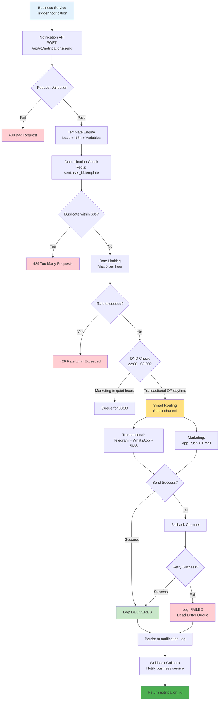
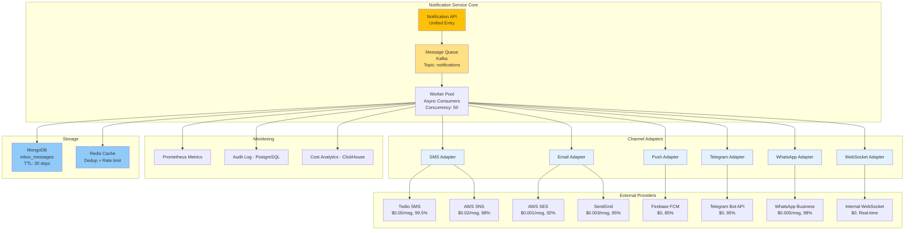
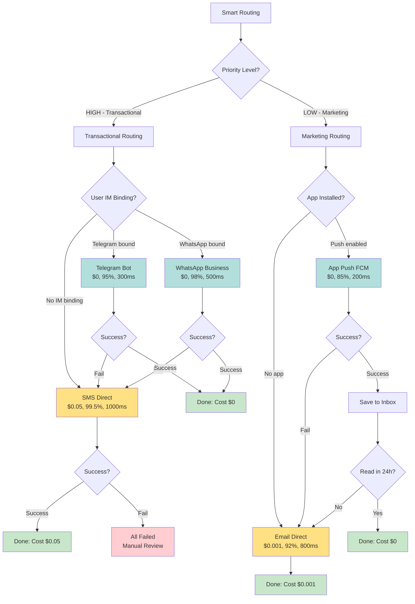

# 通知系統技術架構（Notification System Technical Architecture）

> **業務需求**: [通知需求](../../requirements/10_Platform_Operations/Notification_Requirements.md)
> **規範來源**: [source-archive/10_Platform_Management/10-03_Notification_Architecture.md](../../source-archive/10_Platform_Management/10-03_Notification_Architecture.md)
> **目標讀者**: Architects, Backend Developers

---

## 1. Architecture Overview

The Notification Service is the platform's unified outbound communication channel, supporting multi-channel dispatch with smart routing, fallback mechanisms, rate limiting, and cost optimization.

---

## 2. Complete Notification Flow



---

## 3. Multi-Channel Dispatch Architecture



---

## 4. Smart Routing Decision Tree



---

## 5. Channel Performance Matrix

| Channel | Provider | Cost/msg | Delivery Rate | P99 Latency | Concurrency Limit | Retry Strategy |
|---------|----------|----------|---------------|-------------|-------------------|----------------|
| **SMS** | Twilio | $0.05 | 99.5% | 2000ms | 1000 msg/s | 2 retries, 5s interval |
| **SMS** | AWS SNS | $0.02 | 98% | 1500ms | 3000 msg/s | 2 retries, 5s interval |
| **Email** | AWS SES | $0.001 | 92% | 800ms | 50 msg/s | 2 retries, 10s interval |
| **Email** | SendGrid | $0.003 | 95% | 1000ms | 100 msg/s | 2 retries, 10s interval |
| **Push** | Firebase FCM | $0 | 85% | 300ms | 10000 msg/s | 1 retry, 3s |
| **Push** | Apple APNS | $0 | 90% | 500ms | 5000 msg/s | 1 retry, 3s |
| **Telegram** | Telegram Bot | $0 | 95% | 500ms | 30 msg/s | 1 retry, 5s |
| **WhatsApp** | WhatsApp Business | $0.005 | 98% | 1500ms | 80 msg/s | 2 retries, 10s |
| **WebSocket** | Internal | $0 | 100% (if online) | 100ms | Unlimited | No retry |

---

## 6. API Specifications

### 6.1 Send Notification

```http
POST /api/v1/notifications/send
Content-Type: application/json

{
  "template_code": "OTP_REGISTER",
  "channel": "AUTO",
  "destination": {
    "user_id": "12345",
    "phone": "+886912345678",
    "email": "user@example.com",
    "telegram_id": "@username"
  },
  "variables": {
    "code": "123456",
    "expire_minutes": 5
  },
  "priority": "HIGH",
  "locale": "zh_TW"
}
```

### 6.2 Success Response (Telegram)

```json
{
  "notification_id": "ntf-abc123",
  "status": "DELIVERED",
  "channel_used": "TELEGRAM",
  "provider": "TELEGRAM_BOT",
  "cost": 0.00,
  "sent_at": "2026-01-27T10:30:00Z",
  "delivery_time_ms": 350
}
```

### 6.3 Fallback Response (SMS)

```json
{
  "notification_id": "ntf-abc124",
  "status": "DELIVERED",
  "channel_used": "SMS",
  "provider": "TWILIO",
  "fallback_reason": "Telegram user not found",
  "cost": 0.05,
  "sent_at": "2026-01-27T10:30:01Z",
  "delivery_time_ms": 1200
}
```

### 6.4 Rate Limit Response

```json
{
  "error": "RATE_LIMIT_EXCEEDED",
  "message": "Maximum 5 OTP messages per hour exceeded",
  "retry_after_seconds": 1800,
  "current_count": 5,
  "limit": 5,
  "reset_at": "2026-01-27T11:30:00Z"
}
```

---

## 7. Routing Configuration (YAML)

```yaml
routing_config:
  transactional:
    channels:
      - name: TELEGRAM
        priority: 1
        cost: 0.00
        delivery_rate: 0.95
        max_retries: 1
        timeout_ms: 2000
        fallback_to: SMS

      - name: WHATSAPP
        priority: 1
        cost: 0.00
        delivery_rate: 0.98
        max_retries: 1
        timeout_ms: 3000
        fallback_to: SMS

      - name: SMS
        priority: 2
        cost: 0.05
        delivery_rate: 0.995
        max_retries: 2
        timeout_ms: 5000
        fallback_to: null

  marketing:
    channels:
      - name: APP_PUSH
        priority: 1
        cost: 0.00
        delivery_rate: 0.85
        max_retries: 1
        timeout_ms: 1000
        fallback_to: EMAIL
        fallback_delay_hours: 24

      - name: EMAIL
        priority: 2
        cost: 0.001
        delivery_rate: 0.92
        max_retries: 2
        timeout_ms: 3000
        fallback_to: null

    persistence:
      enabled: true
      storage: MONGODB
      ttl_days: 30
```

---

## 8. Architecture Component Details

| Layer | Component | Technology | Performance |
|-------|-----------|-----------|-------------|
| **Core** | Notification API | Spring Boot 3.x | P99 < 50ms |
| **Core** | Message Queue | Kafka | Throughput > 10k msg/s |
| **Core** | Worker Pool | Spring @Async, ThreadPool | Concurrency: 50 |
| **Adapter** | SMS Adapter | Twilio SDK, AWS SNS SDK | P99 < 2s (external) |
| **Adapter** | Email Adapter | AWS SES SDK, SendGrid SDK | P99 < 1s (external) |
| **Adapter** | Push Adapter | Firebase Admin SDK, APNS | P99 < 500ms |
| **Adapter** | Telegram Adapter | Telegram Bot API | P99 < 1s |
| **Adapter** | WhatsApp Adapter | WhatsApp Business API | P99 < 2s |
| **Adapter** | WebSocket Adapter | Spring WebSocket, STOMP | Real-time (< 100ms) |
| **Monitoring** | Metrics | Prometheus + Grafana | Real-time dashboard |
| **Monitoring** | Audit Log | PostgreSQL 16.x | P99 < 30ms (write) |
| **Monitoring** | Cost Analytics | ClickHouse 24.x | Batch aggregation (hourly) |
| **Storage** | Inbox Messages | MongoDB 7.x | P99 < 50ms (write) |
| **Storage** | Dedup/RateLimit | Redis 7.x | P99 < 5ms |

---

## 9. Fault Tolerance & Degradation

| Failure Scenario | Detection | Degradation Strategy | Recovery |
|------------------|-----------|---------------------|----------|
| **Kafka backlog** | Lag > 10k messages | Scale Worker Pool 50 -> 100 | Auto-scale based on lag |
| **SMS provider outage** | Error rate > 10% | Switch to backup provider | Circuit Breaker: 30s open |
| **Email quota exhausted** | 429 response | Delay until quota reset | Queue with delay |
| **Push token invalid** | Invalid registration error | Update token + Fallback Email | Token refresh on next login |
| **Telegram rate limit** | 429 response (30 msg/s) | Rate limit queue with backoff | Exponential backoff: 1s, 2s, 4s |
| **MongoDB connection fail** | Connection timeout | Degrade inbox to PostgreSQL | Health check every 30s |
| **All channels down** | All providers fail | Dead Letter Queue + Manual review | Alert critical team |

---

## 10. Inbox Storage Schema (MongoDB)

```javascript
// Collection: inbox_messages
{
  "_id": "uuid-string",
  "user_id": "12345",            // Indexed
  "title": "Bonus Available!",
  "body": "You have a $50 bonus waiting...",
  "deep_link": "/promotions/123",
  "is_read": false,              // Boolean
  "expire_at": ISODate("2026-03-01"),  // TTL Index (30 days)
  "created_at": ISODate("2026-01-30T10:30:00Z")
}

// Indexes:
// - { user_id: 1, created_at: -1 }  (query user inbox)
// - { expire_at: 1 }  (TTL auto-delete)
```

---

## 11. PostgreSQL Schema

### 11.1 notification_templates

```sql
-- Notification template definition
CREATE TABLE notification_templates (
    template_id UUID PRIMARY KEY DEFAULT gen_random_uuid(),
    template_code VARCHAR(50) UNIQUE NOT NULL,  -- e.g., OTP_REGISTER
    category VARCHAR(30) NOT NULL,               -- TRANSACTIONAL, MARKETING
    title_i18n JSONB NOT NULL,                   -- { "en_US": "OTP Code", "zh_TW": "驗證碼" }
    body_i18n JSONB NOT NULL,                    -- { "en_US": "Your code: {code}", ... }
    variables JSONB NOT NULL,                    -- ["code", "expire_minutes"]
    default_channel VARCHAR(20),                 -- AUTO, SMS, EMAIL, TELEGRAM, etc.
    is_active BOOLEAN NOT NULL DEFAULT TRUE,
    created_at TIMESTAMPTZ NOT NULL DEFAULT NOW(),
    updated_at TIMESTAMPTZ NOT NULL DEFAULT NOW(),
    CONSTRAINT chk_category CHECK (category IN ('TRANSACTIONAL', 'MARKETING'))
);

-- Indexes
CREATE INDEX idx_notification_templates_code ON notification_templates (template_code);
CREATE INDEX idx_notification_templates_category ON notification_templates (category) WHERE is_active = TRUE;
```

### 11.2 notification_delivery_logs

```sql
-- Notification delivery audit trail
CREATE TABLE notification_delivery_logs (
    log_id UUID PRIMARY KEY DEFAULT gen_random_uuid(),
    notification_id VARCHAR(50) UNIQUE NOT NULL,  -- Business ID: ntf-abc123
    template_code VARCHAR(50) NOT NULL,
    user_id VARCHAR(50) NOT NULL,
    destination_encrypted TEXT NOT NULL,           -- Encrypted phone/email (SM4)
    channel_used VARCHAR(20) NOT NULL,             -- TELEGRAM, SMS, EMAIL, etc.
    provider VARCHAR(50) NOT NULL,                 -- TWILIO, AWS_SES, FIREBASE_FCM, etc.
    priority VARCHAR(10) NOT NULL,                 -- HIGH, LOW
    status VARCHAR(20) NOT NULL,                   -- DELIVERED, FAILED, PENDING
    fallback_reason TEXT,                          -- e.g., "Telegram user not found"
    cost_usd DECIMAL(10,6) DEFAULT 0.00,          -- Provider cost
    delivery_time_ms INTEGER,                      -- Latency in milliseconds
    sent_at TIMESTAMPTZ NOT NULL,
    delivered_at TIMESTAMPTZ,
    created_at TIMESTAMPTZ NOT NULL DEFAULT NOW(),
    CONSTRAINT chk_status CHECK (status IN ('DELIVERED', 'FAILED', 'PENDING', 'QUEUED')),
    CONSTRAINT chk_priority CHECK (priority IN ('HIGH', 'LOW'))
);

-- Indexes
CREATE INDEX idx_notification_logs_user_id ON notification_delivery_logs (user_id, created_at DESC);
CREATE INDEX idx_notification_logs_status ON notification_delivery_logs (status, created_at DESC);
CREATE INDEX idx_notification_logs_template ON notification_delivery_logs (template_code, created_at DESC);
CREATE INDEX idx_notification_logs_cost ON notification_delivery_logs (sent_at DESC, cost_usd DESC);  -- Cost analytics
```

### 11.3 Query Examples

```sql
-- 1. Daily cost breakdown by channel
SELECT
    channel_used,
    COUNT(*) AS total_sent,
    SUM(cost_usd) AS total_cost,
    AVG(delivery_time_ms) AS avg_latency_ms,
    SUM(CASE WHEN status = 'DELIVERED' THEN 1 ELSE 0 END) * 100.0 / COUNT(*) AS delivery_rate_pct
FROM notification_delivery_logs
WHERE sent_at >= CURRENT_DATE - INTERVAL '1 day'
GROUP BY channel_used
ORDER BY total_cost DESC;

-- 2. User notification history with template details
SELECT
    l.notification_id,
    l.channel_used,
    l.status,
    l.sent_at,
    t.title_i18n->>'en_US' AS title,
    t.category
FROM notification_delivery_logs l
JOIN notification_templates t ON l.template_code = t.template_code
WHERE l.user_id = '12345'
ORDER BY l.sent_at DESC
LIMIT 20;

-- 3. Fallback analysis (Telegram -> SMS cost impact)
SELECT
    DATE_TRUNC('day', sent_at) AS date,
    COUNT(*) AS fallback_count,
    SUM(cost_usd) AS fallback_cost
FROM notification_delivery_logs
WHERE fallback_reason LIKE '%Telegram%'
  AND channel_used = 'SMS'
  AND sent_at >= CURRENT_DATE - INTERVAL '7 days'
GROUP BY date
ORDER BY date DESC;

-- 4. Template performance by channel
SELECT
    template_code,
    channel_used,
    COUNT(*) AS sent_count,
    AVG(delivery_time_ms) AS avg_latency_ms,
    SUM(CASE WHEN status = 'DELIVERED' THEN 1 ELSE 0 END) * 100.0 / COUNT(*) AS delivery_rate_pct
FROM notification_delivery_logs
WHERE sent_at >= CURRENT_DATE - INTERVAL '30 days'
GROUP BY template_code, channel_used
ORDER BY sent_count DESC;
```

---

## 12. Security Implementation

```java
/**
 * Notification content security checks
 */
@Service
@RequiredArgsConstructor
public class NotificationSecurityService {

    private static final Set<String> PROHIBITED_TERMS = Set.of(
        "guaranteed win", "sure win", "risk free", "100% profit"
    );

    /**
     * Scan notification content for prohibited marketing terms
     */
    public boolean containsProhibitedContent(String content) {
        String lowerContent = content.toLowerCase();
        return PROHIBITED_TERMS.stream()
            .anyMatch(lowerContent::contains);
    }

    /**
     * Encrypt phone/email before persisting to notification_log
     */
    public String encryptPii(String value) {
        // SM4 encryption for PII fields
        return Sm4Util.encrypt(value);
    }
}
```

---

**文件版本**: 4.1.0
**最後更新**: 2026-02-12
**維護團隊**: Platform Team & DevOps Team
