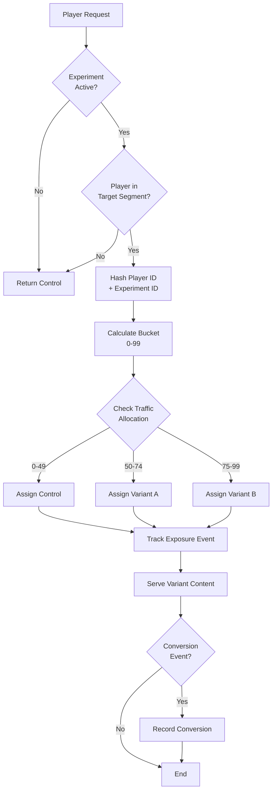

# A/B 測試框架架構

> **業務需求**: [Frontend UX Requirements](../../requirements/11_Frontend_Experience/Frontend_UX_Requirements.md)
> **規範來源**: [source-archive/11_Frontend_CMS/11-06](../../source-archive/11_Frontend_CMS/11-06_AB_Testing_Framework.md)
> **文件類型**: 技術架構
> **目標讀者**: 架構師、資料工程師、前端開發人員

---

## 1. 系統架構

```text
+-----------------------------------------------------+
|  Frontend (React/Vue)                                |
|  - Experiment Config UI                              |
|  - Real-time Data Dashboard                          |
+----------------+------------------------------------+
                 |
+----------------v------------------------------------+
|  AB Testing Service (Node.js / Go)                   |
|  - Traffic Allocation Algorithm                      |
|  - Experiment Config Management                      |
|  - Statistical Computation Engine                    |
+----------------+------------------------------------+
                 |
+----------------v------------------------------------+
|  Data Layer                                          |
|  - Redis (Experiment Config Cache)                   |
|  - PostgreSQL (Experiment Definitions, Results)      |
|  - ClickHouse (Event Stream, Metric Aggregation)     |
+-----------------------------------------------------+
```

**平台建議**: GrowthBook（開源、可自託管、功能完整）

### 1.1 變體分配流程



## 2. 基於 Hash 的流量分配

```javascript
function assignVariant(playerId, experimentId, variants) {
    const hash = murmur3(`${experimentId}:${playerId}`);
    const bucket = hash % 100;

    let cumulative = 0;
    for (const variant of variants) {
        cumulative += variant.trafficPercentage;
        if (bucket < cumulative) {
            return variant.name;
        }
    }
    return 'control';
}

// Example
const variant = assignVariant('12345', 'homepage-redesign', [
    { name: 'control', trafficPercentage: 50 },
    { name: 'variant_a', trafficPercentage: 25 },
    { name: 'variant_b', trafficPercentage: 25 }
]);
```

## 3. 實驗配置

```yaml
experiment:
  id: homepage-redesign
  name: "Homepage Redesign A/B Test"
  status: running
  start_date: "2026-01-28T00:00:00Z"
  end_date: "2026-02-28T00:00:00Z"

  variants:
    - name: control
      description: "Original homepage"
      traffic: 50%
    - name: variant_a
      description: "New design (large banner)"
      traffic: 50%

  primary_metric:
    name: first_deposit_conversion_rate
    goal: maximize
    min_sample_size: 10000
    min_detectable_effect: 5%

  secondary_metrics:
    - click_through_rate
    - bounce_rate

  guardrail_metrics:
    - error_rate
    - page_load_time
```

## 4. 事件追蹤

```javascript
// Experiment exposure event
analytics.track('Experiment Viewed', {
    experiment_id: 'homepage-redesign',
    variant: 'variant_a',
    player_id: '12345'
});

// Conversion event
analytics.track('First Deposit Completed', {
    experiment_id: 'homepage-redesign',
    variant: 'variant_a',
    player_id: '12345',
    deposit_amount: 100
});
```

## 5. 統計顯著性

### 樣本量公式

```
n = 2 * (Z_alpha/2 + Z_beta)^2 * sigma^2 / delta^2

Where:
- Z_alpha/2: Significance level (alpha=0.05 -> Z=1.96)
- Z_beta: Statistical power (beta=0.8 -> Z=0.84)
- sigma: Standard deviation
- delta: Minimum Detectable Effect (MDE)
```

### 自動停止規則

```
Rule 1: Statistical significance reached
  IF p_value < 0.05 AND sample_size >= min_sample_size
  THEN stop_experiment()

Rule 2: Sample size cap
  IF sample_size >= max_sample_size
  THEN stop_experiment()

Rule 3: Guardrail metric triggered
  IF error_rate > baseline_error_rate * 1.5
  THEN stop_experiment() AND rollback()
```

## 6. 實驗生命週期

```
1. Hypothesis -> 2. Design (variants, metrics, sample size)
-> 3. Development (frontend variants, event tracking)
-> 4. Launch (traffic allocation, monitoring)
-> 5. Data Collection (await significance, guardrails)
-> 6. Analysis (statistical tests, business decision)
-> 7. Winner Rollout (100% traffic, decommission control)
```

## 7. 資料庫結構

### 7.1 t_ab_experiment

```sql
CREATE TABLE t_ab_experiment (
    experiment_id BIGSERIAL PRIMARY KEY,
    experiment_key VARCHAR(100) UNIQUE NOT NULL,  -- e.g., 'homepage-redesign'
    experiment_name VARCHAR(200) NOT NULL,
    description TEXT,
    status VARCHAR(20) NOT NULL CHECK (status IN ('draft', 'running', 'paused', 'completed', 'archived')),
    start_date TIMESTAMP WITH TIME ZONE NOT NULL,
    end_date TIMESTAMP WITH TIME ZONE,

    -- Experiment configuration (JSONB for flexible schema)
    variants JSONB NOT NULL,  -- [{"name": "control", "traffic": 50}, {"name": "variant_a", "traffic": 50}]
    target_segments JSONB,    -- {"country": ["US", "UK"], "new_users": true}
    primary_metric JSONB NOT NULL,  -- {"name": "conversion_rate", "goal": "maximize", "mde": 0.05}
    secondary_metrics JSONB,
    guardrail_metrics JSONB,

    -- Sample size and statistical settings
    min_sample_size INT DEFAULT 1000,
    max_sample_size INT DEFAULT 100000,
    significance_level DECIMAL(3,2) DEFAULT 0.05,
    statistical_power DECIMAL(3,2) DEFAULT 0.80,

    -- Results tracking
    current_sample_size INT DEFAULT 0,
    statistical_significance BOOLEAN DEFAULT FALSE,
    winning_variant VARCHAR(50),

    created_at TIMESTAMP WITH TIME ZONE DEFAULT CURRENT_TIMESTAMP,
    updated_at TIMESTAMP WITH TIME ZONE DEFAULT CURRENT_TIMESTAMP,
    created_by BIGINT REFERENCES t_employee(employee_id)
);

CREATE INDEX idx_ab_exp_status ON t_ab_experiment(status, start_date);
CREATE INDEX idx_ab_exp_key ON t_ab_experiment(experiment_key);
```

### 7.2 t_ab_experiment_assignment

```sql
CREATE TABLE t_ab_experiment_assignment (
    assignment_id BIGSERIAL PRIMARY KEY,
    experiment_id BIGINT NOT NULL REFERENCES t_ab_experiment(experiment_id),
    player_id BIGINT NOT NULL REFERENCES t_player(player_id),
    variant_name VARCHAR(50) NOT NULL,

    -- Assignment details
    assigned_at TIMESTAMP WITH TIME ZONE DEFAULT CURRENT_TIMESTAMP,
    assignment_hash VARCHAR(32) NOT NULL,  -- Murmur3 hash for reproducibility

    -- Exposure tracking
    first_exposure_at TIMESTAMP WITH TIME ZONE,
    total_exposures INT DEFAULT 0,

    -- Conversion tracking
    converted BOOLEAN DEFAULT FALSE,
    conversion_time TIMESTAMP WITH TIME ZONE,
    conversion_value DECIMAL(15,2),

    -- Metadata
    user_agent TEXT,
    ip_address INET,

    UNIQUE(experiment_id, player_id)
);

CREATE INDEX idx_ab_assign_exp_variant ON t_ab_experiment_assignment(experiment_id, variant_name);
CREATE INDEX idx_ab_assign_player ON t_ab_experiment_assignment(player_id);
CREATE INDEX idx_ab_assign_converted ON t_ab_experiment_assignment(experiment_id, converted, conversion_time);
```

**資料保留策略**:
- 實驗配置：永久保留供審計使用
- 分配記錄：實驗完成後保留 2 年
- 原始事件資料：存放於 ClickHouse，保留 6 個月
