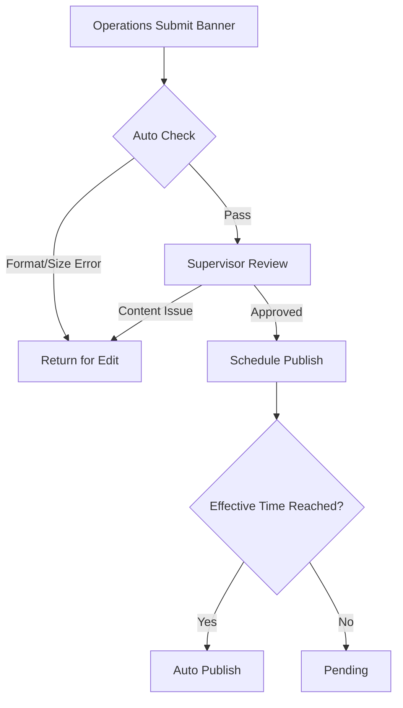

# Banner & Announcement Architecture

> **Business Requirements**: [Frontend UX Requirements](../../requirements/11_Frontend_Experience/Frontend_UX_Requirements.md)
> **Canonical Source**: [source-archive/11_Frontend_CMS/11-02](../../source-archive/11_Frontend_CMS/11-02_Banner_and_Announcement.md)
> **View Type**: Technical Architecture
> **Target Audience**: Architects, Frontend Developers, Backend Developers

---

## 1. Multi-Language Banner Data Structure

```json
{
  "banner_id": "banner_001",
  "title": {
    "zh-CN": "New Year Promotion",
    "en-US": "New Year Promotion",
    "vi-VN": "Khuyen mai Nam moi"
  },
  "images": {
    "zh-CN": "https://cdn.platform.com/banners/cny_zh.webp",
    "en-US": "https://cdn.platform.com/banners/cny_en.webp",
    "vi-VN": "https://cdn.platform.com/banners/cny_vi.webp"
  },
  "link_url": {
    "zh-CN": "/zh/promotions/cny",
    "en-US": "/en/promotions/new-year",
    "vi-VN": "/vi/khuyen-mai/nam-moi"
  }
}
```

## 2. Language Fallback Logic

```typescript
function getBannerImage(banner: Banner, userLanguage: string): string {
    if (banner.images[userLanguage]) {
        return banner.images[userLanguage];
    }
    if (banner.images['en-US']) {
        return banner.images['en-US'];
    }
    return banner.images['zh-CN'] || banner.default_image;
}
```

## 3. Device Targeting

```typescript
const isMobile = /iPhone|iPad|iPod|Android/i.test(navigator.userAgent);

const visibleBanners = allBanners.filter(banner => {
    if (banner.device_target === 'desktop' && isMobile) return false;
    if (banner.device_target === 'mobile' && !isMobile) return false;
    return true;
});
```

## 4. Approval Workflow



## 5. CDN Integration

### 5.1 Image Upload Pipeline

```
Upload Flow:
1. Operations upload Banner image -> S3 Bucket (s3://platform-banners/)
2. Auto-trigger Lambda -> Generate multiple sizes (1920x600, 750x400, 600x600)
3. Convert to WebP format (30% higher compression)
4. Push to CDN -> https://cdn.platform.com/banners/{banner_id}_{size}.webp
```

### 5.2 Responsive Images

```html
<picture>
    <source
        srcset="https://cdn.platform.com/banners/banner_001_1920x600.webp"
        media="(min-width: 1024px)" type="image/webp">
    <source
        srcset="https://cdn.platform.com/banners/banner_001_1024x512.webp"
        media="(min-width: 768px)" type="image/webp">
    <source
        srcset="https://cdn.platform.com/banners/banner_001_750x400.webp"
        media="(max-width: 767px)" type="image/webp">
    
</picture>
```

### 5.3 Cache Configuration

```nginx
location /banners/ {
    add_header Cache-Control "public, max-age=86400, s-maxage=86400";
    add_header ETag $1;
    gzip on;
    gzip_types image/webp image/jpeg image/png;
}
```

## 6. A/B Testing Configuration

```json
{
    "experiment_id": "exp_001",
    "name": "Homepage Banner Color Test",
    "variants": [
        {"variant_id": "A", "name": "Red Version", "banner_id": "banner_red", "traffic_allocation": 50},
        {"variant_id": "B", "name": "Blue Version", "banner_id": "banner_blue", "traffic_allocation": 50}
    ],
    "start_time": "2026-01-27T00:00:00Z",
    "end_time": "2026-02-03T23:59:59Z"
}
```

## 7. Analytics Tracking

| Metric | Event | Formula |
|--------|-------|---------|
| Impressions | `impression_event` | COUNT(impression_event) |
| Clicks | `click_event` | COUNT(click_event) |
| CTR | - | (Clicks / Impressions) x 100% |
| Conversions | `conversion_event` | COUNT(conversion_event) |
| CVR | - | (Conversions / Clicks) x 100% |
