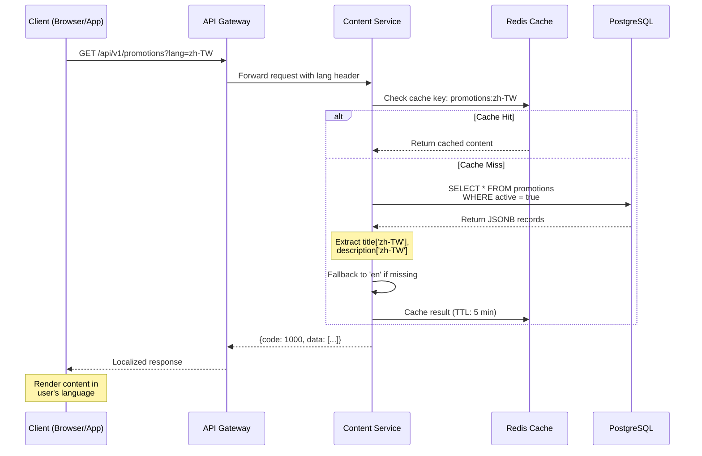

# Dynamic Content Localization Architecture

> **Business Requirements**: [Localization Requirements](../../requirements/11_Frontend_Experience/Localization_Requirements.md)
> **Canonical Source**: [source-archive/11_Frontend_CMS/11-08](../../source-archive/11_Frontend_CMS/11-08_Dynamic_Content_Localization.md)
> **View Type**: Technical Architecture
> **Target Audience**: Architects, Backend Developers, Frontend Developers

---

## 1. JSONB Multi-Language Field Design

**Standard JSONB Format**:
```json
{
  "en": "English text",
  "zh-TW": "繁體中文",
  "zh-CN": "简体中文",
  "th": "ข้อความภาษาไทย",
  "vi": "Văn bản tiếng Việt",
  "id": "Teks bahasa Indonesia",
  "pt-BR": "Texto em português",
  "ar": "نص عربي",
  "fallback": "Default text if language not found"
}
```

### Tables Requiring Localization

| Table | Multi-Language Fields | Example |
|-------|----------------------|---------|
| **games** | `name`, `description`, `rules` | Game name, rules |
| **banners** | `title`, `subtitle`, `cta_text` | Banner title, CTA |
| **notifications** | `title`, `body` | In-app notifications |
| **faqs** | `question`, `answer` | FAQ content |
| **vip_tiers** | `tier_name`, `benefits` | VIP tier names |
| **payment_methods** | `display_name`, `instructions` | Payment method labels |

## 2. API Response Strategies

### Option A: Single-Language Response (Mobile)

```json
GET /api/v1/promotions?lang=zh-TW

Response:
{
  "code": 1000,
  "data": [
    {
      "promotion_id": 123,
      "code": "WELCOME100",
      "title": "歡迎禮金",
      "description": "首次存款獲得100%配對紅利...",
      "start_time": "2026-01-01T00:00:00Z",
      "end_time": "2026-12-31T23:59:59Z"
    }
  ]
}
```

### Option B: Multi-Language Response (CMS Backend)

```json
GET /api/v1/promotions/123?include_all_languages=true

Response:
{
  "code": 1000,
  "data": {
    "promotion_id": 123,
    "code": "WELCOME100",
    "title": {
      "en": "Welcome Bonus",
      "zh-TW": "歡迎禮金",
      "th": "โบนัสต้อนรับ"
    },
    "description": {
      "en": "Get 100% match on your first deposit...",
      "zh-TW": "首次存款獲得100%配對紅利...",
      "th": "รับโบนัสแมตช์ 100% ในการฝากครั้งแรก..."
    }
  }
}
```

### 2.1 Dynamic Content Localization Request Flow



## 3. CMS Multi-Language Editor

```html
<form>
  <input name="code" placeholder="Promotion Code (e.g., WELCOME100)" />

  <div class="multilingual-editor">
    <ul class="language-tabs">
      <li class="active">English</li>
      <li>繁體中文</li>
      <li>ไทย</li>
      <li>Tiếng Việt</li>
    </ul>

    <div class="tab-content">
      <div class="tab-pane active">
        <input name="title[en]" placeholder="Title in English" />
        <textarea name="description[en]" placeholder="Description..."></textarea>
      </div>
      <div class="tab-pane">
        <input name="title[zh-TW]" placeholder="繁體中文標題" />
        <textarea name="description[zh-TW]" placeholder="活動描述..."></textarea>
      </div>
    </div>
  </div>

  <div class="translation-progress">
    <span>Translation Completeness: 75% (3/4 languages)</span>
    <span class="missing-languages">Missing: Vietnamese</span>
  </div>
</form>
```

## 4. Frontend Dynamic Content Rendering

### React Component

```jsx
import { useTranslation } from 'react-i18next';
import { useLanguage } from '@/hooks/useLanguage';

function PromotionCard({ promotion }) {
  const { currentLanguage } = useLanguage();

  const title = promotion.title[currentLanguage] || promotion.title['en'];
  const description = promotion.description[currentLanguage] || promotion.description['en'];

  return (
    <div className="promotion-card">
      <h3>{title}</h3>
      <p>{description}</p>
      <button>{t('common.button.claim')}</button>
    </div>
  );
}
```

### Vue Component

```vue
<template>
  <div class="promotion-card">
    <h3>{{ localizedTitle }}</h3>
    <p>{{ localizedDescription }}</p>
    <button>{{ $t('common.button.claim') }}</button>
  </div>
</template>

<script>
export default {
  props: ['promotion'],
  computed: {
    currentLang() {
      return this.$i18n.locale;
    },
    localizedTitle() {
      return this.promotion.title[this.currentLang] || this.promotion.title['en'];
    },
    localizedDescription() {
      return this.promotion.description[this.currentLang] || this.promotion.description['en'];
    }
  }
}
</script>
```

## 5. Localized Image Strategy

**File Naming Convention**: `{resource_name}_{lang}.{ext}`

```
/cdn/banners/
  ├── new_year_promo_en.jpg
  ├── new_year_promo_zh-TW.jpg
  ├── new_year_promo_th.jpg
  └── new_year_promo_default.jpg
```

## 6. Database Schema

### 6.1 localization_contents

```sql
CREATE TABLE localization_contents (
    content_id BIGSERIAL PRIMARY KEY,
    content_type VARCHAR(50) NOT NULL CHECK (content_type IN ('promotion', 'banner', 'faq', 'notification', 'game', 'vip_tier', 'payment_method')),
    entity_id BIGINT NOT NULL,  -- Foreign key to actual entity (promotion_id, banner_id, etc.)
    field_name VARCHAR(50) NOT NULL,  -- e.g., 'title', 'description', 'rules'

    -- JSONB localized content
    translations JSONB NOT NULL,  -- {"en": "...", "zh-TW": "...", "th": "..."}

    -- Translation metadata
    default_language VARCHAR(10) DEFAULT 'en',
    supported_languages TEXT[] DEFAULT ARRAY['en', 'zh-TW', 'zh-CN', 'th', 'vi', 'id', 'pt-BR', 'ar'],
    translation_status VARCHAR(20) DEFAULT 'draft' CHECK (translation_status IN ('draft', 'review', 'published', 'archived')),

    -- Version control
    version INT DEFAULT 1,
    is_latest BOOLEAN DEFAULT TRUE,

    created_at TIMESTAMP WITH TIME ZONE DEFAULT CURRENT_TIMESTAMP,
    updated_at TIMESTAMP WITH TIME ZONE DEFAULT CURRENT_TIMESTAMP,
    created_by BIGINT REFERENCES t_employee(employee_id),

    UNIQUE(content_type, entity_id, field_name, version)
);

CREATE INDEX idx_loc_content_type_entity ON localization_contents(content_type, entity_id);
CREATE INDEX idx_loc_status_latest ON localization_contents(translation_status, is_latest);
CREATE INDEX idx_loc_translations_gin ON localization_contents USING gin(translations jsonb_path_ops);
```

### 6.2 content_translations

```sql
CREATE TABLE content_translations (
    translation_id BIGSERIAL PRIMARY KEY,
    content_id BIGINT NOT NULL REFERENCES localization_contents(content_id),
    language_code VARCHAR(10) NOT NULL,  -- ISO 639-1 + ISO 3166-1 (e.g., 'zh-TW')
    translated_text TEXT NOT NULL,

    -- Translation quality
    translation_method VARCHAR(20) DEFAULT 'manual' CHECK (translation_method IN ('manual', 'machine', 'hybrid', 'imported')),
    translator_id BIGINT REFERENCES t_employee(employee_id),  -- NULL for machine translation
    review_status VARCHAR(20) DEFAULT 'pending' CHECK (review_status IN ('pending', 'approved', 'rejected', 'needs_revision')),
    reviewer_id BIGINT REFERENCES t_employee(employee_id),

    -- Character count and metadata
    character_count INT GENERATED ALWAYS AS (LENGTH(translated_text)) STORED,
    word_count INT,
    last_reviewed_at TIMESTAMP WITH TIME ZONE,

    created_at TIMESTAMP WITH TIME ZONE DEFAULT CURRENT_TIMESTAMP,
    updated_at TIMESTAMP WITH TIME ZONE DEFAULT CURRENT_TIMESTAMP,

    UNIQUE(content_id, language_code)
);

CREATE INDEX idx_ct_content_lang ON content_translations(content_id, language_code);
CREATE INDEX idx_ct_status ON content_translations(review_status, translation_method);
CREATE INDEX idx_ct_translator ON content_translations(translator_id);
```

**Translation Workflow**:
1. Content created in `localization_contents` with default language (usually 'en')
2. Translations added to `content_translations` (manual or machine)
3. Reviewers approve translations → `review_status = 'approved'`
4. API layer reads from `translations` JSONB field (denormalized for performance)
5. Sync job updates `translations` JSONB from approved `content_translations` records
