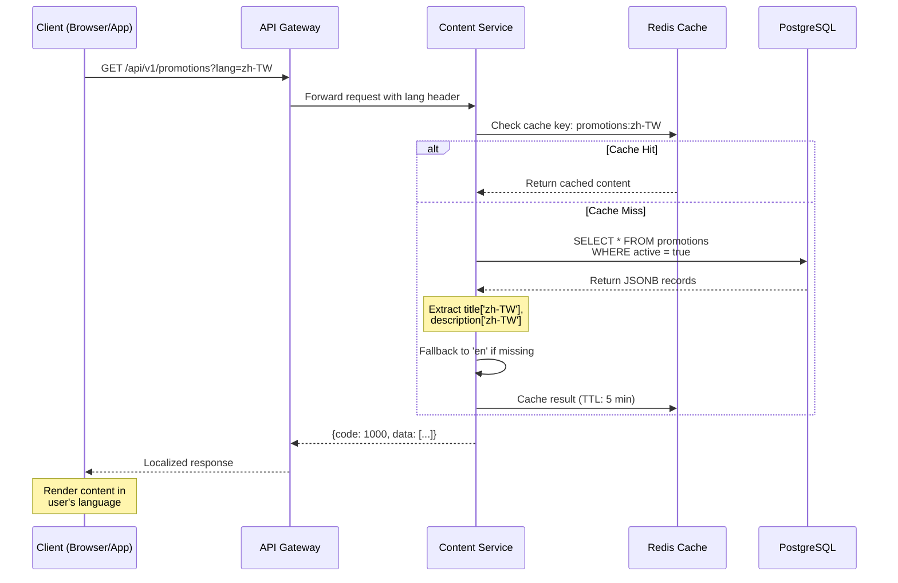

# 動態內容在地化架構

> **業務需求**: [Localization Requirements](../../requirements/11_Frontend_Experience/Localization_Requirements.md)
> **規範來源**: [source-archive/11_Frontend_CMS/11-08](../../source-archive/11_Frontend_CMS/11-08_Dynamic_Content_Localization.md)
> **文件類型**: 技術架構
> **目標讀者**: 架構師、後端開發人員、前端開發人員

---

## 1. JSONB 多語言欄位設計

**標準 JSONB 格式**:
```json
{
  "en": "English text",
  "zh-TW": "繁體中文",
  "zh-CN": "简体中文",
  "th": "ข้อความภาษาไทย",
  "vi": "Văn bản tiếng Việt",
  "id": "Teks bahasa Indonesia",
  "pt-BR": "Texto em português",
  "ar": "نص عربي",
  "fallback": "Default text if language not found"
}
```

### 需要在地化的資料表

| 資料表 | 多語言欄位 | 範例 |
|--------|-----------|------|
| **games** | `name`, `description`, `rules` | 遊戲名稱、規則 |
| **banners** | `title`, `subtitle`, `cta_text` | Banner 標題、行動呼籲 |
| **notifications** | `title`, `body` | 應用內通知 |
| **faqs** | `question`, `answer` | FAQ 內容 |
| **vip_tiers** | `tier_name`, `benefits` | VIP 等級名稱 |
| **payment_methods** | `display_name`, `instructions` | 支付方式標籤 |

## 2. API 回應策略

### 方案 A：單語言回應（行動裝置）

```json
GET /api/v1/promotions?lang=zh-TW

Response:
{
  "code": 1000,
  "data": [
    {
      "promotion_id": 123,
      "code": "WELCOME100",
      "title": "歡迎禮金",
      "description": "首次存款獲得100%配對紅利...",
      "start_time": "2026-01-01T00:00:00Z",
      "end_time": "2026-12-31T23:59:59Z"
    }
  ]
}
```

### 方案 B：多語言回應（CMS 後台）

```json
GET /api/v1/promotions/123?include_all_languages=true

Response:
{
  "code": 1000,
  "data": {
    "promotion_id": 123,
    "code": "WELCOME100",
    "title": {
      "en": "Welcome Bonus",
      "zh-TW": "歡迎禮金",
      "th": "โบนัสต้อนรับ"
    },
    "description": {
      "en": "Get 100% match on your first deposit...",
      "zh-TW": "首次存款獲得100%配對紅利...",
      "th": "รับโบนัสแมตช์ 100% ในการฝากครั้งแรก..."
    }
  }
}
```

### 2.1 動態內容在地化請求流程



## 3. CMS 多語言編輯器

```html
<form>
  <input name="code" placeholder="Promotion Code (e.g., WELCOME100)" />

  <div class="multilingual-editor">
    <ul class="language-tabs">
      <li class="active">English</li>
      <li>繁體中文</li>
      <li>ไทย</li>
      <li>Tiếng Việt</li>
    </ul>

    <div class="tab-content">
      <div class="tab-pane active">
        <input name="title[en]" placeholder="Title in English" />
        <textarea name="description[en]" placeholder="Description..."></textarea>
      </div>
      <div class="tab-pane">
        <input name="title[zh-TW]" placeholder="繁體中文標題" />
        <textarea name="description[zh-TW]" placeholder="活動描述..."></textarea>
      </div>
    </div>
  </div>

  <div class="translation-progress">
    <span>Translation Completeness: 75% (3/4 languages)</span>
    <span class="missing-languages">Missing: Vietnamese</span>
  </div>
</form>
```

## 4. 前端動態內容渲染

### React 元件

```jsx
import { useTranslation } from 'react-i18next';
import { useLanguage } from '@/hooks/useLanguage';

function PromotionCard({ promotion }) {
  const { currentLanguage } = useLanguage();

  const title = promotion.title[currentLanguage] || promotion.title['en'];
  const description = promotion.description[currentLanguage] || promotion.description['en'];

  return (
    <div className="promotion-card">
      <h3>{title}</h3>
      <p>{description}</p>
      <button>{t('common.button.claim')}</button>
    </div>
  );
}
```

### Vue 元件

```vue
<template>
  <div class="promotion-card">
    <h3>{{ localizedTitle }}</h3>
    <p>{{ localizedDescription }}</p>
    <button>{{ $t('common.button.claim') }}</button>
  </div>
</template>

<script>
export default {
  props: ['promotion'],
  computed: {
    currentLang() {
      return this.$i18n.locale;
    },
    localizedTitle() {
      return this.promotion.title[this.currentLang] || this.promotion.title['en'];
    },
    localizedDescription() {
      return this.promotion.description[this.currentLang] || this.promotion.description['en'];
    }
  }
}
</script>
```

## 5. 在地化圖片策略

**檔案命名規則**: `{resource_name}_{lang}.{ext}`

```
/cdn/banners/
  ├── new_year_promo_en.jpg
  ├── new_year_promo_zh-TW.jpg
  ├── new_year_promo_th.jpg
  └── new_year_promo_default.jpg
```

## 6. SmartAdmin 實作範例（SmartAdmin Implementation Example）

**LocalizationService - 動態內容查詢**:
```java
@Service
@RequiredArgsConstructor
public class LocalizationService {
    private final LocalizationContentDao localizationContentDao;
    private final LocalizationManager localizationManager;

    public Option<LocalizedContentVO> getLocalizedContent(String contentType, Long entityId, String languageCode) {
        // 查詢在地化內容
        return Option.of(
            localizationContentDao.selectOne(
                Wrappers.lambdaQuery(LocalizationContentEntity.class)
                    .eq(LocalizationContentEntity::getContentType, contentType)
                    .eq(LocalizationContentEntity::getEntityId, entityId)
                    .eq(LocalizationContentEntity::getIsLatest, true)
                    .eq(LocalizationContentEntity::getTranslationStatus, "published")
            )
        ).map(content -> extractLanguage(content, languageCode));
    }

    private LocalizedContentVO extractLanguage(LocalizationContentEntity content, String lang) {
        // 從 JSONB 中提取指定語言的翻譯
        JSONObject translations = JSON.parseObject(content.getTranslations());
        String localizedText = translations.getString(lang);

        // Fallback to default language if missing
        if (localizedText == null) {
            localizedText = translations.getString(content.getDefaultLanguage());
        }

        LocalizedContentVO vo = new LocalizedContentVO();
        vo.setContentId(content.getContentId());
        vo.setContentType(content.getContentType());
        vo.setEntityId(content.getEntityId());
        vo.setLanguageCode(lang);
        vo.setLocalizedText(localizedText);
        return vo;
    }

    public PageResult<PromotionListVO> getPromotions(PromotionQueryForm form, String languageCode) {
        // 分頁查詢促銷活動並在地化內容
        Page<PromotionEntity> page = SmartPageUtil.convert2PageQuery(form);
        Page<PromotionEntity> pageResult = promotionDao.selectPage(page,
            Wrappers.lambdaQuery(PromotionEntity.class)
                .eq(PromotionEntity::getStatus, "ACTIVE")
                .between(PromotionEntity::getStartTime, form.getStartTime(), form.getEndTime())
        );

        List<PromotionListVO> voList = pageResult.getRecords().stream()
            .map(entity -> {
                PromotionListVO vo = SmartBeanUtil.copy(entity, PromotionListVO.class);
                // 取得在地化的標題和描述
                getLocalizedContent("promotion", entity.getId(), languageCode)
                    .peek(content -> {
                        vo.setTitle(extractField(content, "title", languageCode));
                        vo.setDescription(extractField(content, "description", languageCode));
                    });
                return vo;
            })
            .collect(Collectors.toList());

        return SmartPageUtil.convert2PageResult(pageResult, voList);
    }

    private String extractField(LocalizationContentEntity content, String field, String lang) {
        JSONObject translations = JSON.parseObject(content.getTranslations());
        return translations.getString(lang + "." + field);
    }
}
```

**LocalizationManager - 發布管理**:
```java
@Component
@RequiredArgsConstructor
public class LocalizationManager {
    private final LocalizationContentDao localizationContentDao;
    private final ContentTranslationDao contentTranslationDao;

    @Transactional(rollbackFor = Throwable.class)
    public void publishTranslations(String contentType, Long entityId, List<String> languages) {
        // 1. 獲取最新版本的內容
        LocalizationContentEntity content = localizationContentDao.selectOne(
            Wrappers.lambdaQuery(LocalizationContentEntity.class)
                .eq(LocalizationContentEntity::getContentType, contentType)
                .eq(LocalizationContentEntity::getEntityId, entityId)
                .eq(LocalizationContentEntity::getIsLatest, true)
        );

        // 2. 從 t_content_translation 同步已審批的翻譯至 JSONB
        JSONObject translations = new JSONObject();
        for (String lang : languages) {
            ContentTranslationEntity translation = contentTranslationDao.selectOne(
                Wrappers.lambdaQuery(ContentTranslationEntity.class)
                    .eq(ContentTranslationEntity::getContentId, content.getContentId())
                    .eq(ContentTranslationEntity::getLanguageCode, lang)
                    .eq(ContentTranslationEntity::getReviewStatus, "approved")
            );
            if (translation != null) {
                translations.put(lang, translation.getTranslatedText());
            }
        }

        // 3. 更新 JSONB 並發布
        content.setTranslations(translations.toJSONString());
        content.setTranslationStatus("published");
        localizationContentDao.updateById(content);
    }

    @Cacheable(value = "localization:content", key = "#contentType + ':' + #entityId + ':' + #lang")
    public String getCachedTranslation(String contentType, Long entityId, String lang) {
        // 緩存策略：5 分鐘 TTL
        return getLocalizedContent(contentType, entityId, lang)
            .map(LocalizedContentVO::getLocalizedText)
            .getOrElse("Fallback text");
    }
}
```

## 7. 資料庫結構

### 7.1 t_localization_content

```sql
CREATE TABLE t_localization_content (
    content_id BIGSERIAL PRIMARY KEY,
    content_type VARCHAR(50) NOT NULL CHECK (content_type IN ('promotion', 'banner', 'faq', 'notification', 'game', 'vip_tier', 'payment_method')),
    entity_id BIGINT NOT NULL,  -- Foreign key to actual entity (promotion_id, banner_id, etc.)
    field_name VARCHAR(50) NOT NULL,  -- e.g., 'title', 'description', 'rules'

    -- JSONB localized content
    translations JSONB NOT NULL,  -- {"en": "...", "zh-TW": "...", "th": "..."}

    -- Translation metadata
    default_language VARCHAR(10) DEFAULT 'en',
    supported_languages TEXT[] DEFAULT ARRAY['en', 'zh-TW', 'zh-CN', 'th', 'vi', 'id', 'pt-BR', 'ar'],
    translation_status VARCHAR(20) DEFAULT 'draft' CHECK (translation_status IN ('draft', 'review', 'published', 'archived')),

    -- Version control
    version INT DEFAULT 1,
    is_latest BOOLEAN DEFAULT TRUE,

    created_at TIMESTAMP WITH TIME ZONE DEFAULT CURRENT_TIMESTAMP,
    updated_at TIMESTAMP WITH TIME ZONE DEFAULT CURRENT_TIMESTAMP,
    created_by BIGINT REFERENCES t_employee(employee_id),

    UNIQUE(content_type, entity_id, field_name, version)
);

CREATE INDEX idx_loc_content_type_entity ON t_localization_content(content_type, entity_id);
CREATE INDEX idx_loc_status_latest ON t_localization_content(translation_status, is_latest);
CREATE INDEX idx_loc_translations_gin ON t_localization_content USING gin(translations jsonb_path_ops);
```

### 6.2 t_content_translation

```sql
CREATE TABLE t_content_translation (
    translation_id BIGSERIAL PRIMARY KEY,
    content_id BIGINT NOT NULL REFERENCES t_localization_content(content_id),
    language_code VARCHAR(10) NOT NULL,  -- ISO 639-1 + ISO 3166-1 (e.g., 'zh-TW')
    translated_text TEXT NOT NULL,

    -- Translation quality
    translation_method VARCHAR(20) DEFAULT 'manual' CHECK (translation_method IN ('manual', 'machine', 'hybrid', 'imported')),
    translator_id BIGINT REFERENCES t_employee(employee_id),  -- NULL for machine translation
    review_status VARCHAR(20) DEFAULT 'pending' CHECK (review_status IN ('pending', 'approved', 'rejected', 'needs_revision')),
    reviewer_id BIGINT REFERENCES t_employee(employee_id),

    -- Character count and metadata
    character_count INT GENERATED ALWAYS AS (LENGTH(translated_text)) STORED,
    word_count INT,
    last_reviewed_at TIMESTAMP WITH TIME ZONE,

    created_at TIMESTAMP WITH TIME ZONE DEFAULT CURRENT_TIMESTAMP,
    updated_at TIMESTAMP WITH TIME ZONE DEFAULT CURRENT_TIMESTAMP,

    UNIQUE(content_id, language_code)
);

CREATE INDEX idx_ct_content_lang ON t_content_translation(content_id, language_code);
CREATE INDEX idx_ct_status ON t_content_translation(review_status, translation_method);
CREATE INDEX idx_ct_translator ON t_content_translation(translator_id);
```

**翻譯工作流程**:
1. 在 `t_localization_content` 中建立預設語言內容（通常為 'en'）
2. 在 `t_content_translation` 中新增翻譯（人工或機器翻譯）
3. 審核人員審批翻譯 → `review_status = 'approved'`
4. API 層從 `translations` JSONB 欄位讀取（反正規化以提升效能）
5. 同步任務從已審批的 `t_content_translation` 記錄更新 `translations` JSONB
