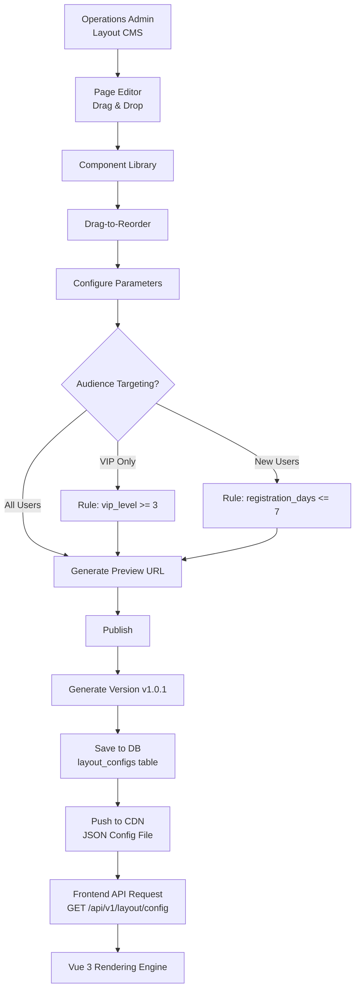
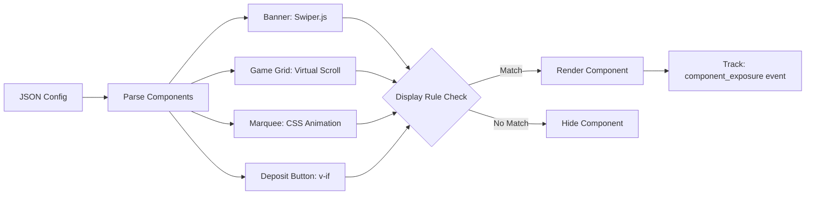

# Frontend Layout Engine Architecture

> **Business Requirements**: [Frontend UX Requirements](../../requirements/11_Frontend_Experience/Frontend_UX_Requirements.md)
> **Canonical Source**: [source-archive/11_Frontend_CMS/11-01](../../source-archive/11_Frontend_CMS/11-01_Frontend_Layout_Engine.md)
> **View Type**: Technical Architecture
> **Target Audience**: Architects, Frontend Developers

---

## 1. System Architecture



## 2. JSON Configuration Schema

```json
{
  "version": "v1.0.1",
  "published_at": "2026-01-27T10:30:00Z",
  "experiment_id": null,
  "components": [
    {
      "component_id": "banner-hero",
      "type": "BANNER",
      "order": 1,
      "config": {
        "images": [
          {
            "url": "https://cdn.example.com/banner1.jpg",
            "link": "/promotions/welcome-bonus",
            "alt": "Welcome Bonus 100%"
          }
        ],
        "autoplay": true,
        "interval": 5000
      },
      "display_rules": {
        "target_users": ["ALL"]
      }
    },
    {
      "component_id": "game-grid-hot",
      "type": "GAME_GRID",
      "order": 2,
      "config": {
        "title": "Hot Games",
        "game_ids": [101, 102, 103, 104, 105],
        "columns": 5,
        "show_jackpot": true
      },
      "display_rules": {
        "target_users": ["ALL"]
      }
    },
    {
      "component_id": "vip-exclusive-banner",
      "type": "BANNER",
      "order": 3,
      "config": {
        "images": [{"url": "https://cdn.example.com/vip.jpg", "link": "/vip/benefits"}]
      },
      "display_rules": {
        "target_users": ["VIP"],
        "conditions": {"vip_level": {"operator": ">=", "value": 3}}
      }
    }
  ]
}
```

## 3. CDN Distribution

- Configuration saved to database with `status: PUBLISHED`
- Pushed to CDN (CloudFront/Cloudflare) as JSON file
- CDN TTL: 5 minutes at edge locations
- Frontend fetches via `GET /api/v1/layout/config?version=latest`
- Version checking: only download when local version is stale

## 4. Component Rendering Pipeline



## 5. A/B Testing Integration

Layout engine supports experiment configuration:

```javascript
// Traffic splitting via MurmurHash3
function assignVariant(userId, experimentId) {
  const key = `${experimentId}:${userId}`;
  const hash = murmurHash3(key);
  const bucket = hash % 100;
  return bucket < 50 ? 'A' : 'B';
}
```

- `experiment_id` field in layout JSON
- Hash-based traffic splitting ensures consistency per user
- Exposure events auto-reported on render

## 6. Wallet Mode UI Adaptation

Frontend dynamically switches Header based on `player.wallet_mode`:

| Mode | Display | Key UI Element |
|------|---------|---------------|
| Cash | Balance (Total Cash + Bonus) | Deposit button prominent |
| Credit | Credit Limit / Used / Available | Quota details + Settlement Countdown |
| Hybrid | Both Cash + Credit | Payment selector (Cash first vs Credit) |
