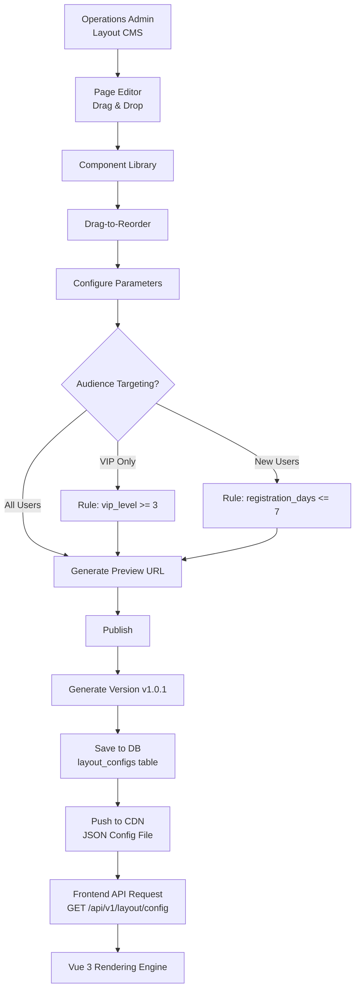
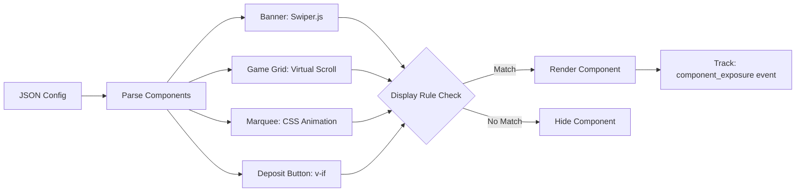

# 前端佈局引擎架構

> **業務需求**: [Frontend UX Requirements](../../requirements/11_Frontend_Experience/Frontend_UX_Requirements.md)
> **規範來源**: [source-archive/11_Frontend_CMS/11-01](../../source-archive/11_Frontend_CMS/11-01_Frontend_Layout_Engine.md)
> **文件類型**: 技術架構
> **目標讀者**: 架構師、前端開發人員

---

## 1. 系統架構



## 2. JSON 配置結構

```json
{
  "version": "v1.0.1",
  "published_at": "2026-01-27T10:30:00Z",
  "experiment_id": null,
  "components": [
    {
      "component_id": "banner-hero",
      "type": "BANNER",
      "order": 1,
      "config": {
        "images": [
          {
            "url": "https://cdn.example.com/banner1.jpg",
            "link": "/promotions/welcome-bonus",
            "alt": "Welcome Bonus 100%"
          }
        ],
        "autoplay": true,
        "interval": 5000
      },
      "display_rules": {
        "target_users": ["ALL"]
      }
    },
    {
      "component_id": "game-grid-hot",
      "type": "GAME_GRID",
      "order": 2,
      "config": {
        "title": "Hot Games",
        "game_ids": [101, 102, 103, 104, 105],
        "columns": 5,
        "show_jackpot": true
      },
      "display_rules": {
        "target_users": ["ALL"]
      }
    },
    {
      "component_id": "vip-exclusive-banner",
      "type": "BANNER",
      "order": 3,
      "config": {
        "images": [{"url": "https://cdn.example.com/vip.jpg", "link": "/vip/benefits"}]
      },
      "display_rules": {
        "target_users": ["VIP"],
        "conditions": {"vip_level": {"operator": ">=", "value": 3}}
      }
    }
  ]
}
```

## 3. CDN 分發

- 配置儲存至資料庫，狀態為 `status: PUBLISHED`
- 以 JSON 檔案推送至 CDN（CloudFront/Cloudflare）
- CDN TTL：邊緣節點 5 分鐘
- 前端透過 `GET /api/v1/layout/config?version=latest` 取得
- 版本檢查：僅在本機版本過期時下載

## 4. 元件渲染流程



## 5. A/B 測試整合

佈局引擎支援實驗配置：

```javascript
// Traffic splitting via MurmurHash3
function assignVariant(userId, experimentId) {
  const key = `${experimentId}:${userId}`;
  const hash = murmurHash3(key);
  const bucket = hash % 100;
  return bucket < 50 ? 'A' : 'B';
}
```

- 佈局 JSON 中的 `experiment_id` 欄位
- 基於 Hash 的流量分割確保每位使用者的一致性
- 渲染時自動回報曝光事件

## 6. 錢包模式 UI 適配

前端根據 `player.wallet_mode` 動態切換 Header：

| 模式 | 顯示內容 | 關鍵 UI 元素 |
|------|---------|-------------|
| Cash | 餘額（現金總額 + 獎金） | 存款按鈕突出顯示 |
| Credit | 信用額度 / 已用 / 可用 | 額度詳情 + 結算倒計時 |
| Hybrid | 現金 + 信用均顯示 | 支付選擇器（優先現金 vs 信用） |

---

## 7. SmartAdmin 實作

### 7.1 Layout Config Service

```java
@Service
@RequiredArgsConstructor
public class LayoutConfigService {

    private final LayoutConfigDao layoutConfigDao;
    private final LayoutPublishManager publishManager;

    /**
     * Get published layout config by tenant using Vavr Option.
     */
    public Option<LayoutConfigVO> getPublishedConfig(Long tenantId) {
        return Option.of(layoutConfigDao.selectPublishedByTenant(tenantId))
            .map(entity -> SmartBeanUtil.copy(entity, LayoutConfigVO.class));
    }

    /**
     * Publish layout configuration to CDN.
     */
    public ResponseDTO<String> publishLayout(LayoutPublishForm form) {
        return publishManager.publishToCdn(form);
    }
}
```

### 7.2 Layout 發布 Manager

```java
@Component
@RequiredArgsConstructor
public class LayoutPublishManager {

    private final LayoutConfigDao layoutConfigDao;
    private final LayoutVersionDao versionDao;

    /**
     * Publish layout to CDN with version tracking.
     * @Transactional only allowed in Manager layer per SmartAdmin architecture.
     */
    @Transactional(rollbackFor = Throwable.class)
    public ResponseDTO<String> publishToCdn(LayoutPublishForm form) {
        LayoutConfigEntity config = layoutConfigDao.selectById(form.getConfigId());
        if (config == null) {
            return ResponseDTO.userErrorParam("Layout config not found");
        }

        // Create version record
        LayoutVersionEntity version = new LayoutVersionEntity();
        version.setConfigId(form.getConfigId());
        version.setVersion(generateVersion());
        version.setPublishedAt(LocalDateTime.now());
        version.setPublishedBy(form.getOperatorId());
        versionDao.insert(version);

        // Update config status
        config.setStatus(LayoutStatus.PUBLISHED.getValue());
        config.setCdnUrl(buildCdnUrl(version));
        layoutConfigDao.updateById(config);

        return ResponseDTO.ok(config.getCdnUrl());
    }
}
```

### 7.3 資料庫結構

```sql
-- Layout configuration table
CREATE TABLE t_layout_config (
    id              BIGSERIAL PRIMARY KEY,
    tenant_id       BIGINT NOT NULL,
    config_name     VARCHAR(100) NOT NULL,
    config_json     JSONB NOT NULL,
    experiment_id   BIGINT,
    status          SMALLINT NOT NULL DEFAULT 0,
    cdn_url         VARCHAR(500),
    created_by      BIGINT NOT NULL,
    created_at      TIMESTAMP NOT NULL DEFAULT NOW(),
    updated_at      TIMESTAMP NOT NULL DEFAULT NOW(),
    deleted         BOOLEAN NOT NULL DEFAULT FALSE
);

CREATE INDEX idx_layout_tenant_status ON t_layout_config(tenant_id, status) WHERE deleted = FALSE;

-- Layout component library
CREATE TABLE t_layout_component (
    id              BIGSERIAL PRIMARY KEY,
    tenant_id       BIGINT NOT NULL,
    component_type  VARCHAR(50) NOT NULL,
    component_name  VARCHAR(100) NOT NULL,
    default_config  JSONB,
    display_rules   JSONB,
    sort_order      INTEGER NOT NULL DEFAULT 0,
    enabled         BOOLEAN NOT NULL DEFAULT TRUE,
    created_at      TIMESTAMP NOT NULL DEFAULT NOW()
);

CREATE INDEX idx_component_tenant ON t_layout_component(tenant_id, component_type);

-- Layout version history
CREATE TABLE t_layout_version (
    id              BIGSERIAL PRIMARY KEY,
    config_id       BIGINT NOT NULL REFERENCES t_layout_config(id),
    version         VARCHAR(20) NOT NULL,
    published_at    TIMESTAMP NOT NULL,
    published_by    BIGINT NOT NULL,
    cdn_url         VARCHAR(500),
    rollback_url    VARCHAR(500),
    created_at      TIMESTAMP NOT NULL DEFAULT NOW()
);

CREATE INDEX idx_version_config ON t_layout_version(config_id, published_at DESC);

-- Component exposure tracking
CREATE TABLE t_component_exposure (
    id              BIGSERIAL PRIMARY KEY,
    tenant_id       BIGINT NOT NULL,
    component_id    VARCHAR(100) NOT NULL,
    player_id       BIGINT,
    experiment_id   BIGINT,
    variant         VARCHAR(10),
    exposed_at      TIMESTAMP NOT NULL DEFAULT NOW()
);

CREATE INDEX idx_exposure_component ON t_component_exposure(component_id, exposed_at DESC);
```
