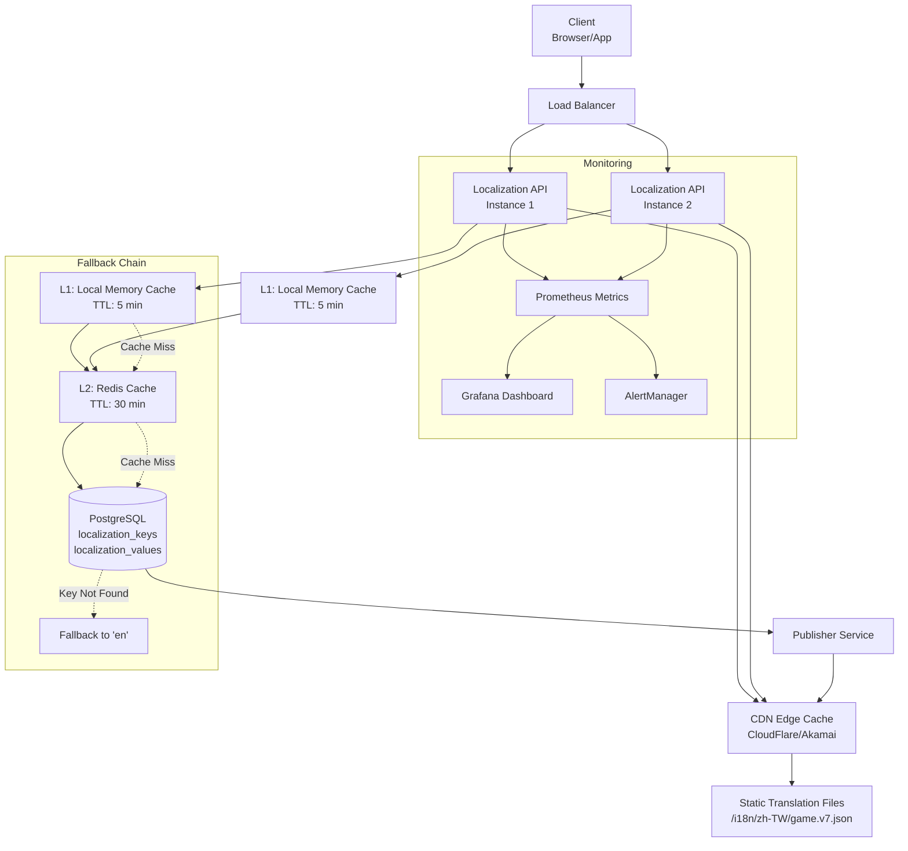

# 在地化 API 架構

> **業務需求**: [Localization Requirements](../../requirements/11_Frontend_Experience/Localization_Requirements.md)
> **規範來源**: [source-archive/11_Frontend_CMS/11-10](../../source-archive/11_Frontend_CMS/11-10_Localization_API.md)
> **文件類型**: 技術架構
> **目標讀者**: 架構師、後端開發人員、DevOps

---

## 1. API 端點概覽

| 方法 | 端點 | 說明 | 權限 |
|------|------|------|------|
| **GET** | `/api/v1/i18n/translations` | Get translation list | Public |
| **GET** | `/api/v1/i18n/translations/{key}` | Get single translation | Public |
| **POST** | `/api/v1/i18n/translations` | Create translation | Translator |
| **PUT** | `/api/v1/i18n/translations/{key}` | Update translation | Translator |
| **DELETE** | `/api/v1/i18n/translations/{key}` | Delete translation | Admin |
| **POST** | `/api/v1/i18n/translations/batch` | Batch import | Translator |
| **GET** | `/api/v1/i18n/export` | Export (JSON/CSV/XLIFF) | Translator |
| **POST** | `/api/v1/i18n/missing-keys` | Report missing key | Public |
| **POST** | `/api/v1/i18n/translations/{key}/publish` | Publish to CDN | Publisher |

### 1.1 在地化 API 架構



## 2. API 規格

### 2.1 取得翻譯列表

```http
GET /api/v1/i18n/translations?lang=zh-TW&namespace=game&status=published&page=1&page_size=50
```

**回應（成功）**:
```json
{
  "code": 1000,
  "message": "Success",
  "data": {
    "translations": [
      {
        "translation_id": 12345,
        "key": "game.slot.freespin_won",
        "lang": "zh-TW",
        "namespace": "game",
        "value": "您贏得了 {amount} 次免費旋轉！",
        "context": "Slot game win notification",
        "status": "published",
        "version": 3,
        "created_at": "2026-01-20T10:00:00Z",
        "updated_at": "2026-01-27T14:30:00Z"
      }
    ],
    "pagination": {
      "current_page": 1,
      "page_size": 50,
      "total_pages": 5,
      "total_count": 234
    }
  }
}
```

### 2.2 批次匯入

```http
POST /api/v1/i18n/translations/batch
Content-Type: application/json
Authorization: Bearer <jwt_token>

{
  "lang": "th",
  "namespace": "game",
  "mode": "upsert",
  "translations": {
    "game.slot.freespin_won": "คุณได้รับ {amount} ฟรีสปิน!",
    "game.slot.jackpot_hit": "แจ็คพอตแตก!",
    "game.table.bet_placed": "วางเดิมพันสำเร็จ"
  }
}
```

### 2.3 發布至 CDN

```http
POST /api/v1/i18n/translations/publish

{
  "lang": "zh-TW",
  "namespace": "game",
  "status_filter": "approved"
}

Response:
{
  "code": 1000,
  "message": "Published 128 translations to CDN",
  "data": {
    "lang": "zh-TW",
    "namespace": "game",
    "published_count": 128,
    "cdn_url": "https://cdn.casino.com/i18n/zh-TW/game.v7.json",
    "version": 7,
    "published_at": "2026-01-27T18:00:00Z",
    "cache_purged": true
  }
}
```

## 3. 錯誤碼規格

| 錯誤碼 | HTTP 狀態碼 | 說明 | 場景 |
|--------|-----------|------|------|
| **1000** | 200 | Success | Normal response |
| **4001** | 400 | Invalid Input | Wrong language code |
| **4003** | 403 | Forbidden | Insufficient permissions |
| **4004** | 404 | Not Found | Translation key missing |
| **4009** | 409 | Conflict | Duplicate key |
| **4029** | 429 | Too Many Requests | Rate limit exceeded |
| **5000** | 500 | Internal Server Error | System error |

## 4. 速率限制

| 客戶端類型 | 速率限制 | 說明 |
|-----------|---------|------|
| **Anonymous** | 100 req/min | Public endpoints |
| **Logged-in Player** | 300 req/min | Authenticated users |
| **CMS Admin** | 1000 req/min | Backend operations |
| **Internal Service** | Unlimited | Microservice calls (IP whitelist) |

**速率限制回應標頭** (RFC 6585):
```http
HTTP/1.1 429 Too Many Requests
X-RateLimit-Limit: 100
X-RateLimit-Remaining: 0
X-RateLimit-Reset: 1706356800
Retry-After: 60
```

## 5. Prometheus 監控

### PromQL 查詢

**API Response Time (P99)**:
```promql
histogram_quantile(0.99,
  rate(translation_response_time_seconds_bucket[5m])
)
```

**Cache Hit Rate**:
```promql
(
  rate(translation_cache_hits_total[5m])
  /
  (rate(translation_cache_hits_total[5m]) + rate(translation_cache_misses_total[5m]))
) * 100
```

**API Error Rate**:
```promql
(
  rate(translation_requests_total{status_code=~"5.."}[5m])
  /
  rate(translation_requests_total[5m])
) * 100
```

### AlertManager 規則

```yaml
groups:
  - name: translation_api_alerts
    interval: 30s
    rules:
      - alert: TranslationAPISlowResponse
        expr: histogram_quantile(0.99, rate(translation_response_time_seconds_bucket[5m])) > 0.2
        for: 5m
        labels:
          severity: warning
        annotations:
          summary: "Translation API response time is too slow"
          description: "P99 response time is {{ $value }}s (threshold: 200ms)"

      - alert: TranslationCacheMissRateHigh
        expr: |
          (rate(translation_cache_misses_total[5m])
          / (rate(translation_cache_hits_total[5m]) + rate(translation_cache_misses_total[5m]))) > 0.15
        for: 10m
        labels:
          severity: warning

      - alert: MissingTranslationKeysHigh
        expr: increase(missing_translation_keys_total[1h]) > 100
        labels:
          severity: warning

      - alert: CDNPublishFailure
        expr: rate(cdn_publish_failures_total[10m]) > 0
        labels:
          severity: critical
```

## 6. 整合介面

| 模組 | 整合方式 | 資料流向 |
|------|---------|---------|
| **Frontend Layout Engine** | API Call | Layout Engine -> i18n API |
| **Banner Management** | Database JSONB | CMS -> translations table |
| **Activity System** | Database JSONB | Activity table -> translations |
| **Customer Service** | API Call + JSONB | CS Templates -> i18n API |
| **Notification Architecture** | API Call | Notification Service -> i18n API |
| **Audit Log** | Event Subscription | i18n API -> Audit Log |

## 7. 資料庫結構

### 7.1 localization_keys

```sql
CREATE TABLE localization_keys (
    key_id BIGSERIAL PRIMARY KEY,
    key_name VARCHAR(200) UNIQUE NOT NULL,  -- e.g., 'game.slot.freespin_won'
    namespace VARCHAR(50) NOT NULL,  -- e.g., 'game', 'bonus', 'common'
    context TEXT,  -- Description for translators (e.g., "Slot game win notification")

    -- Default value and metadata
    default_value TEXT NOT NULL,  -- Default English text
    data_type VARCHAR(20) DEFAULT 'text' CHECK (data_type IN ('text', 'html', 'markdown', 'pluralized')),
    placeholders TEXT[],  -- e.g., ['{amount}', '{currency}']

    -- Usage tracking
    first_seen_at TIMESTAMP WITH TIME ZONE DEFAULT CURRENT_TIMESTAMP,
    last_used_at TIMESTAMP WITH TIME ZONE DEFAULT CURRENT_TIMESTAMP,
    usage_count BIGINT DEFAULT 0,

    -- Status
    status VARCHAR(20) DEFAULT 'active' CHECK (status IN ('active', 'deprecated', 'archived')),
    deprecation_note TEXT,

    created_at TIMESTAMP WITH TIME ZONE DEFAULT CURRENT_TIMESTAMP,
    updated_at TIMESTAMP WITH TIME ZONE DEFAULT CURRENT_TIMESTAMP,
    created_by BIGINT REFERENCES t_employee(employee_id)
);

CREATE INDEX idx_loc_keys_namespace ON localization_keys(namespace, status);
CREATE INDEX idx_loc_keys_status ON localization_keys(status, last_used_at);
CREATE INDEX idx_loc_keys_name ON localization_keys(key_name);
```

### 7.2 localization_values

```sql
CREATE TABLE localization_values (
    value_id BIGSERIAL PRIMARY KEY,
    key_id BIGINT NOT NULL REFERENCES localization_keys(key_id),
    language_code VARCHAR(10) NOT NULL,  -- ISO 639-1 + ISO 3166-1 (e.g., 'zh-TW')
    translated_value TEXT NOT NULL,

    -- Translation metadata
    translation_method VARCHAR(20) DEFAULT 'manual' CHECK (translation_method IN ('manual', 'machine', 'hybrid', 'imported')),
    translator_id BIGINT REFERENCES t_employee(employee_id),
    reviewed_by BIGINT REFERENCES t_employee(employee_id),

    -- Quality assurance
    status VARCHAR(20) DEFAULT 'draft' CHECK (status IN ('draft', 'review', 'approved', 'published', 'rejected')),
    character_count INT GENERATED ALWAYS AS (LENGTH(translated_value)) STORED,
    quality_score DECIMAL(3,2),  -- 0.00-1.00 (machine translation confidence or QA score)

    -- Version control
    version INT DEFAULT 1,
    is_latest BOOLEAN DEFAULT TRUE,

    -- Publishing
    published_at TIMESTAMP WITH TIME ZONE,
    cdn_url TEXT,  -- e.g., 'https://cdn.casino.com/i18n/zh-TW/game.v7.json'
    cdn_version INT,

    created_at TIMESTAMP WITH TIME ZONE DEFAULT CURRENT_TIMESTAMP,
    updated_at TIMESTAMP WITH TIME ZONE DEFAULT CURRENT_TIMESTAMP,

    UNIQUE(key_id, language_code, version)
);

CREATE INDEX idx_loc_values_key_lang ON localization_values(key_id, language_code);
CREATE INDEX idx_loc_values_status ON localization_values(status, is_latest);
CREATE INDEX idx_loc_values_published ON localization_values(published_at, cdn_version);
CREATE INDEX idx_loc_values_translator ON localization_values(translator_id);
```

### 7.3 missing_translation_keys

```sql
CREATE TABLE missing_translation_keys (
    report_id BIGSERIAL PRIMARY KEY,
    key_name VARCHAR(200) NOT NULL,
    namespace VARCHAR(50),
    language_code VARCHAR(10) NOT NULL,

    -- Context
    page_url TEXT,
    user_agent TEXT,
    player_id BIGINT REFERENCES t_player(player_id),

    -- Frequency tracking
    first_reported_at TIMESTAMP WITH TIME ZONE DEFAULT CURRENT_TIMESTAMP,
    last_reported_at TIMESTAMP WITH TIME ZONE DEFAULT CURRENT_TIMESTAMP,
    report_count INT DEFAULT 1,

    -- Resolution
    resolved BOOLEAN DEFAULT FALSE,
    resolved_at TIMESTAMP WITH TIME ZONE,
    resolved_by BIGINT REFERENCES t_employee(employee_id)
);

CREATE INDEX idx_missing_keys_lang ON missing_translation_keys(language_code, resolved);
CREATE INDEX idx_missing_keys_count ON missing_translation_keys(report_count DESC, resolved);
CREATE INDEX idx_missing_keys_namespace ON missing_translation_keys(namespace, resolved);
```

**快取策略**:
- L1（記憶體）：5 分鐘 TTL，每個實例獨立快取
- L2（Redis）：30 分鐘 TTL，跨實例共享
- CDN：1 小時邊緣快取，發布事件時清除
