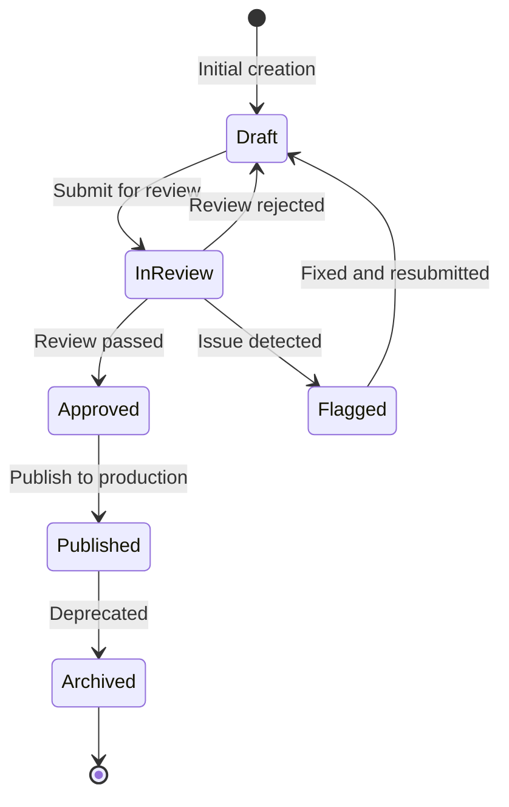
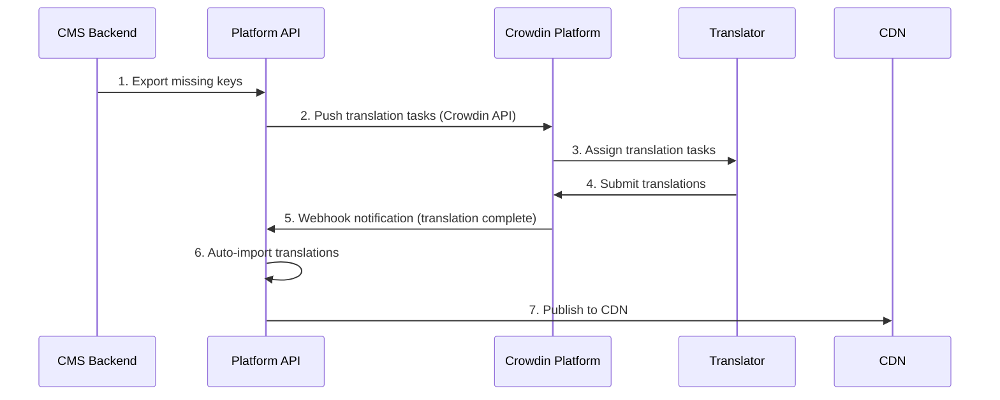

# Localization Workflow Architecture

> **Business Requirements**: [Localization Requirements](../../requirements/11_Frontend_Experience/Localization_Requirements.md)
> **Canonical Source**: [source-archive/11_Frontend_CMS/11-09](../../source-archive/11_Frontend_CMS/11-09_Localization_Workflow.md)
> **View Type**: Technical Architecture
> **Target Audience**: Architects, Backend Developers, Operations

---

## 1. Translation State Machine



| State | Description | Allowed Actions |
|-------|-------------|-----------------|
| **draft** | Translator editing | Edit, Submit |
| **in_review** | Awaiting reviewer | Approve, Reject, Flag |
| **approved** | Awaiting publish | Publish |
| **published** | Live on CDN | Archive |
| **flagged** | Issue found | Edit, Resubmit |
| **archived** | Deprecated | Delete |

## 2. Missing Key Auto-Capture

```javascript
import i18next from 'i18next';
import { initReactI18next } from 'react-i18next';

i18next
  .use(initReactI18next)
  .init({
    saveMissing: true,
    missingKeyHandler: (lngs, ns, key, fallbackValue) => {
      fetch('/api/v1/i18n/missing-keys', {
        method: 'POST',
        headers: { 'Content-Type': 'application/json' },
        body: JSON.stringify({
          key: `${ns}.${key}`,
          languages: lngs,
          fallback_value: fallbackValue,
          page_url: window.location.href,
          timestamp: new Date().toISOString()
        })
      }).catch(err => console.error('Failed to report missing key:', err));
    }
  });
```

## 3. Batch Import/Export

### Export Formats

**JSON Export**:
```http
GET /api/v1/i18n/export?lang=zh-TW&namespace=game&format=json

Response:
{
  "game.slot.freespin_won": "您贏得了 {amount} 次免費旋轉！",
  "game.slot.jackpot_hit": "恭喜中大獎！",
  "game.table.bet_placed": "下注成功"
}
```

**XLIFF Export** (CAT tool standard):
```xml
<?xml version="1.0" encoding="UTF-8"?>
<xliff version="1.2" xmlns="urn:oasis:names:tc:xliff:document:1.2">
  <file source-language="en" target-language="zh-TW" datatype="plaintext">
    <body>
      <trans-unit id="game.slot.freespin_won">
        <source>You won {amount} Free Spins!</source>
        <target>您贏得了 {amount} 次免費旋轉！</target>
        <note>Slot game win notification</note>
      </trans-unit>
    </body>
  </file>
</xliff>
```

### Batch Import API

```http
POST /api/v1/i18n/import
Content-Type: multipart/form-data

Request:
{
  "file": <uploaded_file>,
  "lang": "th",
  "namespace": "game",
  "mode": "upsert"
}

Response:
{
  "code": 1000,
  "message": "Import completed",
  "stats": {
    "total_keys": 150,
    "inserted": 45,
    "updated": 105,
    "errors": 0
  }
}
```

## 4. Crowdin Integration



## 5. State Transition APIs

**Submit for Review**:
```http
PUT /api/v1/i18n/translations/{key}/submit-for-review

Request:
{
  "lang": "th",
  "comment": "Thai translation completed, please review"
}

Response:
{
  "code": 1000,
  "message": "Translation submitted for review",
  "new_status": "in_review"
}
```

**Publish to Production**:
```http
POST /api/v1/i18n/translations/publish

Request:
{
  "lang": "th",
  "keys": ["game.slot.*", "player.welcome"],
  "target_cdn": true
}

Response:
{
  "code": 1000,
  "message": "Published 128 translations to CDN",
  "cdn_url": "https://cdn.casino.com/i18n/th/game.v6.json"
}
```

## 6. Permission Matrix

| Role | Permissions | Responsibilities |
|------|------------|------------------|
| **Translator** | Edit draft, Submit for review | Translate content |
| **Reviewer** | Approve/Reject in_review | Quality assurance |
| **Publisher** | Publish approved to production | Release management |
| **Admin** | All operations | System administration |
