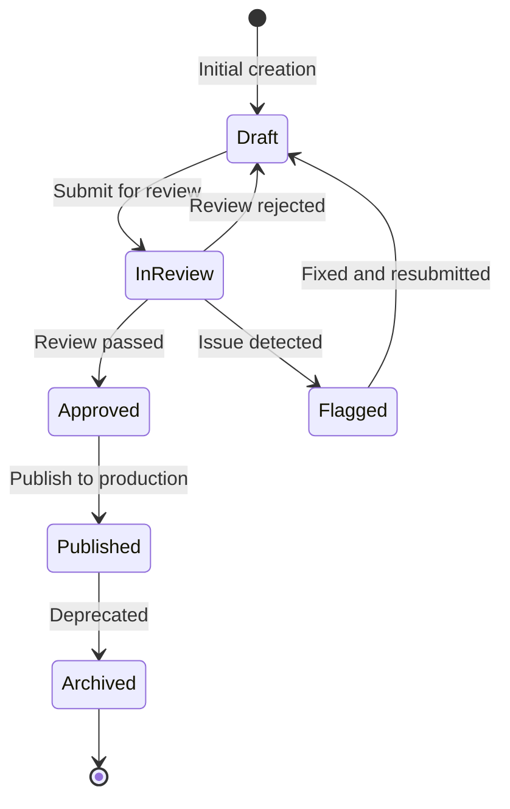
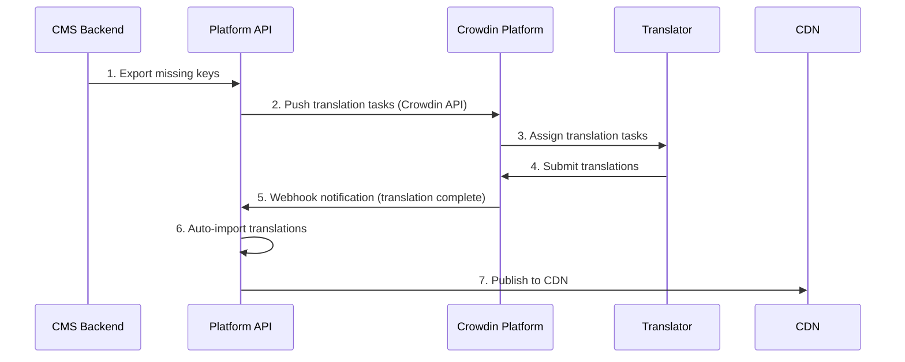

# 在地化工作流架構

> **業務需求**: [Localization Requirements](../../requirements/11_Frontend_Experience/Localization_Requirements.md)
> **規範來源**: [source-archive/11_Frontend_CMS/11-09](../../source-archive/11_Frontend_CMS/11-09_Localization_Workflow.md)
> **文件類型**: 技術架構
> **目標讀者**: 架構師、後端開發人員、營運人員

---

## 1. 翻譯狀態機



| 狀態 | 說明 | 允許操作 |
|------|------|---------|
| **draft** | 翻譯人員編輯中 | 編輯、提交 |
| **in_review** | 等待審核 | 批准、退回、標記 |
| **approved** | 等待發布 | 發布 |
| **published** | 已上線至 CDN | 歸檔 |
| **flagged** | 發現問題 | 編輯、重新提交 |
| **archived** | 已棄用 | 刪除 |

## 2. 缺失 Key 自動捕獲

```javascript
import i18next from 'i18next';
import { initReactI18next } from 'react-i18next';

i18next
  .use(initReactI18next)
  .init({
    saveMissing: true,
    missingKeyHandler: (lngs, ns, key, fallbackValue) => {
      fetch('/api/v1/i18n/missing-keys', {
        method: 'POST',
        headers: { 'Content-Type': 'application/json' },
        body: JSON.stringify({
          key: `${ns}.${key}`,
          languages: lngs,
          fallback_value: fallbackValue,
          page_url: window.location.href,
          timestamp: new Date().toISOString()
        })
      }).catch(err => console.error('Failed to report missing key:', err));
    }
  });
```

## 3. 批次匯入/匯出

### 匯出格式

**JSON 匯出**:
```http
GET /api/v1/i18n/export?lang=zh-TW&namespace=game&format=json

Response:
{
  "game.slot.freespin_won": "您贏得了 {amount} 次免費旋轉！",
  "game.slot.jackpot_hit": "恭喜中大獎！",
  "game.table.bet_placed": "下注成功"
}
```

**XLIFF 匯出**（CAT 工具標準）:
```xml
<?xml version="1.0" encoding="UTF-8"?>
<xliff version="1.2" xmlns="urn:oasis:names:tc:xliff:document:1.2">
  <file source-language="en" target-language="zh-TW" datatype="plaintext">
    <body>
      <trans-unit id="game.slot.freespin_won">
        <source>You won {amount} Free Spins!</source>
        <target>您贏得了 {amount} 次免費旋轉！</target>
        <note>Slot game win notification</note>
      </trans-unit>
    </body>
  </file>
</xliff>
```

### 批次匯入 API

```http
POST /api/v1/i18n/import
Content-Type: multipart/form-data

Request:
{
  "file": <uploaded_file>,
  "lang": "th",
  "namespace": "game",
  "mode": "upsert"
}

Response:
{
  "code": 1000,
  "message": "Import completed",
  "stats": {
    "total_keys": 150,
    "inserted": 45,
    "updated": 105,
    "errors": 0
  }
}
```

## 4. Crowdin 整合



## 5. 狀態轉換 API

**提交審核**:
```http
PUT /api/v1/i18n/translations/{key}/submit-for-review

Request:
{
  "lang": "th",
  "comment": "Thai translation completed, please review"
}

Response:
{
  "code": 1000,
  "message": "Translation submitted for review",
  "new_status": "in_review"
}
```

**發布至正式環境**:
```http
POST /api/v1/i18n/translations/publish

Request:
{
  "lang": "th",
  "keys": ["game.slot.*", "player.welcome"],
  "target_cdn": true
}

Response:
{
  "code": 1000,
  "message": "Published 128 translations to CDN",
  "cdn_url": "https://cdn.casino.com/i18n/th/game.v6.json"
}
```

## 6. 權限矩陣

| 角色 | 權限 | 職責 |
|------|------|------|
| **Translator** | 編輯草稿、提交審核 | 翻譯內容 |
| **Reviewer** | 批准/退回審核中的內容 | 品質保證 |
| **Publisher** | 發布已批准的內容至正式環境 | 發布管理 |
| **Admin** | 所有操作 | 系統管理 |

---

## 7. SmartAdmin 實作

### 7.1 Translation Workflow Service

```java
@Service
@RequiredArgsConstructor
public class TranslationWorkflowService {

    private final TranslationDao translationDao;
    private final TranslationStateManager stateManager;

    /**
     * Get translation by key and language using Vavr Option.
     */
    public Option<TranslationVO> getTranslation(String key, String lang) {
        return Option.of(translationDao.selectByKeyAndLang(key, lang))
            .map(entity -> SmartBeanUtil.copy(entity, TranslationVO.class));
    }

    /**
     * Submit translation for review.
     */
    public ResponseDTO<Void> submitForReview(TranslationSubmitForm form) {
        return stateManager.transitionState(form.getTranslationId(), TranslationState.IN_REVIEW, form);
    }
}
```

### 7.2 Translation State Manager

```java
@Component
@RequiredArgsConstructor
public class TranslationStateManager {

    private final TranslationDao translationDao;
    private final TranslationHistoryDao historyDao;

    /**
     * Transition translation state with validation.
     * @Transactional only allowed in Manager layer per SmartAdmin architecture.
     */
    @Transactional(rollbackFor = Throwable.class)
    public ResponseDTO<Void> transitionState(Long translationId, TranslationState newState, TranslationSubmitForm form) {
        TranslationEntity entity = translationDao.selectById(translationId);
        if (entity == null) {
            return ResponseDTO.userErrorParam("Translation not found");
        }

        // Validate state transition
        if (!isValidTransition(TranslationState.valueOf(entity.getStatus()), newState)) {
            return ResponseDTO.userErrorParam("Invalid state transition");
        }

        // Record history
        TranslationHistoryEntity history = new TranslationHistoryEntity();
        history.setTranslationId(translationId);
        history.setFromStatus(entity.getStatus());
        history.setToStatus(newState.name());
        history.setComment(form.getComment());
        history.setOperatorId(form.getOperatorId());
        history.setCreatedAt(LocalDateTime.now());
        historyDao.insert(history);

        // Update status
        entity.setStatus(newState.name());
        entity.setUpdatedAt(LocalDateTime.now());
        translationDao.updateById(entity);

        return ResponseDTO.ok();
    }
}
```

### 7.3 Database Schema

```sql
-- Translation key registry
CREATE TABLE t_translation_key (
    id              BIGSERIAL PRIMARY KEY,
    tenant_id       BIGINT NOT NULL,
    namespace       VARCHAR(50) NOT NULL,
    key_name        VARCHAR(200) NOT NULL,
    description     VARCHAR(500),
    source_text     TEXT NOT NULL,
    context_url     VARCHAR(500),
    created_at      TIMESTAMP NOT NULL DEFAULT NOW(),
    CONSTRAINT uk_translation_key UNIQUE (tenant_id, namespace, key_name)
);

CREATE INDEX idx_trans_key_ns ON t_translation_key(tenant_id, namespace);

-- Translation values per language
CREATE TABLE t_translation_value (
    id              BIGSERIAL PRIMARY KEY,
    key_id          BIGINT NOT NULL REFERENCES t_translation_key(id),
    lang_code       VARCHAR(10) NOT NULL,
    translated_text TEXT,
    status          VARCHAR(20) NOT NULL DEFAULT 'DRAFT',
    translator_id   BIGINT,
    reviewer_id     BIGINT,
    published_at    TIMESTAMP,
    created_at      TIMESTAMP NOT NULL DEFAULT NOW(),
    updated_at      TIMESTAMP NOT NULL DEFAULT NOW(),
    CONSTRAINT uk_trans_value UNIQUE (key_id, lang_code)
);

CREATE INDEX idx_trans_value_status ON t_translation_value(status, lang_code);

-- Translation workflow history
CREATE TABLE t_translation_history (
    id              BIGSERIAL PRIMARY KEY,
    translation_id  BIGINT NOT NULL REFERENCES t_translation_value(id),
    from_status     VARCHAR(20) NOT NULL,
    to_status       VARCHAR(20) NOT NULL,
    comment         VARCHAR(500),
    operator_id     BIGINT NOT NULL,
    created_at      TIMESTAMP NOT NULL DEFAULT NOW()
);

CREATE INDEX idx_trans_history ON t_translation_history(translation_id, created_at DESC);

-- Missing key auto-capture log
CREATE TABLE t_translation_missing_key (
    id              BIGSERIAL PRIMARY KEY,
    tenant_id       BIGINT NOT NULL,
    namespace       VARCHAR(50) NOT NULL,
    key_name        VARCHAR(200) NOT NULL,
    fallback_value  TEXT,
    page_url        VARCHAR(500),
    lang_codes      JSONB,
    captured_at     TIMESTAMP NOT NULL DEFAULT NOW(),
    resolved        BOOLEAN NOT NULL DEFAULT FALSE
);

CREATE INDEX idx_missing_key_resolved ON t_translation_missing_key(tenant_id, resolved);

-- CDN publish log
CREATE TABLE t_translation_publish (
    id              BIGSERIAL PRIMARY KEY,
    tenant_id       BIGINT NOT NULL,
    lang_code       VARCHAR(10) NOT NULL,
    namespace       VARCHAR(50),
    key_count       INTEGER NOT NULL,
    cdn_url         VARCHAR(500) NOT NULL,
    published_by    BIGINT NOT NULL,
    published_at    TIMESTAMP NOT NULL DEFAULT NOW()
);

CREATE INDEX idx_publish_tenant ON t_translation_publish(tenant_id, published_at DESC);
```
