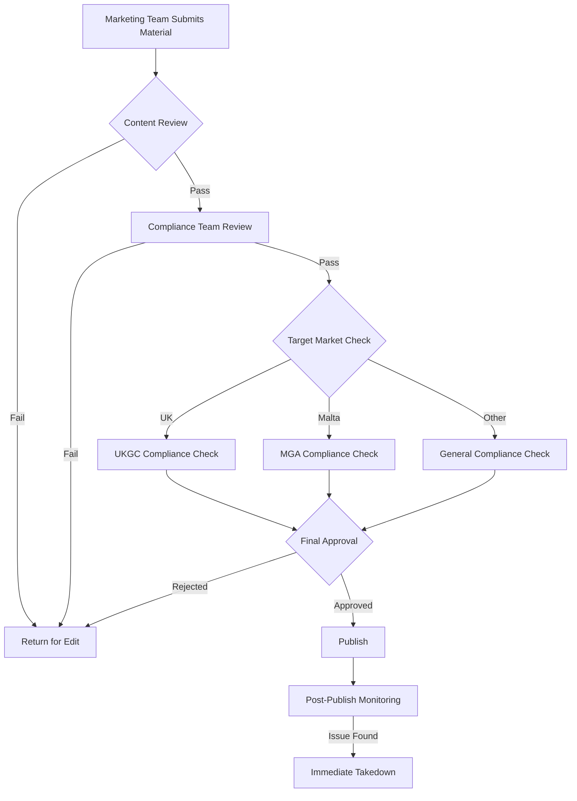

# 行銷合規架構

> **業務需求**: [Frontend UX Requirements](../../requirements/11_Frontend_Experience/Frontend_UX_Requirements.md)
> **規範來源**: [source-archive/11_Frontend_CMS/11-05](../../source-archive/11_Frontend_CMS/11-05_Marketing_Compliance.md)
> **文件類型**: 技術架構
> **目標讀者**: 架構師、後端開發人員、合規工程師

---

## 1. 廣告審核工作流



## 2. 行銷同意矩陣 (LCCP 5.1.12)

### 2.1 資料庫結構

```sql
CREATE TABLE t_player_marketing_consent (
    id BIGINT PRIMARY KEY AUTO_INCREMENT,
    player_id BIGINT NOT NULL,
    product_type ENUM('SPORTS', 'CASINO', 'POKER', 'BINGO', 'ALL') NOT NULL,
    channel_type ENUM('EMAIL', 'SMS', 'PUSH', 'PHONE', 'ALL') NOT NULL,
    consent_status BOOLEAN NOT NULL DEFAULT FALSE,
    consent_date DATETIME,
    consent_source ENUM('REGISTRATION', 'PREFERENCE_CENTER', 'API', 'SUPPORT', 'SELF_EXCLUSION_END') NOT NULL,
    ip_address VARCHAR(45),
    user_agent VARCHAR(500),
    device_fingerprint VARCHAR(100),
    created_at DATETIME NOT NULL DEFAULT CURRENT_TIMESTAMP,
    updated_at DATETIME ON UPDATE CURRENT_TIMESTAMP,
    UNIQUE KEY uk_player_product_channel (player_id, product_type, channel_type),
    INDEX idx_player_id (player_id)
) ENGINE=InnoDB;

CREATE TABLE t_marketing_consent_audit (
    id BIGINT PRIMARY KEY AUTO_INCREMENT,
    player_id BIGINT NOT NULL,
    product_type VARCHAR(20) NOT NULL,
    channel_type VARCHAR(20) NOT NULL,
    old_status BOOLEAN,
    new_status BOOLEAN NOT NULL,
    change_reason VARCHAR(200),
    changed_by_type ENUM('PLAYER', 'SYSTEM', 'SUPPORT') NOT NULL,
    changed_by_id BIGINT,
    ip_address VARCHAR(45),
    changed_at DATETIME NOT NULL DEFAULT CURRENT_TIMESTAMP,
    INDEX idx_player_changed (player_id, changed_at)
) ENGINE=InnoDB COMMENT='7-year retention';
```

### 2.2 同意管理 API

```java
@RestController
@RequestMapping("/api/v1/player/marketing-consent")
@RequiredArgsConstructor
public class MarketingConsentController {

    private final MarketingConsentService service;

    @GetMapping
    @SaCheckLogin
    public ResponseDTO<MarketingConsentMatrixVO> getConsentMatrix() {
        Long playerId = StpUtil.getLoginIdAsLong();
        return ResponseDTO.ok(service.getConsentMatrix(playerId));
    }

    @PutMapping
    @SaCheckLogin
    public ResponseDTO<Void> updateConsent(
            @RequestBody @Valid MarketingConsentUpdateForm form,
            HttpServletRequest request) {
        Long playerId = StpUtil.getLoginIdAsLong();
        service.updateConsent(playerId, form, getMetadata(request));
        return ResponseDTO.ok();
    }

    @PostMapping("/opt-out-all")
    @SaCheckLogin
    public ResponseDTO<Void> optOutAll(HttpServletRequest request) {
        Long playerId = StpUtil.getLoginIdAsLong();
        service.optOutAll(playerId, getMetadata(request));
        return ResponseDTO.ok();
    }
}
```

### 2.3 自我排除結束處理器

```java
@Service
@RequiredArgsConstructor
public class SelfExclusionEndHandler {
    private final MarketingConsentService consentService;

    @EventListener
    public void onSelfExclusionEnd(SelfExclusionEndEvent event) {
        Long playerId = event.getPlayerId();
        consentService.resetAllConsent(playerId, ConsentSource.SELF_EXCLUSION_END);
        consentService.logAudit(playerId, "ALL", "ALL",
            true, false, "Self-exclusion ended - consent reset");
        playerService.setForcePreferenceConfirm(playerId, true);
    }
}
```

## 3. 行銷排除查詢

```sql
SELECT p.id, p.email
FROM t_player p
JOIN t_player_marketing_preference pmp ON p.id = pmp.player_id
WHERE pmp.email_opt_in = TRUE
  AND pmp.promotional_opt_in = TRUE
  AND pmp.is_self_excluded = FALSE
  AND pmp.is_cooling_off = FALSE
  AND NOT EXISTS (
    SELECT 1 FROM t_gamstop_check gc
    WHERE gc.player_id = p.id AND gc.is_excluded = TRUE
  );
```

## 4. CRM 整合

```java
@Service
@RequiredArgsConstructor
public class MarketingCampaignService {
    private final MarketingConsentService consentService;

    public List<Long> filterEligiblePlayers(
            List<Long> playerIds, ProductType product, ChannelType channel) {
        return playerIds.stream()
            .filter(playerId -> consentService.hasConsent(playerId, product, channel))
            .filter(playerId -> !selfExclusionService.isExcluded(playerId))
            .filter(playerId -> !coolingOffService.isInCoolingOff(playerId))
            .collect(Collectors.toList());
    }
}
```

## 5. 合規培訓追蹤

```sql
CREATE TABLE t_compliance_training_record (
    id BIGINT PRIMARY KEY AUTO_INCREMENT,
    employee_id BIGINT NOT NULL,
    training_type VARCHAR(100) NOT NULL,
    training_date DATE NOT NULL,
    passed BOOLEAN DEFAULT FALSE,
    score DECIMAL(5,2),
    certificate_url VARCHAR(500),
    expiry_date DATE,
    created_at DATETIME DEFAULT CURRENT_TIMESTAMP,
    INDEX idx_employee_id (employee_id),
    INDEX idx_expiry_date (expiry_date)
);
```

## 6. 月度合規報告

```sql
SELECT
    DATE_FORMAT(created_at, '%Y-%m') AS report_month,
    COUNT(*) AS total_campaigns,
    SUM(CASE WHEN status = 'APPROVED' THEN 1 ELSE 0 END) AS approved,
    SUM(CASE WHEN status = 'REJECTED' THEN 1 ELSE 0 END) AS rejected,
    ROUND(SUM(CASE WHEN status = 'REJECTED' THEN 1 ELSE 0 END) * 100.0 / COUNT(*), 2) AS rejection_rate
FROM t_marketing_campaign_review
WHERE created_at >= DATE_SUB(CURDATE(), INTERVAL 12 MONTH)
GROUP BY DATE_FORMAT(created_at, '%Y-%m')
ORDER BY report_month DESC;
```

---

## 合規缺口說明（Compliance Gap Notes）

> **UKGC LCCP 3.1 缺口**: 目前行銷合規模組尚未完全涵蓋 UKGC（UK Gambling Commission）LCCP（Licence Conditions and Codes of Practice）3.1 條款「公平開放行銷」（Fair and Open Marketing）要求：
> - **行銷內容公平性**: 所有促銷條件（流水倍數、最大贏取額、有效期）必須在行銷素材中清晰標示
> - **脆弱群體保護**: 禁止對自我排除玩家和已標記問題賭博玩家發送行銷訊息
> - **年齡驗證**: 所有行銷管道必須確認收件人年齡 >= 18
>
> **相關**: [Self_Exclusion_Architecture.md](../../architecture/15_Responsible_Gambling/Self_Exclusion_Architecture.md) — 自我排除玩家清單整合
