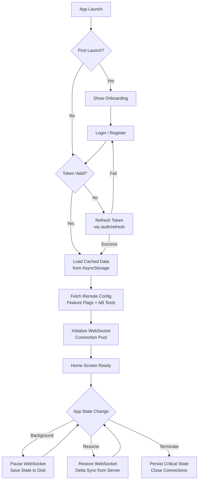
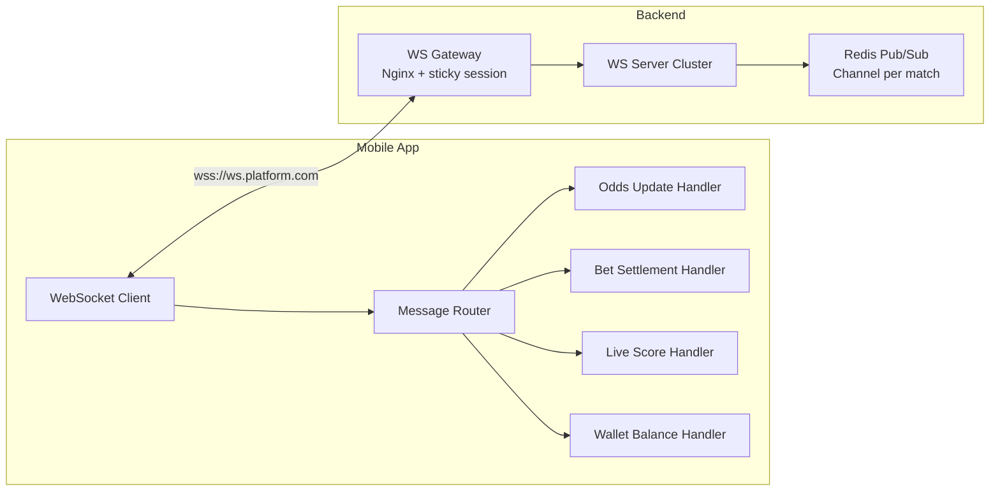

# Mobile App Architecture

> **Business Requirements**: [Mobile App Requirements](../../requirements/11_Frontend_Experience/Mobile_App_Requirements.md)
> **Canonical Source**: [source-archive/11_Frontend_CMS/11-04](../../source-archive/11_Frontend_CMS/11-04_Mobile_App_Architecture.md)
> **View Type**: Technical Architecture
> **Target Audience**: Architects, Mobile Developers

---

## 1. Framework Comparison

| Aspect | Flutter | React Native | Recommendation |
|--------|---------|--------------|----------------|
| Language | Dart | JavaScript/TypeScript | RN for frontend teams |
| Performance | Near-native | Slightly below Flutter | Flutter for game lobby |
| Hot Update | Not officially supported | CodePush (mature) | RN for iGaming hot update needs |
| Bundle Size | 15-20MB | 25-30MB | Flutter lighter |

## 2. Hot Update (CodePush)

```javascript
import codePush from "react-native-code-push";

const codePushOptions = {
  checkFrequency: codePush.CheckFrequency.ON_APP_RESUME,
  installMode: codePush.InstallMode.ON_NEXT_RESUME,
  minimumBackgroundDuration: 60 * 5, // 5 min background before update
};

export default codePush(codePushOptions)(App);
```

## 3. Offline Storage

```javascript
import { persistStore, persistReducer } from 'redux-persist';
import AsyncStorage from '@react-native-async-storage/async-storage';

const persistConfig = {
  key: 'root',
  storage: AsyncStorage,
  whitelist: ['user', 'gameHistory', 'promotions'],
};

const persistedReducer = persistReducer(persistConfig, rootReducer);
```

## 4. Push Notification Architecture

### 4.1 Deep Linking

```javascript
messaging().onNotificationOpenedApp(remoteMessage => {
  const { screen, params } = remoteMessage.data;
  switch(screen) {
    case 'promotion':
      navigation.navigate('PromotionDetail', { id: params.promotionId });
      break;
    case 'withdrawal':
      navigation.navigate('WithdrawalStatus', { id: params.withdrawalId });
      break;
  }
});
```

### 4.2 Anti-Disturbance Config

```javascript
const pushConfig = {
  maxDailyPushes: 5,
  quietHours: { start: "23:00", end: "09:00" },
  userPreference: true,
};
```

## 5. Performance Optimization

### 5.1 Image Caching & List Virtualization

```javascript
<FastImage
  source={{ uri: gameImage, priority: FastImage.priority.normal }}
  cacheControl="max-age=86400"
  resizeMode="cover"
/>

<FlatList
  data={games}
  renderItem={renderGame}
  windowSize={5}
  removeClippedSubviews={true}
  maxToRenderPerBatch={10}
/>
```

## 6. Security Implementation

### 6.1 Error Boundary

```javascript
class ErrorBoundary extends React.Component {
  componentDidCatch(error, errorInfo) {
    logErrorToService(error, errorInfo);
    this.setState({ hasError: true });
  }
}
```

### 6.2 Security Stack

- **APK Packing**: 360/Tencent hardening
- **Code Obfuscation**: ProGuard (Android) / Strip Symbols (iOS)
- **SSL Pinning**: Prevent MITM attacks
- **API Signature**: Request signing for tamper prevention
- **Local Encryption**: AES-256 for AsyncStorage
- **Keychain/KeyStore**: Token storage in system-level secure storage

## 7. App Lifecycle Management



### 7.1 Background-to-Foreground Delta Sync

When a player returns from background, the app performs a delta sync rather than a full reload:

```javascript
const DeltaSyncManager = {
  lastSyncTimestamp: null,

  async onAppResume() {
    const delta = await api.get('/sync/delta', {
      params: { since: this.lastSyncTimestamp }
    });

    // Apply incremental updates
    if (delta.walletBalance !== undefined) {
      store.dispatch(updateBalance(delta.walletBalance));
    }
    if (delta.activeBets?.length > 0) {
      store.dispatch(updateActiveBets(delta.activeBets));
    }
    if (delta.notifications?.length > 0) {
      store.dispatch(appendNotifications(delta.notifications));
    }

    this.lastSyncTimestamp = Date.now();
  },
};
```

## 8. WebSocket Real-Time Updates for Live Betting

### 8.1 Connection Architecture



### 8.2 WebSocket Client Implementation

```javascript
import ReconnectingWebSocket from 'reconnecting-websocket';

const WS_URL = 'wss://ws.platform.com/live';

class LiveBettingSocket {
  constructor() {
    this.ws = new ReconnectingWebSocket(WS_URL, [], {
      maxRetries: 10,
      reconnectionDelayGrowFactor: 1.5,
      maxReconnectionDelay: 30000,
      connectionTimeout: 5000,
    });

    this.ws.onmessage = this.handleMessage.bind(this);
  }

  subscribe(matchId) {
    this.ws.send(JSON.stringify({
      action: 'subscribe',
      channel: `match:${matchId}`,
      token: getAuthToken(),
    }));
  }

  handleMessage(event) {
    const msg = JSON.parse(event.data);
    switch (msg.type) {
      case 'odds_update':
        store.dispatch(updateOdds(msg.matchId, msg.markets));
        break;
      case 'score_update':
        store.dispatch(updateScore(msg.matchId, msg.score));
        break;
      case 'bet_settled':
        store.dispatch(settleBet(msg.betId, msg.result));
        HapticFeedback.trigger('notificationSuccess');
        break;
      case 'wallet_update':
        store.dispatch(updateBalance(msg.balance));
        break;
    }
  }
}
```

### 8.3 Offline Queue for Bet Placement

When network is unstable, bet requests are queued locally and retried:

```javascript
const BetQueue = {
  queue: [],

  async placeBet(betRequest) {
    if (!navigator.onLine) {
      this.queue.push({ ...betRequest, timestamp: Date.now() });
      showToast('Bet queued - will submit when online');
      return;
    }
    return this.submitBet(betRequest);
  },

  async flushQueue() {
    const expired = 30000; // 30s max staleness for odds
    const validBets = this.queue.filter(
      b => Date.now() - b.timestamp < expired
    );
    for (const bet of validBets) {
      await this.submitBet(bet);
    }
    this.queue = [];
  },
};
```

---

## 9. Database Schema

```sql
-- Mobile app version configuration
CREATE TABLE t_mobile_app_version (
    id              BIGSERIAL PRIMARY KEY,
    platform        VARCHAR(20) NOT NULL,
    version_code    INTEGER NOT NULL,
    version_name    VARCHAR(20) NOT NULL,
    min_sdk_version INTEGER,
    download_url    VARCHAR(500),
    release_notes   TEXT,
    force_update    BOOLEAN NOT NULL DEFAULT FALSE,
    enabled         BOOLEAN NOT NULL DEFAULT TRUE,
    released_at     TIMESTAMP,
    created_at      TIMESTAMP NOT NULL DEFAULT NOW(),
    CONSTRAINT uk_app_version UNIQUE (platform, version_code)
);

CREATE INDEX idx_app_platform ON t_mobile_app_version(platform, enabled);

-- CodePush deployment tracking
CREATE TABLE t_codepush_deployment (
    id              BIGSERIAL PRIMARY KEY,
    deployment_key  VARCHAR(100) NOT NULL,
    app_version     VARCHAR(20) NOT NULL,
    label           VARCHAR(50) NOT NULL,
    description     TEXT,
    is_mandatory    BOOLEAN NOT NULL DEFAULT FALSE,
    rollout_percent INTEGER NOT NULL DEFAULT 100,
    installed_count BIGINT NOT NULL DEFAULT 0,
    active_count    BIGINT NOT NULL DEFAULT 0,
    released_at     TIMESTAMP NOT NULL DEFAULT NOW()
);

CREATE INDEX idx_codepush_version ON t_codepush_deployment(app_version, released_at DESC);

-- Push notification configuration
CREATE TABLE t_push_notification_config (
    id              BIGSERIAL PRIMARY KEY,
    config_key      VARCHAR(100) NOT NULL UNIQUE,
    max_daily_pushes INTEGER NOT NULL DEFAULT 5,
    quiet_hours_start TIME,
    quiet_hours_end TIME,
    enabled         BOOLEAN NOT NULL DEFAULT TRUE,
    created_at      TIMESTAMP NOT NULL DEFAULT NOW(),
    updated_at      TIMESTAMP NOT NULL DEFAULT NOW()
);

-- Device registration
CREATE TABLE t_mobile_device_registration (
    id              BIGSERIAL PRIMARY KEY,
    player_id       BIGINT NOT NULL,
    device_id       VARCHAR(200) NOT NULL,
    platform        VARCHAR(20) NOT NULL,
    push_token      VARCHAR(500),
    app_version     VARCHAR(20),
    os_version      VARCHAR(50),
    device_model    VARCHAR(100),
    last_active     TIMESTAMP NOT NULL DEFAULT NOW(),
    created_at      TIMESTAMP NOT NULL DEFAULT NOW(),
    CONSTRAINT uk_device_player UNIQUE (player_id, device_id)
);

CREATE INDEX idx_device_player ON t_mobile_device_registration(player_id);
CREATE INDEX idx_device_token ON t_mobile_device_registration(push_token) WHERE push_token IS NOT NULL;
```
