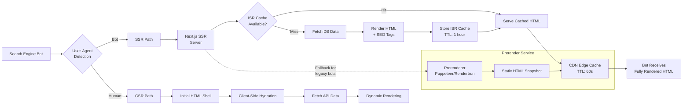

# SEO & Performance Architecture

> **Business Requirements**: [SEO Performance Requirements](../../requirements/11_Frontend_Experience/SEO_Performance_Requirements.md)
> **Canonical Source**: [source-archive/11_Frontend_CMS/11-03](../../source-archive/11_Frontend_CMS/11-03_SEO_and_Performance.md)
> **View Type**: Technical Architecture
> **Target Audience**: Architects, Frontend Developers

---

## 1. SSR/ISR Rendering Strategy

### 1.1 Next.js ISR Configuration

```javascript
// pages/games/[provider]/[slug].tsx
export async function getStaticPaths() {
  const topGames = await fetchTopGames(100);
  return {
    paths: topGames.map(game => ({
      params: { provider: game.provider, slug: game.slug }
    })),
    fallback: 'blocking'
  };
}

export async function getStaticProps({ params }) {
  const game = await fetchGameBySlug(params.provider, params.slug);
  return {
    props: { game },
    revalidate: 3600 // Regenerate every hour
  };
}
```

### 1.2 Canonical URL

```html
<link rel="canonical" href="https://www.casino.com/games/pg-soft/mahjong-ways-2" />
```

### 1.3 Open Graph Tags

```html
<meta property="og:title" content="Mahjong Ways 2 - Play Free Demo | Casino" />
<meta property="og:description" content="Play Mahjong Ways 2 by PG Soft. 96.81% RTP." />
<meta property="og:image" content="https://cdn.casino.com/games/mahjong-ways-2.jpg" />
<meta property="og:url" content="https://www.casino.com/games/pg-soft/mahjong-ways-2" />
```

## 2. Hreflang Configuration

```html
<link rel="alternate" hreflang="en" href="https://www.casino.com/games/slot1" />
<link rel="alternate" hreflang="th" href="https://www.casino.com/th/games/slot1" />
<link rel="alternate" hreflang="vi" href="https://www.casino.com/vi/games/slot1" />
<link rel="alternate" hreflang="x-default" href="https://www.casino.com/games/slot1" />
```

**Sitemap Integration**:
```xml
<url>
  <loc>https://www.casino.com/games/slot1</loc>
  <xhtml:link rel="alternate" hreflang="en" href="https://www.casino.com/games/slot1" />
  <xhtml:link rel="alternate" hreflang="th" href="https://www.casino.com/th/games/slot1" />
</url>
```

## 3. Structured Data (Schema.org)

```html
<script type="application/ld+json">
{
  "@context": "https://schema.org",
  "@type": "VideoGame",
  "name": "Mahjong Ways 2",
  "description": "Exciting slot game with Mahjong theme",
  "gamePlatform": ["Web Browser", "iOS", "Android"],
  "applicationCategory": "Casino Game",
  "offers": {
    "@type": "Offer", "price": "0", "priceCurrency": "USD"
  },
  "aggregateRating": {
    "@type": "AggregateRating",
    "ratingValue": "4.7", "ratingCount": "1234"
  },
  "provider": {"@type": "Organization", "name": "PG Soft"}
}
</script>
```

## 4. Multi-Layer Cache Architecture

```
+--------------------------------------------+
|  Cloudflare CDN (Edge Cache)               |
|  - HTML: TTL 60s                           |
|  - JS/CSS: TTL 7 days (immutable)          |
|  - Images: TTL 30 days                     |
+----------------+---------------------------+
                 |
+----------------v---------------------------+
|  Origin Server (Next.js)                   |
|  - ISR Cache: 3600s                        |
|  - API Cache: Redis 300s                   |
+----------------+---------------------------+
                 |
+----------------v---------------------------+
|  Database (MySQL)                          |
+--------------------------------------------+
```

### Cache-Control Headers

```nginx
# Static resources (versioned)
location /static/ {
    add_header Cache-Control "public, max-age=31536000, immutable";
}

# HTML pages
location / {
    add_header Cache-Control "public, max-age=60, s-maxage=60, stale-while-revalidate=120";
}
```

### Cache Invalidation

```javascript
async function purgeGameCache(gameSlug) {
  await cloudflarePurge([`/games/*/${gameSlug}`, `/api/games/${gameSlug}`]);
  await redisDel(`game:${gameSlug}`);
}
```

### 4.1 SEO Content Rendering Pipeline



## 5. Image Optimization

```html
<picture>
  <source srcset="/games/slot1.avif" type="image/avif" />
  <source srcset="/games/slot1.webp" type="image/webp" />
  
</picture>
```

**CDN Image Transformation**:
```
https://cdn.casino.com/games/slot1.jpg?w=400&h=300&fit=cover&fm=webp&q=85
```

## 6. Performance Monitoring

### 6.1 Core Web Vitals Tracking

```javascript
import { getCLS, getFID, getLCP } from 'web-vitals';

function sendToAnalytics({ name, value, id }) {
  gtag('event', name, {
    event_category: 'Web Vitals',
    value: Math.round(name === 'CLS' ? value * 1000 : value),
    event_label: id, non_interaction: true,
  });
}

getCLS(sendToAnalytics);
getFID(sendToAnalytics);
getLCP(sendToAnalytics);
```

### 6.2 Lighthouse CI

```json
{
  "ci": {
    "assert": {
      "assertions": {
        "categories:performance": ["error", {"minScore": 0.9}],
        "first-contentful-paint": ["error", {"maxNumericValue": 2000}],
        "largest-contentful-paint": ["error", {"maxNumericValue": 2500}],
        "cumulative-layout-shift": ["error", {"maxNumericValue": 0.1}]
      }
    }
  }
}
```

## 7. Database Schema

### 7.1 seo_page_configs

```sql
CREATE TABLE seo_page_configs (
    config_id BIGSERIAL PRIMARY KEY,
    page_type VARCHAR(50) NOT NULL CHECK (page_type IN ('game_detail', 'game_list', 'promotion', 'landing_page', 'blog_post', 'homepage')),
    page_identifier VARCHAR(200) NOT NULL,  -- e.g., 'pg-soft/mahjong-ways-2' for game_detail

    -- SEO metadata (JSONB for multi-language support)
    title JSONB NOT NULL,  -- {"en": "Mahjong Ways 2 - Play Free", "th": "เล่น Mahjong Ways 2"}
    description JSONB NOT NULL,
    keywords TEXT[],  -- ['slot', 'mahjong', 'pg-soft', 'high-rtp']

    -- Open Graph tags
    og_title JSONB,
    og_description JSONB,
    og_image_url TEXT,
    og_type VARCHAR(50) DEFAULT 'website',

    -- Structured data (Schema.org)
    structured_data JSONB,  -- Full JSON-LD schema

    -- Canonical and hreflang
    canonical_url TEXT NOT NULL,
    hreflang_urls JSONB,  -- {"en": "https://...", "th": "https://..."}

    -- ISR/SSR configuration
    render_strategy VARCHAR(20) DEFAULT 'isr' CHECK (render_strategy IN ('ssr', 'isr', 'ssg', 'csr')),
    revalidate_seconds INT DEFAULT 3600,
    prerender_enabled BOOLEAN DEFAULT FALSE,

    -- Cache settings
    edge_cache_ttl INT DEFAULT 60,  -- CDN edge cache TTL (seconds)
    browser_cache_ttl INT DEFAULT 0,  -- Browser cache TTL

    -- Status
    status VARCHAR(20) DEFAULT 'active' CHECK (status IN ('active', 'testing', 'disabled')),

    created_at TIMESTAMP WITH TIME ZONE DEFAULT CURRENT_TIMESTAMP,
    updated_at TIMESTAMP WITH TIME ZONE DEFAULT CURRENT_TIMESTAMP,
    created_by BIGINT REFERENCES t_employee(employee_id),

    UNIQUE(page_type, page_identifier)
);

CREATE INDEX idx_seo_page_type_status ON seo_page_configs(page_type, status);
CREATE INDEX idx_seo_page_identifier ON seo_page_configs(page_identifier);
CREATE INDEX idx_seo_structured_data_gin ON seo_page_configs USING gin(structured_data jsonb_path_ops);
```

### 7.2 seo_metrics

```sql
CREATE TABLE seo_metrics (
    metric_id BIGSERIAL PRIMARY KEY,
    config_id BIGINT NOT NULL REFERENCES seo_page_configs(config_id),
    page_url TEXT NOT NULL,

    -- Core Web Vitals (from RUM data)
    lcp_value DECIMAL(6,2),  -- Largest Contentful Paint (ms)
    fid_value DECIMAL(6,2),  -- First Input Delay (ms)
    cls_value DECIMAL(4,3),  -- Cumulative Layout Shift

    -- Lighthouse scores (from CI or on-demand audits)
    performance_score DECIMAL(3,2),  -- 0.00-1.00
    seo_score DECIMAL(3,2),
    accessibility_score DECIMAL(3,2),
    best_practices_score DECIMAL(3,2),

    -- Search engine crawl data
    last_crawled_at TIMESTAMP WITH TIME ZONE,
    crawler_user_agent TEXT,
    http_status_code INT,
    response_time_ms INT,

    -- Indexing status
    indexed_by_google BOOLEAN DEFAULT FALSE,
    indexed_by_bing BOOLEAN DEFAULT FALSE,
    index_blocked_reason TEXT,

    -- Organic traffic (from Google Analytics)
    organic_sessions INT DEFAULT 0,
    organic_conversion_rate DECIMAL(5,4),  -- 0.0000-1.0000

    created_at TIMESTAMP WITH TIME ZONE DEFAULT CURRENT_TIMESTAMP
);

CREATE INDEX idx_seo_metrics_config ON seo_metrics(config_id, created_at DESC);
CREATE INDEX idx_seo_metrics_url ON seo_metrics(page_url);
CREATE INDEX idx_seo_metrics_crawled ON seo_metrics(last_crawled_at DESC);
CREATE INDEX idx_seo_metrics_performance ON seo_metrics(performance_score, lcp_value);
```

**Monitoring Integration**:
- Web Vitals data collected via `web-vitals` library and stored in `seo_metrics`
- Lighthouse CI runs on every deployment and updates `performance_score`, `seo_score`
- Google Search Console API integration updates `indexed_by_google`, `organic_sessions`
- Scheduled crawler (Puppeteer) validates rendered HTML and updates `http_status_code`, `response_time_ms`
