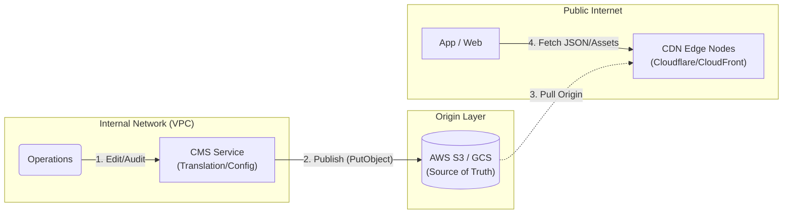

# i18n Localization Architecture

> **Business Requirements**: [Localization Requirements](../../requirements/11_Frontend_Experience/Localization_Requirements.md)
> **Canonical Source**: [source-archive/11_Frontend_CMS/11-07](../../source-archive/11_Frontend_CMS/11-07_i18n_Localization.md)
> **View Type**: Technical Architecture
> **Target Audience**: Architects, Frontend Developers, Backend Developers

---

## 1. Translation Service Architecture



## 2. Translation Key Management

**Namespace Structure**: `module.component.key`

```javascript
// Correct: Use Translation Key
<button>{t('common.button.submit')}</button>

// Anti-pattern: Hardcoded string
<button>Submit</button>
```

## 3. Locale Format Standards

```javascript
// Use Intl API for currency formatting
const formatter = new Intl.NumberFormat('th-TH', {
  style: 'currency',
  currency: 'THB'
});
formatter.format(1234.56);  // "฿1,234.56"

// Use dayjs + locale for date formatting
import dayjs from 'dayjs';
import 'dayjs/locale/th';

dayjs().locale('th').format('DD MMMM YYYY');  // "27 มกราคม 2026"
```

## 4. RTL Language Support

```javascript
// Frontend RTL detection
const isRTL = ['ar', 'he', 'fa'].includes(currentLang);

if (isRTL) {
  document.documentElement.setAttribute('dir', 'rtl');
  document.body.classList.add('rtl');
}

// CSS: Use logical properties (auto-adapt RTL)
.container {
  padding-inline-start: 20px;  // LTR: padding-left, RTL: padding-right
  padding-inline-end: 40px;    // LTR: padding-right, RTL: padding-left
}

// Mirror icons for RTL
[dir="rtl"] .back-arrow {
  transform: scaleX(-1);  // Flip horizontally
}
```

## 5. CDN Distribution Strategy

**URL Structure**:
```
https://cdn.casino.com/i18n/{lang}/{namespace}.v{version}.json
```

**CloudFront Distribution Settings**:
```javascript
{
  "Origins": [{
    "DomainName": "s3-translations.casino.com",
    "OriginPath": "/i18n"
  }],
  "DefaultCacheBehavior": {
    "ViewerProtocolPolicy": "redirect-to-https",
    "CachePolicyId": "658327ea-f89d-4fab-a63d-7e88639e58f6",
    "Compress": true
  },
  "CustomErrorResponses": [
    {
      "ErrorCode": 404,
      "ResponseCode": 200,
      "ResponsePagePath": "/i18n/en/fallback.json"
    }
  ]
}
```

## 6. Frontend Local Caching

```javascript
// localStorage caching strategy
const cacheKey = `i18n_${lang}_${namespace}_v${version}`;
let translations = localStorage.getItem(cacheKey);

if (!translations) {
  translations = await fetch(`https://cdn.casino.com/i18n/${lang}/${namespace}.v${version}.json`)
    .then(r => r.json());
  localStorage.setItem(cacheKey, JSON.stringify(translations));
}

// Auto-clear old versions
Object.keys(localStorage)
  .filter(k => k.startsWith('i18n_') && !k.endsWith(`_v${currentVersion}`))
  .forEach(k => localStorage.removeItem(k));
```

## 7. Language-Specific Considerations

| Language | Key Issue | Solution |
|----------|-----------|----------|
| **Thai** | No space word separation | CSS `word-break: break-word` |
| **Vietnamese** | Extensive diacritics | Noto Sans Vietnamese font |
| **Arabic** | RTL layout + cursive joining | Logical CSS properties + Noto Sans Arabic |
