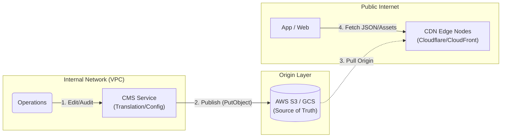

# i18n 國際化架構

> **業務需求**: [Localization Requirements](../../requirements/11_Frontend_Experience/Localization_Requirements.md)
> **規範來源**: [source-archive/11_Frontend_CMS/11-07](../../source-archive/11_Frontend_CMS/11-07_i18n_Localization.md)
> **文件類型**: 技術架構
> **目標讀者**: 架構師、前端開發人員、後端開發人員

---

## 1. 翻譯服務架構



## 2. 翻譯 Key 管理

**命名空間結構**: `module.component.key`

```javascript
// Correct: Use Translation Key
<button>{t('common.button.submit')}</button>

// Anti-pattern: Hardcoded string
<button>Submit</button>
```

## 3. 地區格式標準

```javascript
// Use Intl API for currency formatting
const formatter = new Intl.NumberFormat('th-TH', {
  style: 'currency',
  currency: 'THB'
});
formatter.format(1234.56);  // "฿1,234.56"

// Use dayjs + locale for date formatting
import dayjs from 'dayjs';
import 'dayjs/locale/th';

dayjs().locale('th').format('DD MMMM YYYY');  // "27 มกราคม 2026"
```

## 4. RTL 語言支援

```javascript
// Frontend RTL detection
const isRTL = ['ar', 'he', 'fa'].includes(currentLang);

if (isRTL) {
  document.documentElement.setAttribute('dir', 'rtl');
  document.body.classList.add('rtl');
}

// CSS: Use logical properties (auto-adapt RTL)
.container {
  padding-inline-start: 20px;  // LTR: padding-left, RTL: padding-right
  padding-inline-end: 40px;    // LTR: padding-right, RTL: padding-left
}

// Mirror icons for RTL
[dir="rtl"] .back-arrow {
  transform: scaleX(-1);  // Flip horizontally
}
```

## 5. CDN 分發策略

**URL 結構**:
```
https://cdn.casino.com/i18n/{lang}/{namespace}.v{version}.json
```

**CloudFront 分發設定**:
```javascript
{
  "Origins": [{
    "DomainName": "s3-translations.casino.com",
    "OriginPath": "/i18n"
  }],
  "DefaultCacheBehavior": {
    "ViewerProtocolPolicy": "redirect-to-https",
    "CachePolicyId": "658327ea-f89d-4fab-a63d-7e88639e58f6",
    "Compress": true
  },
  "CustomErrorResponses": [
    {
      "ErrorCode": 404,
      "ResponseCode": 200,
      "ResponsePagePath": "/i18n/en/fallback.json"
    }
  ]
}
```

## 6. 前端本機快取

```javascript
// localStorage caching strategy
const cacheKey = `i18n_${lang}_${namespace}_v${version}`;
let translations = localStorage.getItem(cacheKey);

if (!translations) {
  translations = await fetch(`https://cdn.casino.com/i18n/${lang}/${namespace}.v${version}.json`)
    .then(r => r.json());
  localStorage.setItem(cacheKey, JSON.stringify(translations));
}

// Auto-clear old versions
Object.keys(localStorage)
  .filter(k => k.startsWith('i18n_') && !k.endsWith(`_v${currentVersion}`))
  .forEach(k => localStorage.removeItem(k));
```

## 7. 各語言特殊考量

| 語言 | 關鍵問題 | 解決方案 |
|------|---------|---------|
| **泰語** | 無空格分詞 | CSS `word-break: break-word` |
| **越南語** | 大量變音符號 | Noto Sans Vietnamese 字型 |
| **阿拉伯語** | RTL 佈局 + 連體書寫 | 邏輯 CSS 屬性 + Noto Sans Arabic |

---

## 8. 資料庫結構

```sql
-- Translation key registry
CREATE TABLE t_translation_key (
    id              BIGSERIAL PRIMARY KEY,
    namespace       VARCHAR(50) NOT NULL,
    key_path        VARCHAR(200) NOT NULL,
    description     VARCHAR(500),
    context         TEXT,
    max_length      INTEGER,
    created_at      TIMESTAMP NOT NULL DEFAULT NOW(),
    updated_at      TIMESTAMP NOT NULL DEFAULT NOW(),
    CONSTRAINT uk_translation_key UNIQUE (namespace, key_path)
);

CREATE INDEX idx_trans_namespace ON t_translation_key(namespace);

-- Translation values per locale
CREATE TABLE t_translation_value (
    id              BIGSERIAL PRIMARY KEY,
    key_id          BIGINT NOT NULL REFERENCES t_translation_key(id),
    locale          VARCHAR(10) NOT NULL,
    value           TEXT NOT NULL,
    status          VARCHAR(20) NOT NULL DEFAULT 'DRAFT',
    translator_id   BIGINT,
    reviewed_by     BIGINT,
    reviewed_at     TIMESTAMP,
    created_at      TIMESTAMP NOT NULL DEFAULT NOW(),
    updated_at      TIMESTAMP NOT NULL DEFAULT NOW(),
    CONSTRAINT uk_translation_value UNIQUE (key_id, locale)
);

CREATE INDEX idx_trans_locale ON t_translation_value(locale, status);

-- Supported locales configuration
CREATE TABLE t_supported_locale (
    id              BIGSERIAL PRIMARY KEY,
    locale_code     VARCHAR(10) NOT NULL UNIQUE,
    display_name    VARCHAR(100) NOT NULL,
    native_name     VARCHAR(100) NOT NULL,
    is_rtl          BOOLEAN NOT NULL DEFAULT FALSE,
    font_family     VARCHAR(200),
    fallback_locale VARCHAR(10),
    enabled         BOOLEAN NOT NULL DEFAULT TRUE,
    sort_order      INTEGER NOT NULL DEFAULT 0,
    created_at      TIMESTAMP NOT NULL DEFAULT NOW()
);

-- Translation publish history
CREATE TABLE t_translation_publish (
    id              BIGSERIAL PRIMARY KEY,
    namespace       VARCHAR(50) NOT NULL,
    locale          VARCHAR(10) NOT NULL,
    version         VARCHAR(20) NOT NULL,
    cdn_path        VARCHAR(500) NOT NULL,
    published_by    BIGINT NOT NULL,
    published_at    TIMESTAMP NOT NULL DEFAULT NOW(),
    key_count       INTEGER NOT NULL DEFAULT 0
);

CREATE INDEX idx_publish_locale ON t_translation_publish(locale, namespace, published_at DESC);
```
