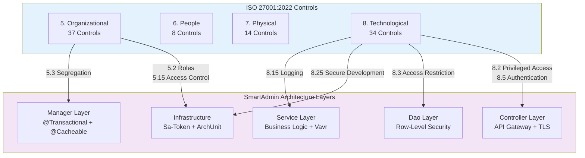

# ISO 27001:2022 對照架構

> **業務需求**: [Compliance Standards Requirements](../../requirements/12_Security_Compliance/02_Compliance_Standards_Requirements.md)
> **規範來源**: [source-archive/12_System_Security/12-04](../../source-archive/12_System_Security/12-04_ISO27001_2022_Mapping.md)
> **文件類型**: 技術架構
> **目標讀者**: 架構師、安全工程師、合規主管

---

## 1. Annex A 控制項結構

ISO/IEC 27001:2022 將 114 項控制（2013 版本）整合為 4 大類別共 93 項控制：

| 類別 | 控制項數量 | 說明 | SmartAdmin 覆蓋率 |
|----------|--------------|-------------|---------------------|
| **5. 組織面** | 37 | 組織控制 | 已實施 5/7 關鍵項目 |
| **6. 人員面** | 8 | 人員控制 | 已實施 2/3 關鍵項目 |
| **7. 實體面** | 14 | 實體控制 | 不適用（雲端環境） |
| **8. 技術面** | 34 | 技術控制 | 已實施 13/15 關鍵項目 |

### 控制項對照 SmartAdmin 架構層



## 2. SmartAdmin 實作對照

### 5. 組織面控制（關鍵項目）

| 控制項 | 說明 | SmartAdmin 實作方式 | 狀態 |
|---------|-------------|--------------------------|--------|
| 5.1 | 資訊安全政策 | CLAUDE.md 安全指引 | 已實施 |
| 5.2 | 資訊安全角色 | RBAC 權限系統 | 已實施 |
| 5.3 | 職責分離 | Manager 層交易隔離 | 已實施 |
| 5.7 | 威脅情報 | 待實施 | 缺口 |
| 5.15 | 存取控制 | Sa-Token 認證 | 已實施 |
| 5.23 | 雲端服務安全 | 待評估 | 缺口 |
| 5.30 | ICT 業務持續性 | 部署架構 | 已實施 |

### 6. 人員面控制

| 控制項 | 說明 | SmartAdmin 實作方式 | 狀態 |
|---------|-------------|--------------------------|--------|
| 6.1 | 背景調查 | 人力資源政策 | 不適用 |
| 6.3 | 安全意識培訓 | 待實施 | 缺口 |
| 6.5 | 離職程序 | 帳號停用流程 | 已實施 |

### 7. 實體面控制

| 控制項 | 說明 | SmartAdmin 實作方式 | 狀態 |
|---------|-------------|--------------------------|--------|
| 7.1 | 實體安全邊界 | 雲端環境 | 不適用 |
| 7.4 | 實體安全監控 | 雲端供應商管理 | 不適用 |

### 8. 技術面控制（關鍵項目）

| 控制項 | 說明 | SmartAdmin 實作方式 | 狀態 |
|---------|-------------|--------------------------|--------|
| 8.1 | 終端裝置 | 待評估 | 缺口 |
| 8.2 | 特權存取 | RBAC 權限系統 | 已實施 |
| 8.3 | 資訊存取限制 | Row-Level Security | 已實施 |
| 8.5 | 安全認證 | MFA（TOTP/WebAuthn） | 已實施 |
| 8.7 | 惡意軟體防護 | 雲端 WAF | 已實施 |
| 8.9 | 配置管理 | Git 版本控制 | 已實施 |
| 8.12 | 資料外洩防護 | 資料安全標準 | 已實施 |
| 8.13 | 備份 | PostgreSQL 備份策略 | 已實施 |
| 8.15 | 日誌記錄 | 稽核日誌系統 | 已實施 |
| 8.16 | 監控 | 效能監控 | 已實施 |
| 8.20 | 網路安全 | TLS 1.3、API Gateway | 已實施 |
| 8.24 | 密碼學 | AES-256-GCM 加密 | 已實施 |
| 8.25 | 安全開發 | ArchUnit、程式碼審查 | 已實施 |
| 8.28 | 安全編碼 | OWASP 指引 | 已實施 |
| 8.29 | 安全測試 | 整合測試 | 已實施 |

## 3. 差距分析

| 控制項 | 說明 | 建議行動 | 優先級 | 工作量 |
|---------|-------------|-------------------|----------|--------|
| 5.7 | 威脅情報 | 整合威脅情報饋送 | P2 | 2 週 |
| 5.23 | 雲端服務安全 | 雲端安全評估 | P2 | 1 週 |
| 6.3 | 安全培訓 | 建立培訓計畫 | P1 | 3 週 |
| 8.1 | 終端管理 | MDM 解決方案 | P2 | 4 週 |

### 3.1 差距修復詳細資訊

**控制項 5.7 — 威脅情報（P2）**：

整合 MITRE ATT&CK 框架威脅饋送，針對 iGaming 特定攻擊模式：

| 威脅類別 | 來源 | 整合方式 |
|----------------|--------|-------------|
| 憑證填充 | OSINT 饋送 | API Gateway 速率限制 |
| 獎金濫用 | 內部分析 | 風控規則 |
| 洗錢 | FinCEN/AUSTRAC | KYC/AML 模組 |
| DDoS 模式 | 雲端 WAF 日誌 | 自動擴展觸發器 |

**控制項 6.3 — 安全意識培訓（P1）**：

| 培訓模組 | 目標對象 | 頻率 | 授課方式 |
|----------------|-----------------|-----------|----------|
| OWASP Top 10 | 所有開發人員 | 每季 | 線上 |
| 安全編碼 | 後端工程師 | 每月 | 工作坊 |
| 事件回應 | 維運團隊 | 每半年 | 模擬演練 |
| 資料保護 | 全體員工 | 每年 | 線上 |

**控制項 8.1 — 終端管理（P2）**：

| 需求 | 解決方案 | 狀態 |
|-------------|----------|--------|
| 裝置加密 | BitLocker/FileVault | 待實施 |
| 遠端清除 | MDM 解決方案 | 待實施 |
| 修補管理 | 自動更新 | 待實施 |
| USB 控制 | 群組原則 | 待實施 |

### 3.2 透過 ArchUnit 強制架構規範

SmartAdmin 透過 ArchUnit 測試強制執行 ISO 27001 控制項 8.25（安全開發）：

```java
/**
 * ArchUnit test enforcing ISO 27001 Control 8.25 - Secure Development
 * Ensures architectural security policies are automatically verified
 */
@AnalyzeClasses(
    packages = "net.lab1024.sa",
    importOptions = ImportOption.DoNotIncludeTests.class
)
public class SecurityArchitectureTest {

    // Control 5.3 - Segregation of Duties:
    // Controller must NOT directly access Dao layer
    @ArchTest
    static final ArchRule controllerMustNotAccessDao =
        noClasses().that().resideInAPackage("..controller..")
            .should().dependOnClassesThat()
            .resideInAPackage("..dao..")
            .because("ISO 27001 Control 5.3: Segregation of duties " +
                     "requires Controller -> Service -> Dao layering");

    // Control 8.25 - Secure Development:
    // @Transactional must only appear in Manager layer
    @ArchTest
    static final ArchRule transactionalOnlyInManager =
        noClasses().that().resideInAPackage("..service..")
            .should().beAnnotatedWith(Transactional.class)
            .because("ISO 27001 Control 8.25: @Transactional " +
                     "must be in Manager layer for proper isolation");

    // Control 8.5 - Secure Authentication:
    // All Controller methods must have authentication annotation
    @ArchTest
    static final ArchRule controllersMustDeclareAuth =
        methods().that().areDeclaredInClassesThat()
            .resideInAPackage("..controller..")
            .and().arePublic()
            .should().beAnnotatedWith(SaCheckPermission.class)
            .orShould().beAnnotatedWith(NoNeedLogin.class)
            .because("ISO 27001 Control 8.5: All endpoints " +
                     "must declare authentication requirements");
}
```

---

## 4. 合規監控

### 4.1 持續合規儀表板

| 指標 | 目標 | 衡量方式 | 頻率 |
|--------|--------|-------------|-----------|
| ArchUnit 測試通過率 | 100% | CI/CD 管線 | 每次提交 |
| 安全弱點數量 | 0 個嚴重 | 相依性掃描 | 每週 |
| 稽核日誌覆蓋率 | 100% 操作 | 日誌分析 | 每日 |
| 存取審查完成率 | 100% | RBAC 稽核 | 每季 |
| 培訓完成率 | 100% | LMS 追蹤 | 每季 |

### 4.2 稽核軌跡要求（控制項 8.15）

所有安全相關操作必須產生稽核日誌，包含以下欄位：

| 欄位 | 說明 | 範例 |
|-------|-------------|---------|
| `timestamp` | UTC 時間戳 | `2026-02-07T10:30:00Z` |
| `actor` | 使用者/系統身份 | `admin:1024` |
| `action` | 執行的操作 | `PERMISSION_CHANGE` |
| `resource` | 目標資源 | `user:5678` |
| `result` | 成功/失敗 | `SUCCESS` |
| `ip_address` | 來源 IP | `192.168.1.100` |
| `tenant_id` | 多租戶識別碼 | `tenant_001` |

---

## 5. 合規時程

| 階段 | 期程 | 目標 | 主要交付物 |
|-------|----------|-----------|-----------------|
| 第一階段 | 1 個月 | 完成差距評估 | 差距報告、風險登記簿 |
| 第二階段 | 2 個月 | 實施關鍵控制項 | 培訓計畫、MDM 部署 |
| 第三階段 | 1 個月 | 內部稽核 | 稽核報告、矯正措施 |
| 第四階段 | 持續 | 認證稽核準備 | ISMS 文件、證據收集 |

---

## 6. 資料庫結構

```sql
-- ISO 27001 control implementation tracking
CREATE TABLE t_iso27001_control (
    id              BIGSERIAL PRIMARY KEY,
    control_id      VARCHAR(20) NOT NULL UNIQUE,
    category        VARCHAR(50) NOT NULL,
    description     VARCHAR(500) NOT NULL,
    implementation  TEXT,
    status          VARCHAR(20) NOT NULL DEFAULT 'PENDING',
    smartadmin_component VARCHAR(200),
    evidence_path   VARCHAR(500),
    last_reviewed   TIMESTAMP,
    reviewed_by     BIGINT,
    created_at      TIMESTAMP NOT NULL DEFAULT NOW(),
    updated_at      TIMESTAMP NOT NULL DEFAULT NOW()
);

CREATE INDEX idx_iso_category ON t_iso27001_control(category, status);

-- Gap remediation tracking
CREATE TABLE t_iso27001_gap_remediation (
    id              BIGSERIAL PRIMARY KEY,
    control_id      VARCHAR(20) NOT NULL,
    gap_description TEXT NOT NULL,
    recommended_action TEXT NOT NULL,
    priority        VARCHAR(10) NOT NULL,
    estimated_effort VARCHAR(50),
    assigned_to     BIGINT,
    target_date     DATE,
    completed_date  DATE,
    status          VARCHAR(20) NOT NULL DEFAULT 'OPEN',
    created_at      TIMESTAMP NOT NULL DEFAULT NOW(),
    updated_at      TIMESTAMP NOT NULL DEFAULT NOW()
);

CREATE INDEX idx_gap_status ON t_iso27001_gap_remediation(status, priority);

-- Security training records
CREATE TABLE t_security_training (
    id              BIGSERIAL PRIMARY KEY,
    employee_id     BIGINT NOT NULL,
    training_module VARCHAR(100) NOT NULL,
    completed_at    TIMESTAMP,
    score           INTEGER,
    passed          BOOLEAN,
    valid_until     DATE,
    created_at      TIMESTAMP NOT NULL DEFAULT NOW()
);

CREATE INDEX idx_training_employee ON t_security_training(employee_id, training_module);

-- Compliance audit log
CREATE TABLE t_compliance_audit_log (
    id              BIGSERIAL PRIMARY KEY,
    control_id      VARCHAR(20) NOT NULL,
    audit_type      VARCHAR(50) NOT NULL,
    auditor_id      BIGINT,
    audit_date      DATE NOT NULL,
    finding         TEXT,
    recommendation  TEXT,
    status          VARCHAR(20) NOT NULL,
    created_at      TIMESTAMP NOT NULL DEFAULT NOW()
);

CREATE INDEX idx_audit_control ON t_compliance_audit_log(control_id, audit_date DESC);
```

---

## 相關文件

- [UK RTS 安全](./08_UK_RTS_Security.md) — UK Gambling Commission RTS 第 4 節
- [資料安全標準](./01_Data_Security_Standard.md) — 資料保護控制
- [加密策略](./02_Encryption_Strategy.md) — 密碼學控制（8.24）
