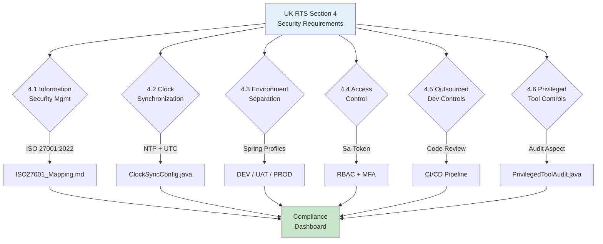

# UK RTS 安全架構

> **業務需求**: [Compliance Standards Requirements](../../requirements/12_Security_Compliance/02_Compliance_Standards_Requirements.md)
> **規範來源**: [source-archive/12_System_Security/12-05](../../source-archive/12_System_Security/12-05_UK_RTS_Security.md)
> **文件類型**: 技術架構
> **目標讀者**: 架構師、安全工程師、合規主管

---

## RTS 合規驗證流程



---

## 1. RTS 4 安全要求對照

### RTS 4.1 - 資訊安全管理

| 要求 | 說明 | 實作方式 | 狀態 |
|------|------|----------|------|
| 4.1.1 | ISO 27001 合規 | [ISO 27001:2022 Mapping](./06_ISO27001_Mapping.md) | 已實施 |
| 4.1.2 | 風險評估 | 定期風險評估 | 已實施 |
| 4.1.3 | 安全政策 | CLAUDE.md 安全指引 | 已實施 |

### RTS 4.2 - 時鐘同步

```java
@Configuration
public class ClockSyncConfig {

    /**
     * Configure NTP time synchronization
     * RTS requirement: All game records must use synchronized timestamps
     */
    @Bean
    public Clock synchronizedClock() {
        return Clock.systemUTC();
    }
}
```

**配置要求**：
- NTP 伺服器同步
- 最大時鐘偏移 < 1 秒
- 所有日誌使用 UTC

**時鐘同步驗證**：

```java
@Component
@Slf4j
@RequiredArgsConstructor
public class ClockSyncVerifier {

    private final Clock synchronizedClock;

    /**
     * Verify NTP time drift is within RTS tolerance (< 1 second)
     * Scheduled to run every 5 minutes
     */
    @Scheduled(fixedRate = 300_000)
    public void verifyClockSync() {
        Instant systemTime = Instant.now();
        Instant ntpTime = synchronizedClock.instant();
        long driftMs = Math.abs(
            Duration.between(systemTime, ntpTime).toMillis()
        );

        if (driftMs > 1000) {
            log.error("RTS 4.2 VIOLATION: Clock drift {}ms exceeds 1s threshold",
                driftMs);
            // Trigger alert to operations team
            alertService.sendCritical("CLOCK_DRIFT_EXCEEDED", driftMs);
        } else {
            log.debug("Clock sync OK: drift={}ms", driftMs);
        }
    }
}
```

### RTS 4.3 - 環境隔離

| 環境 | 用途 | 隔離程度 |
|------|------|----------|
| 開發環境 (DEV) | 開發測試 | 完全隔離 |
| 測試環境 (UAT) | 驗收測試 | 與生產環境隔離 |
| 生產環境 (PROD) | 正式營運 | 最嚴格控制 |

```yaml
spring:
  profiles:
    active: ${ENVIRONMENT:dev}

---
spring:
  config:
    activate:
      on-profile: prod
  datasource:
    url: ${PROD_DB_URL}
```

### RTS 4.4 - 存取控制

| 要求 | 實作方式 | SmartAdmin 元件 |
|------|----------|----------------|
| 身份驗證 | Sa-Token | `@SaCheckLogin` |
| 多因素驗證 | TOTP/WebAuthn | MFA 模組 |
| 角色權限管理 | RBAC | `@SaCheckPermission` |
| 稽核日誌 | 完整操作紀錄 | 稽核日誌系統 |

**Sa-Token 存取控制整合**：

```java
/**
 * RTS 4.4 compliant access control
 * All iGaming admin endpoints require permission + MFA verification
 */
@RestController
@RequestMapping("/api/igaming/admin")
@RequiredArgsConstructor
public class IgamingAdminController {

    private final PlayerManageService playerManageService;

    @SaCheckPermission("igaming:player:freeze")
    @PostMapping("/player/freeze")
    public ResponseDTO<Void> freezePlayer(@RequestBody @Valid PlayerFreezeForm form) {
        // Sa-Token automatically verifies:
        // 1. Valid session (authentication)
        // 2. Permission check (authorization)
        // 3. Audit log via AOP interceptor
        return playerManageService.freezePlayer(form);
    }

    @NoNeedLogin
    @GetMapping("/health")
    public ResponseDTO<String> health() {
        return ResponseDTO.ok("OK");
    }
}
```

**高風險操作 MFA 強制要求**：

| 操作類別 | 需要 MFA | Token 有效期 |
|----------|----------|-------------|
| 玩家帳號凍結 | 是 | 單次使用 |
| 餘額調整 | 是 | 單次使用 |
| 配置變更 | 是 | 5 分鐘 |
| 唯讀查詢 | 否 | Session 期間 |

### RTS 4.5 - 外包開發控制

- 合約中的安全要求
- 程式碼審查
- 弱點掃描
- 安全測試驗收

### RTS 4.6 - 特權工具控制

```java
@Aspect
@Component
@Slf4j
public class PrivilegedToolAudit {

    @Before("@annotation(AdminOnly)")
    public void auditAdminAction(JoinPoint joinPoint) {
        Long adminId = StpUtil.getLoginIdAsLong();
        String action = joinPoint.getSignature().toShortString();
        String params = Arrays.toString(joinPoint.getArgs());

        log.info("ADMIN_ACTION: adminId={}, action={}, params={}",
            adminId, action, params);

        auditLogService.logAdminAction(adminId, action, params);
    }
}
```

## 2. 通訊安全

### TLS 要求

| 要求 | 配置 | RTS 參照 |
|------|------|----------|
| 最低版本 | TLS 1.2（建議 1.3） | RTS 4.1 |
| 密碼套件 | 僅允許強加密 | RTS 4.1 |
| 憑證 | 有效的 CA 簽發 | RTS 4.1 |
| 憑證綁定 | 行動 App 必要 | 最佳實踐 |

**Spring Boot TLS 配置**：

```yaml
server:
  ssl:
    enabled: true
    protocol: TLS
    enabled-protocols: TLSv1.3,TLSv1.2
    ciphers: TLS_AES_256_GCM_SHA384,TLS_AES_128_GCM_SHA256
    key-store: classpath:keystore.p12
    key-store-type: PKCS12
    key-store-password: ${SSL_KEYSTORE_PASSWORD}
```

**Java SSLContext 配置（服務間 mTLS）**：

```java
@Configuration
public class MtlsConfig {

    /**
     * Configure mutual TLS for platform-to-platform communication
     * RTS requirement: Secure inter-service communication
     */
    @Bean
    public SSLContext sslContext(
        @Value("${mtls.keystore-path}") String keystorePath,
        @Value("${mtls.keystore-password}") String keystorePassword,
        @Value("${mtls.truststore-path}") String truststorePath,
        @Value("${mtls.truststore-password}") String truststorePassword
    ) throws Exception {
        KeyStore keyStore = KeyStore.getInstance("PKCS12");
        keyStore.load(
            new FileInputStream(keystorePath),
            keystorePassword.toCharArray()
        );

        KeyStore trustStore = KeyStore.getInstance("PKCS12");
        trustStore.load(
            new FileInputStream(truststorePath),
            truststorePassword.toCharArray()
        );

        KeyManagerFactory kmf = KeyManagerFactory.getInstance(
            KeyManagerFactory.getDefaultAlgorithm()
        );
        kmf.init(keyStore, keystorePassword.toCharArray());

        TrustManagerFactory tmf = TrustManagerFactory.getInstance(
            TrustManagerFactory.getDefaultAlgorithm()
        );
        tmf.init(trustStore);

        SSLContext sslContext = SSLContext.getInstance("TLSv1.3");
        sslContext.init(kmf.getKeyManagers(), tmf.getTrustManagers(), null);
        return sslContext;
    }
}
```

**禁用密碼套件**（必須明確停用）：

| 類別 | 密碼套件 | 原因 |
|------|----------|------|
| NULL | TLS_NULL_* | 無加密 |
| Export | TLS_RSA_EXPORT_* | 金鑰長度不足 |
| RC4 | TLS_RSA_WITH_RC4_* | 已知弱點 |
| DES/3DES | TLS_RSA_WITH_DES_* | 強度不足 |

---

## 3. 滲透測試要求

### RTS 滲透測試排程

| 測試類型 | 頻率 | 範圍 | 執行單位 |
|----------|------|------|----------|
| 外部滲透測試 | 每年 | 所有公開 API | 認證第三方 |
| 內部滲透測試 | 每年 | 內部服務 | 認證第三方 |
| 弱點掃描 | 每月 | 全部基礎設施 | 自動化 + 人工審查 |
| 程式碼安全審查 | 每次發布 | 變更元件 | 內部 + SAST 工具 |

### 測試範圍

| 元件 | 測試方法 | 預期結果 |
|------|----------|----------|
| API Gateway | OWASP ZAP, Burp Suite | 無嚴重/高風險發現 |
| 身份驗證 | 憑證填充模擬 | 速率限制有效 |
| 錢包 API | 交易竄改 | 完整性檢查通過 |
| 管理後台 | 權限提升 | RBAC 強制執行 |
| 遊戲供應商整合 | 中間人攻擊 | mTLS 阻止攔截 |

### 修復 SLA

| 嚴重程度 | 定義 | 修復期限 |
|----------|------|----------|
| 嚴重 | 遠端程式碼執行、資料外洩 | 24 小時 |
| 高 | 身份驗證繞過、權限提升 | 7 天 |
| 中 | 資訊揭露、XSS | 30 天 |
| 低 | 最佳實踐偏差 | 下次發布 |

---

## 4. SmartAdmin 實作

### 4.1 合規驗證 Service

```java
@Service
@RequiredArgsConstructor
public class RtsComplianceService {

    private final ComplianceCheckDao complianceDao;
    private final ComplianceAlertManager alertManager;

    /**
     * Verify RTS compliance status using Vavr Option.
     */
    public Option<ComplianceStatusVO> getComplianceStatus(String rtsSection) {
        return Option.of(complianceDao.selectBySection(rtsSection))
            .map(entity -> SmartBeanUtil.copy(entity, ComplianceStatusVO.class));
    }

    /**
     * Record compliance check result.
     */
    public void recordComplianceCheck(ComplianceCheckForm form) {
        alertManager.checkAndRecord(form);
    }
}
```

### 4.2 合規告警 Manager

```java
@Component
@RequiredArgsConstructor
public class ComplianceAlertManager {

    private final ComplianceCheckDao complianceDao;
    private final ComplianceAlertDao alertDao;

    /**
     * Check compliance and record result.
     * @Transactional only allowed in Manager layer per SmartAdmin architecture.
     */
    @Transactional(rollbackFor = Throwable.class)
    public void checkAndRecord(ComplianceCheckForm form) {
        ComplianceCheckEntity entity = SmartBeanUtil.copy(form, ComplianceCheckEntity.class);
        entity.setCheckedAt(LocalDateTime.now());
        complianceDao.insert(entity);

        // Alert on violation
        if (!form.isCompliant()) {
            ComplianceAlertEntity alert = new ComplianceAlertEntity();
            alert.setRtsSection(form.getRtsSection());
            alert.setSeverity("CRITICAL");
            alert.setMessage("RTS compliance violation detected");
            alertDao.insert(alert);
        }
    }
}
```

### 4.3 資料庫結構

```sql
-- RTS compliance check records
CREATE TABLE t_rts_compliance_check (
    id              BIGSERIAL PRIMARY KEY,
    rts_section     VARCHAR(20) NOT NULL,
    requirement_id  VARCHAR(20) NOT NULL,
    check_type      VARCHAR(50) NOT NULL,
    is_compliant    BOOLEAN NOT NULL,
    evidence        JSONB,
    notes           TEXT,
    checked_by      BIGINT,
    checked_at      TIMESTAMP NOT NULL DEFAULT NOW()
);

CREATE INDEX idx_rts_section ON t_rts_compliance_check(rts_section, checked_at DESC);

-- Clock synchronization audit log
CREATE TABLE t_clock_sync_audit (
    id              BIGSERIAL PRIMARY KEY,
    server_id       VARCHAR(100) NOT NULL,
    system_time     TIMESTAMP NOT NULL,
    ntp_time        TIMESTAMP NOT NULL,
    drift_ms        INTEGER NOT NULL,
    is_within_tolerance BOOLEAN NOT NULL,
    checked_at      TIMESTAMP NOT NULL DEFAULT NOW()
);

CREATE INDEX idx_clock_audit ON t_clock_sync_audit(server_id, checked_at DESC);

-- Penetration test records
CREATE TABLE t_pentest_record (
    id              BIGSERIAL PRIMARY KEY,
    test_type       VARCHAR(50) NOT NULL,
    scope           VARCHAR(200) NOT NULL,
    performed_by    VARCHAR(200) NOT NULL,
    started_at      TIMESTAMP NOT NULL,
    completed_at    TIMESTAMP,
    critical_findings INTEGER NOT NULL DEFAULT 0,
    high_findings   INTEGER NOT NULL DEFAULT 0,
    medium_findings INTEGER NOT NULL DEFAULT 0,
    low_findings    INTEGER NOT NULL DEFAULT 0,
    report_path     VARCHAR(500),
    created_at      TIMESTAMP NOT NULL DEFAULT NOW()
);

CREATE INDEX idx_pentest_date ON t_pentest_record(started_at DESC);

-- Vulnerability remediation tracking
CREATE TABLE t_vulnerability_remediation (
    id              BIGSERIAL PRIMARY KEY,
    pentest_id      BIGINT NOT NULL REFERENCES t_pentest_record(id),
    severity        VARCHAR(20) NOT NULL,
    description     TEXT NOT NULL,
    remediation_deadline TIMESTAMP NOT NULL,
    remediated_at   TIMESTAMP,
    status          VARCHAR(20) NOT NULL DEFAULT 'OPEN',
    assigned_to     BIGINT,
    created_at      TIMESTAMP NOT NULL DEFAULT NOW()
);

CREATE INDEX idx_vuln_status ON t_vulnerability_remediation(status, severity);

-- TLS certificate tracking
CREATE TABLE t_tls_certificate (
    id              BIGSERIAL PRIMARY KEY,
    domain          VARCHAR(200) NOT NULL,
    issuer          VARCHAR(200) NOT NULL,
    serial_number   VARCHAR(100) NOT NULL,
    valid_from      TIMESTAMP NOT NULL,
    valid_until     TIMESTAMP NOT NULL,
    tls_version     VARCHAR(10) NOT NULL,
    cipher_suite    VARCHAR(100) NOT NULL,
    is_valid        BOOLEAN NOT NULL DEFAULT TRUE,
    last_checked    TIMESTAMP NOT NULL DEFAULT NOW()
);

CREATE INDEX idx_cert_expiry ON t_tls_certificate(valid_until);
```

---

## 相關文件

- [ISO 27001:2022 Mapping](./06_ISO27001_Mapping.md) — ISO 控制項對照
- [Data Security Standard](./01_Data_Security_Standard.md) — 資料保護
- [Encryption Strategy](./02_Encryption_Strategy.md) — 密碼學控制
