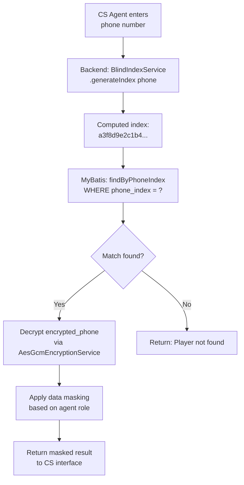

# Blind Index Architecture

> **Business Requirements**: [Data Protection Requirements](../../requirements/12_Security_Compliance/Data_Protection_Requirements.md)
> **Canonical Source**: [source-archive/12_System_Security/12-03-02](../../source-archive/12_System_Security/12-03-02_Blind_Index_Architecture.md)
> **View Type**: Technical Architecture
> **Target Audience**: Architects, Security Engineers, Database Engineers

---

## 1. Write Path

```text
[Data Write Path]
1. User Input: +886912345678
2. Parallel Processing:
   +---------------------+---------------------+
   | Path A: Encryption  | Path B: Blind Index |
   +---------------------+---------------------+
   | AES-256-GCM(phone)  | HMAC-SHA256(phone,  |
   | -> encrypted_phone  | blind_key) ->       |
   |                     | phone_index         |
   +---------------------+---------------------+
3. Store both in database:
   encrypted_phone: "v1:Y3J5cHRv:ZW5jcnlwdGVk..."
   phone_index: "a3f8d9e2c1b4..."  (64 chars)
```

## 2. Query Path

```text
[Data Query Path]
1. CS inputs search term: +886912345678
2. Backend computes: HMAC-SHA256(input, blind_key)
   -> computed_index: "a3f8d9e2c1b4..."
3. Query: SELECT * FROM players
         WHERE phone_index = 'a3f8d9e2c1b4...'
4. Found match -> Decrypt encrypted_phone for display
   -> Output: +886912345678
```

**Key Properties**:
- **One-way**: Cannot reverse phone_index to plaintext
- **Deterministic**: Same input always produces same index (indexable)
- **Non-comparable**: Cannot perform LIKE, >, < fuzzy queries

## 3. PII Fields Requiring Blind Index

| PII Field | Encrypted Column | Blind Index Column | Query Scenario | Priority |
|-----------|-----------------|-------------------|----------------|----------|
| **Phone** | `encrypted_phone` | `phone_index` | CS lookup, duplicate check | P0 |
| **Email** | `encrypted_email` | `email_index` | Login, password recovery | P0 |
| **ID Number** | `encrypted_id_number` | `id_number_index` | KYC verification | P1 |
| **Bank Account** | `encrypted_bank_account` | `bank_account_index` | Withdrawal verification | P1 |
| **IP Address** | - | `ip_index` | Risk analysis, multi-account | P2 |

## 4. Two-Key System

```text
Key Hierarchy
+---------------------+---------------------+
| Encryption Key (EK) | Blind Index Key     |
|                     | (BIK)               |
+---------------------+---------------------+
| AWS KMS:            | HashiCorp Vault:    |
| alias/pii-encrypt   | secret/blind-index  |
|                     |                     |
| Physical Isolation: | Physical Isolation: |
| US-East-1           | EU-West-1           |
+---------------------+---------------------+

Attacker must breach BOTH independent HSMs for Rainbow Table attack
```

| Key Type | Storage | Access | Rotation |
|----------|---------|--------|----------|
| **Encryption Key (EK)** | AWS KMS (US-East-1) | Backend API only | 365 days |
| **Blind Index Key (BIK)** | HashiCorp Vault (EU-West-1) | Backend API only | 730 days (2 years) |
| **Master Encryption Key (MEK)** | AWS KMS CMK | AWS KMS internal | Auto-rotate |

## 5. Key Rotation Strategy

```text
[Phase 1: Prepare New Key (T-30 days)]
1. Generate BIK_v2 in Vault
2. Update config (dual version): BIK_V1 (active) + BIK_V2 (pending)
3. Test environment validation

[Phase 2: Dual-Write Mode (T -> T+90 days)]
INSERT INTO players (encrypted_phone, phone_index_v1, phone_index_v2)
VALUES (?, ?, ?);

Query: WHERE phone_index_v2 = ? OR phone_index_v1 = ?

[Phase 3: Batch Migration (T+90 -> T+120 days)]
UPDATE players SET
  phone_index_v2 = HMAC(encrypted_phone, BIK_v2)
WHERE phone_index_v2 IS NULL;

Estimated: 10M users * 0.1ms = ~16.7 minutes

[Phase 4: Cutover (T+120 days)]
1. DROP phone_index_v1 column
2. RENAME phone_index_v2 -> phone_index
3. Mark BIK_v1 as Deprecated in Vault
4. Remove v1 references from config
```

## 6. Collision Handling

### Collision Probability

- HMAC-SHA256 output space: **2^256**
- Birthday paradox threshold: **2^128** hashes for 50% collision
- iGaming platform scale: 10M - 100M players (10^7 - 10^8)
- **Actual collision probability**: < 10^-60 (effectively zero)

### Strategy: Database UNIQUE Constraint

Enforce UNIQUE constraint on blind index columns. On the extremely rare collision, handle with application-level error and add salt.

## 7. Performance Analysis

### Query Performance

| Method | Time Complexity | Actual Time (10M players) |
|--------|----------------|--------------------------|
| **Blind Index** | O(1) - B-Tree index | < 5ms |
| **Full Table Decrypt** | O(n) - decrypt each row | > 5000ms (1000x slower) |

### Write Overhead

| Operation | Time |
|-----------|------|
| AES-256-GCM encryption | ~0.05ms |
| HMAC-SHA256 computation | ~0.01ms |
| Database index maintenance | ~0.5ms |
| **Total** | **~0.56ms** |

Compared to unencrypted write (~0.2ms): **2.8x overhead** (acceptable).

### Storage Overhead

- Per player: `phone_index` (64B) + `email_index` (64B) + `id_number_index` (64B) = **192 bytes**
- 10M players: 192 * 10M = **1.8 GB** (acceptable)

## 8. Security: Known Attack Vectors

| Attack | Threat | Mitigation |
|--------|--------|-----------|
| **Rainbow Table** | Pre-compute HMACs for all possible values | Key rotation, physical key isolation, application context |
| **Timing Attack** | Observe HMAC computation time differences | Constant-time comparison |
| **Inference Attack** | Known plaintext-index pairs leak info | Never expose blind index in API responses |

## 9. Compliance Assessment

| Regulation | Requirement | Blind Index Compliance |
|------------|-------------|----------------------|
| **GDPR** | PII irreversible encryption | Compliant (one-way hash) |
| **PCI-DSS** | Bank account hashed/truncated | Compliant (HMAC) |
| **CCPA** | Searchable for Data Subject Request | Compliant (index lookup) |

## 10. BlindIndexService Java Implementation

### 10.1 HMAC-SHA256 Index Generation

```java
import javax.crypto.Mac;
import javax.crypto.spec.SecretKeySpec;
import java.nio.charset.StandardCharsets;

/**
 * Generates deterministic blind indexes using HMAC-SHA256.
 * Thread-safe: Mac instances are created per invocation.
 */
public class BlindIndexService {

    private static final String HMAC_ALGORITHM = "HmacSHA256";
    private final byte[] blindIndexKey;

    public BlindIndexService(byte[] blindIndexKey) {
        if (blindIndexKey.length < 32) {
            throw new IllegalArgumentException(
                "Blind index key must be at least 256 bits");
        }
        this.blindIndexKey = blindIndexKey.clone();
    }

    /**
     * Generate a blind index for the given plaintext PII value.
     * Output is a 64-character lowercase hex string.
     */
    public String generateIndex(String plaintext) {
        try {
            Mac mac = Mac.getInstance(HMAC_ALGORITHM);
            SecretKeySpec keySpec = new SecretKeySpec(
                blindIndexKey, HMAC_ALGORITHM);
            mac.init(keySpec);

            byte[] hash = mac.doFinal(
                plaintext.getBytes(StandardCharsets.UTF_8));
            return bytesToHex(hash);
        } catch (Exception e) {
            throw new RuntimeException(
                "Blind index generation failed", e);
        }
    }

    private static String bytesToHex(byte[] bytes) {
        StringBuilder sb = new StringBuilder(bytes.length * 2);
        for (byte b : bytes) {
            sb.append(String.format("%02x", b));
        }
        return sb.toString();
    }
}
```

### 10.2 MyBatis Mapper for Blind Index Queries

```xml
<!-- PlayerMapper.xml -->
<mapper namespace="net.lab1024.sa.business.player.dao.PlayerMapper">

    <!-- Exact match via blind index (O(1) with B-Tree) -->
    <select id="findByPhoneIndex" resultType="PlayerEntity">
        SELECT id, encrypted_phone, encrypted_email, encrypted_name,
               phone_index, email_index, status, created_at
        FROM t_player
        WHERE phone_index = #{phoneIndex}
          AND deleted = 0
    </select>

    <!-- Duplicate check across multiple PII indexes -->
    <select id="checkDuplicatePii" resultType="int">
        SELECT COUNT(1)
        FROM t_player
        WHERE (phone_index = #{phoneIndex}
            OR email_index = #{emailIndex})
          AND deleted = 0
    </select>

    <!-- Batch re-index during key rotation (Phase 3) -->
    <update id="batchUpdateBlindIndex">
        UPDATE t_player
        SET phone_index = #{newPhoneIndex},
            email_index = #{newEmailIndex},
            updated_at = NOW()
        WHERE id = #{playerId}
    </update>

</mapper>
```

### 10.3 Search Flow Diagram



### 10.4 Database Schema (DDL)

```sql
CREATE TABLE t_player (
    id              BIGINT PRIMARY KEY AUTO_INCREMENT,
    encrypted_name  VARCHAR(512)  NOT NULL COMMENT 'AES-256-GCM encrypted name',
    encrypted_phone VARCHAR(512)  NOT NULL COMMENT 'AES-256-GCM encrypted phone',
    encrypted_email VARCHAR(512)  NOT NULL COMMENT 'AES-256-GCM encrypted email',
    phone_index     CHAR(64)      NOT NULL COMMENT 'HMAC-SHA256 blind index for phone',
    email_index     CHAR(64)      NOT NULL COMMENT 'HMAC-SHA256 blind index for email',
    id_number_index CHAR(64)      NULL     COMMENT 'HMAC-SHA256 blind index for ID number',
    status          TINYINT       NOT NULL DEFAULT 1 COMMENT '1=active, 0=disabled',
    deleted         TINYINT       NOT NULL DEFAULT 0,
    created_at      DATETIME      NOT NULL DEFAULT CURRENT_TIMESTAMP,
    updated_at      DATETIME      NOT NULL DEFAULT CURRENT_TIMESTAMP ON UPDATE CURRENT_TIMESTAMP,

    UNIQUE INDEX uk_phone_index (phone_index),
    UNIQUE INDEX uk_email_index (email_index),
    INDEX idx_id_number_index (id_number_index)
) ENGINE=InnoDB DEFAULT CHARSET=utf8mb4 COMMENT='Player PII with blind index';
```
