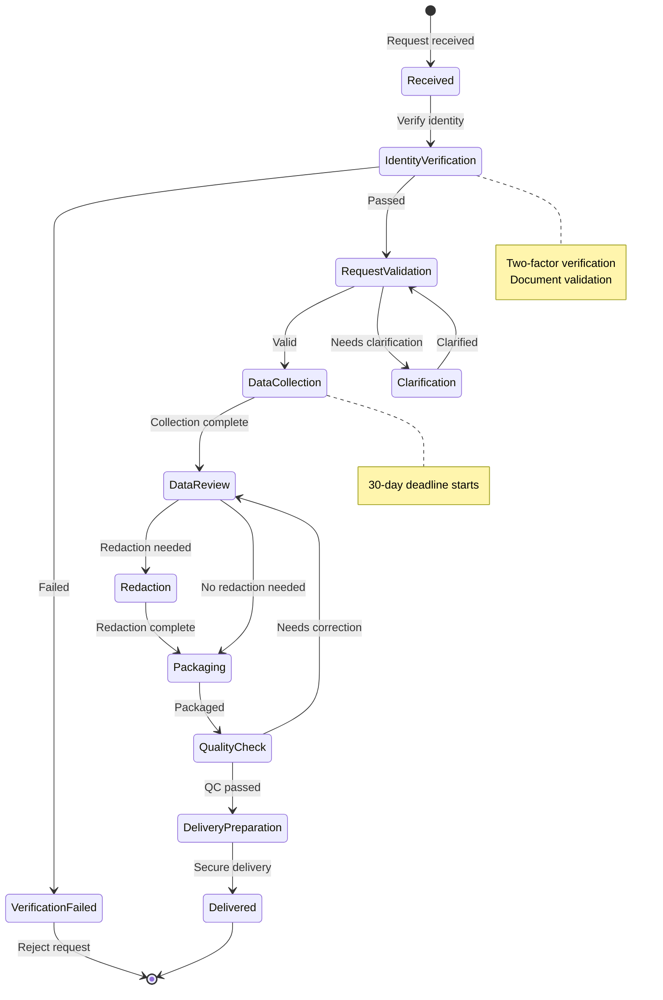

# 資料可攜性與主體存取請求架構

> **業務需求**: [Payment Security Requirements](../../requirements/12_Security_Compliance/Payment_Security_Requirements.md)
> **規範來源**: [source-archive/12_System_Security/12-07](../../source-archive/12_System_Security/12-07_Data_Portability_SAR.md)
> **文件類型**: 技術架構
> **目標讀者**: 架構師、後端開發人員、法務/合規團隊

---

## 1. SAR 處理流程



## 2. SAR Service 實作

```java
@Service
@RequiredArgsConstructor
@Slf4j
public class SarRequestService {

    private final SarRequestDao sarRequestDao;
    private final SarDataCollectorManager sarDataCollectorManager;
    private final PlayerService playerService;

    /**
     * Submit SAR request
     */
    public ResponseDTO<SarRequestVO> submitRequest(SarRequestForm form) {
        return playerService.getById(form.getPlayerId())
            .map(player -> {
                if (hasRecentRequest(player.getId(), 30)) {
                    return ResponseDTO.error(UserErrorCode.SAR_REQUEST_TOO_FREQUENT,
                        "You have submitted a request within the last 30 days");
                }

                SarRequestEntity request = SarRequestEntity.builder()
                    .playerId(player.getId())
                    .requestType(form.getRequestType())
                    .requestScope(form.getRequestScope())
                    .status(SarStatus.PENDING_VERIFICATION)
                    .submittedAt(LocalDateTime.now())
                    .deadlineAt(LocalDateTime.now().plusDays(30))
                    .build();

                sarRequestDao.insert(request);
                triggerIdentityVerification(player, request);

                return ResponseDTO.ok(toVO(request));
            })
            .getOrElse(() -> ResponseDTO.error(UserErrorCode.PLAYER_NOT_FOUND));
    }

    /**
     * Process verified request (async)
     */
    @Async
    public void processVerifiedRequest(Long requestId) {
        SarRequestEntity request = sarRequestDao.selectById(requestId);

        try {
            request.setStatus(SarStatus.DATA_COLLECTION);
            sarRequestDao.updateById(request);

            SarDataPackage dataPackage = sarDataCollectorManager
                .collectPlayerData(request.getPlayerId(), request.getRequestScope());

            SarDataPackage redactedPackage = redactSensitiveData(dataPackage);
            SarExportResult export = generateExportFiles(redactedPackage);

            request.setStatus(SarStatus.READY_FOR_DELIVERY);
            request.setExportFileId(export.getFileId());
            request.setCompletedAt(LocalDateTime.now());
            sarRequestDao.updateById(request);

            notifyPlayer(request);

        } catch (Exception e) {
            log.error("SAR processing failed for request: {}", requestId, e);
            request.setStatus(SarStatus.FAILED);
            request.setErrorMessage(e.getMessage());
            sarRequestDao.updateById(request);
        }
    }
}
```

## 3. 資料收集 Manager

```java
@Component
@RequiredArgsConstructor
@Slf4j
public class SarDataCollectorManager {

    private final PlayerDao playerDao;
    private final TransactionDao transactionDao;
    private final BetHistoryDao betHistoryDao;
    private final CustomerSupportDao customerSupportDao;
    private final LoginHistoryDao loginHistoryDao;
    private final ResponsibleGamblingDao responsibleGamblingDao;

    @Transactional(readOnly = true)
    public SarDataPackage collectPlayerData(Long playerId, SarScope scope) {
        SarDataPackage.Builder builder = SarDataPackage.builder()
            .playerId(playerId)
            .collectedAt(LocalDateTime.now());

        // 1. Account info (mandatory)
        PlayerEntity player = playerDao.selectById(playerId);
        builder.accountInfo(buildAccountInfo(player));

        // 2-6. Conditional collection based on scope
        if (scope.includesFinancial()) {
            builder.financialData(buildFinancialData(
                transactionDao.selectByPlayerId(playerId)));
        }
        if (scope.includesGaming()) {
            builder.gamingData(buildGamingData(
                betHistoryDao.selectByPlayerId(playerId)));
        }
        if (scope.includesSupport()) {
            builder.supportData(buildSupportData(
                customerSupportDao.selectByPlayerId(playerId)));
        }
        if (scope.includesTechnical()) {
            builder.technicalData(buildTechnicalData(
                loginHistoryDao.selectByPlayerId(playerId)));
        }
        if (scope.includesResponsibleGambling()) {
            builder.responsibleGamblingData(buildRGData(
                responsibleGamblingDao.selectByPlayerId(playerId)));
        }

        return builder.build();
    }
}
```

## 4. 匯出 JSON 格式

```json
{
  "exportInfo": {
    "generatedAt": "2026-02-07T10:30:00Z",
    "requestId": "SAR-2026-00123",
    "playerId": "PLY-12345678",
    "dataRangeStart": "2024-01-01T00:00:00Z",
    "dataRangeEnd": "2026-02-07T00:00:00Z"
  },
  "accountInfo": {
    "username": "player123",
    "email": "player@example.com",
    "registeredAt": "2024-03-15T08:30:00Z",
    "kycStatus": "VERIFIED"
  },
  "financialData": {
    "totalDeposits": 50000.00,
    "totalWithdrawals": 35000.00,
    "currentBalance": 8500.00,
    "transactions": [...]
  },
  "gamingData": {
    "totalBets": 1250,
    "totalWagered": 125000.00,
    "bets": [...]
  },
  "responsibleGambling": {
    "depositLimits": { "daily": 1000.00, "weekly": 5000.00 },
    "selfExclusionHistory": [],
    "realityCheckInterval": 60
  }
}
```

## 5. 資料庫結構

```sql
-- SAR Request Table
CREATE TABLE t_sar_request (
    id                  BIGINT PRIMARY KEY,
    player_id           BIGINT NOT NULL,
    request_type        VARCHAR(32) NOT NULL,
    request_scope       JSONB NOT NULL,
    status              VARCHAR(32) NOT NULL,
    submitted_at        TIMESTAMP NOT NULL,
    verified_at         TIMESTAMP,
    deadline_at         TIMESTAMP NOT NULL,
    extended_deadline   TIMESTAMP,
    extension_reason    TEXT,
    completed_at        TIMESTAMP,
    delivered_at        TIMESTAMP,
    rejected_at         TIMESTAMP,
    rejection_reason    TEXT,
    export_file_id      VARCHAR(64),
    error_message       TEXT,
    created_at          TIMESTAMP DEFAULT CURRENT_TIMESTAMP,
    updated_at          TIMESTAMP DEFAULT CURRENT_TIMESTAMP,

    INDEX idx_player_request (player_id, submitted_at DESC),
    INDEX idx_status_deadline (status, deadline_at)
);

-- SAR Export File Table
CREATE TABLE t_sar_export_file (
    id                  BIGINT PRIMARY KEY,
    request_id          BIGINT NOT NULL REFERENCES t_sar_request(id),
    file_type           VARCHAR(32) NOT NULL,
    file_path           VARCHAR(512) NOT NULL,
    file_size           BIGINT NOT NULL,
    checksum            VARCHAR(64) NOT NULL,
    encryption_key_id   VARCHAR(64) NOT NULL,
    download_url        VARCHAR(512),
    url_expires_at      TIMESTAMP,
    downloaded_at       TIMESTAMP,
    created_at          TIMESTAMP DEFAULT CURRENT_TIMESTAMP,

    INDEX idx_request_file (request_id)
);

-- SAR Processing Log
CREATE TABLE t_sar_processing_log (
    id                  BIGINT PRIMARY KEY,
    request_id          BIGINT NOT NULL REFERENCES t_sar_request(id),
    action              VARCHAR(64) NOT NULL,
    actor_id            BIGINT,
    actor_type          VARCHAR(32),
    details             JSONB,
    created_at          TIMESTAMP DEFAULT CURRENT_TIMESTAMP,

    INDEX idx_request_log (request_id, created_at)
);
```

## 6. 管理後台 API

```java
@RestController
@RequestMapping("/admin/sar")
@RequiredArgsConstructor
public class SarAdminController {

    private final SarRequestService sarRequestService;

    @PostMapping("/query")
    @SaCheckPermission("sar:request:query")
    public ResponseDTO<PageResult<SarRequestVO>> queryRequests(
            @RequestBody @Valid SarQueryForm form) {
        return sarRequestService.pageQuery(form);
    }

    @GetMapping("/{requestId}")
    @SaCheckPermission("sar:request:query")
    public ResponseDTO<SarRequestDetailVO> getRequestDetail(
            @PathVariable Long requestId) {
        return sarRequestService.getDetail(requestId);
    }

    @PostMapping("/{requestId}/extend")
    @SaCheckPermission("sar:request:extend")
    public ResponseDTO<Void> extendDeadline(
            @PathVariable Long requestId,
            @RequestBody @Valid ExtendDeadlineForm form) {
        return sarRequestService.extendDeadline(requestId, form);
    }

    @PostMapping("/{requestId}/deliver")
    @SaCheckPermission("sar:request:deliver")
    public ResponseDTO<Void> markDelivered(@PathVariable Long requestId) {
        return sarRequestService.markDelivered(requestId);
    }

    @GetMapping("/dashboard")
    @SaCheckPermission("sar:dashboard:view")
    public ResponseDTO<SarDashboardVO> getDashboard() {
        return sarRequestService.getDashboardStats();
    }
}
```

## 7. 監控指標

| 指標 | 說明 | 告警閾值 |
|--------|-------------|----------------|
| `sar_pending_count` | 待處理請求數 | > 10 |
| `sar_overdue_count` | 逾期請求數 | > 0 |
| `sar_avg_processing_days` | 平均處理時間 | > 20 天 |
| `sar_completion_rate` | 完成率 | < 95% |

## 8. 資料可攜性傳輸

```java
@Service
@RequiredArgsConstructor
public class DataPortabilityService {

    /**
     * Direct transfer to third party
     * GDPR Art. 20(2): Right to direct data transfer
     */
    public ResponseDTO<Void> transferToThirdParty(
            Long requestId,
            ThirdPartyTransferForm form) {

        if (!validateRecipient(form.getRecipientUrl())) {
            return ResponseDTO.error(UserErrorCode.INVALID_RECIPIENT);
        }

        SarDataPackage dataPackage = sarRequestDao.getDataPackage(requestId);
        PortableDataFormat portableData = convertToPortableFormat(dataPackage);

        HttpHeaders headers = new HttpHeaders();
        headers.setContentType(MediaType.APPLICATION_JSON);
        headers.set("X-Data-Portability-Request", requestId.toString());
        headers.set("X-Source-Platform", "SmartAdmin iGaming");

        RestTemplate restTemplate = new RestTemplate();
        ResponseEntity<Void> response = restTemplate.postForEntity(
            form.getRecipientUrl(),
            new HttpEntity<>(portableData, headers),
            Void.class
        );

        if (response.getStatusCode().is2xxSuccessful()) {
            logTransferSuccess(requestId, form.getRecipientUrl());
            return ResponseDTO.ok();
        }
        return ResponseDTO.error(UserErrorCode.TRANSFER_FAILED);
    }
}
```
