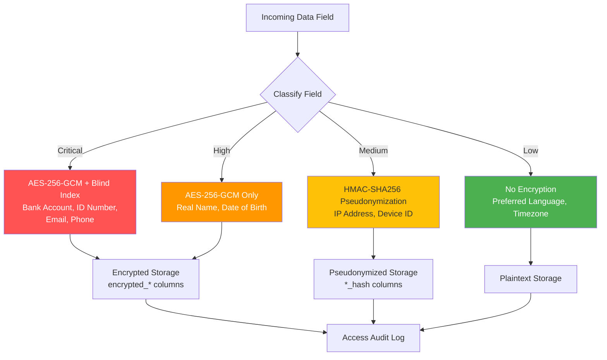

# Data Security Standard Architecture

> **Business Requirements**: [Data Protection Requirements](../../requirements/12_Security_Compliance/Data_Protection_Requirements.md)
> **Canonical Source**: [source-archive/12_System_Security/12-03](../../source-archive/12_System_Security/12-03_Data_Security_Standard.md)
> **View Type**: Technical Architecture
> **Target Audience**: Architects, Security Engineers, Backend Developers

---

## 1. Encryption Architecture Overview

```text
+-----------------------------------------------------+
|  Application Layer                                    |
|  - AES-256-GCM Column-Level Encryption               |
|  - Argon2id Password Hashing                         |
|  - HMAC-SHA256 Blind Index Generation                |
+----------------+------------------------------------+
                 |
+----------------v------------------------------------+
|  Key Management Layer                                |
|  - AWS KMS: Master Key (KEK)                         |
|  - Per-Player DEK (Data Encryption Key)              |
|  - HashiCorp Vault: Blind Index Key                  |
+----------------+------------------------------------+
                 |
+----------------v------------------------------------+
|  Storage Layer                                       |
|  - encrypted_* columns (VARBINARY)                   |
|  - *_index columns (CHAR(64) - Blind Index)          |
|  - TLS 1.3 in transit                               |
+-----------------------------------------------------+
```

## 2. PII Classification Matrix

| PII Field | Example | Risk Level | Encryption |
|-----------|---------|-----------|------------|
| **Real Name** | "John Doe" | High | AES-256-GCM |
| **Phone** | "+886912345678" | Critical | AES-256-GCM + Blind Index |
| **Email** | "player@example.com" | Critical | AES-256-GCM + Blind Index |
| **Bank Account** | "1234567890" | Critical | AES-256-GCM + Blind Index |
| **ID Number** | "A123456789" | Critical | AES-256-GCM + Blind Index |
| **Password** | "P@ssw0rd123" | Critical | **Argon2id Hash** (irreversible) |
| **Address** | "Taipei..." | Medium | AES-256-GCM |
| **IP Address** | "1.2.3.4" | Medium | HMAC-SHA256 (Blind Index) |

## 3. Storage Encryption Format

```text
[Version]:[IV]:[Ciphertext]:[AuthTag]

Example:
v1:a3f8d9e2c1b4:Y3J5cHRvZ3JhcGh5==:4a7b8c9d
```

| Field | Length | Description |
|-------|--------|-------------|
| Version | 2 bytes | Encryption version (for key rotation) |
| IV | 12 bytes | Random per encryption |
| Ciphertext | Variable | AES-GCM encrypted data |
| AuthTag | 16 bytes | GCM authentication tag |

## 4. Blind Index Query Flow

```sql
-- Write Path:
-- 1. Input: +886912345678
-- 2. AES-256-GCM(phone) -> encrypted_phone
-- 3. HMAC-SHA256(phone, blind_key) -> phone_index
-- 4. Store: encrypted_phone + phone_index

-- Query Path:
-- 1. Input: +886912345678
-- 2. HMAC-SHA256(phone, blind_key) -> computed_index
-- 3. WHERE phone_index = computed_index
-- 4. Decrypt encrypted_phone for display
```

## 5. Crypto-Shredding (GDPR Deletion)

```text
Dual-Layer Encryption Architecture:
- Master Key (KEK) stored in AWS KMS
  -> Encrypts
- Per-Player DEK (Data Encryption Key)
  -> Encrypts
- Player PII

Deletion Flow:
DELETE FROM user_keys WHERE player_id = ?
-> DEK destroyed
-> All PII permanently unrecoverable (even with backups)
```

## 6. Transport Security

```nginx
server {
    listen 443 ssl http2;
    ssl_protocols TLSv1.3 TLSv1.2;
    ssl_ciphers 'ECDHE-ECDSA-AES256-GCM-SHA384:ECDHE-RSA-AES256-GCM-SHA384';

    # HSTS
    add_header Strict-Transport-Security "max-age=31536000; includeSubDomains; preload" always;
}
```

## 7. Data Masking Rules

| PII Field | Masking Rule | Example |
|-----------|-------------|---------|
| **Name** | Keep first/last char | `David Beckham` -> `D***m` |
| **Phone** | Keep first 3, last 3 | `0912345678` -> `091****678` |
| **Email** | Keep first 2 + domain | `david@gmail.com` -> `da***@gmail.com` |
| **Bank Account** | Keep last 4 | `1234567890` -> `******7890` |

### Role-Based Masking

| Role | Phone | Email | Bank Account |
|------|-------|-------|-------------|
| **Player (self)** | Full (2FA required) | Full | Last 4 digits |
| **CS Level 1** | `091****678` | `da***@gmail.com` | No access |
| **Risk Control** | Full (approval needed) | Full (approval needed) | Full (approval needed) |
| **DBA** | Ciphertext (cannot decrypt) | Ciphertext | Ciphertext |

## 8. Compliance Checklist

### GDPR

| Requirement | Status | Implementation |
|-------------|--------|---------------|
| Data Minimization | Compliant | Collect only necessary PII |
| Storage Encryption | Compliant | AES-256-GCM |
| Transport Encryption | Compliant | TLS 1.3 |
| Right to Erasure | Compliant | Crypto-Shredding |
| Data Portability | Compliant | JSON export |
| Audit Logging | Compliant | All PII access logged |

### PCI-DSS

| Requirement | Status | Implementation |
|-------------|--------|---------------|
| No full card storage | Compliant | PSP Token only |
| Bank account encrypted | Compliant | AES-256-GCM + Blind Index |
| Password hashing | Compliant | Argon2id |
| Access control | Compliant | RBAC + IP whitelist |

## 9. Data Classification Service



```java
@Service
@RequiredArgsConstructor
public class DataClassificationService {

    private final EncryptionManager encryptionManager;
    private final AuditLogDao auditLogDao;

    /**
     * Classification levels aligned with ISO 27001 Annex A.8
     */
    public enum Classification {
        CRITICAL,  // PCI-DSS scope: bank accounts, card tokens, ID numbers
        HIGH,      // PII requiring encryption: real name, DOB
        MEDIUM,    // Pseudonymizable: IP address, device fingerprint
        LOW        // Non-sensitive: language preference, timezone
    }

    private static final Map<String, Classification> FIELD_CLASSIFICATION = Map.ofEntries(
        Map.entry("bank_account", Classification.CRITICAL),
        Map.entry("id_number", Classification.CRITICAL),
        Map.entry("email", Classification.CRITICAL),
        Map.entry("phone", Classification.CRITICAL),
        Map.entry("real_name", Classification.HIGH),
        Map.entry("date_of_birth", Classification.HIGH),
        Map.entry("ip_address", Classification.MEDIUM),
        Map.entry("device_id", Classification.MEDIUM),
        Map.entry("language", Classification.LOW),
        Map.entry("timezone", Classification.LOW)
    );

    public Classification classifyField(String fieldName) {
        return FIELD_CLASSIFICATION.getOrDefault(fieldName, Classification.HIGH);
    }
}
```

## 10. Field-Level Encryption Patterns

```java
@Component
@RequiredArgsConstructor
public class FieldEncryptionHandler implements TypeHandler<String> {

    private final KeyManagementManager keyManager;

    /**
     * Encrypt sensitive field before database write.
     * Format: v1:{iv}:{ciphertext}:{authTag}
     */
    @Override
    public void setNonNullParameter(PreparedStatement ps, int i,
                                     String value, JdbcType jdbcType) throws SQLException {
        DataEncryptionKey dek = keyManager.getCurrentDEK();
        byte[] iv = SecureRandom.getInstanceStrong().generateSeed(12);

        Cipher cipher = Cipher.getInstance("AES/GCM/NoPadding");
        GCMParameterSpec spec = new GCMParameterSpec(128, iv);
        cipher.init(Cipher.ENCRYPT_MODE, dek.getSecretKey(), spec);

        byte[] ciphertext = cipher.doFinal(value.getBytes(StandardCharsets.UTF_8));
        String encoded = String.format("v1:%s:%s:%s",
            Base64.getEncoder().encodeToString(iv),
            Base64.getEncoder().encodeToString(Arrays.copyOf(ciphertext, ciphertext.length - 16)),
            Base64.getEncoder().encodeToString(Arrays.copyOfRange(ciphertext, ciphertext.length - 16, ciphertext.length))
        );
        ps.setString(i, encoded);
    }

    @Override
    public String getNullableResult(ResultSet rs, String columnName) throws SQLException {
        String encrypted = rs.getString(columnName);
        if (encrypted == null || !encrypted.startsWith("v1:")) {
            return encrypted;
        }
        return decrypt(encrypted);
    }

    private String decrypt(String encoded) {
        String[] parts = encoded.split(":");
        byte[] iv = Base64.getDecoder().decode(parts[1]);
        byte[] ciphertext = Base64.getDecoder().decode(parts[2]);
        byte[] authTag = Base64.getDecoder().decode(parts[3]);

        DataEncryptionKey dek = keyManager.getDEKForVersion(parts[0]);
        Cipher cipher = Cipher.getInstance("AES/GCM/NoPadding");
        cipher.init(Cipher.DECRYPT_MODE, dek.getSecretKey(), new GCMParameterSpec(128, iv));

        byte[] combined = new byte[ciphertext.length + authTag.length];
        System.arraycopy(ciphertext, 0, combined, 0, ciphertext.length);
        System.arraycopy(authTag, 0, combined, ciphertext.length, authTag.length);

        return new String(cipher.doFinal(combined), StandardCharsets.UTF_8);
    }
}
```

## 11. Access Control Matrix for Sensitive Data

| Data Category | Player (Self) | CS Level 1 | CS Level 2 | Risk Control | Finance | DBA | System Admin |
|---------------|:---:|:---:|:---:|:---:|:---:|:---:|:---:|
| **Bank Account** | Last 4 | No Access | Last 4 | Full (Approval) | Full (Approval) | Ciphertext | No Access |
| **ID Number** | Masked | No Access | Last 4 | Full (Approval) | No Access | Ciphertext | No Access |
| **Phone** | Full (2FA) | Masked | Full (Approval) | Full (Approval) | No Access | Ciphertext | No Access |
| **Email** | Full | Masked | Full | Full | No Access | Ciphertext | No Access |
| **Real Name** | Full | Masked | Full | Full | Full | Ciphertext | No Access |
| **IP Address** | No Access | No Access | Hashed | Full | No Access | Hashed | Hashed |
| **Transaction History** | Own Only | Read (Masked) | Read | Full | Full | No Access | No Access |

### Access Enforcement via Annotations

```java
@Target(ElementType.METHOD)
@Retention(RetentionPolicy.RUNTIME)
public @interface RequiresDataAccess {
    DataClassificationService.Classification level();
    boolean requiresApproval() default false;
    boolean auditLog() default true;
}

// Usage in Controller
@GetMapping("/player/{id}/bank-account")
@RequiresDataAccess(level = Classification.CRITICAL, requiresApproval = true)
@SaCheckPermission("player:pii:bank-account")
public ResponseDTO<BankAccountVO> getBankAccount(@PathVariable Long id) {
    return ResponseDTO.ok(playerService.getBankAccount(id));
}
```

---

<!-- End of Document -->
