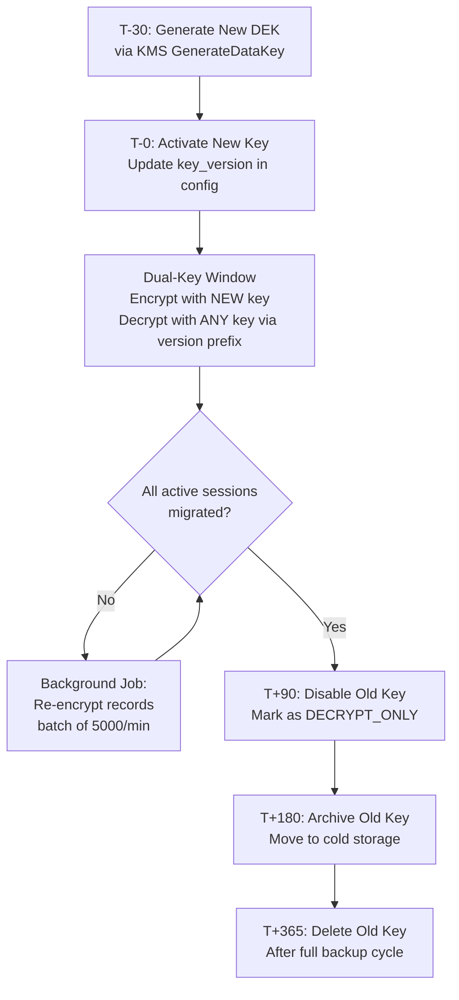
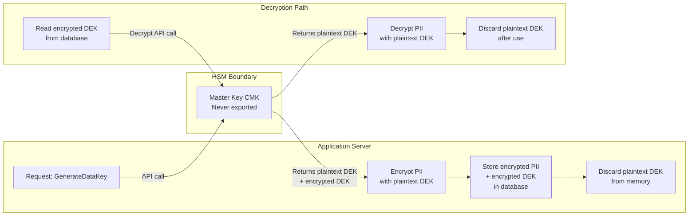

# 加密策略架構

> **業務需求**: [Data Protection Requirements](../../requirements/12_Security_Compliance/Data_Protection_Requirements.md)
> **規範來源**: [source-archive/12_System_Security/12-03-01](../../source-archive/12_System_Security/12-03-01_Encryption_Strategy.md)
> **文件類型**: 技術架構
> **目標讀者**: 架構師、安全工程師、後端開發人員

---

## 1. AES-256-GCM 實作

### 儲存格式（Base64 編碼）

```text
[Version]:[IV]:[Ciphertext]:[AuthTag]

Example:
v1:a3f8d9e2c1b4:Y3J5cHRvZ3JhcGh5==:4a7b8c9d
```

| 欄位 | 長度 | 說明 |
|-------|--------|-------------|
| Version | 2 bytes | 加密版本（用於金鑰輪換） |
| IV（初始化向量） | 12 bytes | 每次加密隨機產生，唯一 |
| Ciphertext | 可變 | AES-GCM 加密資料 |
| AuthTag | 16 bytes | GCM 驗證標籤 |

### 為何選擇 AES-256-GCM

- **AES-256**: NIST 認證、產業標準、抗量子運算（目前）
- **GCM 模式**: AEAD（附帶關聯資料的認證加密）— 防止密文篡改
- **效能**: 支援硬體加速（AES-NI）

## 2. TLS 配置

```nginx
server {
    listen 443 ssl http2;
    ssl_protocols TLSv1.3 TLSv1.2;  # Disable TLSv1.0/1.1
    ssl_ciphers 'ECDHE-ECDSA-AES256-GCM-SHA384:ECDHE-RSA-AES256-GCM-SHA384';
    ssl_prefer_server_ciphers on;
    ssl_certificate /path/to/cert.pem;
    ssl_certificate_key /path/to/key.pem;

    # HSTS
    add_header Strict-Transport-Security "max-age=31536000; includeSubDomains; preload" always;

    # Security headers
    add_header X-Frame-Options "DENY" always;
    add_header X-Content-Type-Options "nosniff" always;
}
```

## 3. 密碼雜湊：Argon2id

### 演算法比較

| 演算法 | 年份 | 優勢 | 弱點 |
|-----------|------|----------|----------|
| **MD5** | 1992 | 快速 | 已破解，禁止使用 |
| **bcrypt** | 1999 | 抗 CPU 攻擊 | GPU 可破解 |
| **PBKDF2** | 2000 | NIST 認證 | GPU/ASIC 可破解 |
| **Argon2id** | 2015 | **抗 CPU/GPU/ASIC** | 高運算成本（為其特性） |

### 建議參數（OWASP）

| 參數 | 值 | 說明 |
|-----------|-------|-------------|
| `time_cost` | 3 | 迭代次數（目標：0.5-1 秒） |
| `memory_cost` | 65536 (64 MB) | 記憶體消耗，防止 GPU 平行運算 |
| `parallelism` | 2 | CPU 核心數 |
| `salt_len` | 16 bytes | 每位使用者唯一隨機鹽值 |

## 4. 資料遮罩實作

### 遮罩規則

| PII 欄位 | 遮罩規則 | 範例 | 使用場景 |
|-----------|-------------|---------|----------|
| **姓名** | 保留首末字元 | `David Beckham` -> `D***m` | 客服查詢、VIP 管理 |
| **電話** | 保留前 3 後 3 | `0912345678` -> `091****678` | 客服查詢、提款審核 |
| **電子郵件** | 保留前 2 + 域名 | `david@gmail.com` -> `da***@gmail.com` | 客服查詢、帳號設定 |
| **銀行帳號** | 保留末 4 碼 | `1234567890` -> `******7890` | 提款審核、報表 |
| **身分證號** | 保留前 2 後 2 | `A123456789` -> `A1*****89` | 身份驗證 (KYC) |
| **IP 位址** | 保留前 2 段 | `192.168.1.100` -> `192.168.*.*` | 風險分析、日誌 |

### 實作層級

遮罩**必須**在後端 DTO Converter / Serializer 層實作。禁止僅在前端遮罩（API 回應仍會包含明文）。

## 5. 金鑰管理架構

### 雙層金鑰階層

```text
+--------------------------------------------+
|  Master Key (CMK - Customer Master Key)    |
|  - Stored in AWS KMS / HashiCorp Vault     |
|  - Never leaves HSM                        |
|  - Rotated every 365 days                  |
+-------------------+------------------------+
                    | Encrypts
                    v
+--------------------------------------------+
|  Data Encryption Keys (DEK)                |
|  - Generated per encryption operation       |
|  - Cached in application memory (ephemeral) |
|  - Encrypted by CMK before storage         |
+--------------------------------------------+
```

### IAM 政策（最小權限原則）

```json
{
  "Version": "2012-10-17",
  "Statement": [
    {
      "Effect": "Allow",
      "Action": [
        "kms:Decrypt",
        "kms:GenerateDataKey"
      ],
      "Resource": "arn:aws:kms:us-east-1:123456789:key/abc-123",
      "Condition": {
        "StringEquals": {
          "kms:ViaService": "rds.us-east-1.amazonaws.com"
        }
      }
    }
  ]
}
```

## 6. 金鑰輪換流程

### 6.1 自動輪換生命週期



- **頻率**: 每 365 天自動輪換 CMK（AWS KMS 管理）
- **過渡期**: 新舊金鑰共存 90 天（平滑遷移）
- **緊急情況**: 疑似金鑰洩漏時觸發手動輪換

### 6.2 版本感知解密

密文格式中的版本前綴（`v1:`、`v2:`）可實現無停機金鑰輪換：

```text
Decryption Logic:
1. Parse version from ciphertext prefix
2. Lookup corresponding DEK by version
3. Decrypt using the matched key
4. If version < current, schedule re-encryption
```

## 7. AES-256-GCM 加密服務（Java）

```java
import javax.crypto.Cipher;
import javax.crypto.SecretKey;
import javax.crypto.spec.GCMParameterSpec;
import java.security.SecureRandom;
import java.util.Base64;

/**
 * AES-256-GCM encryption service for PII field protection.
 * Thread-safe: each call generates a unique IV.
 */
public class AesGcmEncryptionService {

    private static final int GCM_IV_LENGTH = 12;
    private static final int GCM_TAG_LENGTH = 128;
    private static final String ALGORITHM = "AES/GCM/NoPadding";
    private static final String CURRENT_VERSION = "v1";

    private final SecretKey dataEncryptionKey;
    private final SecureRandom secureRandom = new SecureRandom();

    public AesGcmEncryptionService(SecretKey dataEncryptionKey) {
        this.dataEncryptionKey = dataEncryptionKey;
    }

    public String encrypt(String plaintext) throws Exception {
        byte[] iv = new byte[GCM_IV_LENGTH];
        secureRandom.nextBytes(iv);

        Cipher cipher = Cipher.getInstance(ALGORITHM);
        GCMParameterSpec spec = new GCMParameterSpec(GCM_TAG_LENGTH, iv);
        cipher.init(Cipher.ENCRYPT_MODE, dataEncryptionKey, spec);

        byte[] ciphertext = cipher.doFinal(plaintext.getBytes("UTF-8"));

        String ivBase64 = Base64.getEncoder().encodeToString(iv);
        String ctBase64 = Base64.getEncoder().encodeToString(ciphertext);

        // Format: version:iv:ciphertext (AuthTag appended by GCM)
        return CURRENT_VERSION + ":" + ivBase64 + ":" + ctBase64;
    }

    public String decrypt(String encryptedValue) throws Exception {
        String[] parts = encryptedValue.split(":", 3);
        // parts[0] = version, parts[1] = IV, parts[2] = ciphertext+tag
        byte[] iv = Base64.getDecoder().decode(parts[1]);
        byte[] ciphertext = Base64.getDecoder().decode(parts[2]);

        Cipher cipher = Cipher.getInstance(ALGORITHM);
        GCMParameterSpec spec = new GCMParameterSpec(GCM_TAG_LENGTH, iv);
        cipher.init(Cipher.DECRYPT_MODE, dataEncryptionKey, spec);

        byte[] plaintext = cipher.doFinal(ciphertext);
        return new String(plaintext, "UTF-8");
    }
}
```

## 8. HSM 整合模式

### 8.1 PII 信封加密

信封加密將資料金鑰與主金鑰分離。主金鑰永遠不會離開 HSM 邊界。



### 8.2 HSM 配置（YAML）

```yaml
encryption:
  provider: aws-kms  # or hashicorp-vault
  aws-kms:
    region: us-east-1
    cmk-arn: arn:aws:kms:us-east-1:123456789:key/abc-123
    key-cache:
      enabled: true
      max-age-seconds: 300
      max-entries: 100
  envelope:
    algorithm: AES-256-GCM
    dek-rotation-days: 90
    re-encryption-batch-size: 5000
    re-encryption-rate-per-minute: 5000
```

### 8.3 DEK 快取策略

為避免每次解密操作都呼叫 KMS，DEK 會在記憶體中快取，並設定嚴格的 TTL：

| 參數 | 值 | 理由 |
|-----------|-------|-----------|
| Cache TTL | 300 秒 | 效能與安全之間的平衡 |
| 最大項目數 | 100 | 限制記憶體占用（~3.2 KB） |
| 淘汰策略 | LRU | 最久未使用的金鑰優先淘汰 |
| 輪換時 | 全部失效 | 金鑰輪換後強制重新取得 DEK |

---

## 9. 資料庫結構

```sql
-- Encryption key metadata (not the keys themselves)
CREATE TABLE t_encryption_key_metadata (
    id              BIGSERIAL PRIMARY KEY,
    key_version     VARCHAR(10) NOT NULL UNIQUE,
    key_type        VARCHAR(20) NOT NULL,
    algorithm       VARCHAR(50) NOT NULL,
    kms_key_arn     VARCHAR(500),
    status          VARCHAR(20) NOT NULL DEFAULT 'ACTIVE',
    created_at      TIMESTAMP NOT NULL DEFAULT NOW(),
    activated_at    TIMESTAMP,
    deprecated_at   TIMESTAMP,
    archived_at     TIMESTAMP
);

CREATE INDEX idx_key_status ON t_encryption_key_metadata(status, key_type);

-- Key rotation history
CREATE TABLE t_key_rotation_log (
    id              BIGSERIAL PRIMARY KEY,
    old_version     VARCHAR(10) NOT NULL,
    new_version     VARCHAR(10) NOT NULL,
    rotation_type   VARCHAR(20) NOT NULL,
    records_migrated BIGINT NOT NULL DEFAULT 0,
    started_at      TIMESTAMP NOT NULL,
    completed_at    TIMESTAMP,
    status          VARCHAR(20) NOT NULL DEFAULT 'IN_PROGRESS',
    created_at      TIMESTAMP NOT NULL DEFAULT NOW()
);

CREATE INDEX idx_rotation_status ON t_key_rotation_log(status, started_at DESC);

-- Data masking configuration
CREATE TABLE t_data_masking_config (
    id              BIGSERIAL PRIMARY KEY,
    field_name      VARCHAR(100) NOT NULL UNIQUE,
    field_type      VARCHAR(50) NOT NULL,
    masking_rule    VARCHAR(100) NOT NULL,
    example_masked  VARCHAR(200),
    enabled         BOOLEAN NOT NULL DEFAULT TRUE,
    created_at      TIMESTAMP NOT NULL DEFAULT NOW()
);

-- Encrypted field audit log
CREATE TABLE t_encrypted_field_access_log (
    id              BIGSERIAL PRIMARY KEY,
    table_name      VARCHAR(100) NOT NULL,
    record_id       BIGINT NOT NULL,
    field_name      VARCHAR(100) NOT NULL,
    access_type     VARCHAR(20) NOT NULL,
    accessed_by     BIGINT,
    purpose         VARCHAR(200),
    decrypted       BOOLEAN NOT NULL DEFAULT FALSE,
    accessed_at     TIMESTAMP NOT NULL DEFAULT NOW()
);

CREATE INDEX idx_field_access ON t_encrypted_field_access_log(table_name, field_name, accessed_at DESC);

-- Certificate inventory
CREATE TABLE t_certificate_inventory (
    id              BIGSERIAL PRIMARY KEY,
    domain          VARCHAR(200) NOT NULL,
    certificate_type VARCHAR(50) NOT NULL,
    issuer          VARCHAR(200) NOT NULL,
    serial_number   VARCHAR(100) NOT NULL UNIQUE,
    valid_from      TIMESTAMP NOT NULL,
    valid_until     TIMESTAMP NOT NULL,
    key_algorithm   VARCHAR(50) NOT NULL,
    key_size        INTEGER NOT NULL,
    last_verified   TIMESTAMP,
    status          VARCHAR(20) NOT NULL DEFAULT 'VALID',
    created_at      TIMESTAMP NOT NULL DEFAULT NOW()
);

CREATE INDEX idx_cert_expiry ON t_certificate_inventory(valid_until);
```
