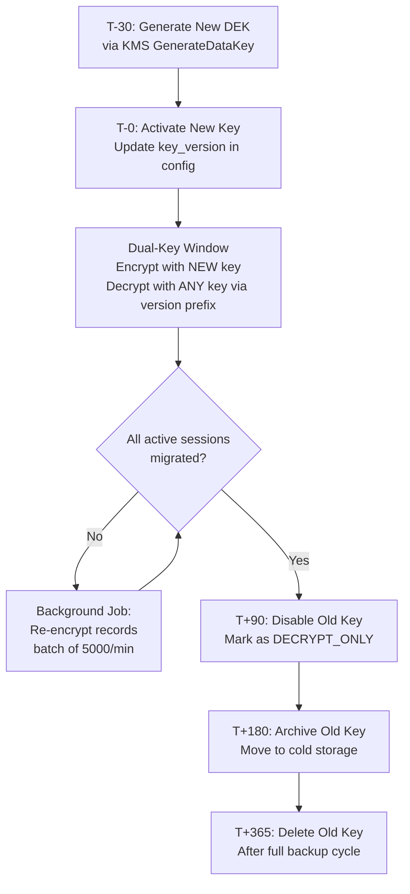
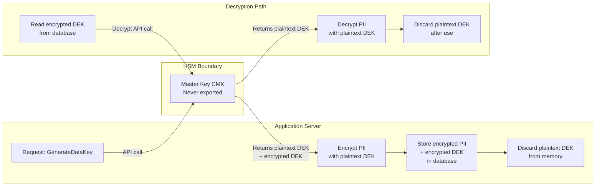

# Encryption Strategy Architecture

> **Business Requirements**: [Data Protection Requirements](../../requirements/12_Security_Compliance/Data_Protection_Requirements.md)
> **Canonical Source**: [source-archive/12_System_Security/12-03-01](../../source-archive/12_System_Security/12-03-01_Encryption_Strategy.md)
> **View Type**: Technical Architecture
> **Target Audience**: Architects, Security Engineers, Backend Developers

---

## 1. AES-256-GCM Implementation

### Storage Format (Base64 Encoded)

```text
[Version]:[IV]:[Ciphertext]:[AuthTag]

Example:
v1:a3f8d9e2c1b4:Y3J5cHRvZ3JhcGh5==:4a7b8c9d
```

| Field | Length | Description |
|-------|--------|-------------|
| Version | 2 bytes | Encryption version (for key rotation) |
| IV (Initialization Vector) | 12 bytes | Random, unique per encryption |
| Ciphertext | Variable | AES-GCM encrypted data |
| AuthTag | 16 bytes | GCM authentication tag |

### Why AES-256-GCM

- **AES-256**: NIST certified, industry standard, quantum-resistant (current)
- **GCM Mode**: AEAD (Authenticated Encryption with Associated Data) - prevents ciphertext tampering
- **Performance**: Hardware acceleration (AES-NI) support

## 2. TLS Configuration

```nginx
server {
    listen 443 ssl http2;
    ssl_protocols TLSv1.3 TLSv1.2;  # Disable TLSv1.0/1.1
    ssl_ciphers 'ECDHE-ECDSA-AES256-GCM-SHA384:ECDHE-RSA-AES256-GCM-SHA384';
    ssl_prefer_server_ciphers on;
    ssl_certificate /path/to/cert.pem;
    ssl_certificate_key /path/to/key.pem;

    # HSTS
    add_header Strict-Transport-Security "max-age=31536000; includeSubDomains; preload" always;

    # Security headers
    add_header X-Frame-Options "DENY" always;
    add_header X-Content-Type-Options "nosniff" always;
}
```

## 3. Password Hashing: Argon2id

### Algorithm Comparison

| Algorithm | Year | Strength | Weakness |
|-----------|------|----------|----------|
| **MD5** | 1992 | Fast | Broken, prohibited |
| **bcrypt** | 1999 | CPU-resistant | GPU vulnerable |
| **PBKDF2** | 2000 | NIST certified | GPU/ASIC vulnerable |
| **Argon2id** | 2015 | **CPU/GPU/ASIC resistant** | High compute cost (a feature) |

### Recommended Parameters (OWASP)

| Parameter | Value | Description |
|-----------|-------|-------------|
| `time_cost` | 3 | Iterations (target: 0.5-1s) |
| `memory_cost` | 65536 (64 MB) | Memory consumption, prevents GPU parallelism |
| `parallelism` | 2 | CPU cores |
| `salt_len` | 16 bytes | Unique random salt per user |

## 4. Data Masking Implementation

### Masking Rules

| PII Field | Masking Rule | Example | Use Case |
|-----------|-------------|---------|----------|
| **Name** | Keep first/last char | `David Beckham` -> `D***m` | CS query, VIP management |
| **Phone** | Keep first 3, last 3 | `0912345678` -> `091****678` | CS query, withdrawal review |
| **Email** | Keep first 2 + domain | `david@gmail.com` -> `da***@gmail.com` | CS query, account settings |
| **Bank Account** | Keep last 4 | `1234567890` -> `******7890` | Withdrawal review, reports |
| **ID Number** | Keep first 2, last 2 | `A123456789` -> `A1*****89` | KYC verification |
| **IP Address** | Keep first 2 octets | `192.168.1.100` -> `192.168.*.*` | Risk analysis, logs |

### Implementation Layer

Masking MUST be implemented at the Backend DTO Converter / Serializer layer. Frontend-only masking is prohibited (API response would still contain plaintext).

## 5. Key Management Architecture

### Dual-Key Hierarchy

```text
+--------------------------------------------+
|  Master Key (CMK - Customer Master Key)    |
|  - Stored in AWS KMS / HashiCorp Vault     |
|  - Never leaves HSM                        |
|  - Rotated every 365 days                  |
+-------------------+------------------------+
                    | Encrypts
                    v
+--------------------------------------------+
|  Data Encryption Keys (DEK)                |
|  - Generated per encryption operation       |
|  - Cached in application memory (ephemeral) |
|  - Encrypted by CMK before storage         |
+--------------------------------------------+
```

### IAM Policy (Least Privilege)

```json
{
  "Version": "2012-10-17",
  "Statement": [
    {
      "Effect": "Allow",
      "Action": [
        "kms:Decrypt",
        "kms:GenerateDataKey"
      ],
      "Resource": "arn:aws:kms:us-east-1:123456789:key/abc-123",
      "Condition": {
        "StringEquals": {
          "kms:ViaService": "rds.us-east-1.amazonaws.com"
        }
      }
    }
  ]
}
```

## 6. Key Rotation Flow

### 6.1 Automated Rotation Lifecycle



- **Frequency**: Auto-rotate CMK every 365 days (AWS KMS managed)
- **Transition**: Old and new keys coexist for 90 days (graceful migration)
- **Emergency**: Manual rotation triggered on suspected key compromise

### 6.2 Version-Aware Decryption

The version prefix in the ciphertext format (`v1:`, `v2:`) enables seamless key rotation without downtime:

```text
Decryption Logic:
1. Parse version from ciphertext prefix
2. Lookup corresponding DEK by version
3. Decrypt using the matched key
4. If version < current, schedule re-encryption
```

## 7. AES-256-GCM Encryption Service (Java)

```java
import javax.crypto.Cipher;
import javax.crypto.SecretKey;
import javax.crypto.spec.GCMParameterSpec;
import java.security.SecureRandom;
import java.util.Base64;

/**
 * AES-256-GCM encryption service for PII field protection.
 * Thread-safe: each call generates a unique IV.
 */
public class AesGcmEncryptionService {

    private static final int GCM_IV_LENGTH = 12;
    private static final int GCM_TAG_LENGTH = 128;
    private static final String ALGORITHM = "AES/GCM/NoPadding";
    private static final String CURRENT_VERSION = "v1";

    private final SecretKey dataEncryptionKey;
    private final SecureRandom secureRandom = new SecureRandom();

    public AesGcmEncryptionService(SecretKey dataEncryptionKey) {
        this.dataEncryptionKey = dataEncryptionKey;
    }

    public String encrypt(String plaintext) throws Exception {
        byte[] iv = new byte[GCM_IV_LENGTH];
        secureRandom.nextBytes(iv);

        Cipher cipher = Cipher.getInstance(ALGORITHM);
        GCMParameterSpec spec = new GCMParameterSpec(GCM_TAG_LENGTH, iv);
        cipher.init(Cipher.ENCRYPT_MODE, dataEncryptionKey, spec);

        byte[] ciphertext = cipher.doFinal(plaintext.getBytes("UTF-8"));

        String ivBase64 = Base64.getEncoder().encodeToString(iv);
        String ctBase64 = Base64.getEncoder().encodeToString(ciphertext);

        // Format: version:iv:ciphertext (AuthTag appended by GCM)
        return CURRENT_VERSION + ":" + ivBase64 + ":" + ctBase64;
    }

    public String decrypt(String encryptedValue) throws Exception {
        String[] parts = encryptedValue.split(":", 3);
        // parts[0] = version, parts[1] = IV, parts[2] = ciphertext+tag
        byte[] iv = Base64.getDecoder().decode(parts[1]);
        byte[] ciphertext = Base64.getDecoder().decode(parts[2]);

        Cipher cipher = Cipher.getInstance(ALGORITHM);
        GCMParameterSpec spec = new GCMParameterSpec(GCM_TAG_LENGTH, iv);
        cipher.init(Cipher.DECRYPT_MODE, dataEncryptionKey, spec);

        byte[] plaintext = cipher.doFinal(ciphertext);
        return new String(plaintext, "UTF-8");
    }
}
```

## 8. HSM Integration Pattern

### 8.1 Envelope Encryption for PII

Envelope encryption separates the data key from the master key. The master key never leaves the HSM boundary.



### 8.2 HSM Configuration (YAML)

```yaml
encryption:
  provider: aws-kms  # or hashicorp-vault
  aws-kms:
    region: us-east-1
    cmk-arn: arn:aws:kms:us-east-1:123456789:key/abc-123
    key-cache:
      enabled: true
      max-age-seconds: 300
      max-entries: 100
  envelope:
    algorithm: AES-256-GCM
    dek-rotation-days: 90
    re-encryption-batch-size: 5000
    re-encryption-rate-per-minute: 5000
```

### 8.3 DEK Cache Strategy

To avoid calling KMS for every decrypt operation, DEKs are cached in-memory with strict TTL:

| Parameter | Value | Rationale |
|-----------|-------|-----------|
| Cache TTL | 300 seconds | Balance between performance and security |
| Max entries | 100 | Limit memory footprint (~3.2 KB) |
| Eviction | LRU | Least recently used keys evicted first |
| On rotation | Invalidate all | Force fresh DEK fetch after key rotation |
