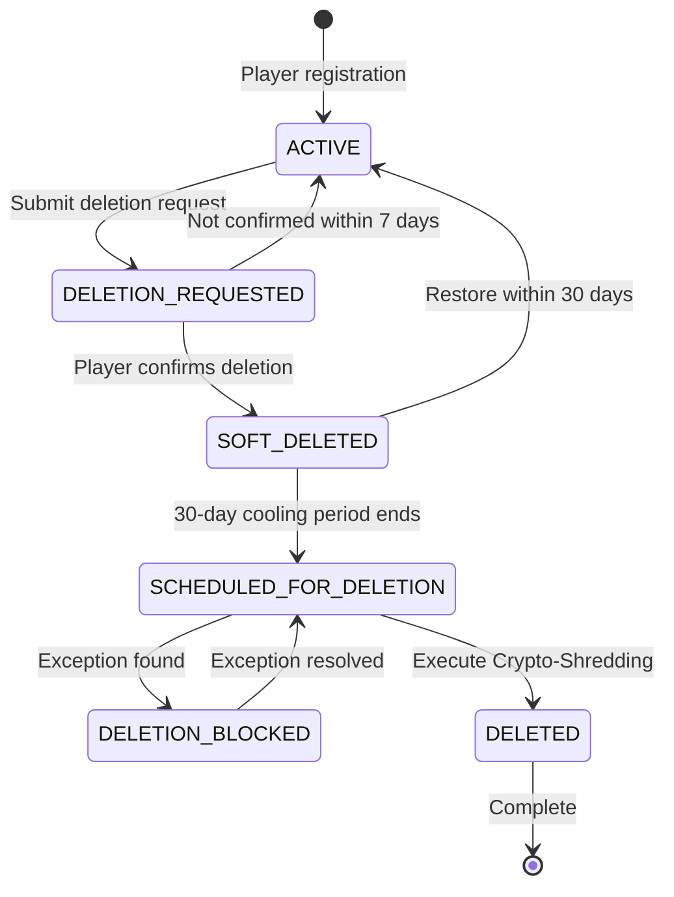
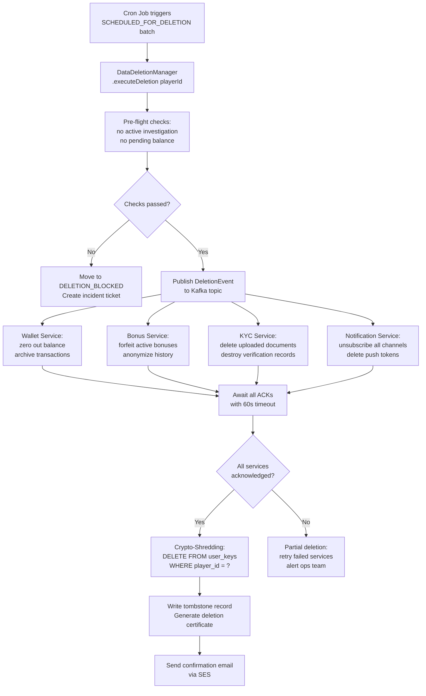

# GDPR 資料刪除架構

> **業務需求**: [Data Protection Requirements](../../requirements/12_Security_Compliance/Data_Protection_Requirements.md)
> **規範來源**: [source-archive/12_System_Security/12-03-03](../../source-archive/12_System_Security/12-03-03_GDPR_Data_Deletion.md)
> **文件類型**: 技術架構
> **目標讀者**: 架構師、安全工程師、法務/合規團隊

---

## 1. 密碼學銷毀架構

```text
[Crypto-Shredding Architecture]

Key Hierarchy:
+------------------------------------------------------+
|  Master Key (KEK - Key Encryption Key)               |
|  - Stored in AWS KMS / HashiCorp Vault               |
|  - Never leaves HSM                                  |
|  - Rotated annually                                 |
+------------------------------------------------------+
                      | Encrypts
+------------------------------------------------------+
|  Per-Player DEK (Data Encryption Key)                |
|  - Unique AES-256 key for EACH player                |
|  - Stored in database (encrypted by KEK)             |
|  - Size: 32 bytes (256-bit)                          |
+------------------------------------------------------+
                      | Encrypts
+------------------------------------------------------+
|  Player PII Data                                      |
|  - encrypted_name, encrypted_phone,                   |
|    encrypted_email, etc.                             |
+------------------------------------------------------+

Deletion Process (Crypto-Shredding):
DELETE FROM user_keys WHERE player_id = ?
-> DEK destroyed, all PII becomes unrecoverable
-> Even with database backups, data cannot be decrypted
```

### 為何傳統刪除不足夠

| 方法 | 問題 | Crypto-Shredding 優勢 |
|--------|---------|---------------------------|
| `DELETE FROM players` | 備份仍含資料 | 備份密文永久不可復原 |
| 軟刪除（`deleted_at`） | 資料仍可查詢 | 金鑰銷毀，無法解密 |
| 覆寫（`VACUUM FULL`） | 成本極高、速度慢 | 輕量（僅刪除金鑰） |

## 2. 資料保留矩陣

| 資料類別 | 包含欄位 | GDPR 可刪除 | 保留期限 | 處理方式 |
|---------------|----------------|----------------|------------------|------------|
| **完全可刪除** | 姓名、地址、偏好設定、行銷同意 | 是 | 無 | 物理刪除 |
| **可匿名化** | 遊戲紀錄（bet_id、game_id、amount） | 是（匿名化） | 無 | 以 UUID 取代 player_id |
| **必須保留（反洗錢）** | 交易紀錄（存款、提款） | 否（法律義務） | **5-7 年** | 以匿名化 player_id 保留 |
| **必須保留（稅務）** | 獎金紀錄（超過門檻） | 否（法律義務） | **7 年** | 以匿名化 player_id 保留 |
| **必須保留（爭議）** | 投訴工單 | 否（法律訴求） | **6 年** | 保留至訴求時效屆滿 |
| **必須保留（封禁）** | 詐欺標記、封禁原因 | 否（正當利益） | **永久** | 保留用於防詐欺 |

## 3. 刪除狀態機



| 狀態 | 說明 | 可否登入？ |
|-------|-------------|--------------|
| **ACTIVE** | 正常狀態 | 是 |
| **DELETION_REQUESTED** | 等待確認 | 是（可取消） |
| **SOFT_DELETED** | 30 天冷靜期 | 否 |
| **SCHEDULED_FOR_DELETION** | 排入處理佇列 | 否 |
| **DELETION_BLOCKED** | 例外（調查中） | 否 |
| **DELETED** | 已永久銷毀 | 否 |

## 4. 例外條件（刪除暫停）

| 情境 | 原因 | 解決方式 | 最長暫停 |
|----------|--------|-----------|----------|
| **調查中** | 反洗錢 (AML)/詐欺調查 | 調查完成 | 1 年 |
| **待審法律案件** | 進行中的訴訟 | 案件結案 | 10 年 |
| **待完成流水** | 獎金流水未完成 | 完成或放棄獎金 | 90 天 |
| **未結餘額** | 餘額 > $0 | 餘額歸零 | 不限期（通知玩家） |
| **稅務稽核** | 稽核期間進行中 | 稽核完成 | 7 年 |

## 5. 執行流程

### 階段 1：請求與確認（T+0 至 T+7 天）

**觸發來源**：
- 玩家透過帳號設定 → "刪除我的帳號"
- 玩家透過客服電子郵件/即時聊天
- 法務團隊代表玩家（GDPR 資料主體請求）

**雙重確認機制**：
- 發送確認電子郵件（7 天有效期）
- 電子郵件包含唯一確認連結

### 階段 2：冷靜期（T+7 至 T+37 天）

- 帳號軟刪除（禁止登入）
- 玩家可在 30 天內恢復
- 第 15 天和第 25 天發送提醒通知

### 階段 3：最終銷毀（T+37 天）

- 排程任務處理已排定的刪除
- 執行 Crypto-Shredding（銷毀 DEK）
- 匿名化需保留的紀錄（替換 player_id）
- 產生刪除證書
- 發送確認至玩家電子郵件

## 6. 合規證書

刪除完成後自動產生並寄送至玩家電子郵件：

| 欄位 | 內容 |
|-------|---------|
| Request ID | GDPR-2026-00567 |
| Player ID | PLY-12345678 (anonymized) |
| Deletion Type | Crypto-Shredding |
| Executed At | 2026-02-07T10:30:00Z |
| Data Deleted | PII, preferences, marketing consent |
| Data Retained | Transaction records (AML, 7 years), Fraud flags (permanent) |
| Certificate Hash | SHA256: abc123... |

## 7. 監控指標

| 指標 | 目標 | 告警閾值 |
|--------|--------|----------------|
| `deletion_queue_size` | < 100 | > 1000 |
| `deletion_success_rate` | > 99.5% | < 95% |
| `deletion_duration_p99` | < 5s | > 10s |
| `blocked_deletions_count` | < 10/month | > 50/month |

## 8. 技術堆疊

| 元件 | 建議方案 | 用途 |
|-----------|------------|---------|
| **金鑰管理** | AWS KMS / HashiCorp Vault | DEK/KEK 管理 |
| **加密** | AES-256-GCM | PII 加密 |
| **任務佇列** | Celery / Bull (Redis) | 排程任務排程 |
| **事件匯流排** | Kafka / RabbitMQ | 跨模組通知 |
| **稽核日誌** | Elasticsearch | 合規追蹤 |
| **電子郵件服務** | SendGrid / AWS SES | 確認通知 |

## 9. 資料刪除管線

### 9.1 跨服務串聯流程



### 9.2 DataDeletionManager (Java)

```java
import lombok.RequiredArgsConstructor;
import lombok.extern.slf4j.Slf4j;
import org.springframework.stereotype.Component;
import org.springframework.transaction.annotation.Transactional;

/**
 * Manager layer: owns @Transactional for GDPR deletion pipeline.
 * Coordinates crypto-shredding across multiple data stores.
 */
@Slf4j
@Component
@RequiredArgsConstructor
public class DataDeletionManager {

    private final UserKeyDao userKeyDao;
    private final PlayerDao playerDao;
    private final DeletionAuditDao deletionAuditDao;
    private final DeletionEventPublisher eventPublisher;

    @Transactional(rollbackFor = Throwable.class)
    public DeletionCertificate executeDeletion(Long playerId) {
        // 1. Pre-flight: verify no holds
        PlayerEntity player = playerDao.selectById(playerId);
        if (player.getStatus() != PlayerStatus.SCHEDULED_FOR_DELETION) {
            throw new BusinessException(
                "Player not in SCHEDULED_FOR_DELETION state");
        }

        // 2. Publish event for cross-service cleanup
        eventPublisher.publishDeletionEvent(playerId);

        // 3. Crypto-shredding: destroy the per-player DEK
        int deleted = userKeyDao.deleteByPlayerId(playerId);
        if (deleted == 0) {
            log.warn("No DEK found for player {}", playerId);
        }

        // 4. Anonymize retained records (AML/Tax)
        playerDao.anonymizePlayer(playerId);

        // 5. Write tombstone + audit trail
        DeletionAuditEntity audit = DeletionAuditEntity.builder()
            .playerId(playerId)
            .deletionType("CRYPTO_SHREDDING")
            .deletedFields("name,phone,email,address,id_number")
            .retainedFields("transaction_records,fraud_flags")
            .executedAt(LocalDateTime.now())
            .certificateHash(generateCertificateHash(playerId))
            .build();
        deletionAuditDao.insert(audit);

        return DeletionCertificate.from(audit);
    }

    private String generateCertificateHash(Long playerId) {
        String input = playerId + ":" + System.currentTimeMillis();
        return DigestUtils.sha256Hex(input);
    }
}
```

### 9.3 匿名化 SQL

因法律原因（反洗錢、稅務）必須保留的紀錄，以匿名化取代刪除：

```sql
-- Anonymize player identity while retaining transaction records
UPDATE t_player
SET encrypted_name  = 'REDACTED',
    encrypted_phone = 'REDACTED',
    encrypted_email = 'REDACTED',
    phone_index     = CONCAT('DELETED:', id),
    email_index     = CONCAT('DELETED:', id),
    id_number_index = NULL,
    status          = 6,  -- DELETED status
    updated_at      = NOW()
WHERE id = #{playerId};

-- Transaction records: replace player_id with anonymous UUID
UPDATE t_transaction
SET player_id    = NULL,
    anonymous_id = #{anonymousUuid},
    updated_at   = NOW()
WHERE player_id = #{playerId};

-- Tombstone record for audit trail
INSERT INTO t_deletion_tombstone (
    original_player_id, anonymous_id,
    deletion_type, certificate_hash,
    deleted_at
) VALUES (
    #{playerId}, #{anonymousUuid},
    'CRYPTO_SHREDDING', #{certificateHash},
    NOW()
);
```

### 9.4 刪除稽核軌跡結構

```sql
CREATE TABLE t_deletion_audit (
    id                BIGINT PRIMARY KEY AUTO_INCREMENT,
    player_id         BIGINT       NOT NULL COMMENT 'Original player ID',
    request_id        VARCHAR(32)  NOT NULL COMMENT 'GDPR request tracking ID',
    deletion_type     VARCHAR(32)  NOT NULL COMMENT 'CRYPTO_SHREDDING or PHYSICAL',
    deleted_fields    TEXT         NOT NULL COMMENT 'Comma-separated list of deleted PII fields',
    retained_fields   TEXT         NULL     COMMENT 'Fields retained for legal reasons',
    executed_at       DATETIME     NOT NULL,
    certificate_hash  CHAR(64)     NOT NULL COMMENT 'SHA-256 hash of deletion certificate',
    operator_id       BIGINT       NULL     COMMENT 'System or manual operator',
    created_at        DATETIME     NOT NULL DEFAULT CURRENT_TIMESTAMP,

    INDEX idx_player_id (player_id),
    INDEX idx_request_id (request_id),
    INDEX idx_executed_at (executed_at)
) ENGINE=InnoDB DEFAULT CHARSET=utf8mb4 COMMENT='GDPR deletion audit trail';
```
