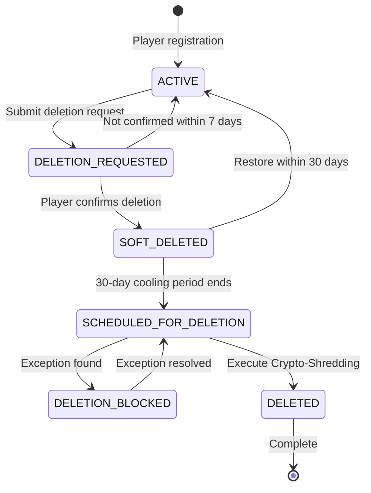
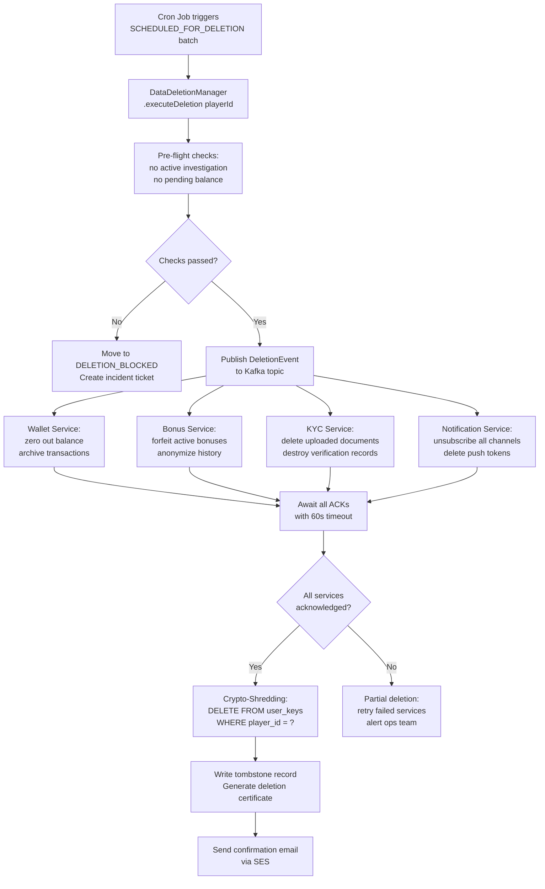

# GDPR Data Deletion Architecture

> **Business Requirements**: [Data Protection Requirements](../../requirements/12_Security_Compliance/Data_Protection_Requirements.md)
> **Canonical Source**: [source-archive/12_System_Security/12-03-03](../../source-archive/12_System_Security/12-03-03_GDPR_Data_Deletion.md)
> **View Type**: Technical Architecture
> **Target Audience**: Architects, Security Engineers, Legal/Compliance Team

---

## 1. Crypto-Shredding Architecture

```text
[Crypto-Shredding Architecture]

Key Hierarchy:
+------------------------------------------------------+
|  Master Key (KEK - Key Encryption Key)               |
|  - Stored in AWS KMS / HashiCorp Vault               |
|  - Never leaves HSM                                  |
|  - Rotated annually                                 |
+------------------------------------------------------+
                      | Encrypts
+------------------------------------------------------+
|  Per-Player DEK (Data Encryption Key)                |
|  - Unique AES-256 key for EACH player                |
|  - Stored in database (encrypted by KEK)             |
|  - Size: 32 bytes (256-bit)                          |
+------------------------------------------------------+
                      | Encrypts
+------------------------------------------------------+
|  Player PII Data                                      |
|  - encrypted_name, encrypted_phone,                   |
|    encrypted_email, etc.                             |
+------------------------------------------------------+

Deletion Process (Crypto-Shredding):
DELETE FROM user_keys WHERE player_id = ?
-> DEK destroyed, all PII becomes unrecoverable
-> Even with database backups, data cannot be decrypted
```

### Why Traditional Deletion Is Insufficient

| Method | Problem | Crypto-Shredding Advantage |
|--------|---------|---------------------------|
| `DELETE FROM players` | Backups still contain data | Backup ciphertext permanently unrecoverable |
| Soft delete (`deleted_at`) | Data still queryable | Key destroyed, cannot decrypt |
| Overwrite (`VACUUM FULL`) | Extremely costly, slow | Lightweight (delete key only) |

## 2. Data Retention Matrix

| Data Category | Included Fields | GDPR Deletable | Retention Period | Processing |
|---------------|----------------|----------------|------------------|------------|
| **Fully Deletable** | Name, address, preferences, marketing consent | Yes | None | Physical Delete |
| **Anonymizable** | Game history (bet_id, game_id, amount) | Yes (anonymize) | None | Replace player_id with UUID |
| **Must Retain (AML)** | Transaction records (deposits, withdrawals) | No (legal obligation) | **5-7 years** | Retain with anonymized player_id |
| **Must Retain (Tax)** | Winnings records (> threshold) | No (legal obligation) | **7 years** | Retain with anonymized player_id |
| **Must Retain (Dispute)** | Complaint tickets | No (legal claim) | **6 years** | Retain until claim expires |
| **Must Retain (Ban)** | Fraud flags, ban reason | No (legitimate interest) | **Permanent** | Retain for fraud prevention |

## 3. Deletion State Machine



| State | Description | Player Login? |
|-------|-------------|--------------|
| **ACTIVE** | Normal state | Yes |
| **DELETION_REQUESTED** | Awaiting confirmation | Yes (can cancel) |
| **SOFT_DELETED** | 30-day cooling period | No |
| **SCHEDULED_FOR_DELETION** | In processing queue | No |
| **DELETION_BLOCKED** | Exception (investigation) | No |
| **DELETED** | Permanently destroyed | No |

## 4. Exception Conditions (Deletion Hold)

| Scenario | Reason | Resolution | Max Hold |
|----------|--------|-----------|----------|
| **Under Investigation** | AML/Fraud investigation | Investigation complete | 1 year |
| **Pending Legal Case** | Active litigation | Case resolved | 10 years |
| **Pending Wagering** | Incomplete bonus wagering | Complete or forfeit bonus | 90 days |
| **Outstanding Balance** | Balance > $0 | Balance zeroed | Indefinite (notify player) |
| **Tax Audit** | Audit period active | Audit complete | 7 years |

## 5. Execution Workflow

### Phase 1: Request and Confirmation (T+0 to T+7 days)

**Trigger Sources**:
- Player via Account Settings -> "Delete My Account"
- Player via CS email/live chat
- Legal team on behalf of player (GDPR Data Subject Request)

**Double Opt-In Confirmation**:
- Send confirmation email (7-day validity)
- Email contains unique confirmation link

### Phase 2: Cooling Period (T+7 to T+37 days)

- Account soft-deleted (login disabled)
- Player can restore within 30 days
- Reminder notifications at Day 15 and Day 25

### Phase 3: Final Destruction (T+37 days)

- Cron job processes scheduled deletions
- Execute Crypto-Shredding (destroy DEK)
- Anonymize retained records (replace player_id)
- Generate deletion certificate
- Send confirmation to player email

## 6. Compliance Certificate

Auto-generated and emailed to player after deletion:

| Field | Content |
|-------|---------|
| Request ID | GDPR-2026-00567 |
| Player ID | PLY-12345678 (anonymized) |
| Deletion Type | Crypto-Shredding |
| Executed At | 2026-02-07T10:30:00Z |
| Data Deleted | PII, preferences, marketing consent |
| Data Retained | Transaction records (AML, 7 years), Fraud flags (permanent) |
| Certificate Hash | SHA256: abc123... |

## 7. Monitoring Metrics

| Metric | Target | Alert Threshold |
|--------|--------|----------------|
| `deletion_queue_size` | < 100 | > 1000 |
| `deletion_success_rate` | > 99.5% | < 95% |
| `deletion_duration_p99` | < 5s | > 10s |
| `blocked_deletions_count` | < 10/month | > 50/month |

## 8. Technology Stack

| Component | Recommended | Purpose |
|-----------|------------|---------|
| **Key Management** | AWS KMS / HashiCorp Vault | DEK/KEK management |
| **Encryption** | AES-256-GCM | PII encryption |
| **Task Queue** | Celery / Bull (Redis) | Cron job scheduling |
| **Event Bus** | Kafka / RabbitMQ | Cross-module notifications |
| **Audit Log** | Elasticsearch | Compliance tracking |
| **Email Service** | SendGrid / AWS SES | Confirmation notifications |

## 9. Data Deletion Pipeline

### 9.1 Cross-Service Cascade Flow



### 9.2 DataDeletionManager (Java)

```java
import lombok.RequiredArgsConstructor;
import lombok.extern.slf4j.Slf4j;
import org.springframework.stereotype.Component;
import org.springframework.transaction.annotation.Transactional;

/**
 * Manager layer: owns @Transactional for GDPR deletion pipeline.
 * Coordinates crypto-shredding across multiple data stores.
 */
@Slf4j
@Component
@RequiredArgsConstructor
public class DataDeletionManager {

    private final UserKeyDao userKeyDao;
    private final PlayerDao playerDao;
    private final DeletionAuditDao deletionAuditDao;
    private final DeletionEventPublisher eventPublisher;

    @Transactional(rollbackFor = Throwable.class)
    public DeletionCertificate executeDeletion(Long playerId) {
        // 1. Pre-flight: verify no holds
        PlayerEntity player = playerDao.selectById(playerId);
        if (player.getStatus() != PlayerStatus.SCHEDULED_FOR_DELETION) {
            throw new BusinessException(
                "Player not in SCHEDULED_FOR_DELETION state");
        }

        // 2. Publish event for cross-service cleanup
        eventPublisher.publishDeletionEvent(playerId);

        // 3. Crypto-shredding: destroy the per-player DEK
        int deleted = userKeyDao.deleteByPlayerId(playerId);
        if (deleted == 0) {
            log.warn("No DEK found for player {}", playerId);
        }

        // 4. Anonymize retained records (AML/Tax)
        playerDao.anonymizePlayer(playerId);

        // 5. Write tombstone + audit trail
        DeletionAuditEntity audit = DeletionAuditEntity.builder()
            .playerId(playerId)
            .deletionType("CRYPTO_SHREDDING")
            .deletedFields("name,phone,email,address,id_number")
            .retainedFields("transaction_records,fraud_flags")
            .executedAt(LocalDateTime.now())
            .certificateHash(generateCertificateHash(playerId))
            .build();
        deletionAuditDao.insert(audit);

        return DeletionCertificate.from(audit);
    }

    private String generateCertificateHash(Long playerId) {
        String input = playerId + ":" + System.currentTimeMillis();
        return DigestUtils.sha256Hex(input);
    }
}
```

### 9.3 Anonymization SQL

Records that must be retained for legal reasons (AML, tax) are anonymized rather than deleted:

```sql
-- Anonymize player identity while retaining transaction records
UPDATE t_player
SET encrypted_name  = 'REDACTED',
    encrypted_phone = 'REDACTED',
    encrypted_email = 'REDACTED',
    phone_index     = CONCAT('DELETED:', id),
    email_index     = CONCAT('DELETED:', id),
    id_number_index = NULL,
    status          = 6,  -- DELETED status
    updated_at      = NOW()
WHERE id = #{playerId};

-- Transaction records: replace player_id with anonymous UUID
UPDATE t_transaction
SET player_id    = NULL,
    anonymous_id = #{anonymousUuid},
    updated_at   = NOW()
WHERE player_id = #{playerId};

-- Tombstone record for audit trail
INSERT INTO t_deletion_tombstone (
    original_player_id, anonymous_id,
    deletion_type, certificate_hash,
    deleted_at
) VALUES (
    #{playerId}, #{anonymousUuid},
    'CRYPTO_SHREDDING', #{certificateHash},
    NOW()
);
```

### 9.4 Deletion Audit Trail Schema

```sql
CREATE TABLE t_deletion_audit (
    id                BIGINT PRIMARY KEY AUTO_INCREMENT,
    player_id         BIGINT       NOT NULL COMMENT 'Original player ID',
    request_id        VARCHAR(32)  NOT NULL COMMENT 'GDPR request tracking ID',
    deletion_type     VARCHAR(32)  NOT NULL COMMENT 'CRYPTO_SHREDDING or PHYSICAL',
    deleted_fields    TEXT         NOT NULL COMMENT 'Comma-separated list of deleted PII fields',
    retained_fields   TEXT         NULL     COMMENT 'Fields retained for legal reasons',
    executed_at       DATETIME     NOT NULL,
    certificate_hash  CHAR(64)     NOT NULL COMMENT 'SHA-256 hash of deletion certificate',
    operator_id       BIGINT       NULL     COMMENT 'System or manual operator',
    created_at        DATETIME     NOT NULL DEFAULT CURRENT_TIMESTAMP,

    INDEX idx_player_id (player_id),
    INDEX idx_request_id (request_id),
    INDEX idx_executed_at (executed_at)
) ENGINE=InnoDB DEFAULT CHARSET=utf8mb4 COMMENT='GDPR deletion audit trail';
```
