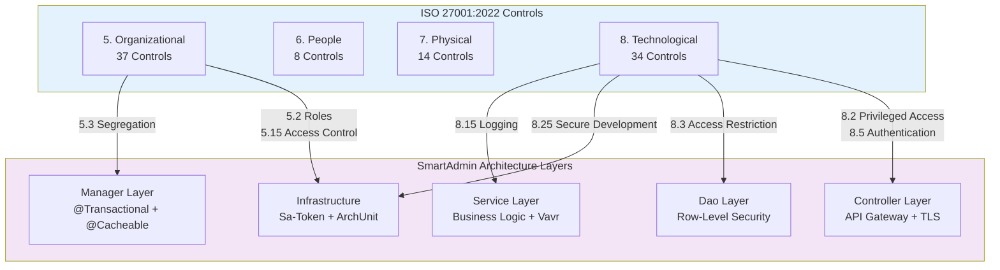

# ISO 27001:2022 Mapping Architecture

> **Business Requirements**: [Compliance Standards Requirements](../../requirements/12_Security_Compliance/Compliance_Standards_Requirements.md)
> **Canonical Source**: [source-archive/12_System_Security/12-04](../../source-archive/12_System_Security/12-04_ISO27001_2022_Mapping.md)
> **View Type**: Technical Architecture
> **Target Audience**: Architects, Security Engineers, Compliance Officers

---

## 1. Annex A Control Structure

ISO/IEC 27001:2022 consolidates 114 controls (2013 version) into 93 controls across 4 categories:

| Category | Control Count | Description | SmartAdmin Coverage |
|----------|--------------|-------------|---------------------|
| **5. Organizational** | 37 | Organizational controls | 5/7 key items implemented |
| **6. People** | 8 | People controls | 2/3 key items implemented |
| **7. Physical** | 14 | Physical controls | N/A (cloud environment) |
| **8. Technological** | 34 | Technical controls | 13/15 key items implemented |

### Control Mapping to SmartAdmin Layers



## 2. SmartAdmin Implementation Mapping

### 5. Organizational Controls (Key Items)

| Control | Description | SmartAdmin Implementation | Status |
|---------|-------------|--------------------------|--------|
| 5.1 | Information Security Policy | CLAUDE.md security guidelines | Implemented |
| 5.2 | Information Security Roles | RBAC Permission System | Implemented |
| 5.3 | Segregation of Duties | Manager layer transaction separation | Implemented |
| 5.7 | Threat Intelligence | To be implemented | Gap |
| 5.15 | Access Control | Sa-Token authentication | Implemented |
| 5.23 | Cloud Service Security | To be assessed | Gap |
| 5.30 | ICT Business Continuity | Deployment architecture | Implemented |

### 6. People Controls

| Control | Description | SmartAdmin Implementation | Status |
|---------|-------------|--------------------------|--------|
| 6.1 | Background Screening | HR Policy | N/A |
| 6.3 | Security Awareness Training | To be implemented | Gap |
| 6.5 | Termination Procedures | Account deactivation flow | Implemented |

### 7. Physical Controls

| Control | Description | SmartAdmin Implementation | Status |
|---------|-------------|--------------------------|--------|
| 7.1 | Physical Security Perimeter | Cloud environment | N/A |
| 7.4 | Physical Security Monitoring | Cloud provider managed | N/A |

### 8. Technological Controls (Key Items)

| Control | Description | SmartAdmin Implementation | Status |
|---------|-------------|--------------------------|--------|
| 8.1 | Endpoint Devices | To be assessed | Gap |
| 8.2 | Privileged Access | RBAC Permission System | Implemented |
| 8.3 | Information Access Restriction | Row-Level Security | Implemented |
| 8.5 | Secure Authentication | MFA (TOTP/WebAuthn) | Implemented |
| 8.7 | Malware Protection | Cloud WAF | Implemented |
| 8.9 | Configuration Management | Git version control | Implemented |
| 8.12 | Data Leakage Prevention | Data Security Standard | Implemented |
| 8.13 | Backup | PostgreSQL backup strategy | Implemented |
| 8.15 | Logging | Audit Log system | Implemented |
| 8.16 | Monitoring | Performance monitoring | Implemented |
| 8.20 | Network Security | TLS 1.3, API Gateway | Implemented |
| 8.24 | Cryptography | AES-256-GCM encryption | Implemented |
| 8.25 | Secure Development | ArchUnit, code review | Implemented |
| 8.28 | Secure Coding | OWASP guidelines | Implemented |
| 8.29 | Security Testing | Integration tests | Implemented |

## 3. Gap Analysis

| Control | Description | Recommended Action | Priority | Effort |
|---------|-------------|-------------------|----------|--------|
| 5.7 | Threat Intelligence | Integrate threat intelligence feeds | P2 | 2 weeks |
| 5.23 | Cloud Service Security | Cloud security assessment | P2 | 1 week |
| 6.3 | Security Training | Establish training program | P1 | 3 weeks |
| 8.1 | Endpoint Management | MDM solution | P2 | 4 weeks |

### 3.1 Gap Remediation Details

**Control 5.7 - Threat Intelligence (P2)**:

Integrate MITRE ATT&CK framework threat feeds for iGaming-specific attack patterns:

| Threat Category | Source | Integration |
|----------------|--------|-------------|
| Credential Stuffing | OSINT feeds | API Gateway rate limiting |
| Bonus Abuse | Internal analytics | Risk control rules |
| Money Laundering | FinCEN/AUSTRAC | KYC/AML module |
| DDoS Patterns | Cloud WAF logs | Auto-scaling triggers |

**Control 6.3 - Security Awareness Training (P1)**:

| Training Module | Target Audience | Frequency | Delivery |
|----------------|-----------------|-----------|----------|
| OWASP Top 10 | All developers | Quarterly | Online |
| Secure Coding | Backend engineers | Monthly | Workshop |
| Incident Response | Operations team | Bi-annually | Simulation |
| Data Protection | All staff | Annually | Online |

**Control 8.1 - Endpoint Management (P2)**:

| Requirement | Solution | Status |
|-------------|----------|--------|
| Device encryption | BitLocker/FileVault | To implement |
| Remote wipe | MDM solution | To implement |
| Patch management | Automated updates | To implement |
| USB control | Group Policy | To implement |

### 3.2 Architecture Enforcement with ArchUnit

SmartAdmin enforces ISO 27001 control 8.25 (Secure Development) via ArchUnit tests:

```java
/**
 * ArchUnit test enforcing ISO 27001 Control 8.25 - Secure Development
 * Ensures architectural security policies are automatically verified
 */
@AnalyzeClasses(
    packages = "net.lab1024.sa",
    importOptions = ImportOption.DoNotIncludeTests.class
)
public class SecurityArchitectureTest {

    // Control 5.3 - Segregation of Duties:
    // Controller must NOT directly access Dao layer
    @ArchTest
    static final ArchRule controllerMustNotAccessDao =
        noClasses().that().resideInAPackage("..controller..")
            .should().dependOnClassesThat()
            .resideInAPackage("..dao..")
            .because("ISO 27001 Control 5.3: Segregation of duties " +
                     "requires Controller -> Service -> Dao layering");

    // Control 8.25 - Secure Development:
    // @Transactional must only appear in Manager layer
    @ArchTest
    static final ArchRule transactionalOnlyInManager =
        noClasses().that().resideInAPackage("..service..")
            .should().beAnnotatedWith(Transactional.class)
            .because("ISO 27001 Control 8.25: @Transactional " +
                     "must be in Manager layer for proper isolation");

    // Control 8.5 - Secure Authentication:
    // All Controller methods must have authentication annotation
    @ArchTest
    static final ArchRule controllersMustDeclareAuth =
        methods().that().areDeclaredInClassesThat()
            .resideInAPackage("..controller..")
            .and().arePublic()
            .should().beAnnotatedWith(SaCheckPermission.class)
            .orShould().beAnnotatedWith(NoNeedLogin.class)
            .because("ISO 27001 Control 8.5: All endpoints " +
                     "must declare authentication requirements");
}
```

---

## 4. Compliance Monitoring

### 4.1 Continuous Compliance Dashboard

| Metric | Target | Measurement | Frequency |
|--------|--------|-------------|-----------|
| ArchUnit test pass rate | 100% | CI/CD pipeline | Every commit |
| Security vulnerability count | 0 critical | Dependency scan | Weekly |
| Audit log coverage | 100% operations | Log analysis | Daily |
| Access review completion | 100% | RBAC audit | Quarterly |
| Training completion rate | 100% | LMS tracking | Quarterly |

### 4.2 Audit Trail Requirements (Control 8.15)

All security-relevant operations must produce audit logs with:

| Field | Description | Example |
|-------|-------------|---------|
| `timestamp` | UTC timestamp | `2026-02-07T10:30:00Z` |
| `actor` | User/system identity | `admin:1024` |
| `action` | Operation performed | `PERMISSION_CHANGE` |
| `resource` | Target resource | `user:5678` |
| `result` | Success/failure | `SUCCESS` |
| `ip_address` | Source IP | `192.168.1.100` |
| `tenant_id` | Multi-tenant identifier | `tenant_001` |

---

## 5. Compliance Timeline

| Phase | Duration | Objective | Key Deliverables |
|-------|----------|-----------|-----------------|
| Phase 1 | 1 month | Complete gap assessment | Gap report, risk register |
| Phase 2 | 2 months | Implement critical controls | Training program, MDM rollout |
| Phase 3 | 1 month | Internal audit | Audit report, corrective actions |
| Phase 4 | Ongoing | Certification audit preparation | ISMS documentation, evidence collection |

---

## Related Documents

- [UK RTS Security](./UK_RTS_Security.md) - UK Gambling Commission RTS Section 4
- [Data Security Standard](./Data_Security_Standard.md) - Data protection controls
- [Encryption Strategy](./Encryption_Strategy.md) - Cryptographic controls (8.24)
