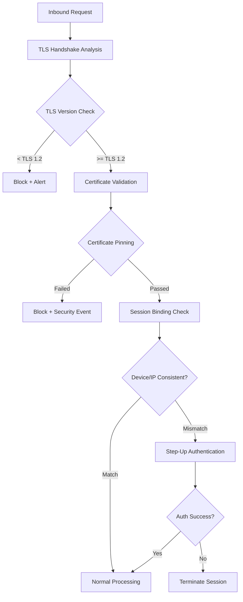

# MITM 偵測架構

> **業務需求**: [Payment Security Requirements](../../requirements/12_Security_Compliance/Payment_Security_Requirements.md)
> **規範來源**: [source-archive/12_System_Security/12-08](../../source-archive/12_System_Security/12-08_MITM_Detection.md)
> **文件類型**: 技術架構
> **目標讀者**: 架構師、安全工程師、後端開發人員

---

## 1. 偵測能力

| 能力 | 說明 | 偵測延遲 |
|-----------|-------------|-------------------|
| **TLS 降級偵測** | 偵測強制 TLS 版本降級 | 即時 |
| **憑證綁定** | 驗證伺服器憑證合法性 | 即時 |
| **Session 劫持偵測** | 辨識遭竊的 Session Token | 近即時（<1 秒） |
| **DNS 欺騙偵測** | 偵測 DNS 解析異常 | 即時 |
| **代理注入偵測** | 辨識惡意代理攔截 | 即時 |

## 2. TLS 安全配置

```java
@Configuration
public class TLSSecurityConfig {

    @Bean
    public WebServerFactoryCustomizer<TomcatServletWebServerFactory> tlsCustomizer() {
        return factory -> factory.addConnectorCustomizers(connector -> {
            if (connector.getProtocolHandler() instanceof Http11NioProtocol) {
                Http11NioProtocol protocol = (Http11NioProtocol) connector.getProtocolHandler();

                // Allow only TLS 1.3 and TLS 1.2
                protocol.setSSLProtocol("TLSv1.3,TLSv1.2");

                // Disable weak cipher suites
                protocol.setCiphers(
                    "TLS_AES_256_GCM_SHA384," +
                    "TLS_CHACHA20_POLY1305_SHA256," +
                    "TLS_AES_128_GCM_SHA256," +
                    "ECDHE-RSA-AES256-GCM-SHA384," +
                    "ECDHE-RSA-AES128-GCM-SHA256"
                );

                // Disable SSL compression (prevent CRIME attack)
                protocol.setCompression("off");
            }
        });
    }
}
```

## 3. 憑證綁定服務

```java
@Service
@RequiredArgsConstructor
@Slf4j
public class CertificatePinningService {

    private static final Set<String> PINNED_HASHES = Set.of(
        "sha256/AAAAAAAAAAAAAAAAAAAAAAAAAAAAAAAAAAAAAAAAAAA=", // Primary cert
        "sha256/BBBBBBBBBBBBBBBBBBBBBBBBBBBBBBBBBBBBBBBBBBB="  // Backup cert
    );

    public boolean verifyCertificatePin(X509Certificate certificate) {
        try {
            byte[] publicKeyBytes = certificate.getPublicKey().getEncoded();
            MessageDigest digest = MessageDigest.getInstance("SHA-256");
            byte[] hash = digest.digest(publicKeyBytes);
            String base64Hash = "sha256/" + Base64.getEncoder().encodeToString(hash);

            boolean valid = PINNED_HASHES.contains(base64Hash);

            if (!valid) {
                log.warn("Certificate pinning validation failed. Hash: {}", base64Hash);
                securityEventService.logCertificatePinningFailure(base64Hash);
            }

            return valid;
        } catch (NoSuchAlgorithmException e) {
            log.error("Certificate pinning verification error", e);
            return false;
        }
    }
}
```

## 4. Session 綁定偵測器

```java
@Service
@RequiredArgsConstructor
public class SessionBindingDetector {

    public SessionBindingResult validateSessionBinding(
            String sessionId,
            String currentFingerprint,
            String currentIp) {

        SessionBinding binding = sessionBindingDao.findBySessionId(sessionId);

        if (binding == null) {
            createSessionBinding(sessionId, currentFingerprint, currentIp);
            return SessionBindingResult.valid();
        }

        List<String> violations = new ArrayList<>();

        // 1. Device fingerprint check
        if (!binding.getDeviceFingerprint().equals(currentFingerprint)) {
            violations.add("DEVICE_MISMATCH");
        }

        // 2. IP subnet check
        if (!isSameSubnet(binding.getIpAddress(), currentIp)) {
            if (isImpossibleTravel(binding.getLastActiveAt(), binding.getIpAddress(), currentIp)) {
                violations.add("IMPOSSIBLE_TRAVEL");
            } else {
                violations.add("IP_CHANGE");
            }
        }

        if (!violations.isEmpty()) {
            return SessionBindingResult.builder()
                .valid(false)
                .violations(violations)
                .riskLevel(determineRiskLevel(violations))
                .build();
        }

        return SessionBindingResult.valid();
    }

    private RiskLevel determineRiskLevel(List<String> violations) {
        if (violations.contains("DEVICE_MISMATCH") && violations.contains("IMPOSSIBLE_TRAVEL")) {
            return RiskLevel.CRITICAL; // Likely MITM attack
        }
        if (violations.contains("DEVICE_MISMATCH")) {
            return RiskLevel.HIGH;
        }
        return RiskLevel.MEDIUM;
    }
}
```

## 5. 代理偵測服務

```java
@Service
@RequiredArgsConstructor
public class ProxyDetectionService {

    public ProxyDetectionResult detectProxy(HttpServletRequest request) {
        List<String> signals = new ArrayList<>();

        // 1. Check proxy-related headers
        String[] proxyHeaders = {
            "X-Forwarded-For", "Via", "Proxy-Connection",
            "X-Real-IP", "Forwarded"
        };

        for (String header : proxyHeaders) {
            if (StringUtils.hasText(request.getHeader(header))) {
                signals.add("PROXY_HEADER:" + header);
            }
        }

        // 2. Check known proxy/VPN IPs
        String clientIp = getClientIp(request);
        if (knownProxyService.isKnownProxy(clientIp)) {
            signals.add("KNOWN_PROXY_IP");
        }

        // 3. Check datacenter IPs
        if (ipInfoService.isDatacenterIp(clientIp)) {
            signals.add("DATACENTER_IP");
        }

        // 4. Timezone vs IP geolocation mismatch
        String browserTimezone = request.getHeader("X-Timezone");
        String ipTimezone = geoService.getTimezone(clientIp);
        if (browserTimezone != null && !browserTimezone.equals(ipTimezone)) {
            signals.add("TIMEZONE_MISMATCH");
        }

        return ProxyDetectionResult.builder()
            .proxyDetected(!signals.isEmpty())
            .signals(signals)
            .riskLevel(calculateRiskLevel(signals))
            .build();
    }
}
```

## 6. 即時監控流程



## 7. 告警規則

| 告警類型 | 觸發條件 | 嚴重程度 | 行動 |
|-----------|---------|----------|--------|
| **TLS 降級** | 偵測到 TLS 1.0/1.1 | 嚴重 | 阻斷 + 記錄 |
| **憑證綁定失敗** | 憑證不在綁定清單中 | 嚴重 | 阻斷 + 調查 |
| **Session 劫持** | 裝置 + IP 同時變更 | 嚴重 | 終止 Session |
| **可疑代理** | 多重代理訊號 | 高 | 增強認證 |
| **DNS 異常** | 解析不一致 | 高 | 驗證 + 記錄 |

## 8. 資料庫結構

```sql
CREATE TABLE t_mitm_detection_event (
    id BIGINT PRIMARY KEY AUTO_INCREMENT,
    event_id VARCHAR(50) NOT NULL UNIQUE,
    session_id VARCHAR(100),
    player_id BIGINT,
    client_ip VARCHAR(45) NOT NULL,
    user_agent VARCHAR(500),
    detection_type ENUM(
        'TLS_DOWNGRADE', 'CERTIFICATE_PIN_FAILURE',
        'SESSION_HIJACK', 'PROXY_DETECTED', 'DNS_SPOOFING'
    ) NOT NULL,
    detection_signals JSON,
    risk_score INT NOT NULL,
    risk_level ENUM('LOW', 'MEDIUM', 'HIGH', 'CRITICAL') NOT NULL,
    action_taken ENUM('LOG', 'STEP_UP', 'BLOCK', 'TERMINATE_SESSION') NOT NULL,
    action_result ENUM('SUCCESS', 'FAILURE'),
    tls_version VARCHAR(20),
    cipher_suite VARCHAR(100),
    detected_at DATETIME NOT NULL DEFAULT CURRENT_TIMESTAMP,

    INDEX idx_player (player_id, detected_at),
    INDEX idx_detection_type (detection_type, detected_at),
    INDEX idx_risk_level (risk_level, detected_at)
) ENGINE=InnoDB;

CREATE TABLE t_session_binding (
    id BIGINT PRIMARY KEY AUTO_INCREMENT,
    session_id VARCHAR(100) NOT NULL UNIQUE,
    player_id BIGINT NOT NULL,
    device_fingerprint VARCHAR(100) NOT NULL,
    ip_address VARCHAR(45) NOT NULL,
    ip_subnet VARCHAR(45),
    geo_country VARCHAR(2),
    geo_city VARCHAR(100),
    request_count INT DEFAULT 1,
    last_active_at DATETIME DEFAULT CURRENT_TIMESTAMP,
    created_at DATETIME DEFAULT CURRENT_TIMESTAMP,
    expires_at DATETIME NOT NULL,

    INDEX idx_player (player_id),
    INDEX idx_expires (expires_at)
) ENGINE=InnoDB;
```

## 9. Prometheus Metrics

```yaml
mitm_detection_total:
  type: counter
  labels: [detection_type, action_taken, risk_level]
  description: "MITM detection event count"

tls_handshake_version:
  type: counter
  labels: [version]
  description: "TLS handshake version distribution"

session_binding_violation:
  type: counter
  labels: [violation_type]
  description: "Session binding violation stats"

certificate_pinning_result:
  type: counter
  labels: [result]
  description: "Certificate pinning verification result"
```

## 10. 關鍵 KPI

| 指標 | 計算公式 | 目標 | 告警 |
|--------|---------|--------|-------|
| TLS 1.3 採用率 | TLS 1.3 請求 / 總請求 | > 90% | < 80% |
| 憑證綁定失敗率 | 失敗數 / 總驗證數 | < 0.01% | > 0.1% |
| Session 劫持偵測數 | 每日嚴重事件數 | < 5 | > 20 |
| 代理偵測率 | 代理請求 / 總請求 | 監控 | 異常增加 |
