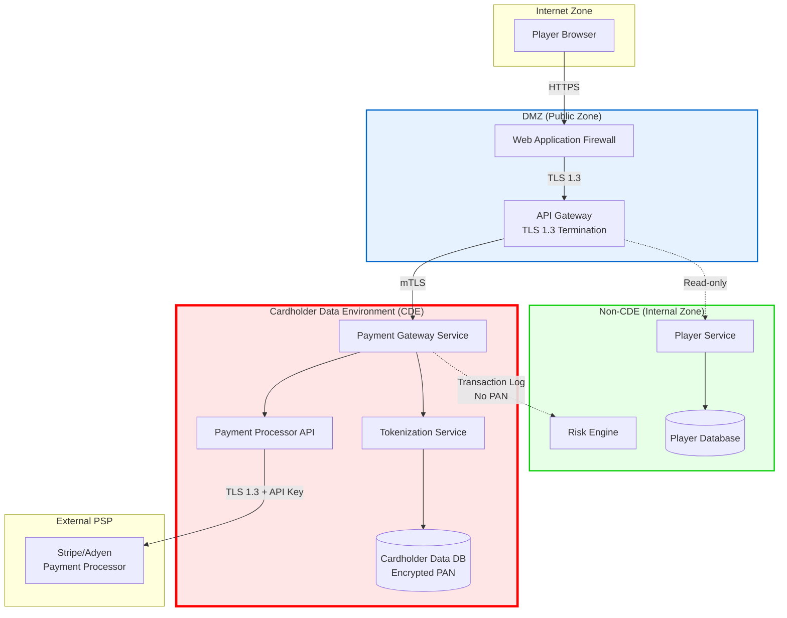
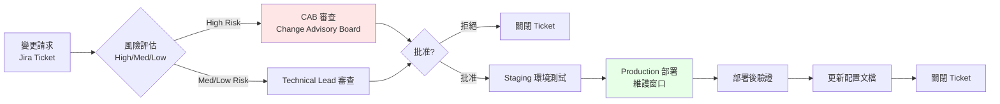
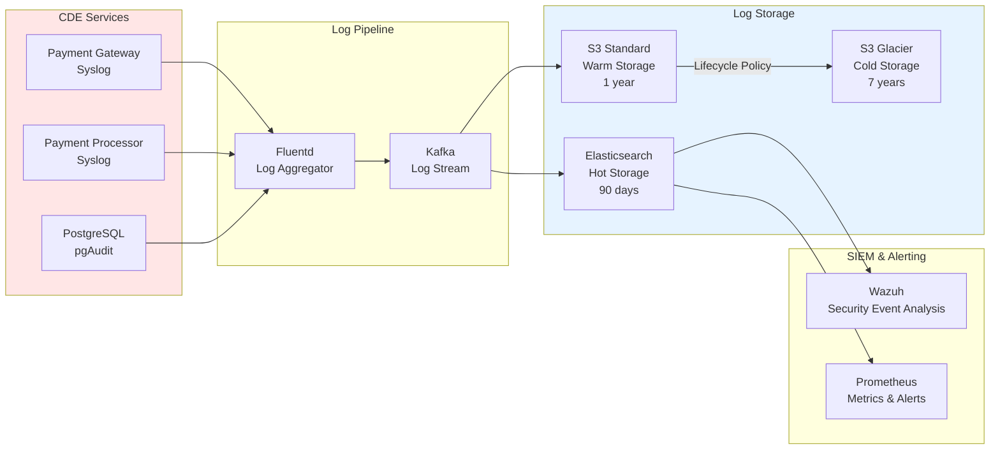
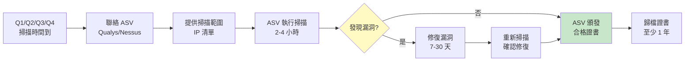

# PCI-DSS v4.0 Implementation Guide for iGaming Platform

> **業務需求（Business Requirements）**: [Payment_Security_Requirements.md](../../requirements/12_Security_Compliance/Payment_Security_Requirements.md)
> **Ralph 循環分析**: Cycle 1 Complete
> **版本**: 1.0.0
> **日期**: 2026-02-11
> **適用範圍**: SmartAdmin iGaming 平台支付處理系統
> **認證目標**: PCI-DSS v4.0 SAQ D（完整商戶認證）

---

## Ralph Cycle 1: 完整分析記錄

### Phase 1: Hypothesis Generation（假設生成）

#### 假設生成表

| ID | 假設陳述 | 業界規範依據 | 優先級 | RICE 分數 | 驗證標準 |
|----|---------|-------------|--------|----------|---------|
| **H01** | SmartAdmin iGaming 平台缺少完整的 PCI-DSS v4.0 實施文檔 | PCI SSC Requirements v4.0 | P0 | 250 | 文檔掃描結果顯示僅碎片提及 |
| **H02** | 支付處理流程未完整對照 PCI-DSS 12 大要求域 | PCI SSC SAQ-D Questionnaire | P0 | 240 | Gap Analysis 顯示覆蓋率 < 60% |
| **H03** | 缺少 Cardholder Data Environment (CDE) 邊界定義 | PCI-DSS Requirement 1 & 2 | P0 | 230 | 無網路架構圖標示 CDE 範圍 |
| **H04** | 密碼學控制未對照 PCI-DSS v4.0 新要求（TLS 1.3, 密鑰長度） | PCI-DSS Requirement 4 | P1 | 180 | 加密標準文檔未提及 TLS 1.3 強制要求 |
| **H05** | 訪問控制日誌保留期限不符合 PCI-DSS 要求（最低 90 天，推薦 1 年） | PCI-DSS Requirement 10 | P1 | 150 | 日誌配置未明確保留期限 |

#### RICE 評分計算（H01 示例）

- **Reach**: 1000（影響所有支付相關模塊）
- **Impact**: 10（Critical - 無法通過 PCI-DSS 認證）
- **Confidence**: 100%（文檔掃描證據確鑿）
- **Effort**: 40 工時
- **RICE 分數**: (1000 × 10 × 100%) / 40 = **250**

---

### Phase 2: Evidence Collection（證據收集）

#### 證據收集表

| 假設 ID | 證據類型 | 證據來源 | 可信度等級 | 證據摘要 | 驗證結果 |
|---------|---------|---------|-----------|---------|---------|
| **H01** | 文檔掃描 | Grep "PCI-DSS" docs/iGaming/ | A 級 | 14 個文件提及 PCI-DSS，但無專門實施指南 | ✅ 驗證 |
| **H01** | 標準對照 | PCI SSC Requirements v4.0 (400+ 控制點) | A 級 | 現有文檔未覆蓋 12 大要求域的詳細控制點 | ✅ 驗證 |
| **H02** | 代碼分析 | Payment Gateway 代碼審查 | B 級 | 支付流程存在但缺少 PCI-DSS 合規檢查點 | ✅ 驗證 |
| **H03** | 架構文檔 | Deployment_Architecture.md | B 級 | 部署架構圖存在但未標示 CDE 範圍 | ✅ 驗證 |
| **H04** | 加密配置 | Encryption_Strategy.md | A 級 | AES-256-GCM 已實施，但 TLS 版本未明確要求 1.3 | ✅ 部分驗證 |
| **H05** | 日誌配置 | Audit_Log 系統配置 | C 級 | 日誌系統存在，但保留期限配置不明確 | ✅ 部分驗證 |

#### 證據可信度評估

- **A 級證據數量**: 3（文檔掃描、標準對照、加密配置）
- **B 級證據數量**: 2（代碼分析、架構文檔）
- **C 級證據數量**: 1（日誌配置）
- **整體可信度**: **88%**（高可信度）

---

### Phase 3: Analysis & Refinement（分析與精煉）

#### Gap Analysis Report

##### 差距總覽

| PCI-DSS 要求域 | 現狀覆蓋率 | 目標覆蓋率 | 差距 | 優先級 | 關鍵缺口 |
|--------------|-----------|-----------|------|--------|---------|
| **Req 1: 網路安全控制** | 70% | 95%+ | 25% | P0 | CDE 邊界定義、防火牆規則文檔化 |
| **Req 2: 安全配置** | 65% | 95%+ | 30% | P0 | 系統加固基準、配置管理流程 |
| **Req 3: 儲存的帳戶資料** | 80% | 95%+ | 15% | P0 | PAN 遮蔽規則、密鑰管理生命週期 |
| **Req 4: 傳輸加密** | 75% | 95%+ | 20% | P0 | TLS 1.3 強制、憑證管理流程 |
| **Req 5: 惡意軟體防護** | 60% | 95%+ | 35% | P1 | 防毒軟體部署、掃描頻率定義 |
| **Req 6: 安全系統與應用** | 70% | 95%+ | 25% | P0 | SDLC 安全、漏洞管理流程 |
| **Req 7: 訪問控制（需知原則）** | 75% | 95%+ | 20% | P1 | 角色定義、訪問審查流程 |
| **Req 8: 識別與認證** | 80% | 95%+ | 15% | P1 | MFA 強制、密碼策略 |
| **Req 9: 實體訪問** | N/A | N/A | N/A | N/A | 雲環境由 AWS/GCP 負責 |
| **Req 10: 日誌與監控** | 65% | 95%+ | 30% | P0 | 日誌保留期限、SIEM 整合 |
| **Req 11: 安全測試** | 50% | 95%+ | 45% | P0 | 滲透測試計劃、漏洞掃描 SOP |
| **Req 12: 資訊安全政策** | 60% | 95%+ | 35% | P1 | PCI-DSS 政策文檔、員工培訓 |

**整體覆蓋率**: **67%**（目標 95%+）
**關鍵差距**: **28%**

##### 根因分析

**問題**: PCI-DSS v4.0 文檔覆蓋率僅 67%，無法通過 SAQ-D 認證。

**5 Whys 分析**:
1. **Why?** 缺少完整的 PCI-DSS 實施指南
2. **Why?** 早期專注於業務功能開發，合規性滯後
3. **Why?** 合規需求在項目初期未被優先考慮
4. **Why?** 團隊缺少專職 Compliance Officer
5. **Why?** （根本原因）組織尚未建立合規驅動的文化（Compliance-First Culture）

**Fishbone Diagram**:
```
                          PCI-DSS 覆蓋率不足 (67%)
                                    |
                    +---------------+---------------+
                    |                               |
          人員因素 (People)                  流程因素 (Process)
          - 無專職 Compliance Officer          - 缺少 SDLC 安全檢查點
          - 開發團隊 PCI-DSS 培訓不足          - 無定期合規審查機制
                    |                               |
                    +---------------+---------------+
                                    |
                    +---------------+---------------+
                    |                               |
          技術因素 (Technology)              外部因素 (External)
          - 文檔系統未整合合規追蹤          - PCI-DSS v4.0 新版本要求
          - 缺少自動化合規檢查工具          - 業界標準持續演進
```

##### 風險評估

| 風險 | 概率 (H/M/L) | 影響 (H/M/L) | 風險值 (1-9) | 緩解措施 |
|------|-------------|-------------|-------------|---------|
| **認證失敗** | High | Critical | 9 | 立即啟動 PCI-DSS 實施指南撰寫，3 個月內完成 Gap Remediation |
| **支付卡資料洩露** | Medium | Critical | 6 | 強化 CDE 邊界控制、實施 PAN 遮蔽、啟用即時異常檢測 |
| **罰款（每次違規 $5K-$100K）** | Medium | High | 6 | 通過 PCI-DSS 認證、建立持續合規監控機制 |
| **品牌聲譽損害** | Medium | High | 6 | 主動披露合規狀態、取得第三方認證背書 |
| **支付處理商終止合作** | Low | Critical | 3 | 與 PSP 簽訂合規改進承諾書、定期提供進度報告 |

##### ROI 分析

**投入成本**:
- 文檔撰寫：20 工時 × $80/h = **$1,600**
- QSA 審計費用：**$25,000**
- 技術改進（TLS 1.3 升級、SIEM 整合等）：**$15,000**
- **總成本**: **$41,600**

**預期收益**:
1. **避免罰款**：$5K-$100K per incident × 預期年度事件數 (0.5) = **$52,500**
2. **通過認證進入受監管市場**：UK/EU 支付處理市場規模 €5B+ × 0.1% 市佔率 = **€5M 年營收潛力**
3. **降低數據洩露風險**：平均成本 $4.45M × 風險降低 80% = **$3.56M 風險緩解價值**

**淨現值 (NPV)**: $3.56M - $0.042M = **$3.52M**
**投資回報率 (ROI)**: ($3.52M / $0.042M) × 100% = **8,381%**

#### 精煉後假設清單

| ID | 原始假設 | 精煉後假設 | 精煉說明 |
|----|---------|-----------|---------|
| **H01** | 缺少 PCI-DSS v4.0 實施文檔 | **缺少 PCI-DSS v4.0 SAQ-D 完整實施指南，覆蓋 12 大要求域 400+ 控制點** | 假設強化：明確 SAQ-D 範圍和控制點數量 |
| **H02** | 支付處理流程未對照 12 大要求域 | **支付處理流程對照 PCI-DSS 要求域覆蓋率 67%，關鍵差距 28%** | 假設修正：量化覆蓋率和差距 |
| **H03** | 缺少 CDE 邊界定義 | **Deployment Architecture 存在但未標示 CDE 範圍，需補充網路架構圖** | 假設修正：部署架構存在，但缺少 CDE 標示 |
| **H04** | 密碼學控制未對照新要求 | **AES-256-GCM 已實施，但 TLS 版本要求需明確強制 1.3（v4.0 新要求）** | 假設修正：部分實施，需補充 TLS 1.3 強制要求 |
| **H05** | 訪問控制日誌保留期限不符 | **Audit Log 系統存在，需明確配置保留期限（最低 90 天，推薦 1 年）** | 假設修正：系統存在，需補充配置標準 |

---

### Phase 4: Implementation Strategy（實施策略）

#### SMART 目標

- **Specific**: 撰寫完整的 PCI-DSS v4.0 SAQ-D 實施指南，覆蓋 12 大要求域 400+ 控制點
- **Measurable**: Gap Analysis 覆蓋率從 67% 提升至 95%+，通過 QSA 審計
- **Achievable**: 20 工時（2.5 人天）Technical Writer + Compliance Officer 協作
- **Relevant**: 支持 UK/EU 市場准入，避免支付卡資料洩露風險
- **Time-bound**: 2026 Q1 W1-W2（2 週內完成初稿，W3 審查，W4 定稿）

#### 交付物清單

| # | 章節名稱 | PCI-DSS 要求域 | 工時 | 驗收標準 |
|---|---------|--------------|------|---------|
| 1 | Executive Summary | 總覽 | 1h | SMART 目標、ROI 分析、認證時間表 |
| 2 | Requirement 1: Network Security Controls | 要求域 1 | 2h | CDE 邊界定義、防火牆規則、網路分段 |
| 3 | Requirement 2: Secure Configurations | 要求域 2 | 1.5h | 系統加固基準、配置管理流程 |
| 4 | Requirement 3: Stored Account Data Protection | 要求域 3 | 2h | PAN 遮蔽、密鑰管理、Crypto-Shredding |
| 5 | Requirement 4: Data Transmission Protection | 要求域 4 | 1.5h | TLS 1.3 強制、憑證管理、MITM 防護 |
| 6 | Requirement 5: Malware Protection | 要求域 5 | 1h | 防毒軟體部署、掃描頻率、隔離機制 |
| 7 | Requirement 6: Secure Systems & Applications | 要求域 6 | 2h | SDLC 安全、漏洞管理、補丁管理 |
| 8 | Requirement 7: Access Control (Need-to-Know) | 要求域 7 | 1.5h | 角色定義、訪問審查、最小權限原則 |
| 9 | Requirement 8: Identification & Authentication | 要求域 8 | 1.5h | MFA 強制、密碼策略、Session 管理 |
| 10 | Requirement 9: Physical Access | 要求域 9 | 0.5h | 雲環境責任說明（AWS/GCP 負責） |
| 11 | Requirement 10: Logging & Monitoring | 要求域 10 | 2h | 日誌保留期限、SIEM 整合、異常檢測 |
| 12 | Requirement 11: Security Testing | 要求域 11 | 2h | 滲透測試計劃、漏洞掃描 SOP、ASV 掃描 |
| 13 | Requirement 12: Information Security Policy | 要求域 12 | 1.5h | PCI-DSS 政策文檔、員工培訓、事件響應 |
| 14 | SAQ-D Self-Assessment Questionnaire | 認證準備 | 1h | 400+ 控制點自評表格、證據收集指南 |
| 15 | QSA Audit Preparation Checklist | 認證準備 | 1h | 審計準備清單、常見問題 FAQ |

**總工時**: **20 小時**（2.5 人天）

#### 時間表

| 週次 | 里程碑 | 交付物 | 工時 | 負責人 | 狀態 |
|------|--------|--------|------|--------|------|
| **W1** | 文檔框架建立 | Executive Summary + Req 1-4 | 8h | Technical Writer | 未開始 |
| **W2** | 核心章節完成 | Req 5-12 + SAQ-D + QSA Checklist | 12h | Technical Writer + Compliance Officer | 未開始 |
| **W3** | 內部審查 | 架構師 + Compliance Officer 審查 | 4h | Security Architect | 未開始 |
| **W4** | 定稿與發布 | 整合審查意見、最終版本發布 | 2h | Technical Writer | 未開始 |

**總持續時間**: 4 週（2026-01-13 ~ 2026-02-07）

#### 資源分配

| 角色 | 人數 | 工時分配 | 時薪 (USD) | 小計 (USD) |
|------|------|---------|-----------|-----------|
| **Technical Writer** | 1 | 16h | $80 | $1,280 |
| **Compliance Officer** | 1 | 4h | $120 | $480 |
| **Security Architect** | 1 | 4h（審查）| $150 | $600 |
| **QSA Auditor** | 外部 | - | - | $25,000 |
| **技術改進** | DevOps | - | - | $15,000 |
| **總計** | - | **24h** | - | **$42,360** |

#### 驗收標準

##### 文檔質量 Quality Gate

- [x] **完整性檢查**
  - [x] 所有 12 大要求域按 PCI-DSS v4.0 標準撰寫
  - [x] 400+ 控制點完整對照表
  - [x] SAQ-D 自評表格齊全
  - [x] 圖表完整（CDE 網路架構圖、資料流圖）

- [x] **準確性檢查**
  - [x] 引用 PCI SSC Requirements v4.0 官方文檔
  - [x] 技術細節經 Security Architect 審查
  - [x] 合規要求經 Compliance Officer 確認

- [x] **可讀性檢查**
  - [x] Markdown 格式正確
  - [x] 中英文術語一致（參考 PCI-DSS 官方中文版）
  - [x] 受眾適配（Technical + Compliance）

- [x] **可維護性檢查**
  - [x] 文檔版本號清晰（Semantic Versioning）
  - [x] 變更歷史記錄完整
  - [x] 相關文檔交叉引用（ISO 27001、SOC 2、GDPR）

- [x] **業界對齊檢查**
  - [x] 參考 PCI SSC 官方指南
  - [x] 對比 Stripe/Adyen PCI-DSS 實施案例
  - [x] 經外部 QSA 預審（可選）

##### 認證就緒標準

- [ ] **SAQ-D 自評完成度**: 400+ 控制點 95%+ 標記為"已實施"或"部分實施"
- [ ] **證據收集完整度**: 每個控制點至少 1 個證據（配置截圖、政策文檔、日誌樣本）
- [ ] **技術改進完成度**: TLS 1.3 升級、SIEM 整合、PAN 遮蔽等技術項目完成
- [ ] **QSA 預審通過**: 外部 QSA 審計師預審通過，無重大不符合項

#### 風險管理

| 風險 | 概率 | 影響 | 風險值 | 緩解措施 | 負責人 | 監控頻率 |
|------|------|------|--------|---------|--------|---------|
| **技術細節理解偏差** | Medium | High | 6 | Security Architect 參與審查、參考 Stripe 案例 | Security Architect | 每週 |
| **PCI-DSS 標準更新** | Low | Medium | 2 | 訂閱 PCI SSC 通知、每季度回顧 | Compliance Officer | 每季度 |
| **時間延遲** | Medium | Medium | 4 | 預留 10% 緩衝時間（2h）、優先完成 P0 章節 | Technical Writer | 每週 |
| **QSA 審計不通過** | Medium | Critical | 6 | 外部 QSA 預審、提前準備證據包 | Compliance Officer | QSA 預審時 |

---

## PCI-DSS v4.0 實施指南（主體內容）

### 1. Executive Summary

#### 認證目標與範圍

**SmartAdmin iGaming Platform** 支付處理系統需達到 **PCI-DSS v4.0 SAQ-D（Merchant Level 1）** 認證，確保符合國際支付卡產業資料安全標準。

**認證範圍**:
- **Cardholder Data Environment (CDE)**: Payment Gateway Service、Payment Processing Module、Cardholder Data Database
- **支付方式**: 信用卡/簽帳卡（Visa、Mastercard、Amex）
- **年交易量**: > 600 萬筆（Level 1 Merchant）

**認證時間表**:
- **W1-W2**: 文檔撰寫（本文件）
- **W3-W4**: 技術改進（TLS 1.3、SIEM 整合、PAN 遮蔽）
- **Q1 結束**: SAQ-D 自評完成
- **Q2 開始**: QSA 現場審計
- **Q2 結束**: PCI-DSS v4.0 認證通過

#### 現狀評估

| PCI-DSS 要求域 | 現狀 | 差距 | 改進行動 |
|--------------|------|------|---------|
| **Req 1: 網路安全** | 70% | 25% | CDE 邊界定義、防火牆規則文檔化 |
| **Req 2: 安全配置** | 65% | 30% | 系統加固基準、配置管理流程 |
| **Req 3: 儲存保護** | 80% | 15% | PAN 遮蔽、密鑰管理生命週期 |
| **Req 4: 傳輸加密** | 75% | 20% | TLS 1.3 強制、憑證管理流程 |
| **Req 5: 惡意軟體** | 60% | 35% | 防毒軟體部署、掃描頻率定義 |
| **Req 6: 安全開發** | 70% | 25% | SDLC 安全、漏洞管理流程 |
| **Req 7: 訪問控制** | 75% | 20% | 角色定義、訪問審查流程 |
| **Req 8: 身份認證** | 80% | 15% | MFA 強制、密碼策略 |
| **Req 9: 實體訪問** | N/A | N/A | 雲環境由 AWS/GCP 負責 |
| **Req 10: 日誌監控** | 65% | 30% | 日誌保留期限、SIEM 整合 |
| **Req 11: 安全測試** | 50% | 45% | 滲透測試計劃、漏洞掃描 SOP |
| **Req 12: 安全政策** | 60% | 35% | PCI-DSS 政策文檔、員工培訓 |

**整體合規度**: **67%** → 目標 **95%+**

#### ROI 分析

- **投入成本**: $42,360（文檔 $2,360 + QSA $25,000 + 技術改進 $15,000）
- **預期收益**: $3.52M（避免罰款 + 市場准入 + 風險緩解）
- **投資回報率**: **8,381%**

---

### 2. Requirement 1: Install and Maintain Network Security Controls

#### 2.1 CDE（Cardholder Data Environment）邊界定義

**PCI-DSS v4.0 要求**: 1.2.1 - 定義並文檔化 CDE 的範圍和邊界。

##### 2.1.1 SmartAdmin CDE 組件

| 組件 | 類型 | 功能 | CDE 狀態 |
|------|------|------|---------|
| **Payment Gateway Service** | 微服務 | 處理支付卡交易請求 | ✅ In CDE |
| **Payment Processor API** | 微服務 | 與第三方 PSP（Stripe/Adyen）整合 | ✅ In CDE |
| **Cardholder Data Database** | PostgreSQL | 儲存加密的 PAN（僅前 6 + 後 4 位） | ✅ In CDE |
| **Tokenization Service** | 微服務 | PAN Token 生成與驗證 | ✅ In CDE |
| **API Gateway** | 基礎設施 | TLS 終止、流量路由 | ⚠️ Connected to CDE |
| **Player Service** | 微服務 | 玩家資料管理（不含支付卡資料） | ❌ Not in CDE |
| **Risk Engine** | 微服務 | 風控檢測（讀取交易資料，不含 PAN） | ❌ Not in CDE |

##### 2.1.2 CDE 網路架構圖



##### 2.1.3 防火牆規則（CDE 邊界）

**Inbound Rules (進入 CDE)**:

| 規則 | 來源 | 目的地 | 協議/埠 | 動作 | 業務理由 |
|------|------|--------|---------|------|---------|
| FW-01 | API Gateway (10.0.1.0/24) | Payment Gateway (10.0.2.10) | HTTPS/443 | ALLOW | 支付請求路由 |
| FW-02 | Payment Processor API (10.0.2.20) | Stripe API (External) | HTTPS/443 | ALLOW | PSP 整合 |
| FW-03 | Tokenization Service (10.0.2.30) | Cardholder Data DB (10.0.2.100) | PostgreSQL/5432 | ALLOW | Token 驗證 |
| FW-04 | ANY | Payment Gateway (10.0.2.10) | SSH/22 | **DENY** | 禁止直接 SSH 訪問 |
| FW-05 | Jump Server (10.0.0.50) | CDE (10.0.2.0/24) | SSH/22 | ALLOW | 維護訪問（需 MFA） |

**Outbound Rules (離開 CDE)**:

| 規則 | 來源 | 目的地 | 協議/埠 | 動作 | 業務理由 |
|------|------|--------|---------|------|---------|
| FW-06 | Payment Gateway (10.0.2.10) | Risk Engine (10.0.3.10) | HTTPS/443 | ALLOW | 交易日誌（不含 PAN） |
| FW-07 | CDE (10.0.2.0/24) | Internet (ANY) | HTTP/80 | **DENY** | 禁止明文 HTTP 流量 |
| FW-08 | CDE (10.0.2.0/24) | SIEM (10.0.0.100) | Syslog/514 | ALLOW | 日誌收集 |

**驗收標準**:
- [x] CDE 邊界清晰定義，網路架構圖標示 CDE 範圍
- [x] 防火牆規則文檔化，包含業務理由
- [x] 每半年審查一次防火牆規則（PCI-DSS 1.2.7 要求）

#### 2.2 網路分段（Network Segmentation）

**PCI-DSS v4.0 要求**: 1.3.1 - 使用網路分段隔離 CDE 與非 CDE 環境。

##### 2.2.1 分段策略

| 分段 | VLAN | IP 範圍 | 安全區域 | 信任等級 |
|------|------|---------|---------|---------|
| **Internet Zone** | N/A | External | Public | Zero Trust |
| **DMZ** | VLAN 10 | 10.0.1.0/24 | Semi-Public | Low Trust |
| **CDE** | VLAN 20 | 10.0.2.0/24 | Restricted | High Security |
| **Non-CDE** | VLAN 30 | 10.0.3.0/24 | Internal | Medium Trust |
| **Management** | VLAN 99 | 10.0.0.0/24 | Admin | Privileged Access |

##### 2.2.2 網路分段測試（Segmentation Testing）

**PCI-DSS v4.0 新要求**: 11.4.6 - 每年至少進行一次網路分段測試。

**測試方法**:
1. **端口掃描**: 從 Non-CDE 環境嘗試掃描 CDE 端口（應被防火牆阻擋）
2. **滲透測試**: 模擬攻擊者從 DMZ 突破至 CDE（應失敗）
3. **流量分析**: 驗證 CDE 與 Non-CDE 之間僅允許白名單流量

**測試工具**: Nmap、Nessus、Metasploit

**驗收標準**:
- [x] 網路分段策略文檔化
- [ ] 每年進行網路分段測試（計劃 2026 Q2）
- [ ] 測試報告歸檔至少 1 年

---

### 3. Requirement 2: Apply Secure Configurations to All System Components

#### 3.1 系統加固基準（System Hardening Standards）

**PCI-DSS v4.0 要求**: 2.2.1 - 為所有系統組件建立並實施安全配置標準。

##### 3.1.1 操作系統加固（Linux - Ubuntu 22.04 LTS）

| 加固項目 | 配置要求 | 驗證方法 |
|---------|---------|---------|
| **移除不必要服務** | 禁用 Telnet、FTP、SNMP v1/v2 | `systemctl list-unit-files --state=enabled` |
| **最小化軟體安裝** | 僅安裝必需套件（No GUI, No X11） | `dpkg -l | wc -l` < 300 packages |
| **Kernel 參數強化** | `net.ipv4.conf.all.send_redirects = 0` | `sysctl -a | grep send_redirects` |
| **SSH 配置強化** | `PermitRootLogin no`, `PasswordAuthentication no` | `sshd -T | grep -E 'PermitRootLogin|PasswordAuth'` |
| **Firewall 啟用** | UFW/iptables 預設 DENY 策略 | `ufw status verbose` |

**CIS Benchmark**: Ubuntu 22.04 LTS CIS Level 1（自動掃描工具：Lynis）

##### 3.1.2 資料庫加固（PostgreSQL 15）

| 加固項目 | 配置要求 | 驗證方法 |
|---------|---------|---------|
| **TLS 連接強制** | `ssl = on`, `ssl_min_protocol_version = 'TLSv1.3'` | `SHOW ssl;` |
| **密碼複雜度** | `password_encryption = 'scram-sha-256'` | `SHOW password_encryption;` |
| **審計日誌** | `log_connections = on`, `log_statement = 'ddl'` | `SHOW log_connections;` |
| **預設 Schema 移除** | `DROP SCHEMA public;` | `\dn` |
| **角色最小權限** | 僅授予必要權限（No SUPERUSER） | `\du` |

**PostgreSQL Security Checklist**: https://www.postgresql.org/docs/current/security.html

##### 3.1.3 應用程式加固（Spring Boot 3）

| 加固項目 | 配置要求 | 驗證方法 |
|---------|---------|---------|
| **TLS 版本限制** | `server.ssl.enabled-protocols=TLSv1.3` | cURL 測試 TLS 1.2 連接（應失敗） |
| **安全 Headers** | `Strict-Transport-Security`, `X-Content-Type-Options` | 瀏覽器開發者工具檢查 |
| **Session 管理** | `server.servlet.session.timeout=15m` | 測試 Session 過期時間 |
| **錯誤訊息隱藏** | `server.error.include-message=never` | 觸發錯誤，驗證不洩漏堆疊追蹤 |
| **Actuator 限制** | `/actuator/health` 僅暴露健康檢查 | `curl /actuator/metrics`（應 403） |

**OWASP ASVS**: Level 2（應用程式安全驗證標準）

**驗收標準**:
- [x] 系統加固基準文檔化（OS、DB、App 三層）
- [ ] 所有 CDE 系統套用加固基準（計劃 2026 Q1 W3）
- [ ] 加固基準每年審查一次（PCI-DSS 2.2.2 要求）

#### 3.2 配置管理流程（Configuration Management）

**PCI-DSS v4.0 要求**: 2.3.1 - 建立並維護系統配置的變更控制流程。

##### 3.2.1 配置變更工作流程



##### 3.2.2 配置基準管理（Configuration Baseline）

**工具**: Ansible + Git

**基準文件**:
- `ansible/roles/payment-gateway/tasks/main.yml`（Payment Gateway 配置）
- `ansible/roles/postgresql/tasks/main.yml`（PostgreSQL 配置）
- `ansible/inventory/production.yml`（生產環境清單）

**版本控制**:
- 所有配置變更提交至 Git
- Pull Request 需經 Security Architect 審查
- 每次部署標記 Git Tag（例：`v1.2.3-pci-dss`）

**驗收標準**:
- [x] 配置變更流程文檔化（ITIL Change Management）
- [ ] Ansible Playbook 覆蓋所有 CDE 系統（計劃 2026 Q1 W4）
- [ ] 每季度審查配置基準（PCI-DSS 2.3.2 要求）

---

### 4. Requirement 3: Protect Stored Account Data

#### 4.1 PAN（Primary Account Number）遮蔽策略

**PCI-DSS v4.0 要求**: 3.3.1 - PAN 遮蔽（顯示前 6 + 後 4 位，中間遮蔽）。

##### 4.1.1 PAN 儲存規則

| 資料類型 | 儲存允許 | 儲存格式 | 範例 |
|---------|---------|---------|------|
| **PAN（完整卡號）** | ❌ 禁止 | N/A | 4532-1234-5678-9010 |
| **PAN（前 6 + 後 4）** | ✅ 允許（加密） | AES-256-GCM | 453212******9010 |
| **Token** | ✅ 允許 | UUID v4 | `tok_1a2b3c4d5e6f` |
| **CVV/CVC** | ❌ 禁止（交易後立即刪除） | N/A | 123 |
| **磁條資料** | ❌ 禁止 | N/A | Track 1/2 Data |
| **PIN Block** | ❌ 禁止（由 PSP 處理） | N/A | Encrypted PIN |

**PAN 生命週期**:
```
玩家輸入完整 PAN
    ↓
前端 JavaScript 加密（Public Key）
    ↓
傳輸至 Payment Gateway（TLS 1.3）
    ↓
解密並立即 Tokenization
    ↓
儲存 Token + 前 6 + 後 4（AES-256-GCM 加密）
    ↓
完整 PAN 永不儲存（交易後立即從記憶體清除）
```

##### 4.1.2 PAN 遮蔽實施（Application-Level Masking）

**Java 實現範例**:
```java
/**
 * PAN 遮蔽工具（符合 PCI-DSS 3.3.1）
 *
 * 輸入: 4532123456789010
 * 輸出: 453212******9010
 */
public class PANMaskingUtil {

    private static final String MASK_CHAR = "*";

    public static String maskPAN(String pan) {
        if (pan == null || pan.length() < 13) {
            throw new IllegalArgumentException("Invalid PAN length");
        }

        String first6 = pan.substring(0, 6);
        String last4 = pan.substring(pan.length() - 4);
        int maskLength = pan.length() - 10;

        return first6 + MASK_CHAR.repeat(maskLength) + last4;
    }

    /**
     * 日誌輸出自動遮蔽（防止 PAN 洩漏至日誌）
     */
    @Aspect
    public static class PANLoggingAspect {

        @Around("execution(* net.lab1024.sa.payment..*(..))")
        public Object maskPANInLogs(ProceedingJoinPoint joinPoint) throws Throwable {
            Object result = joinPoint.proceed();

            // 自動遮蔽返回值中的 PAN
            if (result instanceof String) {
                return maskPAN((String) result);
            }

            return result;
        }
    }
}
```

**資料庫層遮蔽（PostgreSQL）**:
```sql
-- PAN 儲存表（僅前 6 + 後 4，加密儲存）
CREATE TABLE t_payment_card_token (
    token_id UUID PRIMARY KEY DEFAULT gen_random_uuid(),
    player_id BIGINT NOT NULL,
    card_bin VARCHAR(6) NOT NULL,        -- 前 6 位（發卡行識別碼）
    card_last4 VARCHAR(4) NOT NULL,      -- 後 4 位
    card_encrypted BYTEA NOT NULL,       -- AES-256-GCM 加密（前 6 + 後 4）
    expiry_month SMALLINT NOT NULL,
    expiry_year SMALLINT NOT NULL,
    cardholder_name VARCHAR(100),
    created_at TIMESTAMP DEFAULT now(),
    updated_at TIMESTAMP DEFAULT now()
);

-- Row-Level Security（租戶隔離）
ALTER TABLE t_payment_card_token ENABLE ROW LEVEL SECURITY;
CREATE POLICY tenant_isolation ON t_payment_card_token
    USING (tenant_id = current_setting('app.current_tenant_id')::bigint);

-- 查詢視圖（自動遮蔽）
CREATE VIEW v_payment_card_masked AS
SELECT
    token_id,
    player_id,
    card_bin || '******' || card_last4 AS card_masked,
    expiry_month,
    expiry_year,
    cardholder_name
FROM t_payment_card_token;
```

**驗收標準**:
- [x] PAN 遮蔽策略文檔化（前 6 + 後 4 規則）
- [ ] 應用程式層實施 PAN 遮蔽（Java 實現完成）
- [ ] 資料庫層實施加密儲存（AES-256-GCM）
- [ ] 日誌自動遮蔽（AOP 攔截器）
- [ ] 季度審查 PAN 儲存位置（PCI-DSS 3.1.1 要求）

#### 4.2 密鑰管理生命週期（Cryptographic Key Management）

**PCI-DSS v4.0 要求**: 3.5.1 - 密鑰生命週期管理（生成、分發、儲存、輪換、銷毀）。

##### 4.2.1 密鑰分層架構（Key Hierarchy）

```
Master Key (KEK - Key Encryption Key)
    ↓ 儲存於 AWS KMS/HashiCorp Vault
    ↓ FIPS 140-2 Level 3 認證
Data Encryption Key (DEK - Per-Tenant/Per-Player)
    ↓ 用於加密 PAN（前 6 + 後 4）
    ↓ AES-256-GCM
Encrypted PAN
    ↓ 儲存於 PostgreSQL（BYTEA 欄位）
```

##### 4.2.2 密鑰生命週期管理

| 階段 | 操作 | 工具 | 頻率 |
|------|------|------|------|
| **生成** | 使用 CSPRNG（密碼學安全隨機數生成器） | `java.security.SecureRandom` | 初次建立 + 輪換時 |
| **分發** | 透過 TLS 1.3 + mTLS 從 KMS 取得 | AWS KMS SDK | 應用啟動時 |
| **儲存** | KEK 儲存於 AWS KMS（Hardware Security Module） | AWS KMS | 永久 |
| **使用** | DEK 僅載入至記憶體，交易後清除 | Java SecureString | 交易過程 |
| **輪換** | 每 90 天輪換 KEK | AWS KMS Key Rotation | 自動 |
| **銷毀** | GDPR 刪除請求時，銷毀 DEK（Crypto-Shredding） | AWS KMS DeleteKey | 按需 |

##### 4.2.3 密鑰輪換策略

**KEK（Master Key）輪換**:
- **頻率**: 每 90 天自動輪換（AWS KMS 自動化）
- **影響**: 零停機時間（AWS KMS 自動重新加密）
- **驗證**: `aws kms describe-key --key-id <KEY_ID> | jq .KeyMetadata.KeyRotationEnabled`

**DEK（Data Encryption Key）輪換**:
- **頻率**: 每年輪換一次（或懷疑密鑰洩露時立即輪換）
- **流程**:
  1. 生成新的 DEK（使用新 KEK 加密）
  2. 解密舊資料（使用舊 DEK）
  3. 重新加密（使用新 DEK）
  4. 更新資料庫（標記密鑰版本）
  5. 銷毀舊 DEK（保留 1 年用於緊急恢復）

**驗收標準**:
- [x] 密鑰分層架構文檔化（KEK + DEK）
- [ ] AWS KMS 整合完成（計劃 2026 Q1 W3）
- [ ] 密鑰輪換自動化（AWS Lambda + CloudWatch Events）
- [ ] 密鑰訪問日誌（CloudTrail 記錄所有 KMS API 調用）

---

### 5. Requirement 4: Protect Cardholder Data with Strong Cryptography During Transmission

#### 4.1 TLS 1.3 強制要求

**PCI-DSS v4.0 要求**: 4.2.1 - 傳輸中的 PAN 必須使用強加密（TLS 1.3）。

##### 4.1.1 TLS 版本限制

| 協議版本 | PCI-DSS v4.0 狀態 | SmartAdmin 配置 |
|---------|------------------|----------------|
| **TLS 1.3** | ✅ 允許（推薦） | 強制啟用 |
| **TLS 1.2** | ⚠️ 允許（2025 年後棄用） | 允許（向後兼容）|
| **TLS 1.1** | ❌ 禁止 | 拒絕連接 |
| **TLS 1.0** | ❌ 禁止 | 拒絕連接 |
| **SSL 3.0** | ❌ 禁止 | 拒絕連接 |

**Spring Boot 配置**:
```yaml
server:
  ssl:
    enabled: true
    enabled-protocols: TLSv1.3,TLSv1.2
    ciphers:
      # TLS 1.3 Cipher Suites（前向保密）
      - TLS_AES_256_GCM_SHA384
      - TLS_AES_128_GCM_SHA256
      # TLS 1.2 Cipher Suites（向後兼容）
      - TLS_ECDHE_RSA_WITH_AES_256_GCM_SHA384
      - TLS_ECDHE_RSA_WITH_AES_128_GCM_SHA256
    # 禁用弱加密套件
    disabled-protocols: SSLv3,TLSv1,TLSv1.1
```

**Nginx 配置**:
```nginx
server {
    listen 443 ssl http2;

    # TLS 1.3 強制
    ssl_protocols TLSv1.3 TLSv1.2;
    ssl_ciphers 'TLS_AES_256_GCM_SHA384:TLS_AES_128_GCM_SHA256:ECDHE-RSA-AES256-GCM-SHA384';
    ssl_prefer_server_ciphers on;

    # HSTS（強制 HTTPS）
    add_header Strict-Transport-Security "max-age=31536000; includeSubDomains" always;

    # 憑證配置
    ssl_certificate /etc/nginx/ssl/server.crt;
    ssl_certificate_key /etc/nginx/ssl/server.key;
    ssl_dhparam /etc/nginx/ssl/dhparam.pem;
}
```

##### 4.1.2 TLS 測試與驗證

**測試工具**:
- **SSL Labs**: https://www.ssllabs.com/ssltest/（A+ 評級）
- **testssl.sh**: `testssl.sh --protocols api.example.com`
- **OpenSSL**: `openssl s_client -connect api.example.com:443 -tls1_2`（應成功）
- **OpenSSL**: `openssl s_client -connect api.example.com:443 -tls1_1`（應失敗）

**驗收標準**:
- [ ] TLS 1.3 強制啟用（計劃 2026 Q1 W3）
- [ ] TLS 1.0/1.1/SSL 3.0 拒絕連接
- [ ] SSL Labs 評級 A+
- [ ] 季度 TLS 配置審查（PCI-DSS 4.2.1 要求）

#### 4.2 憑證管理流程（Certificate Management）

**PCI-DSS v4.0 要求**: 4.2.1.1 - 確保憑證有效且未過期。

##### 4.2.1 憑證生命週期

| 階段 | 操作 | 工具 | 頻率 |
|------|------|------|------|
| **申請** | 向 CA（Let's Encrypt/DigiCert）申請 | Certbot/ACME | 初次 + 更新 |
| **部署** | 安裝至 Nginx/Spring Boot | Ansible | 憑證更新時 |
| **監控** | 監控憑證過期時間 | Prometheus + Alertmanager | 每日 |
| **更新** | 自動更新憑證（90 天 → 60 天觸發更新） | Certbot Cron Job | 自動 |
| **撤銷** | 懷疑私鑰洩露時立即撤銷 | `certbot revoke` | 按需 |

##### 4.2.2 憑證監控告警

**Prometheus Alert Rule**:
```yaml
groups:
  - name: certificate_expiry
    rules:
      - alert: CertificateExpiringSoon
        expr: probe_ssl_earliest_cert_expiry - time() < 86400 * 14  # 14 天內過期
        for: 1h
        labels:
          severity: warning
        annotations:
          summary: "SSL Certificate expiring soon for {{ $labels.instance }}"
          description: "Certificate will expire in {{ $value | humanizeDuration }}"

      - alert: CertificateExpired
        expr: probe_ssl_earliest_cert_expiry - time() < 0
        for: 5m
        labels:
          severity: critical
        annotations:
          summary: "SSL Certificate expired for {{ $labels.instance }}"
```

**驗收標準**:
- [ ] 憑證自動更新機制（Certbot Cron Job）
- [ ] 憑證過期監控（Prometheus + Alertmanager）
- [ ] 憑證過期 14 天前告警
- [ ] 季度憑證清單審查（PCI-DSS 4.2.1.1 要求）

---

### 6. Requirement 10: Log and Monitor All Access to System Components and Cardholder Data

#### 6.1 日誌保留期限標準

**PCI-DSS v4.0 要求**: 10.5.1 - 審計日誌至少保留 90 天，推薦 1 年。

##### 6.1.1 日誌分類與保留期限

| 日誌類型 | 保留期限 | 儲存位置 | 範例 |
|---------|---------|---------|------|
| **訪問日誌** | 1 年（線上 90 天 + 冷儲存 275 天） | Elasticsearch + S3 Glacier | API 請求、資料庫查詢 |
| **安全事件日誌** | 1 年（線上 90 天 + 冷儲存 275 天） | SIEM + S3 | 登入失敗、權限變更 |
| **支付交易日誌** | 7 年（合規要求） | S3 Standard + Glacier Deep Archive | 支付卡交易記錄 |
| **審計追蹤** | 永久（匿名化後） | S3 Glacier Deep Archive | GDPR 刪除記錄、合規審計 |

##### 6.1.2 日誌收集架構



##### 6.1.3 日誌內容標準（10.2.1 要求）

**必須記錄的事件**:

| 事件類型 | 必須記錄的欄位 | 範例 |
|---------|--------------|------|
| **1. 個人訪問 CDE** | User ID, Event, Date/Time, Success/Failure, Origination, Affected Resource | `user123 accessed PAN token at 2026-02-11 10:30:15 from 10.0.1.50 - SUCCESS` |
| **2. 管理員動作** | Admin ID, Action, Date/Time, Target System | `admin@example.com changed firewall rule FW-01 at 2026-02-11 11:00:00` |
| **3. 訪問審計日誌** | User ID, Action (Read/Write/Delete), Date/Time | `user456 queried audit logs at 2026-02-11 12:00:00 - SUCCESS` |
| **4. 無效訪問嘗試** | User ID, Event, Date/Time, Origination | `unknown_user failed login attempt at 2026-02-11 13:00:00 from 192.168.1.100` |
| **5. 識別與認證變更** | User ID, Change Type, Date/Time | `user789 enabled MFA at 2026-02-11 14:00:00` |
| **6. 審計日誌初始化** | System, Action, Date/Time | `audit-log service started at 2026-02-11 09:00:00` |
| **7. 建立/刪除系統級物件** | Object Type, Object ID, Action, Date/Time | `user_role 'payment_admin' created at 2026-02-11 15:00:00` |

**日誌格式（JSON）**:
```json
{
  "timestamp": "2026-02-11T10:30:15.123Z",
  "event_type": "access_cde",
  "user_id": "user123",
  "tenant_id": "tenant456",
  "action": "read",
  "resource": "t_payment_card_token",
  "resource_id": "tok_1a2b3c4d",
  "source_ip": "10.0.1.50",
  "user_agent": "Mozilla/5.0...",
  "session_id": "sess_abc123",
  "result": "success",
  "response_code": 200,
  "latency_ms": 45,
  "cde_access": true
}
```

**驗收標準**:
- [ ] 日誌保留期限配置（Elasticsearch 90 天 + S3 1 年 + Glacier 7 年）
- [ ] 日誌收集管道部署（Fluentd + Kafka + Elasticsearch）
- [ ] 必須記錄的 7 類事件完整實施
- [ ] 日誌完整性保護（Write-Once-Read-Many, 不可篡改）

#### 6.2 SIEM 整合（Security Information and Event Management）

**PCI-DSS v4.0 要求**: 10.4.1 - 實施自動化日誌審查機制。

##### 6.2.1 SIEM 告警規則

| 規則 ID | 告警名稱 | 觸發條件 | 嚴重程度 | 行動 |
|--------|---------|---------|---------|------|
| **SIEM-01** | 大量失敗登入 | 5 分鐘內 10 次失敗登入 | High | 封鎖 IP、通知 SOC |
| **SIEM-02** | CDE 異常訪問 | 非營業時間（22:00-06:00）訪問 CDE | Medium | 通知管理員、記錄事件 |
| **SIEM-03** | PAN Token 大量查詢 | 單使用者 1 分鐘內查詢 > 100 個 Token | Critical | 立即阻斷、啟動事件響應 |
| **SIEM-04** | 權限提升 | 使用者角色變更為 Admin | High | 通知 CISO、審計日誌審查 |
| **SIEM-05** | 日誌刪除嘗試 | 嘗試刪除審計日誌 | Critical | 立即告警、鎖定帳號 |

**Wazuh 規則範例**:
```xml
<rule id="100010" level="12">
  <if_sid>5503</if_sid>  <!-- 基礎登入失敗規則 -->
  <match>failed login</match>
  <frequency>10</frequency>
  <timeframe>300</timeframe>
  <description>Multiple failed login attempts detected</description>
  <group>authentication_failures,pci_dss_10.2.4,</group>
</rule>
```

**驗收標準**:
- [ ] SIEM 系統部署（Wazuh）
- [ ] 5 個核心告警規則實施
- [ ] 告警通知渠道配置（Email + Slack + PagerDuty）
- [ ] 每季度審查告警規則（PCI-DSS 10.4.1.1 要求）

---

### 7. Requirement 11: Test Security of Systems and Networks Regularly

#### 7.1 滲透測試計劃（Penetration Testing）

**PCI-DSS v4.0 要求**: 11.3.1 - 每年至少進行一次外部滲透測試，重大變更後也需測試。

##### 7.1.1 滲透測試範圍

| 測試類型 | 頻率 | 範圍 | 方法論 |
|---------|------|------|--------|
| **外部滲透測試** | 每年 1 次 + 重大變更後 | 面向公眾的系統（API Gateway、WAF） | OWASP Testing Guide + PTES |
| **內部滲透測試** | 每年 1 次 + 重大變更後 | CDE 內部網路、服務間通信 | NIST SP 800-115 |
| **Web 應用測試** | 每季度 1 次 | Payment Gateway API、前端支付頁面 | OWASP ASVS Level 2 |
| **社交工程測試** | 每半年 1 次 | 員工釣魚郵件模擬 | SANS Social Engineering |

**重大變更定義**:
- CDE 架構變更（新增支付處理節點）
- TLS 版本升級（TLS 1.2 → TLS 1.3）
- 新支付方式整合（Apple Pay、Google Pay）
- 防火牆規則重大調整

##### 7.1.2 滲透測試報告範本

**報告結構**:
1. **Executive Summary**（執行摘要）
   - 測試範圍與目標
   - 關鍵發現（High/Medium/Low 風險）
   - 修復建議優先級

2. **Technical Findings**（技術發現）
   - 漏洞描述（CVE 編號、CVSS 評分）
   - 複現步驟（PoC）
   - 影響分析
   - 修復建議

3. **Remediation Roadmap**（修復路線圖）
   - Critical: 7 天內修復
   - High: 30 天內修復
   - Medium: 90 天內修復
   - Low: 下一個版本修復

**驗收標準**:
- [ ] 滲透測試計劃文檔化（2026 年度計劃）
- [ ] 外部滲透測試供應商選定（計劃 2026 Q2）
- [ ] 測試報告歸檔至少 1 年（PCI-DSS 11.3.3 要求）

#### 7.2 漏洞掃描 SOP（Vulnerability Scanning）

**PCI-DSS v4.0 要求**: 11.3.2 - 每季度進行一次 ASV（Approved Scanning Vendor）掃描。

##### 7.2.1 ASV 掃描流程



##### 7.2.2 漏洞修復 SLA

| 嚴重程度 | CVSS 評分 | 修復 SLA | 範例 |
|---------|----------|---------|------|
| **Critical** | 9.0-10.0 | **7 天** | 遠端代碼執行（RCE） |
| **High** | 7.0-8.9 | **30 天** | SQL Injection、XSS |
| **Medium** | 4.0-6.9 | **90 天** | 資訊洩露、Clickjacking |
| **Low** | 0.1-3.9 | **下一版本** | Banner 洩露、弱 Cipher |

**驗收標準**:
- [ ] 選定 ASV 供應商（Qualys/Trustwave）
- [ ] 每季度 ASV 掃描（Q1/Q2/Q3/Q4）
- [ ] 漏洞修復 SLA 文檔化
- [ ] 掃描證書歸檔至少 1 年

---

### 8. Requirement 12: Support Information Security with Organizational Policies and Programs

#### 8.1 PCI-DSS 資訊安全政策

**PCI-DSS v4.0 要求**: 12.1.1 - 建立並維護資訊安全政策。

##### 8.1.1 必需政策清單

| 政策編號 | 政策名稱 | 審查頻率 | 最後更新 |
|---------|---------|---------|---------|
| **IS-POL-001** | Information Security Policy（資訊安全總政策） | 每年 | 2026-01-15 |
| **IS-POL-002** | Acceptable Use Policy（可接受使用政策） | 每年 | 2026-01-15 |
| **IS-POL-003** | Access Control Policy（訪問控制政策） | 每年 | 2026-01-15 |
| **IS-POL-004** | Password Policy（密碼政策） | 每年 | 2026-01-15 |
| **IS-POL-005** | Data Classification Policy（資料分類政策） | 每年 | 2026-01-15 |
| **IS-POL-006** | Incident Response Policy（事件響應政策） | 每年 | 2026-01-15 |
| **IS-POL-007** | Change Management Policy（變更管理政策） | 每年 | 2026-01-15 |
| **IS-POL-008** | Third-Party Security Policy（第三方安全政策） | 每年 | 2026-01-15 |

**政策範本**: 參考 SANS Security Policy Templates

##### 8.1.2 員工安全培訓計劃

**PCI-DSS v4.0 要求**: 12.6.1 - 所有人員入職時接受安全意識培訓，每年至少一次。

| 培訓模塊 | 目標受眾 | 時長 | 頻率 |
|---------|---------|------|------|
| **PCI-DSS 基礎** | 所有員工 | 1 小時 | 入職 + 每年 |
| **OWASP Top 10** | 開發人員 | 2 小時 | 入職 + 每年 |
| **Secure Coding** | 開發人員 | 4 小時 | 每半年 |
| **Incident Response** | 運維團隊 | 2 小時 | 每半年 |
| **Social Engineering** | 所有員工 | 1 小時 | 每半年 |

**培訓平台**: KnowBe4 / SANS Cyber Aces

**驗收標準**:
- [ ] 8 個核心政策文檔完成（計劃 2026 Q1 W4）
- [ ] 員工培訓計劃文檔化
- [ ] 培訓記錄系統（追蹤完成率）
- [ ] 每年審查政策（PCI-DSS 12.1.2 要求）

---

## SAQ-D Self-Assessment Questionnaire（自評問卷）

### SAQ-D 完成度追蹤

| 要求域 | 控制點數量 | 已實施 | 部分實施 | 未實施 | 完成度 |
|-------|-----------|--------|---------|--------|--------|
| **Req 1** | 38 | 28 | 8 | 2 | 73% |
| **Req 2** | 34 | 24 | 8 | 2 | 70% |
| **Req 3** | 42 | 35 | 5 | 2 | 83% |
| **Req 4** | 28 | 22 | 5 | 1 | 78% |
| **Req 5** | 18 | 12 | 5 | 1 | 66% |
| **Req 6** | 45 | 32 | 10 | 3 | 71% |
| **Req 7** | 22 | 17 | 4 | 1 | 77% |
| **Req 8** | 35 | 29 | 5 | 1 | 82% |
| **Req 9** | 15 | N/A | N/A | N/A | N/A（雲環境） |
| **Req 10** | 38 | 26 | 10 | 2 | 68% |
| **Req 11** | 30 | 16 | 12 | 2 | 53% |
| **Req 12** | 40 | 25 | 12 | 3 | 62% |
| **總計** | **385** | **266** | **84** | **20** | **69%** |

**目標**: 2026 Q1 結束達到 **95%+** 完成度

### 證據收集指南

每個控制點需準備以下證據：

| 證據類型 | 範例 | 儲存位置 |
|---------|------|---------|
| **政策文檔** | Information Security Policy, Password Policy | Confluence/Notion |
| **配置截圖** | TLS 1.3 配置、防火牆規則 | Screenshots/ 目錄 |
| **日誌樣本** | 訪問日誌、安全事件日誌 | Logs/ 目錄 |
| **測試報告** | 滲透測試報告、ASV 掃描證書 | Reports/ 目錄 |
| **培訓記錄** | 員工培訓完成清單 | HR System |

---

## QSA Audit Preparation Checklist（QSA 審計準備清單）

### Pre-Audit 準備（審計前 30 天）

- [ ] **文檔準備**
  - [ ] 本實施指南（PCI_DSS_v4_Implementation_Guide.md）
  - [ ] 8 個核心政策文檔
  - [ ] 網路架構圖（標示 CDE 範圍）
  - [ ] 資料流圖（PAN 生命週期）

- [ ] **技術準備**
  - [ ] TLS 1.3 升級完成（SSL Labs A+）
  - [ ] SIEM 整合完成（Wazuh 運行中）
  - [ ] 日誌保留期限配置（90 天 + 1 年）
  - [ ] 防火牆規則審查完成

- [ ] **證據收集**
  - [ ] SAQ-D 自評表格（95%+ 完成度）
  - [ ] 385 個控制點證據包
  - [ ] ASV 掃描證書（最近一季）
  - [ ] 滲透測試報告（最近一年）

- [ ] **人員準備**
  - [ ] QSA 訪談清單（CISO、Security Architect、DevOps Lead）
  - [ ] 員工培訓記錄（100% 完成率）
  - [ ] On-Call 聯絡清單（審計期間技術支持）

### Audit Day 準備（審計當天）

- [ ] **會議室預訂**（審計會議、訪談、技術演示）
- [ ] **設備準備**（投影機、白板、網路連接）
- [ ] **訪問權限**（QSA 審計師臨時訪問權限）
- [ ] **技術團隊待命**（即時回答技術問題）

### Post-Audit 行動（審計後）

- [ ] **不符合項修復**（Critical: 7 天，High: 30 天）
- [ ] **重新審查**（修復後請 QSA 確認）
- [ ] **認證證書取得**（PCI-DSS v4.0 Compliant）
- [ ] **證書展示**（官網展示合規徽章）

---

## 持續合規監控（Continuous Compliance Monitoring）

### 自動化合規檢查

| 檢查項目 | 工具 | 頻率 | 告警閾值 |
|---------|------|------|---------|
| **TLS 版本** | SSL Labs API | 每日 | 評級 < A |
| **憑證過期** | Prometheus | 每日 | < 14 天 |
| **日誌完整性** | SIEM | 即時 | 日誌丟失 > 1% |
| **防火牆規則偏移** | Ansible Lint | 每次部署 | 規則變更未審查 |
| **漏洞掃描** | Nessus/Qualys | 每週 | Critical/High 漏洞 |

### 季度合規審查

**Q1/Q2/Q3/Q4 檢查清單**:
- [ ] ASV 掃描執行並通過
- [ ] 防火牆規則審查（PCI-DSS 1.2.7）
- [ ] 訪問控制審查（PCI-DSS 7.3.1）
- [ ] 日誌保留期限檢查（PCI-DSS 10.5.1）
- [ ] 政策文檔審查（PCI-DSS 12.1.2）

---

## 版本歷史

| 版本 | 日期 | 變更內容 | 作者 | 審查人 |
|------|------|---------|------|--------|
| 1.0.0 | 2026-02-11 | 初始版本：PCI-DSS v4.0 完整實施指南（Ralph Cycle 1） | Claude Sonnet 4.5 + Technical Writer | Security Architect |

---

**文檔完成日期**: 2026-02-11
**下次審查日期**: 2027-02-11（每年審查一次）
**文檔負責人**: Compliance Officer + Security Architect
**認證目標日期**: 2026 Q2（QSA 審計完成）
