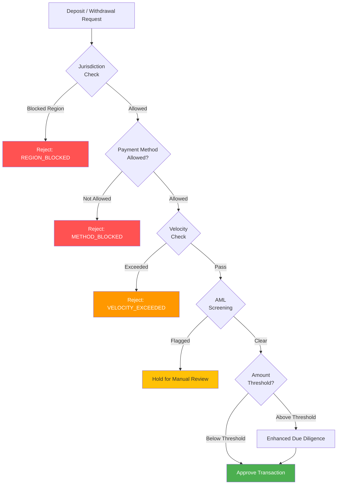

# 支付限制架構

> **業務需求**: [Payment Security Requirements](../../requirements/12_Security_Compliance/Payment_Security_Requirements.md)
> **規範來源**: [source-archive/12_System_Security/12-06](../../source-archive/12_System_Security/12-06_Payment_Restrictions.md)
> **文件類型**: 技術架構
> **目標讀者**: 架構師、後端開發人員、合規工程師

---

## 1. 各司法管轄區信用卡禁令

| 地區 | 生效日期 | 範圍 | 狀態 |
|--------|---------------|-------|--------|
| **英國** | 2020-04 | 所有博弈 | 完全禁止 |
| **澳洲** | 2026-04 | 線上博弈 | 即將實施 |
| **瑞典** | 2025+ | 線上品牌 | 擴大禁令 |
| **德國** | 2021 | 所有博弈 | 完全禁止 |

## 2. 支付限制服務

```java
@Service
@RequiredArgsConstructor
public class PaymentRestrictionService {

    private final JurisdictionRouterService jurisdictionService;

    /**
     * Validate payment method against jurisdiction rules
     */
    public PaymentValidationResult validatePaymentMethod(
            Long playerId,
            String paymentMethod) {

        JurisdictionConfig config = jurisdictionService.getPlayerJurisdiction(playerId);

        // Credit card check
        if (isCreditCard(paymentMethod) && !config.getCreditCardsAllowed()) {
            return PaymentValidationResult.blocked(
                "CREDIT_CARD_NOT_ALLOWED",
                "Credit cards are not allowed for deposits in your region"
            );
        }

        // Cryptocurrency check
        if (isCrypto(paymentMethod) && !config.getCryptoAllowed()) {
            return PaymentValidationResult.blocked(
                "CRYPTO_NOT_ALLOWED",
                "Cryptocurrency deposits are not allowed in your region"
            );
        }

        // Whitelist check
        if (!config.getAllowedPaymentMethods().isEmpty() &&
            !config.getAllowedPaymentMethods().contains(paymentMethod)) {
            return PaymentValidationResult.blocked(
                "PAYMENT_METHOD_NOT_ALLOWED",
                "This payment method is not supported"
            );
        }

        return PaymentValidationResult.allowed();
    }

    private boolean isCreditCard(String paymentMethod) {
        return Set.of(
            "CREDIT_CARD",
            "VISA_CREDIT",
            "MASTERCARD_CREDIT",
            "AMEX"
        ).contains(paymentMethod.toUpperCase());
    }

    private boolean isCrypto(String paymentMethod) {
        return Set.of(
            "BITCOIN",
            "ETHEREUM",
            "USDT",
            "CRYPTO"
        ).contains(paymentMethod.toUpperCase());
    }
}
```

## 3. 支付方式白名單

### 英國允許的支付方式

| 類型 | 允許 | 備註 |
|------|---------|-------|
| 簽帳卡 | 是 | Visa/Mastercard 簽帳卡 |
| 銀行轉帳 | 是 | 銀行轉帳 |
| 電子錢包 | 是 | PayPal、Skrill、Neteller |
| 預付卡 | 是 | Paysafecard |
| 信用卡 | **否** | **禁止** |

### 巴西必要的支付方式

| 類型 | 要求 | 備註 |
|------|------------|-------|
| **PIX** | **必要** | 巴西即時支付 |
| 銀行轉帳 | 建議 | 銀行轉帳 |
| Boleto | 建議 | 現金支付 |
| 信用卡 | 允許 | 目前允許 |

## 4. 加密貨幣反洗錢服務

```java
@Service
public class CryptoAMLService {

    /**
     * Cryptocurrency AML check
     */
    public CryptoAMLResult performAMLCheck(CryptoDepositRequest request) {
        // 1. Wallet address risk scoring
        WalletRiskScore walletScore = cryptoAnalysisClient.scoreWallet(
            request.getWalletAddress(),
            request.getCryptoType()
        );

        if (walletScore.getRiskLevel() == RiskLevel.HIGH) {
            return CryptoAMLResult.blocked("HIGH_RISK_WALLET");
        }

        // 2. Transaction tracing
        TransactionTrace trace = cryptoAnalysisClient.traceTransaction(
            request.getTxHash()
        );

        if (trace.hasBlacklistedAddress()) {
            return CryptoAMLResult.blocked("BLACKLISTED_ADDRESS");
        }

        // 3. Audit logging
        cryptoAMLLogDao.insert(CryptoAMLLog.of(request, walletScore, trace));

        return CryptoAMLResult.passed();
    }
}
```

## 5. 加密貨幣監管環境

| 地區 | 態度 | 備註 |
|--------|----------|-------|
| 英國 | 審慎 | 完整反洗錢 (AML) 要求 |
| 馬爾他 | 允許 | 需監管框架 |
| 庫拉索 | 允許 | 較寬鬆 |

## 6. 交易篩查流程



## 7. 速率檢查實作

```java
@Service
@RequiredArgsConstructor
public class VelocityCheckService {

    private final RedissonClient redissonClient;
    private final VelocityRuleDao velocityRuleDao;

    /**
     * Check deposit/withdrawal velocity against configurable thresholds.
     * Uses Redis sliding window counters per player per action.
     */
    public VelocityCheckResult checkVelocity(Long playerId, String action, BigDecimal amount) {
        List<VelocityRule> rules = velocityRuleDao.selectByAction(action);

        for (VelocityRule rule : rules) {
            String key = String.format("velocity:%s:%d:%s", action, playerId, rule.getWindow());
            RAtomicLong counter = redissonClient.getAtomicLong(key + ":count");
            RAtomicLong totalAmount = redissonClient.getAtomicLong(key + ":amount");

            // Check transaction count limit
            if (counter.get() >= rule.getMaxCount()) {
                return VelocityCheckResult.exceeded(
                    "MAX_COUNT_EXCEEDED",
                    String.format("Max %d transactions per %s", rule.getMaxCount(), rule.getWindow())
                );
            }

            // Check cumulative amount limit
            if (totalAmount.get() + amount.longValue() > rule.getMaxAmount().longValue()) {
                return VelocityCheckResult.exceeded(
                    "MAX_AMOUNT_EXCEEDED",
                    String.format("Max %s per %s", rule.getMaxAmount(), rule.getWindow())
                );
            }

            // Increment counters with TTL matching the window
            counter.incrementAndGet();
            counter.expire(Duration.ofSeconds(rule.getWindowSeconds()));
            totalAmount.addAndGet(amount.longValue());
            totalAmount.expire(Duration.ofSeconds(rule.getWindowSeconds()));
        }

        return VelocityCheckResult.passed();
    }
}
```

### 速率規則配置

| 時間窗口 | 最大次數 | 最大金額（USD） | 操作 | 備註 |
|--------|-----------|-----------------|--------|-------|
| 1 小時 | 5 | 2,000 | 存款 | 一般玩家 |
| 24 小時 | 15 | 10,000 | 存款 | 一般玩家 |
| 7 天 | 50 | 50,000 | 存款 | 一般玩家 |
| 1 小時 | 3 | 5,000 | 提款 | 一般玩家 |
| 24 小時 | 5 | 20,000 | 提款 | 一般玩家 |
| 1 小時 | 20 | 50,000 | 存款 | VIP 玩家 |
| 24 小時 | 50 | 200,000 | 存款 | VIP 玩家 |

## 8. 基於司法管轄區的支付規則

```sql
CREATE TABLE t_jurisdiction_payment_rule (
    id              BIGSERIAL PRIMARY KEY,
    jurisdiction    VARCHAR(10) NOT NULL,
    payment_method  VARCHAR(50) NOT NULL,
    allowed         BOOLEAN NOT NULL DEFAULT TRUE,
    min_amount      DECIMAL(18,2),
    max_amount      DECIMAL(18,2),
    requires_kyc    VARCHAR(20) DEFAULT 'BASIC',
    effective_from  TIMESTAMP NOT NULL,
    effective_to    TIMESTAMP,
    created_at      TIMESTAMP DEFAULT CURRENT_TIMESTAMP,
    updated_at      TIMESTAMP DEFAULT CURRENT_TIMESTAMP,
    UNIQUE(jurisdiction, payment_method, effective_from)
);

-- UK: Block credit cards, allow debit
INSERT INTO t_jurisdiction_payment_rule (jurisdiction, payment_method, allowed, effective_from)
VALUES ('UK', 'CREDIT_CARD', FALSE, '2020-04-14');
INSERT INTO t_jurisdiction_payment_rule (jurisdiction, payment_method, allowed, min_amount, max_amount, effective_from)
VALUES ('UK', 'DEBIT_CARD', TRUE, 5.00, 10000.00, '2020-04-14');

-- Brazil: PIX mandatory, low minimum
INSERT INTO t_jurisdiction_payment_rule (jurisdiction, payment_method, allowed, min_amount, max_amount, effective_from)
VALUES ('BR', 'PIX', TRUE, 1.00, 50000.00, '2024-01-01');
```

---

<!-- End of Document -->
