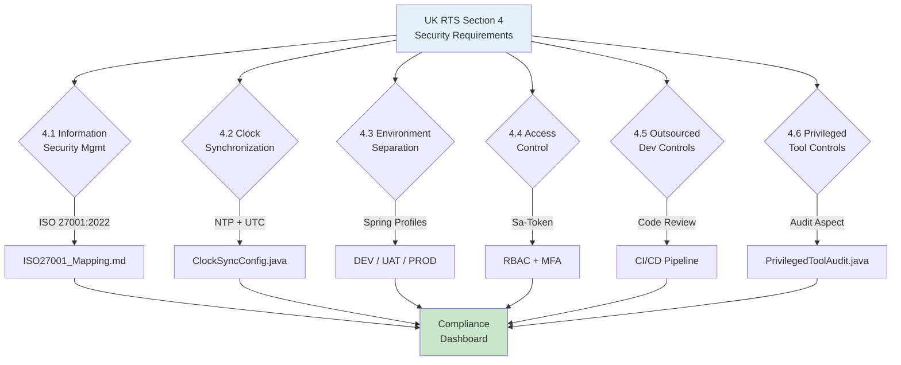

# UK RTS Security Architecture

> **Business Requirements**: [Compliance Standards Requirements](../../requirements/12_Security_Compliance/Compliance_Standards_Requirements.md)
> **Canonical Source**: [source-archive/12_System_Security/12-05](../../source-archive/12_System_Security/12-05_UK_RTS_Security.md)
> **View Type**: Technical Architecture
> **Target Audience**: Architects, Security Engineers, Compliance Officers

---

## RTS Compliance Verification Flow



---

## 1. RTS 4 Security Requirements Mapping

### RTS 4.1 - Information Security Management

| Requirement | Description | Implementation | Status |
|-------------|-------------|---------------|--------|
| 4.1.1 | ISO 27001 Compliance | [ISO 27001:2022 Mapping](./ISO27001_Mapping.md) | Implemented |
| 4.1.2 | Risk Assessment | Regular risk assessments | Implemented |
| 4.1.3 | Security Policy | CLAUDE.md security guidelines | Implemented |

### RTS 4.2 - Clock Synchronization

```java
@Configuration
public class ClockSyncConfig {

    /**
     * Configure NTP time synchronization
     * RTS requirement: All game records must use synchronized timestamps
     */
    @Bean
    public Clock synchronizedClock() {
        return Clock.systemUTC();
    }
}
```

**Configuration Requirements**:
- NTP server synchronization
- Maximum time drift < 1 second
- All logs use UTC

**Clock Synchronization Verification**:

```java
@Component
@Slf4j
@RequiredArgsConstructor
public class ClockSyncVerifier {

    private final Clock synchronizedClock;

    /**
     * Verify NTP time drift is within RTS tolerance (< 1 second)
     * Scheduled to run every 5 minutes
     */
    @Scheduled(fixedRate = 300_000)
    public void verifyClockSync() {
        Instant systemTime = Instant.now();
        Instant ntpTime = synchronizedClock.instant();
        long driftMs = Math.abs(
            Duration.between(systemTime, ntpTime).toMillis()
        );

        if (driftMs > 1000) {
            log.error("RTS 4.2 VIOLATION: Clock drift {}ms exceeds 1s threshold",
                driftMs);
            // Trigger alert to operations team
            alertService.sendCritical("CLOCK_DRIFT_EXCEEDED", driftMs);
        } else {
            log.debug("Clock sync OK: drift={}ms", driftMs);
        }
    }
}
```

### RTS 4.3 - Environment Separation

| Environment | Purpose | Isolation |
|-------------|---------|-----------|
| Development (DEV) | Development testing | Fully isolated |
| Testing (UAT) | Acceptance testing | Isolated from production |
| Production (PROD) | Live operations | Strictest controls |

```yaml
spring:
  profiles:
    active: ${ENVIRONMENT:dev}

---
spring:
  config:
    activate:
      on-profile: prod
  datasource:
    url: ${PROD_DB_URL}
```

### RTS 4.4 - Access Control

| Requirement | Implementation | SmartAdmin Component |
|-------------|---------------|---------------------|
| Authentication | Sa-Token | `@SaCheckLogin` |
| Multi-Factor Authentication | TOTP/WebAuthn | MFA module |
| Role-Based Permissions | RBAC | `@SaCheckPermission` |
| Audit Logging | Complete operation records | Audit Log system |

**Sa-Token Access Control Integration**:

```java
/**
 * RTS 4.4 compliant access control
 * All iGaming admin endpoints require permission + MFA verification
 */
@RestController
@RequestMapping("/api/igaming/admin")
@RequiredArgsConstructor
public class IgamingAdminController {

    private final PlayerManageService playerManageService;

    @SaCheckPermission("igaming:player:freeze")
    @PostMapping("/player/freeze")
    public ResponseDTO<Void> freezePlayer(@RequestBody @Valid PlayerFreezeForm form) {
        // Sa-Token automatically verifies:
        // 1. Valid session (authentication)
        // 2. Permission check (authorization)
        // 3. Audit log via AOP interceptor
        return playerManageService.freezePlayer(form);
    }

    @NoNeedLogin
    @GetMapping("/health")
    public ResponseDTO<String> health() {
        return ResponseDTO.ok("OK");
    }
}
```

**MFA Enforcement for High-Risk Operations**:

| Operation Category | MFA Required | Token Lifetime |
|-------------------|-------------|----------------|
| Player account freeze | Yes | Single-use |
| Balance adjustment | Yes | Single-use |
| Configuration changes | Yes | 5 minutes |
| Read-only queries | No | Session-based |

### RTS 4.5 - Outsourced Development Controls

- Security requirements in contracts
- Code review
- Vulnerability scanning
- Security testing acceptance

### RTS 4.6 - Privileged Tool Controls

```java
@Aspect
@Component
@Slf4j
public class PrivilegedToolAudit {

    @Before("@annotation(AdminOnly)")
    public void auditAdminAction(JoinPoint joinPoint) {
        Long adminId = StpUtil.getLoginIdAsLong();
        String action = joinPoint.getSignature().toShortString();
        String params = Arrays.toString(joinPoint.getArgs());

        log.info("ADMIN_ACTION: adminId={}, action={}, params={}",
            adminId, action, params);

        auditLogService.logAdminAction(adminId, action, params);
    }
}
```

## 2. Communication Security

### TLS Requirements

| Requirement | Configuration | RTS Reference |
|-------------|--------------|---------------|
| Minimum Version | TLS 1.2 (recommended 1.3) | RTS 4.1 |
| Cipher Suites | Strong encryption only | RTS 4.1 |
| Certificate | Valid CA-issued | RTS 4.1 |
| Certificate Pinning | Required for mobile apps | Best Practice |

**Spring Boot TLS Configuration**:

```yaml
server:
  ssl:
    enabled: true
    protocol: TLS
    enabled-protocols: TLSv1.3,TLSv1.2
    ciphers: TLS_AES_256_GCM_SHA384,TLS_AES_128_GCM_SHA256
    key-store: classpath:keystore.p12
    key-store-type: PKCS12
    key-store-password: ${SSL_KEYSTORE_PASSWORD}
```

**Java SSLContext Configuration (for inter-service mTLS)**:

```java
@Configuration
public class MtlsConfig {

    /**
     * Configure mutual TLS for platform-to-platform communication
     * RTS requirement: Secure inter-service communication
     */
    @Bean
    public SSLContext sslContext(
        @Value("${mtls.keystore-path}") String keystorePath,
        @Value("${mtls.keystore-password}") String keystorePassword,
        @Value("${mtls.truststore-path}") String truststorePath,
        @Value("${mtls.truststore-password}") String truststorePassword
    ) throws Exception {
        KeyStore keyStore = KeyStore.getInstance("PKCS12");
        keyStore.load(
            new FileInputStream(keystorePath),
            keystorePassword.toCharArray()
        );

        KeyStore trustStore = KeyStore.getInstance("PKCS12");
        trustStore.load(
            new FileInputStream(truststorePath),
            truststorePassword.toCharArray()
        );

        KeyManagerFactory kmf = KeyManagerFactory.getInstance(
            KeyManagerFactory.getDefaultAlgorithm()
        );
        kmf.init(keyStore, keystorePassword.toCharArray());

        TrustManagerFactory tmf = TrustManagerFactory.getInstance(
            TrustManagerFactory.getDefaultAlgorithm()
        );
        tmf.init(trustStore);

        SSLContext sslContext = SSLContext.getInstance("TLSv1.3");
        sslContext.init(kmf.getKeyManagers(), tmf.getTrustManagers(), null);
        return sslContext;
    }
}
```

**Prohibited Cipher Suites** (must be explicitly disabled):

| Category | Cipher Suite | Reason |
|----------|-------------|--------|
| NULL | TLS_NULL_* | No encryption |
| Export | TLS_RSA_EXPORT_* | Weak key length |
| RC4 | TLS_RSA_WITH_RC4_* | Known vulnerabilities |
| DES/3DES | TLS_RSA_WITH_DES_* | Insufficient strength |

---

## 3. Penetration Testing Requirements

### RTS Penetration Testing Schedule

| Test Type | Frequency | Scope | Performed By |
|-----------|-----------|-------|-------------|
| External penetration test | Annually | All public-facing APIs | Accredited third party |
| Internal penetration test | Annually | Internal services | Accredited third party |
| Vulnerability scan | Monthly | Full infrastructure | Automated + manual review |
| Code security review | Per release | Changed components | Internal + SAST tools |

### Testing Scope

| Component | Test Method | Expected Outcome |
|-----------|------------|-----------------|
| API Gateway | OWASP ZAP, Burp Suite | No critical/high findings |
| Authentication | Credential stuffing simulation | Rate limiting effective |
| Wallet API | Transaction tampering | Integrity checks pass |
| Admin portal | Privilege escalation | RBAC enforced |
| Game provider integration | Man-in-the-middle | mTLS prevents interception |

### Remediation SLA

| Severity | Definition | Remediation Deadline |
|----------|-----------|---------------------|
| Critical | Remote code execution, data breach | 24 hours |
| High | Authentication bypass, privilege escalation | 7 days |
| Medium | Information disclosure, XSS | 30 days |
| Low | Best practice deviations | Next release |

---

## Related Documents

- [ISO 27001:2022 Mapping](./ISO27001_Mapping.md) - ISO control mapping
- [Data Security Standard](./Data_Security_Standard.md) - Data protection
- [Encryption Strategy](./Encryption_Strategy.md) - Cryptographic controls
