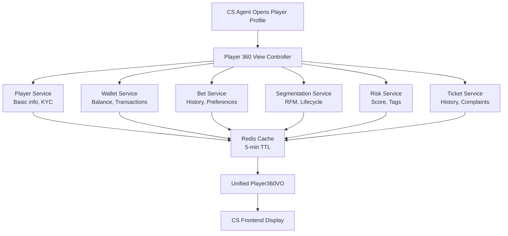
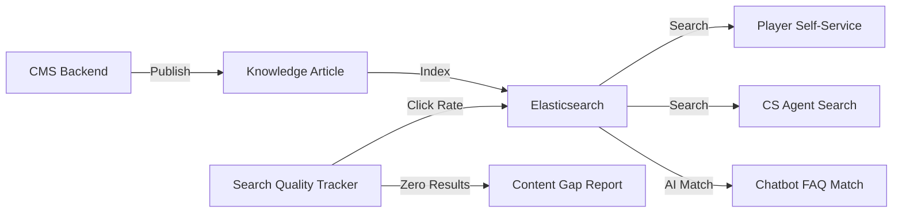
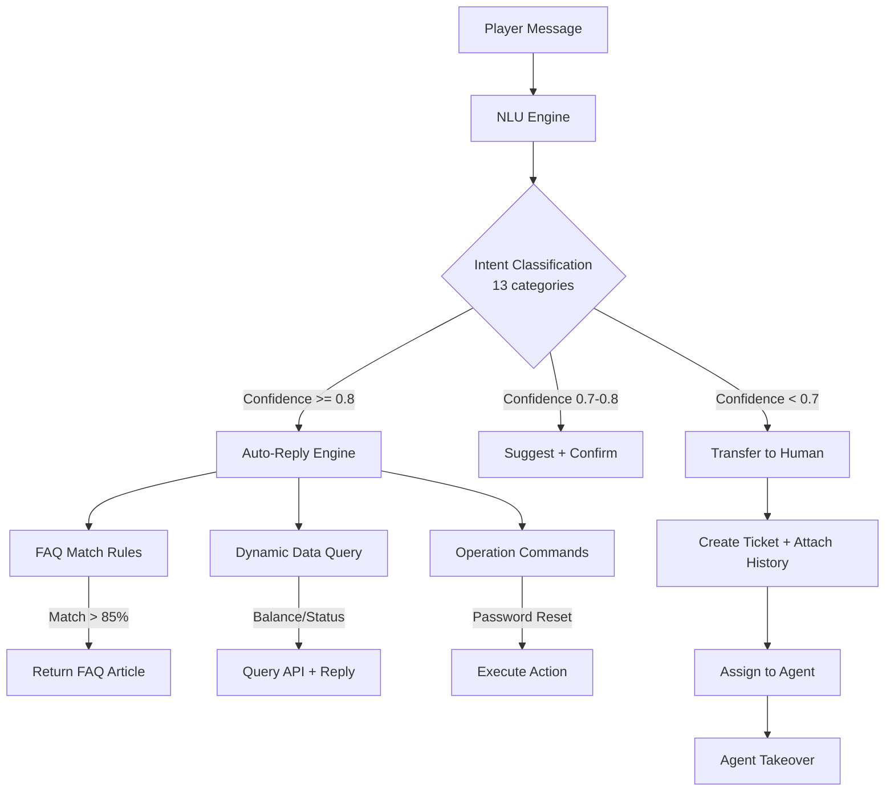
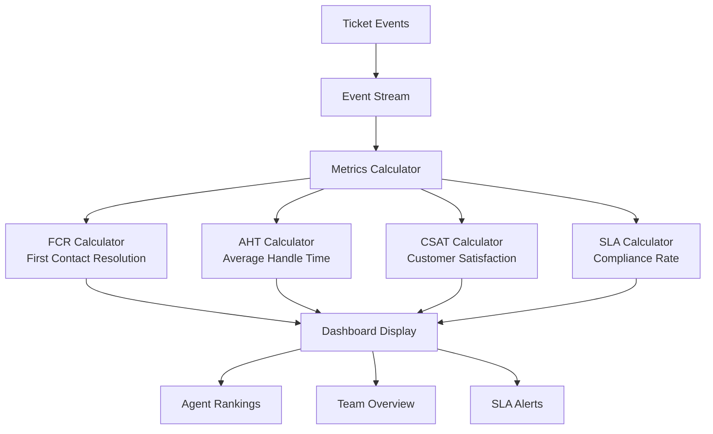

# 客服平台技術架構

> **業務需求**: [CS_Platform_Requirements.md](../../requirements/13_Customer_Service/01_CS_Platform_Requirements.md)
> **規範來源**: [13-01_CS_Platform_Design.md](../../source-archive/13_Customer_Service/13-01_CS_Platform_Design.md)
> **文件類型**: 技術架構
> **目標讀者**: 架構師、後端開發人員

---

## 1. SmartAdmin 架構對應

### 1.1 Entity 層

```java
@Entity
@Table(name = "t_customer_service_ticket")
@Data
public class TicketEntity extends BaseEntity {
    @Id
    @GeneratedValue(strategy = GenerationType.IDENTITY)
    private Long ticketId;

    private Long playerId;

    @Enumerated(EnumType.STRING)
    private TicketType type; // DEPOSIT_ISSUE, WITHDRAWAL_QUERY, etc.

    @Enumerated(EnumType.STRING)
    private TicketPriority priority; // URGENT, HIGH, MEDIUM, LOW

    @Enumerated(EnumType.STRING)
    private TicketStatus status; // NEW, ASSIGNED, IN_PROGRESS, RESOLVED, CLOSED

    private Long assignedAgentId;

    private String subject;

    private String description;

    private LocalDateTime firstResponseTime;

    private LocalDateTime resolvedTime;

    private Boolean deleted;
}
```

### 1.2 Manager 層（交易管理）

```java
@Manager
@RequiredArgsConstructor
public class TicketAssignmentManager {
    private final TicketDao ticketDao;
    private final AgentDao agentDao;
    private final RedissonClient redissonClient;

    /**
     * Assign ticket to best available agent using distributed lock
     * to prevent concurrent assignment
     */
    @Transactional(rollbackFor = Throwable.class)
    public Long assignTicketToAgent(Long ticketId, Long playerId) {
        // Lock to prevent concurrent assignment
        RLock lock = redissonClient.getLock("ticket:assign:" + ticketId);
        try {
            lock.lock(10, TimeUnit.SECONDS);

            // Find best agent using weighted round-robin
            AgentEntity agent = findBestAvailableAgent(playerId);
            if (agent == null) {
                throw new BusinessException("No available agents");
            }

            // Assign ticket
            TicketEntity ticket = ticketDao.selectById(ticketId);
            ticket.setAssignedAgentId(agent.getAgentId());
            ticket.setStatus(TicketStatus.ASSIGNED);
            ticketDao.updateById(ticket);

            return agent.getAgentId();
        } finally {
            lock.unlock();
        }
    }

    /**
     * Weighted round-robin agent selection algorithm
     *
     * Weight = (Agent Level Weight) x (Language Match Score) x (Current Ticket Load Inverse)
     */
    private AgentEntity findBestAvailableAgent(Long playerId) {
        List<AgentEntity> availableAgents = agentDao.findAvailableAgents();
        PlayerEntity player = playerDao.selectById(playerId);

        return availableAgents.stream()
            .map(agent -> {
                double levelWeight = getAgentLevelWeight(agent.getLevel());
                double languageScore = getLanguageMatchScore(agent, player.getLanguage());
                double loadInverse = 1.0 / (agent.getCurrentTicketCount() + 1);
                double totalWeight = levelWeight * languageScore * loadInverse;
                return Map.entry(agent, totalWeight);
            })
            .max(Map.Entry.comparingByValue())
            .map(Map.Entry::getKey)
            .orElse(null);
    }

    private double getAgentLevelWeight(AgentLevel level) {
        return switch (level) {
            case SENIOR -> 1.5;
            case REGULAR -> 1.0;
            case JUNIOR -> 0.7;
        };
    }

    private double getLanguageMatchScore(AgentEntity agent, String playerLanguage) {
        if (agent.getNativeLanguage().equals(playerLanguage)) return 1.0;
        if (agent.getFluentLanguages().contains(playerLanguage)) return 0.8;
        if (agent.getBasicLanguages().contains(playerLanguage)) return 0.5;
        return 0.3;
    }
}
```

### 1.3 Service 層（Vavr Option）

```java
@Service
@RequiredArgsConstructor
public class TicketService {
    private final TicketDao ticketDao;
    private final TicketAssignmentManager ticketAssignmentManager;

    /**
     * Create a new ticket with auto-assignment
     * Uses Vavr Option for safe null handling
     */
    public Option<TicketVO> createTicket(TicketCreateForm form) {
        return Try.of(() -> {
            // Validate form
            if (form.getPlayerId() == null || form.getSubject() == null) {
                throw new BusinessException("Invalid ticket form");
            }

            // Create ticket entity
            TicketEntity ticket = new TicketEntity();
            ticket.setPlayerId(form.getPlayerId());
            ticket.setType(form.getType());
            ticket.setPriority(calculatePriority(form));
            ticket.setStatus(TicketStatus.NEW);
            ticket.setSubject(form.getSubject());
            ticket.setDescription(form.getDescription());

            ticketDao.insert(ticket);

            // Auto-assign to agent
            ticketAssignmentManager.assignTicketToAgent(
                ticket.getTicketId(), form.getPlayerId());

            return SmartBeanUtil.copy(ticket, TicketVO.class);
        }).toOption();
    }

    /**
     * Calculate priority based on ticket type and player VIP level
     */
    private TicketPriority calculatePriority(TicketCreateForm form) {
        // VIP Diamond with deposit issue -> URGENT
        if (form.getVipLevel() == VipLevel.DIAMOND &&
            form.getType() == TicketType.DEPOSIT_ISSUE) {
            return TicketPriority.URGENT;
        }

        return switch (form.getType()) {
            case DEPOSIT_ISSUE, WITHDRAWAL_DELAY -> TicketPriority.URGENT;
            case BET_DISPUTE, LOGIN_ISSUE -> TicketPriority.HIGH;
            case GAME_LAG, BONUS_NOT_CREDITED -> TicketPriority.MEDIUM;
            case WAGERING_QUERY -> TicketPriority.LOW;
            default -> TicketPriority.MEDIUM;
        };
    }
}
```

---

## 2. 玩家 360 度視圖資料整合

### 2.1 資料來源架構



### 2.2 回應時間最佳化

- **Redis 快取**：玩家資料 5 分鐘 TTL
- **非同步載入**：非關鍵資料（投注紀錄、工單紀錄）採非同步載入
- **GraphQL**：按需查詢避免過度擷取

---

## 3. 知識庫搜尋架構

### 3.1 Elasticsearch 整合



### 3.2 搜尋配置

```
Elasticsearch Index: knowledge_base
- 全文搜尋（同義詞支援、模糊比對）
- 自動完成建議
- 搜尋結果高亮
- 點擊率追蹤（排序最佳化）
```

**品質指標**：
- 搜尋成功率（找到答案 + 關閉工單）：> 70%
- 平均搜尋時間：< 5 秒
- 零結果搜尋率：< 5%

---

## 4. AI 聊天機器人架構

### 4.1 NLU 管線



### 4.2 自動轉接條件

```java
public boolean shouldTransferToHuman(ChatContext context) {
    // 1. Low confidence
    if (context.getIntentConfidence() < 0.7) return true;

    // 2. Explicit request
    if (containsHumanRequest(context.getMessage())) return true;

    // 3. Sensitive issue
    if (isSensitiveIntent(context.getIntent())) return true;

    // 4. Failed auto-replies
    if (context.getConsecutiveAutoReplyCount() >= 3) return true;

    // 5. VIP Diamond
    if (context.getPlayerVipLevel() == VipLevel.DIAMOND) return true;

    return false;
}
```

### 4.3 訓練資料管線

```
歷史工單 (100K+) -> 客服標註 -> 每週模型重訓練 -> 部署
                                    |
                            FAQ 點擊率 -> 排序最佳化
```

---

## 5. SLA 監控架構

### 5.1 SLA 計時服務

```java
@Service
@RequiredArgsConstructor
@Slf4j
public class SlaMonitorService {

    private final TicketDao ticketDao;
    private final SlaConfigDao slaConfigDao;
    private final NotificationService notificationService;

    /**
     * Scheduled task: check SLA compliance every 5 minutes
     */
    @Scheduled(fixedRate = 300000)
    public void checkSlaCompliance() {
        List<TicketEntity> openTickets = ticketDao.findOpenTickets();

        for (TicketEntity ticket : openTickets) {
            SlaConfig sla = slaConfigDao.findByPriorityAndVipLevel(
                ticket.getPriority(), ticket.getPlayerVipLevel());

            Duration elapsed = Duration.between(ticket.getCreatedAt(), LocalDateTime.now());
            Duration slaLimit = Duration.ofMinutes(sla.getFirstResponseMinutes());

            double percentageUsed = (double) elapsed.toMinutes() / sla.getFirstResponseMinutes() * 100;

            if (percentageUsed >= 100) {
                // SLA breached
                escalateTicket(ticket, EscalationLevel.LEVEL_2);
                notificationService.sendSlaBreachAlert(ticket);
            } else if (percentageUsed >= 75) {
                // SLA warning
                notificationService.sendSlaWarning(ticket, EscalationLevel.LEVEL_1);
            } else if (percentageUsed >= 50) {
                // SLA approaching
                notificationService.sendSlaApproaching(ticket);
            }
        }
    }
}
```

---

## 6. 多管道整合

### 6.1 WebSocket 即時聊天

```java
@Component
@RequiredArgsConstructor
@Slf4j
public class LiveChatWebSocketHandler implements WebSocketHandler {

    private final Map<Long, WebSocketSession> playerSessions = new ConcurrentHashMap<>();
    private final Map<Long, WebSocketSession> agentSessions = new ConcurrentHashMap<>();

    @Override
    public void afterConnectionEstablished(WebSocketSession session) {
        Long userId = extractUserId(session);
        String role = extractRole(session);

        if ("PLAYER".equals(role)) {
            playerSessions.put(userId, session);
        } else if ("AGENT".equals(role)) {
            agentSessions.put(userId, session);
        }
    }

    /**
     * Route message from player to assigned agent
     */
    @Override
    public void handleMessage(WebSocketSession session, WebSocketMessage<?> message) {
        ChatMessage chatMessage = parseMessage(message);

        if (chatMessage.isFromPlayer()) {
            // Forward to assigned agent
            Long agentId = ticketService.getAssignedAgentId(chatMessage.getTicketId());
            WebSocketSession agentSession = agentSessions.get(agentId);
            if (agentSession != null && agentSession.isOpen()) {
                sendMessage(agentSession, chatMessage);
            }
        } else {
            // Forward to player
            Long playerId = chatMessage.getPlayerId();
            WebSocketSession playerSession = playerSessions.get(playerId);
            if (playerSession != null && playerSession.isOpen()) {
                sendMessage(playerSession, chatMessage);
            }
        }
    }
}
```

### 6.2 聊天初始化時的上下文傳遞

```javascript
// Frontend: pass player context when initiating chat
const livechat = new LiveChatClient({
  playerId: currentUser.id,
  playerVIP: currentUser.vipLevel,
  currentPage: window.location.pathname,
  walletBalance: currentUser.wallet.playableBalance,
  wageringProgress: currentUser.bonusWageringProgress
});
```

---

## 7. 基礎模組相依性

| 模組 | 用途 |
|------|------|
| `foundation.redis-lock` | 工單分配並發控制 |
| `foundation.websocket` | 即時聊天通訊 |
| `foundation.mq` | SLA 告警事件發布 |
| `foundation.cache` | 玩家 360 度視圖快取 |
| `foundation.elasticsearch` | 知識庫全文搜尋 |

---

## 8. 績效 KPI 儀表板



---

## 相關文件

- [CS_Platform_Requirements.md](../../requirements/13_Customer_Service/01_CS_Platform_Requirements.md) — 業務需求
- [CS_Operations_Architecture.md](02_CS_Operations_Architecture.md) — 營運架構

---

## 9. 資料庫結構

```sql
-- Customer service ticket table
CREATE TABLE t_customer_service_ticket (
    id              BIGSERIAL PRIMARY KEY,
    ticket_id       BIGINT NOT NULL UNIQUE,
    player_id       BIGINT NOT NULL,
    type            VARCHAR(50) NOT NULL,
    priority        VARCHAR(20) NOT NULL DEFAULT 'MEDIUM',
    status          VARCHAR(20) NOT NULL DEFAULT 'NEW',
    assigned_agent_id BIGINT,
    subject         VARCHAR(200) NOT NULL,
    description     TEXT,
    first_response_time TIMESTAMP,
    resolved_time   TIMESTAMP,
    deleted         BOOLEAN NOT NULL DEFAULT FALSE,
    created_at      TIMESTAMP NOT NULL DEFAULT NOW(),
    updated_at      TIMESTAMP NOT NULL DEFAULT NOW()
);

CREATE INDEX idx_ticket_player ON t_customer_service_ticket(player_id, status);
CREATE INDEX idx_ticket_agent ON t_customer_service_ticket(assigned_agent_id, status);
CREATE INDEX idx_ticket_priority ON t_customer_service_ticket(priority, status, created_at);

-- Agent information table
CREATE TABLE t_cs_agent (
    id              BIGSERIAL PRIMARY KEY,
    agent_id        BIGINT NOT NULL UNIQUE,
    name            VARCHAR(100) NOT NULL,
    level           VARCHAR(20) NOT NULL DEFAULT 'REGULAR',
    native_language VARCHAR(10) NOT NULL,
    fluent_languages JSONB,
    basic_languages JSONB,
    current_ticket_count INTEGER NOT NULL DEFAULT 0,
    max_concurrent_tickets INTEGER NOT NULL DEFAULT 10,
    status          VARCHAR(20) NOT NULL DEFAULT 'AVAILABLE',
    created_at      TIMESTAMP NOT NULL DEFAULT NOW()
);

CREATE INDEX idx_agent_status ON t_cs_agent(status, level);

-- SLA configuration table
CREATE TABLE t_sla_config (
    id              BIGSERIAL PRIMARY KEY,
    priority        VARCHAR(20) NOT NULL,
    vip_level       VARCHAR(20) NOT NULL,
    first_response_minutes INTEGER NOT NULL,
    resolution_minutes INTEGER NOT NULL,
    enabled         BOOLEAN NOT NULL DEFAULT TRUE,
    created_at      TIMESTAMP NOT NULL DEFAULT NOW(),
    CONSTRAINT uk_sla_config UNIQUE (priority, vip_level)
);

-- Chat message history
CREATE TABLE t_chat_message (
    id              BIGSERIAL PRIMARY KEY,
    ticket_id       BIGINT NOT NULL,
    sender_type     VARCHAR(20) NOT NULL,
    sender_id       BIGINT NOT NULL,
    message_content TEXT NOT NULL,
    attachments     JSONB,
    sent_at         TIMESTAMP NOT NULL DEFAULT NOW()
);

CREATE INDEX idx_chat_ticket ON t_chat_message(ticket_id, sent_at);

-- Knowledge base article
CREATE TABLE t_knowledge_article (
    id              BIGSERIAL PRIMARY KEY,
    article_id      BIGINT NOT NULL UNIQUE,
    title           VARCHAR(200) NOT NULL,
    content         TEXT NOT NULL,
    category        VARCHAR(50) NOT NULL,
    tags            JSONB,
    view_count      INTEGER NOT NULL DEFAULT 0,
    helpful_count   INTEGER NOT NULL DEFAULT 0,
    status          VARCHAR(20) NOT NULL DEFAULT 'DRAFT',
    published_at    TIMESTAMP,
    created_at      TIMESTAMP NOT NULL DEFAULT NOW(),
    updated_at      TIMESTAMP NOT NULL DEFAULT NOW()
);

CREATE INDEX idx_article_category ON t_knowledge_article(category, status);
```

---

**返回**: [客服模組](../../source-archive/13_Customer_Service/README.md) | [iGaming 首頁](../../source-archive/README.md)
