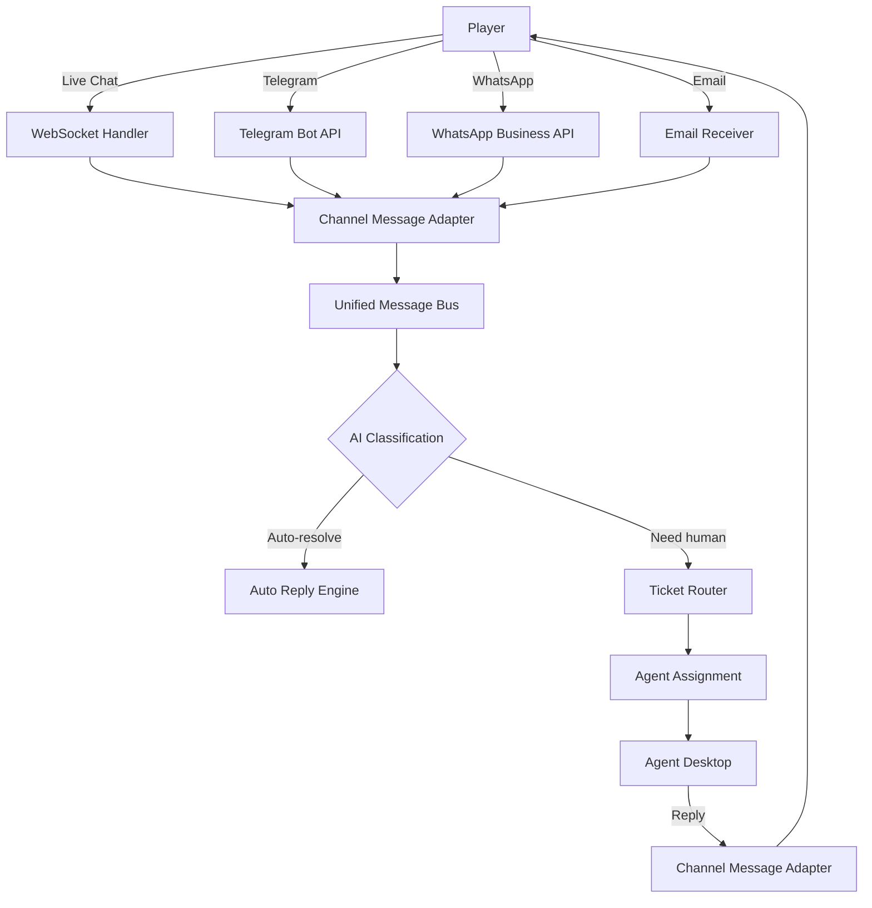

# 客服營運技術架構

> **業務需求**: [CS_Operations_Requirements.md](../../requirements/13_Customer_Service/02_CS_Operations_Requirements.md)
> **規範來源**: [13-02_Customer_Service_Operations.md](../../source-archive/13_Customer_Service/13-02_Customer_Service_Operations.md)
> **文件類型**: 技術架構
> **目標讀者**: 架構師、後端開發人員

---

## 1. 資料庫結構

### 1.1 客服人員實體表

```sql
CREATE TABLE t_cs_agent (
    id                  BIGINT PRIMARY KEY AUTO_INCREMENT,
    agent_id            BIGINT NOT NULL UNIQUE,
    agent_name          VARCHAR(100) NOT NULL,
    agent_level         VARCHAR(20) NOT NULL,  -- JUNIOR, REGULAR, SENIOR, TEAM_LEAD, MANAGER

    -- Language capabilities
    native_language     VARCHAR(10) NOT NULL,
    fluent_languages    VARCHAR(100),          -- Comma-separated: en,zh-TW,th
    basic_languages     VARCHAR(100),

    -- Skills
    skill_tags          VARCHAR(200),          -- Comma-separated: payment_expert,game_integration

    -- Status
    online_status       VARCHAR(20) DEFAULT 'OFFLINE',  -- ONLINE, BUSY, AWAY, OFFLINE
    current_ticket_count INT DEFAULT 0,
    max_ticket_count    INT DEFAULT 15,

    -- Performance
    fcr_rate            DECIMAL(5,2),
    csat_score          DECIMAL(3,2),
    aht_seconds         INT,

    -- Shift
    shift_start         TIME,
    shift_end           TIME,

    created_at          DATETIME DEFAULT CURRENT_TIMESTAMP,
    updated_at          DATETIME DEFAULT CURRENT_TIMESTAMP ON UPDATE CURRENT_TIMESTAMP,

    INDEX idx_online_status (online_status),
    INDEX idx_agent_level (agent_level)
);
```

### 1.2 SLA 配置表

```sql
CREATE TABLE t_sla_config (
    id                  BIGINT PRIMARY KEY AUTO_INCREMENT,
    ticket_priority     VARCHAR(20) NOT NULL,  -- URGENT, HIGH, MEDIUM, LOW
    vip_level           VARCHAR(20),           -- DIAMOND, PLATINUM, GOLD, SILVER, BRONZE

    -- SLA thresholds (minutes)
    first_response_minutes  INT NOT NULL,
    resolution_minutes      INT NOT NULL,

    -- Escalation rules
    escalation_50_target    VARCHAR(50),  -- team_lead, senior, manager
    escalation_75_target    VARCHAR(50),
    escalation_100_target   VARCHAR(50),

    created_at          DATETIME DEFAULT CURRENT_TIMESTAMP,

    UNIQUE KEY uk_priority_vip (ticket_priority, vip_level)
);
```

### 1.3 SLA 追蹤表

```sql
CREATE TABLE t_sla_tracking (
    id                  BIGINT PRIMARY KEY AUTO_INCREMENT,
    ticket_id           BIGINT NOT NULL,
    sla_type            VARCHAR(20) NOT NULL,  -- FIRST_RESPONSE, RESOLUTION

    -- SLA targets
    sla_deadline        DATETIME NOT NULL,

    -- Actual performance
    met                 BOOLEAN,
    actual_time         DATETIME,

    -- Escalation
    escalated           BOOLEAN DEFAULT FALSE,
    escalation_level    INT DEFAULT 0,
    escalated_to        VARCHAR(100),
    escalated_at        DATETIME,

    created_at          DATETIME DEFAULT CURRENT_TIMESTAMP,
    updated_at          DATETIME DEFAULT CURRENT_TIMESTAMP ON UPDATE CURRENT_TIMESTAMP,

    INDEX idx_ticket_id (ticket_id),
    INDEX idx_sla_deadline (sla_deadline),
    INDEX idx_met (met)
);
```

### 1.4 聊天 Session 表

```sql
CREATE TABLE t_chat_session (
    id                  BIGINT PRIMARY KEY AUTO_INCREMENT,
    ticket_id           BIGINT NOT NULL,
    player_id           BIGINT NOT NULL,
    agent_id            BIGINT,

    -- Channel
    channel             VARCHAR(20) NOT NULL,  -- LIVE_CHAT, TELEGRAM, WHATSAPP, EMAIL

    -- Status
    status              VARCHAR(20) NOT NULL,  -- ACTIVE, TRANSFERRED, CLOSED

    -- Timing
    started_at          DATETIME NOT NULL,
    ended_at            DATETIME,
    first_response_at   DATETIME,

    -- Stats
    message_count       INT DEFAULT 0,
    agent_message_count INT DEFAULT 0,

    created_at          DATETIME DEFAULT CURRENT_TIMESTAMP,

    INDEX idx_ticket_id (ticket_id),
    INDEX idx_player_id (player_id),
    INDEX idx_agent_id (agent_id),
    INDEX idx_channel (channel)
);
```

### 1.5 聊天訊息表

```sql
CREATE TABLE t_chat_message (
    id                  BIGINT PRIMARY KEY AUTO_INCREMENT,
    chat_session_id     BIGINT NOT NULL,
    sender_type         VARCHAR(20) NOT NULL,  -- PLAYER, AGENT, BOT
    sender_id           BIGINT NOT NULL,

    -- Content
    message_type        VARCHAR(20) NOT NULL,  -- TEXT, IMAGE, FILE, SYSTEM
    content             TEXT NOT NULL,
    file_url            VARCHAR(500),

    -- AI analysis
    detected_intent     VARCHAR(50),
    intent_confidence   DECIMAL(3,2),
    sentiment           VARCHAR(20),  -- POSITIVE, NEUTRAL, NEGATIVE

    created_at          DATETIME DEFAULT CURRENT_TIMESTAMP,

    INDEX idx_chat_session_id (chat_session_id),
    INDEX idx_created_at (created_at)
);
```

### 1.6 客服人員績效表

```sql
CREATE TABLE t_agent_daily_performance (
    id                  BIGINT PRIMARY KEY AUTO_INCREMENT,
    agent_id            BIGINT NOT NULL,
    performance_date    DATE NOT NULL,

    -- Volume
    tickets_handled     INT DEFAULT 0,
    chats_handled       INT DEFAULT 0,

    -- Quality
    fcr_count           INT DEFAULT 0,
    total_resolved      INT DEFAULT 0,
    csat_sum            DECIMAL(10,2) DEFAULT 0,
    csat_count          INT DEFAULT 0,

    -- Timing
    total_handle_time_seconds   INT DEFAULT 0,
    total_first_response_seconds INT DEFAULT 0,

    -- SLA
    sla_met_count       INT DEFAULT 0,
    sla_breached_count  INT DEFAULT 0,

    -- Reopens
    reopen_count        INT DEFAULT 0,

    created_at          DATETIME DEFAULT CURRENT_TIMESTAMP,

    UNIQUE KEY uk_agent_date (agent_id, performance_date),
    INDEX idx_performance_date (performance_date)
);
```

---

## 2. 工單路由服務

### 2.1 加權輪詢演算法

```java
@Service
@RequiredArgsConstructor
@Slf4j
public class TicketRoutingService {

    private final AgentDao agentDao;
    private final PlayerDao playerDao;
    private final VipConfigDao vipConfigDao;

    /**
     * Find best agent for a ticket based on:
     * 1. VIP priority routing
     * 2. Skill matching
     * 3. Language matching
     * 4. Workload balancing
     */
    public Option<AgentEntity> findBestAgent(TicketEntity ticket) {
        PlayerEntity player = playerDao.selectById(ticket.getPlayerId());

        // Step 1: VIP priority routing
        if (isVipPriorityRoute(player.getVipLevel())) {
            Option<AgentEntity> vipAgent = findVipManager(player.getVipLevel());
            if (vipAgent.isDefined()) return vipAgent;
        }

        // Step 2: Get skill-matched agents
        String requiredSkill = getRequiredSkill(ticket.getType());
        List<AgentEntity> candidates = agentDao.findAvailableAgentsBySkill(requiredSkill);

        if (candidates.isEmpty()) {
            candidates = agentDao.findAvailableAgents();
        }

        // Step 3: Calculate weighted score for each agent
        return Option.ofOptional(candidates.stream()
            .filter(a -> a.getCurrentTicketCount() < a.getMaxTicketCount())
            .map(agent -> {
                double weight = calculateWeight(agent, player);
                return Map.entry(agent, weight);
            })
            .max(Map.Entry.comparingByValue())
            .map(Map.Entry::getKey));
    }

    private double calculateWeight(AgentEntity agent, PlayerEntity player) {
        double levelWeight = switch (agent.getAgentLevel()) {
            case "SENIOR" -> 1.5;
            case "REGULAR" -> 1.0;
            case "JUNIOR" -> 0.7;
            default -> 1.0;
        };

        double languageScore = getLanguageMatchScore(agent, player.getLanguage());
        double loadInverse = 1.0 / (agent.getCurrentTicketCount() + 1);

        return levelWeight * languageScore * loadInverse;
    }

    private String getRequiredSkill(TicketType type) {
        return switch (type) {
            case DEPOSIT_ISSUE, WITHDRAWAL_DELAY -> "payment_expert";
            case GAME_LAG, BET_DISPUTE -> "game_integration";
            case BONUS_NOT_CREDITED, WAGERING_QUERY -> "bonus_specialist";
            case SERVICE_COMPLAINT, FRAUD_ACCUSATION -> "compliance_officer";
            default -> null;
        };
    }
}
```

---

## 3. SLA 自動化監控

### 3.1 SLA 監控服務

```java
@Service
@RequiredArgsConstructor
@Slf4j
public class SlaMonitorService {

    private final TicketDao ticketDao;
    private final SlaTrackingDao slaTrackingDao;
    private final SlaConfigDao slaConfigDao;
    private final NotificationService notificationService;

    /**
     * Scheduled: check SLA compliance every 5 minutes
     */
    @Scheduled(fixedRate = 300000)
    public void checkSlaCompliance() {
        List<SlaTracking> openTrackings = slaTrackingDao.findPendingSla();

        for (SlaTracking tracking : openTrackings) {
            Duration remaining = Duration.between(
                LocalDateTime.now(), tracking.getSlaDeadline());

            double percentageUsed = calculatePercentageUsed(tracking);

            if (remaining.isNegative()) {
                // SLA breached
                handleSlaBreach(tracking);
            } else if (percentageUsed >= 75) {
                escalate(tracking, 2);
            } else if (percentageUsed >= 50) {
                escalate(tracking, 1);
            }
        }
    }

    private void handleSlaBreach(SlaTracking tracking) {
        tracking.setMet(false);
        slaTrackingDao.updateById(tracking);

        TicketEntity ticket = ticketDao.selectById(tracking.getTicketId());

        // Level 2 escalation
        escalate(tracking, 2);

        // Send breach alert
        notificationService.sendSlaBreachAlert(ticket, tracking);

        log.warn("SLA breached: ticketId={}, type={}", ticket.getTicketId(), tracking.getSlaType());
    }

    private void escalate(SlaTracking tracking, int level) {
        if (tracking.getEscalationLevel() >= level) return;

        SlaConfig config = slaConfigDao.findByTicket(tracking.getTicketId());
        String target = switch (level) {
            case 1 -> config.getEscalation50Target();
            case 2 -> config.getEscalation75Target();
            case 3 -> config.getEscalation100Target();
            default -> "team_lead";
        };

        tracking.setEscalated(true);
        tracking.setEscalationLevel(level);
        tracking.setEscalatedTo(target);
        tracking.setEscalatedAt(LocalDateTime.now());
        slaTrackingDao.updateById(tracking);

        notificationService.sendEscalationNotification(tracking, target);
    }
}
```

---

## 4. 多管道訊息匯流排

### 4.1 管道適配器架構



### 4.2 統一訊息格式

```java
@Data
@Builder
public class UnifiedMessage {
    private Long messageId;
    private Long playerId;
    private Long ticketId;
    private String channel;           // LIVE_CHAT, TELEGRAM, WHATSAPP, EMAIL
    private String senderType;        // PLAYER, AGENT, BOT
    private Long senderId;
    private String messageType;       // TEXT, IMAGE, FILE, SYSTEM
    private String content;
    private String fileUrl;
    private LocalDateTime timestamp;

    // AI enrichment
    private String detectedIntent;
    private Double intentConfidence;
    private String sentiment;
}
```

---

## 5. 績效分析管線

### 5.1 指標計算

```java
@Service
@RequiredArgsConstructor
@Slf4j
public class AgentPerformanceService {

    private final AgentDailyPerformanceDao performanceDao;
    private final TicketDao ticketDao;

    /**
     * Calculate daily performance for all agents
     * Runs at end of day
     */
    @Scheduled(cron = "0 0 0 * * ?")
    public void calculateDailyPerformance() {
        LocalDate yesterday = LocalDate.now().minusDays(1);
        List<Long> agentIds = agentDao.findAllAgentIds();

        for (Long agentId : agentIds) {
            List<TicketEntity> tickets = ticketDao.findResolvedByAgentAndDate(agentId, yesterday);

            int totalResolved = tickets.size();
            int fcrCount = (int) tickets.stream()
                .filter(t -> t.getResolvedOnFirstContact())
                .count();

            double avgHandleTime = tickets.stream()
                .mapToLong(t -> Duration.between(t.getAssignedAt(), t.getResolvedTime()).getSeconds())
                .average()
                .orElse(0);

            AgentDailyPerformance perf = AgentDailyPerformance.builder()
                .agentId(agentId)
                .performanceDate(yesterday)
                .ticketsHandled(totalResolved)
                .fcrCount(fcrCount)
                .totalResolved(totalResolved)
                .totalHandleTimeSeconds((int) avgHandleTime * totalResolved)
                .build();

            performanceDao.saveOrUpdate(perf);
        }
    }

    /**
     * Get weekly performance ranking
     */
    public List<AgentRankingVO> getWeeklyRanking() {
        LocalDate weekStart = LocalDate.now().with(DayOfWeek.MONDAY);
        LocalDate weekEnd = weekStart.plusDays(6);

        return performanceDao.getAggregatePerfByDateRange(weekStart, weekEnd).stream()
            .map(perf -> AgentRankingVO.builder()
                .agentId(perf.getAgentId())
                .fcrRate(perf.getFcrCount() * 100.0 / perf.getTotalResolved())
                .csatScore(perf.getCsatSum() / perf.getCsatCount())
                .ticketVolume(perf.getTicketsHandled())
                .build())
            .sorted(Comparator.comparingDouble(AgentRankingVO::getFcrRate).reversed())
            .collect(Collectors.toList());
    }
}
```

---

## 6. 品質保證自動化

```java
@Service
@RequiredArgsConstructor
public class QualityAssuranceService {

    private final TicketDao ticketDao;
    private final QaReviewDao qaReviewDao;

    /**
     * Select 10% of tickets for daily QA review
     */
    @Scheduled(cron = "0 0 6 * * ?")
    public void selectTicketsForReview() {
        LocalDate yesterday = LocalDate.now().minusDays(1);
        List<TicketEntity> resolvedTickets = ticketDao.findResolvedByDate(yesterday);

        int sampleSize = Math.max(1, resolvedTickets.size() / 10);
        Collections.shuffle(resolvedTickets);

        List<TicketEntity> selectedTickets = resolvedTickets.subList(0, sampleSize);

        for (TicketEntity ticket : selectedTickets) {
            QaReview review = QaReview.builder()
                .ticketId(ticket.getTicketId())
                .agentId(ticket.getAssignedAgentId())
                .reviewDate(yesterday)
                .status("PENDING")
                .build();
            qaReviewDao.insert(review);
        }

        log.info("QA review: selected {} tickets from {} total",
            sampleSize, resolvedTickets.size());
    }
}
```

---

## 7. 監控

| 指標 | Prometheus 名稱 | 說明 |
|------|-----------------|------|
| 各優先級未結工單 | `cs_open_tickets_gauge{priority}` | 即時計數 |
| SLA 達成率 | `cs_sla_achievement_rate` | 滾動 24 小時 |
| 平均首次回應時間 | `cs_first_response_seconds_avg` | 平均值 |
| FCR 率 | `cs_fcr_rate` | 首次聯繫解決率 |
| CSAT 分數 | `cs_csat_score_avg` | 平均滿意度 |
| AI 自動化率 | `cs_ai_automation_rate` | 自動解決百分比 |
| 客服人員利用率 | `cs_agent_utilization_rate` | 忙碌/總時間 |
| 工單重開率 | `cs_ticket_reopen_rate` | 品質指標 |

---

## 相關文件

- [CS_Operations_Requirements.md](../../requirements/13_Customer_Service/02_CS_Operations_Requirements.md) — 業務需求
- [CS_Platform_Architecture.md](01_CS_Platform_Architecture.md) — 平台架構

---

**返回**: [客服模組](../../source-archive/13_Customer_Service/README.md) | [iGaming 首頁](../../source-archive/README.md)
