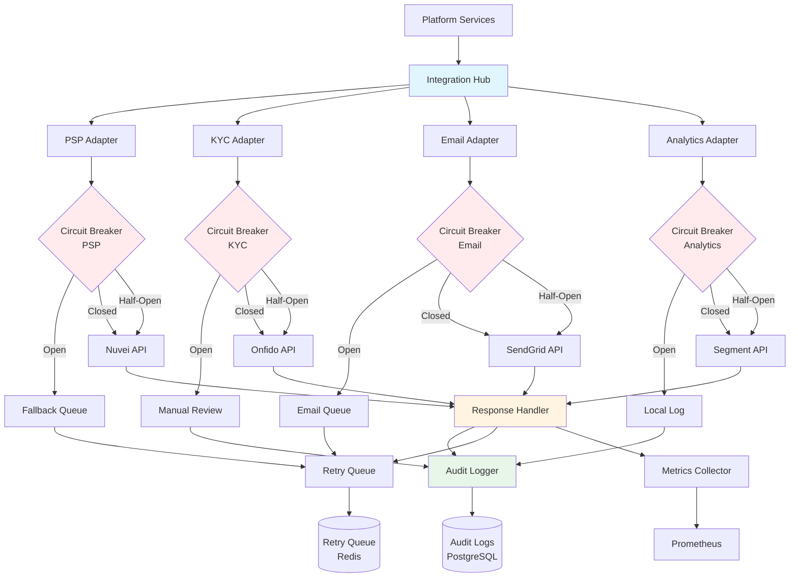

# 第三方整合架構

> **業務需求**: [Third-Party Integration Requirements](../../requirements/14_Integration_Standards/Third_Party_Integration_Requirements.md)
> **規範來源**: [source-archive/14_Third_Party_Integration/14-01](../../source-archive/14_Third_Party_Integration/14-01_Third_Party_Integration.md)
> **文件類型**: 技術架構
> **目標讀者**: 架構師、後端開發人員、DevOps 工程師

---

## 1. 整合類別

### 1.1 KYC/AML 供應商

| 供應商 | 服務 | 整合方式 | 成本 |
|--------|------|----------|------|
| **Onfido** | 身份驗證、人臉辨識 | REST API | ~$2/次 |
| **Jumio** | 文件驗證 | REST API + Webhook | ~$1.5/次 |
| **ComplyAdvantage** | AML 篩查 | REST API | ~$0.5/次 |
| **Sumsub** | 綜合 KYC | REST API + SDK | ~$3/次 |

### 1.2 行銷工具

| 工具類型 | 供應商 | 用途 | 整合方式 |
|----------|--------|------|----------|
| **Email** | SendGrid, AWS SES | 交易型、行銷郵件 | REST API |
| **SMS** | Twilio, Vonage | OTP、提款通知 | REST API |
| **推播** | OneSignal, Firebase | App 推播通知 | SDK + REST API |
| **CRM** | Braze, Customer.io | 玩家生命週期管理 | REST API + Webhook |

### 1.3 分析工具

| 工具 | 用途 | 整合方式 |
|------|------|----------|
| **Google Analytics 4** | 流量、使用者行為 | gtag.js SDK |
| **Mixpanel** | 產品分析、漏斗 | JavaScript SDK |
| **Amplitude** | 留存、事件追蹤 | JavaScript SDK |
| **Segment** | 資料管線（統一） | JS SDK + Server API |

### 1.4 整合中樞架構

平台採用集中式整合中樞，結合適配器模式、斷路器和降級策略，實現彈性的第三方服務整合。



**中樞元件**：
- **Adapters**：將供應商特定 API 標準化為平台標準介面
- **Circuit Breakers**：防止連鎖故障（Open/Closed/Half-Open 狀態）
- **降級策略**：優雅降級（佇列、人工處理、本地日誌）
- **回應處理器**：統一錯誤處理與回應標準化
- **稽核日誌**：完整的合規稽核軌跡
- **重試佇列**：指數退避重試機制（Redis 支援）
- **指標收集器**：Prometheus 監控指標

**斷路器閾值**：
- **PSP**：5 分鐘內 5% 錯誤率 → OPEN（降級至佇列）
- **KYC**：10 分鐘內 10% 錯誤率 → OPEN（降級至人工審查）
- **Email**：15 分鐘內 20% 錯誤率 → OPEN（降級至佇列）
- **Analytics**：30 分鐘內 50% 錯誤率 → OPEN（降級至本地日誌）

---

## 2. 整合模式

### 2.1 Segment 事件追蹤

```javascript
// Frontend: track player deposit event
analytics.track('Deposit Completed', {
  amount: 100.00,
  currency: 'USD',
  payment_method: 'credit_card',
  player_vip_level: 'Gold'
});
```

### 2.2 Firebase Cloud Messaging SDK

```html
<script src="https://www.gstatic.com/firebasejs/9.0.0/firebase-app.js"></script>
<script src="https://www.gstatic.com/firebasejs/9.0.0/firebase-messaging.js"></script>

<script>
const firebaseConfig = {
  apiKey: "AIzaSyXXXXXXXXXXXXXXXXXXXXXXXXXXXXXXXX",
  projectId: "igaming-platform",
  messagingSenderId: "123456789012"
};
firebase.initializeApp(firebaseConfig);

const messaging = firebase.messaging();
messaging.requestPermission()
  .then(() => messaging.getToken())
  .then(token => {
    fetch('/api/v1/players/me/fcm-token', {
      method: 'POST',
      headers: {'Content-Type': 'application/json'},
      body: JSON.stringify({fcm_token: token})
    });
  });
</script>
```

## 3. Webhook 重試策略

**指數退避**：

| 重試次數 | 延遲 | 累計 |
|----------|------|------|
| 第 1 次 | 5s | 5s |
| 第 2 次 | 10s | 15s |
| 第 3 次 | 20s | 35s |
| 第 4 次 | 40s | 1m 15s |
| 第 5 次 | 80s | 2m 35s |
| 第 6 次（最終） | 160s | 5m 15s |

**配置**：
```yaml
webhook:
  max_retries: 6
  initial_delay: 5s
  max_delay: 160s
  backoff_multiplier: 2.0

  dlq:
    retention_days: 7
    alert_threshold: 100

  alerting:
    slack_channel: '#integrations-ops'
    pagerduty_severity: high
```

## 4. API 金鑰管理（HashiCorp Vault）

```text
Vault Secrets Engine:
+-- secret/psp/nuvei
|   +-- merchant_id: "123456"
|   +-- secret_key: "abc123xyz"
|
+-- secret/kyc/onfido
|   +-- api_key: "live_XXXXXXXXXXXXXXXX"
|   +-- webhook_secret: "webhook_secret_123"
|
+-- secret/email/sendgrid
    +-- api_key: "SG.XXXXXXXXXXXXXXXXXXXXXXXXXXXXXXXX"
```

### 金鑰輪換政策

| 服務類型 | 輪換週期 | 自動化 | 觸發條件 |
|----------|----------|--------|----------|
| PSP API 金鑰 | 90 天 | 是 | 排程 + 可疑活動 |
| 內部服務金鑰 | 30 天 | 是 | 排程 |
| Webhook Secret | 按需 | 否 | 疑似洩漏 |
| 資料庫密碼 | 180 天 | 是 | 排程 |

### Terraform + Vault 自動輪換

```hcl
resource "vault_generic_secret" "nuvei_api_key" {
  path = "secret/psp/nuvei"

  data_json = jsonencode({
    merchant_id = "123456"
    secret_key  = random_password.nuvei_secret.result
  })

  lifecycle {
    create_before_destroy = true
  }
}

resource "random_password" "nuvei_secret" {
  length  = 32
  special = true

  keepers = {
    rotation_timestamp = timestamp()
  }
}
```

## 5. 速率限制配置

| 服務 | 限制 | 時間窗口 | 超限處理 |
|------|------|----------|----------|
| **Onfido KYC** | 100 req/min | 60s | 排入佇列 + 429 錯誤 |
| **SendGrid Email** | 1000 req/hour | 3600s | 排入佇列 + 延遲發送 |
| **GP 遊戲啟動** | 500 req/min | 60s | 返回快取 URL |
| **Google Analytics** | 無限制 | - | - |

## 6. 服務降級策略

| 服務類型 | 優先級 | 中斷影響 | 降級方案 |
|----------|--------|----------|----------|
| **PSP** | 嚴重 | 無法存取款 | 切換至備用 PSP |
| **KYC 供應商** | 重要 | 無法完成驗證 | 人工審查流程 |
| **遊戲供應商** | 重要 | 特定遊戲無法使用 | 顯示維護通知 |
| **Email 服務** | 選用 | 郵件延遲寄送 | 排入佇列 + 稍後重試 |
| **Analytics** | 選用 | 無法追蹤事件 | 本地日誌記錄 |

### 降級實作

```java
@Manager
@RequiredArgsConstructor
public class ThirdPartyServiceManager {
    private final OnfidoKycClient primaryKycClient;
    private final JumioKycClient fallbackKycClient;
    private final ThirdPartyHealthMonitor healthMonitor;

    @Transactional(rollbackFor = Throwable.class)
    public Option<KycResult> performKycVerification(PlayerId playerId, DocumentUpload document) {
        if (healthMonitor.isHealthy("onfido")) {
            return Try.of(() -> primaryKycClient.verify(playerId, document))
                .onFailure(e -> log.warn("Onfido failed, switching to fallback", e))
                .toOption();
        }

        log.info("Using fallback KYC provider: Jumio");
        return Try.of(() -> fallbackKycClient.verify(playerId, document))
            .onFailure(e -> log.error("Both KYC providers failed", e))
            .toOption();
    }
}
```

## 7. 監控與告警

### 健康檢查儀表板

```text
Third-Party Service Health (Last 1 Hour)
+--------------------------------------------------+
|  PSP: Nuvei          OK  99.8% Available P99: 1.2s|
|  KYC: Onfido         OK  98.5% Available P99: 3.5s|
|  Email: SendGrid     OK  100% Available  P99: 0.5s|
|  GP: Pragmatic Play  WARN 95.2% Available P99: 2.8s|
+--------------------------------------------------+
```

### Prometheus AlertManager

```yaml
groups:
  - name: third_party_services
    interval: 1m
    rules:
      - alert: PSP_HighFailureRate
        expr: |
          (
            sum(rate(third_party_requests_total{service="nuvei", status="error"}[5m]))
            /
            sum(rate(third_party_requests_total{service="nuvei"}[5m]))
          ) > 0.05
        for: 5m
        labels:
          severity: critical
        annotations:
          summary: "Nuvei PSP failure rate > 5%"
          description: "Current failure rate: {{ $value | humanizePercentage }}"

      - alert: KYC_SlowResponse
        expr: |
          histogram_quantile(0.99,
            sum(rate(third_party_request_duration_bucket{service="onfido"}[5m])) by (le)
          ) > 5.0
        for: 10m
        labels:
          severity: warning
        annotations:
          summary: "Onfido KYC P99 latency > 5s"
```

### 服務恢復偵測

- 健康檢查間隔：30 秒
- 恢復條件：連續 3 次通過（可用性 > 95%）
- 自動切回主要服務並記錄恢復事件

---

## 8. 資料庫結構

### 8.1 第三方整合表

`third_party_integrations` 表儲存所有第三方服務整合的配置和健康狀態。

```sql
CREATE TABLE third_party_integrations (
    integration_id BIGSERIAL PRIMARY KEY,
    service_name VARCHAR(100) NOT NULL UNIQUE, -- e.g., 'nuvei_psp', 'onfido_kyc', 'sendgrid_email'
    service_type VARCHAR(50) NOT NULL CHECK (service_type IN ('PSP', 'KYC', 'EMAIL', 'SMS', 'ANALYTICS', 'GAME_PROVIDER', 'CRM', 'OTHER')),
    provider_name VARCHAR(100) NOT NULL, -- e.g., 'Nuvei', 'Onfido', 'SendGrid'
    api_endpoint VARCHAR(255) NOT NULL,
    auth_method VARCHAR(50) NOT NULL CHECK (auth_method IN ('API_KEY', 'OAUTH2', 'HMAC', 'BASIC_AUTH', 'BEARER_TOKEN')),
    vault_secret_path VARCHAR(255) NOT NULL, -- HashiCorp Vault path (e.g., 'secret/psp/nuvei')
    rate_limit_per_minute INT, -- Nullable if no rate limit
    circuit_breaker_config JSONB NOT NULL DEFAULT '{"error_threshold": 0.05, "timeout_seconds": 30, "half_open_requests": 3}',
    fallback_strategy VARCHAR(50) NOT NULL CHECK (fallback_strategy IN ('QUEUE', 'MANUAL_REVIEW', 'LOCAL_LOG', 'BACKUP_SERVICE', 'NONE')),
    backup_integration_id BIGINT REFERENCES third_party_integrations(integration_id), -- Nullable if no backup
    is_active BOOLEAN NOT NULL DEFAULT true,
    is_healthy BOOLEAN NOT NULL DEFAULT true, -- Updated by health check job
    last_health_check TIMESTAMP,
    health_check_interval_seconds INT NOT NULL DEFAULT 30,
    created_at TIMESTAMP NOT NULL DEFAULT CURRENT_TIMESTAMP,
    updated_at TIMESTAMP NOT NULL DEFAULT CURRENT_TIMESTAMP,
    created_by BIGINT NOT NULL,
    updated_by BIGINT NOT NULL,
    deleted BOOLEAN NOT NULL DEFAULT false,
    CONSTRAINT fk_third_party_integrations_backup FOREIGN KEY (backup_integration_id) REFERENCES third_party_integrations(integration_id)
);

CREATE INDEX idx_third_party_integrations_service_type ON third_party_integrations(service_type);
CREATE INDEX idx_third_party_integrations_is_active ON third_party_integrations(is_active) WHERE deleted = false;
CREATE INDEX idx_third_party_integrations_is_healthy ON third_party_integrations(is_healthy) WHERE is_active = true;
CREATE INDEX idx_third_party_integrations_provider_name ON third_party_integrations(provider_name);

COMMENT ON TABLE third_party_integrations IS 'Third-party service integration configurations with circuit breaker and fallback strategies';
COMMENT ON COLUMN third_party_integrations.circuit_breaker_config IS 'JSON config: {error_threshold, timeout_seconds, half_open_requests, recovery_threshold}';
COMMENT ON COLUMN third_party_integrations.fallback_strategy IS 'Strategy when circuit breaker opens: QUEUE (retry later), MANUAL_REVIEW, LOCAL_LOG, BACKUP_SERVICE, NONE';
COMMENT ON COLUMN third_party_integrations.vault_secret_path IS 'HashiCorp Vault secret path for API credentials (NEVER store credentials in this table)';
```

### 8.2 整合稽核日誌表

`integration_audit_logs` 表儲存所有第三方 API 互動的完整稽核軌跡，用於除錯和合規。

```sql
CREATE TABLE integration_audit_logs (
    log_id BIGSERIAL PRIMARY KEY,
    integration_id BIGINT NOT NULL REFERENCES third_party_integrations(integration_id),
    request_id VARCHAR(100) NOT NULL, -- Unique request identifier (for correlation)
    operation VARCHAR(100) NOT NULL, -- e.g., 'deposit', 'kyc_verification', 'send_email'
    http_method VARCHAR(10) NOT NULL CHECK (http_method IN ('GET', 'POST', 'PUT', 'PATCH', 'DELETE')),
    request_url VARCHAR(500) NOT NULL,
    request_headers JSONB, -- Sanitized headers (NO sensitive data)
    request_payload JSONB, -- Sanitized payload (NO sensitive data)
    response_status_code INT,
    response_headers JSONB,
    response_payload JSONB, -- Sanitized response
    response_time_ms INT NOT NULL, -- API call duration in milliseconds
    error_code VARCHAR(50), -- Nullable if success
    error_message TEXT, -- Nullable if success
    retry_count INT NOT NULL DEFAULT 0,
    circuit_breaker_state VARCHAR(20) CHECK (circuit_breaker_state IN ('CLOSED', 'OPEN', 'HALF_OPEN')),
    fallback_triggered BOOLEAN NOT NULL DEFAULT false,
    client_ip VARCHAR(45), -- IPv4 or IPv6 (if applicable)
    user_agent TEXT, -- User agent (if applicable)
    created_at TIMESTAMP NOT NULL DEFAULT CURRENT_TIMESTAMP,
    deleted BOOLEAN NOT NULL DEFAULT false
);

CREATE INDEX idx_integration_audit_logs_integration_id ON integration_audit_logs(integration_id);
CREATE INDEX idx_integration_audit_logs_request_id ON integration_audit_logs(request_id);
CREATE INDEX idx_integration_audit_logs_operation ON integration_audit_logs(operation);
CREATE INDEX idx_integration_audit_logs_response_status_code ON integration_audit_logs(response_status_code);
CREATE INDEX idx_integration_audit_logs_error_code ON integration_audit_logs(error_code) WHERE error_code IS NOT NULL;
CREATE INDEX idx_integration_audit_logs_created_at ON integration_audit_logs(created_at DESC);
CREATE INDEX idx_integration_audit_logs_response_time_ms ON integration_audit_logs(response_time_ms DESC);

COMMENT ON TABLE integration_audit_logs IS 'Complete audit trail of all third-party API interactions (sanitized, no PII or credentials)';
COMMENT ON COLUMN integration_audit_logs.request_payload IS 'Sanitized JSON payload (PII masked, credentials removed)';
COMMENT ON COLUMN integration_audit_logs.response_time_ms IS 'API call duration in milliseconds (for performance monitoring)';
COMMENT ON COLUMN integration_audit_logs.circuit_breaker_state IS 'Circuit breaker state at the time of this request';
COMMENT ON COLUMN integration_audit_logs.fallback_triggered IS 'Whether fallback strategy was used due to circuit breaker OPEN';
```

### 8.3 範例查詢

**查詢整合健康狀態**：
```sql
SELECT
    tpi.service_name,
    tpi.provider_name,
    tpi.service_type,
    tpi.is_active,
    tpi.is_healthy,
    tpi.last_health_check,
    EXTRACT(EPOCH FROM (NOW() - tpi.last_health_check)) AS seconds_since_last_check,
    backup_tpi.service_name AS backup_service
FROM third_party_integrations tpi
LEFT JOIN third_party_integrations backup_tpi ON tpi.backup_integration_id = backup_tpi.integration_id
WHERE tpi.deleted = false
ORDER BY tpi.service_type, tpi.is_healthy DESC;
```

**查詢 API 效能指標**：
```sql
SELECT
    tpi.service_name,
    ial.operation,
    COUNT(*) AS total_requests,
    COUNT(*) FILTER (WHERE ial.response_status_code >= 200 AND ial.response_status_code < 300) AS success_count,
    COUNT(*) FILTER (WHERE ial.response_status_code >= 400 OR ial.error_code IS NOT NULL) AS error_count,
    ROUND(AVG(ial.response_time_ms), 2) AS avg_response_ms,
    ROUND(PERCENTILE_CONT(0.99) WITHIN GROUP (ORDER BY ial.response_time_ms), 2) AS p99_response_ms,
    COUNT(*) FILTER (WHERE ial.fallback_triggered = true) AS fallback_triggered_count
FROM integration_audit_logs ial
JOIN third_party_integrations tpi ON ial.integration_id = tpi.integration_id
WHERE ial.created_at > NOW() - INTERVAL '1 hour'
GROUP BY tpi.service_name, ial.operation
ORDER BY error_count DESC, avg_response_ms DESC;
```

**查詢斷路器事件**：
```sql
SELECT
    tpi.service_name,
    ial.circuit_breaker_state,
    COUNT(*) AS request_count,
    MIN(ial.created_at) AS first_event,
    MAX(ial.created_at) AS last_event
FROM integration_audit_logs ial
JOIN third_party_integrations tpi ON ial.integration_id = tpi.integration_id
WHERE ial.created_at > NOW() - INTERVAL '24 hours'
  AND ial.circuit_breaker_state IN ('OPEN', 'HALF_OPEN')
GROUP BY tpi.service_name, ial.circuit_breaker_state
ORDER BY last_event DESC;
```

**查詢失敗請求以除錯**：
```sql
SELECT
    ial.log_id,
    tpi.service_name,
    ial.operation,
    ial.request_id,
    ial.http_method,
    ial.request_url,
    ial.response_status_code,
    ial.error_code,
    ial.error_message,
    ial.retry_count,
    ial.response_time_ms,
    ial.created_at
FROM integration_audit_logs ial
JOIN third_party_integrations tpi ON ial.integration_id = tpi.integration_id
WHERE (ial.response_status_code >= 400 OR ial.error_code IS NOT NULL)
  AND ial.created_at > NOW() - INTERVAL '1 hour'
ORDER BY ial.created_at DESC
LIMIT 50;
```
