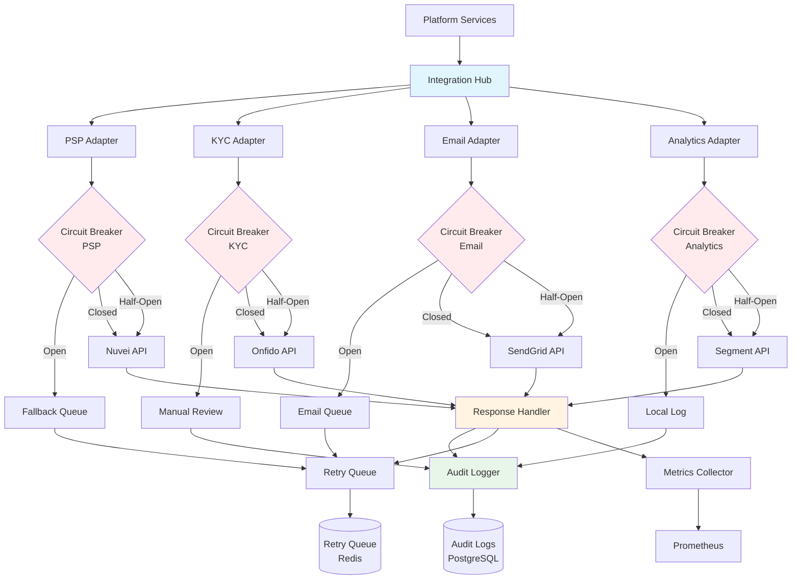

# Third-Party Integration Architecture

> **Business Requirements**: [Third-Party Integration Requirements](../../requirements/14_Integration_Standards/Third_Party_Integration_Requirements.md)
> **Canonical Source**: [source-archive/14_Third_Party_Integration/14-01](../../source-archive/14_Third_Party_Integration/14-01_Third_Party_Integration.md)
> **View Type**: Technical Architecture
> **Target Audience**: Architects, Backend Developers, DevOps Engineers

---

## 1. Integration Categories

### 1.1 KYC/AML Providers

| Provider | Service | Integration | Cost |
|----------|---------|-------------|------|
| **Onfido** | ID verification, facial recognition | REST API | ~$2/check |
| **Jumio** | Document verification | REST API + Webhook | ~$1.5/check |
| **ComplyAdvantage** | AML screening | REST API | ~$0.5/check |
| **Sumsub** | Comprehensive KYC | REST API + SDK | ~$3/check |

### 1.2 Marketing Tools

| Tool Type | Provider | Purpose | Integration |
|-----------|----------|---------|-------------|
| **Email** | SendGrid, AWS SES | Transactional, marketing email | REST API |
| **SMS** | Twilio, Vonage | OTP, withdrawal notifications | REST API |
| **Push** | OneSignal, Firebase | App push notifications | SDK + REST API |
| **CRM** | Braze, Customer.io | Player lifecycle management | REST API + Webhook |

### 1.3 Analytics Tools

| Tool | Purpose | Integration |
|------|---------|-------------|
| **Google Analytics 4** | Traffic, user behavior | gtag.js SDK |
| **Mixpanel** | Product analytics, funnels | JavaScript SDK |
| **Amplitude** | Retention, event tracking | JavaScript SDK |
| **Segment** | Data pipeline (unified) | JS SDK + Server API |

### 1.4 Integration Hub Architecture

The platform uses a centralized integration hub with adapter patterns, circuit breakers, and fallback strategies for resilient third-party service integration.



**Hub Components**:
- **Adapters**: Normalize provider-specific APIs to platform standard interfaces
- **Circuit Breakers**: Prevent cascading failures (Open/Closed/Half-Open states)
- **Fallback Strategies**: Graceful degradation (queue, manual process, local log)
- **Response Handler**: Unified error handling and response normalization
- **Audit Logger**: Complete audit trail for compliance
- **Retry Queue**: Exponential backoff retry mechanism (Redis-backed)
- **Metrics Collector**: Prometheus metrics for monitoring

**Circuit Breaker Thresholds**:
- **PSP**: 5% error rate over 5 minutes → OPEN (fallback to queue)
- **KYC**: 10% error rate over 10 minutes → OPEN (fallback to manual review)
- **Email**: 20% error rate over 15 minutes → OPEN (fallback to queue)
- **Analytics**: 50% error rate over 30 minutes → OPEN (fallback to local log)

---

## 2. Integration Patterns

### 2.1 Segment Event Tracking

```javascript
// Frontend: track player deposit event
analytics.track('Deposit Completed', {
  amount: 100.00,
  currency: 'USD',
  payment_method: 'credit_card',
  player_vip_level: 'Gold'
});
```

### 2.2 Firebase Cloud Messaging SDK

```html
<script src="https://www.gstatic.com/firebasejs/9.0.0/firebase-app.js"></script>
<script src="https://www.gstatic.com/firebasejs/9.0.0/firebase-messaging.js"></script>

<script>
const firebaseConfig = {
  apiKey: "AIzaSyXXXXXXXXXXXXXXXXXXXXXXXXXXXXXXXX",
  projectId: "igaming-platform",
  messagingSenderId: "123456789012"
};
firebase.initializeApp(firebaseConfig);

const messaging = firebase.messaging();
messaging.requestPermission()
  .then(() => messaging.getToken())
  .then(token => {
    fetch('/api/v1/players/me/fcm-token', {
      method: 'POST',
      headers: {'Content-Type': 'application/json'},
      body: JSON.stringify({fcm_token: token})
    });
  });
</script>
```

## 3. Webhook Retry Strategy

**Exponential Backoff**:

| Retry | Delay | Cumulative |
|-------|-------|-----------|
| 1st | 5s | 5s |
| 2nd | 10s | 15s |
| 3rd | 20s | 35s |
| 4th | 40s | 1m 15s |
| 5th | 80s | 2m 35s |
| 6th (final) | 160s | 5m 15s |

**Configuration**:
```yaml
webhook:
  max_retries: 6
  initial_delay: 5s
  max_delay: 160s
  backoff_multiplier: 2.0

  dlq:
    retention_days: 7
    alert_threshold: 100

  alerting:
    slack_channel: '#integrations-ops'
    pagerduty_severity: high
```

## 4. API Key Management (HashiCorp Vault)

```text
Vault Secrets Engine:
+-- secret/psp/nuvei
|   +-- merchant_id: "123456"
|   +-- secret_key: "abc123xyz"
|
+-- secret/kyc/onfido
|   +-- api_key: "live_XXXXXXXXXXXXXXXX"
|   +-- webhook_secret: "webhook_secret_123"
|
+-- secret/email/sendgrid
    +-- api_key: "SG.XXXXXXXXXXXXXXXXXXXXXXXXXXXXXXXX"
```

### Key Rotation Policy

| Service Type | Rotation Cycle | Automated | Trigger |
|-------------|---------------|-----------|---------|
| PSP API Key | 90 days | Yes | Scheduled + suspicious activity |
| Internal Service Key | 30 days | Yes | Scheduled |
| Webhook Secret | On demand | No | Suspected compromise |
| Database Password | 180 days | Yes | Scheduled |

### Terraform + Vault Auto-Rotation

```hcl
resource "vault_generic_secret" "nuvei_api_key" {
  path = "secret/psp/nuvei"

  data_json = jsonencode({
    merchant_id = "123456"
    secret_key  = random_password.nuvei_secret.result
  })

  lifecycle {
    create_before_destroy = true
  }
}

resource "random_password" "nuvei_secret" {
  length  = 32
  special = true

  keepers = {
    rotation_timestamp = timestamp()
  }
}
```

## 5. Rate Limiting Configuration

| Service | Limit | Window | Over-Limit Action |
|---------|-------|--------|-------------------|
| **Onfido KYC** | 100 req/min | 60s | Queue + 429 error |
| **SendGrid Email** | 1000 req/hour | 3600s | Queue + delayed send |
| **GP Game Launch** | 500 req/min | 60s | Return cached URL |
| **Google Analytics** | Unlimited | - | - |

## 6. Service Degradation Strategy

| Service Type | Priority | Impact When Down | Fallback |
|-------------|----------|------------------|----------|
| **PSP** | Critical | No deposits/withdrawals | Switch to backup PSP |
| **KYC Provider** | Important | Cannot complete verification | Manual review process |
| **Game Provider** | Important | Specific games unavailable | Show maintenance notice |
| **Email Service** | Optional | Delayed email delivery | Queue + retry later |
| **Analytics** | Optional | Cannot track events | Local log recording |

### Fallback Implementation

```java
@Manager
@RequiredArgsConstructor
public class ThirdPartyServiceManager {
    private final OnfidoKycClient primaryKycClient;
    private final JumioKycClient fallbackKycClient;
    private final ThirdPartyHealthMonitor healthMonitor;

    @Transactional(rollbackFor = Throwable.class)
    public Option<KycResult> performKycVerification(PlayerId playerId, DocumentUpload document) {
        if (healthMonitor.isHealthy("onfido")) {
            return Try.of(() -> primaryKycClient.verify(playerId, document))
                .onFailure(e -> log.warn("Onfido failed, switching to fallback", e))
                .toOption();
        }

        log.info("Using fallback KYC provider: Jumio");
        return Try.of(() -> fallbackKycClient.verify(playerId, document))
            .onFailure(e -> log.error("Both KYC providers failed", e))
            .toOption();
    }
}
```

## 7. Monitoring & Alerting

### Health Check Dashboard

```text
Third-Party Service Health (Last 1 Hour)
+--------------------------------------------------+
|  PSP: Nuvei          OK  99.8% Available P99: 1.2s|
|  KYC: Onfido         OK  98.5% Available P99: 3.5s|
|  Email: SendGrid     OK  100% Available  P99: 0.5s|
|  GP: Pragmatic Play  WARN 95.2% Available P99: 2.8s|
+--------------------------------------------------+
```

### Prometheus AlertManager

```yaml
groups:
  - name: third_party_services
    interval: 1m
    rules:
      - alert: PSP_HighFailureRate
        expr: |
          (
            sum(rate(third_party_requests_total{service="nuvei", status="error"}[5m]))
            /
            sum(rate(third_party_requests_total{service="nuvei"}[5m]))
          ) > 0.05
        for: 5m
        labels:
          severity: critical
        annotations:
          summary: "Nuvei PSP failure rate > 5%"
          description: "Current failure rate: {{ $value | humanizePercentage }}"

      - alert: KYC_SlowResponse
        expr: |
          histogram_quantile(0.99,
            sum(rate(third_party_request_duration_bucket{service="onfido"}[5m])) by (le)
          ) > 5.0
        for: 10m
        labels:
          severity: warning
        annotations:
          summary: "Onfido KYC P99 latency > 5s"
```

### Service Recovery Detection

- Health check interval: 30 seconds
- Recovery condition: 3 consecutive passes (availability > 95%)
- Auto-switch back to primary service with recovery event logged

---

## 8. Database Schema

### 8.1 Third-Party Integrations Table

The `third_party_integrations` table stores configuration and health status for all third-party service integrations.

```sql
CREATE TABLE third_party_integrations (
    integration_id BIGSERIAL PRIMARY KEY,
    service_name VARCHAR(100) NOT NULL UNIQUE, -- e.g., 'nuvei_psp', 'onfido_kyc', 'sendgrid_email'
    service_type VARCHAR(50) NOT NULL CHECK (service_type IN ('PSP', 'KYC', 'EMAIL', 'SMS', 'ANALYTICS', 'GAME_PROVIDER', 'CRM', 'OTHER')),
    provider_name VARCHAR(100) NOT NULL, -- e.g., 'Nuvei', 'Onfido', 'SendGrid'
    api_endpoint VARCHAR(255) NOT NULL,
    auth_method VARCHAR(50) NOT NULL CHECK (auth_method IN ('API_KEY', 'OAUTH2', 'HMAC', 'BASIC_AUTH', 'BEARER_TOKEN')),
    vault_secret_path VARCHAR(255) NOT NULL, -- HashiCorp Vault path (e.g., 'secret/psp/nuvei')
    rate_limit_per_minute INT, -- Nullable if no rate limit
    circuit_breaker_config JSONB NOT NULL DEFAULT '{"error_threshold": 0.05, "timeout_seconds": 30, "half_open_requests": 3}',
    fallback_strategy VARCHAR(50) NOT NULL CHECK (fallback_strategy IN ('QUEUE', 'MANUAL_REVIEW', 'LOCAL_LOG', 'BACKUP_SERVICE', 'NONE')),
    backup_integration_id BIGINT REFERENCES third_party_integrations(integration_id), -- Nullable if no backup
    is_active BOOLEAN NOT NULL DEFAULT true,
    is_healthy BOOLEAN NOT NULL DEFAULT true, -- Updated by health check job
    last_health_check TIMESTAMP,
    health_check_interval_seconds INT NOT NULL DEFAULT 30,
    created_at TIMESTAMP NOT NULL DEFAULT CURRENT_TIMESTAMP,
    updated_at TIMESTAMP NOT NULL DEFAULT CURRENT_TIMESTAMP,
    created_by BIGINT NOT NULL,
    updated_by BIGINT NOT NULL,
    deleted BOOLEAN NOT NULL DEFAULT false,
    CONSTRAINT fk_third_party_integrations_backup FOREIGN KEY (backup_integration_id) REFERENCES third_party_integrations(integration_id)
);

CREATE INDEX idx_third_party_integrations_service_type ON third_party_integrations(service_type);
CREATE INDEX idx_third_party_integrations_is_active ON third_party_integrations(is_active) WHERE deleted = false;
CREATE INDEX idx_third_party_integrations_is_healthy ON third_party_integrations(is_healthy) WHERE is_active = true;
CREATE INDEX idx_third_party_integrations_provider_name ON third_party_integrations(provider_name);

COMMENT ON TABLE third_party_integrations IS 'Third-party service integration configurations with circuit breaker and fallback strategies';
COMMENT ON COLUMN third_party_integrations.circuit_breaker_config IS 'JSON config: {error_threshold, timeout_seconds, half_open_requests, recovery_threshold}';
COMMENT ON COLUMN third_party_integrations.fallback_strategy IS 'Strategy when circuit breaker opens: QUEUE (retry later), MANUAL_REVIEW, LOCAL_LOG, BACKUP_SERVICE, NONE';
COMMENT ON COLUMN third_party_integrations.vault_secret_path IS 'HashiCorp Vault secret path for API credentials (NEVER store credentials in this table)';
```

### 8.2 Integration Audit Logs Table

The `integration_audit_logs` table stores complete audit trail of all third-party API interactions for debugging and compliance.

```sql
CREATE TABLE integration_audit_logs (
    log_id BIGSERIAL PRIMARY KEY,
    integration_id BIGINT NOT NULL REFERENCES third_party_integrations(integration_id),
    request_id VARCHAR(100) NOT NULL, -- Unique request identifier (for correlation)
    operation VARCHAR(100) NOT NULL, -- e.g., 'deposit', 'kyc_verification', 'send_email'
    http_method VARCHAR(10) NOT NULL CHECK (http_method IN ('GET', 'POST', 'PUT', 'PATCH', 'DELETE')),
    request_url VARCHAR(500) NOT NULL,
    request_headers JSONB, -- Sanitized headers (NO sensitive data)
    request_payload JSONB, -- Sanitized payload (NO sensitive data)
    response_status_code INT,
    response_headers JSONB,
    response_payload JSONB, -- Sanitized response
    response_time_ms INT NOT NULL, -- API call duration in milliseconds
    error_code VARCHAR(50), -- Nullable if success
    error_message TEXT, -- Nullable if success
    retry_count INT NOT NULL DEFAULT 0,
    circuit_breaker_state VARCHAR(20) CHECK (circuit_breaker_state IN ('CLOSED', 'OPEN', 'HALF_OPEN')),
    fallback_triggered BOOLEAN NOT NULL DEFAULT false,
    client_ip VARCHAR(45), -- IPv4 or IPv6 (if applicable)
    user_agent TEXT, -- User agent (if applicable)
    created_at TIMESTAMP NOT NULL DEFAULT CURRENT_TIMESTAMP,
    deleted BOOLEAN NOT NULL DEFAULT false
);

CREATE INDEX idx_integration_audit_logs_integration_id ON integration_audit_logs(integration_id);
CREATE INDEX idx_integration_audit_logs_request_id ON integration_audit_logs(request_id);
CREATE INDEX idx_integration_audit_logs_operation ON integration_audit_logs(operation);
CREATE INDEX idx_integration_audit_logs_response_status_code ON integration_audit_logs(response_status_code);
CREATE INDEX idx_integration_audit_logs_error_code ON integration_audit_logs(error_code) WHERE error_code IS NOT NULL;
CREATE INDEX idx_integration_audit_logs_created_at ON integration_audit_logs(created_at DESC);
CREATE INDEX idx_integration_audit_logs_response_time_ms ON integration_audit_logs(response_time_ms DESC);

COMMENT ON TABLE integration_audit_logs IS 'Complete audit trail of all third-party API interactions (sanitized, no PII or credentials)';
COMMENT ON COLUMN integration_audit_logs.request_payload IS 'Sanitized JSON payload (PII masked, credentials removed)';
COMMENT ON COLUMN integration_audit_logs.response_time_ms IS 'API call duration in milliseconds (for performance monitoring)';
COMMENT ON COLUMN integration_audit_logs.circuit_breaker_state IS 'Circuit breaker state at the time of this request';
COMMENT ON COLUMN integration_audit_logs.fallback_triggered IS 'Whether fallback strategy was used due to circuit breaker OPEN';
```

### 8.3 Example Queries

**Query integration health status**:
```sql
SELECT
    tpi.service_name,
    tpi.provider_name,
    tpi.service_type,
    tpi.is_active,
    tpi.is_healthy,
    tpi.last_health_check,
    EXTRACT(EPOCH FROM (NOW() - tpi.last_health_check)) AS seconds_since_last_check,
    backup_tpi.service_name AS backup_service
FROM third_party_integrations tpi
LEFT JOIN third_party_integrations backup_tpi ON tpi.backup_integration_id = backup_tpi.integration_id
WHERE tpi.deleted = false
ORDER BY tpi.service_type, tpi.is_healthy DESC;
```

**Query API performance metrics**:
```sql
SELECT
    tpi.service_name,
    ial.operation,
    COUNT(*) AS total_requests,
    COUNT(*) FILTER (WHERE ial.response_status_code >= 200 AND ial.response_status_code < 300) AS success_count,
    COUNT(*) FILTER (WHERE ial.response_status_code >= 400 OR ial.error_code IS NOT NULL) AS error_count,
    ROUND(AVG(ial.response_time_ms), 2) AS avg_response_ms,
    ROUND(PERCENTILE_CONT(0.99) WITHIN GROUP (ORDER BY ial.response_time_ms), 2) AS p99_response_ms,
    COUNT(*) FILTER (WHERE ial.fallback_triggered = true) AS fallback_triggered_count
FROM integration_audit_logs ial
JOIN third_party_integrations tpi ON ial.integration_id = tpi.integration_id
WHERE ial.created_at > NOW() - INTERVAL '1 hour'
GROUP BY tpi.service_name, ial.operation
ORDER BY error_count DESC, avg_response_ms DESC;
```

**Query circuit breaker events**:
```sql
SELECT
    tpi.service_name,
    ial.circuit_breaker_state,
    COUNT(*) AS request_count,
    MIN(ial.created_at) AS first_event,
    MAX(ial.created_at) AS last_event
FROM integration_audit_logs ial
JOIN third_party_integrations tpi ON ial.integration_id = tpi.integration_id
WHERE ial.created_at > NOW() - INTERVAL '24 hours'
  AND ial.circuit_breaker_state IN ('OPEN', 'HALF_OPEN')
GROUP BY tpi.service_name, ial.circuit_breaker_state
ORDER BY last_event DESC;
```

**Query failed requests for debugging**:
```sql
SELECT
    ial.log_id,
    tpi.service_name,
    ial.operation,
    ial.request_id,
    ial.http_method,
    ial.request_url,
    ial.response_status_code,
    ial.error_code,
    ial.error_message,
    ial.retry_count,
    ial.response_time_ms,
    ial.created_at
FROM integration_audit_logs ial
JOIN third_party_integrations tpi ON ial.integration_id = tpi.integration_id
WHERE (ial.response_status_code >= 400 OR ial.error_code IS NOT NULL)
  AND ial.created_at > NOW() - INTERVAL '1 hour'
ORDER BY ial.created_at DESC
LIMIT 50;
```
