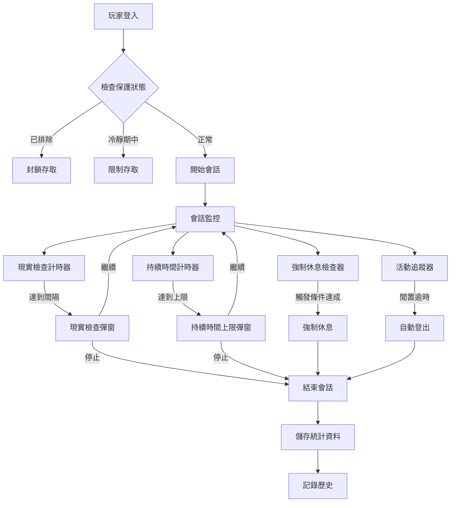

# 會話保護技術架構

> **業務需求**: [Session_Protection_Requirements.md](../../requirements/15_Responsible_Gambling/03_Session_Protection_Requirements.md)
> **規範來源**: [15-03_Cooling_Off_Period.md](../../source-archive/15_Responsible_Gambling/15-03_Cooling_Off_Period.md), [15-04_Session_Management.md](../../source-archive/15_Responsible_Gambling/15-04_Session_Management.md), [15-05_Reality_Checks.md](../../source-archive/15_Responsible_Gambling/15-05_Reality_Checks.md)
> **文件類型**: 技術架構
> **目標讀者**: 架構師、後端開發人員

---

## 1. 資料庫結構

### 1.1 冷靜期紀錄表

```sql
CREATE TABLE t_cooling_off_record (
    id                  BIGINT PRIMARY KEY AUTO_INCREMENT,
    player_id           BIGINT NOT NULL,
    start_time          DATETIME NOT NULL,
    end_time            DATETIME NOT NULL,
    duration_type       VARCHAR(20) NOT NULL,  -- H24, H48, H72, D7, D14, D30, W6, CUSTOM
    status              VARCHAR(20) NOT NULL DEFAULT 'ACTIVE',  -- ACTIVE, COMPLETED, CANCELLED

    -- Early release
    early_release_requested BOOLEAN DEFAULT FALSE,
    early_release_request_time DATETIME,
    early_release_effective_time DATETIME,

    -- Trigger source
    trigger_source      VARCHAR(50),  -- PLAYER, OPERATOR, RISK_SYSTEM
    trigger_reason      VARCHAR(500),

    -- Audit
    created_at          DATETIME DEFAULT CURRENT_TIMESTAMP,
    updated_at          DATETIME DEFAULT CURRENT_TIMESTAMP ON UPDATE CURRENT_TIMESTAMP,

    INDEX idx_player_id (player_id),
    INDEX idx_end_time (end_time),
    INDEX idx_status (status)
);
```

### 1.2 會話設定表

```sql
CREATE TABLE t_session_setting (
    id                  BIGINT PRIMARY KEY AUTO_INCREMENT,
    player_id           BIGINT NOT NULL UNIQUE,

    -- Time limits
    session_duration_minutes    INT,          -- NULL = no limit
    idle_timeout_minutes        INT DEFAULT 30,

    -- Reality check interval (minutes)
    reality_check_interval      INT DEFAULT 60,

    created_at          DATETIME DEFAULT CURRENT_TIMESTAMP,
    updated_at          DATETIME DEFAULT CURRENT_TIMESTAMP ON UPDATE CURRENT_TIMESTAMP
);
```

### 1.3 會話紀錄表

```sql
CREATE TABLE t_session_record (
    id                  BIGINT PRIMARY KEY AUTO_INCREMENT,
    player_id           BIGINT NOT NULL,
    session_token       VARCHAR(64) NOT NULL UNIQUE,

    -- Timing
    start_time          DATETIME NOT NULL,
    end_time            DATETIME,
    last_activity_time  DATETIME NOT NULL,

    -- Status
    status              VARCHAR(20) NOT NULL,  -- ACTIVE, ENDED, TIMEOUT, FORCED_BREAK
    end_reason          VARCHAR(50),           -- LOGOUT, DURATION_LIMIT, IDLE_TIMEOUT, FORCED_BREAK

    -- Statistics
    total_duration_seconds  INT,
    game_time_seconds       INT,
    total_bets              INT DEFAULT 0,
    total_stake             DECIMAL(18,2) DEFAULT 0,
    net_result              DECIMAL(18,2) DEFAULT 0,

    -- Device info
    device_type         VARCHAR(20),
    ip_address          VARCHAR(45),
    user_agent          VARCHAR(500),

    created_at          DATETIME DEFAULT CURRENT_TIMESTAMP,

    INDEX idx_player_id (player_id),
    INDEX idx_start_time (start_time),
    INDEX idx_status (status)
);
```

### 1.4 強制休息紀錄表

```sql
CREATE TABLE t_mandatory_break_record (
    id                  BIGINT PRIMARY KEY AUTO_INCREMENT,
    player_id           BIGINT NOT NULL,
    trigger_reason      VARCHAR(50) NOT NULL,  -- DEPOSIT_COUNT, DURATION_LIMIT, REGULATOR
    break_duration_minutes  INT NOT NULL,
    start_time          DATETIME NOT NULL,
    end_time            DATETIME NOT NULL,
    status              VARCHAR(20) NOT NULL,  -- ACTIVE, COMPLETED

    created_at          DATETIME DEFAULT CURRENT_TIMESTAMP,

    INDEX idx_player_id (player_id),
    INDEX idx_end_time (end_time)
);
```

### 1.5 現實檢查紀錄表

```sql
CREATE TABLE t_reality_check_record (
    id                  BIGINT PRIMARY KEY AUTO_INCREMENT,
    player_id           BIGINT NOT NULL,
    session_id          BIGINT NOT NULL,
    check_time          DATETIME NOT NULL,

    -- Displayed data
    session_duration_minutes    INT NOT NULL,
    net_result                  DECIMAL(18,2) NOT NULL,
    total_stake                 DECIMAL(18,2) NOT NULL,
    today_deposit               DECIMAL(18,2),
    account_balance             DECIMAL(18,2),

    -- Player response
    response                    VARCHAR(20),  -- CONTINUE, STOP, TIMEOUT
    response_time               DATETIME,
    response_duration_seconds   INT,          -- Thinking time

    created_at          DATETIME DEFAULT CURRENT_TIMESTAMP,

    INDEX idx_player_id (player_id),
    INDEX idx_session_id (session_id),
    INDEX idx_check_time (check_time)
);
```

---

## 2. 服務實作

### 2.1 CoolingOffManager 與 CoolingOffService

```java
/**
 * Manager class for cooling-off persistence operations.
 * SmartAdmin Pattern: @Transactional only in Manager layer with @Component.
 */
@Component
@RequiredArgsConstructor
@Slf4j
public class CoolingOffManager {

    private final CoolingOffRecordDao coolingOffRecordDao;
    private final PlayerSessionManager sessionManager;

    /**
     * Create cooling-off record and terminate sessions (transactional).
     */
    @Transactional(rollbackFor = Throwable.class)
    public CoolingOffRecord createAndEnforceCoolingOff(CoolingOffRecord record) {
        coolingOffRecordDao.insert(record);
        sessionManager.terminateAllSessions(record.getPlayerId(), "COOLING_OFF");
        return record;
    }
}

/**
 * Service class for cooling-off orchestration.
 * Delegates transactional operations to CoolingOffManager.
 */
@Service
@RequiredArgsConstructor
@Slf4j
public class CoolingOffService {

    private final CoolingOffManager coolingOffManager;
    private final CoolingOffRecordDao coolingOffRecordDao;
    private final NotificationService notificationService;

    /**
     * Start cooling-off period.
     * Delegates transactional operation to CoolingOffManager.
     */
    public ResponseDTO<CoolingOffResultVO> startCoolingOff(
            Long playerId, CoolingOffForm form) {

        if (isInCoolingOff(playerId)) {
            return ResponseDTO.error(UserErrorCode.ALREADY_IN_COOLING_OFF);
        }

        LocalDateTime startTime = LocalDateTime.now();
        LocalDateTime endTime = calculateEndTime(startTime, form.getDuration());

        CoolingOffRecord record = CoolingOffRecord.builder()
            .playerId(playerId)
            .startTime(startTime)
            .endTime(endTime)
            .durationType(form.getDuration())
            .status(CoolingOffStatus.ACTIVE)
            .triggerSource(TriggerSource.PLAYER)
            .triggerReason(form.getReason())
            .build();

        // Delegate transactional operation to Manager
        coolingOffManager.createAndEnforceCoolingOff(record);
        notificationService.sendCoolingOffStarted(playerId, record);

        log.info("Cooling-off started: playerId={}, duration={}, endTime={}",
            playerId, form.getDuration(), endTime);

        return ResponseDTO.ok(CoolingOffResultVO.builder()
            .status(CoolingOffStatus.ACTIVE)
            .startTime(startTime)
            .endTime(endTime)
            .build());
    }

    public boolean isInCoolingOff(Long playerId) {
        return coolingOffRecordDao.findActiveByPlayerId(playerId).isDefined();
    }

    /**
     * Scheduled: process expired cooling-off periods
     */
    @Scheduled(fixedRate = 60000)
    public void processExpiredCoolingOff() {
        List<CoolingOffRecord> expiredRecords =
            coolingOffRecordDao.findExpired(LocalDateTime.now());

        for (CoolingOffRecord record : expiredRecords) {
            record.setStatus(CoolingOffStatus.COMPLETED);
            coolingOffRecordDao.updateById(record);
            notificationService.sendCoolingOffEnded(record.getPlayerId());
            log.info("Cooling-off completed: playerId={}", record.getPlayerId());
        }
    }

    private LocalDateTime calculateEndTime(LocalDateTime start, DurationType duration) {
        return switch (duration) {
            case H24 -> start.plusHours(24);
            case H48 -> start.plusHours(48);
            case H72 -> start.plusHours(72);
            case D7 -> start.plusDays(7);
            case D14 -> start.plusDays(14);
            case D30 -> start.plusDays(30);
            case W6 -> start.plusWeeks(6);
            default -> start.plusHours(24);
        };
    }
}
```

### 2.2 會話管理服務

```java
/**
 * Manager class for session management persistence operations.
 * SmartAdmin Pattern: @Transactional only in Manager layer with @Component.
 */
@Component
@RequiredArgsConstructor
@Slf4j
public class SessionManagementManager {

    private final SessionRecordDao sessionRecordDao;
    private final MandatoryBreakRecordDao mandatoryBreakDao;

    /**
     * Create new session record (transactional).
     */
    @Transactional(rollbackFor = Throwable.class)
    public SessionRecord createSession(SessionRecord session) {
        sessionRecordDao.insert(session);
        return session;
    }

    /**
     * Terminate existing sessions and create mandatory break (transactional).
     */
    @Transactional(rollbackFor = Throwable.class)
    public void terminateSessionAndCreateBreak(Long playerId, MandatoryBreakRecord breakRecord) {
        sessionRecordDao.terminateByPlayerId(playerId);
        mandatoryBreakDao.insert(breakRecord);
    }
}

/**
 * Service class for session management orchestration.
 * Delegates transactional operations to SessionManagementManager.
 */
@Service
@RequiredArgsConstructor
@Slf4j
public class SessionManagementService {

    private final SessionManagementManager sessionManager;
    private final SessionRecordDao sessionRecordDao;
    private final SessionSettingDao sessionSettingDao;
    private final MandatoryBreakRecordDao mandatoryBreakDao;
    private final WebSocketSessionManager wsSessionManager;
    private final RedisTemplate<String, Object> redisTemplate;

    private static final String SESSION_KEY_PREFIX = "session:";
    private static final String ACTIVITY_KEY_PREFIX = "session:activity:";

    /**
     * Start new session.
     * Delegates transactional operation to SessionManagementManager.
     */
    public ResponseDTO<SessionStartResultVO> startSession(
            Long playerId, SessionStartForm form) {

        // 1. Check mandatory break
        Option<MandatoryBreakRecord> breakOpt = checkMandatoryBreak(playerId);
        if (breakOpt.isDefined()) {
            long remainingMinutes = calculateRemainingMinutes(breakOpt.get().getEndTime());
            return ResponseDTO.error(UserErrorCode.MANDATORY_BREAK_ACTIVE,
                String.format("Mandatory break: %d minutes remaining", remainingMinutes));
        }

        // 2. Terminate existing sessions
        terminateExistingSessions(playerId);

        // 3. Get session settings
        SessionSetting setting = sessionSettingDao.findByPlayerId(playerId)
            .getOrElse(SessionSetting::defaultSetting);

        // 4. Create new session (delegate to Manager)
        String sessionToken = generateSessionToken();
        LocalDateTime now = LocalDateTime.now();

        SessionRecord session = SessionRecord.builder()
            .playerId(playerId)
            .sessionToken(sessionToken)
            .startTime(now)
            .lastActivityTime(now)
            .status(SessionStatus.ACTIVE)
            .deviceType(form.getDeviceType())
            .ipAddress(form.getIpAddress())
            .userAgent(form.getUserAgent())
            .build();
        sessionManager.createSession(session);

        // 5. Cache session state in Redis
        cacheSessionState(playerId, session, setting);

        // 6. Schedule session tasks
        scheduleSessionTasks(playerId, session, setting);

        return ResponseDTO.ok(SessionStartResultVO.builder()
            .sessionToken(sessionToken)
            .durationLimit(setting.getSessionDurationMinutes())
            .realityCheckInterval(setting.getRealityCheckInterval())
            .build());
    }

    /**
     * Trigger mandatory break.
     * Delegates transactional operation to SessionManagementManager.
     */
    public void triggerMandatoryBreak(Long playerId, MandatoryBreakReason reason) {
        int breakDuration = getBreakDuration(reason);
        LocalDateTime now = LocalDateTime.now();

        MandatoryBreakRecord breakRecord = MandatoryBreakRecord.builder()
            .playerId(playerId)
            .triggerReason(reason.name())
            .breakDurationMinutes(breakDuration)
            .startTime(now)
            .endTime(now.plusMinutes(breakDuration))
            .status(MandatoryBreakStatus.ACTIVE)
            .build();

        // Delegate transactional operation to Manager
        sessionManager.terminateSessionAndCreateBreak(playerId, breakRecord);
        wsSessionManager.sendMessage(playerId,
            WebSocketMessage.mandatoryBreak(breakDuration));

        log.info("Mandatory break triggered: playerId={}, reason={}, duration={}min",
            playerId, reason, breakDuration);
    }

    /**
     * UK rule: check 24h deposit count
     */
    public void checkDepositCountTrigger(Long playerId) {
        int depositCount = depositService.getDepositCountLast24Hours(playerId);
        if (depositCount >= 10) {
            triggerMandatoryBreak(playerId, MandatoryBreakReason.DEPOSIT_COUNT);
        }
    }

    private int getBreakDuration(MandatoryBreakReason reason) {
        return switch (reason) {
            case DEPOSIT_COUNT -> 60;   // UK: 60 minutes
            case DURATION_LIMIT -> 5;    // DE: 5 minutes
            case REGULATOR -> 60;        // Default 60 minutes
        };
    }
}
```

### 2.3 RealityCheckManager 與 RealityCheckService

```java
/**
 * Manager class for reality check persistence operations.
 * SmartAdmin Pattern: @Transactional only in Manager layer with @Component.
 */
@Component
@RequiredArgsConstructor
@Slf4j
public class RealityCheckManager {

    private final RealityCheckRecordDao realityCheckRecordDao;

    /**
     * Update reality check record with player response (transactional).
     */
    @Transactional(rollbackFor = Throwable.class)
    public void recordPlayerResponse(RealityCheckRecord record, RealityCheckResponse response, LocalDateTime now) {
        record.setResponse(response.name());
        record.setResponseTime(now);
        record.setResponseDurationSeconds(
            (int) Duration.between(record.getCheckTime(), now).getSeconds()
        );
        realityCheckRecordDao.updateById(record);
    }
}

/**
 * Service class for reality check orchestration.
 * Delegates transactional operations to RealityCheckManager.
 */
@Service
@RequiredArgsConstructor
@Slf4j
public class RealityCheckService {

    private final RealityCheckManager realityCheckManager;
    private final RealityCheckRecordDao realityCheckRecordDao;
    private final SessionRecordDao sessionRecordDao;
    private final WalletService walletService;
    private final BetHistoryService betHistoryService;

    /**
     * Generate reality check data
     */
    public RealityCheckDataVO generateRealityCheckData(Long playerId, Long sessionId) {
        SessionRecord session = sessionRecordDao.selectById(sessionId);
        LocalDateTime now = LocalDateTime.now();

        long sessionMinutes = Duration.between(session.getStartTime(), now).toMinutes();
        BigDecimal netResult = betHistoryService.calculateSessionNetResult(
            playerId, session.getStartTime(), now);
        BigDecimal totalStake = betHistoryService.calculateSessionTotalStake(
            playerId, session.getStartTime(), now);
        BigDecimal todayDeposit = depositService.getTodayDepositTotal(playerId);
        BigDecimal balance = walletService.getBalance(playerId);

        return RealityCheckDataVO.builder()
            .sessionDurationMinutes((int) sessionMinutes)
            .netResult(netResult)
            .totalStake(totalStake)
            .todayDeposit(todayDeposit)
            .accountBalance(balance)
            .checkTime(now)
            .build();
    }

    /**
     * Record player response and analyze behavior.
     * Delegates transactional operation to RealityCheckManager.
     */
    public void recordResponse(Long recordId, RealityCheckResponse response) {
        RealityCheckRecord record = realityCheckRecordDao.selectById(recordId);
        LocalDateTime now = LocalDateTime.now();

        // Delegate transactional operation to Manager
        realityCheckManager.recordPlayerResponse(record, response, now);

        // Analyze player behavior for risk identification
        analyzePlayerBehavior(record);
    }

    /**
     * Behavioral analysis for risk identification
     */
    private void analyzePlayerBehavior(RealityCheckRecord record) {
        if (record.getResponseDurationSeconds() < 5 &&
            record.getResponse().equals("CONTINUE")) {

            int fastContinueCount = realityCheckRecordDao.countFastContinue(
                record.getPlayerId(),
                LocalDateTime.now().minusDays(7), 5);

            if (fastContinueCount >= 10) {
                riskService.flagPotentialProblemGambler(record.getPlayerId(),
                    "Excessive fast-skip of reality checks");
            }
        }
    }
}
```

### 2.4 遊戲回合感知

```java
@Service
@RequiredArgsConstructor
public class GameRoundAwareRealityCheck {

    private final GameSessionService gameSessionService;

    /**
     * Check if reality check can be shown (no active game round)
     */
    public boolean canShowRealityCheck(Long playerId) {
        Option<GameRound> activeRoundOpt = gameSessionService.getActiveRound(playerId);

        if (activeRoundOpt.isEmpty()) {
            return true;
        }

        GameRound round = activeRoundOpt.get();

        return switch (round.getGameType()) {
            case SLOTS -> round.isSpinComplete();
            case BLACKJACK -> !round.isPlayerTurn();
            case ROULETTE -> round.isBettingClosed() && round.isResultDetermined();
            case BACCARAT -> round.isResultDetermined();
            case LIVE_CASINO -> !round.isActive();
            default -> true;
        };
    }
}
```

---

## 3. 存取攔截器

```java
@Component
@RequiredArgsConstructor
public class PlayerAccessInterceptor implements HandlerInterceptor {

    private final SelfExclusionService selfExclusionService;
    private final CoolingOffService coolingOffService;

    @Override
    public boolean preHandle(HttpServletRequest request,
                            HttpServletResponse response,
                            Object handler) throws Exception {

        Long playerId = getCurrentPlayerId(request);
        if (playerId == null) {
            return true;
        }

        String path = request.getRequestURI();

        // Check self-exclusion
        if (selfExclusionService.isExcluded(playerId)) {
            if (!isAllowedForExcludedPlayer(path)) {
                throw new PlayerExcludedException("Account is excluded");
            }
        }

        // Check cooling-off
        if (coolingOffService.isInCoolingOff(playerId)) {
            if (!isAllowedDuringCoolingOff(path)) {
                Option<CoolingOffStatusVO> status =
                    coolingOffService.getCoolingOffStatus(playerId);
                throw new CoolingOffActiveException(
                    "Account in cooling-off until " + status.get().getEndTime());
            }
        }

        return true;
    }

    private boolean isAllowedDuringCoolingOff(String path) {
        return path.startsWith("/api/v1/player/profile") ||
               path.startsWith("/api/v1/player/wallet/balance") ||
               path.startsWith("/api/v1/player/wallet/withdraw") ||
               path.startsWith("/api/v1/player/history") ||
               path.startsWith("/api/v1/player/protection") ||
               path.startsWith("/api/v1/support");
    }
}
```

---

## 4. WebSocket 整合

```java
@Component
@RequiredArgsConstructor
@Slf4j
public class SessionWebSocketHandler implements WebSocketHandler {

    private final SessionManagementService sessionService;
    private final Map<Long, WebSocketSession> activeSessions = new ConcurrentHashMap<>();

    @Override
    public void handleMessage(WebSocketSession session, WebSocketMessage<?> message) {
        Long playerId = extractPlayerId(session);

        if (message instanceof PingMessage) {
            sessionService.updateActivity(playerId, session.getId());
            SessionStatusVO status = sessionService.checkSessionStatus(playerId);

            switch (status.getType()) {
                case REALITY_CHECK_DUE -> {
                    sendMessage(session, new RealityCheckMessage(status.getRealityCheckData()));
                }
                case DURATION_LIMIT_REACHED -> {
                    sendMessage(session, new SessionLimitMessage("Session duration limit reached"));
                }
                case IDLE_TIMEOUT -> {
                    sendMessage(session, new SessionTimeoutMessage("Session ended due to inactivity"));
                    sessionService.terminateSession(playerId, EndReason.IDLE_TIMEOUT);
                }
            }
        }
    }
}
```

---

## 5. 架構圖



---

## 6. 監控

| 指標 | Prometheus 名稱 | 說明 |
|------|----------------|------|
| 冷靜期啟動數 | `rg_cooling_off_started_total` | 依持續時間分類 |
| 冷靜期中玩家數 | `rg_cooling_off_active_gauge` | 即時計數 |
| 平均會話持續時間 | `session_duration_seconds_avg` | 所有會話 |
| 會話逾時率 | `session_timeout_rate` | 閒置逾時百分比 |
| 強制休息觸發數 | `mandatory_break_total` | 依原因分類 |
| 現實檢查觸發數 | `reality_check_triggered_total` | 總計數 |
| 現實檢查繼續率 | `reality_check_continue_rate` | 繼續遊戲百分比 |
| 快速跳過率 | `reality_check_fast_skip_rate` | < 5 秒回應率 |

---

## 相關文件

- [Session_Protection_Requirements.md](../../requirements/15_Responsible_Gambling/03_Session_Protection_Requirements.md) — 業務需求
- [Self_Exclusion_Architecture.md](01_Self_Exclusion_Architecture.md) — 自我排除架構
- [Player_Protection_API.md](04_Player_Protection_API.md) — 統一 API 架構

---

**返回**: [負責任博弈模組](../../source-archive/15_Responsible_Gambling/README.md) | [iGaming 首頁](../../source-archive/README.md)
