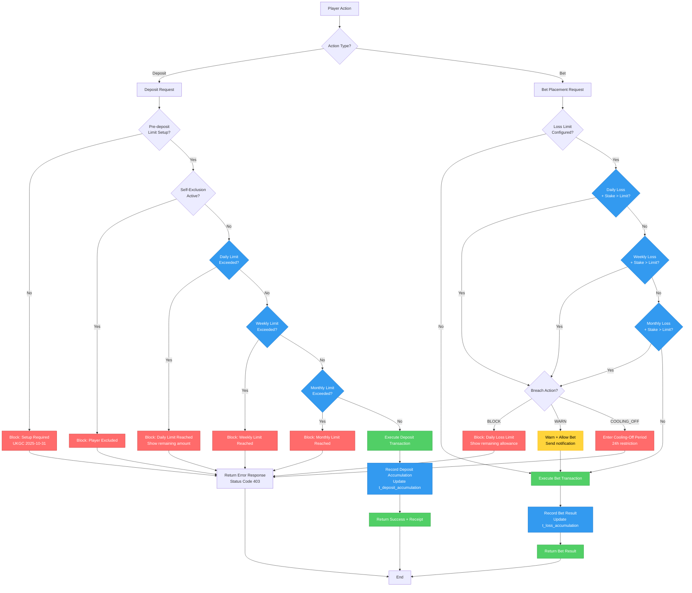

# 存款及虧損限額技術架構

> **業務需求**: [Deposit_Limits_Requirements.md](../../requirements/15_Responsible_Gambling/Deposit_Limits_Requirements.md)
> **規範來源**: [15-02_Deposit_Limits.md](../../source-archive/15_Responsible_Gambling/15-02_Deposit_Limits.md), [15-06_Loss_Limits.md](../../source-archive/15_Responsible_Gambling/15-06_Loss_Limits.md)
> **文件類型**: 技術架構
> **目標讀者**: 架構師、後端開發人員

---

## 1. 資料庫結構

### 1.1 存款限額設定表

```sql
CREATE TABLE t_deposit_limit_setting (
    id                  BIGINT PRIMARY KEY AUTO_INCREMENT,
    player_id           BIGINT NOT NULL UNIQUE,

    -- Current effective limits
    daily_limit         DECIMAL(18,2),      -- NULL = no limit
    weekly_limit        DECIMAL(18,2),
    monthly_limit       DECIMAL(18,2),

    -- Pending limits (during cooling-off for increases)
    pending_daily_limit     DECIMAL(18,2),
    pending_weekly_limit    DECIMAL(18,2),
    pending_monthly_limit   DECIMAL(18,2),
    pending_effective_time  DATETIME,

    -- Limit source
    limit_source        VARCHAR(20) DEFAULT 'PLAYER',  -- PLAYER, OPERATOR, REGULATOR, AFFORDABILITY

    -- Audit
    created_at          DATETIME DEFAULT CURRENT_TIMESTAMP,
    updated_at          DATETIME DEFAULT CURRENT_TIMESTAMP ON UPDATE CURRENT_TIMESTAMP,

    INDEX idx_player_id (player_id)
);
```

### 1.2 存款限額歷史表

```sql
CREATE TABLE t_deposit_limit_history (
    id                  BIGINT PRIMARY KEY AUTO_INCREMENT,
    player_id           BIGINT NOT NULL,
    change_type         VARCHAR(20) NOT NULL,  -- DECREASE, INCREASE, REMOVE, SET
    limit_type          VARCHAR(20) NOT NULL,  -- DAILY, WEEKLY, MONTHLY
    old_value           DECIMAL(18,2),
    new_value           DECIMAL(18,2),
    effective_time      DATETIME NOT NULL,
    reason              VARCHAR(500),
    initiated_by        VARCHAR(50) NOT NULL,  -- PLAYER, OPERATOR, SYSTEM

    created_at          DATETIME DEFAULT CURRENT_TIMESTAMP,

    INDEX idx_player_id (player_id),
    INDEX idx_created_at (created_at)
);
```

### 1.3 存款累計表

```sql
CREATE TABLE t_deposit_accumulation (
    id                  BIGINT PRIMARY KEY AUTO_INCREMENT,
    player_id           BIGINT NOT NULL,
    period_type         VARCHAR(20) NOT NULL,  -- DAILY, WEEKLY, MONTHLY
    period_start        DATE NOT NULL,
    accumulated_amount  DECIMAL(18,2) NOT NULL DEFAULT 0,

    UNIQUE KEY uk_player_period (player_id, period_type, period_start),
    INDEX idx_period_start (period_start)
);
```

### 1.4 虧損限額設定表

```sql
CREATE TABLE t_loss_limit_setting (
    id                  BIGINT PRIMARY KEY AUTO_INCREMENT,
    player_id           BIGINT NOT NULL UNIQUE,

    -- Limit settings
    daily_loss_limit    DECIMAL(18,2),
    weekly_loss_limit   DECIMAL(18,2),
    monthly_loss_limit  DECIMAL(18,2),

    -- Breach action
    breach_action       VARCHAR(20) DEFAULT 'BLOCK',  -- BLOCK, WARN, COOLING_OFF

    -- Pending limits (increase requires cooling-off)
    pending_daily       DECIMAL(18,2),
    pending_weekly      DECIMAL(18,2),
    pending_monthly     DECIMAL(18,2),
    pending_effective_time DATETIME,

    created_at          DATETIME DEFAULT CURRENT_TIMESTAMP,
    updated_at          DATETIME DEFAULT CURRENT_TIMESTAMP ON UPDATE CURRENT_TIMESTAMP
);
```

### 1.5 虧損累計表

```sql
CREATE TABLE t_loss_accumulation (
    id                  BIGINT PRIMARY KEY AUTO_INCREMENT,
    player_id           BIGINT NOT NULL,
    period_type         VARCHAR(20) NOT NULL,  -- DAILY, WEEKLY, MONTHLY
    period_start        DATE NOT NULL,

    total_stake         DECIMAL(18,2) NOT NULL DEFAULT 0,
    total_win           DECIMAL(18,2) NOT NULL DEFAULT 0,
    net_loss            DECIMAL(18,2) NOT NULL DEFAULT 0,  -- = stake - win

    last_updated        DATETIME DEFAULT CURRENT_TIMESTAMP ON UPDATE CURRENT_TIMESTAMP,

    UNIQUE KEY uk_player_period (player_id, period_type, period_start),
    INDEX idx_period_start (period_start)
);
```

### 1.6 存款前限額設定表（UKGC 2025-10-31）

```sql
ALTER TABLE t_player_protection_settings
ADD COLUMN pre_deposit_limit_set BOOLEAN DEFAULT FALSE
COMMENT 'Pre-deposit limit setup completed flag (UKGC 2025-10-31)';

CREATE TABLE t_pre_deposit_limit_setup (
    id                  BIGINT PRIMARY KEY AUTO_INCREMENT,
    player_id           BIGINT NOT NULL UNIQUE,
    jurisdiction        VARCHAR(20) NOT NULL,
    setup_completed_at  DATETIME,
    initial_daily_limit     DECIMAL(18,2),
    initial_weekly_limit    DECIMAL(18,2),
    initial_monthly_limit   DECIMAL(18,2),
    acknowledgment_text     VARCHAR(500),
    ip_address              VARCHAR(45),
    user_agent              VARCHAR(500),

    created_at          DATETIME DEFAULT CURRENT_TIMESTAMP,

    INDEX idx_player_id (player_id),
    INDEX idx_jurisdiction (jurisdiction)
);
```

### 1.7 存款限額對帳表

```sql
CREATE TABLE t_deposit_limit_reconciliation (
    id                  BIGINT PRIMARY KEY AUTO_INCREMENT,
    reconciliation_date DATE NOT NULL,
    player_id           BIGINT NOT NULL,
    jurisdiction        VARCHAR(20) NOT NULL,

    -- Configured limits
    configured_daily    DECIMAL(18,2),
    configured_weekly   DECIMAL(18,2),
    configured_monthly  DECIMAL(18,2),

    -- Actual deposits
    actual_daily        DECIMAL(18,2),
    actual_weekly       DECIMAL(18,2),
    actual_monthly      DECIMAL(18,2),

    -- Status
    daily_status        VARCHAR(20),  -- OK, WARNING, BREACH
    weekly_status       VARCHAR(20),
    monthly_status      VARCHAR(20),

    -- Breach details
    breach_amount       DECIMAL(18,2),
    resolution_action   VARCHAR(100),
    resolved_at         DATETIME,

    created_at          DATETIME DEFAULT CURRENT_TIMESTAMP,

    UNIQUE KEY uk_date_player (reconciliation_date, player_id),
    INDEX idx_status (daily_status, weekly_status, monthly_status)
);
```

---

## 2. 服務實作

### 2.1 DepositLimitService

```java
@Service
@RequiredArgsConstructor
@Slf4j
public class DepositLimitService {

    private final DepositLimitSettingDao limitSettingDao;
    private final DepositLimitHistoryDao limitHistoryDao;
    private final DepositAccumulationDao accumulationDao;
    private final NotificationService notificationService;

    /**
     * Check if deposit exceeds limit
     * @return Option.none() = can deposit, Option.some() = limit breach
     */
    public Option<LimitBreachResult> checkDepositLimit(Long playerId, BigDecimal amount) {
        Option<DepositLimitSetting> settingOpt = limitSettingDao.findByPlayerId(playerId);

        if (settingOpt.isEmpty()) {
            return Option.none();
        }

        DepositLimitSetting setting = settingOpt.get();
        LocalDate today = LocalDate.now(ZoneOffset.UTC);

        // Check daily limit
        if (setting.getDailyLimit() != null) {
            BigDecimal dailyAccumulated = getAccumulatedAmount(playerId, PeriodType.DAILY, today);
            BigDecimal dailyRemaining = setting.getDailyLimit().subtract(dailyAccumulated);

            if (amount.compareTo(dailyRemaining) > 0) {
                return Option.some(LimitBreachResult.builder()
                    .limitType(LimitType.DAILY)
                    .limit(setting.getDailyLimit())
                    .accumulated(dailyAccumulated)
                    .remaining(dailyRemaining.max(BigDecimal.ZERO))
                    .message("Daily deposit limit exceeded")
                    .build());
            }
        }

        // Check weekly limit
        if (setting.getWeeklyLimit() != null) {
            LocalDate weekStart = today.with(DayOfWeek.MONDAY);
            BigDecimal weeklyAccumulated = getAccumulatedAmount(playerId, PeriodType.WEEKLY, weekStart);
            BigDecimal weeklyRemaining = setting.getWeeklyLimit().subtract(weeklyAccumulated);

            if (amount.compareTo(weeklyRemaining) > 0) {
                return Option.some(LimitBreachResult.builder()
                    .limitType(LimitType.WEEKLY)
                    .limit(setting.getWeeklyLimit())
                    .accumulated(weeklyAccumulated)
                    .remaining(weeklyRemaining.max(BigDecimal.ZERO))
                    .build());
            }
        }

        // Check monthly limit
        if (setting.getMonthlyLimit() != null) {
            LocalDate monthStart = today.withDayOfMonth(1);
            BigDecimal monthlyAccumulated = getAccumulatedAmount(playerId, PeriodType.MONTHLY, monthStart);
            BigDecimal monthlyRemaining = setting.getMonthlyLimit().subtract(monthlyAccumulated);

            if (amount.compareTo(monthlyRemaining) > 0) {
                return Option.some(LimitBreachResult.builder()
                    .limitType(LimitType.MONTHLY)
                    .limit(setting.getMonthlyLimit())
                    .accumulated(monthlyAccumulated)
                    .remaining(monthlyRemaining.max(BigDecimal.ZERO))
                    .build());
            }
        }

        return Option.none();
    }

    /**
     * Scheduled task: process pending limit increases
     */
    @Scheduled(fixedRate = 60000)
    public void processPendingLimitIncreases() {
        LocalDateTime now = LocalDateTime.now();
        List<DepositLimitSetting> pendingSettings =
            limitSettingDao.findPendingEffective(now);

        for (DepositLimitSetting setting : pendingSettings) {
            applyPendingLimits(setting);
            limitSettingDao.updateById(setting);
            notificationService.sendLimitIncreaseEffective(setting.getPlayerId());
            log.info("Pending limit increase applied: playerId={}", setting.getPlayerId());
        }
    }
}
```

### 2.2 LossLimitService

```java
/**
 * Manager class for loss limit persistence operations.
 * SmartAdmin Pattern: @Transactional only in Manager layer with @Component.
 */
@Component
@RequiredArgsConstructor
@Slf4j
public class LossLimitManager {

    private final LossAccumulationDao lossAccumulationDao;

    /**
     * Record bet result (update loss accumulation) - transactional.
     */
    @Transactional(rollbackFor = Throwable.class)
    public void recordBetResultAccumulation(Long playerId, BigDecimal stakeAmount, BigDecimal winAmount) {
        LocalDate today = LocalDate.now(ZoneOffset.UTC);

        updateAccumulation(playerId, PeriodType.DAILY, today, stakeAmount, winAmount);
        updateAccumulation(playerId, PeriodType.WEEKLY, today.with(DayOfWeek.MONDAY), stakeAmount, winAmount);
        updateAccumulation(playerId, PeriodType.MONTHLY, today.withDayOfMonth(1), stakeAmount, winAmount);
    }

    private void updateAccumulation(Long playerId, PeriodType type, LocalDate periodStart,
                                    BigDecimal stakeAmount, BigDecimal winAmount) {
        // Update logic implementation
    }
}

/**
 * Service class for loss limit orchestration.
 * Delegates transactional operations to LossLimitManager.
 */
@Service
@RequiredArgsConstructor
@Slf4j
public class LossLimitService {

    private final LossLimitSettingDao lossLimitSettingDao;
    private final LossAccumulationDao lossAccumulationDao;
    private final LossLimitManager lossLimitManager;

    /**
     * Check if bet exceeds loss limit
     */
    public Option<LossLimitBreachResult> checkLossLimit(Long playerId, BigDecimal stakeAmount) {
        Option<LossLimitSetting> settingOpt = lossLimitSettingDao.findByPlayerId(playerId);

        if (settingOpt.isEmpty()) {
            return Option.none();
        }

        LossLimitSetting setting = settingOpt.get();
        LocalDate today = LocalDate.now(ZoneOffset.UTC);

        // Check daily loss limit
        if (setting.getDailyLossLimit() != null) {
            BigDecimal dailyLoss = getCurrentLoss(playerId, PeriodType.DAILY, today);
            BigDecimal projectedLoss = dailyLoss.add(stakeAmount);

            if (projectedLoss.compareTo(setting.getDailyLossLimit()) > 0) {
                BigDecimal remaining = setting.getDailyLossLimit().subtract(dailyLoss)
                    .max(BigDecimal.ZERO);
                return Option.some(LossLimitBreachResult.builder()
                    .limitType(LimitType.DAILY)
                    .limit(setting.getDailyLossLimit())
                    .currentLoss(dailyLoss)
                    .remainingAllowedLoss(remaining)
                    .build());
            }
        }

        // Weekly and monthly checks follow same pattern...
        return Option.none();
    }

    /**
     * Record bet result (update loss accumulation).
     * Delegates transactional operation to LossLimitManager.
     */
    public void recordBetResult(Long playerId, BigDecimal stakeAmount, BigDecimal winAmount) {
        lossLimitManager.recordBetResultAccumulation(playerId, stakeAmount, winAmount);
    }
}
```

### 2.3 與支付和投注服務整合

```java
/**
 * Manager class for deposit persistence operations.
 * SmartAdmin Pattern: @Transactional only in Manager layer with @Component.
 */
@Component
@RequiredArgsConstructor
public class DepositManager {

    private final DepositDao depositDao;
    private final DepositLimitAccumulationDao accumulationDao;

    /**
     * Process deposit and update accumulation (transactional).
     */
    @Transactional(rollbackFor = Throwable.class)
    public DepositResultVO processDeposit(Long playerId, BigDecimal amount) {
        // Insert deposit record
        DepositEntity deposit = DepositEntity.builder()
            .playerId(playerId)
            .amount(amount)
            .status(DepositStatus.COMPLETED)
            .createdAt(LocalDateTime.now())
            .build();
        depositDao.insert(deposit);

        // Update deposit limit accumulation
        accumulationDao.addDailyAccumulation(playerId, amount);
        accumulationDao.addWeeklyAccumulation(playerId, amount);
        accumulationDao.addMonthlyAccumulation(playerId, amount);

        return DepositResultVO.builder()
            .depositId(deposit.getId())
            .status(deposit.getStatus())
            .build();
    }
}

/**
 * Service class for deposit orchestration.
 * Delegates transactional operations to DepositManager.
 */
@Service
@RequiredArgsConstructor
public class DepositService {

    private final PreDepositLimitService preDepositLimitService;
    private final DepositLimitService depositLimitService;
    private final DepositManager depositManager;

    /**
     * Deposit with limit checking.
     * Delegates transactional operation to DepositManager.
     */
    public ResponseDTO<DepositResultVO> deposit(Long playerId, DepositForm form) {

        // 0. Pre-deposit limit check (UKGC 2025-10-31)
        String jurisdiction = playerService.getJurisdiction(playerId);
        if (!preDepositLimitService.hasCompletedPreDepositLimitSetup(playerId, jurisdiction)) {
            return ResponseDTO.error(UserErrorCode.PRE_DEPOSIT_LIMIT_REQUIRED,
                "Please set deposit limits before depositing");
        }

        // 1. Check self-exclusion
        if (selfExclusionService.isExcluded(playerId)) {
            return ResponseDTO.error(UserErrorCode.PLAYER_EXCLUDED);
        }

        // 2. Check deposit limit
        Option<LimitBreachResult> limitBreachOpt =
            depositLimitService.checkDepositLimit(playerId, form.getAmount());

        if (limitBreachOpt.isDefined()) {
            LimitBreachResult breach = limitBreachOpt.get();
            return ResponseDTO.error(UserErrorCode.DEPOSIT_LIMIT_EXCEEDED,
                String.format("Exceeded %s limit. Limit: %s, Deposited: %s, Remaining: %s",
                    breach.getLimitType().getDisplayName(),
                    breach.getLimit(), breach.getAccumulated(), breach.getRemaining()));
        }

        // 3. Execute deposit (delegate transactional operation to Manager)
        DepositResultVO result = depositManager.processDeposit(playerId, form.getAmount());

        return ResponseDTO.ok(result);
    }
}
```

---

## 3. 對帳 SQL

```sql
-- Daily deposit limit reconciliation
SELECT
    p.id AS player_id,
    ps.daily_deposit_limit AS configured_limit,
    COALESCE(SUM(pt.amount), 0) AS actual_deposits,
    CASE
        WHEN SUM(pt.amount) > ps.daily_deposit_limit THEN 'BREACH'
        WHEN SUM(pt.amount) > ps.daily_deposit_limit * 0.9 THEN 'WARNING'
        ELSE 'OK'
    END AS status,
    SUM(pt.amount) - ps.daily_deposit_limit AS breach_amount
FROM t_player p
JOIN t_player_protection_settings ps ON p.id = ps.player_id
LEFT JOIN t_payment_transaction pt ON p.id = pt.player_id
    AND pt.type = 'DEPOSIT'
    AND pt.status = 'SUCCESS'
    AND DATE(pt.created_at) = CURDATE() - INTERVAL 1 DAY
WHERE ps.daily_deposit_limit IS NOT NULL
  AND p.jurisdiction = 'UKGC'
GROUP BY p.id, ps.daily_deposit_limit
HAVING status = 'BREACH';
```

---

## 4. 存款/虧損限額執行管線

### 4.1 端對端執行流程

以下圖表展示存款和虧損限額的完整執行管線：



### 4.2 執行規則摘要

**存款限額（階層式執行）**：
1. **存款前設定** (P0)：UKGC 玩家未設定限額則阻擋 (2025-10-31)
2. **自我排除** (P0)：排除期間阻擋所有存款
3. **每日限額** (P1)：檢查當日累計存款（UTC 00:00 重置）
4. **每週限額** (P2)：檢查當週累計存款（週一重置）
5. **每月限額** (P3)：檢查當月累計存款

**虧損限額（可配置操作）**：
- **BLOCK**：超過限額時阻擋投注（預設）
- **WARN**：允許投注但發送通知（高額玩家）
- **COOLING_OFF**：觸發 24 小時冷靜期（監管要求）

**限額適用順序**：
```
存款前設定 (UKGC) → 自我排除 → 每日 → 每週 → 每月
```

任何檢查失敗即立即阻擋交易（fail-fast 模式）。

### 4.3 累計計算

**存款累計**：
```java
// Period boundaries (UTC)
LocalDate today = LocalDate.now(ZoneOffset.UTC);
LocalDate weekStart = today.with(DayOfWeek.MONDAY);
LocalDate monthStart = today.withDayOfMonth(1);

// Query accumulated amount
BigDecimal accumulated = depositAccumulationDao
    .selectOne(Wrappers.lambdaQuery(DepositAccumulation.class)
        .eq(DepositAccumulation::getPlayerId, playerId)
        .eq(DepositAccumulation::getPeriodType, periodType)
        .eq(DepositAccumulation::getPeriodStart, periodStart))
    .map(DepositAccumulation::getAccumulatedAmount)
    .getOrElse(BigDecimal.ZERO);
```

**虧損累計**：
```java
// Net loss calculation
BigDecimal netLoss = totalStake.subtract(totalWin);

// Update atomic operation
lossAccumulationDao.updateAccumulation(
    playerId,
    periodType,
    periodStart,
    stakeAmount,
    winAmount
);
```

### 4.4 錯誤回應格式

```json
{
  "code": 40301,
  "msg": "Deposit limit exceeded",
  "data": {
    "limitType": "DAILY",
    "limit": "500.00",
    "accumulated": "450.00",
    "remaining": "50.00",
    "requestedAmount": "100.00",
    "excessAmount": "50.00",
    "resetTime": "2026-02-11T00:00:00Z"
  }
}
```

---

## 5. 監控

| 指標 | Prometheus 名稱 | 說明 |
|------|-----------------|------|
| 限額採用率 | `rg_deposit_limit_adoption_rate` | 有限額玩家 / 總玩家數 |
| 限額違規 | `rg_deposit_limit_breaches_total` | 按限額類型 |
| 限額變更 | `rg_deposit_limit_changes_total` | 按方向（增加/減少） |
| 待生效增額 | `rg_pending_limit_increases_gauge` | 冷靜期中 |
| 虧損限額違規 | `loss_limit_breaches_total` | 按限額類型 |
| 玩家虧損分佈 | `player_loss_distribution` | 虧損集中度分析 |

---

## 合規缺口說明（Compliance Gap Notes）

> **限額成效量化缺口**: 目前存款/虧損限額架構實現了限額強制執行，但缺乏成效量化：
> - **限額觸發保護率**: 觸發限額後玩家資金損失減少的比例
> - **限額調整模式**: 玩家頻繁上調限額的偵測及預警
> - **冷卻期有效性**: 限額調整冷卻期（72 小時）對衝動行為抑制的量化效果
>
> **待辦**: 需補充限額成效 KPI 定義及與 Self_Exclusion 的聯動觸發規則。

---

## 相關文件

- [Deposit_Limits_Requirements.md](../../requirements/15_Responsible_Gambling/Deposit_Limits_Requirements.md) — 業務需求
- [Self_Exclusion_Architecture.md](Self_Exclusion_Architecture.md) — 自我排除架構
- [Player_Protection_API.md](Player_Protection_API.md) — 統一 API 架構

---

**返回**: [負責任博弈模組](../../source-archive/15_Responsible_Gambling/README.md) | [iGaming 首頁](../../source-archive/README.md)
