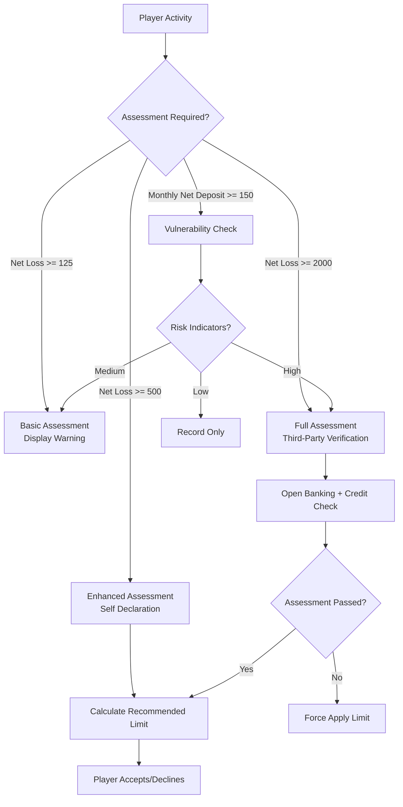

# Player Protection API Architecture (玩家保護 API 技術架構)

> **Business Requirements**: [Affordability_Requirements.md](../../requirements/15_Responsible_Gambling/Affordability_Requirements.md)
> **Canonical Source**: [15-07_Player_Protection_API.md](../../source-archive/15_Responsible_Gambling/15-07_Player_Protection_API.md), [15-08_Affordability_Assessment.md](../../source-archive/15_Responsible_Gambling/15-08_Affordability_Assessment.md)
> **View Type**: Technical Architecture
> **Target Audience**: Architects, Backend Developers

---

## 1. API Specification

### 1.1 Player-Facing Endpoints

| Endpoint | Method | Description |
|----------|--------|-------------|
| `/api/v1/player/protection/settings` | GET | Get all protection settings |
| `/api/v1/player/protection/settings` | PUT | Update protection settings |
| `/api/v1/player/protection/deposit-limits` | GET | Get deposit limits |
| `/api/v1/player/protection/deposit-limits` | PUT | Set deposit limits |
| `/api/v1/player/protection/loss-limits` | GET | Get loss limits |
| `/api/v1/player/protection/loss-limits` | PUT | Set loss limits |
| `/api/v1/player/protection/self-exclusion` | POST | Request self-exclusion |
| `/api/v1/player/protection/self-exclusion/revoke` | POST | Request exclusion revocation |
| `/api/v1/player/protection/cooling-off` | POST | Start cooling-off period |
| `/api/v1/player/protection/session-limits` | GET | Get session limits |
| `/api/v1/player/protection/session-limits` | PUT | Set session limits |
| `/api/v1/player/protection/activity-history` | GET | Get activity history |
| `/api/v1/player/protection/usage` | GET | Get limit usage |

### 1.2 Admin-Facing Endpoints

| Endpoint | Method | Description |
|----------|--------|-------------|
| `/api/v1/admin/protection/exclusions` | GET | List excluded players |
| `/api/v1/admin/protection/exclusions/{playerId}` | GET | Player exclusion details |
| `/api/v1/admin/protection/exclusions/{playerId}` | POST | Operator-exclude player |
| `/api/v1/admin/protection/reports` | GET | Compliance reports |
| `/api/v1/admin/protection/reports/export` | POST | Export reports |
| `/api/v1/admin/protection/gamstop/sync` | POST | Gamstop sync |
| `/api/v1/admin/protection/gamstop/check` | POST | Gamstop check |

---

## 2. Controller Implementation

```java
@RestController
@RequestMapping("/api/v1/player/protection")
@RequiredArgsConstructor
@Tag(name = "Player Protection", description = "Responsible Gambling API")
public class PlayerProtectionController {

    private final PlayerProtectionService protectionService;
    private final DepositLimitService depositLimitService;
    private final LossLimitService lossLimitService;
    private final SelfExclusionService selfExclusionService;
    private final CoolingOffService coolingOffService;
    private final SessionManagementService sessionService;

    @GetMapping("/settings")
    @Operation(summary = "Get protection settings overview")
    public ResponseDTO<ProtectionSettingsVO> getSettings() {
        Long playerId = StpUtil.getLoginIdAsLong();
        return ResponseDTO.ok(protectionService.getSettings(playerId));
    }

    @PutMapping("/deposit-limits")
    @Operation(summary = "Set deposit limits")
    public ResponseDTO<LimitUpdateResultVO> setDepositLimits(
            @Valid @RequestBody DepositLimitForm form) {
        Long playerId = StpUtil.getLoginIdAsLong();
        return depositLimitService.setDepositLimits(playerId, form);
    }

    @PutMapping("/loss-limits")
    @Operation(summary = "Set loss limits")
    public ResponseDTO<LimitUpdateResultVO> setLossLimits(
            @Valid @RequestBody LossLimitForm form) {
        Long playerId = StpUtil.getLoginIdAsLong();
        return lossLimitService.setLossLimits(playerId, form);
    }

    @PostMapping("/self-exclusion")
    @Operation(summary = "Request self-exclusion")
    public ResponseDTO<ExclusionResultVO> requestSelfExclusion(
            @Valid @RequestBody SelfExclusionForm form) {
        Long playerId = StpUtil.getLoginIdAsLong();
        return selfExclusionService.requestSelfExclusion(playerId, form);
    }

    @PostMapping("/cooling-off")
    @Operation(summary = "Start cooling-off period")
    public ResponseDTO<CoolingOffResultVO> startCoolingOff(
            @Valid @RequestBody CoolingOffForm form) {
        Long playerId = StpUtil.getLoginIdAsLong();
        return coolingOffService.startCoolingOff(playerId, form);
    }

    @GetMapping("/usage")
    @Operation(summary = "Get limit usage")
    public ResponseDTO<LimitUsageVO> getLimitUsage() {
        Long playerId = StpUtil.getLoginIdAsLong();
        return ResponseDTO.ok(protectionService.getLimitUsage(playerId));
    }

    @GetMapping("/activity-history")
    @Operation(summary = "Get activity history")
    public ResponseDTO<PageResult<ActivityHistoryVO>> getActivityHistory(
            @Valid ActivityHistoryQueryForm queryForm) {
        Long playerId = StpUtil.getLoginIdAsLong();
        return ResponseDTO.ok(protectionService.getActivityHistory(playerId, queryForm));
    }
}
```

---

## 3. API Response Examples

### 3.1 Protection Settings Overview

```json
{
  "code": 200,
  "msg": "success",
  "data": {
    "selfExclusion": { "active": false, "endTime": null },
    "coolingOff": { "active": false, "endTime": null },
    "depositLimits": {
      "daily": 1000.00,
      "weekly": 5000.00,
      "monthly": 15000.00,
      "pendingChanges": []
    },
    "lossLimits": {
      "daily": 500.00,
      "weekly": 2000.00,
      "monthly": null,
      "pendingChanges": []
    },
    "sessionLimits": {
      "durationMinutes": 60,
      "idleTimeoutMinutes": 30,
      "realityCheckIntervalMinutes": 30
    },
    "lastUpdated": "2026-02-07T10:30:00Z"
  }
}
```

### 3.2 Limit Usage Response

```json
{
  "code": 200,
  "msg": "success",
  "data": {
    "depositLimits": {
      "daily": { "limit": 1000.00, "used": 350.00, "remaining": 650.00, "percentage": 35, "resetTime": "2026-02-08T00:00:00Z" },
      "weekly": { "limit": 5000.00, "used": 1200.00, "remaining": 3800.00, "percentage": 24, "resetTime": "2026-02-12T00:00:00Z" },
      "monthly": { "limit": 15000.00, "used": 4500.00, "remaining": 10500.00, "percentage": 30, "resetTime": "2026-03-01T00:00:00Z" }
    },
    "lossLimits": {
      "daily": { "limit": 500.00, "current": 120.00, "remaining": 380.00, "percentage": 24, "resetTime": "2026-02-08T00:00:00Z" },
      "weekly": { "limit": 2000.00, "current": 450.00, "remaining": 1550.00, "percentage": 22.5, "resetTime": "2026-02-12T00:00:00Z" }
    },
    "session": { "currentDuration": 45, "limitMinutes": 60, "nextRealityCheck": "2026-02-07T11:00:00Z" }
  }
}
```

---

## 4. Affordability Assessment Database Schema

```sql
CREATE TABLE t_affordability_assessment (
    id                  BIGINT PRIMARY KEY AUTO_INCREMENT,
    player_id           BIGINT NOT NULL,
    assessment_type     VARCHAR(20) NOT NULL,  -- BASIC, ENHANCED, FULL
    trigger_reason      VARCHAR(50) NOT NULL,  -- NET_LOSS, DEPOSIT_VELOCITY, MANUAL
    trigger_value       DECIMAL(18,2),

    -- Player declaration data
    declared_income_range       VARCHAR(20),
    declared_housing_status     VARCHAR(20),
    declared_household_size     INT,
    declared_monthly_disposable DECIMAL(18,2),

    -- Third-party verification
    third_party_verified    BOOLEAN DEFAULT FALSE,
    third_party_provider    VARCHAR(50),
    third_party_result      JSON,
    verified_at             DATETIME,

    -- Assessment result
    assessment_result       VARCHAR(20),       -- PASSED, FAILED, PENDING, EXPIRED
    recommended_limit       DECIMAL(18,2),
    applied_limit           DECIMAL(18,2),
    risk_tier               VARCHAR(20),       -- LOW, MEDIUM, HIGH, CRITICAL

    -- Validity
    valid_from              DATETIME NOT NULL,
    valid_until             DATETIME NOT NULL,

    -- Audit
    created_at              DATETIME DEFAULT CURRENT_TIMESTAMP,
    updated_at              DATETIME DEFAULT CURRENT_TIMESTAMP ON UPDATE CURRENT_TIMESTAMP,

    INDEX idx_player_id (player_id),
    INDEX idx_valid_until (valid_until),
    INDEX idx_assessment_result (assessment_result)
);

CREATE TABLE t_financial_vulnerability_indicator (
    id                  BIGINT PRIMARY KEY AUTO_INCREMENT,
    player_id           BIGINT NOT NULL,
    indicator_type      VARCHAR(50) NOT NULL,  -- CHASING_LOSSES, DEPOSIT_VELOCITY, UNUSUAL_PATTERN
    indicator_value     VARCHAR(255),
    severity            VARCHAR(20) NOT NULL,  -- LOW, MEDIUM, HIGH
    detected_at         DATETIME NOT NULL,
    resolved            BOOLEAN DEFAULT FALSE,
    resolved_at         DATETIME,
    resolution_action   VARCHAR(100),

    INDEX idx_player_id (player_id),
    INDEX idx_detected_at (detected_at)
);
```

---

## 5. Affordability Assessment Service

```java
/**
 * Manager class for affordability assessment persistence operations.
 * SmartAdmin Pattern: @Transactional only in Manager layer with @Component.
 */
@Component
@RequiredArgsConstructor
@Slf4j
public class AffordabilityAssessmentManager {

    private final AffordabilityAssessmentDao assessmentDao;
    private final DepositLimitService depositLimitService;

    /**
     * Save full assessment and apply limit if failed (transactional).
     */
    @Transactional(rollbackFor = Throwable.class)
    public AffordabilityAssessment saveFullAssessment(AffordabilityAssessment assessment, boolean forceLimit, Long playerId, BigDecimal appliedLimit) {
        assessmentDao.insert(assessment);

        if (forceLimit) {
            depositLimitService.forceApplyLimit(playerId, appliedLimit, "AFFORDABILITY_ASSESSMENT");
        }

        log.info("Full affordability assessment completed: playerId={}, result={}, limit={}",
            playerId, assessment.getAssessmentResult(), appliedLimit);

        return assessment;
    }
}

/**
 * Service class for affordability assessment orchestration.
 * Delegates transactional operations to AffordabilityAssessmentManager.
 */
@Service
@RequiredArgsConstructor
@Slf4j
public class AffordabilityAssessmentService {

    private final AffordabilityAssessmentManager assessmentManager;
    private final AffordabilityAssessmentDao assessmentDao;
    private final FinancialVulnerabilityDao vulnerabilityDao;
    private final OpenBankingClient openBankingClient;
    private final CreditReferenceClient creditClient;

    /**
     * Check if affordability assessment is required
     */
    public Option<AssessmentRequirement> checkAssessmentRequired(Long playerId) {
        Option<AffordabilityAssessment> currentAssessmentOpt =
            assessmentDao.findLatestValid(playerId);

        BigDecimal annualNetLoss = calculateAnnualNetLoss(playerId);
        AssessmentType requiredType = determineAssessmentType(annualNetLoss);

        if (requiredType == null) {
            return Option.none();
        }

        if (currentAssessmentOpt.isDefined()) {
            AffordabilityAssessment current = currentAssessmentOpt.get();
            if (current.getAssessmentType().ordinal() >= requiredType.ordinal() &&
                current.getValidUntil().isAfter(LocalDateTime.now())) {
                return Option.none();
            }
        }

        return Option.some(AssessmentRequirement.builder()
            .type(requiredType)
            .reason(determineTriggerReason(annualNetLoss))
            .triggerValue(annualNetLoss)
            .build());
    }

    private AssessmentType determineAssessmentType(BigDecimal annualNetLoss) {
        if (annualNetLoss.compareTo(new BigDecimal("2000")) > 0) {
            return AssessmentType.FULL;
        } else if (annualNetLoss.compareTo(new BigDecimal("500")) > 0) {
            return AssessmentType.ENHANCED;
        } else if (annualNetLoss.compareTo(new BigDecimal("125")) > 0) {
            return AssessmentType.BASIC;
        }
        return null;
    }

    /**
     * Perform full assessment (third-party verification).
     * Delegates transactional operation to AffordabilityAssessmentManager.
     */
    public ResponseDTO<AssessmentResultVO> performFullAssessment(
            Long playerId, FullAssessmentForm form) {

        // 1. Open Banking API
        OpenBankingResult obResult = null;
        if (form.isOpenBankingConsent()) {
            obResult = openBankingClient.getFinancialData(
                form.getBankAccountId(), form.getConsentToken());
        }

        // 2. Credit reference agency
        CreditReferenceResult crResult = creditClient.checkAffordability(
            form.getFirstName(), form.getLastName(),
            form.getDateOfBirth(), form.getPostcode());

        // 3. Comprehensive analysis
        FullAssessmentAnalysis analysis = analyzeFullAssessment(obResult, crResult);

        // 4. Determine risk tier and limit
        RiskTier riskTier = determineRiskTier(analysis);
        BigDecimal appliedLimit = calculateAppliedLimit(analysis, riskTier);

        // 5. Create assessment record
        AffordabilityAssessment assessment = AffordabilityAssessment.builder()
            .playerId(playerId)
            .assessmentType(AssessmentType.FULL)
            .thirdPartyVerified(true)
            .thirdPartyProvider("OPEN_BANKING,EXPERIAN")
            .thirdPartyResult(JsonUtil.toJson(analysis))
            .verifiedAt(LocalDateTime.now())
            .assessmentResult(analysis.isPassed() ? AssessmentResult.PASSED : AssessmentResult.FAILED)
            .recommendedLimit(appliedLimit)
            .appliedLimit(appliedLimit)
            .riskTier(riskTier)
            .validFrom(LocalDateTime.now())
            .validUntil(LocalDateTime.now().plusMonths(6))
            .build();

        // 6. Delegate transactional operation to Manager
        assessmentManager.saveFullAssessment(assessment, !analysis.isPassed(), playerId, appliedLimit);

        return ResponseDTO.ok(AssessmentResultVO.builder()
            .assessmentId(assessment.getId())
            .result(assessment.getAssessmentResult())
            .riskTier(riskTier)
            .appliedMonthlyLimit(appliedLimit)
            .build());
    }

    /**
     * Monthly net deposit threshold check (UKGC 2025-02-28)
     */
    @Scheduled(cron = "0 0 2 * * ?")
    public void checkMonthlyNetDepositThreshold() {
        LocalDateTime thirtyDaysAgo = LocalDateTime.now().minusDays(30);
        BigDecimal threshold = new BigDecimal("150");

        List<PlayerNetDepositDTO> triggeredPlayers = transactionDao
            .findPlayersExceedingMonthlyNetDeposit("UKGC", thirtyDaysAgo, threshold);

        for (PlayerNetDepositDTO player : triggeredPlayers) {
            boolean hasRecentCheck = vulnerabilityCheckDao.hasRecentCheck(
                player.getPlayerId(),
                VulnerabilityCheckType.MONTHLY_NET_DEPOSIT,
                thirtyDaysAgo);

            if (!hasRecentCheck) {
                createVulnerabilityCheckTask(player, TriggerReason.MONTHLY_NET_DEPOSIT_150);
                notificationService.sendFinancialCheckReminder(player.getPlayerId());
                log.info("Monthly net deposit threshold triggered: playerId={}, amount={}",
                    player.getPlayerId(), player.getMonthlyNetDeposit());
            }
        }
    }

    /**
     * Detect financial vulnerability indicators
     */
    @Scheduled(fixedRate = 300000)
    public void detectFinancialVulnerability() {
        List<Long> playerIds = getActivePlayerIds();

        for (Long playerId : playerIds) {
            // Detect chasing losses
            if (detectChasingLosses(playerId)) {
                recordAndHandleIndicator(playerId, VulnerabilityIndicator.builder()
                    .type(IndicatorType.CHASING_LOSSES)
                    .severity(Severity.HIGH)
                    .build());
            }

            // Detect deposit velocity
            if (detectDepositVelocity(playerId)) {
                recordAndHandleIndicator(playerId, VulnerabilityIndicator.builder()
                    .type(IndicatorType.DEPOSIT_VELOCITY)
                    .severity(Severity.MEDIUM)
                    .build());
            }
        }
    }
}
```

### 5.1 Monthly Net Deposit SQL

```sql
SELECT
    player_id,
    SUM(CASE WHEN transaction_type = 'DEPOSIT' THEN amount ELSE 0 END) AS total_deposits,
    SUM(CASE WHEN transaction_type = 'WITHDRAWAL' THEN amount ELSE 0 END) AS total_withdrawals,
    SUM(CASE WHEN transaction_type = 'DEPOSIT' THEN amount ELSE 0 END)
      - SUM(CASE WHEN transaction_type = 'WITHDRAWAL' THEN amount ELSE 0 END) AS monthly_net_deposit
FROM t_transaction
WHERE jurisdiction = 'UKGC'
  AND transaction_date >= CURRENT_DATE - INTERVAL 30 DAY
GROUP BY player_id
HAVING monthly_net_deposit >= 150;
```

---

## 6. Open Banking Integration

```java
@Component
@RequiredArgsConstructor
@Slf4j
public class OpenBankingClient {

    private final RestTemplate restTemplate;

    @Value("${openbanking.api.url}")
    private String apiUrl;

    public OpenBankingResult getFinancialData(String accountId, String consentToken) {
        HttpHeaders headers = new HttpHeaders();
        headers.set("Authorization", "Bearer " + consentToken);
        headers.setContentType(MediaType.APPLICATION_JSON);

        try {
            ResponseEntity<AccountBalanceResponse> balanceResponse = restTemplate.exchange(
                apiUrl + "/accounts/" + accountId + "/balances",
                HttpMethod.GET,
                new HttpEntity<>(headers),
                AccountBalanceResponse.class);

            ResponseEntity<TransactionListResponse> transactionResponse = restTemplate.exchange(
                apiUrl + "/accounts/" + accountId + "/transactions?fromDate=" +
                    LocalDate.now().minusDays(90),
                HttpMethod.GET,
                new HttpEntity<>(headers),
                TransactionListResponse.class);

            return analyzeFinancialData(balanceResponse.getBody(), transactionResponse.getBody());
        } catch (Exception e) {
            log.error("Open Banking API call failed", e);
            throw new OpenBankingException("Cannot retrieve financial data", e);
        }
    }
}
```

---

## 7. Architecture Overview



---

## 8. Error Codes

| Code | Description |
|------|-------------|
| `RG_001` | Player is excluded |
| `RG_002` | Already in cooling-off |
| `RG_003` | Deposit limit exceeded |
| `RG_004` | Loss limit exceeded |
| `RG_005` | Cannot revoke permanent exclusion |
| `RG_006` | Exclusion period not ended |
| `RG_007` | No pending limit changes |
| `RG_008` | Mandatory break in progress |
| `RG_009` | Gamstop sync failed |
| `RG_010` | Invalid limit settings |

---

## Related Documents

- [Affordability_Requirements.md](../../requirements/15_Responsible_Gambling/Affordability_Requirements.md) - Business requirements
- [Self_Exclusion_Architecture.md](Self_Exclusion_Architecture.md) - Self-exclusion architecture
- [Deposit_Loss_Limits_Architecture.md](Deposit_Loss_Limits_Architecture.md) - Limits architecture
- [Session_Protection_Architecture.md](Session_Protection_Architecture.md) - Session protection

---

**Return**: [Responsible Gambling Module](../../source-archive/15_Responsible_Gambling/README.md) | [iGaming Home](../../source-archive/README.md)
