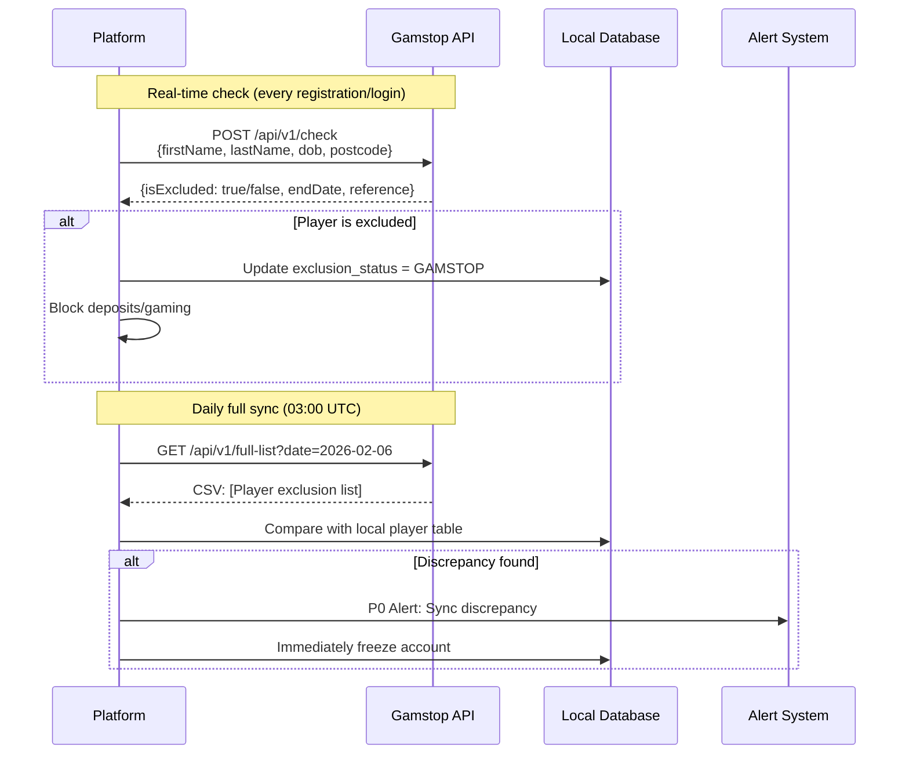
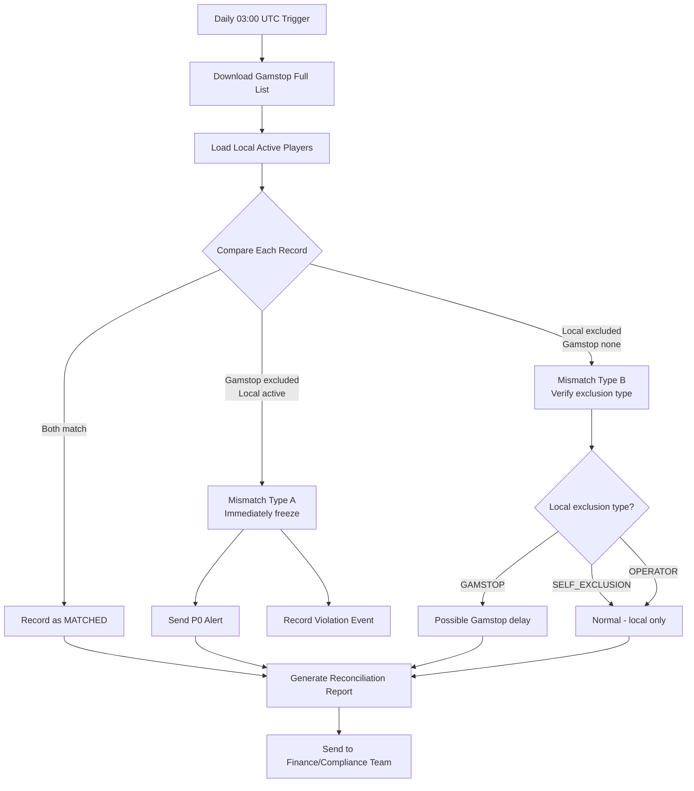
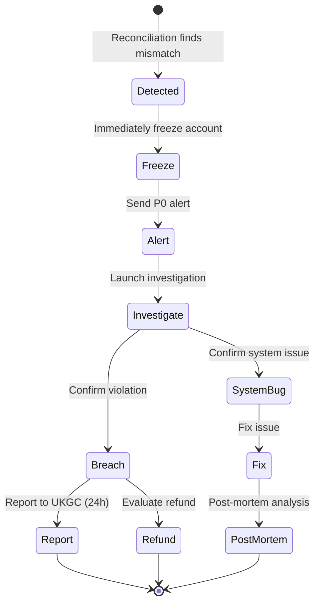

# Self-Exclusion Architecture (自我排除技術架構)

> **Business Requirements**: [Self_Exclusion_Requirements.md](../../requirements/15_Responsible_Gambling/Self_Exclusion_Requirements.md)
> **Canonical Source**: [15-01_Self_Exclusion.md](../../source-archive/15_Responsible_Gambling/15-01_Self_Exclusion.md), [15-09_Self_Exclusion_Reconciliation.md](../../source-archive/15_Responsible_Gambling/15-09_Self_Exclusion_Reconciliation.md)
> **View Type**: Technical Architecture
> **Target Audience**: Architects, Backend Developers

---

## 1. Database Schema

### 1.1 Exclusion Record Table

```sql
CREATE TABLE t_exclusion_record (
    id                  BIGINT PRIMARY KEY AUTO_INCREMENT,
    player_id           BIGINT NOT NULL,
    exclusion_type      VARCHAR(50) NOT NULL,  -- SELF, GAMSTOP, OPERATOR
    duration_type       VARCHAR(20) NOT NULL,  -- 24H, 7D, 30D, 6M, 1Y, 5Y, PERMANENT
    start_time          DATETIME NOT NULL,
    end_time            DATETIME,              -- NULL = permanent
    reason              VARCHAR(500),
    initiated_by        VARCHAR(50) NOT NULL,  -- PLAYER, OPERATOR, REGULATOR
    external_reference  VARCHAR(100),          -- Gamstop reference

    -- Revocation fields
    revocation_status   VARCHAR(20) DEFAULT 'ACTIVE',  -- ACTIVE, PENDING_REVOCATION, REVOKED
    revocation_request_time  DATETIME,
    revocation_effective_time DATETIME,
    revocation_reason   VARCHAR(500),

    -- Audit
    created_at          DATETIME DEFAULT CURRENT_TIMESTAMP,
    updated_at          DATETIME DEFAULT CURRENT_TIMESTAMP ON UPDATE CURRENT_TIMESTAMP,

    INDEX idx_player_id (player_id),
    INDEX idx_exclusion_type (exclusion_type),
    INDEX idx_end_time (end_time)
);
```

### 1.2 Gamstop Sync Log Table

```sql
CREATE TABLE t_gamstop_sync_log (
    id                  BIGINT PRIMARY KEY AUTO_INCREMENT,
    sync_type           VARCHAR(20) NOT NULL,  -- REALTIME, DAILY_BATCH
    sync_date           DATE NOT NULL,

    -- Sync statistics
    total_records       INT NOT NULL,
    matched_count       INT NOT NULL DEFAULT 0,
    mismatch_a_count    INT NOT NULL DEFAULT 0,  -- Gamstop has, local missing
    mismatch_b_count    INT NOT NULL DEFAULT 0,  -- Local has, Gamstop missing

    -- Status
    status              VARCHAR(20) NOT NULL,  -- SUCCESS, PARTIAL, FAILED
    error_message       TEXT,

    -- Timing
    started_at          DATETIME NOT NULL,
    completed_at        DATETIME,

    created_at          DATETIME DEFAULT CURRENT_TIMESTAMP,

    INDEX idx_sync_date (sync_date),
    INDEX idx_status (status)
);
```

### 1.3 Gamstop Reconciliation Discrepancy Table

```sql
CREATE TABLE t_gamstop_reconciliation_discrepancy (
    id                  BIGINT PRIMARY KEY AUTO_INCREMENT,
    sync_log_id         BIGINT NOT NULL,
    player_id           BIGINT NOT NULL,

    -- Discrepancy details
    discrepancy_type    VARCHAR(20) NOT NULL,  -- MISMATCH_A, MISMATCH_B, DATE_DIFF
    gamstop_status      VARCHAR(20),
    local_status        VARCHAR(20),
    gamstop_end_date    DATE,
    local_end_date      DATE,

    -- Resolution
    resolution_status   VARCHAR(20) DEFAULT 'PENDING',  -- PENDING, RESOLVED, ESCALATED
    resolution_action   VARCHAR(100),
    resolved_by         VARCHAR(100),
    resolved_at         DATETIME,

    -- Incident reporting
    incident_reported   BOOLEAN DEFAULT FALSE,
    incident_reference  VARCHAR(100),

    created_at          DATETIME DEFAULT CURRENT_TIMESTAMP,
    updated_at          DATETIME DEFAULT CURRENT_TIMESTAMP ON UPDATE CURRENT_TIMESTAMP,

    INDEX idx_player_id (player_id),
    INDEX idx_discrepancy_type (discrepancy_type),
    INDEX idx_resolution_status (resolution_status)
);
```

### 1.4 Reconciliation Report Table

```sql
CREATE TABLE t_gamstop_reconciliation_report (
    id                  BIGINT PRIMARY KEY AUTO_INCREMENT,
    report_date         DATE NOT NULL,
    jurisdiction        VARCHAR(20) NOT NULL DEFAULT 'UKGC',

    -- Statistics
    total_uk_players        INT NOT NULL,
    gamstop_excluded_count  INT NOT NULL,
    local_excluded_count    INT NOT NULL,
    match_rate              DECIMAL(5,2) NOT NULL,

    -- Discrepancy stats
    new_discrepancies       INT NOT NULL DEFAULT 0,
    resolved_discrepancies  INT NOT NULL DEFAULT 0,
    pending_discrepancies   INT NOT NULL DEFAULT 0,

    -- Report status
    generated_at            DATETIME NOT NULL,
    reviewed_by             VARCHAR(100),
    reviewed_at             DATETIME,

    created_at              DATETIME DEFAULT CURRENT_TIMESTAMP,

    UNIQUE KEY uk_report_date_jurisdiction (report_date, jurisdiction)
);
```

---

## 2. Service Implementation

### 2.1 SelfExclusionService

```java
@Service
@RequiredArgsConstructor
@Slf4j
public class SelfExclusionService {

    private final ExclusionRecordDao exclusionRecordDao;
    private final PlayerSessionManager sessionManager;
    private final GamstopClient gamstopClient;
    private final BetSettlementService betSettlementService;
    private final NotificationService notificationService;

    /**
     * Player requests self-exclusion
     */
    @Transactional(rollbackFor = Throwable.class)
    public ResponseDTO<ExclusionResultVO> requestSelfExclusion(
            Long playerId,
            SelfExclusionForm form) {

        // 1. Validate player state
        Option<ExclusionRecord> existingExclusion =
            exclusionRecordDao.findActiveExclusion(playerId);
        if (existingExclusion.isDefined()) {
            return ResponseDTO.error(UserErrorCode.ALREADY_EXCLUDED);
        }

        // 2. Calculate exclusion period
        LocalDateTime startTime = LocalDateTime.now();
        LocalDateTime endTime = calculateEndTime(startTime, form.getDuration());

        // 3. Check if cooling-off confirmation required
        boolean requiresCoolingOff = requiresCoolingOffPeriod(form.getDuration());

        if (requiresCoolingOff && !form.isCoolingOffConfirmed()) {
            return ResponseDTO.ok(ExclusionResultVO.builder()
                .status(ExclusionStatus.PENDING_CONFIRMATION)
                .confirmationDeadline(startTime.plusHours(24))
                .message("Please confirm exclusion request after 24 hours")
                .build());
        }

        // 4. Create exclusion record
        ExclusionRecord record = ExclusionRecord.builder()
            .playerId(playerId)
            .exclusionType(ExclusionType.SELF)
            .durationType(form.getDuration())
            .startTime(startTime)
            .endTime(endTime)
            .reason(form.getReason())
            .initiatedBy(InitiatedBy.PLAYER)
            .revocationStatus(RevocationStatus.ACTIVE)
            .build();
        exclusionRecordDao.insert(record);

        // 5. Execute exclusion actions
        executeExclusionActions(playerId, record);

        // 6. UK jurisdiction: sync to Gamstop
        if (isUkJurisdiction(playerId)) {
            syncToGamstop(playerId, record);
        }

        // 7. Send confirmation notification
        notificationService.sendExclusionConfirmation(playerId, record);

        log.info("Self-exclusion activated: playerId={}, duration={}",
            playerId, form.getDuration());

        return ResponseDTO.ok(ExclusionResultVO.builder()
            .status(ExclusionStatus.ACTIVE)
            .exclusionId(record.getId())
            .startTime(startTime)
            .endTime(endTime)
            .message("Self-exclusion activated")
            .build());
    }

    /**
     * Execute exclusion action checklist
     */
    private void executeExclusionActions(Long playerId, ExclusionRecord record) {
        // 1. Close all active sessions
        sessionManager.terminateAllSessions(playerId, "SELF_EXCLUSION");

        // 2. Settle open bets
        betSettlementService.settleOpenBets(playerId, SettlementType.EXCLUSION);

        // 3. Process incomplete bonuses
        bonusService.processExclusionBonuses(playerId);

        // 4. Block marketing communications
        marketingService.optOutAll(playerId, "SELF_EXCLUSION");

        // 5. Record audit log
        auditLogService.logExclusion(playerId, record);
    }

    /**
     * Check if player is excluded
     */
    public boolean isExcluded(Long playerId) {
        return exclusionRecordDao.findActiveExclusion(playerId).isDefined();
    }

    /**
     * Request revocation of exclusion
     */
    @Transactional(rollbackFor = Throwable.class)
    public ResponseDTO<RevocationResultVO> requestRevocation(
            Long playerId,
            RevocationForm form) {

        Option<ExclusionRecord> exclusionOpt =
            exclusionRecordDao.findActiveExclusion(playerId);

        if (exclusionOpt.isEmpty()) {
            return ResponseDTO.error(UserErrorCode.NO_ACTIVE_EXCLUSION);
        }

        ExclusionRecord record = exclusionOpt.get();

        // Permanent exclusion cannot be revoked
        if (DurationType.PERMANENT.equals(record.getDurationType())) {
            return ResponseDTO.error(UserErrorCode.PERMANENT_EXCLUSION_CANNOT_REVOKE);
        }

        // Exclusion period must have ended
        if (LocalDateTime.now().isBefore(record.getEndTime())) {
            return ResponseDTO.error(UserErrorCode.EXCLUSION_PERIOD_NOT_ENDED,
                "Exclusion ends at " + record.getEndTime());
        }

        // Set cooling-off period
        int coolingOffDays = getCoolingOffDays(record.getDurationType());
        LocalDateTime effectiveTime = LocalDateTime.now().plusDays(coolingOffDays);

        record.setRevocationStatus(RevocationStatus.PENDING_REVOCATION);
        record.setRevocationRequestTime(LocalDateTime.now());
        record.setRevocationEffectiveTime(effectiveTime);
        record.setRevocationReason(form.getReason());
        exclusionRecordDao.updateById(record);

        notificationService.sendRevocationPending(playerId, effectiveTime);

        return ResponseDTO.ok(RevocationResultVO.builder()
            .status(RevocationStatus.PENDING_REVOCATION)
            .effectiveTime(effectiveTime)
            .coolingOffDays(coolingOffDays)
            .build());
    }

    private boolean requiresCoolingOffPeriod(DurationType duration) {
        return switch (duration) {
            case H24, D7, D30 -> false;
            case M6, Y1, Y5, PERMANENT -> true;
        };
    }

    private int getCoolingOffDays(DurationType duration) {
        return switch (duration) {
            case M6 -> 1;
            case Y1, Y5 -> 7;
            default -> 0;
        };
    }
}
```

### 2.2 GamstopClient

```java
@Component
@RequiredArgsConstructor
@Slf4j
public class GamstopClient {

    private final RestTemplate restTemplate;

    @Value("${gamstop.api.url}")
    private String apiUrl;

    @Value("${gamstop.api.key}")
    private String apiKey;

    /**
     * Check if player is on Gamstop exclusion list
     * Must be called during registration (UK 2025 instant KYC)
     */
    public GamstopCheckResult checkExclusion(GamstopCheckRequest request) {
        HttpHeaders headers = createHeaders();
        HttpEntity<GamstopCheckRequest> entity = new HttpEntity<>(request, headers);

        try {
            ResponseEntity<GamstopCheckResponse> response = restTemplate.exchange(
                apiUrl + "/exclusion/check",
                HttpMethod.POST,
                entity,
                GamstopCheckResponse.class
            );

            return GamstopCheckResult.builder()
                .excluded(response.getBody().isExcluded())
                .exclusionEndDate(response.getBody().getExclusionEndDate())
                .reference(response.getBody().getReference())
                .build();
        } catch (Exception e) {
            log.error("Gamstop check failed", e);
            throw new GamstopIntegrationException("Gamstop check failed", e);
        }
    }

    /**
     * Register exclusion with Gamstop
     */
    public GamstopResponse registerExclusion(GamstopRegistrationRequest request) {
        HttpHeaders headers = createHeaders();
        HttpEntity<GamstopRegistrationRequest> entity = new HttpEntity<>(request, headers);

        ResponseEntity<GamstopResponse> response = restTemplate.exchange(
            apiUrl + "/exclusion/register",
            HttpMethod.POST,
            entity,
            GamstopResponse.class
        );

        return response.getBody();
    }

    private HttpHeaders createHeaders() {
        HttpHeaders headers = new HttpHeaders();
        headers.setContentType(MediaType.APPLICATION_JSON);
        headers.set("X-API-Key", apiKey);
        return headers;
    }
}
```

---

## 3. Reconciliation Service

### 3.1 GamstopReconciliationReportService

```java
@Service
@RequiredArgsConstructor
@Slf4j
public class GamstopReconciliationReportService {

    private final GamstopSyncLogDao syncLogDao;
    private final GamstopDiscrepancyDao discrepancyDao;
    private final GamstopReportDao reportDao;

    /**
     * Generate monthly Gamstop reconciliation report
     */
    public GamstopMonthlyReportVO generateMonthlyReport(YearMonth period) {
        LocalDate startDate = period.atDay(1);
        LocalDate endDate = period.atEndOfMonth();

        List<GamstopSyncLog> syncLogs = syncLogDao.findByDateRange(startDate, endDate);
        int totalSyncs = syncLogs.size();
        int successSyncs = (int) syncLogs.stream()
            .filter(log -> "SUCCESS".equals(log.getStatus()))
            .count();

        List<GamstopDiscrepancy> discrepancies =
            discrepancyDao.findByDateRange(startDate, endDate);

        int typeACount = (int) discrepancies.stream()
            .filter(d -> "MISMATCH_A".equals(d.getDiscrepancyType()))
            .count();

        int resolvedCount = (int) discrepancies.stream()
            .filter(d -> "RESOLVED".equals(d.getResolutionStatus()))
            .count();

        return GamstopMonthlyReportVO.builder()
            .period(period)
            .totalSyncs(totalSyncs)
            .syncSuccessRate(totalSyncs > 0 ? (double) successSyncs / totalSyncs : 1.0)
            .typeADiscrepancies(typeACount)
            .resolvedDiscrepancies(resolvedCount)
            .pendingDiscrepancies(discrepancies.size() - resolvedCount)
            .build();
    }
}
```

### 3.2 Daily Reconciliation SQL

```sql
-- Daily Gamstop sync reconciliation
WITH gamstop_list AS (
    SELECT player_reference, exclusion_end_date, last_sync_at
    FROM t_gamstop_exclusion_list
    WHERE sync_date = CURDATE()
),
local_players AS (
    SELECT
        p.id AS player_id,
        p.gamstop_reference,
        ps.self_excluded,
        ps.exclusion_type,
        ps.exclusion_end_time
    FROM t_player p
    LEFT JOIN t_player_protection_settings ps ON p.id = ps.player_id
    WHERE p.jurisdiction = 'UKGC'
      AND p.status = 'ACTIVE'
)

SELECT
    lp.player_id,
    lp.gamstop_reference,
    CASE
        WHEN gl.player_reference IS NOT NULL AND lp.self_excluded = FALSE
            THEN 'MISMATCH_A_BLOCK_REQUIRED'
        WHEN gl.player_reference IS NULL AND lp.exclusion_type = 'GAMSTOP'
            THEN 'MISMATCH_B_VERIFY_NEEDED'
        WHEN gl.player_reference IS NOT NULL AND lp.self_excluded = TRUE
            THEN 'MATCHED'
        WHEN gl.player_reference IS NULL AND lp.exclusion_type != 'GAMSTOP'
            THEN 'LOCAL_ONLY_OK'
        ELSE 'NO_EXCLUSION'
    END AS reconciliation_status,
    gl.exclusion_end_date AS gamstop_end_date,
    lp.exclusion_end_time AS local_end_date
FROM local_players lp
LEFT JOIN gamstop_list gl ON lp.gamstop_reference = gl.player_reference;
```

---

## 4. Sequence Diagrams

### 4.1 Gamstop Integration Flow



### 4.2 Daily Reconciliation Flow



### 4.3 Type A Discrepancy State Machine



---

## 5. Monitoring & Alerting

### 5.1 Key Metrics

| Metric | Prometheus Name | Alert Threshold |
|--------|----------------|-----------------|
| Self-exclusion requests | `rg_self_exclusion_requests_total` | Day-over-day > 100% |
| Exclusion activations | `rg_self_exclusion_activated_total` | - |
| Gamstop sync latency | `gamstop_sync_latency_seconds` | > 30s |
| Gamstop sync failures | `gamstop_sync_failures_total` | > 0 |
| Daily discrepancies | `gamstop_reconciliation_discrepancies_total` | > 0 (Type A) |
| Sync failure rate | `gamstop_sync_failure_rate` | > 1% |
| Pending discrepancies | `gamstop_pending_discrepancies_gauge` | > 0 (over 24h) |

### 5.2 Alert Configuration

```yaml
alerts:
  - name: gamstop_mismatch_type_a
    condition: gamstop_reconciliation_discrepancies_total{type="MISMATCH_A"} > 0
    severity: CRITICAL
    notify: pagerduty:compliance-oncall, email:cro@company.com, sms:compliance-team
    message: "CRITICAL: Gamstop excluded player still active on platform"

  - name: gamstop_sync_failure
    condition: gamstop_sync_failure_rate > 0.01
    severity: WARNING
    notify: slack:#compliance-ops

  - name: gamstop_discrepancy_unresolved
    condition: gamstop_pending_discrepancies_gauge > 0 and time() - gamstop_discrepancy_created_at > 86400
    severity: WARNING
    notify: slack:#compliance-ops, email:compliance-team@company.com
```

---

## 6. Integration Test

```java
@SpringBootTest
@Transactional
class SelfExclusionServiceTest {

    @Autowired
    private SelfExclusionService selfExclusionService;

    @Test
    void testShortTermExclusionImmediateEffect() {
        Long playerId = 1001L;
        SelfExclusionForm form = new SelfExclusionForm();
        form.setDuration(DurationType.H24);

        ResponseDTO<ExclusionResultVO> result =
            selfExclusionService.requestSelfExclusion(playerId, form);

        assertThat(result.getData().getStatus())
            .isEqualTo(ExclusionStatus.ACTIVE);
        assertThat(selfExclusionService.isExcluded(playerId)).isTrue();
    }

    @Test
    void testLongTermExclusionRequiresCoolingOff() {
        Long playerId = 1002L;
        SelfExclusionForm form = new SelfExclusionForm();
        form.setDuration(DurationType.Y1);
        form.setCoolingOffConfirmed(false);

        ResponseDTO<ExclusionResultVO> result =
            selfExclusionService.requestSelfExclusion(playerId, form);

        assertThat(result.getData().getStatus())
            .isEqualTo(ExclusionStatus.PENDING_CONFIRMATION);
    }
}
```

---

## Related Documents

- [Self_Exclusion_Requirements.md](../../requirements/15_Responsible_Gambling/Self_Exclusion_Requirements.md) - Business requirements
- [Deposit_Loss_Limits_Architecture.md](Deposit_Loss_Limits_Architecture.md) - Deposit & loss limits architecture
- [Player_Protection_API.md](Player_Protection_API.md) - Unified API architecture

---

**Return**: [Responsible Gambling Module](../../source-archive/15_Responsible_Gambling/README.md) | [iGaming Home](../../source-archive/README.md)
