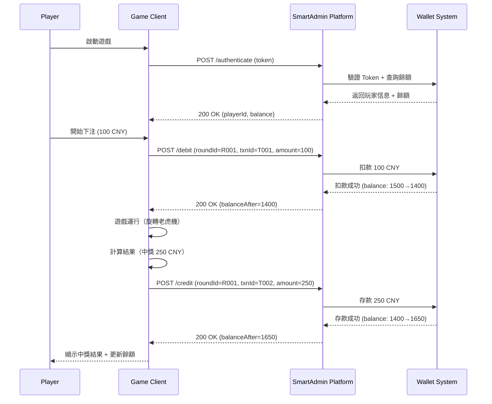
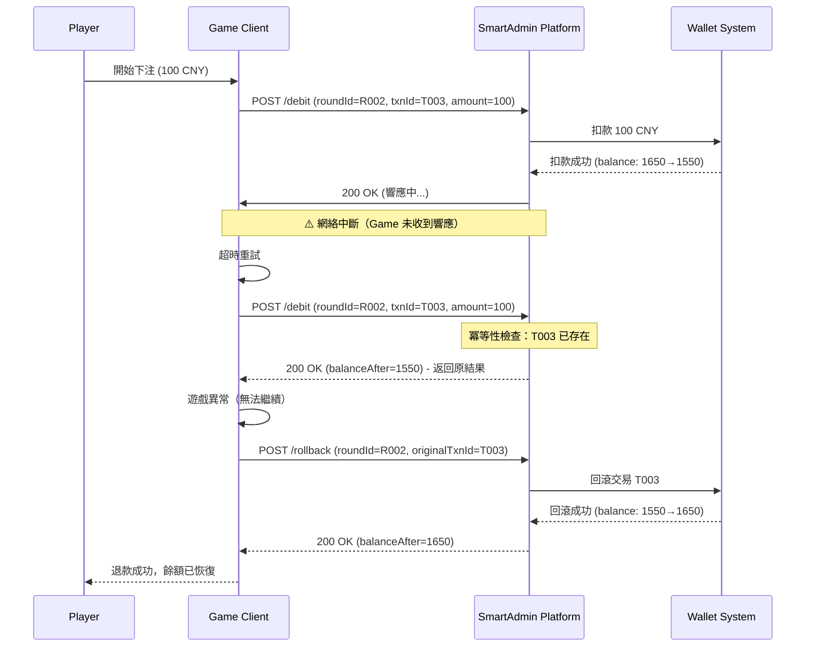

# Seamless Wallet API 規格文檔

**版本**: v1.0.0
**創建日期**: 2026-03-11
**狀態**: Draft（設計階段）
**目標**: Phase 2 實施規格

---

## 📋 文檔目的

定義 SmartAdmin iGaming 平台與遊戲廠商之間的 **Seamless Wallet API** 標準接口，實現遊戲回合中的實時資金流動、餘額查詢、交易回滾等核心功能。

---

## 🎯 設計原則

1. **無縫體驗 (Seamless)**：玩家在遊戲中無需手動充值/提現，餘額實時同步
2. **冪等性保證 (Idempotency)**：所有資金操作支持重試，相同 `roundId` + `transactionId` 返回原結果
3. **安全性優先 (Security)**：HMAC-SHA256 簽名驗證 + Token 認證 + IP 白名單
4. **高可用性 (HA)**：P95 響應時間 < 50ms，SLA 99.9%
5. **可追溯性 (Auditability)**：每筆交易記錄完整的遊戲回合信息

---

## 🔐 認證機制

### 雙重認證模式

**Layer 1: Token 認證（API Key）**
- 遊戲廠商在請求頭中攜帶 `X-Api-Token`
- 平台在數據庫中存儲 `game_provider.api_token`（SHA-256 加密）
- 驗證失敗返回 `401 Unauthorized`

**Layer 2: HMAC-SHA256 簽名驗證**
- 遊戲廠商使用 `secret_key` 對請求體進行簽名
- 簽名算法：`HMAC-SHA256(secret_key, request_body + timestamp)`
- 簽名放在請求頭 `X-Signature`
- 時間戳放在請求頭 `X-Timestamp`（毫秒級，容忍度 5 分鐘）

**示例（Python 簽名生成）**：
```python
import hmac
import hashlib
import time

secret_key = "your_secret_key_here"
request_body = '{"playerId":123,"amount":"100.00",...}'
timestamp = int(time.time() * 1000)

# 構造簽名內容
sign_content = request_body + str(timestamp)

# 生成 HMAC-SHA256 簽名
signature = hmac.new(
    secret_key.encode('utf-8'),
    sign_content.encode('utf-8'),
    hashlib.sha256
).hexdigest()

# 請求頭
headers = {
    'X-Api-Token': 'your_api_token',
    'X-Signature': signature,
    'X-Timestamp': str(timestamp),
    'Content-Type': 'application/json'
}
```

---

## 📡 API 端點概覽

**基礎路徑**: `/igaming/seamless`

| 端點 | 方法 | 功能 | 冪等性 |
|------|------|------|--------|
| `/authenticate` | POST | Token 驗證 + 餘額查詢 | ✅ |
| `/debit` | POST | 扣款（下注）| ✅ |
| `/credit` | POST | 存款（中獎）| ✅ |
| `/rollback` | POST | 回滾交易 | ✅ |
| `/getBalance` | POST | 查詢餘額 | ✅ |

---

## 1️⃣ Authenticate（認證 + 餘額查詢）

**端點**: `POST /igaming/seamless/authenticate`

**用途**:
- 遊戲廠商驗證玩家 Token 有效性
- 獲取玩家當前可用餘額
- 通常在遊戲啟動時調用

### 請求

**Headers**:
```
X-Api-Token: abc123def456...
X-Signature: hmac_sha256_signature
X-Timestamp: 1710131234567
Content-Type: application/json
```

**Body**:
```json
{
  "token": "player_session_token_xyz789",
  "gameCode": "SLOT_001",
  "providerCode": "pragmatic_play",
  "timestamp": 1710131234567
}
```

**參數說明**:
| 字段 | 類型 | 必填 | 說明 |
|------|------|------|------|
| token | String | ✅ | 玩家會話 Token（由平台發放）|
| gameCode | String | ✅ | 遊戲代碼（廠商內部編碼）|
| providerCode | String | ✅ | 遊戲廠商代碼（平台註冊值）|
| timestamp | Long | ✅ | 請求時間戳（毫秒）|

### 響應

**成功（200 OK）**:
```json
{
  "code": 0,
  "message": "success",
  "data": {
    "playerId": 10001,
    "playerName": "player_123",
    "currency": "CNY",
    "balance": "1500.5000",
    "walletId": 100001,
    "sessionId": "session_xyz789"
  }
}
```

**失敗（401 Unauthorized）**:
```json
{
  "code": 50001,
  "message": "Invalid token or token expired",
  "data": null
}
```

---

## 2️⃣ Debit（扣款/下注）

**端點**: `POST /igaming/seamless/debit`

**用途**:
- 遊戲回合開始時扣除玩家下注金額
- 鎖定資金直到回合結束（Credit 或 Rollback）

### 請求

**Headers**: 同 Authenticate

**Body**:
```json
{
  "token": "player_session_token_xyz789",
  "roundId": "ROUND_20260311_1234567890",
  "transactionId": "TXN_DEBIT_001",
  "gameCode": "SLOT_001",
  "providerCode": "pragmatic_play",
  "amount": "100.00",
  "currency": "CNY",
  "roundDetails": {
    "gameType": "SLOT",
    "betLevel": 1,
    "betLines": 20,
    "betPerLine": "5.00"
  },
  "timestamp": 1710131234567
}
```

**參數說明**:
| 字段 | 類型 | 必填 | 說明 |
|------|------|------|------|
| token | String | ✅ | 玩家會話 Token |
| roundId | String | ✅ | 遊戲回合唯一標識（廠商生成）|
| transactionId | String | ✅ | 交易唯一標識（廠商生成）|
| gameCode | String | ✅ | 遊戲代碼 |
| providerCode | String | ✅ | 遊戲廠商代碼 |
| amount | BigDecimal | ✅ | 扣款金額（必須 > 0）|
| currency | String | ✅ | 貨幣代碼（CNY, USD 等）|
| roundDetails | Object | ✅ | 遊戲回合詳情（用於流水計算）|
| timestamp | Long | ✅ | 請求時間戳 |

**roundDetails 結構**:
| 字段 | 類型 | 必填 | 說明 |
|------|------|------|------|
| gameType | String | ✅ | 遊戲類型（SLOT, BACCARAT, ROULETTE 等）|
| betLevel | Integer | ❌ | 下注等級 |
| betLines | Integer | ❌ | 下注線數（老虎機）|
| betPerLine | BigDecimal | ❌ | 每線下注金額 |

### 響應

**成功（200 OK）**:
```json
{
  "code": 0,
  "message": "success",
  "data": {
    "transactionId": "TXN_DEBIT_001",
    "roundId": "ROUND_20260311_1234567890",
    "playerId": 10001,
    "balanceBefore": "1500.5000",
    "balanceAfter": "1400.5000",
    "amount": "100.00",
    "currency": "CNY",
    "timestamp": 1710131234567
  }
}
```

**失敗（400 Bad Request）**:
```json
{
  "code": 50002,
  "message": "Insufficient balance",
  "data": {
    "availableBalance": "50.00",
    "requestedAmount": "100.00"
  }
}
```

### 冪等性保證

- 相同 `roundId` + `transactionId` 重複請求返回原交易結果
- 不會重複扣款
- 示例：
  ```json
  // 第一次請求 → 扣款成功
  POST /debit { "roundId": "R001", "transactionId": "T001", "amount": "100" }
  → { "balanceBefore": "1500", "balanceAfter": "1400" }

  // 重複請求（網絡重試）→ 返回原結果
  POST /debit { "roundId": "R001", "transactionId": "T001", "amount": "100" }
  → { "balanceBefore": "1500", "balanceAfter": "1400" } (相同結果，未重複扣款)
  ```

---

## 3️⃣ Credit（存款/中獎）

**端點**: `POST /igaming/seamless/credit`

**用途**:
- 遊戲回合結束時增加玩家中獎金額
- 解鎖 Debit 時鎖定的資金

### 請求

**Headers**: 同 Authenticate

**Body**:
```json
{
  "token": "player_session_token_xyz789",
  "roundId": "ROUND_20260311_1234567890",
  "transactionId": "TXN_CREDIT_001",
  "gameCode": "SLOT_001",
  "providerCode": "pragmatic_play",
  "amount": "250.00",
  "currency": "CNY",
  "winAmount": "250.00",
  "betAmount": "100.00",
  "roundDetails": {
    "gameType": "SLOT",
    "winType": "NORMAL_WIN",
    "multiplier": 2.5
  },
  "timestamp": 1710131235000
}
```

**參數說明**:
| 字段 | 類型 | 必填 | 說明 |
|------|------|------|------|
| token | String | ✅ | 玩家會話 Token |
| roundId | String | ✅ | 遊戲回合唯一標識（與 Debit 相同）|
| transactionId | String | ✅ | 交易唯一標識（廠商生成，不同於 Debit）|
| gameCode | String | ✅ | 遊戲代碼 |
| providerCode | String | ✅ | 遊戲廠商代碼 |
| amount | BigDecimal | ✅ | 存款金額（中獎金額，可為 0）|
| currency | String | ✅ | 貨幣代碼 |
| winAmount | BigDecimal | ✅ | 中獎金額（用於流水計算）|
| betAmount | BigDecimal | ✅ | 下注金額（與 Debit amount 對應）|
| roundDetails | Object | ✅ | 遊戲回合詳情 |
| timestamp | Long | ✅ | 請求時間戳 |

**roundDetails 結構**:
| 字段 | 類型 | 必填 | 說明 |
|------|------|------|------|
| gameType | String | ✅ | 遊戲類型 |
| winType | String | ✅ | 中獎類型（NORMAL_WIN, FREE_SPIN, BONUS 等）|
| multiplier | BigDecimal | ❌ | 賠率倍數 |

### 響應

**成功（200 OK）**:
```json
{
  "code": 0,
  "message": "success",
  "data": {
    "transactionId": "TXN_CREDIT_001",
    "roundId": "ROUND_20260311_1234567890",
    "playerId": 10001,
    "balanceBefore": "1400.5000",
    "balanceAfter": "1650.5000",
    "amount": "250.00",
    "currency": "CNY",
    "timestamp": 1710131235000
  }
}
```

**失敗（404 Not Found）**:
```json
{
  "code": 50003,
  "message": "Round not found",
  "data": {
    "roundId": "ROUND_20260311_1234567890"
  }
}
```

### 冪等性保證

- 相同 `roundId` + `transactionId` 重複請求返回原交易結果
- 不會重複存款

---

## 4️⃣ Rollback（回滾交易）

**端點**: `POST /igaming/seamless/rollback`

**用途**:
- 取消 Debit 或 Credit 交易（遊戲異常、網絡中斷等）
- 恢復玩家餘額到交易前狀態

### 請求

**Headers**: 同 Authenticate

**Body**:
```json
{
  "token": "player_session_token_xyz789",
  "roundId": "ROUND_20260311_1234567890",
  "transactionId": "TXN_ROLLBACK_001",
  "originalTransactionId": "TXN_DEBIT_001",
  "gameCode": "SLOT_001",
  "providerCode": "pragmatic_play",
  "rollbackReason": "GAME_ERROR",
  "timestamp": 1710131236000
}
```

**參數說明**:
| 字段 | 類型 | 必填 | 說明 |
|------|------|------|------|
| token | String | ✅ | 玩家會話 Token |
| roundId | String | ✅ | 遊戲回合唯一標識 |
| transactionId | String | ✅ | 回滾交易唯一標識（新生成）|
| originalTransactionId | String | ✅ | 原始交易 ID（要回滾的 Debit/Credit ID）|
| gameCode | String | ✅ | 遊戲代碼 |
| providerCode | String | ✅ | 遊戲廠商代碼 |
| rollbackReason | String | ✅ | 回滾原因（GAME_ERROR, NETWORK_ISSUE 等）|
| timestamp | Long | ✅ | 請求時間戳 |

### 響應

**成功（200 OK）**:
```json
{
  "code": 0,
  "message": "success",
  "data": {
    "transactionId": "TXN_ROLLBACK_001",
    "originalTransactionId": "TXN_DEBIT_001",
    "roundId": "ROUND_20260311_1234567890",
    "playerId": 10001,
    "balanceBefore": "1400.5000",
    "balanceAfter": "1500.5000",
    "rolledBackAmount": "100.00",
    "currency": "CNY",
    "timestamp": 1710131236000
  }
}
```

**失敗（404 Not Found）**:
```json
{
  "code": 50004,
  "message": "Original transaction not found",
  "data": {
    "originalTransactionId": "TXN_DEBIT_001"
  }
}
```

### 冪等性保證

- 相同 `transactionId` 重複請求返回原回滾結果
- 不會重複回滾

---

## 5️⃣ GetBalance（查詢餘額）

**端點**: `POST /igaming/seamless/getBalance`

**用途**:
- 實時查詢玩家當前可用餘額
- 無資金操作，僅查詢

### 請求

**Headers**: 同 Authenticate

**Body**:
```json
{
  "token": "player_session_token_xyz789",
  "gameCode": "SLOT_001",
  "providerCode": "pragmatic_play",
  "timestamp": 1710131234567
}
```

**參數說明**:
| 字段 | 類型 | 必填 | 說明 |
|------|------|------|------|
| token | String | ✅ | 玩家會話 Token |
| gameCode | String | ✅ | 遊戲代碼 |
| providerCode | String | ✅ | 遊戲廠商代碼 |
| timestamp | Long | ✅ | 請求時間戳 |

### 響應

**成功（200 OK）**:
```json
{
  "code": 0,
  "message": "success",
  "data": {
    "playerId": 10001,
    "balance": "1650.5000",
    "currency": "CNY",
    "walletId": 100001,
    "timestamp": 1710131234567
  }
}
```

---

## 🔢 錯誤碼參考

| 錯誤碼 | HTTP Status | 錯誤訊息 | 說明 |
|-------|-------------|---------|------|
| 50001 | 401 | Invalid token or token expired | Token 無效或過期 |
| 50002 | 400 | Insufficient balance | 餘額不足 |
| 50003 | 404 | Round not found | 遊戲回合不存在 |
| 50004 | 404 | Original transaction not found | 原始交易不存在（Rollback 場景）|
| 50005 | 400 | Invalid signature | 簽名驗證失敗 |
| 50006 | 400 | Timestamp expired | 時間戳過期（超過 5 分鐘）|
| 50007 | 400 | Duplicate transaction | 重複交易（非冪等場景）|
| 50008 | 400 | Invalid amount | 金額無效（≤ 0 或格式錯誤）|
| 50009 | 403 | IP not whitelisted | IP 不在白名單 |
| 50010 | 400 | Currency mismatch | 貨幣不匹配 |
| 50011 | 400 | Round already settled | 遊戲回合已結算（無法再 Debit/Credit）|
| 50012 | 400 | Provider not found | 遊戲廠商不存在 |
| 50013 | 400 | Game not found | 遊戲不存在 |
| 50014 | 500 | Internal server error | 服務器內部錯誤 |

---

## 🔄 業務流程

### 正常遊戲回合流程



### 異常場景：網絡中斷 + Rollback



---

## 🔒 安全機制

### 1. 請求簽名驗證（HMAC-SHA256）

**簽名生成算法**:
```
sign_content = request_body + timestamp
signature = HMAC_SHA256(secret_key, sign_content)
```

**驗證流程**:
```java
// 1. 提取簽名和時間戳
String signature = request.getHeader("X-Signature");
long timestamp = Long.parseLong(request.getHeader("X-Timestamp"));

// 2. 驗證時間戳（5 分鐘容忍度）
long now = System.currentTimeMillis();
if (Math.abs(now - timestamp) > 300000) {
    return ResponseDTO.error(50006, "Timestamp expired");
}

// 3. 計算簽名
String requestBody = request.getBody();
String signContent = requestBody + timestamp;
String secretKey = gameProviderService.getSecretKey(providerCode);
String computedSignature = HmacUtils.hmacSha256Hex(secretKey, signContent);

// 4. 常數時間比較（防止時序攻擊）
boolean valid = MessageDigest.isEqual(
    computedSignature.getBytes(),
    signature.getBytes()
);

if (!valid) {
    return ResponseDTO.error(50005, "Invalid signature");
}
```

### 2. Token 認證

- 玩家登入後平台發放 Session Token
- Token 存儲在 Redis（TTL: 30 分鐘）
- 每次 Seamless API 調用驗證 Token 有效性

### 3. IP 白名單

- 平台配置遊戲廠商允許的 IP 範圍
- 請求來源 IP 不在白名單則拒絕（50009）

### 4. 冪等性保證

- 每個交易使用唯一 `transactionId`
- 數據庫唯一約束：`uk_game_transaction_id`
- 重複請求返回原結果，不重複執行

---

## 📊 性能指標

### 目標 SLA

| 指標 | 目標 | 監控方式 |
|------|------|---------|
| P95 響應時間 | < 50ms | Prometheus + Grafana |
| P99 響應時間 | < 100ms | Prometheus + Grafana |
| TPS（單機）| > 1000 | JMeter 壓測 |
| 可用性 | 99.9% | Uptime Robot |
| 錯誤率 | < 0.1% | Sentry |

### 優化策略

1. **Redis 緩存玩家餘額**（TTL: 10 秒）
2. **數據庫連接池調優**（HikariCP: maxPoolSize=50）
3. **異步日誌寫入**（Kafka）
4. **水平擴展**（Kubernetes: 最少 3 個 Pod）

---

## 🧪 測試計劃

### 單元測試

- [ ] Token 驗證邏輯（有效/過期/無效）
- [ ] 簽名驗證邏輯（正確/錯誤/時間戳過期）
- [ ] 冪等性檢查（重複 transactionId）
- [ ] 餘額計算邏輯（扣款/存款/回滾）

### 集成測試

- [ ] 完整遊戲回合流程（Debit → Credit）
- [ ] Rollback 場景（扣款回滾、存款回滾）
- [ ] 並發扣款測試（100 VUs）
- [ ] 冪等性測試（相同 roundId + transactionId 重試）

### 性能測試

- [ ] k6 壓力測試（1000 TPS）
- [ ] 響應時間分布（P50/P95/P99）
- [ ] 資料庫連接池壓力測試

---

## 📚 相關文檔

- [Phase 2 實施計劃](C:\Users\ron.chang\.claude\plans\memoized-beaming-pretzel.md) - Week 4-6
- [錢包 API 文檔](c:\Workspace\open_source\smart-admin\docs\api\wallet-api.md) - 內部錢包 API
- [支付 API 文檔](c:\Workspace\open_source\smart-admin\docs\api\payment-api.md) - 支付閘道 API

---

## 📝 變更歷史

| 版本 | 日期 | 變更內容 | 作者 |
|------|------|---------|------|
| v1.0.0 | 2026-03-11 | 初始版本（設計階段）| iGaming Team |

---

**文檔狀態**: Draft（設計階段）
**下次審查**: Phase 2 開始前（2026-03-12）
**維護者**: iGaming Team
