# IGaming 技術架構總覽

> **最後更新**: 2026-03-24
> **文檔來源**: `architecture/` (117 份) + `implementation/` (15 份) + `source-archive/` (193 份)
> **專案版本**: v4.1.0 | 基於 SmartAdmin 框架

---

## 一、總體架構

### 1.1 架構模式

**進化式模組化單體 (Evolutionary Modular Monolith)** + 事件驅動 + CQRS + 多租戶隔離

### 1.2 系統分層架構圖

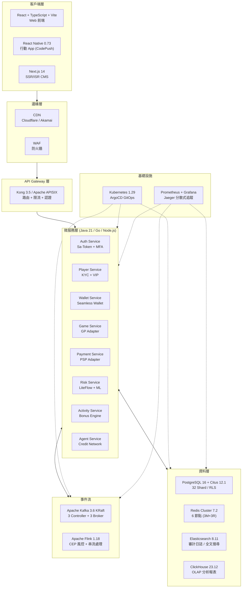

### 1.3 核心技術棧

| 類別 | 技術選型 | 版本 | 說明 |
|------|---------|------|------|
| **主語言** | Java | 21 LTS | Virtual Threads (100K+ 並發), Pattern Matching |
| **框架** | Spring Boot | 3.2 | SmartAdmin 分層架構 |
| **即時服務** | Node.js + Fastify | 20 / 4 | WebSocket 即時通訊 |
| **高效能** | Go | 1.22 | 支付閘道、風控引擎 |
| **ML 模型** | Python + FastAPI | 3.12 | Isolation Forest 等 |
| **OLTP** | PostgreSQL + Citus | 16 / 12.1 | 透明分片 (32 Shard), RLS |
| **快取** | Redis Cluster | 7.2 | 6 節點 (3M+3R), 16384 Slot |
| **事件流** | Apache Kafka (KRaft) | 3.6 | 去 ZK, 故障轉移 <1s |
| **串流處理** | Apache Flink | 1.18 | CEP 風控, Exactly-once |
| **OLAP** | ClickHouse | 23.12 | 分析報表 |
| **搜尋** | Elasticsearch | 8.11 | 審計日誌、全文搜尋 |
| **規則引擎** | LiteFlow | — | 100K+ QPS, 熱更新 |
| **容器** | Kubernetes + Helm | 1.29 | ArgoCD GitOps |
| **監控** | Prometheus + Grafana | — | + Jaeger 分散式追蹤 |

### 1.4 關鍵技術決策 (ADR)

| ADR | 決策 | 選擇 | 核心理由 |
|-----|------|------|---------|
| — | Kafka KRaft vs ZooKeeper | KRaft | 運維成本 -50%, 故障轉移 <1s (vs 30-60s) |
| — | Flink vs Kafka Streams | Flink | CEP 風控核心, TB 級狀態, 獨立集群 |
| — | PG+Citus vs CockroachDB/TiDB | Citus | PG 生態完整, 透明分片, 成本低 40% |
| — | 模組化單體 vs 微服務 | 單體 | 漸進演化, 事件驅動保留萃取能力 |
| — | 樂觀鎖 vs 悲觀鎖 | 樂觀鎖 | 低衝突率高效能, @Version + @Retryable |
| ADR-001 | 命名規範 | 單數標準 | `t_player`, `PlayerEntity`, `/api/v1/players` |
| ADR-012 | 異步風控模式 | Flag 模式 | 投注不阻斷, 提款攔截, VIP 無豁免 |
| ADR-013 | Manager 邊界 | Manager 層獨佔 | 分佈式鎖 + @Transactional 必須在 Manager 層 |
| ADR-014 | @TenantIgnore | 白名單制度 | 禁止跨租戶訪問 PII/錢包/KYC/支付 |
| ADR-015 | 三層冪等 | Redis → DB → Fallback | TTL 3600s, 三層防禦 |

### 1.5 效能目標

| 組件 | 指標 | 目標 |
|------|------|------|
| API Gateway | P99 | < 50ms |
| 微服務 | P99 | < 100ms |
| PostgreSQL/Citus | QPS | > 50,000 |
| PostgreSQL/Citus | P99 | < 10ms |
| Redis | QPS | > 100,000 |
| Redis | P99 | < 1ms |
| Kafka | 吞吐量 | > 100,000 msg/s |
| Flink | 延遲 | < 1s |
| 可用性 (對外合約) | SLA | 99.9% (每月 43 分鐘停機) |
| 可用性 (安全服務) | SLA | 99.95% (Token 驗證/認證) |
| 可用性 (K8s 設計) | SLA | 99.99% (基礎設施目標) |

---

## 二、SmartAdmin 分層架構

### 2.1 四層架構規範

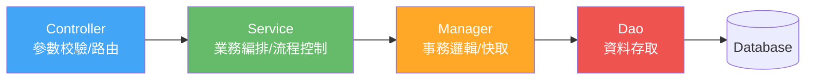

| 層級 | 職責 | 規範 |
|------|------|------|
| **Controller** | 參數校驗, 路由 | 僅調用 Service, 不訪問 Dao |
| **Service** | 業務編排, 流程控制 | **禁止** @Transactional, 使用 Vavr Option/Try |
| **Manager** | 事務邏輯, 快取 | **唯一** 使用 @Transactional/@Cacheable 的層 |
| **Dao** | 資料存取 | MyBatis Mapper + RLS |

### 2.2 開發規範

- **依賴注入**: `@RequiredArgsConstructor` 建構子注入 (禁止 @Autowired)
- **返回類型**: Vavr `Option` / `Try` / `Either` (禁止 java.util.Optional)
- **交易邏輯**: 僅在 Manager 層使用 @Transactional
- **快取**: 僅在 Manager 層使用 @Cacheable (JetCache 二級快取)
- **命名**: ADR-001 單數標準 (`t_player`, `PlayerEntity`, `/api/v1/players`)
- **ArchUnit**: 自動強制分層規則 (5 項測試全部通過)

---

## 三、多租戶架構

### 3.1 四層租戶隔離

```mermaid
graph TB
    subgraph 應用層隔離
        JWT["JWT 解析 tenant_id"] --> TI["TenantInterceptor<br/>注入 ThreadLocal"]
        TI --> MBP["MyBatis-Plus<br/>TenantLineInnerInterceptor<br/>自動 WHERE tenant_id = ?"]
    end

    subgraph 資料庫層隔離
        RLS["PostgreSQL RLS<br/>USING tenant_id = current_setting"]
        SCHEMA["TenantSchemaInterceptor<br/>動態切換 Schema"]
    end

    subgraph Redis 隔離
        RKEY["{tenantId}:wallet:balance:{playerId}"]
    end

    應用層隔離 --> 資料庫層隔離
    應用層隔離 --> Redis 隔離
```

### 3.2 雙層資料隔離

| 層級 | 技術 | 說明 |
|------|------|------|
| 應用層 | MyBatis-Plus TenantLineInnerInterceptor | 自動注入 `WHERE tenant_id = ?` |
| 資料庫層 | PostgreSQL RLS | `USING (tenant_id = current_setting('app.current_tenant_id')::INT)` |

### 3.3 核心組件

- **TenantContext**: ThreadLocal 存儲 (Virtual Threads 用 ScopedValue)
- **@TenantIgnore**: ADR-014 白名單制度, ArchUnit 強制 + 審計日誌
- **Impersonation**: Super Admin 可模擬特定租戶視角

---

## 四、無縫錢包系統 (Seamless Wallet)

### 4.1 六步原子操作流程

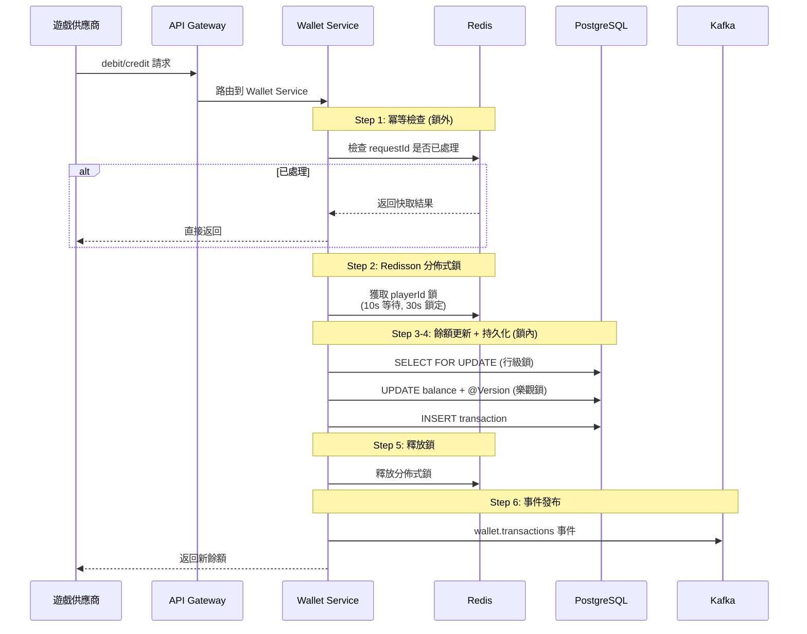

### 4.2 三層併發控制

| 層級 | 技術 | 說明 |
|------|------|------|
| 分佈式鎖 | Redisson | 10s 等待, 30s 鎖定, 防跨節點併發 |
| 行級鎖 | SELECT FOR UPDATE | DB 層面防併發 |
| 樂觀鎖 | @Version | 防同行更新衝突, 最多 3 次重試 |

### 4.3 三層冪等防禦 (ADR-015)

| 層級 | 技術 | 延遲 | 說明 |
|------|------|------|------|
| Layer 1 | Redis 快取 | < 5ms | 快速攔截重複請求 |
| Layer 2 | DB UNIQUE 約束 | < 50ms | 資料庫層防禦 |
| Layer 3 | DB Fallback 查詢 | < 100ms | 最終安全網 |

### 4.4 錢包 API

| 端點 | 方法 | 說明 |
|------|------|------|
| `/igaming/seamless/authenticate` | POST | Token 驗證 + 餘額查詢 |
| `/igaming/seamless/debit` | POST | 扣款/下注 (冪等) |
| `/igaming/seamless/credit` | POST | 派彩/存款 (冪等) |
| `/igaming/seamless/rollback` | POST | 交易回滾 |
| `/igaming/seamless/getBalance` | POST | 餘額查詢 |

**認證**: 雙層 — API Key (X-Api-Token) + HMAC-SHA256 簽名 (X-Signature + X-Timestamp, 5 分鐘容忍度)

### 4.5 特殊場景處理

- **亂序處理**: 派彩先到 → Redis 待處理佇列 (30 分鐘 TTL, 每分鐘重試)
- **孤立回合**: 每 15 分鐘掃描 OPEN > 2 小時的回合, 查詢 GP API 確認
- **負餘額**: GP 重新結算可能產生, 觸發帳戶鎖定 + CRITICAL 告警
- **鎖定金額雙軌**: `t_wallet.locked_amount` (彙總, O(1)) + `t_wallet_lock` (明細, 審計)

---

## 五、支付系統

### 5.1 PSP 適配器與提款 SAGA

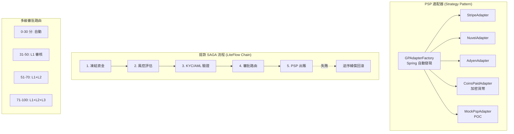

- **Resilience4j 熔斷器**: 單一 PSP 故障不影響整體
- **健康檢查**: 30 秒間隔, 連續 3 次成功自動切回

---

## 六、遊戲整合

### 6.1 供應商適配器

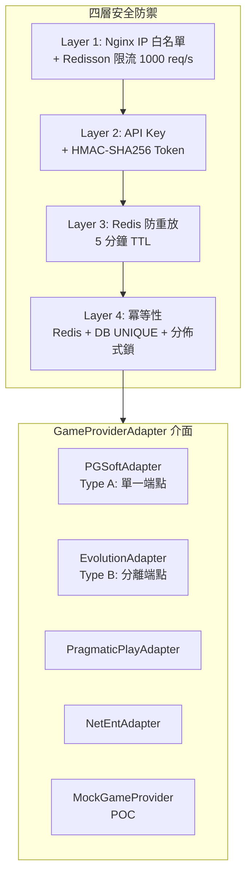

### 6.2 遊戲大廳

- **元數據同步**: GameDiscoveryJob 每 4 小時同步 GP 目錄, 新遊戲預設 DISABLED
- **快取**: Redis TTL 15 分鐘 (高讀低寫)
- **RTP 斷路器**: 單一租戶/供應商 1 小時 RTP > 200% 且投注 > $10K → 自動暫停

---

## 七、風控引擎

### 7.1 五層偵測架構

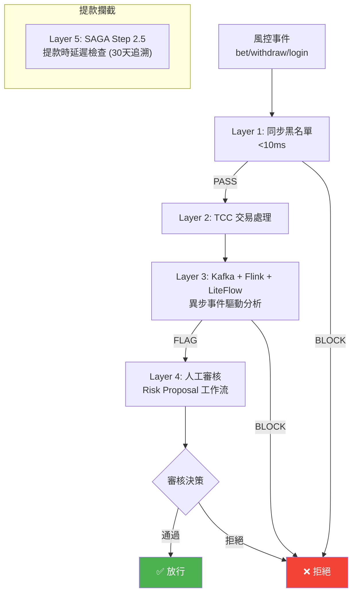

### 7.2 核心技術組件

| 組件 | 技術 | 效能 |
|------|------|------|
| 訊息匯流排 | Kafka | 35K+ TPS |
| 串流處理 | Flink (CEP, 5 分鐘滑動視窗) | — |
| 特徵儲存 | Redis Cluster | P99 < 1ms |
| 規則引擎 | LiteFlow | 100K+ QPS |
| ML 模型 | Isolation Forest | P99 < 50ms |
| 圖分析 | Neo4j (BFS 深度 3) | 多帳戶關聯 |

### 7.3 LiteFlow 風控組件

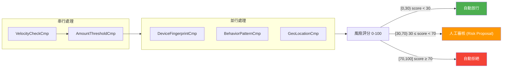

> **程式碼常數** (`THRESHOLD_AUTO_APPROVE = 30`, `THRESHOLD_AUTO_REJECT = 70`)
> 來源: `implementation/03-risk-engine-design.md`

**提款審批子分級** (MANUAL_REVIEW 區間內):

| 風險分數 | 審批路由 |
|---------|---------|
| [0, 30) | 自動審批 |
| [30, 51) | L1 審核 (Junior) |
| [51, 71) | L1 + L2 審核 (Senior) |
| [71, 100] | L1 + L2 + L3 (Manager) |

### 7.4 降級策略

| 等級 | 觸發條件 | 行為 | 恢復 |
|------|---------|------|------|
| Level 0 | 正常 | 全功能 | — |
| Level 1 | 圖分析超時 | 停用 Neo4j | 5 分鐘自動 |
| Level 2 | ML/Flink 故障 | 僅規則引擎 | 5 分鐘自動 |
| Level 3 | 規則引擎故障 | 白名單放行 + 黑名單阻斷 | 手動 |

### 7.5 Flag 模式 (ADR-012)

- **核心**: 投注時標記 (不阻斷) → 提款時關聯所有風控單 → 人工審核 (24h SLA)
- **零誤殺**: 風險引擎故障不阻斷投注 (Fail Open)
- **VIP 無豁免**: MGA 合規要求

---

## 八、安全架構

### 8.1 三層加密體系

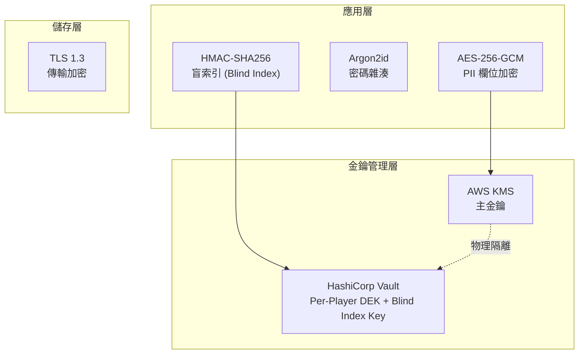

### 8.2 PII 分級加密

| 等級 | 欄位 | 加密方式 |
|------|------|---------|
| 極高 | 電話/Email/銀行帳號/身分證 | AES-256-GCM + Blind Index |
| 高 | 姓名 | AES-256-GCM |
| 中 | 地址/IP | AES-256-GCM (選擇性) |
| 密碼 | — | Argon2id (不可逆) |

### 8.3 Token 安全 (四主體差異化)

| 主體 | 類型 | 有效期 | 安全措施 |
|------|------|--------|---------|
| 玩家 | JWT + Sa-Token | 15min + Refresh 30天 | Device FP |
| 遊戲商 | Opaque API Key | 永久 | HMAC + IP 白名單 |
| 第三方 | OAuth 2.0 JWT | 1h | Scope 限制 |
| 後台管理 | JWT + MFA | 30min | TOTP + IP 限制 |

### 8.4 MFA 四層架構

| 方式 | 安全性 | 成本 | 角色 |
|------|--------|------|------|
| TOTP (Google Authenticator) | 5/5 | 5/5 | **主要** (目標 90%) |
| SMS OTP | 3/5 | 3/5 | 備用降級 |
| Email OTP | 2/5 | 5/5 | 最後備用 |
| Backup Codes (10 組) | 4/5 | 5/5 | 離線恢復 |

### 8.5 合規認證狀態

| 標準 | 狀態 | 覆蓋率 |
|------|------|--------|
| PCI-DSS v4.0 | 進行中 | 67% (目標 95%+) |
| ISO 27001:2022 | 進行中 | 技術面 13/15 關鍵項 |
| GDPR | 已實現 | 五項玩家權利 |
| UK RTS | 已對照 | 環境分離強制要求 |

### 8.6 金鑰輪換週期

- 加密金鑰: 365 天
- Blind Index 金鑰: 730 天
- Master Key: AWS KMS 自動輪換

---

## 九、資料層

### 9.1 數據架構總覽

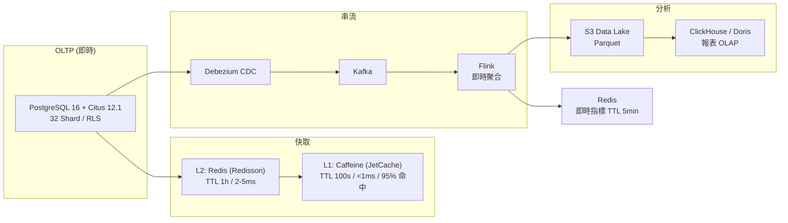

### 9.2 PostgreSQL + Citus 分片

- **架構**: Coordinator (Primary + Standby HA) → 4 Worker × 8 Shard = 32 Shard
- **分片鍵**: `tenant_id` (Hash 分片)
- **表分類**:
  - **分佈式表**: users, wallets, wallet_transactions, game_rounds (按 tenant_id)
  - **參考表**: tenants, brands, games, currencies (全節點複製)
  - **本地表**: admin_users, system_config (僅 Coordinator)
- **Colocate**: 同一 tenant_id 的表在同一 Shard, 避免跨分片 JOIN
- **連接池**: HikariCP 最大 50, Citus 2PC 多分片提交
- **精度**: DECIMAL(18,2) 用戶面 / DECIMAL(18,4) 內部計算

### 9.3 Kafka KRaft

| Topic | 分區 | 保留 |
|-------|------|------|
| user.events | 32 | 7 天 |
| wallet.transactions | 64 | 30 天 |
| game.bets | 64 | 30 天 |
| risk.alerts | 16 | 90 天 |
| affiliate.conversions | 16 | 365 天 |

- **叢集**: 3 Controller (Quorum) + 3 Broker
- **Producer**: acks=all, idempotence=true, lz4 壓縮
- **Consumer**: 手動提交, read_committed

### 9.4 數據倉庫四層模型

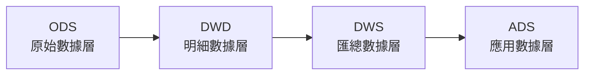

---

## 十、Gradle 模組結構

### 10.1 八個子專案

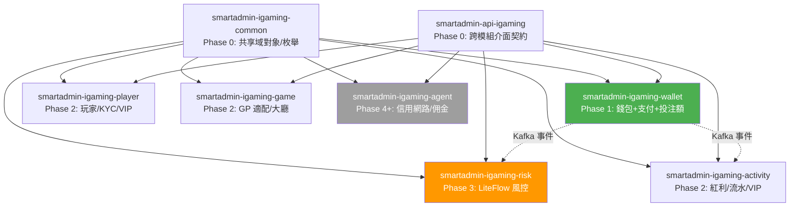

### 10.2 依賴原則

- 單向流動, 契約優先
- 高風險模組間 (Wallet ↔ Risk) 透過 Kafka 事件解耦

---

## 十一、事件驅動設計

### 11.1 DomainEvent 基類

```
eventId (UUID v4)、eventType、tenantId、aggregateType/Id、
payload (JSON)、traceId (MDC)、version、timestamp
```

### 11.2 事件發布

- **DomainEventPublisher**: 自動填充 tenantId (TenantContextHolder) 和 traceId (MDC)
- **金融事件**: 保留 90 天以上
- **審計事件**: 永久保留

---

## 十二、基礎設施

### 12.1 部署架構

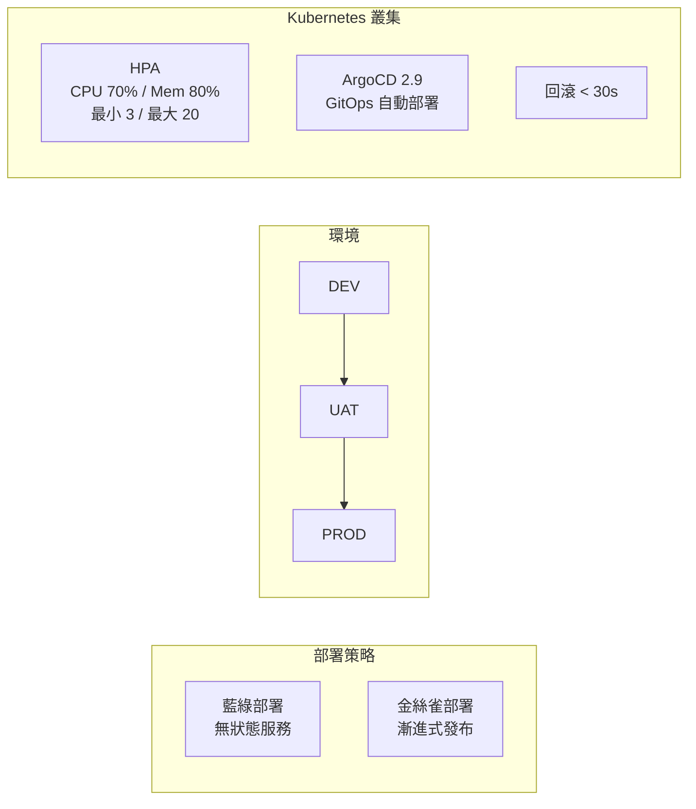

### 12.2 下注延遲預算

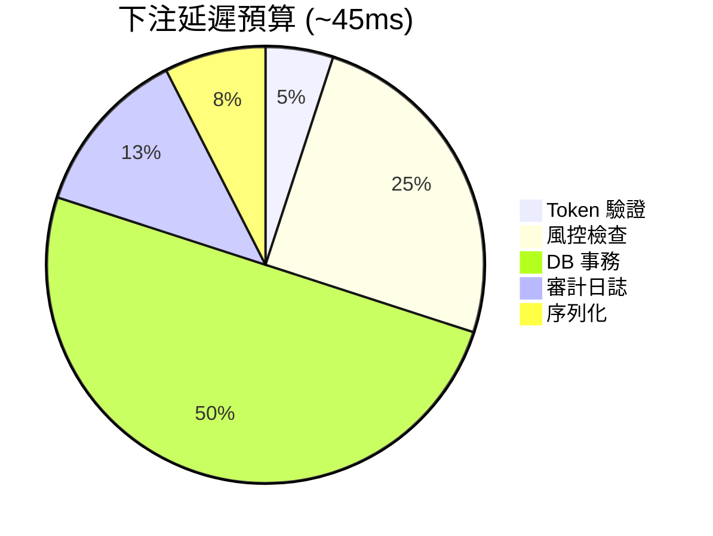

GP 超時閾值: 200-500ms，預算充裕。

### 12.3 快取策略

| 層級 | 技術 | TTL | 延遲 | 命中率 |
|------|------|-----|------|--------|
| L1 | Caffeine (JetCache) | 100s | < 1ms | 95% |
| L2 | Redis (Redisson) | 1h | 2-5ms | — |
| DB | PostgreSQL | — | 20-50ms | — |

---

## 十三、前端架構

- **佈局引擎**: CMS 拖拽編輯器 → JSON 配置 → CDN → 渲染
- **行動 App**: React Native (CodePush 熱更新) + Redux Persist 離線存儲
- **SEO**: Next.js 14 SSR/ISR + Schema Markup
- **國際化**: 多層本地化 (靜態 UI + 動態內容), RTL 支援
- **A/B 測試**: Feature Flag + 流量分配 + 統計顯著性

---

## 十四、負責任博彩架構

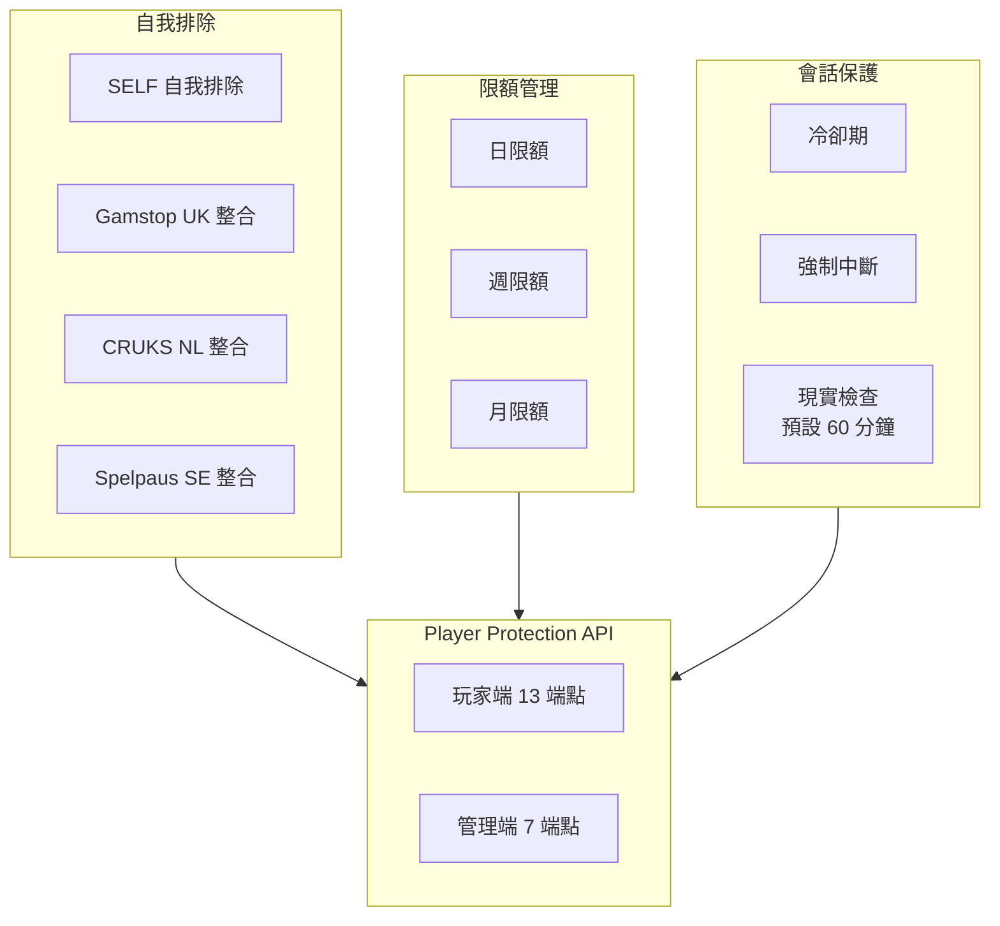

- **三層對帳**: 即時查詢 + 每日批次 + 差異偵測
- **期限**: 24H-PERMANENT, 降低即生效, 提高需冷卻期 (24-72h)

---

## 十五、實作進度與品質

### 15.1 開發階段規劃

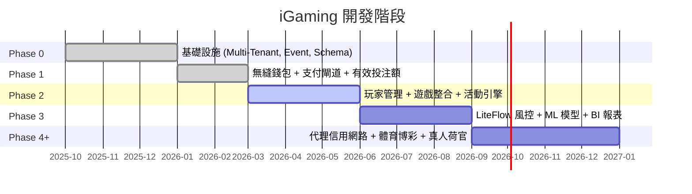

### 15.2 Phase 1.5 驗證結果

| 指標 | 結果 |
|------|------|
| k6 效能測試 | 20,206 請求, 100% 成功, TPS 168 (目標 100), P95 68ms |
| 三層防護 | Redisson 無死鎖, 樂觀鎖衝突 <0.01%, 冪等 100% |
| ArchUnit | 5/5 全部通過 |
| 交付物 | OpenAPI 3.1.0 (377KB) + 9 端點錢包 API + 5 端點支付 API |

### 15.3 Turnover Engine 測試

| 指標 | 結果 |
|------|------|
| 單元測試 | 120/120 全部通過 (100%) |
| 覆蓋率 | Manager 97%, Service 97%, Component 52%, 整體 80%+ |
| 品質門 | ArchUnit PASS, PMD PASS, SpotBugs PASS |

### 15.4 2026 Q1 品質報告

| 指標 | 結果 | 目標 |
|------|------|------|
| 文檔總量 | 210 份 | — |
| Mermaid 覆蓋率 | 100% | ≥85% |
| SQL 覆蓋率 | 86.5% | ≥85% |
| SmartAdmin 合規 | 95%+ | ≥95% |
| 術語一致性 | 100% | ≥95% |
| SSOT 違規 | 0 | 0 |

---

## 附錄：技術文檔索引

| 模組 | 文件數 | 目錄 |
|------|--------|------|
| 系統總覽 | 5 | `architecture/00_Overview/` |
| 玩家服務 | 1 | `architecture/01_Player_Service/` |
| 財務服務 | 11 | `architecture/02_Finance_Service/` |
| 遊戲整合 | 5 | `architecture/03_Game_Integration/` |
| 活動引擎 | 3 | `architecture/04_Activity_Engine/` |
| 風控引擎 | 10 | `architecture/05_Risk_Engine/` |
| 平台核心 | 9 | `architecture/06_Platform_Core/` |
| 代理服務 | 2 | `architecture/07_Agent_Service/` |
| 分析服務 | 2 | `architecture/08_Analytics_Service/` |
| 基礎設施 | 23 | `architecture/09_Infrastructure/` |
| 平台管理 | 3 | `architecture/10_Platform_Management/` |
| 前端 | 11 | `architecture/11_Frontend/` |
| 安全 | 10 | `architecture/12_Security/` |
| 客服 | 2 | `architecture/13_Customer_Service/` |
| 第三方 | 1 | `architecture/14_Third_Party/` |
| 負責任博彩 | 4 | `architecture/15_Responsible_Gambling/` |
| ADR | 3 | `architecture/adr/` |
| 實作設計 | 15 | `implementation/` |

---

> **備註**: 本文件整合自 IGaming 專案 290+ 份文檔的技術架構內容。詳細規格請參閱 `architecture/README.md` 及各模組原始文件。
