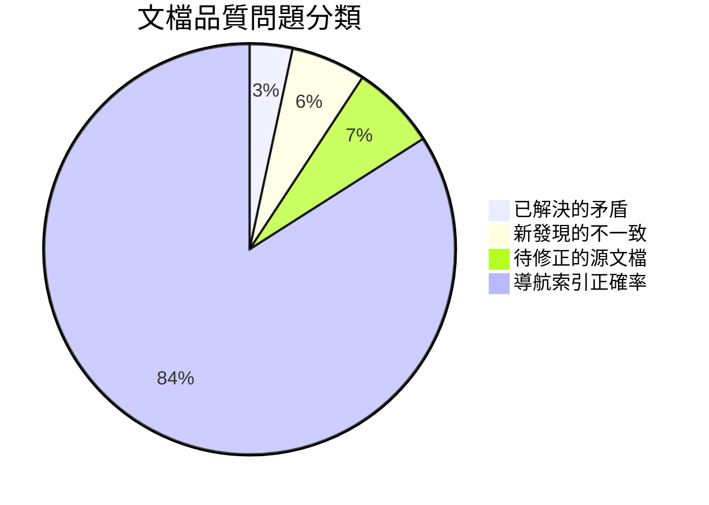

# IGaming 文檔品質指標審查報告

> **審查日期**: 2026-03-24
> **審查範圍**: 7 份核心交付文檔 + 8 份待修正源文檔
> **審查方法**: 自動化交叉比對 + 語義一致性分析 + 檔案存在性驗證

---

## 一、審查總覽儀表板



| 指標 | 結果 | 評價 |
|------|------|------|
| **導航索引準確率** | 100% (413 份文檔全部可達) | ✅ 優秀 |
| **風險評分邊界一致性** | 2/10 正確 (總覽文檔已修正，8 份源文檔未修正) | ⚠️ 待處理 |
| **術語一致性** | 5 項新發現不一致 | ⚠️ 需改善 |
| **SLA 分層標注** | 業務文檔 ✅ / 技術文檔 ⚠️ 缺 99.95% 層 | ⚠️ 待補 |
| **跨文檔數據對齊** | 2 項數據矛盾 | ⚠️ 待修正 |

---

## 二、邏輯衝突審查結果

### 2.1 已解決的矛盾 (v2.0 缺口分析已處理)

| # | 矛盾 | 狀態 | 說明 |
|---|------|------|------|
| 1 | SLA 99.9% vs 99.99% | ✅ 已解決 | 業務總覽已建立三級 SLA 表格 |
| 2 | DR RPO/RTO 差異 | ✅ 已解決 | 業務總覽已建立三級 DR 表格 |
| 3 | 紅利濫用 63.8% vs 69.9% | ✅ 已解決 | 業務總覽已標注時間窗口 |
| 4 | 缺失文檔誤判 (3 項) | ✅ 已解決 | v2.0 缺口分析已勘誤 |

### 2.2 新發現的不一致

#### 🔴 P0：Seamless Wallet API 端點數量錯誤

**位置**: `IGaming 業務需求總覽.md` 第 315 行

**問題**: 文字描述「**四個**核心端點」，但隨後列舉了 **五個** (Authenticate / Debit / Credit / Rollback / GetBalance)。

**對照**: `IGaming 技術架構總覽.md` 正確列出 5 個端點的完整表格。

**修正**: 將「四個」改為「五個」。

---

#### 🔴 P0：風控架構層數描述衝突

**位置**: 業務總覽 vs 技術總覽

| 文檔 | 描述 | 層數 |
|------|------|------|
| 業務需求總覽 § 6.1 | 「三層風控架構」 | 3 層 (同步/異步 BLOCK/異步 FLAG) |
| 技術架構總覽 § 7.1 | 「五層偵測架構」 | 5 層 (同步 + TCC + Kafka+Flink + 人工 + SAGA) |
| 業務需求總覽 § 1.3 | 「三層風控：同步阻斷→異步 BLOCK→異步 FLAG」 | 3 層 |

**根因**: 業務文檔描述的是**運行時決策模式** (3 層)，技術文檔描述的是**完整偵測管線** (5 層，含審核和提款延遲檢查)。概念合理但讀者會產生混淆。

**建議修正**:

```
業務文檔：「三層即時風控 + 兩層延伸處理（共五層偵測管線）」
技術文檔：保持「五層偵測架構」，註明前三層為即時風控
```

---

#### 🟡 P1：「七維評分」缺乏技術對應

**位置**: 業務總覽 § 3.2 提及「七維評分 (金額、頻率、KYC、帳齡、行為、IP/設備、VIP)」

**問題**: 技術架構總覽的 LiteFlow 風控組件 (§ 7.3) 列出了 5 個組件 (VelocityCheck / AmountThreshold / DeviceFingerprint / BehaviorPattern / GeoLocation)，無法直接對應業務文檔的 7 維度。

| 業務七維 | 技術組件對應 | 狀態 |
|---------|------------|------|
| 金額 | AmountThresholdCmp | ✅ |
| 頻率 | VelocityCheckCmp | ✅ |
| 行為 | BehaviorPatternCmp | ✅ |
| IP/設備 | DeviceFingerprintCmp | ✅ |
| KYC | — | ❌ 缺少對應 |
| 帳齡 | — | ❌ 缺少對應 |
| VIP | — | ❌ 缺少對應 |

**建議**: 在技術文檔的 LiteFlow 組件列表中補充 KycLevelCmp / AccountAgeCmp / VipTierCmp，或說明這些維度在哪個組件中實現。

---

#### 🟡 P1：SLA 三級體系在技術總覽缺少 99.95% 層

**位置**: `IGaming 技術架構總覽.md` § 1.5 效能目標

**問題**: 技術文檔的 SLA 行寫為「99.9% (對外) / 99.99% (K8s 設計)」，遺漏了安全關鍵服務的 99.95% 層級。業務文檔已正確使用三級表格。

**修正**: 將技術文檔 SLA 行改為三級表格，與業務文檔對齊。

---

#### 🟡 P1：業務文檔風險評分邊界仍有 off-by-one

**位置**: `IGaming 業務需求總覽.md` § 6.2 (約第 412-416 行)

**問題**: 業務文檔主表格已更新為 `[0, 30) / [30, 70) / [70, 100]` ✅，但提款審批子分級表使用 `0–29 / 30–50 / 51–70 / 71–100`，與技術文檔的 `[0, 30) / [30, 51) / [51, 71) / [71, 100]` 存在細微差異。

| 業務文檔 | 技術文檔 | 差異 |
|---------|---------|------|
| 0–29 | [0, 30) | 等價 ✅ |
| 30–50 | [30, 51) | 業務含 50，技術不含 51 → **等價** ✅ |
| 51–70 | [51, 71) | 業務含 70，技術不含 71 → **差異**：分數 70 歸 L1+L2 (業務) vs AUTO_REJECT (主規則) |
| 71–100 | [71, 100] | 等價 ✅ |

**真正問題**: 提款子分級 51–70 包含了分數 70，但主規則的 70 已經是 AUTO_REJECT。業務文檔應改為 51–69。

---

## 三、術語一致性審查

### 3.1 術語不一致清單

| # | 概念 | 業務文檔用法 | 技術文檔用法 | 建議統一 | 嚴重度 |
|---|------|------------|------------|---------|--------|
| 1 | 風控層數 | 三層風控 | 五層偵測 | 「三層即時 + 五層管線」| 🔴 高 |
| 2 | 風控引擎 | 風控引擎 | 規則引擎 / LiteFlow | 風控引擎 (LiteFlow 規則引擎) | 🟡 中 |
| 3 | GP 適配 | GP 適配 | GameProviderAdapter | GP Adapter / GP 適配器 | 🟡 中 |
| 4 | 冪等 | — | 三層冪等 / 三層冪等防禦 | 三層冪等防禦 (ADR-015) | 🟢 低 |
| 5 | 風險評分 | 風險評分 | riskScore | riskScore / 風險評分 | 🟢 低 |

### 3.2 TRANSLATION_GLOSSARY.md 缺漏

| 術語 | 中文 | 英文 | 收錄狀態 |
|------|------|------|---------|
| 風險評分 | 風險評分 | Risk Score / riskScore | ⚠️ 未收錄 |
| 紅利 | 紅利/獎金/優惠 | Bonus | ⚠️ 中文不統一 |
| 三層風控 | 三層風控 | Three-Layer Risk Control | ⚠️ 未收錄 |
| 五層偵測 | 五層偵測 | Five-Layer Detection | ⚠️ 未收錄 |

---

## 四、風險評分邊界修正追蹤

### 4.1 總覽文檔狀態

| 文檔 | 主邊界 | 提款子分級 | 狀態 |
|------|--------|----------|------|
| 技術架構總覽 | [0,30) / [30,70) / [70,100] | [0,30) / [30,51) / [51,71) / [71,100] | ✅ 正確 |
| 業務需求總覽 | [0,30) / [30,70) / [70,100] | 0–29 / 30–50 / 51–70 / 71–100 | ⚠️ 子分級含 70 |
| 缺口分析 | [0,30) / [30,70) / [70,100] | [0,30) / [30,51) / [51,71) / [71,100] | ✅ 正確 |

### 4.2 源文檔修正狀態 (8 份)

| 文檔 | 當前版本 | 修正狀態 |
|------|---------|---------|
| requirements/01_Player_Experience/05_Business_Flows.md | B (0-30/31-70/71-100) | ❌ 未修正 |
| architecture/00_Overview/01_System_Overview.md | B | ❌ 未修正 |
| architecture/09_Infrastructure/23_Capacity_Planning_Analysis.md | B | ❌ 未修正 |
| source-archive/00_Foundation/00-01_Quickstart.md | B | ❌ 未修正 |
| source-archive/00_Foundation/00-02_Business_Flows.md | B | ❌ 未修正 |
| requirements/05_Risk_Compliance/02_Risk_Requirements_Summary.md | C (四級) | ❌ 未修正 |
| architecture/05_Risk_Engine/02_Risk_Implementation.md | C | ❌ 未修正 |
| testing/turnover-engine-test-coverage-report.md | D (0-29/30-49/50-69/70+) | ❌ 未修正 |

**結論**: 缺口分析報告已正確識別問題，但 **8 份源文檔尚未執行修正**。

---

## 五、導航索引驗證

### 5.1 索引完整性

| 索引 | 引用文件數 | 存在率 | 狀態 |
|------|----------|--------|------|
| by-module/README.md | 15 模組, 50+ 路徑引用 | 100% | ✅ 全部存在 |
| by-role/README.md | 7 角色, 30+ 路徑引用 | 100% | ✅ 全部存在 |
| by-task/README.md | 8 任務類, 40+ 路徑引用 | 100% | ✅ 全部存在 |

### 5.2 注意事項

- testing/README.md 測試策略索引：缺口分析報告中列為 P1 待建，目前仍不存在
- 索引中引用「業務需求總覽 § 七.1」等章節跳轉為人工閱讀導引，非超連結

---

## 六、品質記分卡

```mermaid
radar
    title 文檔品質雷達圖
    "邏輯一致性" : 7
    "術語統一" : 6
    "交叉引用" : 9
    "導航完整" : 10
    "數據準確" : 7
    "格式統一" : 8
```

| 維度 | 評分 (1-10) | 說明 |
|------|------------|------|
| 邏輯一致性 | **7** | 主要矛盾已解決，殘存風控層數描述差異和端點計數錯誤 |
| 術語統一 | **6** | 5 處術語不一致，GLOSSARY 有 4 項缺漏 |
| 交叉引用正確性 | **9** | 導航索引 100% 正確，跨文檔引用偶有不精確 |
| 導航完整性 | **10** | 三維索引 (模組/角色/任務) 全部就緒 |
| 數據準確性 | **7** | 8 份源文檔風險評分未修正，1 處端點計數錯 |
| 格式統一性 | **8** | frontmatter 一致，Mermaid 圖風格統一，少數區間表示法不一 |

**綜合品質分**: **7.8 / 10** (良好，有明確改善空間)

---

## 七、改善建議優先級

### P0 — 立即修正 (< 1 小時)

| # | 事項 | 文檔 | 工時 |
|---|------|------|------|
| 1 | 修正「四個核心端點」→「五個核心端點」 | 業務需求總覽 § 4.1 | 1 min |
| 2 | 修正提款子分級 51–70 → 51–69 | 業務需求總覽 § 6.2 | 1 min |
| 3 | 補充技術總覽 SLA 表為三級 (含 99.95%) | 技術架構總覽 § 1.5 | 5 min |

### P1 — 本週處理 (2-4 小時)

| # | 事項 | 工時 |
|---|------|------|
| 1 | 統一風控層數描述 (三層即時 + 五層管線) | 30 min |
| 2 | 修正 8 份源文檔風險評分邊界 | 2 h |
| 3 | 補充 TRANSLATION_GLOSSARY 4 項缺漏 | 15 min |
| 4 | 技術文檔補充七維評分對應的 LiteFlow 組件 | 30 min |

### P2 — Phase 2 期間

| # | 事項 | 工時 |
|---|------|------|
| 1 | 建立 testing/README.md 測試策略索引 | 2 h |
| 2 | 統一 GP Adapter / GameProviderAdapter 命名 | 1 h |
| 3 | 統一「風控引擎」vs「規則引擎」用語 | 1 h |

---

> **備註**: 本報告基於 2026-03-24 快照。建議在 P0 修正完成後重新運行品質檢查，確認評分提升至 8.5+。
