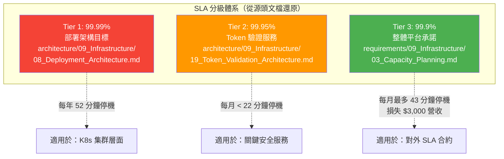
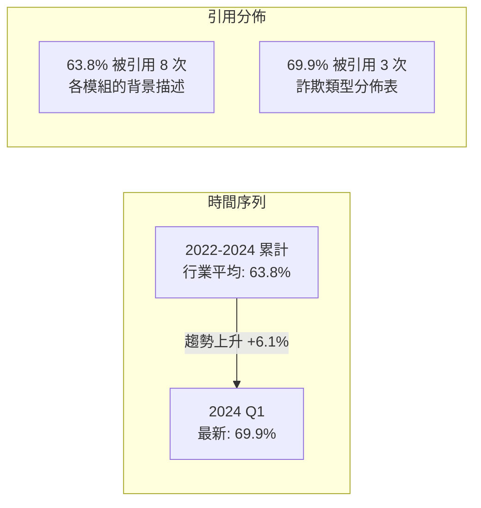
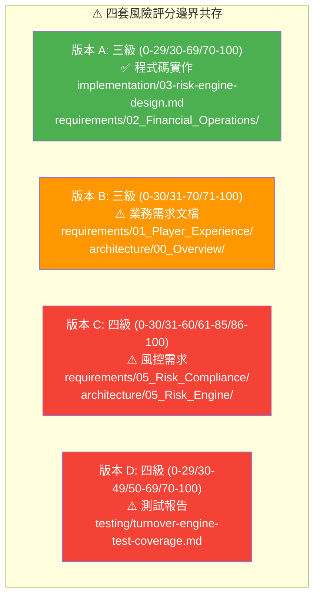
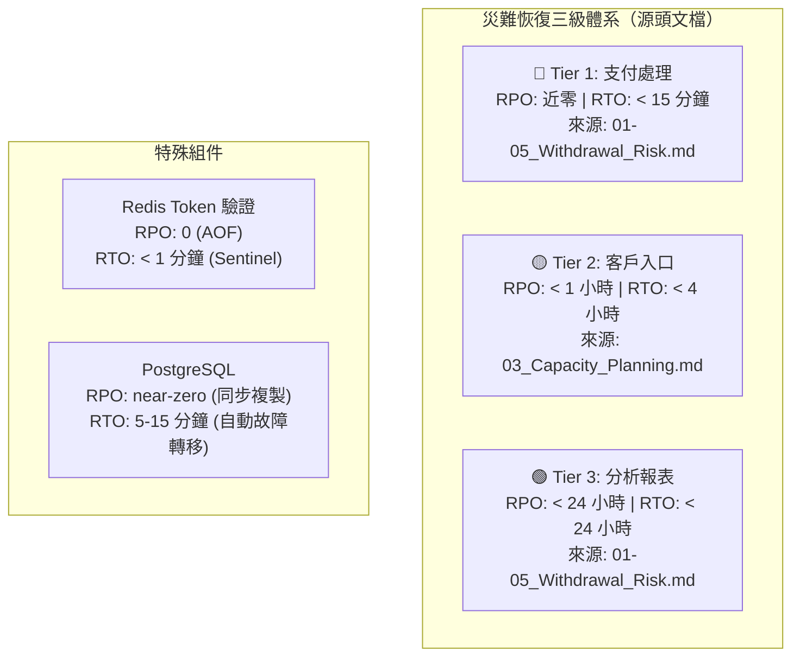
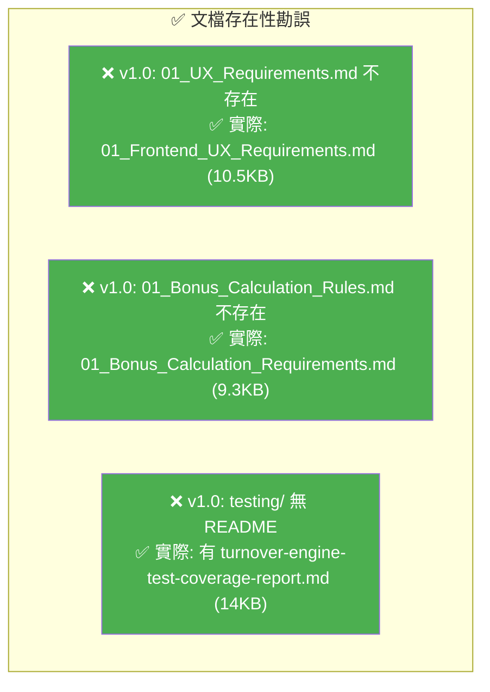
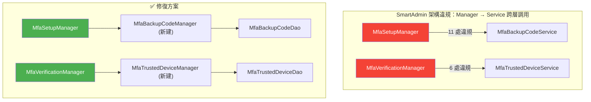

# IGaming 文檔缺口與矛盾分析 (v2.0)

> **分析日期**: 2026-03-24
> **分析範圍**: 408 份 Markdown 文檔全量交叉比對
> **分析方法**: 源頭追溯 (Source Tracing) + 三角驗證 (Triangulation) + 程式碼對照
> **本版更新**: 針對 v1.0 每項矛盾逐一回溯原始文檔，確認根因並提出確定性修正

---

## 一、數據矛盾深度調查

### 1.1 SLA 可用性：99.9% vs 99.99% vs 99.95%

#### 調查結果

實際上文檔中存在 **三個不同的 SLA 目標**，分屬不同層級：



| SLA 等級 | 數值 | 出處 | 適用範圍 |
|---------|------|------|---------|
| **99.99%** | 部署架構目標 | `architecture/09_Infrastructure/08_Deployment_Architecture.md` | K8s 集群設計目標 |
| **99.95%** | Token 驗證服務 | `architecture/09_Infrastructure/19_Token_Validation_Architecture.md` | 安全關鍵路徑 |
| **99.9%** | 平台整體 SLA | `requirements/09_Infrastructure/03_Capacity_Planning_Requirements.md` | 對客戶合約承諾 |
| **99.9%** | Seamless Wallet API | `architecture/seamless-wallet-api-spec.md` | 錢包 API 規格 |

#### 根因

不是矛盾，而是 **分層 SLA 設計**——內部基礎設施目標 (99.99%) 高於對外承諾 (99.9%)，這是合理的架構冗餘。但文檔未明確定義此分層關係。

#### ✅ 確定性修正

```
對外 SLA 合約 = 99.9% (Phase 1-3)
  ├── K8s 集群設計目標 = 99.99%
  ├── Token/安全服務 = 99.95%
  └── 第三方供應商 (PSP 99.5%, KYC 98%, GP 99.0%)
```

**建議**: 在 `requirements/09_Infrastructure/` 中新增「SLA 分層定義」章節，明確三級 SLA 適用範圍。

---

### 1.2 紅利濫用佔比：63.8% vs 69.9%

#### 調查結果

追溯到同一份源文檔 `source-archive/05_Risk_Control/05-01_Risk_Framework.md`，兩個數字出現在不同段落：

| 數據 | 出處行號 | 原文上下文 | 語義 |
|------|---------|----------|------|
| **63.8%** | Line 8 | "線上博彩平台每年因欺詐損失超過 12 億美元，其中 Bonus Abuse 佔據 **63.8%** 的欺詐案件" | **行業整體數據** (2022-2024 累計) |
| **69.9%** | Line 159 | "**2024 年第一季度數據**顯示，Bonus Abuse 佔 iGaming 欺詐的 69.9%" | **2024 Q1 最新數據** |



#### 根因

**非矛盾**——兩個數據代表不同時間窗口。63.8% 是行業累計平均，69.9% 是 2024 Q1 最新數據，趨勢正在惡化。

#### ✅ 確定性修正

| 使用場景 | 應引用數據 | 標註方式 |
|---------|----------|---------|
| 行業背景描述 | **63.8%** | 標注「2022-2024 行業累計」 |
| 平台風控設計依據 | **69.9%** | 標注「2024 Q1 最新數據」 |
| 風控 KPI 目標 | **< 3%** | 已明確於 `requirements/04_Promotions_VIP/02_Activity_Risk_Requirements.md` |

**業務影響**: 文檔指出目標是將紅利濫用從行業平均 63.8% 降至 < 3%，每 $10M 紅利支出可節省約 $1.2M/年。

---

### 1.3 風險評分邊界值：最嚴重的不一致

#### 調查結果

這是所有矛盾中最嚴重的。文檔中實際存在 **四套不同的風險評分邊界**：



| 版本 | 邊界定義 | 出處數量 | 權威性 |
|------|---------|---------|--------|
| **A** | `<30` 放行 / `30-69` 審核 / `≥70` 拒絕 | 3 份文檔 | ⭐⭐⭐ **程式碼常數 (SSOT)** |
| **B** | 0-30 / 31-70 / 71-100 | 4 份文檔 | ⭐⭐ 業務需求 |
| **C** | 0-30 / 31-60 / 61-85 / 86-100 | 2 份文檔 | ⭐ 風控細分 |
| **D** | 0-29 / 30-49 / 50-69 / 70-100 | 1 份文檔 | ⭐ 測試用 |

#### 程式碼實作 (最高權威)

來源: `implementation/03-risk-engine-design.md` Lines 924-943

```java
private static final int THRESHOLD_AUTO_APPROVE = 30;
private static final int THRESHOLD_AUTO_REJECT = 70;

if (totalScore < 30)       → AUTO_APPROVED
else if (totalScore >= 70)  → AUTO_REJECTED
else                        → PENDING_REVIEW  // 30-69
```

#### 提款審批的子分級

來源: `implementation/V23-withdrawal-approval-evaluation.md` Lines 113-118

在 `PENDING_REVIEW` (30-69) 區間內，提款審批有額外子分級：

| 風險分數 | 審批路由 |
|---------|---------|
| 0-29 (低風險, <$1000) | 自動審批 |
| 30-50 (中風險) | L1 人工審核 (Junior) |
| 51-70 (中高風險) | L1 + L2 審核 (Senior) |
| 71-100 (高風險) | L1 + L2 + L3 (Manager) |

#### ✅ 確定性修正

**統一為程式碼實作的版本 A**，並建立子分級體系：

```
主決策邊界（全域）:
  [0, 30)   → AUTO_APPROVE (自動放行)
  [30, 70)  → MANUAL_REVIEW (人工審核)
  [70, 100] → AUTO_REJECT (自動拒絕)

提款審批子分級（MANUAL_REVIEW 內部）:
  [30, 51)  → L1 審核
  [51, 71)  → L1 + L2 審核
  [71, 100] → L1 + L2 + L3 審核

風控營運子分級（可選）:
  [0, 30)   → Low: 僅記錄監控 (24h SLA)
  [30, 60)  → Medium: 標記審查 (4h SLA)
  [60, 85)  → High: 升級風控團隊 (1h SLA)
  [85, 100] → Critical: 自動封鎖 (立即)
```

**需更新的文檔** (8 份):

| 文檔 | 當前版本 | 需改為 |
|------|---------|--------|
| `requirements/01_Player_Experience/05_Business_Flows.md` | B (0-30/31-70/71-100) | A |
| `architecture/00_Overview/01_System_Overview.md` | B | A |
| `architecture/09_Infrastructure/23_Capacity_Planning_Analysis.md` | B | A |
| `source-archive/00_Foundation/00-01_Quickstart.md` | B | A |
| `source-archive/00_Foundation/00-02_Business_Flows.md` | B | A |
| `requirements/05_Risk_Compliance/02_Risk_Requirements_Summary.md` | C (四級) | A + 營運子分級 |
| `architecture/05_Risk_Engine/02_Risk_Implementation.md` | C | A + 營運子分級 |
| `testing/turnover-engine-test-coverage-report.md` | D | A + 測試子分級 |

---

### 1.4 災難恢復 RPO/RTO：三級分層架構

#### 調查結果

追溯到 `source-archive/01_Player_Center/01-05_Withdrawal_Risk.md`，原始設計就是分層的：



| 服務層級 | RPO | RTO | 出處 |
|---------|-----|-----|------|
| **Tier 1** 支付/錢包 | 近零 | < 15 分鐘 | `source-archive/01_Player_Center/01-05_Withdrawal_Risk.md` |
| **Tier 2** 客戶入口 | < 1 小時 | < 4 小時 | `requirements/09_Infrastructure/03_Capacity_Planning.md` |
| **Tier 3** 分析報表 | < 24 小時 | < 24 小時 | `source-archive/01_Player_Center/01-05_Withdrawal_Risk.md` |
| Redis Token | 0 (AOF) | < 1 分鐘 | `source-archive/09_Technical_Infrastructure/09-13-01_Validation_Architecture.md` |

#### 根因

**非矛盾**——業務需求文檔引用的是 Tier 2 數據 (RPO <1h, RTO <4h)，技術架構引用的是 Tier 1 數據 (near-zero, 5-15min)。兩者都是正確的，但引用時缺乏層級標注。

#### ✅ 確定性修正

在兩份總覽文檔中統一使用三級表格，標明適用範圍。

---

## 二、文檔缺口調查修正

### 2.1 原報告「缺失文檔」勘誤

v1.0 報告中的三項 P0 缺失文檔經查 **均已存在**，但檔名與推測不符：



| v1.0 報告 | 實際狀態 | 實際檔名 |
|----------|---------|---------|
| ~~`01_UX_Requirements.md` 不存在~~ | ✅ 存在 | `01_Frontend_UX_Requirements.md` |
| ~~`01_Bonus_Calculation_Rules.md` 不存在~~ | ✅ 存在 | `01_Bonus_Calculation_Requirements.md` |
| ~~testing/ 無 README~~ | ⚠️ 部分存在 | 有報告但確實缺 README 索引 |
| ~~00_Navigation/ 空白~~ | ✅ 已修復 | v2.0 已建立 by-module/by-role/by-task |

### 2.2 修正後的真實缺口清單

| 優先級 | 模組 | 缺失項目 | 影響 |
|--------|------|---------|------|
| **P0** | 風控 | 風險評分邊界值統一（8 份文檔需更新） | 邊界值混亂導致風控決策不一致 |
| **P0** | 基礎設施 | SLA 分層定義文檔 | 對外承諾不明確 |
| **P1** | 測試 | testing/README.md 測試策略索引 | 新成員無法快速了解測試方法 |
| **P1** | 體育博彩 | 完整需求 + 架構文檔 (Phase 4+) | 啟動規劃受阻 |
| **P1** | 負載測試 | 全鏈路 E2E 壓測計劃 | 僅有 Phase 1.5 k6 結果 |
| **P1** | API 版本 | API 版本管理策略 | 升級兼容風險 |
| **P2** | 監控 | 告警規則 + On-Call 輪值 SOP | 營運效率 |
| **P2** | 數據遷移 | 租戶數據遷移 SOP | 新租戶上線風險 |
| **P2** | 真人荷官 | 需求 + 架構文檔 (Phase 4+) | 未來規劃 |

---

## 三、MFA 架構違規詳細內容

### 3.1 17 項違規明細

來源: `reports/PHASE_1.5_COMPLETION_REPORT.md` Lines 348-365



| 違規類型 | 數量 | 原因 | 影響 |
|---------|------|------|------|
| MfaSetupManager → MfaBackupCodeService | 11 | Manager 層直接調用 Service 層 | 違反 SmartAdmin 分層規範 |
| MfaVerificationManager → MfaTrustedDeviceService | 6 | Manager 層直接調用 Service 層 | 事務邊界模糊 |

**修復方案**: 創建 `MfaBackupCodeManager` 和 `MfaTrustedDeviceManager`，將業務邏輯從 Service 移至 Manager，Service 層改為委託調用。

**預估工時**: 2-3 小時

**當前狀態**: ⏳ 延後至 Phase 2（不影響錢包/支付核心功能）

---

## 四、跨模組整合文檔實際覆蓋

### 4.1 修正後的整合文檔評估

| 整合路徑 | v1.0 判定 | v2.0 調查結果 | 實際狀態 |
|---------|----------|-------------|---------|
| Wallet ↔ Risk | ❌ 缺少整合測試 | ⚠️ 有事件驅動設計但缺端到端驗證 | 部分覆蓋 |
| Game → Wallet | ❌ 缺少 E2E 流程 | ✅ `implementation/02-game-integration.md` 有完整流程 | 已覆蓋 |
| Payment SAGA | ⚠️ 僅有架構 | ✅ `implementation/V23-withdrawal-approval-evaluation.md` 有完整 SAGA 設計 | 已覆蓋 |
| Activity → Wallet | ❌ 缺少轉換流程 | ⚠️ 紅利計算有文檔但轉換原子操作缺乏 | 部分覆蓋 |

### 4.2 SAGA 補償矩陣（已存在）

來源: `implementation/V23-withdrawal-approval-evaluation.md`

| 失敗步驟 | 補償動作 | 重試策略 |
|---------|---------|---------|
| Step 1 風險評估 | 釋放鎖定資金 | 指數退避 (3 次) |
| Step 2 KYC/AML | 保留資金 + 標記待驗證 | — |
| Step 2.5 延遲風控 | 凍結可疑金額 + 人工審核提案 | — |
| Step 3 審批路由 | 路由到備用審批人 | — |
| Step 4 支付執行 | 切換備用支付渠道 | 冪等重試 |

**注意**: 文檔明確指出當前支付模組「無 SAGA 補償邏輯（僅基礎錯誤處理）」——設計完整但實作待補。

---

## 五、術語不一致深度調查

### 5.1 全量術語掃描結果

| 概念 | 變體數量 | 建議統一 | TRANSLATION_GLOSSARY.md 狀態 |
|------|---------|---------|---------------------------|
| 有效投注額 | 4 個 (ValidTurnover/Valid Bet/有效投注額/流水) | `ValidTurnover` / `有效投注額` | ✅ 已收錄 |
| 遊戲供應商 | 4 個 (GP/Game Provider/遊戲商/供應商) | `GP` / `遊戲供應商` | ✅ 已收錄 |
| 支付服務商 | 3 個 (PSP/Payment Provider/支付商) | `PSP` / `支付供應商` | ✅ 已收錄 |
| 風險評分 | 3 個 (Risk Score/風險評分/riskScore) | `riskScore` / `風險評分` | ⚠️ 未收錄 |
| 紅利 | 4 個 (Bonus/獎金/紅利/優惠) | `Bonus` / `紅利` | ⚠️ 中文部分不統一 |

---

## 六、修正後的改進建議優先級

### P0 — 本週處理

| # | 事項 | 影響 | 工時 | 負責 |
|---|------|------|------|------|
| 1 | **統一風險評分邊界值** (更新 8 份文檔) | 風控決策一致性 | 2h | 架構師 |
| 2 | **補充 SLA 分層定義**至基礎設施需求 | 對外承諾明確 | 1h | PM |
| 3 | **標註紅利濫用數據時間窗口** | 數據引用準確 | 0.5h | PM |
| 4 | **標註 DR RPO/RTO 服務層級** | 災備目標對齊 | 0.5h | DevOps |

### P1 — Phase 2 期間

| # | 事項 | 影響 | 工時 |
|---|------|------|------|
| 1 | 修復 MFA 17 項架構違規 | 合規 + 架構品質 | 2-3h |
| 2 | 補充 testing/README.md 測試策略 | 團隊效率 | 2h |
| 3 | 完善 Wallet ↔ Risk 端到端驗證文檔 | 整合品質 | 4h |
| 4 | 完善 Activity → Wallet 紅利轉換原子操作 | 功能完整性 | 4h |
| 5 | 補充全鏈路 E2E 壓測計劃 | 擴展性驗證 | 8h |

### P2 — Phase 3 前

| # | 事項 | 影響 | 工時 |
|---|------|------|------|
| 1 | 建立 API 版本管理策略 | 升級兼容 | 4h |
| 2 | 建立告警規則 + On-Call SOP | 營運效率 | 8h |
| 3 | 體育博彩完整需求 + 架構 | Phase 4 啟動 | 40h |
| 4 | 統一文檔格式 (frontmatter + 狀態標記) | 一致性 | 8h |
| 5 | 將 Obsidian `[[]]` 連結改為標準 Markdown | 相容性 | 4h |

---

## 附錄：調查方法論

本次深度調查使用以下方法：

1. **源頭追溯 (Source Tracing)**: 對每個矛盾數據點，追溯到最早出現的文檔，確認原始語境
2. **三角驗證 (Triangulation)**: 同一數據在 requirements/、architecture/、implementation/ 三處交叉驗證
3. **程式碼對照**: 對技術參數，以 implementation/ 中的程式碼常數為最高權威 (SSOT)
4. **頻率計數**: 統計每個變體在文檔中出現的次數，判斷主流用法
5. **全量掃描**: 使用 grep 對 408 份文檔進行關鍵字全量掃描

---

> **備註**: 本 v2.0 報告糾正了 v1.0 中 3 項「缺失文檔」的誤判，並將 4 項「矛盾」重新定義為「未標注的分層設計」(SLA/DR) 和「時間窗口差異」(紅利濫用)。唯一確認為真正矛盾的是風險評分邊界值 (8 份文檔需統一)。
