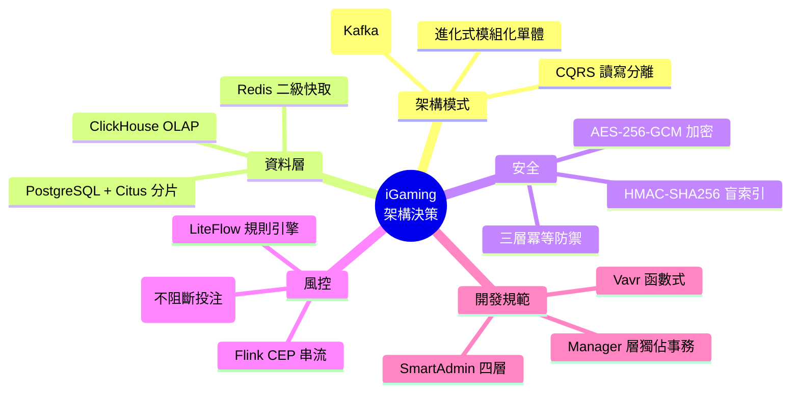
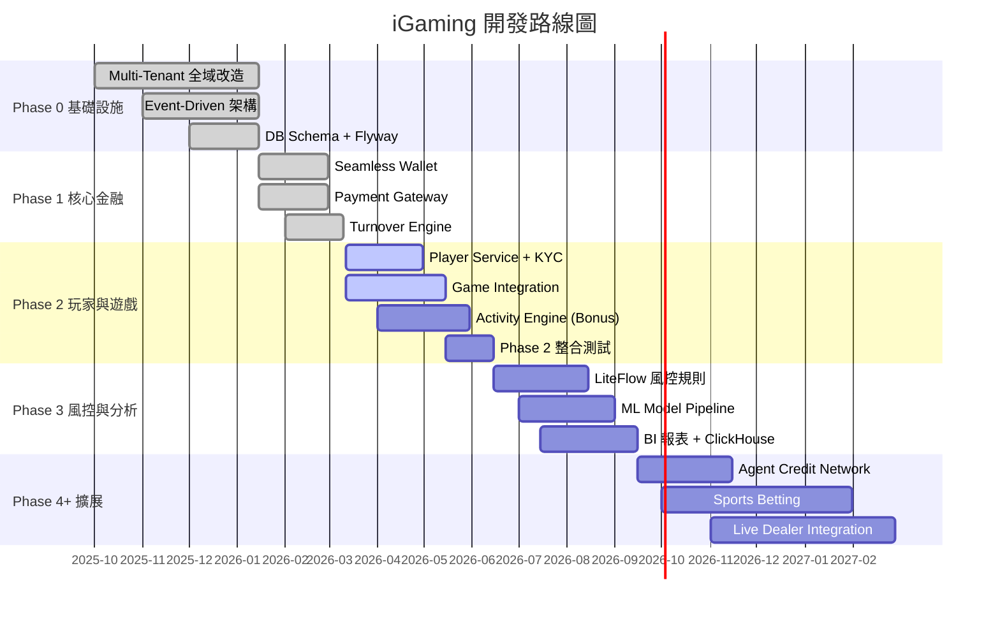
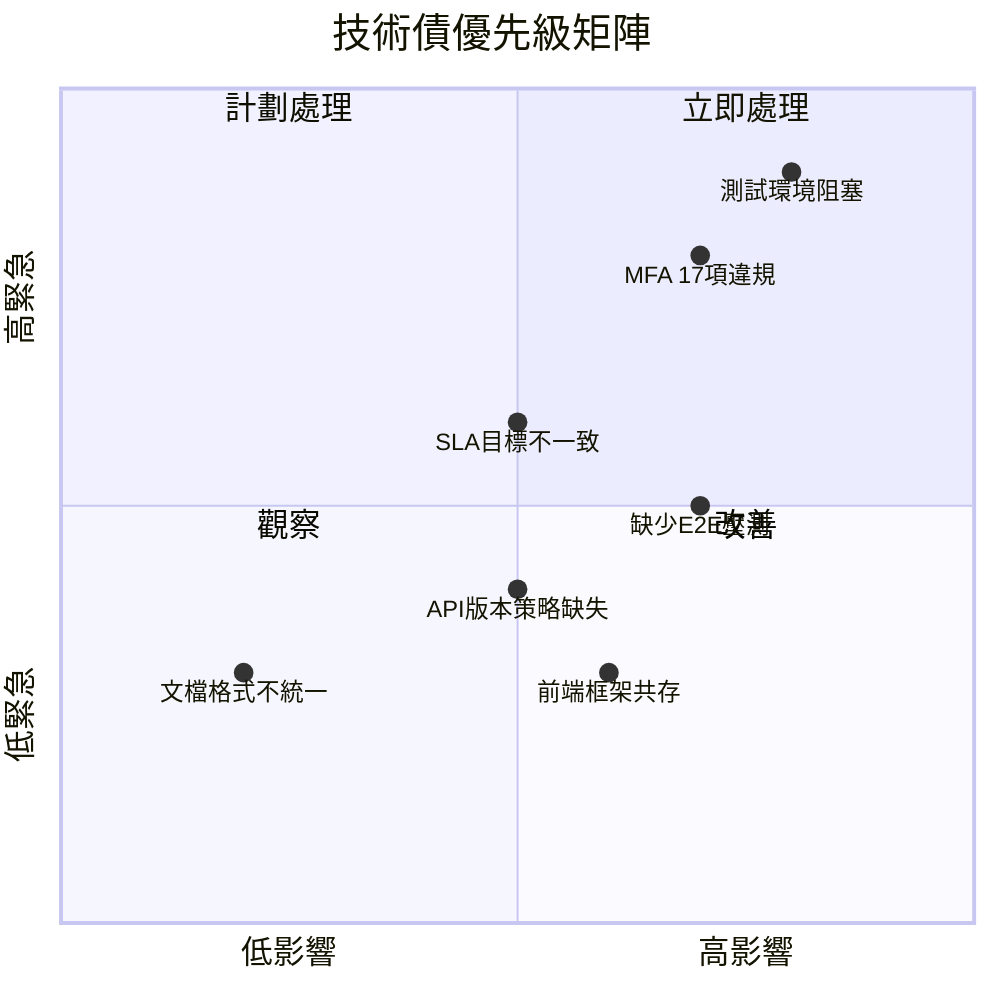
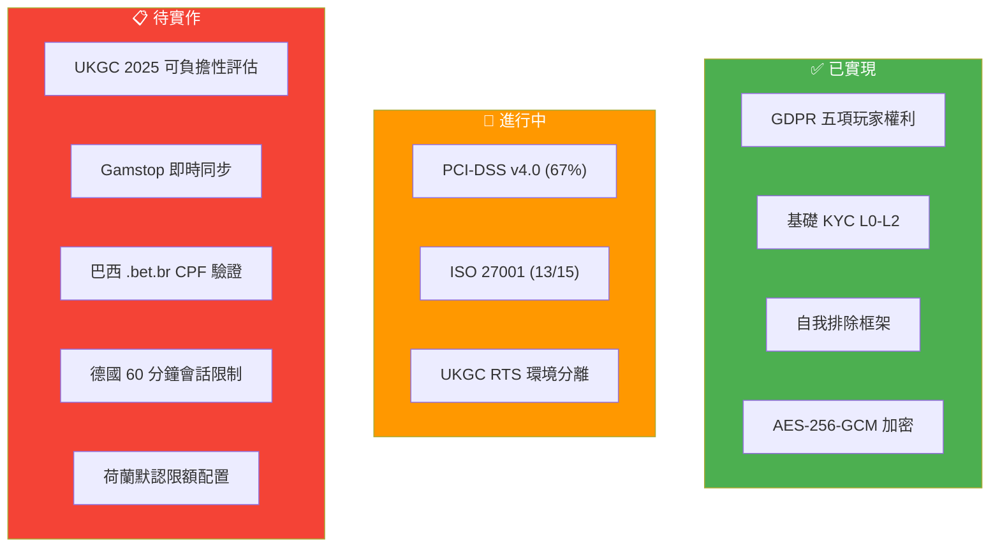

# IGaming 核心決策摘要與開發優先級

> **產生日期**: 2026-03-24
> **適用範圍**: Phase 2 (進行中) → Phase 3 → Phase 4+

---

## 一、已確立的核心架構決策

### 1.1 決策地圖

### 1.2 ADR 決策清單

| ADR | 決策主題 | 結論 | 不可逆程度 | 狀態 |
|-----|---------|------|----------|------|
| ADR-001 | 命名規範 | 單數標準 (t_player, PlayerEntity) | 高 (全域影響) | ✅ 已執行 |
| ADR-012 | 異步風控模式 | Flag 模式：投注不阻斷，提款攔截 | 中 | ✅ 已確立 |
| ADR-013 | Manager 層邊界 | 分佈式鎖 + @Transactional 限定 Manager | 高 | ✅ 已執行 |
| ADR-014 | @TenantIgnore 策略 | 白名單制度，禁止跨租戶訪問敏感數據 | 高 | ✅ 已執行 |
| ADR-015 | 三層冪等 | Redis → DB UNIQUE → Fallback | 中 | ✅ 已執行 |
| — | Kafka KRaft | 去 ZooKeeper，故障轉移 <1s | 高 | ✅ 已選定 |
| — | Flink vs Kafka Streams | Flink (CEP 核心，獨立集群) | 高 | ✅ 已選定 |
| — | PG+Citus vs NewSQL | Citus (成本低 40%，PG 生態) | 高 | ✅ 已選定 |

### 1.3 待決策事項

| 決策點 | 選項 | 相關模組 | 建議時間 |
|--------|------|---------|---------|
| API Gateway 選型確認 | Kong 3.5 vs Apache APISIX | 基礎設施 | Phase 2 中期 |
| 體育博彩賠率引擎 | 自建 vs 第三方整合 | 遊戲服務 | Phase 4 規劃時 |
| 真人荷官整合模式 | Seamless vs Transfer Wallet | 遊戲服務 | Phase 4 規劃時 |
| ML 模型部署方式 | Sidecar vs 獨立微服務 | 風控引擎 | Phase 3 初期 |
| 前端框架統一 | React (Web) + Vue 3 (CMS 渲染) 共存 vs 統一 | 前端 | Phase 3 |

---

## 二、開發階段與里程碑

### 2.1 總體路線圖

### 2.2 Phase 2 當前狀態 (2026-03-24)

| 任務 | 狀態 | 備註 |
|------|------|------|
| Player Service 資料庫遷移 | ✅ 完成 | V23-V24 已驗證 |
| Game Provider Adapter 骨架 | 🔄 進行中 | PGSoft + Evolution 優先 |
| Turnover Engine 單測 | ✅ 完成 | 120/120 通過, 覆蓋率 80%+ |
| 測試環境配置 | ⚠️ 70% | SecurityConfigProvider 阻塞 |
| MFA 架構違規修復 | 📋 延後 | 17 項，Phase 2 期間處理 |
| Stripe/PayPal Adapter | ❌ 跳過 | 建議 Phase 2 後期再做 |

---

## 三、技術債與風險

### 3.1 技術債清單

| 技術債 | 影響 | 緊急度 | 建議處理時間 |
|--------|------|--------|------------|
| 測試環境 SecurityConfigProvider 缺失 | P0 阻塞整合測試 | 🔴 高 | 本週 |
| MFA 17 項架構違規 | 安全合規風險 | 🟡 中 | Phase 2 中期 |
| SLA 目標不一致 (99.9% vs 99.99%) | 營運承諾混亂 | 🟡 中 | Phase 2 |
| 缺少全鏈路 E2E 壓測 | 上線風險 | 🟡 中 | Phase 2 驗收 |
| API 版本管理策略缺失 | 未來升級困難 | 🟢 低 | Phase 3 前 |
| 前端 React + Vue 3 共存 | 維護成本高 | 🟢 低 | Phase 3 評估 |

### 3.2 風險矩陣

| 風險 | 可能性 | 影響 | 緩解措施 |
|------|--------|------|---------|
| Phase 2 遊戲整合延期 | 中 | 高 | 優先完成 PGSoft + Evolution 兩家 |
| UKGC 2025 可負擔性新規不合規 | 高 | 極高 | Phase 3 初期優先實作 |
| 單體架構擴展瓶頸 | 低 | 高 | Kafka 事件解耦保留微服務萃取能力 |
| 第三方 KYC 供應商中斷 | 中 | 中 | 手動審查 Fallback + 多供應商備援 |
| 加密貨幣法規變化 | 中 | 中 | CoinsPaid 適配器可快速切換 |

---

## 四、合規優先級

### 4.1 各牌照關鍵合規要求

### 4.2 合規實作優先級

| 優先級 | 合規要求 | 牌照 | 建議階段 |
|--------|---------|------|---------|
| **P0** | UKGC 可負擔性評估 (£125/£500/£2000) | UKGC | Phase 3 初期 |
| **P0** | PCI-DSS v4.0 完成 (67% → 95%) | 全部 | Phase 2-3 |
| **P1** | Gamstop 即時查詢 + 每日批次同步 | UKGC | Phase 3 |
| **P1** | ISO 27001 剩餘 2 項控制 | 全部 | Phase 3 |
| **P1** | 德國 60 分鐘會話強制中斷 | 德國牌照 | Phase 3 |
| **P2** | 巴西 CPF 驗證 + PIX 支付整合 | Brazil SPA | Phase 4 |
| **P2** | 荷蘭默認限額 (日€200/週€700/月€2000) | CRUKS | Phase 4 |

---

## 五、下一步行動建議

### 5.1 本週 (2026-03-24 ~ 03-28)

1. ✅ 修復 Sprint 3 測試環境 SecurityConfigProvider (0.1 人天)
2. ✅ 統一 SLA 可用性目標文檔
3. ✅ 統一風險評分邊界值定義

### 5.2 Phase 2 剩餘 (2026-04 ~ 06)

1. 完成 PGSoft + Evolution 遊戲整合
2. 完成 Activity Engine (紅利引擎) 核心功能
3. 修復 MFA 17 項架構違規
4. 補充缺失的 UX 需求 + 紅利計算規則文檔
5. 執行 Phase 2 整合測試 + 壓測
6. 建立 00_Navigation 導航索引

### 5.3 Phase 3 準備 (2026-06 前確認)

1. 確定 ML 模型部署方式 (Sidecar vs 微服務)
2. 確定 API Gateway 選型 (Kong vs APISIX)
3. 規劃 UKGC 可負擔性評估實作方案
4. 建立全鏈路 E2E 壓測基準

---

## 附錄：關鍵 KPI 追蹤表

| KPI | 目標 | 當前 | 差距 | 負責模組 |
|-----|------|------|------|---------|
| 錢包計算精確度 | 99.99% | ✅ 100% (Phase 1.5 驗證) | — | 財務 |
| 有效投注額精確度 | 100% | ✅ 120/120 測試通過 | — | 財務 |
| TPS | ≥100 | ✅ 168 (超 68%) | — | 基礎設施 |
| P95 回應 | <100ms | ✅ 68ms | — | 基礎設施 |
| ArchUnit 合規 | 100% | ✅ 5/5 | — | 開發 |
| PCI-DSS 覆蓋 | ≥95% | 67% | -28% | 安全 |
| ISO 27001 | 15/15 | 13/15 | -2 項 | 安全 |
| 測試環境就緒 | 100% | 70% | -30% | QA |

---

> **備註**: 本文件為 2026-03-24 快照。建議每兩週在 Sprint Review 中更新進度。
