# IGaming 業務需求總覽

> **最後更新**: 2026-03-24
> **文檔來源**: `requirements/` (66 份) + `source-archive/` (193 份) + 根目錄文檔
> **專案版本**: v4.1.0 | 約 150,000 行 Markdown

---

## 一、專案概覽

### 1.1 平台定位

iGaming 平台是一套面向 **多品牌、多司法管轄區** 的綜合性線上博弈解決方案，支援三種商業模式：

| 模式 | 價格帶 | 適用場景 |
|------|--------|---------|
| 白標 (White Label) | $10K–$150K | 快速上線、品牌定制 |
| 交鑰匙 (Turnkey) | $50K–$150K | 全套營運支持 |
| 客製化建置 (Custom Build) | $500K–$1.5M+ | 完全客製化功能 |

全球線上博彩市場 2024 年規模達 $786–955 億。

### 1.2 平台業務全景圖

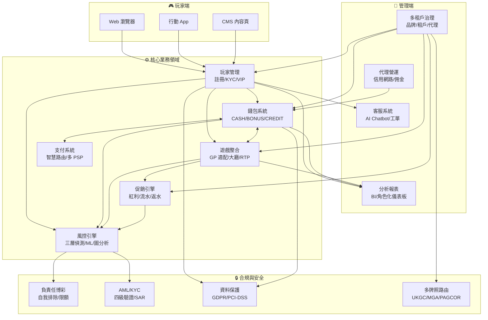

### 1.3 五大核心業務領域

| # | 領域 | 說明 |
|---|------|------|
| 1 | **錢包與可下注餘額** | 雙錢包設計 (CASH + BONUS)，公式：`可下注餘額 = 現金餘額 - 鎖定金額 - 進行中投注` |
| 2 | **有效投注額計算** | 三層驗證公式：`ValidTurnover = BetAmount × RiskFactor(0/1) × StatusFactor(0-100%) × GameWeight(5-100%)` |
| 3 | **Token 驗證與 API 安全** | HMAC-SHA256 簽名 + 5 分鐘 TTL + 防重放攻擊 |
| 4 | **多租戶架構** | 四層層級：平台 → 品牌 → 租戶 → 代理，資料 100% 隔離 |
| 5 | **風控規則引擎** | 三層風控：同步阻斷 (<10ms) → 異步 BLOCK (~5s) → 異步 FLAG (~5s) |

### 1.4 端到端玩家旅程

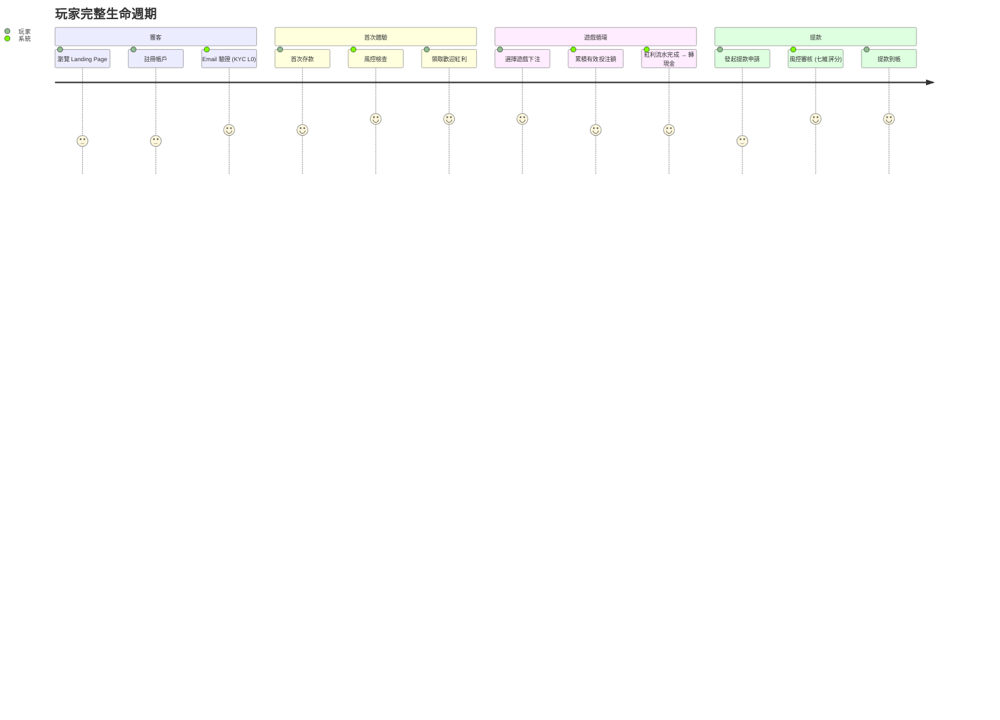

---

## 二、玩家體驗 (Player Experience)

### 2.1 玩家生命週期狀態機

```mermaid
stateDiagram-v2
    [*] --> New: 註冊
    New --> Active: 首次存款/投注
    Active --> Dormant: 90 天無活動
    Dormant --> Active: 重新登入/存款
    Dormant --> Churned: 180 天無活動
    Active --> Churned: 主動要求關閉帳戶
    Churned --> Active: 重新激活(需重新 KYC)

    state Active {
        [*] --> ACTIVE_NORMAL
        ACTIVE_NORMAL --> LOCKED: 風控觸發/MFA 失敗
        LOCKED --> ACTIVE_NORMAL: 解鎖審核通過
        ACTIVE_NORMAL --> SUSPENDED: AML 調查/自我排除
        SUSPENDED --> ACTIVE_NORMAL: 調查完成/排除期滿
        ACTIVE_NORMAL --> PENDING_VERIFICATION: KYC 升級觸發
        PENDING_VERIFICATION --> ACTIVE_NORMAL: 驗證通過
    end
```

**RFM 分群模型**: 以最近交易時間 (Recency)、交易頻率 (Frequency)、交易金額 (Monetary) 三維度進行玩家分群，驅動個性化營銷和遊戲推薦。

**問題賭博監控指標**: 存款頻率異常、追輸行為 (Loss-Chasing)、深夜活動模式、快速增加存款金額。

### 2.2 KYC 四級驗證

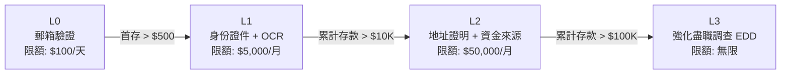

### 2.3 VIP 等級系統

| 等級 | 月度有效投注額門檻 | 返水比例 | 提款限額/日 | 客服 SLA |
|------|-------------------|---------|------------|---------|
| Bronze | $0 | 0.3% | $2,000 | 標準 |
| Silver | $10,000 | 0.8% | $5,000 | 優先 |
| Gold | $50,000 | 1.5% | $10,000 | 快速 |
| Platinum | $200,000 | 2.5% | $50,000 | VIP 專線 |
| Diamond | $1,000,000 | 4.0% | $200,000 | 5 分鐘回應 |

VIP 降級保護: 連續 2 個月未達門檻才觸發降級，降級時提供補償紅利激勵回流。

---

## 三、財務營運 (Financial Operations)

### 3.1 無縫錢包 (Seamless Wallet)

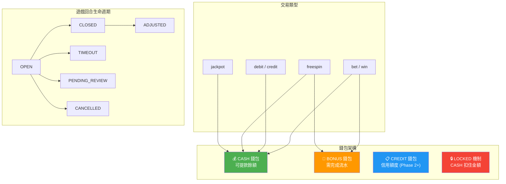

**可下注餘額公式**: `BettableBalance = CashBalance - LockedAmount - InProgressBets`

**關鍵機制**:
- 孤立回合偵測: 每 15 分鐘檢查 OPEN 超過 2 小時的回合
- 亂序處理: 派彩先到 → Redis 待處理佇列 (30 分鐘 TTL, 每分鐘重試)
- 負餘額: GP 重新結算可能產生，觸發帳戶鎖定 + CRITICAL 告警

### 3.2 支付系統

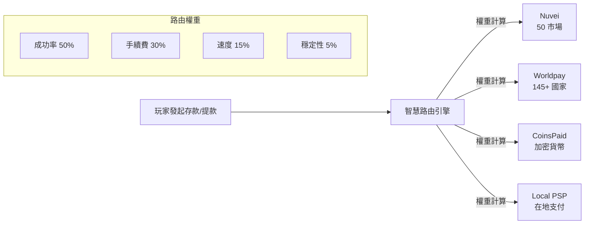

**提款風控**: 七維評分 (金額、頻率、KYC、帳齡、行為、IP/設備、VIP)

**3D Secure**: 歐洲市場強制啟用

### 3.3 三層對帳機制

| 層級 | 時效 | 自動化率 | 說明 |
|------|------|---------|------|
| Tier 1 即時 | 30 秒內 | 100% | 交易後即時校驗，防假回調攻擊 |
| Tier 2 批次 | 每小時 | 95% | 檢測延遲/丟失訂單 |
| Tier 3 T+1 | 每日 02:00 AM | 80% | 完整三方匹配 |

**差異處理**: 短款 (CRITICAL，立即凍結) / 長款 (依金額分級) / 金額不符 (容差 2% 或 $1 取較小值)

**升級路徑**: L1 自動 → L2 財務經理 (<$10K) → L3 CTO+CFO (≥$10K) → L4 董事會

**資料保留**: 10 年 (統一滿足 UKGC 5 年、MGA 10 年、稅務 7 年)

### 3.4 有效投注額計算

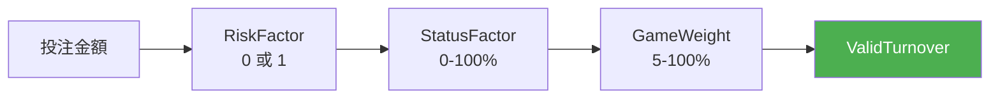

**公式**: `ValidTurnover = BetAmount × RiskFactor(0/1) × StatusFactor(0-100%) × GameWeight(5-100%)`

**遊戲權重表**:

| 遊戲類型 | 權重 | 特殊規則 |
|---------|------|---------|
| Slots (老虎機) | 100% | — |
| Sports (體育) | 100% | 僅計算實際風險金額 |
| Baccarat (百家樂) | 15% | 和局 (Tie) 不計入 |
| Roulette (輪盤) | 20-50% | 對沖投注不計入 |
| Blackjack (21 點) | 10% | — |
| Poker (撲克) | 5% | — |
| Lottery (彩票) | 15% | — |

**特殊規則**:
- Free Spin: Turnover = 面值, Valid Bet = 0
- HALF_WIN / HALF_LOSS: 標準本金法 (100% 計入)
- 對沖投注 (Hedge Betting): 同一事件的多邊投注不計入
- 低賠率投注 (<1.5): 依司法管轄區可能不計入

---

## 四、遊戲營運 (Gaming Operations)

### 4.1 遊戲整合流程

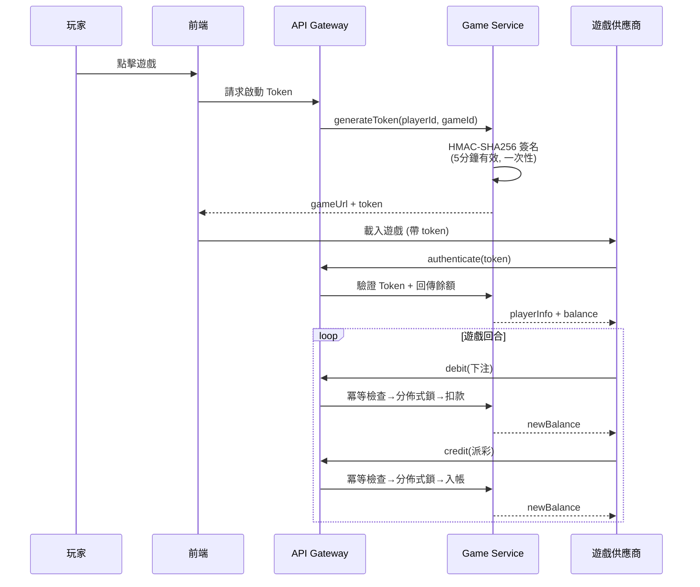

**Seamless Wallet API**: 五個核心端點 (Authenticate/Debit/Credit/Rollback/GetBalance)

**Token 驗證**: 5 分鐘有效期、一次性使用、HMAC-SHA256 簽名

**供應商 SLA**: 99.9% 可用性、P95 延遲 < 200ms

**RTP 監控**: 當 RTP > 200% 且淨損失 > $10K 時自動停用遊戲

### 4.2 遊戲大廳

- **個性化推薦**: 基於 RFM 模型的玩家分群矩陣
- **多維度標籤**: 遊戲類型、主題、波動性、RTP 範圍
- **全文搜尋**: 支援拼音與同義詞
- **商戶差異化**: 各租戶可獨立配置可見遊戲、權重、RTP 覆寫
- **元數據同步**: 每 4 小時同步 GP 目錄, 新遊戲預設 DISABLED

### 4.3 Jackpot 處理

- **Progressive Jackpot**: 平台資金池，跨品牌共享
- **Fixed Jackpot**: 供應商支付
- **對帳**: Jackpot 獎池金額每日對帳

---

## 五、促銷與 VIP (Promotions & VIP)

### 5.1 紅利系統流程

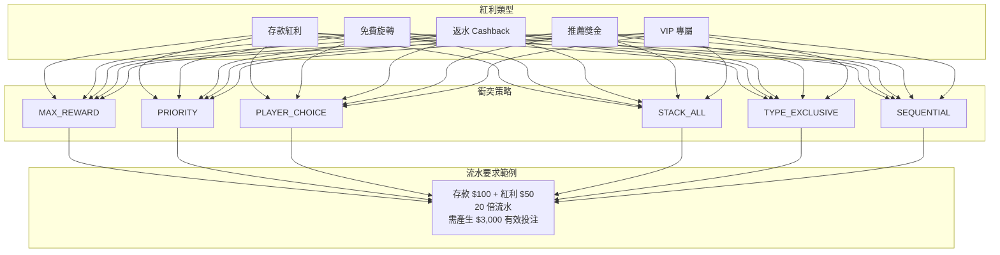

**全域限制**: 單一玩家最多 5 個同時活躍紅利, 金額上限 $10,000

### 5.2 區域市場策略

| 市場 | 策略重點 | 特色 |
|------|---------|------|
| 東南亞 | 高頻低額、移動優先 | 節日紅包、低門檻 |
| 拉丁美洲 | 足球賽事、PIX 支付 | 加密貨幣紅利 |
| 歐洲 | 合規優先、GDPR | 負責任博彩整合 |
| 華語市場 | VIP 關係維護 | 高返水、代理推薦獎勵 |

### 5.3 紅利風控

- 紅利濫用佔 iGaming 總詐欺的 **63.8%** (2022-2024 行業累計)，2024 Q1 最新數據升至 **69.9%**
- 多帳號偵測、低風險遊戲快速完成流水偵測、異常投注模式識別
- 每日紅利對帳偏差 ≤ 0.01%

---

## 六、風控與合規 (Risk & Compliance)

### 6.1 三層風控架構

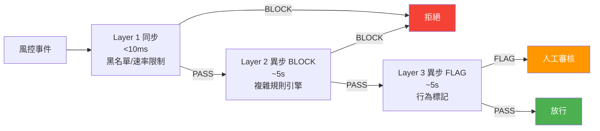

### 6.2 風險評分與處理

> **權威來源**: `implementation/03-risk-engine-design.md` 程式碼常數

| 分數區間 | 等級 | 處理方式 |
|---------|------|---------|
| [0, 30) | 低風險 | 自動核准 (AUTO_APPROVE) |
| [30, 70) | 中風險 | 人工審核 (MANUAL_REVIEW) |
| [70, 100] | 高風險 | 自動拒絕 (AUTO_REJECT) |

**提款審批子分級** (MANUAL_REVIEW 區間內):

| 風險分數 | 審批路由 |
|---------|---------|
| 0–29 (低風險, <$1000) | 自動審批 |
| 30–50 (中風險) | L1 人工審核 |
| 51–69 (中高風險) | L1 + L2 審核 |
| 71–100 (高風險) | L1 + L2 + L3 審核 |

### 6.3 詐欺類型分佈 (2024 Q1)

| 類型 | 佔比 | 偵測方法 |
|------|------|---------|
| 紅利濫用 (Bonus Abuse) | 69.9% (行業累計 63.8%) | 多帳號偵測、投注模式分析 |
| 多帳號詐欺 | 15% | 設備指紋、IP 關聯、圖分析 |
| 支付詐欺 | 10% | 交易速度/金額異常 |
| 其他 | 5.1% | 對沖套利、帳號盜用、洗錢 |

### 6.4 AML 合規

- **KYC 四級驗證**: L0 → L1 → L2 → L3 漸進式
- **AML 三階段偵測**: Placement → Layering → Integration
- **SAR 報告時限**: UKGC (立即)、FinCEN (30 天)、FIU Malta (即時)
- **CTR 閾值**: 美國 $10,000+、澳洲 $5,000
- **記錄保存**: 最長 10 年

### 6.5 多司法管轄區合規地圖

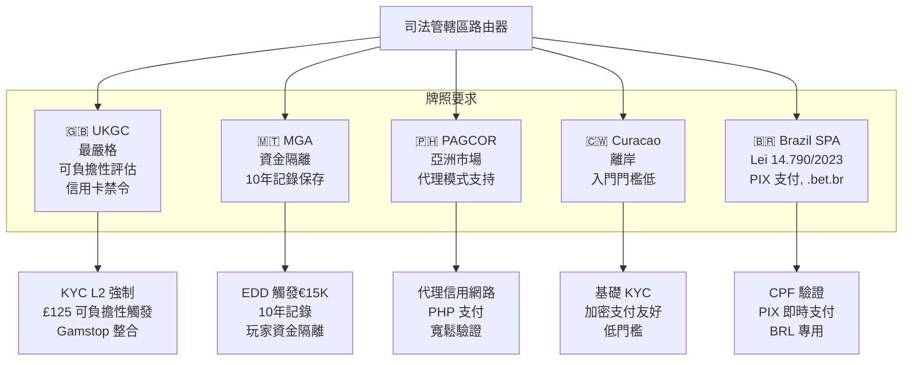

---

## 七、治理與牌照 (Governance & Licensing)

### 7.1 四層管理層級

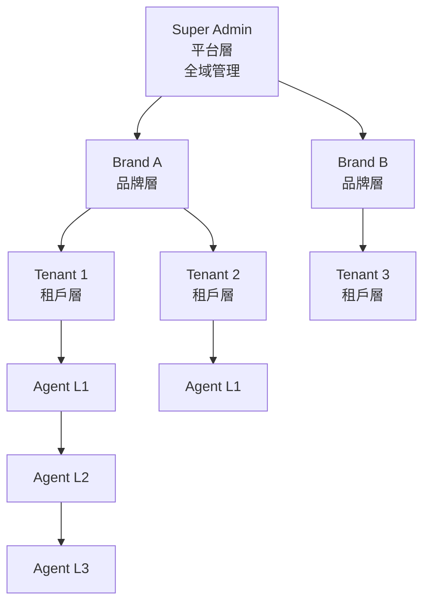

- **資料隔離**: 品牌間資料完全隔離
- **白標能力**: UI、域名、支付渠道、遊戲庫全可定制
- **計費模式**: SaaS 階梯定價 (<$500K: 15% / $500K-$1M: 12% / >$1M: 10%)

### 7.2 MFA 多因素驗證

- **強制角色**: Super Admin、Brand Admin、Finance、Risk、Compliance (5 角色)
- **TOTP 為主**: 目標 90% 採用率，CVSS 降低 47% (8.1 → 4.3)
- **備用機制**: 10 組一次性備用碼、SMS 降級、Email 降級
- **受信任設備**: 30 天有效期

---

## 八、代理營運 (Agent Operations)

### 8.1 代理信用網路

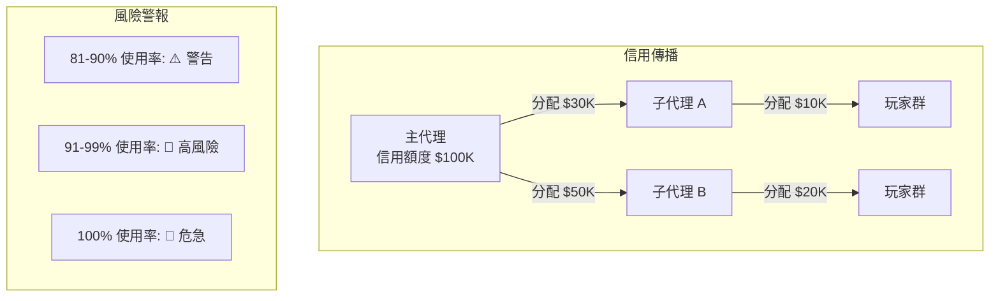

- **雙錢包模式**: Cash Wallet + Credit Wallet (先玩後付)
- **佣金模型**: RevShare (收益分成, 支援階梯) + CPA (每獲客成本) + Hybrid
- **月度結算**: 每月 1 號凌晨 2:00 自動結算
- **父級分潤**: 子級佣金的 20% 上繳父級

---

## 九、分析與報表 (Analytics & Reporting)

### 9.1 數據時效

| 路徑 | 延遲 | 用途 |
|------|------|------|
| Hot (<5s) | 即時 | 在線人數、即時投注 |
| Warm (5–60s) | 近即時 | 促銷效果、異常偵測 |
| Cold (T+1) | 次日 | 營收報表、玩家行為 |

### 9.2 角色化儀表板

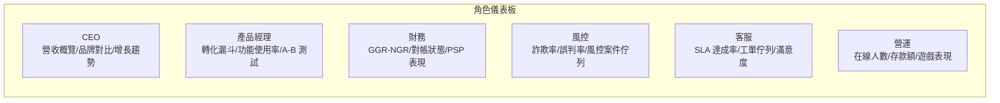

### 9.3 報表分類

- **財務報表**: GGR/NGR、存提款明細、佣金結算、稅務報告
- **營運報表**: 玩家活躍度、遊戲表現、促銷 ROI
- **風控報表**: 可疑投注、多帳號偵測、提款風險
- **合規報表**: AML/KYC 統計、SAR 報告、負責任博彩指標

---

## 十、基礎設施需求 (Infrastructure)

### 10.1 效能與容量

| 指標 | 目標 |
|------|------|
| 尖峰負載 (登入) | 50K/分鐘 |
| 尖峰負載 (投注) | 100K/分鐘 |
| API P95 回應 | < 200ms |
| DB P99 讀取 | < 10ms |
| 月度成本 | $28,922 |
| 單位成本 | $2.89/DAU/月 |
| 容量規劃 | 10K DAU / 100K 註冊用戶 |

### 10.2 SLA 分層體系

| 層級 | SLA | 適用範圍 | 停機容許 |
|------|-----|---------|---------|
| 對外合約 | **99.9%** | 平台整體對客戶承諾 | 每月 43 分鐘 |
| 安全關鍵服務 | 99.95% | Token 驗證、認證服務 | 每月 22 分鐘 |
| K8s 基礎設施 | 99.99% | 底層集群設計目標 | 每年 52 分鐘 |

### 10.3 災難恢復分層

| 服務層級 | RPO | RTO | 適用服務 |
|---------|-----|-----|---------|
| **Tier 1** | 近零 | < 15 分鐘 | 支付處理、錢包系統 |
| **Tier 2** | < 1 小時 | < 4 小時 | 客戶入口、玩家管理 |
| **Tier 3** | < 24 小時 | < 24 小時 | 分析報表、BI 系統 |

---

## 十一、前端體驗 (Frontend Experience)

- **無程式碼頁面編輯器**: 行銷團隊可自行配置首頁、促銷頁面
- **多語言**: 20+ 語言, RTL 支援 (阿拉伯語), Crowdin 整合
- **行動 App**: React Native, CodePush 熱更新, 生物辨識登入
- **SEO**: Core Web Vitals (LCP <2.5s, FID <100ms, CLS <0.1)
- **錢包 UI**: 現金/信用/混合三種模式自適應

---

## 十二、客戶服務 (Customer Service)

- **玩家 360° 視圖**: 帳戶、交易、遊戲、風控、VIP 一站展示
- **AI Chatbot**: 40% 自動解決率、90% 回答準確率、13 種意圖分類
- **VIP SLA**: Diamond 首次回應 5 分鐘、解決 2 小時
- **多渠道**: 即時聊天、Email、電話、社群媒體
- **工單管理**: 優先級排序 + 技能匹配 + 語言匹配

---

## 十三、安全合規 (Security & Compliance)

- **PII 保護**: AES-256-GCM 加密 + HMAC-SHA256 盲索引, DBA 無法查看明文
- **GDPR 刪除**: 37 天工作流 (7 天確認 + 30 天冷卻), 加密粉碎
- **合規標準**: ISO 27001:2022 (93 項控制) / PCI-DSS v4.0 / UK RTS Section 4
- **信用卡禁令**: 英國 (2020)、德國 (2021)、澳洲 (2026-04)
- **MITM 防護**: TLS 降級偵測、證書固定、會話劫持偵測

---

## 十四、負責任博彩 (Responsible Gambling)

### 14.1 四大保護工具

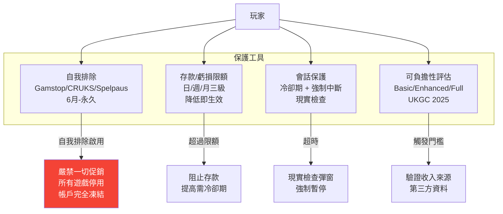

### 14.2 UKGC 2025 可負擔性新規

| 觸發條件 | 等級 | 動作 |
|---------|------|------|
| 年度淨虧損 GBP 125+ | Basic | 顯示警告 |
| 年度淨虧損 GBP 500+ | Enhanced | 自我聲明 |
| 年度淨虧損 GBP 2,000+ | Full | 第三方資料驗證 |
| 月淨存款 ≥ GBP 150/30 天 | — | 觸發評估 |

### 14.3 關鍵約束

- 自我排除玩家 **嚴禁** 收到任何促銷
- 系統限額違規 = **零容忍 P0 事件**, UKGC 要求 24 小時內報告
- 荷蘭默認限額: 日 EUR 200 / 週 EUR 700 / 月 EUR 2,000
- 德國法定上限: EUR 1,000/月
- 高風險玩家 GGR 佔比目標 < 5%

---

## 十五、第三方整合 (Integration Standards)

- **整合分類**: 遊戲供應商 (GP) / 支付供應商 (PSP) / KYC-AML / 行銷工具 / 分析工具
- **KYC 供應商成本**: Onfido ~$2/次, Jumio ~$1.5/次, ComplyAdvantage ~$0.5/次, Sumsub ~$3/次
- **Webhook 重試**: 指數退避 (5s→10s→20s→40s→80s→160s), 6 次後進 DLQ
- **API 密鑰管理**: HashiCorp Vault 加密, PSP 密鑰 90 天輪換
- **服務降級**: 支付 (切換備用 PSP) / KYC (手動審查) / 遊戲 (維護通知)

---

## 附錄 A：跨模組關鍵 KPI

| 指標 | 目標 | 模組 |
|------|------|------|
| 錢包計算精確度 | 99.99% | 財務 |
| 有效投注額精確度 | 100% | 財務 |
| 多租戶資料隔離 | 100% | 平台 |
| 詐欺偵測率 | ≥90% | 風控 |
| 詐欺率 | <0.5% | 風控 |
| 風控自動化率 | ≥80% | 風控 |
| 對帳首次匹配率 | ≥95% | 財務 |
| 玩家旅程完成率 | ≥70% | 玩家 |
| AI 客服自動解決率 | 40% | 客服 |
| 紅利對帳偏差 | ≤0.01% | 促銷 |
| 系統限額違規 | 0 | 負責任博彩 |
| 可負擔性評估覆蓋率 | ≥98% | 負責任博彩 |
| 高風險玩家 GGR 佔比 | <5% | 負責任博彩 |
| 平台可用性 | 99.9% | 基礎設施 |
| API P95 回應時間 | <200ms | 基礎設施 |
| 基礎設施月成本 | $28,922 | 基礎設施 |

## 附錄 B：文檔索引

| 模組 | 文件數 | 目錄 |
|------|--------|------|
| 玩家體驗 | 6 | `requirements/01_Player_Experience/` |
| 財務營運 | 5 | `requirements/02_Financial_Operations/` |
| 遊戲營運 | 4 | `requirements/03_Gaming_Operations/` |
| 促銷 VIP | 3 | `requirements/04_Promotions_VIP/` |
| 風控合規 | 11 | `requirements/05_Risk_Compliance/` |
| 治理牌照 | 6 | `requirements/06_Governance_Licensing/` |
| 代理營運 | 2 | `requirements/07_Agent_Operations/` |
| 分析報表 | 2 | `requirements/08_Analytics_Operations/` |
| 基礎設施 | 2 | `requirements/09_Infrastructure_Requirements/` |
| 平台營運 | 3 | `requirements/10_Platform_Operations/` |
| 前端體驗 | 4 | `requirements/11_Frontend_Experience/` |
| 安全合規 | 3 | `requirements/12_Security_Compliance/` |
| 客戶服務 | 2 | `requirements/13_Customer_Service/` |
| 整合標準 | 1 | `requirements/14_Integration_Standards/` |
| 負責任博彩 | 4 | `requirements/15_Responsible_Gambling/` |

---

> **備註**: 本文件整合自 IGaming 專案 290+ 份文檔的業務需求內容。詳細規格請參閱 `requirements/README.md` 及各模組原始文件。
