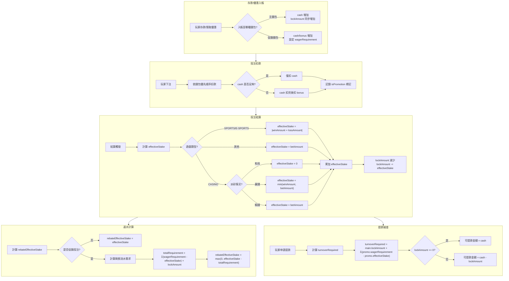
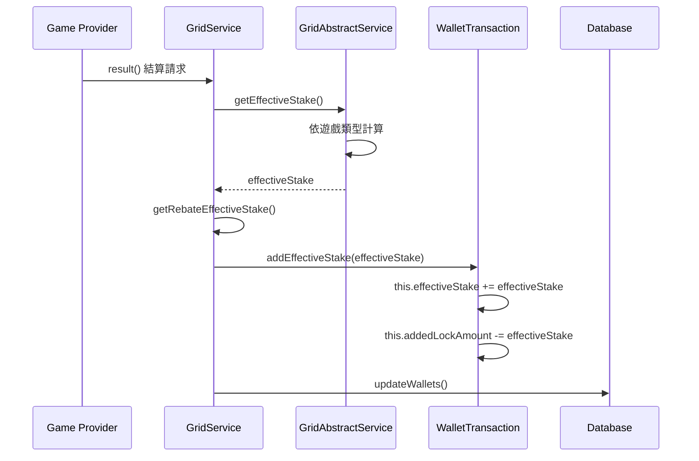
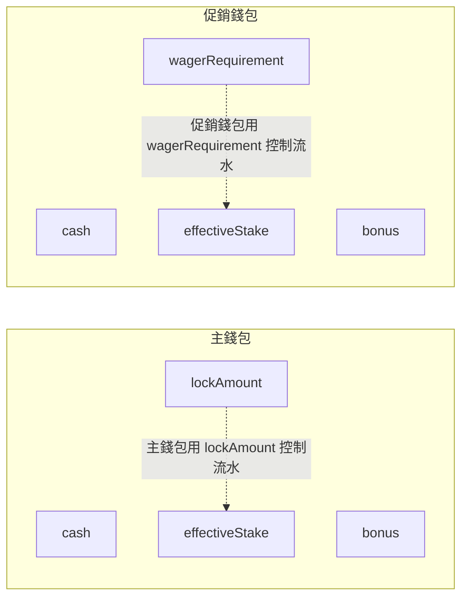
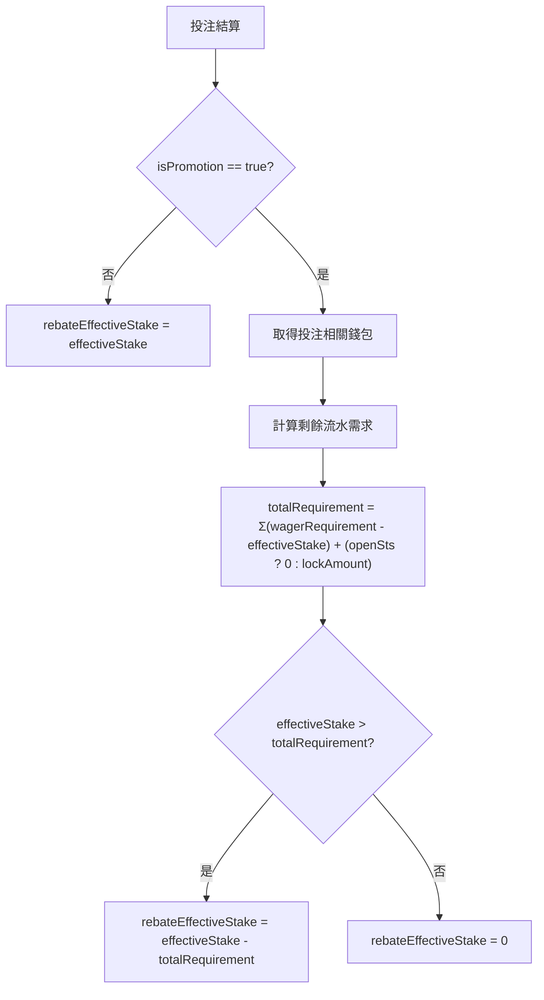
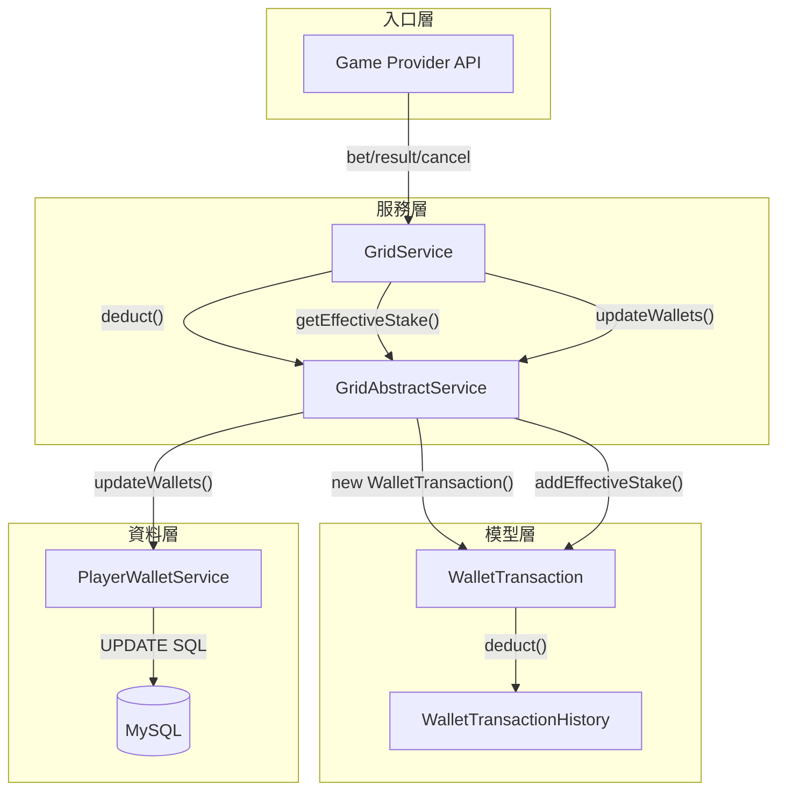

# 流水計算邏輯確認文件

## 1. 核心概念定義

| 術語 | 說明 | 儲存位置 |
|------|------|----------|
| **effectiveStake（有效投注）** | 計算玩家是否滿足流水要求的關鍵指標 | `player_wallet.effective_stake` |
| **lockAmount（鎖定金額）** | 主錢包中無法提款的金額，需透過有效投注解鎖 | `player_wallet.lock_amount`（僅主錢包） |
| **wagerRequirement（流水要求）** | 優惠錢包需達成的投注流水門檻 | `player_wallet.wager_requirement`（僅促銷錢包） |
| **turnoverRequired（提款流水需求）** | 玩家需達成的總流水 = 主錢包 lockAmount + Σ(促銷錢包 wagerRequirement - effectiveStake) | 計算值，非資料庫欄位 |
| **rebateEffectiveStake（返水有效投注）** | 可參與返水計算的有效投注 | `transaction.rebate_effective_stake` |

---

## 2. 流水計算完整流程

### 2.1 整體流程圖



---

## 3. 有效投注 (effectiveStake) 計算邏輯

### 3.1 計算時機



### 3.2 各遊戲類型計算公式

| 遊戲類型 | 條件 | effectiveStake 公式 |
|----------|------|---------------------|
| **SPORTS / E-SPORTS** | - | `|winAmount + lossAmount|` |
| **CASINO** | 和局 (payout == betAmount) | `0` |
| **CASINO** | 贏錢 (winAmount > 0) | `min(winAmount, betAmount)` |
| **CASINO** | 輸錢 (winAmount == 0) | `betAmount` |
| **其他類型** | - | `betAmount` |

### 3.3 程式碼位置

- **計算方法**：`GridAbstractService.java:171-193`
- **累加方法**：`WalletTransaction.java:119-125`

---

## 4. lockAmount 變化邏輯

### 4.1 lockAmount 生命週期

```mermaid
stateDiagram-v2
    [*] --> Created: 存款/優惠入帳
    Created --> Locked: lockAmount = 入帳金額
    Locked --> Decreasing: 投注結算
    Decreasing --> Decreasing: lockAmount -= effectiveStake
    Decreasing --> Zero: lockAmount <= 0
    Zero --> [*]: 可自由提款
    
    note right of Locked : lockAmount 產生條件:<br/>- DEPOSIT<br/>- PROMOTION<br/>- VIP<br/>- RED_ENVELOPES<br/>- WALLET_DEPOSIT
    
    note right of Decreasing : 每次結算減少<br/>lockAmount = max(0, lockAmount - effectiveStake)
```

### 4.2 lockAmount 變化時機

| 操作     | lockAmount 變化       | 說明                 |
| ------ | ------------------- | ------------------ |
| 存款入帳   | **+金額**             | 需完成流水才能提款          |
| 領取優惠   | **+金額**             | 同上                 |
| VIP 獎勵 | **+金額**             | 同上                 |
| 投注下注   | **無變化**             | 僅扣款，不影響 lockAmount |
| 投注結算   | **-effectiveStake** | 解鎖等值金額             |
| 投注取消   | **+effectiveStake** | 回復原本鎖定             |

### 4.3 程式碼位置

- **增加邏輯**：`WalletTransaction.java:52-101`
- **減少邏輯**：`WalletTransaction.java:119-125`

---

## 5. 促銷錢包流水邏輯

### 5.1 促銷錢包 vs 主錢包



### 5.2 促銷錢包流水達成判斷

```
促銷錢包流水達成 = (effectiveStake >= wagerRequirement)
```

### 5.3 促銷錢包轉主錢包時的流水計算

當促銷錢包轉出時，會按比例轉移剩餘流水需求：

```
transferWagerRequirement = (wagerRequirement - effectiveStake) × (transferAmount / (cash + bonus))
```

---

## 6. 返水有效投注 (rebateEffectiveStake) 計算

### 6.1 計算流程



### 6.2 關鍵邏輯

| 投注類型 | 條件 | rebateEffectiveStake |
|----------|------|----------------------|
| 非促銷投注 | isPromotion = false | `effectiveStake` |
| 促銷投注 | 流水已完成 | `effectiveStake` |
| 促銷投注 | 流水未完成 | `max(0, effectiveStake - 剩餘流水需求)` |

### 6.3 程式碼位置

- `GridAbstractService.java:195-239`

---

## 7. 提款流水需求 (turnoverRequired) 計算

### 7.1 計算公式

```
turnoverRequired = main.lockAmount + Σ(promo.wagerRequirement - promo.effectiveStake)
```

其中：
- `main.lockAmount`：主錢包的鎖定金額
- `Σ(...)`：所有**開啟中**促銷錢包的剩餘流水需求總和

### 7.2 程式碼位置

- `PlayerManager.java:709-718`

---

## 8. 資料庫更新邏輯

### 8.1 錢包更新 SQL

```sql
UPDATE player_wallet
SET bonus = ?,
    cash = ?,
    clean_amount = GREATEST(clean_amount + ?, 0),
    lock_amount = GREATEST(lock_amount + ?, 0),
    effective_stake = ?
WHERE id = ?
```

> **注意**：`GREATEST(..., 0)` 確保 `cleanAmount` 和 `lockAmount` 不會低於 0。

---

## 9. 完整數據流向圖



---

## 10. 需求確認清單

### 10.1 有效投注計算

- [ ] SPORTS/E-SPORTS 使用 `|winAmount + lossAmount|` 是否正確？
- [ ] CASINO 和局時 effectiveStake = 0 是否符合預期？
- [ ] CASINO 贏錢時取 `min(winAmount, betAmount)` 邏輯是否正確？

### 10.2 lockAmount 邏輯

- [ ] 僅主錢包有 lockAmount 是否正確？
- [ ] lockAmount 的產生類型（DEPOSIT, PROMOTION, VIP, RED_ENVELOPES）是否完整？
- [ ] lockAmount 最小值為 0（不會負數）是否正確？

### 10.3 返水計算

- [ ] 促銷投注需完成流水才能獲得返水是否為預期行為？
- [ ] `REBATE_BETTING_LOCKED` 開關邏輯是否需要調整？

### 10.4 提款流水

- [ ] turnoverRequired 計算公式是否正確？
- [ ] 僅計算「開啟中」促銷錢包是否正確？

---

## 11. 相關程式碼索引

| 功能 | 檔案 | 方法名稱 |
|------|------|----------|
| 投注扣款 | GridAbstractService.java | `deduct()` |
| 有效投注計算 | GridAbstractService.java | `getEffectiveStake()` |
| 返水有效投注 | GridAbstractService.java | `getRebateEffectiveStake()` |
| 錢包交易處理 | WalletTransaction.java | `deduct()`, `addEffectiveStake()` |
| 投注結算 | GridService.java | `result()` |
| 提款流水查詢 | PlayerManager.java | `getBalance()` |
| 資料庫更新 | PlayerWalletServiceImpl.java | 行 69-86 |

---

**文檔版本**: 1.0.0
**最後更新**: 2026-01-28
**維護團隊**: Finance Team & Backend Team
