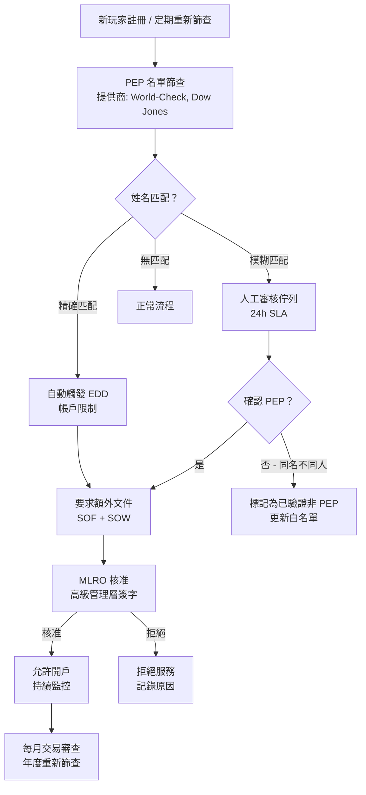
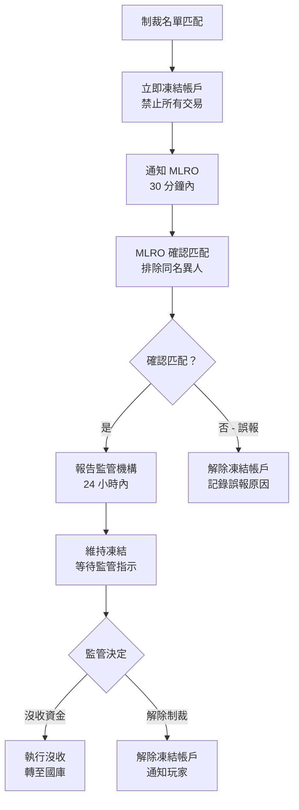
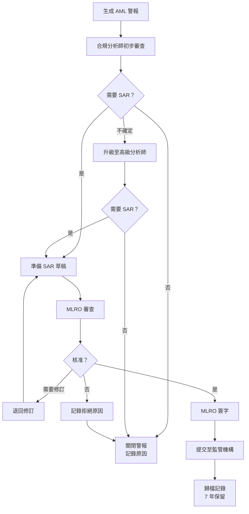

# KYC 驗證 API 架構（KYC Verification API Architecture）

> **規範來源**: [source-archive/05_Risk_Control/05-03_KYC_AML.md](../../source-archive/05_Risk_Control/05-03_KYC_AML.md)
> **目標讀者**: Architects, Backend Developers, DevOps Engineers
> **業務需求**: [KYC_AML_Requirements.md](../../requirements/05_Risk_Compliance/03_KYC_AML_Requirements.md)
> **最後同步**: 2026-02-08
> **來源版本**: 4.0.0

---

## 概述（Overview）

本文檔涵蓋 SmartAdmin iGaming 平台中實現 KYC（Know Your Customer，身份驗證）和 AML（Anti-Money Laundering，反洗錢）驗證系統的技術架構。包括 API 規格、資料庫架構、驗證工作流程、第三方整合及程式碼範例。

> **FATF 40 建議對齊聲明**: 本模組覆蓋以下 FATF (Financial Action Task Force) 建議：
> - **Rec 10 (CDD)**: 客戶盡職調查 — 見 Section 1.1 KYC 文件驗證流程
> - **Rec 6 (TFS)**: 定向金融制裁 — 見 Section 1.4 制裁篩查（OFAC SDN、UN、EU、UK 名單）
> - **Rec 12 (PEPs)**: 政治公眾人物 — 見 Section 2.3 PEP 篩查結果表（`t_pep_screening_result`）
> - **Rec 20 (STR)**: 可疑交易報告 — 見 Section 2.2 AML 警報表（`t_aml_alert`）及 SAR 報告欄位
> - **Rec 11 (Record keeping)**: 記錄保存 — 見 Section 2.6 AML 審計日誌表（7 年保留期、雜湊鏈防篡改）
>
> **缺口**: FATF Rec 16（電匯規則）尚未完整涵蓋，需於加密貨幣支付整合時補充 Travel Rule 實作。

---

## 1. 自動化驗證工作流程（Automated Verification Workflow）

### 1.1 KYC 文件驗證流程（KYC Document Verification Flow）

```mermaid
flowchart TD
    START[玩家上傳文件] --> OCR[AI OCR 識別<br/>提供商: Tesseract + AWS Textract<br/>提取: 姓名、出生日期、證件號碼、有效期]

    OCR --> VALIDATE{資料完整性檢查<br/>必填欄位 100% 覆蓋？<br/>照片清晰度 >= 300 DPI？}

    VALIDATE -->|失敗| REJECT1[自動拒絕<br/>原因: 照片模糊/資料不完整<br/>操作: 要求重新上傳]

    VALIDATE -->|通過| FACE[人臉比對<br/>提供商: AWS Rekognition<br/>匹配閾值: >= 85%]

    FACE --> LIVENESS[活體檢測<br/>反欺詐: 眨眼/轉頭<br/>防止照片攻擊]

    LIVENESS --> WATCHLIST[黑名單檢查<br/>資料來源:<br/>- 內部欺詐名單<br/>- Cifas 國家欺詐資料庫<br/>- PEPs 政治人物名單]

    WATCHLIST -->|命中黑名單| REJECT2[自動封鎖<br/>操作: 永久禁止 + 通知合規團隊]

    WATCHLIST -->|未命中| RISK_SCORE[風險評分<br/>綜合: IP 地理位置、裝置指紋、<br/>註冊來源、歷史行為]

    RISK_SCORE -->|分數 < 30| AUTO_APPROVE[自動核准<br/>KYC 等級 ++<br/>發送通知郵件]

    RISK_SCORE -->|分數 30-60| MANUAL[人工審核<br/>指派給合規團隊<br/>SLA: 24 小時]

    RISK_SCORE -->|分數 > 60| FLAG[EDD 調查<br/>要求額外文件 (SOF/SOW)<br/>凍結帳戶直到調查完成]

    AUTO_APPROVE --> END[結束]
    MANUAL --> END
    FLAG --> END
    REJECT1 --> END
    REJECT2 --> END
```

### 1.2 SAR 報告工作流程（SAR Reporting Workflow）

```mermaid
flowchart TD
    DETECT[風控系統檢測到異常] --> ALERT[生成 AML 警報<br/>風險分數 >= 80<br/>自動凍結帳戶]

    ALERT --> REVIEW[合規團隊審查<br/>調查: 交易記錄、裝置指紋、<br/>圖分析、歷史行為]

    REVIEW -->|合理解釋| CLEAR[解除凍結<br/>標記為誤報<br/>調整風險模型]

    REVIEW -->|確認可疑| SAR[提交 SAR 報告<br/>至監管機構:<br/>- 英國 NCA (7 個工作日)<br/>- 馬爾他 FIAU (15 天)]

    SAR --> FREEZE[永久凍結帳戶<br/>沒收獎金<br/>退還本金 (個案處理)]

    SAR --> RECORD[記錄保留 7 年<br/>符合 AML 監管要求<br/>雜湊鏈防篡改]
```

### 1.3 PEP 篩查流程（PEP Screening Flow）



### 1.4 制裁篩查與資產凍結流程（Sanctions Screening and Asset Freeze Flow）



### 1.5 MLRO 核准流程（MLRO Approval Flow）



---

## 2. 資料庫架構（Database Schema）

### 2.1 KYC 驗證記錄表（KYC Verification Records Table）

```sql
CREATE TABLE t_kyc_verification (
    id BIGINT PRIMARY KEY AUTO_INCREMENT,
    player_id BIGINT NOT NULL,
    tenant_id BIGINT NOT NULL,
    kyc_level INT NOT NULL COMMENT '0:L0, 1:L1, 2:L2, 3:L3',
    verification_type ENUM('IDENTITY', 'ADDRESS', 'SOF', 'SOW') NOT NULL,
    document_type ENUM('PASSPORT', 'ID_CARD', 'DRIVERS_LICENSE', 'UTILITY_BILL', 'BANK_STATEMENT') NOT NULL,

    -- OCR extracted data
    extracted_data JSON COMMENT '{"name":"John Doe","dob":"1990-01-01","document_number":"AB123456"}',
    ocr_confidence DECIMAL(5,2) COMMENT '0.00-100.00%',

    -- Facial comparison
    face_match_score DECIMAL(5,2) COMMENT '0.00-100.00%',
    liveness_check BOOLEAN DEFAULT FALSE,

    -- Review result
    status ENUM('PENDING', 'APPROVED', 'REJECTED', 'MANUAL_REVIEW') NOT NULL DEFAULT 'PENDING',
    rejection_reason VARCHAR(500),
    reviewed_by BIGINT COMMENT 'Reviewer ID (NULL if auto)',
    reviewed_at DATETIME,

    -- Risk assessment
    risk_score INT COMMENT '0-100',
    risk_flags JSON COMMENT '["BLACKLIST_MATCH", "HIGH_RISK_COUNTRY", "PEP"]',

    -- Third-party service
    provider ENUM('SUMSUB', 'JUMIO', 'AWS_REKOGNITION', 'IN_HOUSE') NOT NULL,
    provider_request_id VARCHAR(100),
    provider_response JSON,

    -- Audit
    created_at DATETIME NOT NULL DEFAULT CURRENT_TIMESTAMP,
    updated_at DATETIME NOT NULL DEFAULT CURRENT_TIMESTAMP ON UPDATE CURRENT_TIMESTAMP,

    INDEX idx_player_id (player_id),
    INDEX idx_tenant_status (tenant_id, status),
    INDEX idx_created_at (created_at)
) ENGINE=InnoDB COMMENT='KYC verification records';
```

### 2.2 AML 警報表（AML Alerts Table）

```sql
CREATE TABLE t_aml_alert (
    id BIGINT PRIMARY KEY AUTO_INCREMENT,
    player_id BIGINT NOT NULL,
    tenant_id BIGINT NOT NULL,

    -- Alert type
    alert_type ENUM('STRUCTURING', 'LAYERING', 'FUND_AGGREGATION', 'TWO_SIDED_BET', 'RAPID_WITHDRAWAL') NOT NULL,
    severity ENUM('LOW', 'MEDIUM', 'HIGH', 'CRITICAL') NOT NULL,

    -- Trigger conditions
    trigger_rule VARCHAR(100) COMMENT 'RULE_CODE: AML_001, AML_002...',
    trigger_details JSON COMMENT '{"transaction_amount": 10000, "frequency": 15, "time_window": "1h"}',

    -- Investigation result
    investigation_status ENUM('OPEN', 'IN_PROGRESS', 'RESOLVED', 'ESCALATED', 'FALSE_POSITIVE') NOT NULL DEFAULT 'OPEN',
    investigation_notes TEXT,
    investigator_id BIGINT,

    -- SAR report
    sar_filed BOOLEAN DEFAULT FALSE,
    sar_reference VARCHAR(100),
    sar_filed_at DATETIME,
    sar_submitted_to ENUM('NCA_UK', 'FIAU_MALTA', 'GFIU_GIBRALTAR', 'OTHER'),

    -- Actions taken
    actions_taken JSON COMMENT '["ACCOUNT_FROZEN", "FUNDS_SEIZED", "PERMANENT_BAN"]',

    -- Audit
    created_at DATETIME NOT NULL DEFAULT CURRENT_TIMESTAMP,
    resolved_at DATETIME,

    INDEX idx_player_id (player_id),
    INDEX idx_tenant_status (tenant_id, investigation_status),
    INDEX idx_severity (severity),
    INDEX idx_created_at (created_at)
) ENGINE=InnoDB COMMENT='AML alerts table';
```

### 2.3 PEP 篩查結果表（PEP Screening Results Table）

```sql
CREATE TABLE t_pep_screening_result (
    id BIGINT PRIMARY KEY AUTO_INCREMENT,
    player_id BIGINT NOT NULL,

    -- Screening result
    is_pep BOOLEAN NOT NULL DEFAULT FALSE,
    pep_category ENUM('FOREIGN_PEP', 'DOMESTIC_PEP', 'INTL_ORG_PEP', 'RCA') COMMENT 'RCA=Related Close Associate',
    pep_position VARCHAR(500) COMMENT 'Position description',
    pep_country VARCHAR(2),

    -- Match details
    match_score DECIMAL(5,4),
    matched_name VARCHAR(200),
    matched_dob DATE,
    screening_provider VARCHAR(50),
    screening_reference VARCHAR(100),

    -- EDD status
    edd_required BOOLEAN DEFAULT FALSE,
    edd_completed BOOLEAN DEFAULT FALSE,
    edd_completed_at DATETIME,
    edd_approved_by BIGINT,

    -- Audit
    screened_at DATETIME DEFAULT CURRENT_TIMESTAMP,
    next_screening_due DATE,

    INDEX idx_player (player_id),
    INDEX idx_pep (is_pep, edd_required)
) ENGINE=InnoDB COMMENT='PEP screening results';

CREATE TABLE t_pep_edd_document (
    id BIGINT PRIMARY KEY AUTO_INCREMENT,
    player_id BIGINT NOT NULL,
    screening_id BIGINT NOT NULL,

    document_type ENUM('SOF', 'SOW', 'DECLARATION', 'PURPOSE', 'OTHER') NOT NULL,
    document_url VARCHAR(500) NOT NULL,
    document_status ENUM('PENDING', 'APPROVED', 'REJECTED') DEFAULT 'PENDING',
    rejection_reason VARCHAR(500),

    reviewed_by BIGINT,
    reviewed_at DATETIME,
    uploaded_at DATETIME DEFAULT CURRENT_TIMESTAMP,

    INDEX idx_player (player_id),
    INDEX idx_screening (screening_id)
) ENGINE=InnoDB COMMENT='PEP EDD documents';
```

### 2.4 制裁篩查日誌表（Sanctions Screening Log Table）

```sql
CREATE TABLE t_sanctions_screening_log (
    id BIGINT PRIMARY KEY AUTO_INCREMENT,
    player_id BIGINT NOT NULL,

    -- Screening info
    screening_type ENUM('REGISTRATION', 'PERIODIC', 'TRANSACTION') NOT NULL,
    screening_lists JSON COMMENT '["UN", "OFAC", "EU", "UK"]',

    -- Match result
    has_match BOOLEAN NOT NULL DEFAULT FALSE,
    matches JSON COMMENT 'Match details',
    match_confidence DECIMAL(5,4),

    -- Action taken
    account_frozen BOOLEAN DEFAULT FALSE,
    frozen_at DATETIME,
    frozen_by BIGINT,

    -- Reporting status
    reported_to_authority BOOLEAN DEFAULT FALSE,
    authority_name VARCHAR(100),
    report_reference VARCHAR(100),
    reported_at DATETIME,

    -- Unfreeze info
    unfrozen BOOLEAN DEFAULT FALSE,
    unfrozen_at DATETIME,
    unfrozen_by BIGINT,
    unfrozen_reason VARCHAR(500),

    -- Audit
    screened_at DATETIME DEFAULT CURRENT_TIMESTAMP,

    INDEX idx_player (player_id),
    INDEX idx_match (has_match, screened_at),
    INDEX idx_frozen (account_frozen)
) ENGINE=InnoDB COMMENT='Sanctions screening log';

CREATE TABLE t_ctf_alert (
    id BIGINT PRIMARY KEY AUTO_INCREMENT,
    player_id BIGINT NOT NULL,

    -- Alert type
    alert_type ENUM(
        'SANCTIONS_MATCH',
        'HIGH_RISK_JURISDICTION',
        'CHARITY_TRANSFER',
        'CROSS_BORDER_STRUCTURING',
        'DUAL_USE_PATTERN'
    ) NOT NULL,

    -- Details
    alert_details JSON,
    risk_score INT NOT NULL,

    -- Processing status
    status ENUM('OPEN', 'INVESTIGATING', 'ESCALATED', 'CLOSED') DEFAULT 'OPEN',
    assigned_to BIGINT,
    resolution VARCHAR(500),

    -- Reporting
    sar_filed BOOLEAN DEFAULT FALSE,
    sar_reference VARCHAR(100),

    -- Timestamps
    created_at DATETIME DEFAULT CURRENT_TIMESTAMP,
    resolved_at DATETIME,

    INDEX idx_player (player_id),
    INDEX idx_status (status, created_at)
) ENGINE=InnoDB COMMENT='CTF alerts table';
```

### 2.5 MLRO 決策日誌表（MLRO Decision Log Table）

```sql
CREATE TABLE t_mlro_decision_log (
    id BIGINT PRIMARY KEY AUTO_INCREMENT,
    alert_id BIGINT NOT NULL COMMENT 'Related AML alert',

    -- MLRO decision
    decision ENUM('APPROVE_SAR', 'REJECT_SAR', 'REQUEST_MORE_INFO', 'ESCALATE') NOT NULL,
    decision_reason TEXT NOT NULL,

    -- SAR info
    sar_reference VARCHAR(100) COMMENT 'SAR number (if submitted)',
    sar_submitted_at DATETIME,

    -- MLRO info
    mlro_id BIGINT NOT NULL,
    mlro_name VARCHAR(100),

    -- Timestamp
    decision_at DATETIME DEFAULT CURRENT_TIMESTAMP,

    INDEX idx_alert (alert_id),
    INDEX idx_mlro (mlro_id, decision_at)
) ENGINE=InnoDB COMMENT='MLRO decision log';
```

### 2.6 AML 審計日誌表（AML Audit Log Table）（7 年保留期與雜湊鏈）

```sql
-- AML audit log table (regulatory compliant)
CREATE TABLE t_aml_audit_log (
    id BIGINT PRIMARY KEY AUTO_INCREMENT,
    tenant_id BIGINT NOT NULL,
    player_id BIGINT,

    -- Event type
    event_type ENUM('KYC_SUBMIT', 'KYC_APPROVE', 'KYC_REJECT', 'AML_ALERT', 'SAR_FILED', 'ACCOUNT_FROZEN') NOT NULL,
    event_details JSON,

    -- Operator
    operator_id BIGINT COMMENT 'NULL if system',
    operator_type ENUM('SYSTEM', 'ADMIN', 'COMPLIANCE_OFFICER'),

    -- Tamper-proofing
    hash_value VARCHAR(64) NOT NULL COMMENT 'HMAC-SHA256',
    previous_hash VARCHAR(64),

    -- Audit
    created_at DATETIME NOT NULL DEFAULT CURRENT_TIMESTAMP,

    INDEX idx_tenant_player (tenant_id, player_id),
    INDEX idx_event_type (event_type),
    INDEX idx_created_at (created_at)
) ENGINE=InnoDB COMMENT='AML audit log (7-year retention)';

-- Hash Chain verification trigger
DELIMITER //
CREATE TRIGGER t_aml_audit_log_hash_chain
BEFORE INSERT ON t_aml_audit_log
FOR EACH ROW
BEGIN
    DECLARE prev_hash VARCHAR(64);

    -- Get previous record hash
    SELECT hash_value INTO prev_hash
    FROM t_aml_audit_log
    WHERE tenant_id = NEW.tenant_id
    ORDER BY id DESC
    LIMIT 1;

    -- Set previous_hash
    SET NEW.previous_hash = IFNULL(prev_hash, 'GENESIS');

    -- Calculate current hash: HMAC(previous_hash + event_details + timestamp)
    SET NEW.hash_value = SHA2(CONCAT(NEW.previous_hash, NEW.event_details, NEW.created_at), 256);
END//
DELIMITER ;
```

---

## 3. API 規格（API Specifications）

### 3.1 提交 KYC 文件（Submit KYC Document）

```java
/**
 * Submit KYC verification document
 */
@PostMapping("/api/kyc/submit")
@SaCheckLogin
public ResponseDTO<KycVerificationVO> submitKycDocument(@RequestBody @Valid KycSubmitForm form) {
    return kycService.submitDocument(form);
}

@Data
public class KycSubmitForm {
    @NotNull
    private KycLevelEnum targetLevel; // L1, L2, L3

    @NotNull
    private DocumentTypeEnum documentType; // PASSPORT, ID_CARD, etc.

    @NotBlank
    private String documentImageUrl; // S3/MinIO file path

    private String selfieImageUrl; // For facial comparison (L1 required)

    private String addressProofUrl; // Address proof (L2 required)

    private List<String> sofDocumentUrls; // SOF document list (L3 required)
}
```

### 3.2 查詢 KYC 狀態（Query KYC Status）

```java
/**
 * Query player KYC status
 */
@GetMapping("/api/kyc/status")
@SaCheckLogin
public ResponseDTO<KycStatusVO> getKycStatus() {
    Long playerId = StpUtil.getLoginIdAsLong();
    return kycService.getPlayerKycStatus(playerId);
}

@Data
public class KycStatusVO {
    private Integer currentLevel; // 0, 1, 2, 3
    private KycStatusEnum status; // PENDING, APPROVED, REJECTED
    private String rejectionReason;
    private LocalDateTime submittedAt;
    private LocalDateTime reviewedAt;

    // Next level requirements
    private Integer nextLevel;
    private List<String> requiredDocuments; // ["PASSPORT", "UTILITY_BILL"]

    // Withdrawal limits
    private BigDecimal dailyWithdrawalLimit;
}
```

### 3.3 管理員人工審核（Admin Manual Review）

```java
/**
 * Admin manual KYC document review
 */
@PostMapping("/api/admin/kyc/review")
@SaCheckPermission("kyc:review")
public ResponseDTO<Void> reviewKyc(@RequestBody @Valid KycReviewForm form) {
    return kycService.manualReview(form);
}

@Data
public class KycReviewForm {
    @NotNull
    private Long verificationId;

    @NotNull
    private KycStatusEnum decision; // APPROVED, REJECTED

    private String rejectionReason; // Required when decision=REJECTED

    private Integer riskScore; // 0-100, reviewer adjustment

    private List<String> riskFlags; // ["PEP", "HIGH_RISK_COUNTRY"]
}
```

---

## SmartAdmin 層級映射（SmartAdmin Layer Mapping）

> **合規標準**:
> - UK RTS 5A.1: KYC 驗證必須在玩家註冊後 72 小時內完成
> - MGA AML Directive: 交易監控必須為即時或準即時
> - GDPR Art 35: 涉及大規模個人資料處理的功能須進行數據保護影響評估

以下映射明確標注每個合規功能在 SmartAdmin 分層架構中的歸屬：

| 合規功能 | SmartAdmin 層級 | 類別名稱 | 歸屬理由 | 合規標準 |
|---------|----------------|---------|---------|---------|
| KYC 文件提交 API | **Controller** | `KycController` | REST API 入口，權限檢查 `@SaCheckPermission` | UK RTS 5A.1 |
| KYC 驗證業務邏輯 | **Service** | `KycService` | 業務協調：呼叫 OCR → 人臉比對 → 黑名單，不涉及 @Transactional | UK RTS 5A.1 |
| KYC 狀態持久化 | **Manager** | `KycManager` | 多表寫入（t_kyc_verification + t_kyc_audit_log），需要 `@Transactional(rollbackFor = Throwable.class)` | GDPR Art 35 |
| AML 即時交易監控 | **Service** | `AmlMonitoringService` | 即時風險評分，無 @Transactional，可直接呼叫 Dao 讀取 | MGA AML Directive |
| AML 警報持久化 | **Manager** | `AmlAlertManager` | 警報寫入 + 審計日誌寫入，需要 @Transactional | MGA AML Directive |
| 風控提案生成 | **Manager** | `RiskProposalManager` | 異步提案建立 + 狀態更新，需要 @Transactional（參見 [ADR-012](../adr/ADR-012_Async_Risk_Proposal_System.md)） | MGA AML |
| 自我排除執行 | **Service** | `SelfExclusionService` | 協調凍結：通知 WalletManager + SessionGuard + NotificationService | NCPG / GamCare |
| 自我排除狀態變更 | **Manager** | `SelfExclusionManager` | 帳戶鎖定 + 交易凍結，需要 @Transactional | NCPG / GamCare |

**關鍵設計原則**:
- **Service 層**: 業務協調、風險評分計算、合規邏輯判斷。使用 `io.vavr.control.Option`
- **Manager 層**: 所有涉及 @Transactional 的持久化操作。使用 `@Component` + `@RequiredArgsConstructor`
- **自我排除執行**: 由 Service 協調多個 Manager 和 Service，確保所有平台元件同步凍結

---

## 4. Service 層實現（Service Layer Implementation）

### 4.1 PEP 加強盡職調查服務（PEP Enhanced Due Diligence Service）

```java
/**
 * PEP Enhanced Due Diligence Service
 */
@Service
@RequiredArgsConstructor
public class PepEddService {

    private final PepScreeningClient pepScreeningClient;
    private final KycDocumentDao kycDocumentDao;

    /**
     * PEP screening
     */
    public PepScreeningResult screenPlayer(PlayerRegistrationForm form) {
        // 1. Call third-party PEP list
        List<PepMatch> matches = pepScreeningClient.screen(
            form.getFirstName(),
            form.getLastName(),
            form.getDateOfBirth(),
            form.getNationality()
        );

        if (matches.isEmpty()) {
            return PepScreeningResult.notPep();
        }

        // 2. Calculate match confidence
        PepMatch bestMatch = matches.stream()
            .max(Comparator.comparing(PepMatch::getMatchScore))
            .orElse(null);

        if (bestMatch.getMatchScore() >= 0.95) {
            // High confidence match - auto trigger EDD
            return PepScreeningResult.confirmedPep(bestMatch);
        } else if (bestMatch.getMatchScore() >= 0.70) {
            // Medium confidence match - manual review
            return PepScreeningResult.potentialPep(bestMatch);
        }

        return PepScreeningResult.notPep();
    }

    /**
     * PEP EDD required documents
     */
    public List<RequiredDocument> getPepEddRequirements() {
        return List.of(
            new RequiredDocument("SOF", "Source of Funds proof", true),
            new RequiredDocument("SOW", "Source of Wealth proof", true),
            new RequiredDocument("DECLARATION", "PEP declaration form", true),
            new RequiredDocument("PURPOSE", "Account purpose statement", true)
        );
    }

    /**
     * PEP ongoing monitoring
     */
    @Scheduled(cron = "0 0 2 * * ?")
    public void dailyPepTransactionReview() {
        List<Long> pepPlayerIds = playerService.getAllPepPlayers();

        for (Long playerId : pepPlayerIds) {
            // Check yesterday's transactions
            List<Transaction> transactions = transactionService
                .getYesterdayTransactions(playerId);

            // Anomalous transaction detection
            for (Transaction tx : transactions) {
                if (isAnomalousForPep(tx)) {
                    createPepReviewProposal(playerId, tx);
                }
            }
        }
    }
}
```

### 4.2 制裁篩查服務（Sanctions Screening Service）

```java
/**
 * Sanctions list screening service
 */
@Service
@RequiredArgsConstructor
public class SanctionsScreeningService {

    private final SanctionsListClient sanctionsClient;

    /**
     * Multi-source sanctions list screening
     */
    public SanctionsScreeningResult screenPlayer(Long playerId) {
        Player player = playerDao.selectById(playerId);

        List<SanctionsMatch> allMatches = new ArrayList<>();

        // 1. UN sanctions list
        allMatches.addAll(sanctionsClient.screenUN(player));

        // 2. OFAC SDN list
        allMatches.addAll(sanctionsClient.screenOFAC(player));

        // 3. EU sanctions list
        allMatches.addAll(sanctionsClient.screenEU(player));

        // 4. UK sanctions list
        allMatches.addAll(sanctionsClient.screenUK(player));

        if (!allMatches.isEmpty()) {
            // Immediately freeze account
            return SanctionsScreeningResult.matched(allMatches);
        }

        return SanctionsScreeningResult.clear();
    }

    /**
     * High-risk jurisdiction check
     */
    public boolean isHighRiskJurisdiction(String countryCode) {
        // FATF Blacklist (High-Risk)
        Set<String> blacklist = Set.of("KP", "IR", "MM");

        // FATF Greylist (Increased Monitoring)
        Set<String> greylist = Set.of("SY", "YE", "AF", "AL", "BF", "CM",
            "CD", "GH", "HT", "JM", "JO", "ML", "MZ", "NI", "NG", "PA",
            "PH", "SN", "SS", "TZ", "TG", "UG", "AE", "VN");

        return blacklist.contains(countryCode) || greylist.contains(countryCode);
    }
}
```

### 4.3 分拆洗錢檢測服務（Smurfing Detection Service）

```java
/**
 * Smurfing detection service
 */
@Service
@RequiredArgsConstructor
public class SmurfingDetector {

    // Threshold slightly below reporting threshold
    private static final BigDecimal SINGLE_THRESHOLD = new BigDecimal("1800");
    private static final BigDecimal AGGREGATE_THRESHOLD = new BigDecimal("2000");
    private static final int TIME_WINDOW_HOURS = 24;

    /**
     * Detect structured deposits
     */
    public SmurfingResult detectStructuredDeposits(Long playerId) {
        LocalDateTime since = LocalDateTime.now().minusHours(TIME_WINDOW_HOURS);

        List<Deposit> recentDeposits = depositDao.findByPlayerIdAndTimeRange(
            playerId, since, LocalDateTime.now());

        // Filter deposits near threshold
        List<Deposit> suspiciousDeposits = recentDeposits.stream()
            .filter(d -> d.getAmount().compareTo(SINGLE_THRESHOLD) >= 0 &&
                        d.getAmount().compareTo(AGGREGATE_THRESHOLD) < 0)
            .toList();

        // Calculate cumulative amount
        BigDecimal totalAmount = recentDeposits.stream()
            .map(Deposit::getAmount)
            .reduce(BigDecimal.ZERO, BigDecimal::add);

        // Smurfing signal determination
        if (suspiciousDeposits.size() >= 3 &&
            totalAmount.compareTo(AGGREGATE_THRESHOLD.multiply(new BigDecimal("2"))) >= 0) {
            return SmurfingResult.detected(
                suspiciousDeposits,
                totalAmount,
                "Multiple near-threshold deposits, cumulative amount exceeds threshold"
            );
        }

        return SmurfingResult.normal();
    }
}
```

### 4.4 風險評分模型（Risk Scoring Model）

```java
/**
 * KYC risk score calculation
 */
public int calculateKycRiskScore(Long playerId, KycVerificationEntity verification) {
    int score = 0;

    // 1. Identity dimension (Weight: High)
    if (verification.getOcrConfidence() < 90.0) {
        score += 20; // Low OCR confidence
    }
    if (verification.getFaceMatchScore() < 85.0) {
        score += 30; // Low face match score
    }
    if (!verification.getLivenessCheck()) {
        score += 40; // Liveness check failed
    }

    // 2. Device dimension (Weight: High)
    if (deviceFingerprintService.isEmulator(playerId)) {
        score += 25; // Using emulator
    }
    if (deviceFingerprintService.isVpnDetected(playerId)) {
        score += 15; // Using VPN
    }

    // 3. Geolocation dimension (Weight: Medium)
    String country = geoService.getPlayerCountry(playerId);
    if (isHighRiskCountry(country)) {
        score += 20; // FATF blacklist country
    }
    if (geoService.isMismatch(playerId, verification.getDocumentCountry())) {
        score += 15; // Document country doesn't match IP
    }

    // 4. Blacklist dimension (Weight: Very High)
    if (blacklistService.isPep(verification.getExtractedName())) {
        score += 50; // Politically exposed person
    }
    if (blacklistService.isInFraudDatabase(verification.getDocumentNumber())) {
        score += 80; // Fraud database hit
    }

    // 5. Historical behavior dimension (Weight: Medium)
    if (playerService.hasMultipleRejectedKyc(playerId)) {
        score += 10; // Multiple rejections
    }

    return Math.min(score, 100); // Cap at 100
}
```

---

## 5. 圖分析（Graph Analysis）（Neo4j）

### 5.1 資金流向聚合檢測（Fund Flow Aggregation Detection）

```cypher
// Detect fund flow aggregation (multiple losers -> 1 winner)
MATCH (loser:Player)-[d:DEPOSIT]->(platform:Platform)
MATCH (platform)-[w:WITHDRAWAL]->(winner:Player)
WHERE loser.id <> winner.id
  AND w.bank_account = loser.bank_account
  AND w.amount >= 1000
WITH winner, count(DISTINCT loser) AS loser_count
WHERE loser_count >= 3
RETURN winner.id, winner.username, loser_count
ORDER BY loser_count DESC;
```

### 5.2 裝置指紋聚合檢測（Device Fingerprint Aggregation Detection）

```cypher
// Detect device fingerprint aggregation (multiple accounts on same device)
MATCH (p:Player)-[:USES_DEVICE]->(d:Device)
WITH d, count(p) AS player_count
WHERE player_count >= 5
MATCH (p:Player)-[:USES_DEVICE]->(d)
RETURN d.fingerprint, collect(p.username) AS accounts, player_count
ORDER BY player_count DESC;
```

**BFS 深度限制**: 3 層（防止查詢超時，單次查詢 < 500ms）

---

## 6. KYC 等級升級觸發規則（KYC Level Upgrade Trigger Rules）

```sql
-- L1 upgrade trigger conditions (UKGC: GBP 2,000 cumulative deposit OR first withdrawal)
SELECT player_id
FROM players
WHERE kyc_level = 0
  AND (cumulative_deposit >= 2000 OR first_withdrawal_requested = TRUE);

-- L2 upgrade trigger conditions
SELECT player_id
FROM players
WHERE kyc_level = 1
  AND (cumulative_deposit >= 5000 OR vip_level >= 3);

-- L3 EDD trigger conditions
SELECT player_id
FROM players
WHERE (single_transaction >= 10000 OR cumulative_deposit >= 50000)
  OR is_pep = TRUE
  OR risk_score >= 70;  -- [70, 100] AUTO_REJECT threshold
```

---

## 7. 第三方整合模式（Third-Party Integration Patterns）

### 7.1 提供商比較（Provider Comparison）

| 提供商 | 功能 | 整合方式 | 成本 |
|--------|------|----------|------|
| **Sumsub** | 完整 KYC 流程 (OCR + 人臉 + 活體) | REST API + Webhook | $0.5-2.0/次驗證 |
| **Jumio** | 身份驗證 + AML 篩查 | SDK + API | $1.0-3.0/次驗證 |
| **AWS Rekognition** | 人臉比對 + 活體檢測 | AWS SDK | $0.001/張圖片 |
| **Tesseract OCR** | 開源 OCR（自架） | Self-Hosted | 免費 |
| **Cifas** | 英國國家欺詐資料庫 | API (1,100+ 家公司共享) | GBP 5,000/年 |

### 7.2 依規模建議架構（Recommended Architecture by Scale）

- **小型營運商（< 10K 玩家）**: Sumsub 全包方案（快速部署）
- **中型營運商（10K-100K）**: Jumio + AWS Rekognition（成本優化）
- **大型營運商（> 100K）**: 自建 OCR + AWS Rekognition（成本最低）

---

## 8. 資料保留策略（Data Retention Strategy）

| 層級 | 儲存 | 保留期限 | 用途 |
|------|------|----------|------|
| 熱資料 | Elasticsearch | 30 天 | 即時查詢 |
| 溫資料 | S3 | 1 年 | 定期稽核 |
| 冷資料 | AWS Glacier | 7 年 | 監管合規 |

---

## 9. 監控與指標（Monitoring and Metrics）

### 9.1 KYC 指標（KYC Metrics）

| 指標 | 定義 | 目標 | 公式 |
|------|------|------|------|
| **KYC 完成率** | 完成 L1 驗證的玩家比例 | >= 85% | (L1+ 玩家數 / 總玩家數) x 100% |
| **自動核准率** | 自動審核通過比例 | >= 90% (L1), >= 70% (L2) | (自動核准數 / 總提交數) x 100% |
| **平均審核時間** | 從提交到結果的時間 | < 5 分鐘 (L1), < 24h (L2) | AVG(reviewed_at - created_at) |
| **拒絕率** | KYC 提交被拒絕比例 | < 10% | (REJECTED 數量 / 總提交數) x 100% |
| **誤報率** | 合法玩家被錯誤拒絕比例 | < 2% | (誤報數 / 總拒絕數) x 100% |

### 9.2 AML 指標（AML Metrics）

| 指標 | 定義 | 目標 | 監管要求 |
|------|------|------|----------|
| **SAR 及時率** | SAR 在期限內提交比例 | 100% | UKGC: 7 個工作日, MGA: 15 天 |
| **警報解決率** | 30 天內關閉警報比例 | >= 95% | - |
| **誤報率** | FALSE_POSITIVE 警報比例 | < 15% | - |
| **SOF 審查完成率** | EDD 案件完成 SOF 審查比例 | 100% | 大額交易強制要求 |

---

## 相關文檔（Related Documentation）

### 技術參考（Technical References）
- [06-05 資料安全策略](../../source-archive/06_Platform_Governance/06-05_Data_Security.md) - 個人資料加密、審計日誌
- [06-04 審批工作流程系統](../../source-archive/06_Platform_Governance/06-04_Approval_Workflow.md) - KYC 人工審核流程
- [09-02-01 閘道架構](../../source-archive/09_Technical_Infrastructure/09-02-01_Gateway_Core.md) - API 安全、暴力破解防護

### 第三方整合（Third-Party Integration）
- [14-01 第三方整合標準](../../source-archive/14_Third_Party_Integration/14-01_Third_Party_Integration.md) - Sumsub/Jumio 整合指南

---

**文檔版本**: 1.0.0
**最後更新**: 2026-02-08
**維護團隊**: Engineering Team
