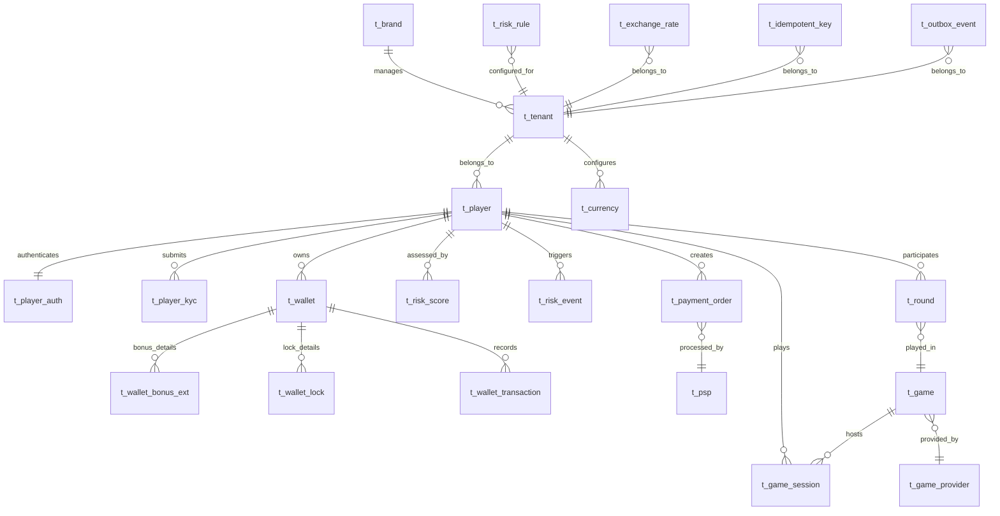

# 核心資料庫 Schema 設計（Core Database Schema Design）

> **目標讀者（Audience）**: 後端開發人員、DBA、架構師
> **SmartAdmin 版本**: v4.1.0（PostgreSQL + HikariCP, pool=20）
> **ADR 參考**: [ADR-001 單數命名標準](../architecture/adr/ADR-001_Naming_Convention_Singular_Standard.md)
> **資料模型**: [Data Model Architecture](../architecture/00_Overview/04_Data_Model.md)
> **金融實作**: [Financial Implementation](../architecture/02_Finance_Service/04_Financial_Implementation.md)
> **最後更新（Last Updated）**: 2026-02-14

---

## 1. 命名規範（Naming Conventions）

依據 ADR-001 單數命名標準，所有資料庫物件遵循以下規範：

| 物件類型 | 前綴 | 命名規則 | 範例 |
|---------|------|---------|------|
| Table | `t_` | 單數、snake_case | `t_player`（非 `t_players`） |
| Column | 無 | snake_case | `player_id`, `created_at` |
| Primary Key | `pk_` | `pk_{table}` | `pk_player` |
| Index | `idx_` | `idx_{table}_{columns}` | `idx_player_tenant_username` |
| Unique Constraint | `uk_` | `uk_{table}_{columns}` | `uk_wallet_player_type_tenant` |
| Foreign Key | `fk_` | `fk_{child}_{parent}` | `fk_wallet_player` |
| Check Constraint | `ck_` | `ck_{table}_{column}` | `ck_wallet_balance_non_negative` |

> **與現有架構文件的差異說明**：現有架構文件（Data Model Architecture）中使用複數表名（`players`, `brands`, `game_providers` 等）。本實作文件依照 ADR-001 修正為單數形式（`t_player`, `t_brand`, `t_game_provider`）。**以本文件為準**。

### 1.1 通用欄位規範（Common Column Standards）

所有表必須包含以下欄位：

```sql
-- 每張表必須包含的欄位
tenant_id       BIGINT          NOT NULL,   -- 租戶隔離（Multi-Tenant isolation）
created_at      TIMESTAMPTZ     NOT NULL DEFAULT NOW(),
updated_at      TIMESTAMPTZ     NOT NULL DEFAULT NOW(),
deleted         BOOLEAN         NOT NULL DEFAULT FALSE  -- 軟刪除（非 is_deleted）
```

---

## 2. Phase 0：基礎建表（Foundation Tables）

### 2.1 品牌表（t_brand）

```sql
CREATE TABLE t_brand (
    brand_id        BIGINT          PRIMARY KEY,
    brand_name      VARCHAR(100)    NOT NULL,
    brand_code      VARCHAR(50)     NOT NULL,
    logo_url        VARCHAR(500),
    status          VARCHAR(20)     NOT NULL DEFAULT 'ACTIVE',  -- ACTIVE, SUSPENDED, CLOSED
    config          JSONB           NOT NULL DEFAULT '{}',
    tenant_id       BIGINT          NOT NULL,
    created_at      TIMESTAMPTZ     NOT NULL DEFAULT NOW(),
    updated_at      TIMESTAMPTZ     NOT NULL DEFAULT NOW(),
    deleted         BOOLEAN         NOT NULL DEFAULT FALSE,

    CONSTRAINT uk_brand_code UNIQUE (brand_code),
    CONSTRAINT ck_brand_status CHECK (status IN ('ACTIVE', 'SUSPENDED', 'CLOSED'))
);

COMMENT ON TABLE  t_brand IS '品牌主表 — 多租戶階層最頂層實體';
COMMENT ON COLUMN t_brand.brand_id   IS '品牌唯一標識（Snowflake ID）';
COMMENT ON COLUMN t_brand.brand_name IS '品牌顯示名稱';
COMMENT ON COLUMN t_brand.brand_code IS '品牌代碼（唯一，用於 API 路由）';
COMMENT ON COLUMN t_brand.config     IS '品牌級配置（JSONB），如預設幣別、時區等';
COMMENT ON COLUMN t_brand.deleted    IS '軟刪除標記（SmartAdmin 標準：deleted 非 isDeleted）';
```

### 2.2 租戶表（t_tenant）

```sql
CREATE TABLE t_tenant (
    tenant_id       BIGINT          PRIMARY KEY,
    brand_id        BIGINT          NOT NULL,
    tenant_name     VARCHAR(100)    NOT NULL,
    tenant_code     VARCHAR(50)     NOT NULL,
    domain          VARCHAR(255),
    license_type    VARCHAR(50),                        -- MGA, UKGC, CURACAO
    default_currency VARCHAR(10)    NOT NULL DEFAULT 'USD',
    timezone        VARCHAR(50)     NOT NULL DEFAULT 'UTC',
    config          JSONB           NOT NULL DEFAULT '{}',
    status          VARCHAR(20)     NOT NULL DEFAULT 'ACTIVE',
    created_at      TIMESTAMPTZ     NOT NULL DEFAULT NOW(),
    updated_at      TIMESTAMPTZ     NOT NULL DEFAULT NOW(),
    deleted         BOOLEAN         NOT NULL DEFAULT FALSE,

    CONSTRAINT uk_tenant_code UNIQUE (tenant_code),
    CONSTRAINT fk_tenant_brand FOREIGN KEY (brand_id) REFERENCES t_brand(brand_id),
    CONSTRAINT ck_tenant_status CHECK (status IN ('ACTIVE', 'SUSPENDED', 'CLOSED'))
);

CREATE INDEX idx_tenant_brand ON t_tenant (brand_id);

COMMENT ON TABLE  t_tenant IS '租戶表（營運商 Operator）— 屬於品牌，為 Row-Level Security 的隔離單位';
COMMENT ON COLUMN t_tenant.tenant_id       IS '租戶唯一標識（Snowflake ID），所有業務表的 RLS 鍵';
COMMENT ON COLUMN t_tenant.brand_id        IS '所屬品牌 ID';
COMMENT ON COLUMN t_tenant.domain          IS '租戶專屬域名';
COMMENT ON COLUMN t_tenant.license_type    IS '牌照類型（MGA, UKGC, CURACAO 等）';
COMMENT ON COLUMN t_tenant.default_currency IS '預設幣別代碼';
COMMENT ON COLUMN t_tenant.config          IS '租戶級配置（JSONB），如 KYC 等級要求、風控閾值等';
```

### 2.3 冪等鍵表（t_idempotent_key）

```sql
CREATE TABLE t_idempotent_key (
    id              BIGINT          PRIMARY KEY,
    event_id        VARCHAR(64)     NOT NULL,
    event_type      VARCHAR(50)     NOT NULL,           -- DEPOSIT_CALLBACK, BET_SETTLE, WITHDRAWAL
    payload_hash    CHAR(64),                           -- SHA-256 of request payload
    result          JSONB,
    processed_at    TIMESTAMPTZ     NOT NULL DEFAULT NOW(),
    expires_at      TIMESTAMPTZ     NOT NULL,           -- ADR-015: TTL = 3600 秒
    tenant_id       BIGINT          NOT NULL,
    created_at      TIMESTAMPTZ     NOT NULL DEFAULT NOW(),

    CONSTRAINT uk_idempotent_event UNIQUE (event_id, event_type, tenant_id)
);

CREATE INDEX idx_idempotent_expires ON t_idempotent_key (expires_at)
    WHERE expires_at < NOW();

COMMENT ON TABLE  t_idempotent_key IS '冪等鍵表 — 三層冪等防禦的持久化層（Redis 快取 → DB 唯一鍵 → 業務狀態檢查）';
COMMENT ON COLUMN t_idempotent_key.event_id   IS '事件唯一 ID（如 request_id、callback order_id）';
COMMENT ON COLUMN t_idempotent_key.event_type IS '事件類型（DEPOSIT_CALLBACK, BET_SETTLE 等）';
COMMENT ON COLUMN t_idempotent_key.expires_at IS '過期時間（ADR-015 統一 TTL = 3600 秒）';
```

### 2.4 幣別表（t_currency）

```sql
CREATE TABLE t_currency (
    currency_id     BIGINT          PRIMARY KEY,
    currency_code   VARCHAR(10)     NOT NULL,           -- ISO 4217: USD, EUR, CNY, BTC
    currency_name   VARCHAR(50)     NOT NULL,
    currency_type   VARCHAR(20)     NOT NULL DEFAULT 'FIAT',  -- FIAT, CRYPTO
    decimal_places  INT             NOT NULL DEFAULT 2,
    symbol          VARCHAR(10),
    status          VARCHAR(20)     NOT NULL DEFAULT 'ACTIVE',
    tenant_id       BIGINT          NOT NULL,
    created_at      TIMESTAMPTZ     NOT NULL DEFAULT NOW(),
    updated_at      TIMESTAMPTZ     NOT NULL DEFAULT NOW(),
    deleted         BOOLEAN         NOT NULL DEFAULT FALSE,

    CONSTRAINT uk_currency_code_tenant UNIQUE (currency_code, tenant_id),
    CONSTRAINT ck_currency_type CHECK (currency_type IN ('FIAT', 'CRYPTO')),
    CONSTRAINT ck_currency_decimals CHECK (decimal_places BETWEEN 0 AND 18)
);

COMMENT ON TABLE  t_currency IS '幣別表 — 支援法幣與加密貨幣';
COMMENT ON COLUMN t_currency.currency_code   IS 'ISO 4217 幣別代碼（法幣）或標準代碼（加密貨幣）';
COMMENT ON COLUMN t_currency.decimal_places  IS '小數位數（法幣通常 2-4，加密貨幣可達 18）';
```

### 2.5 匯率表（t_exchange_rate）

```sql
CREATE TABLE t_exchange_rate (
    id              BIGINT          PRIMARY KEY,
    from_currency   VARCHAR(10)     NOT NULL,
    to_currency     VARCHAR(10)     NOT NULL,
    rate            DECIMAL(19,8)   NOT NULL,           -- 高精度匯率
    source          VARCHAR(50)     NOT NULL DEFAULT 'MANUAL',  -- MANUAL, ECB, BINANCE
    effective_at    TIMESTAMPTZ     NOT NULL,
    expired_at      TIMESTAMPTZ,
    tenant_id       BIGINT          NOT NULL,
    created_at      TIMESTAMPTZ     NOT NULL DEFAULT NOW(),

    CONSTRAINT ck_exchange_rate_positive CHECK (rate > 0)
);

CREATE INDEX idx_exchange_rate_pair ON t_exchange_rate (from_currency, to_currency, effective_at DESC);
CREATE INDEX idx_exchange_rate_tenant ON t_exchange_rate (tenant_id, effective_at DESC);

COMMENT ON TABLE  t_exchange_rate IS '匯率表 — 記錄歷史匯率快照，支援多幣別結算';
COMMENT ON COLUMN t_exchange_rate.rate         IS '匯率（DECIMAL(19,8) 高精度）';
COMMENT ON COLUMN t_exchange_rate.effective_at IS '生效時間';
COMMENT ON COLUMN t_exchange_rate.source       IS '匯率來源（MANUAL 手動、ECB 歐洲央行、BINANCE 等）';
```

---

## 3. Phase 1：金融核心建表（Financial Core Tables）

> **參考文件**：下列 DDL 基於 [Financial Implementation](../architecture/02_Finance_Service/04_Financial_Implementation.md) Section 2.1 的現有設計，修正命名並補充完整約束。

### 3.1 錢包主表（t_wallet）

```sql
CREATE TABLE t_wallet (
    wallet_id       BIGINT          PRIMARY KEY,
    player_id       BIGINT          NOT NULL,
    tenant_id       BIGINT          NOT NULL,
    currency_code   VARCHAR(10)     NOT NULL DEFAULT 'USD',
    wallet_type     VARCHAR(20)     NOT NULL,           -- CASH, BONUS, CREDIT
    balance         DECIMAL(19,4)   NOT NULL DEFAULT 0.0000,
    locked_amount   DECIMAL(19,4)   NOT NULL DEFAULT 0.0000,
    version         INT             NOT NULL DEFAULT 0, -- 樂觀鎖
    created_at      TIMESTAMPTZ     NOT NULL DEFAULT NOW(),
    updated_at      TIMESTAMPTZ     NOT NULL DEFAULT NOW(),
    deleted         BOOLEAN         NOT NULL DEFAULT FALSE,

    CONSTRAINT uk_wallet_player_type_tenant UNIQUE (player_id, wallet_type, tenant_id),
    CONSTRAINT ck_wallet_type CHECK (wallet_type IN ('CASH', 'BONUS', 'CREDIT')),
    CONSTRAINT ck_wallet_balance_non_negative CHECK (balance >= 0),
    CONSTRAINT ck_wallet_locked_non_negative CHECK (locked_amount >= 0),
    CONSTRAINT ck_wallet_locked_le_balance CHECK (locked_amount <= balance)
);

CREATE INDEX idx_wallet_player_tenant ON t_wallet (player_id, tenant_id);
CREATE INDEX idx_wallet_tenant ON t_wallet (tenant_id);

COMMENT ON TABLE  t_wallet IS '錢包主表 — 統一管理所有錢包類型的餘額與鎖定金額';
COMMENT ON COLUMN t_wallet.wallet_id     IS '錢包唯一標識（Snowflake ID）';
COMMENT ON COLUMN t_wallet.wallet_type   IS '錢包類型：CASH（現金）、BONUS（優惠）、CREDIT（信用額度，Phase 2+）';
COMMENT ON COLUMN t_wallet.balance       IS '當前餘額（DECIMAL(19,4)），BONUS 類型為所有活動 Bonus 的匯總';
COMMENT ON COLUMN t_wallet.locked_amount IS '鎖定金額匯總（= SUM(t_wallet_lock.lock_amount)）';
COMMENT ON COLUMN t_wallet.version       IS '樂觀鎖版本號，用於並發控制';
```

### 3.2 Bonus 錢包擴展表（t_wallet_bonus_ext）

```sql
CREATE TABLE t_wallet_bonus_ext (
    id                    BIGINT          PRIMARY KEY,
    wallet_id             BIGINT          NOT NULL,
    bonus_id              BIGINT          NOT NULL,             -- 關聯活動/促銷
    balance               DECIMAL(19,4)   NOT NULL DEFAULT 0.0000,
    wagering_requirement  DECIMAL(19,4)   NOT NULL,             -- 流水要求（Wagering Requirement）
    wagered_amount        DECIMAL(19,4)   NOT NULL DEFAULT 0.0000,
    expires_at            TIMESTAMPTZ,
    game_restriction      JSONB,                                -- 遊戲限制（可指定遊戲類型/ID）
    status                VARCHAR(20)     NOT NULL DEFAULT 'ACTIVE',
    tenant_id             BIGINT          NOT NULL,
    created_at            TIMESTAMPTZ     NOT NULL DEFAULT NOW(),
    updated_at            TIMESTAMPTZ     NOT NULL DEFAULT NOW(),

    CONSTRAINT fk_wallet_bonus_ext_wallet FOREIGN KEY (wallet_id) REFERENCES t_wallet(wallet_id),
    CONSTRAINT ck_bonus_ext_status CHECK (status IN ('ACTIVE', 'EXPIRED', 'COMPLETED', 'FORFEITED')),
    CONSTRAINT ck_bonus_ext_balance_non_negative CHECK (balance >= 0)
);

CREATE INDEX idx_wallet_bonus_ext_wallet_status ON t_wallet_bonus_ext (wallet_id, status);
CREATE INDEX idx_wallet_bonus_ext_expires ON t_wallet_bonus_ext (expires_at, status)
    WHERE status = 'ACTIVE';
CREATE INDEX idx_wallet_bonus_ext_tenant ON t_wallet_bonus_ext (tenant_id);

COMMENT ON TABLE  t_wallet_bonus_ext IS 'Bonus 錢包擴展表 — 每筆活動 Bonus 明細（流水要求、過期、遊戲限制）';
COMMENT ON COLUMN t_wallet_bonus_ext.wagering_requirement IS '流水要求金額（有效投注額 Valid Turnover 門檻）';
COMMENT ON COLUMN t_wallet_bonus_ext.wagered_amount       IS '已完成流水金額';
COMMENT ON COLUMN t_wallet_bonus_ext.game_restriction     IS '遊戲限制（JSONB），如 {"allowed_game_types": ["SLOT"], "excluded_game_ids": [101]}';
```

### 3.3 錢包鎖定明細表（t_wallet_lock）

```sql
CREATE TABLE t_wallet_lock (
    lock_id         BIGINT          PRIMARY KEY,
    wallet_id       BIGINT          NOT NULL,
    lock_amount     DECIMAL(19,4)   NOT NULL,
    lock_reason     VARCHAR(50)     NOT NULL,           -- BET_PENDING, WITHDRAWAL_PENDING, FRAUD_HOLD
    reference_id    VARCHAR(64)     NOT NULL,           -- 關聯的投注/提款訂單 ID
    expires_at      TIMESTAMPTZ,                        -- 鎖定過期時間（可選）
    tenant_id       BIGINT          NOT NULL,
    created_at      TIMESTAMPTZ     NOT NULL DEFAULT NOW(),

    CONSTRAINT fk_wallet_lock_wallet FOREIGN KEY (wallet_id) REFERENCES t_wallet(wallet_id),
    CONSTRAINT ck_wallet_lock_amount_positive CHECK (lock_amount > 0),
    CONSTRAINT ck_wallet_lock_reason CHECK (lock_reason IN ('BET_PENDING', 'WITHDRAWAL_PENDING', 'FRAUD_HOLD'))
);

CREATE INDEX idx_wallet_lock_wallet_ref ON t_wallet_lock (wallet_id, reference_id);
CREATE INDEX idx_wallet_lock_tenant ON t_wallet_lock (tenant_id);
CREATE INDEX idx_wallet_lock_expires ON t_wallet_lock (expires_at)
    WHERE expires_at IS NOT NULL;

COMMENT ON TABLE  t_wallet_lock IS '錢包鎖定明細表 — LOCKED 不是錢包類型，而是 CASH 錢包上的「扣住機制」';
COMMENT ON COLUMN t_wallet_lock.lock_reason  IS '鎖定原因：BET_PENDING（待結算投注）、WITHDRAWAL_PENDING（待審核提款）、FRAUD_HOLD（風控凍結）';
COMMENT ON COLUMN t_wallet_lock.reference_id IS '關聯訂單 ID（投注單號、提款單號等）';
```

### 3.4 錢包交易記錄表（t_wallet_transaction）

```sql
CREATE TABLE t_wallet_transaction (
    transaction_id      BIGINT          PRIMARY KEY,
    wallet_id           BIGINT          NOT NULL,
    player_id           BIGINT          NOT NULL,
    transaction_type    VARCHAR(20)     NOT NULL,       -- DEPOSIT, WITHDRAW, BET, WIN, BONUS, ADJUSTMENT
    amount              DECIMAL(19,4)   NOT NULL,
    balance_before      DECIMAL(19,4)   NOT NULL,
    balance_after       DECIMAL(19,4)   NOT NULL,
    request_id          VARCHAR(64)     NOT NULL,       -- 冪等鍵（Idempotency key）
    reference_type      VARCHAR(30),                    -- DEPOSIT_ORDER, WITHDRAWAL_ORDER, ROUND, BONUS
    reference_id        VARCHAR(64),                    -- 關聯訂單/回合 ID
    description         VARCHAR(200),
    tenant_id           BIGINT          NOT NULL,
    created_at          TIMESTAMPTZ     NOT NULL DEFAULT NOW(),

    CONSTRAINT uk_wallet_transaction_request UNIQUE (request_id),
    CONSTRAINT fk_wallet_transaction_wallet FOREIGN KEY (wallet_id) REFERENCES t_wallet(wallet_id),
    CONSTRAINT ck_wallet_transaction_type CHECK (
        transaction_type IN ('DEPOSIT', 'WITHDRAW', 'BET', 'WIN', 'BONUS', 'ADJUSTMENT')
    )
);

CREATE INDEX idx_wallet_transaction_wallet_time ON t_wallet_transaction (wallet_id, created_at DESC);
CREATE INDEX idx_wallet_transaction_player_type ON t_wallet_transaction (player_id, transaction_type, created_at DESC);
CREATE INDEX idx_wallet_transaction_tenant ON t_wallet_transaction (tenant_id, created_at DESC);
CREATE INDEX idx_wallet_transaction_ref ON t_wallet_transaction (reference_type, reference_id);

COMMENT ON TABLE  t_wallet_transaction IS '錢包交易記錄表 — 所有資金流動的不可變日誌';
COMMENT ON COLUMN t_wallet_transaction.request_id      IS '冪等鍵（UNIQUE），確保每筆交易只處理一次';
COMMENT ON COLUMN t_wallet_transaction.balance_before   IS '交易前餘額（審計用）';
COMMENT ON COLUMN t_wallet_transaction.balance_after    IS '交易後餘額（審計用）';
COMMENT ON COLUMN t_wallet_transaction.reference_type   IS '關聯類型（DEPOSIT_ORDER, WITHDRAWAL_ORDER, ROUND, BONUS）';
```

### 3.5 遊戲回合表（t_round）

```sql
CREATE TABLE t_round (
    round_id            BIGINT          PRIMARY KEY,
    external_round_id   VARCHAR(100)    NOT NULL,       -- 遊戲商 (Game Provider) 回合 ID
    player_id           BIGINT          NOT NULL,
    game_id             BIGINT          NOT NULL,
    game_provider_id    BIGINT          NOT NULL,
    round_status        VARCHAR(20)     NOT NULL DEFAULT 'OPEN',  -- OPEN, CLOSED, CANCELLED
    total_bet           DECIMAL(19,4)   NOT NULL DEFAULT 0.0000,
    total_win           DECIMAL(19,4)   NOT NULL DEFAULT 0.0000,
    is_valid_turnover   BOOLEAN         NOT NULL DEFAULT TRUE,    -- 是否計入有效投注額 (Valid Turnover)
    currency_code       VARCHAR(10)     NOT NULL DEFAULT 'USD',
    started_at          TIMESTAMPTZ     NOT NULL DEFAULT NOW(),
    ended_at            TIMESTAMPTZ,
    tenant_id           BIGINT          NOT NULL,
    created_at          TIMESTAMPTZ     NOT NULL DEFAULT NOW(),
    updated_at          TIMESTAMPTZ     NOT NULL DEFAULT NOW(),

    CONSTRAINT uk_round_external UNIQUE (external_round_id, game_provider_id, tenant_id),
    CONSTRAINT ck_round_status CHECK (round_status IN ('OPEN', 'CLOSED', 'CANCELLED')),
    CONSTRAINT ck_round_bet_non_negative CHECK (total_bet >= 0),
    CONSTRAINT ck_round_win_non_negative CHECK (total_win >= 0)
);

CREATE INDEX idx_round_player_status ON t_round (player_id, round_status, created_at DESC);
CREATE INDEX idx_round_game_provider ON t_round (game_provider_id, created_at DESC);
CREATE INDEX idx_round_tenant ON t_round (tenant_id, created_at DESC);
CREATE INDEX idx_round_turnover ON t_round (is_valid_turnover, player_id, created_at)
    WHERE is_valid_turnover = TRUE;

COMMENT ON TABLE  t_round IS '遊戲回合表 — Seamless Wallet 協議的核心實體，一個回合對應多筆投注/派彩';
COMMENT ON COLUMN t_round.external_round_id IS '遊戲商 (Game Provider) 端的回合 ID';
COMMENT ON COLUMN t_round.is_valid_turnover IS '是否計入有效投注額 (Valid Turnover)，風險引擎可標記為 false';
```

### 3.6 支付訂單表（t_payment_order）

```sql
CREATE TABLE t_payment_order (
    order_id            BIGINT          PRIMARY KEY,
    player_id           BIGINT          NOT NULL,
    order_type          VARCHAR(20)     NOT NULL,       -- DEPOSIT, WITHDRAWAL
    amount              DECIMAL(19,4)   NOT NULL,
    currency_code       VARCHAR(10)     NOT NULL DEFAULT 'USD',
    psp_id              BIGINT,
    psp_order_id        VARCHAR(100),                   -- PSP 端訂單號
    payment_method      VARCHAR(50),                    -- BANK_TRANSFER, CREDIT_CARD, E_WALLET, CRYPTO
    order_status        VARCHAR(20)     NOT NULL DEFAULT 'PENDING',
    review_type         VARCHAR(30),                    -- RISK_CHECK, KYC_REQUIRED, MANUAL_REVIEW（REVIEWING 子狀態）
    risk_score          INT,
    reviewer_id         VARCHAR(50),
    review_comment      VARCHAR(500),
    reviewed_at         TIMESTAMPTZ,
    completed_at        TIMESTAMPTZ,
    failed_reason       VARCHAR(500),
    tenant_id           BIGINT          NOT NULL,
    created_at          TIMESTAMPTZ     NOT NULL DEFAULT NOW(),
    updated_at          TIMESTAMPTZ     NOT NULL DEFAULT NOW(),

    CONSTRAINT ck_payment_order_type CHECK (order_type IN ('DEPOSIT', 'WITHDRAWAL')),
    CONSTRAINT ck_payment_order_status CHECK (
        order_status IN ('PENDING', 'REVIEWING', 'APPROVED', 'PROCESSING', 'SUCCESS', 'FAILED', 'REJECTED', 'CANCELLED')
    ),
    CONSTRAINT ck_payment_order_amount_positive CHECK (amount > 0)
);

CREATE INDEX idx_payment_order_player ON t_payment_order (player_id, order_type, created_at DESC);
CREATE INDEX idx_payment_order_status ON t_payment_order (order_status, created_at);
CREATE INDEX idx_payment_order_psp ON t_payment_order (psp_id, psp_order_id);
CREATE INDEX idx_payment_order_tenant ON t_payment_order (tenant_id, created_at DESC);
CREATE INDEX idx_payment_order_review ON t_payment_order (order_status, review_type, created_at)
    WHERE order_status = 'REVIEWING';

COMMENT ON TABLE  t_payment_order IS '支付訂單表 — 統一管理存款與提款訂單';
COMMENT ON COLUMN t_payment_order.order_status IS '訂單狀態：PENDING→REVIEWING→APPROVED→PROCESSING→SUCCESS/FAILED/REJECTED/CANCELLED';
COMMENT ON COLUMN t_payment_order.review_type  IS '審核子類型（僅 REVIEWING 狀態時有效）：RISK_CHECK、KYC_REQUIRED、MANUAL_REVIEW';
COMMENT ON COLUMN t_payment_order.risk_score   IS '風險評分（0-100），由提款風控模型計算';
```

### 3.7 支付服務提供商表（t_psp）

```sql
CREATE TABLE t_psp (
    psp_id              BIGINT          PRIMARY KEY,
    psp_name            VARCHAR(100)    NOT NULL,
    psp_code            VARCHAR(50)     NOT NULL,
    api_url             VARCHAR(500)    NOT NULL,
    callback_url        VARCHAR(500),
    api_key_encrypted   BYTEA,                          -- AES-256-GCM 加密的 API Key
    secret_key_encrypted BYTEA,                         -- AES-256-GCM 加密的 Secret Key
    supported_methods   JSONB           NOT NULL DEFAULT '[]',  -- ["BANK_TRANSFER", "CREDIT_CARD"]
    config              JSONB           NOT NULL DEFAULT '{}',
    status              VARCHAR(20)     NOT NULL DEFAULT 'ACTIVE',
    tenant_id           BIGINT          NOT NULL,
    created_at          TIMESTAMPTZ     NOT NULL DEFAULT NOW(),
    updated_at          TIMESTAMPTZ     NOT NULL DEFAULT NOW(),
    deleted             BOOLEAN         NOT NULL DEFAULT FALSE,

    CONSTRAINT uk_psp_code_tenant UNIQUE (psp_code, tenant_id),
    CONSTRAINT ck_psp_status CHECK (status IN ('ACTIVE', 'SUSPENDED', 'CLOSED'))
);

CREATE INDEX idx_psp_tenant ON t_psp (tenant_id);

COMMENT ON TABLE  t_psp IS '支付服務提供商表（Payment Service Provider）';
COMMENT ON COLUMN t_psp.api_key_encrypted    IS 'API Key（AES-256-GCM 加密儲存，BYTEA 類型）';
COMMENT ON COLUMN t_psp.secret_key_encrypted IS 'Secret Key（AES-256-GCM 加密儲存）';
COMMENT ON COLUMN t_psp.supported_methods    IS '支援的支付方式（JSONB 陣列）';
```

### 3.8 Outbox 事件表（t_outbox_event）

```sql
CREATE TABLE t_outbox_event (
    event_id        BIGINT          PRIMARY KEY,
    aggregate_type  VARCHAR(50)     NOT NULL,           -- WALLET, BET, WITHDRAWAL, DEPOSIT
    aggregate_id    VARCHAR(64)     NOT NULL,
    event_type      VARCHAR(50)     NOT NULL,           -- WALLET_DEBITED, WALLET_CREDITED, etc.
    payload         JSONB           NOT NULL,
    tenant_id       BIGINT          NOT NULL,
    created_at      TIMESTAMPTZ     NOT NULL DEFAULT NOW(),
    processed_at    TIMESTAMPTZ
);

CREATE INDEX idx_outbox_unprocessed ON t_outbox_event (processed_at, created_at)
    WHERE processed_at IS NULL;
CREATE INDEX idx_outbox_tenant ON t_outbox_event (tenant_id);

COMMENT ON TABLE  t_outbox_event IS 'Outbox 事件表 — Transactional Outbox Pattern，確保事件與業務資料在同一交易中持久化';
COMMENT ON COLUMN t_outbox_event.aggregate_type IS '聚合根類型（WALLET, BET, WITHDRAWAL 等）';
COMMENT ON COLUMN t_outbox_event.processed_at   IS '事件被轉發至 Kafka 的時間（NULL 表示未處理）';
```

---

## 4. Phase 2：玩家與遊戲建表（Player & Game Tables）

### 4.1 玩家表（t_player）

```sql
CREATE TABLE t_player (
    player_id           BIGINT          PRIMARY KEY,
    tenant_id           BIGINT          NOT NULL,
    username            VARCHAR(50)     NOT NULL,
    email_encrypted     BYTEA,                          -- AES-256-GCM 加密的 Email
    email_index         CHAR(64),                       -- HMAC-SHA256 盲索引（Blind Index）
    phone_encrypted     BYTEA,                          -- AES-256-GCM 加密的手機號
    phone_index         CHAR(64),                       -- HMAC-SHA256 盲索引
    display_name        VARCHAR(100),
    avatar_url          VARCHAR(500),
    account_status      VARCHAR(30)     NOT NULL DEFAULT 'ACTIVE',
    kyc_level           VARCHAR(30)     NOT NULL DEFAULT 'NOT_VERIFIED',
    vip_level           VARCHAR(20)     NOT NULL DEFAULT 'BRONZE',
    vip_warning_until   TIMESTAMPTZ,                    -- VIP 保級警告截止日
    agent_id            BIGINT,                         -- 推薦代理 ID（可空）
    registration_ip     VARCHAR(45),                    -- IPv4 或 IPv6
    last_login_at       TIMESTAMPTZ,
    last_login_ip       VARCHAR(45),
    failed_login_attempts INT           NOT NULL DEFAULT 0,
    locked_until        TIMESTAMPTZ,
    preferred_language  VARCHAR(10)     NOT NULL DEFAULT 'en',
    preferred_currency  VARCHAR(10)     NOT NULL DEFAULT 'USD',
    created_at          TIMESTAMPTZ     NOT NULL DEFAULT NOW(),
    updated_at          TIMESTAMPTZ     NOT NULL DEFAULT NOW(),
    deleted             BOOLEAN         NOT NULL DEFAULT FALSE,

    CONSTRAINT uk_player_tenant_username UNIQUE (tenant_id, username),
    CONSTRAINT ck_player_status CHECK (
        account_status IN ('ACTIVE', 'LOCKED', 'SUSPENDED', 'PENDING_VERIFICATION', 'CLOSED')
    ),
    CONSTRAINT ck_player_kyc CHECK (
        kyc_level IN ('NOT_VERIFIED', 'PARTIALLY_VERIFIED', 'VERIFIED', 'ENHANCED')
    ),
    CONSTRAINT ck_player_vip CHECK (
        vip_level IN ('BRONZE', 'SILVER', 'GOLD', 'PLATINUM', 'DIAMOND')
    )
);

CREATE INDEX idx_player_email_index ON t_player (email_index) WHERE email_index IS NOT NULL;
CREATE INDEX idx_player_phone_index ON t_player (phone_index) WHERE phone_index IS NOT NULL;
CREATE INDEX idx_player_tenant ON t_player (tenant_id);
CREATE INDEX idx_player_agent ON t_player (agent_id) WHERE agent_id IS NOT NULL;
CREATE INDEX idx_player_status ON t_player (tenant_id, account_status)
    WHERE account_status != 'CLOSED';
CREATE INDEX idx_player_vip ON t_player (tenant_id, vip_level);

COMMENT ON TABLE  t_player IS '玩家表 — 終端玩家核心資訊，PII 欄位加密儲存';
COMMENT ON COLUMN t_player.email_encrypted IS 'Email（AES-256-GCM 加密，BYTEA），每租戶獨立 DEK';
COMMENT ON COLUMN t_player.email_index     IS 'Email 盲索引（HMAC-SHA256, CHAR(64)），用於加密欄位的等值查詢';
COMMENT ON COLUMN t_player.phone_encrypted IS '手機號（AES-256-GCM 加密，BYTEA）';
COMMENT ON COLUMN t_player.phone_index     IS '手機號盲索引（HMAC-SHA256, CHAR(64)）';
COMMENT ON COLUMN t_player.account_status  IS '帳號狀態：ACTIVE、LOCKED（登入失敗鎖定）、SUSPENDED（風控暫停）、PENDING_VERIFICATION（KYC 升級中）、CLOSED（永久關閉）';
COMMENT ON COLUMN t_player.kyc_level       IS '身份驗證 (KYC, Know Your Customer) 等級';
```

### 4.2 玩家認證表（t_player_auth）

```sql
CREATE TABLE t_player_auth (
    auth_id         BIGINT          PRIMARY KEY,
    player_id       BIGINT          NOT NULL,
    auth_type       VARCHAR(30)     NOT NULL,           -- PASSWORD, MFA_TOTP, GOOGLE, FACEBOOK
    credential_hash VARCHAR(200),                       -- Argon2id hash (PASSWORD) 或 encrypted secret (MFA)
    salt            VARCHAR(50),                        -- Argon2id salt（僅 PASSWORD 類型）
    external_id     VARCHAR(200),                       -- OAuth provider user ID
    status          VARCHAR(20)     NOT NULL DEFAULT 'ACTIVE',
    last_used_at    TIMESTAMPTZ,
    tenant_id       BIGINT          NOT NULL,
    created_at      TIMESTAMPTZ     NOT NULL DEFAULT NOW(),
    updated_at      TIMESTAMPTZ     NOT NULL DEFAULT NOW(),

    CONSTRAINT fk_player_auth_player FOREIGN KEY (player_id) REFERENCES t_player(player_id),
    CONSTRAINT uk_player_auth_type UNIQUE (player_id, auth_type),
    CONSTRAINT ck_player_auth_type CHECK (
        auth_type IN ('PASSWORD', 'MFA_TOTP', 'GOOGLE', 'FACEBOOK', 'APPLE', 'LINE')
    )
);

CREATE INDEX idx_player_auth_tenant ON t_player_auth (tenant_id);

COMMENT ON TABLE  t_player_auth IS '玩家認證表 — 支援多種認證方式（密碼、MFA、OAuth）';
COMMENT ON COLUMN t_player_auth.credential_hash IS '憑證雜湊值：PASSWORD 使用 Argon2id（m=65536, t=3, p=4），MFA 使用 AES-256-GCM 加密';
```

### 4.3 玩家 KYC 表（t_player_kyc）

```sql
CREATE TABLE t_player_kyc (
    kyc_id              BIGINT          PRIMARY KEY,
    player_id           BIGINT          NOT NULL,
    kyc_level           VARCHAR(30)     NOT NULL,       -- 申請的 KYC 等級
    document_type       VARCHAR(50)     NOT NULL,       -- PASSPORT, NATIONAL_ID, DRIVER_LICENSE, UTILITY_BILL
    document_url        VARCHAR(500)    NOT NULL,       -- 加密儲存在 MinIO 的文件路徑
    document_hash       CHAR(64),                       -- SHA-256 文件完整性校驗
    verification_status VARCHAR(30)     NOT NULL DEFAULT 'PENDING',
    rejection_reason    VARCHAR(500),
    verified_by         VARCHAR(50),                    -- 審核員 ID
    verified_at         TIMESTAMPTZ,
    expires_at          TIMESTAMPTZ,                    -- 文件有效期
    tenant_id           BIGINT          NOT NULL,
    created_at          TIMESTAMPTZ     NOT NULL DEFAULT NOW(),
    updated_at          TIMESTAMPTZ     NOT NULL DEFAULT NOW(),

    CONSTRAINT fk_player_kyc_player FOREIGN KEY (player_id) REFERENCES t_player(player_id),
    CONSTRAINT ck_kyc_verification_status CHECK (
        verification_status IN ('PENDING', 'APPROVED', 'REJECTED', 'EXPIRED')
    )
);

CREATE INDEX idx_player_kyc_player ON t_player_kyc (player_id, created_at DESC);
CREATE INDEX idx_player_kyc_status ON t_player_kyc (tenant_id, verification_status);

COMMENT ON TABLE  t_player_kyc IS '玩家 KYC 文件表 — 身份驗證 (KYC) 文件上傳與審核記錄';
COMMENT ON COLUMN t_player_kyc.document_url  IS '文件路徑（MinIO 加密儲存），不含 PII 明文';
COMMENT ON COLUMN t_player_kyc.document_hash IS '文件 SHA-256 雜湊值，用於完整性校驗';
```

### 4.4 遊戲提供商表（t_game_provider）

```sql
CREATE TABLE t_game_provider (
    gp_id               BIGINT          PRIMARY KEY,
    gp_name             VARCHAR(100)    NOT NULL,
    gp_code             VARCHAR(50)     NOT NULL,
    api_url             VARCHAR(500)    NOT NULL,
    api_key_encrypted   BYTEA,                          -- AES-256-GCM 加密
    api_secret_encrypted BYTEA,
    wallet_type         VARCHAR(20)     NOT NULL DEFAULT 'SEAMLESS',  -- SEAMLESS, TRANSFER
    supported_currencies JSONB          NOT NULL DEFAULT '["USD"]',
    callback_url        VARCHAR(500),
    config              JSONB           NOT NULL DEFAULT '{}',
    status              VARCHAR(20)     NOT NULL DEFAULT 'ACTIVE',
    tenant_id           BIGINT          NOT NULL,
    created_at          TIMESTAMPTZ     NOT NULL DEFAULT NOW(),
    updated_at          TIMESTAMPTZ     NOT NULL DEFAULT NOW(),
    deleted             BOOLEAN         NOT NULL DEFAULT FALSE,

    CONSTRAINT uk_game_provider_code_tenant UNIQUE (gp_code, tenant_id),
    CONSTRAINT ck_game_provider_wallet_type CHECK (wallet_type IN ('SEAMLESS', 'TRANSFER')),
    CONSTRAINT ck_game_provider_status CHECK (status IN ('ACTIVE', 'MAINTENANCE', 'SUSPENDED', 'CLOSED'))
);

CREATE INDEX idx_game_provider_tenant ON t_game_provider (tenant_id);

COMMENT ON TABLE  t_game_provider IS '遊戲提供商表（Game Provider, GP）— 管理遊戲商 API 連線與配置';
COMMENT ON COLUMN t_game_provider.wallet_type IS '錢包整合類型：SEAMLESS（無縫錢包）或 TRANSFER（轉帳錢包）';
```

### 4.5 遊戲表（t_game）

```sql
CREATE TABLE t_game (
    game_id         BIGINT          PRIMARY KEY,
    gp_id           BIGINT          NOT NULL,
    external_game_id VARCHAR(100)   NOT NULL,           -- GP 端的遊戲 ID
    game_name       VARCHAR(200)    NOT NULL,
    game_type       VARCHAR(30)     NOT NULL,           -- SLOT, LIVE_CASINO, TABLE_GAME, SPORT, LOTTERY
    rtp             DECIMAL(5,2),                       -- Return to Player（%），如 96.50
    game_weight     DECIMAL(5,4)    NOT NULL DEFAULT 1.0000,  -- 流水貢獻權重
    thumbnail_url   VARCHAR(500),
    tags            JSONB           NOT NULL DEFAULT '[]',
    config          JSONB           NOT NULL DEFAULT '{}',
    status          VARCHAR(20)     NOT NULL DEFAULT 'ACTIVE',
    tenant_id       BIGINT          NOT NULL,
    created_at      TIMESTAMPTZ     NOT NULL DEFAULT NOW(),
    updated_at      TIMESTAMPTZ     NOT NULL DEFAULT NOW(),
    deleted         BOOLEAN         NOT NULL DEFAULT FALSE,

    CONSTRAINT fk_game_provider FOREIGN KEY (gp_id) REFERENCES t_game_provider(gp_id),
    CONSTRAINT uk_game_external UNIQUE (external_game_id, gp_id, tenant_id),
    CONSTRAINT ck_game_type CHECK (
        game_type IN ('SLOT', 'LIVE_CASINO', 'TABLE_GAME', 'SPORT', 'LOTTERY', 'FISHING', 'OTHER')
    ),
    CONSTRAINT ck_game_rtp CHECK (rtp IS NULL OR (rtp >= 0 AND rtp <= 100)),
    CONSTRAINT ck_game_weight CHECK (game_weight >= 0 AND game_weight <= 1)
);

CREATE INDEX idx_game_provider_type ON t_game (gp_id, game_type, status);
CREATE INDEX idx_game_tenant ON t_game (tenant_id);

COMMENT ON TABLE  t_game IS '遊戲表 — 遊戲目錄與元資料';
COMMENT ON COLUMN t_game.rtp         IS 'Return to Player（%），如 96.50 表示 96.50% 回報率';
COMMENT ON COLUMN t_game.game_weight IS '有效投注額 (Valid Turnover) 貢獻權重（0~1），SLOT 通常為 1.0，TABLE_GAME 可能為 0.1';
```

### 4.6 遊戲場次表（t_game_session）

```sql
CREATE TABLE t_game_session (
    session_id      BIGINT          PRIMARY KEY,
    player_id       BIGINT          NOT NULL,
    game_id         BIGINT          NOT NULL,
    gp_session_id   VARCHAR(100),                       -- GP 端 session ID
    ip_address      VARCHAR(45),
    device_type     VARCHAR(20),                        -- DESKTOP, MOBILE, TABLET
    started_at      TIMESTAMPTZ     NOT NULL DEFAULT NOW(),
    ended_at        TIMESTAMPTZ,
    session_status  VARCHAR(20)     NOT NULL DEFAULT 'ACTIVE',
    tenant_id       BIGINT          NOT NULL,
    created_at      TIMESTAMPTZ     NOT NULL DEFAULT NOW(),

    CONSTRAINT fk_game_session_player FOREIGN KEY (player_id) REFERENCES t_player(player_id),
    CONSTRAINT fk_game_session_game FOREIGN KEY (game_id) REFERENCES t_game(game_id),
    CONSTRAINT ck_game_session_status CHECK (session_status IN ('ACTIVE', 'ENDED', 'TIMEOUT'))
);

CREATE INDEX idx_game_session_player ON t_game_session (player_id, started_at DESC);
CREATE INDEX idx_game_session_game ON t_game_session (game_id, started_at DESC);
CREATE INDEX idx_game_session_tenant ON t_game_session (tenant_id);
CREATE INDEX idx_game_session_active ON t_game_session (tenant_id, session_status)
    WHERE session_status = 'ACTIVE';

COMMENT ON TABLE  t_game_session IS '遊戲場次表 — 記錄玩家每次進入遊戲的 session';
```

---

## 5. Phase 3：風控建表（Risk Control Tables）

### 5.1 風控規則表（t_risk_rule）

```sql
CREATE TABLE t_risk_rule (
    rule_id             BIGINT          PRIMARY KEY,
    rule_name           VARCHAR(100)    NOT NULL,
    rule_code           VARCHAR(50)     NOT NULL,
    rule_type           VARCHAR(30)     NOT NULL,       -- WITHDRAWAL, BET, LOGIN, REGISTRATION
    liteflow_chain_id   VARCHAR(100),                   -- LiteFlow 規則鏈 ID
    rule_expression     TEXT,                           -- EL 表達式或 QLExpress 腳本
    priority            INT             NOT NULL DEFAULT 100,
    risk_dimension      VARCHAR(30),                    -- CREDIT, KYC, RATIO, FREQUENCY, TURNOVER, DEVICE, MULTI_ACCOUNT
    score_weight        DECIMAL(5,2)    NOT NULL DEFAULT 1.00,
    config              JSONB           NOT NULL DEFAULT '{}',
    status              VARCHAR(20)     NOT NULL DEFAULT 'ACTIVE',
    tenant_id           BIGINT          NOT NULL,
    created_at          TIMESTAMPTZ     NOT NULL DEFAULT NOW(),
    updated_at          TIMESTAMPTZ     NOT NULL DEFAULT NOW(),
    deleted             BOOLEAN         NOT NULL DEFAULT FALSE,

    CONSTRAINT uk_risk_rule_code_tenant UNIQUE (rule_code, tenant_id),
    CONSTRAINT ck_risk_rule_type CHECK (
        rule_type IN ('WITHDRAWAL', 'BET', 'LOGIN', 'REGISTRATION', 'DEPOSIT')
    ),
    CONSTRAINT ck_risk_rule_status CHECK (status IN ('ACTIVE', 'DISABLED', 'TESTING'))
);

CREATE INDEX idx_risk_rule_tenant_type ON t_risk_rule (tenant_id, rule_type, priority);

COMMENT ON TABLE  t_risk_rule IS '風控規則表 — 配置風險檢測規則，支援 LiteFlow 規則引擎';
COMMENT ON COLUMN t_risk_rule.liteflow_chain_id IS 'LiteFlow 規則鏈 ID（對應 LiteFlow Chain 配置）';
COMMENT ON COLUMN t_risk_rule.risk_dimension    IS '風險維度：CREDIT（信用）、KYC、RATIO（存提比）、FREQUENCY（頻率）等';
```

### 5.2 風險分數表（t_risk_score）

```sql
CREATE TABLE t_risk_score (
    id              BIGINT          PRIMARY KEY,
    player_id       BIGINT          NOT NULL,
    score           INT             NOT NULL,           -- 0-100
    score_type      VARCHAR(30)     NOT NULL,           -- CUMULATIVE_PROFILE, PER_TRANSACTION
    score_breakdown JSONB           NOT NULL DEFAULT '{}',  -- 各維度明細
    trigger_event   VARCHAR(50),                        -- 觸發計算的事件
    reference_id    VARCHAR(64),                        -- 關聯的交易/提款 ID
    calculated_at   TIMESTAMPTZ     NOT NULL DEFAULT NOW(),
    tenant_id       BIGINT          NOT NULL,

    CONSTRAINT fk_risk_score_player FOREIGN KEY (player_id) REFERENCES t_player(player_id),
    CONSTRAINT ck_risk_score_range CHECK (score BETWEEN 0 AND 100),
    CONSTRAINT ck_risk_score_type CHECK (score_type IN ('CUMULATIVE_PROFILE', 'PER_TRANSACTION'))
);

CREATE INDEX idx_risk_score_player ON t_risk_score (player_id, score_type, calculated_at DESC);
CREATE INDEX idx_risk_score_tenant ON t_risk_score (tenant_id, calculated_at DESC);
CREATE INDEX idx_risk_score_high ON t_risk_score (tenant_id, score)
    WHERE score >= 60;

COMMENT ON TABLE  t_risk_score IS '風險分數表 — 記錄玩家風險評分歷史';
COMMENT ON COLUMN t_risk_score.score_type      IS '分數類型：CUMULATIVE_PROFILE（累計風險檔案分數，觸發帳號級動作）、PER_TRANSACTION（單次交易風險分數，觸發訂單級動作）';
COMMENT ON COLUMN t_risk_score.score_breakdown IS '各維度分數明細（JSONB），如 {"credit":5, "kyc":0, "ratio":10, ...}';
```

### 5.3 風險事件表（t_risk_event）

```sql
CREATE TABLE t_risk_event (
    event_id        BIGINT          PRIMARY KEY,
    player_id       BIGINT          NOT NULL,
    event_type      VARCHAR(50)     NOT NULL,           -- SUSPICIOUS_LOGIN, HIGH_RISK_WITHDRAWAL, MULTI_ACCOUNT, AML_ALERT
    risk_level      VARCHAR(20)     NOT NULL,           -- LOW, MEDIUM, HIGH, CRITICAL
    details         JSONB           NOT NULL DEFAULT '{}',
    resolution      VARCHAR(30),                        -- DISMISSED, CONFIRMED, ESCALATED
    resolved_by     VARCHAR(50),
    resolved_at     TIMESTAMPTZ,
    reference_type  VARCHAR(30),                        -- WITHDRAWAL_ORDER, BET, LOGIN
    reference_id    VARCHAR(64),
    tenant_id       BIGINT          NOT NULL,
    created_at      TIMESTAMPTZ     NOT NULL DEFAULT NOW(),
    updated_at      TIMESTAMPTZ     NOT NULL DEFAULT NOW(),

    CONSTRAINT fk_risk_event_player FOREIGN KEY (player_id) REFERENCES t_player(player_id),
    CONSTRAINT ck_risk_event_level CHECK (risk_level IN ('LOW', 'MEDIUM', 'HIGH', 'CRITICAL')),
    CONSTRAINT ck_risk_event_resolution CHECK (
        resolution IS NULL OR resolution IN ('DISMISSED', 'CONFIRMED', 'ESCALATED')
    )
);

CREATE INDEX idx_risk_event_player ON t_risk_event (player_id, created_at DESC);
CREATE INDEX idx_risk_event_tenant_level ON t_risk_event (tenant_id, risk_level, created_at DESC);
CREATE INDEX idx_risk_event_unresolved ON t_risk_event (tenant_id, created_at)
    WHERE resolution IS NULL;

COMMENT ON TABLE  t_risk_event IS '風險事件表 — 記錄風控系統偵測到的所有風險事件';
COMMENT ON COLUMN t_risk_event.risk_level IS '風險等級：LOW、MEDIUM、HIGH、CRITICAL';
COMMENT ON COLUMN t_risk_event.details   IS '事件詳情（JSONB），如 IP 地址、裝置指紋、異常模式等';
```

---

## 6. 索引策略（Index Strategy）

### 6.1 租戶隔離索引（Tenant Isolation Indexes）

所有表必須包含 `tenant_id` 索引，確保 Row-Level Security (RLS) 查詢效能：

```sql
-- 每張表的 tenant_id 索引（上方各表已包含，此處彙整）
CREATE INDEX idx_brand_tenant          ON t_brand (tenant_id);
CREATE INDEX idx_tenant_brand          ON t_tenant (brand_id);
CREATE INDEX idx_player_tenant         ON t_player (tenant_id);
CREATE INDEX idx_wallet_tenant         ON t_wallet (tenant_id);
CREATE INDEX idx_wallet_transaction_tenant ON t_wallet_transaction (tenant_id, created_at DESC);
CREATE INDEX idx_round_tenant          ON t_round (tenant_id, created_at DESC);
CREATE INDEX idx_payment_order_tenant  ON t_payment_order (tenant_id, created_at DESC);
CREATE INDEX idx_game_tenant           ON t_game (tenant_id);
CREATE INDEX idx_risk_event_tenant     ON t_risk_event (tenant_id, created_at DESC);
```

### 6.2 PII 盲索引（PII Blind Indexes）

```sql
-- 加密欄位的盲索引，用於等值查詢
CREATE INDEX idx_player_email_index ON t_player (email_index) WHERE email_index IS NOT NULL;
CREATE INDEX idx_player_phone_index ON t_player (phone_index) WHERE phone_index IS NOT NULL;
```

> **查詢模式**：`SELECT * FROM t_player WHERE email_index = HMAC_SHA256(key, 'user@example.com') AND tenant_id = ?`

### 6.3 複合索引設計（Composite Index Design）

高頻查詢的複合索引遵循「選擇性高的欄位在前」原則：

| 表 | 索引 | 欄位 | 查詢場景 |
|----|------|------|---------|
| `t_player` | `uk_player_tenant_username` | `(tenant_id, username)` UNIQUE | 登入查詢 |
| `t_wallet` | `uk_wallet_player_type_tenant` | `(player_id, wallet_type, tenant_id)` UNIQUE | 錢包查詢 |
| `t_wallet_transaction` | `idx_wallet_transaction_player_type` | `(player_id, transaction_type, created_at DESC)` | 玩家交易歷史 |
| `t_round` | `idx_round_turnover` | `(is_valid_turnover, player_id, created_at)` | 有效投注額 (Valid Turnover) 計算 |
| `t_payment_order` | `idx_payment_order_review` | `(order_status, review_type, created_at)` | 審核佇列 |

### 6.4 部分索引（Partial Indexes）

僅索引活躍記錄，減少索引大小：

```sql
-- 僅索引未關閉的玩家
CREATE INDEX idx_player_status ON t_player (tenant_id, account_status)
    WHERE account_status != 'CLOSED';

-- 僅索引活躍的 Bonus
CREATE INDEX idx_wallet_bonus_ext_expires ON t_wallet_bonus_ext (expires_at, status)
    WHERE status = 'ACTIVE';

-- 僅索引活躍的遊戲場次
CREATE INDEX idx_game_session_active ON t_game_session (tenant_id, session_status)
    WHERE session_status = 'ACTIVE';

-- 僅索引未處理的 Outbox 事件
CREATE INDEX idx_outbox_unprocessed ON t_outbox_event (processed_at, created_at)
    WHERE processed_at IS NULL;

-- 僅索引未解決的風險事件
CREATE INDEX idx_risk_event_unresolved ON t_risk_event (tenant_id, created_at)
    WHERE resolution IS NULL;

-- 僅索引高風險分數
CREATE INDEX idx_risk_score_high ON t_risk_score (tenant_id, score)
    WHERE score >= 60;
```

---

## 7. Row-Level Security（RLS）策略

### 7.1 啟用 RLS

```sql
-- 為所有業務表啟用 RLS
ALTER TABLE t_brand              ENABLE ROW LEVEL SECURITY;
ALTER TABLE t_tenant             ENABLE ROW LEVEL SECURITY;
ALTER TABLE t_player             ENABLE ROW LEVEL SECURITY;
ALTER TABLE t_player_auth        ENABLE ROW LEVEL SECURITY;
ALTER TABLE t_player_kyc         ENABLE ROW LEVEL SECURITY;
ALTER TABLE t_wallet             ENABLE ROW LEVEL SECURITY;
ALTER TABLE t_wallet_bonus_ext   ENABLE ROW LEVEL SECURITY;
ALTER TABLE t_wallet_lock        ENABLE ROW LEVEL SECURITY;
ALTER TABLE t_wallet_transaction ENABLE ROW LEVEL SECURITY;
ALTER TABLE t_round              ENABLE ROW LEVEL SECURITY;
ALTER TABLE t_payment_order      ENABLE ROW LEVEL SECURITY;
ALTER TABLE t_psp                ENABLE ROW LEVEL SECURITY;
ALTER TABLE t_game_provider      ENABLE ROW LEVEL SECURITY;
ALTER TABLE t_game               ENABLE ROW LEVEL SECURITY;
ALTER TABLE t_game_session       ENABLE ROW LEVEL SECURITY;
ALTER TABLE t_risk_rule          ENABLE ROW LEVEL SECURITY;
ALTER TABLE t_risk_score         ENABLE ROW LEVEL SECURITY;
ALTER TABLE t_risk_event         ENABLE ROW LEVEL SECURITY;
ALTER TABLE t_idempotent_key     ENABLE ROW LEVEL SECURITY;
ALTER TABLE t_currency           ENABLE ROW LEVEL SECURITY;
ALTER TABLE t_exchange_rate      ENABLE ROW LEVEL SECURITY;
ALTER TABLE t_outbox_event       ENABLE ROW LEVEL SECURITY;
```

### 7.2 應用角色與策略

```sql
-- 建立應用角色
CREATE ROLE app_user;
CREATE ROLE app_admin;

-- 設定 session 參數（應用層在每次連線時設定）
-- SET app.current_tenant_id = '12345';

-- 租戶隔離策略（以 t_player 為範例，所有表皆套用相同模式）
CREATE POLICY tenant_isolation_select ON t_player
    FOR SELECT
    TO app_user
    USING (tenant_id = current_setting('app.current_tenant_id')::BIGINT);

CREATE POLICY tenant_isolation_insert ON t_player
    FOR INSERT
    TO app_user
    WITH CHECK (tenant_id = current_setting('app.current_tenant_id')::BIGINT);

CREATE POLICY tenant_isolation_update ON t_player
    FOR UPDATE
    TO app_user
    USING (tenant_id = current_setting('app.current_tenant_id')::BIGINT);

CREATE POLICY tenant_isolation_delete ON t_player
    FOR DELETE
    TO app_user
    USING (tenant_id = current_setting('app.current_tenant_id')::BIGINT);

-- Admin 旁路策略（Super Admin 跨租戶查詢）
CREATE POLICY admin_bypass ON t_player
    FOR ALL
    TO app_admin
    USING (TRUE);
```

### 7.3 批次套用 RLS（所有表）

```sql
-- 批次為所有業務表建立租戶隔離策略的函數
CREATE OR REPLACE FUNCTION create_tenant_rls_policies(table_name TEXT)
RETURNS VOID AS $$
BEGIN
    EXECUTE format(
        'CREATE POLICY tenant_isolation_select ON %I FOR SELECT TO app_user USING (tenant_id = current_setting(''app.current_tenant_id'')::BIGINT)',
        table_name
    );
    EXECUTE format(
        'CREATE POLICY tenant_isolation_insert ON %I FOR INSERT TO app_user WITH CHECK (tenant_id = current_setting(''app.current_tenant_id'')::BIGINT)',
        table_name
    );
    EXECUTE format(
        'CREATE POLICY tenant_isolation_update ON %I FOR UPDATE TO app_user USING (tenant_id = current_setting(''app.current_tenant_id'')::BIGINT)',
        table_name
    );
    EXECUTE format(
        'CREATE POLICY tenant_isolation_delete ON %I FOR DELETE TO app_user USING (tenant_id = current_setting(''app.current_tenant_id'')::BIGINT)',
        table_name
    );
    EXECUTE format(
        'CREATE POLICY admin_bypass ON %I FOR ALL TO app_admin USING (TRUE)',
        table_name
    );
END;
$$ LANGUAGE plpgsql;

-- 套用至所有業務表
SELECT create_tenant_rls_policies(t) FROM unnest(ARRAY[
    't_brand', 't_tenant', 't_player', 't_player_auth', 't_player_kyc',
    't_wallet', 't_wallet_bonus_ext', 't_wallet_lock', 't_wallet_transaction',
    't_round', 't_payment_order', 't_psp', 't_game_provider', 't_game',
    't_game_session', 't_risk_rule', 't_risk_score', 't_risk_event',
    't_idempotent_key', 't_currency', 't_exchange_rate', 't_outbox_event'
]) AS t;
```

### 7.4 應用層整合（HikariCP + RLS）

```java
/**
 * SmartAdmin Multi-Tenant 連線配置
 *
 * 每次從 HikariCP (pool=20) 取得連線時，設定當前租戶 ID
 */
@Component
@RequiredArgsConstructor
public class TenantConnectionCustomizer implements ConnectionCustomizer {

    @Override
    public void customize(Connection connection, String tenantId) throws SQLException {
        try (var stmt = connection.createStatement()) {
            stmt.execute("SET app.current_tenant_id = '" + tenantId + "'");
        }
    }
}
```

---

## 8. ER 圖（Entity Relationship Diagram）



---

## 9. 資料類型規範（Data Type Standards）

| 用途 | PostgreSQL 類型 | Java 類型 | 說明 |
|------|----------------|-----------|------|
| **主鍵 ID** | `BIGINT` | `Long` | Snowflake ID（64-bit） |
| **金額** | `DECIMAL(19,4)` | `BigDecimal` | 19 位精度、4 位小數，禁用 `float`/`double` |
| **匯率** | `DECIMAL(19,8)` | `BigDecimal` | 8 位小數精度（加密貨幣需求） |
| **百分比** | `DECIMAL(5,2)` | `BigDecimal` | 如 RTP 96.50% |
| **權重** | `DECIMAL(5,4)` | `BigDecimal` | 如流水貢獻權重 0.1000 |
| **狀態枚舉** | `VARCHAR(20~30)` | `String` / `enum` | CHECK 約束限制值域 |
| **時間戳** | `TIMESTAMPTZ` | `OffsetDateTime` | 帶時區，避免時區歧義 |
| **JSON 配置** | `JSONB` | `Map<String,Object>` | 可索引、可查詢的二進制 JSON |
| **PII 加密欄位** | `BYTEA` | `byte[]` | AES-256-GCM 加密密文 |
| **盲索引** | `CHAR(64)` | `String` | HMAC-SHA256 固定 64 字元 |
| **布林值** | `BOOLEAN` | `Boolean` | 欄位名 `deleted`（非 `is_deleted`，SmartAdmin 標準） |
| **樂觀鎖版本** | `INT` | `Integer` | MyBatis Plus `@Version` |
| **IP 位址** | `VARCHAR(45)` | `String` | 相容 IPv4（15 字元）與 IPv6（45 字元） |

---

## 10. 遷移策略（Migration Strategy）

### 10.1 Flyway 遷移檔案命名

```
sql/migration/
├── V1.0.0__phase0_foundation_tables.sql        -- t_brand, t_tenant, t_idempotent_key, t_currency, t_exchange_rate
├── V1.1.0__phase1_financial_core.sql           -- t_wallet, t_wallet_bonus_ext, t_wallet_lock, t_wallet_transaction
├── V1.1.1__phase1_payment_tables.sql           -- t_payment_order, t_psp, t_round, t_outbox_event
├── V1.2.0__phase2_player_game.sql              -- t_player, t_player_auth, t_player_kyc, t_game_provider, t_game, t_game_session
├── V1.3.0__phase3_risk_control.sql             -- t_risk_rule, t_risk_score, t_risk_event
├── V1.4.0__rls_policies.sql                    -- RLS ENABLE + 策略建立
├── V1.4.1__rls_batch_apply.sql                 -- 批次套用 RLS 函數
└── V1.5.0__initial_seed_data.sql               -- 初始種子資料（幣別、預設配置）
```

### 10.2 遷移原則

1. **每個 Phase 獨立遷移檔案**：允許分階段部署，Phase 0 先行
2. **向前相容**：新增欄位必須有 DEFAULT 值或允許 NULL
3. **不可逆操作審核**：DROP TABLE、DROP COLUMN 需要二次確認
4. **索引並行建立**：大表索引使用 `CONCURRENTLY` 關鍵字避免鎖表

```sql
-- 生產環境索引建立（不鎖表）
CREATE INDEX CONCURRENTLY idx_wallet_transaction_tenant
    ON t_wallet_transaction (tenant_id, created_at DESC);
```

### 10.3 種子資料

```sql
-- V1.5.0__initial_seed_data.sql

-- 預設幣別
INSERT INTO t_currency (currency_id, currency_code, currency_name, currency_type, decimal_places, symbol, status, tenant_id)
VALUES
    (1, 'USD', 'US Dollar',      'FIAT',   2,  '$',  'ACTIVE', 0),
    (2, 'EUR', 'Euro',           'FIAT',   2,  '€',  'ACTIVE', 0),
    (3, 'GBP', 'British Pound',  'FIAT',   2,  '£',  'ACTIVE', 0),
    (4, 'CNY', 'Chinese Yuan',   'FIAT',   2,  '¥',  'ACTIVE', 0),
    (5, 'BTC', 'Bitcoin',        'CRYPTO', 8,  '₿',  'ACTIVE', 0),
    (6, 'USDT', 'Tether',       'CRYPTO', 6,  '₮',  'ACTIVE', 0);
```

---

## 相關文件（Related Documents）

| 文件 | 說明 |
|------|------|
| [ADR-001 單數命名標準](../architecture/adr/ADR-001_Naming_Convention_Singular_Standard.md) | 表名命名規範的決策記錄 |
| [Data Model Architecture](../architecture/00_Overview/04_Data_Model.md) | ER 圖與實體分層架構（全域概觀） |
| [Financial Implementation](../architecture/02_Finance_Service/04_Financial_Implementation.md) | 金融系統技術實作（Java 代碼範例） |
| [Financial Requirements](../requirements/02_Financial_Operations/02_Financial_Implementation_Requirements.md) | 金融系統業務需求 |
| [Seamless Wallet Technical](../architecture/02_Finance_Service/03_Seamless_Wallet_Technical.md) | 無縫錢包技術規格 |

---

**文件版本（Document Version）**: 1.0.0
**最後更新（Last Updated）**: 2026-02-14
**維護者（Maintainers）**: 架構團隊 & DBA 團隊
