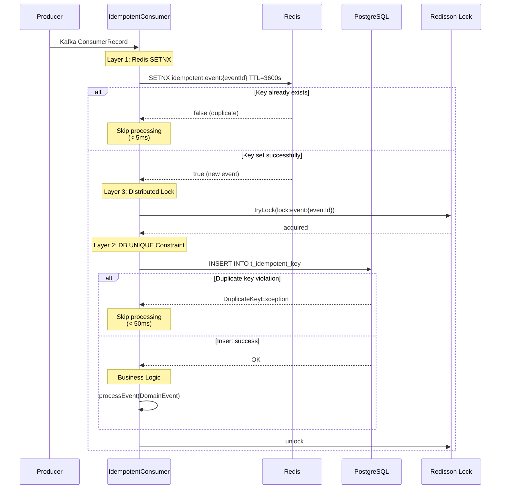
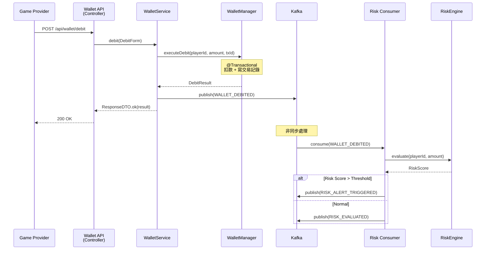
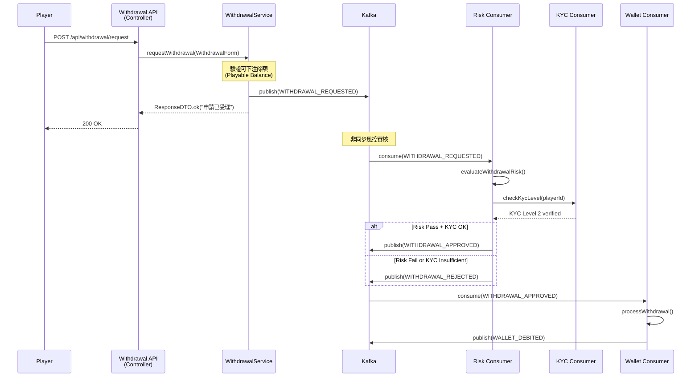
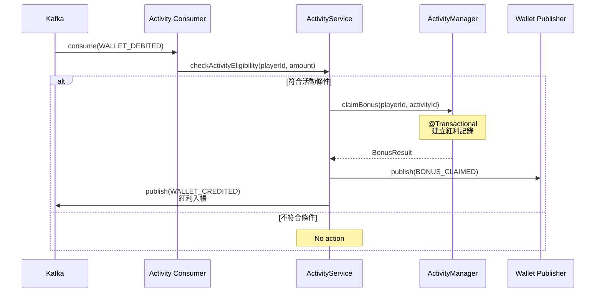
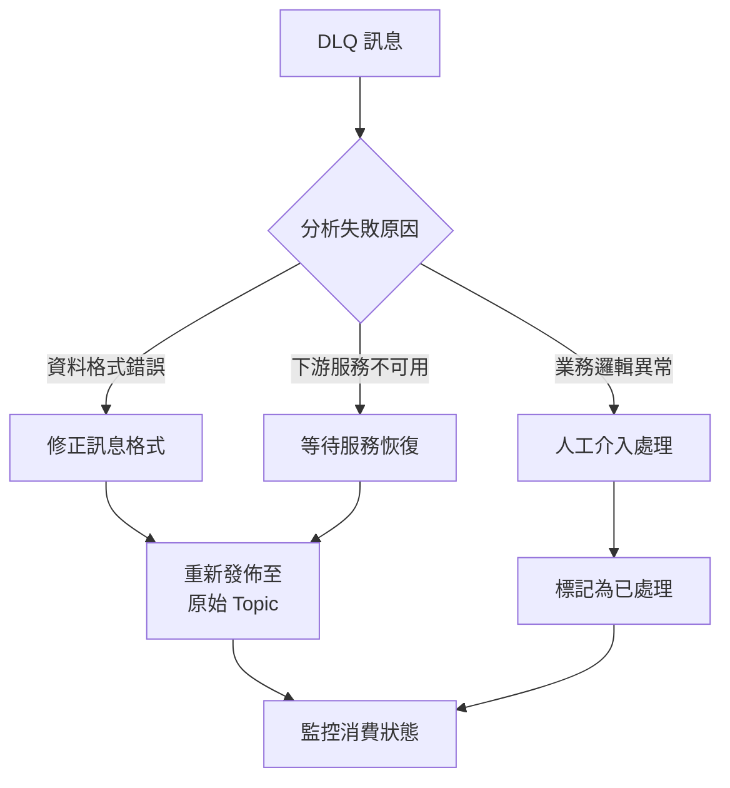
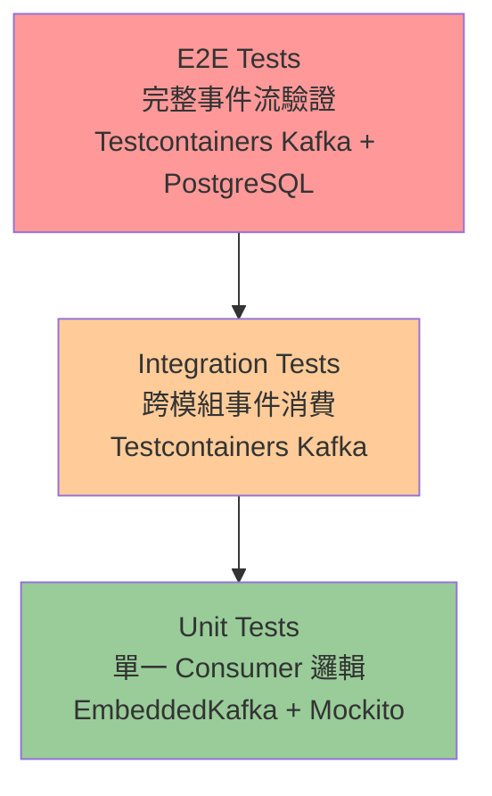

# 事件驅動架構設計（Event-Driven Architecture Design）

| 屬性 | 值 |
|------|-----|
| **文件編號** | IMPL-000 |
| **版本** | 1.0.0 |
| **狀態** | Draft |
| **建立日期** | 2026-02-14 |
| **最後更新** | 2026-02-14 |
| **作者** | iGaming 技術團隊 |
| **相關 ADR** | [ADR-015 冪等策略三層防禦標準](../architecture/adr/ADR-015_Idempotency_Three_Layer_Defense.md) |
| **基礎設施** | `smartadmin-common-mq`（Spring Kafka） |

---

## 目錄

1. [設計目標](#1-設計目標)
2. [核心組件設計](#2-核心組件設計)
3. [Kafka Topic 規劃](#3-kafka-topic-規劃)
4. [事件類型目錄](#4-事件類型目錄)
5. [冪等性三層防禦](#5-冪等性三層防禦)
6. [事件流程範例](#6-事件流程範例)
7. [錯誤處理](#7-錯誤處理)
8. [application.yml 配置](#8-applicationyml-配置)
9. [測試策略](#9-測試策略)

---

## 1. 設計目標

iGaming 平台採用事件驅動架構 (Event-Driven Architecture, EDA) 作為各限界上下文 (Bounded Context) 之間的核心通訊機制。以下為四項設計目標：

### 1.1 限界上下文鬆耦合

錢包 (Wallet)、風控 (Risk)、活動 (Activity)、玩家 (Player) 等模組透過事件進行非同步通訊，避免直接的 Service 間呼叫。各模組可獨立部署、獨立演進。

```
Wallet Context ──事件──▶ Risk Context
                         │
                         ▼
                    Activity Context
```

### 1.2 完整審計軌跡（Audit Trail）

所有領域事件 (DomainEvent) 持久化至 Kafka，保留完整的業務操作歷史。金融類事件保留 90 天以上，審計事件永久保留，滿足監管合規需求。

### 1.3 非同步處理（Async Processing）

風控評估 (Risk Scoring) 不阻塞錢包扣款操作；活動獎勵發放不阻塞投注結算。關鍵路徑保持低延遲（< 200ms），非關鍵路徑透過事件非同步處理。

### 1.4 微服務萃取準備（Microservice Extraction Readiness）

目前作為模組化單體 (Modular Monolith) 運行，但事件驅動的設計使得未來可無痛將任一限界上下文萃取為獨立微服務，僅需將 In-Process Event Bus 替換為 Kafka Topic。

---

## 2. 核心組件設計

以下組件基於 `smartadmin-common-mq` 模組中已有的 `KafkaProducerService`、`AbstractKafkaListener` 等基礎設施進行擴展。

### 2.1 DomainEvent — 領域事件基類

所有 iGaming 領域事件的基底類別，包含標準化的事件後設資料。

```java
package net.lab1024.sa.common.mq.kafka.event;

import com.fasterxml.jackson.databind.JsonNode;
import java.time.Instant;
import java.util.UUID;
import lombok.AllArgsConstructor;
import lombok.Builder;
import lombok.Data;
import lombok.NoArgsConstructor;

/**
 * Domain event base class for iGaming platform
 *
 * <p>All business events must extend or use this class.
 * Events are immutable after creation.
 *
 * @author iGaming Team
 * @since 2026-02-14
 */
@Data
@Builder
@NoArgsConstructor
@AllArgsConstructor
public class DomainEvent {

    /** Unique event identifier (UUID v4) */
    @Builder.Default
    private String eventId = UUID.randomUUID().toString();

    /** Event type (e.g., WALLET_DEBITED, PLAYER_REGISTERED) */
    private String eventType;

    /** Tenant identifier for multi-tenant isolation */
    private Long tenantId;

    /** Aggregate type (e.g., Wallet, Player, Risk) */
    private String aggregateType;

    /** Aggregate identifier (e.g., playerId, walletId) */
    private String aggregateId;

    /** Event payload as JSON */
    private JsonNode payload;

    /** Distributed trace identifier (from MDC) */
    private String traceId;

    /** Event timestamp (UTC) */
    @Builder.Default
    private Instant timestamp = Instant.now();

    /** Event schema version for backward compatibility */
    @Builder.Default
    private Integer version = 1;
}
```

### 2.2 DomainEventPublisher — 統一事件發佈器

封裝 `KafkaProducerService`，自動填充租戶 ID (Tenant ID) 與追蹤 ID (Trace ID)。

```java
package net.lab1024.sa.common.mq.kafka.event;

import lombok.RequiredArgsConstructor;
import lombok.extern.slf4j.Slf4j;
import net.lab1024.sa.common.json.util.JsonUtil;
import net.lab1024.sa.common.mq.kafka.core.KafkaProducerService;
import org.slf4j.MDC;
import org.springframework.stereotype.Component;

import java.util.concurrent.CompletableFuture;
import org.springframework.kafka.support.SendResult;

/**
 * Unified domain event publisher
 *
 * <p>Auto-populates tenantId from TenantContextHolder and traceId from MDC.
 * Uses KafkaProducerService for reliable message delivery.
 *
 * @author iGaming Team
 * @since 2026-02-14
 */
@Slf4j
@Component
@RequiredArgsConstructor
public class DomainEventPublisher {

    private static final String TRACE_ID_KEY = "traceId";

    private final KafkaProducerService kafkaProducerService;

    /**
     * Publish a domain event asynchronously
     *
     * @param topic   Kafka topic name
     * @param event   domain event to publish
     * @return CompletableFuture of send result
     */
    public CompletableFuture<SendResult<String, String>> publish(
            String topic, DomainEvent event) {

        // Auto-populate traceId from MDC
        if (event.getTraceId() == null) {
            event.setTraceId(MDC.get(TRACE_ID_KEY));
        }

        // Auto-populate tenantId from TenantContextHolder
        if (event.getTenantId() == null) {
            event.setTenantId(TenantContextHolder.getTenantId());
        }

        String message = JsonUtil.toJson(event);
        String key = event.getAggregateId();

        log.info("Publishing domain event: topic={}, eventType={}, eventId={}, aggregateId={}",
                topic, event.getEventType(), event.getEventId(), key);

        return kafkaProducerService.sendAsync(topic, key, message)
                .whenComplete((result, ex) -> {
                    if (ex != null) {
                        log.error("Failed to publish domain event: eventId={}, eventType={}, error={}",
                                event.getEventId(), event.getEventType(), ex.getMessage(), ex);
                    } else {
                        log.debug("Domain event published: eventId={}, partition={}, offset={}",
                                event.getEventId(),
                                result.getRecordMetadata().partition(),
                                result.getRecordMetadata().offset());
                    }
                });
    }

    /**
     * Publish a domain event synchronously (for critical financial operations)
     *
     * @param topic   Kafka topic name
     * @param event   domain event to publish
     * @return true if published successfully
     */
    public boolean publishSync(String topic, DomainEvent event) {
        if (event.getTraceId() == null) {
            event.setTraceId(MDC.get(TRACE_ID_KEY));
        }
        if (event.getTenantId() == null) {
            event.setTenantId(TenantContextHolder.getTenantId());
        }

        String message = JsonUtil.toJson(event);
        String key = event.getAggregateId();

        return kafkaProducerService.sendSync(topic, key, message).isDefined();
    }
}
```

### 2.3 EventEnvelope — Kafka 訊息封套

包含 Kafka Header 資訊與事件酬載 (Payload)，用於消費端反序列化。

```java
package net.lab1024.sa.common.mq.kafka.event;

import lombok.AllArgsConstructor;
import lombok.Builder;
import lombok.Data;
import lombok.NoArgsConstructor;

import java.util.Map;

/**
 * Kafka message envelope wrapping headers and payload
 *
 * @author iGaming Team
 * @since 2026-02-14
 */
@Data
@Builder
@NoArgsConstructor
@AllArgsConstructor
public class EventEnvelope {

    /** Kafka headers (eventType, tenantId, traceId, version) */
    private Map<String, String> headers;

    /** Serialized DomainEvent JSON payload */
    private String payload;

    /** Source topic */
    private String topic;

    /** Partition number */
    private Integer partition;

    /** Message offset */
    private Long offset;

    /** Message key (aggregateId) */
    private String key;
}
```

### 2.4 IdempotentConsumer — 冪等消費者基類

實作 ADR-015 三層防禦，確保事件消費的冪等性。

```java
package net.lab1024.sa.common.mq.kafka.event;

import lombok.extern.slf4j.Slf4j;
import net.lab1024.sa.common.json.util.JsonUtil;
import net.lab1024.sa.common.mq.kafka.listener.AbstractKafkaListener;
import org.apache.kafka.clients.consumer.ConsumerRecord;
import org.redisson.api.RLock;
import org.redisson.api.RedissonClient;
import org.springframework.dao.DuplicateKeyException;
import org.springframework.data.redis.core.StringRedisTemplate;
import org.springframework.jdbc.core.JdbcTemplate;

import java.time.Duration;
import java.util.concurrent.TimeUnit;

/**
 * Idempotent consumer base class implementing ADR-015 three-layer defense
 *
 * <p>Layer 1: Redis SETNX (fast duplicate check, < 5ms)
 * <p>Layer 2: DB t_idempotent_key UNIQUE constraint (< 50ms)
 * <p>Layer 3: Redisson distributed lock (concurrent protection)
 *
 * @param <T> message type
 * @author iGaming Team
 * @since 2026-02-14
 * @see <a href="../architecture/adr/ADR-015_Idempotency_Three_Layer_Defense.md">ADR-015</a>
 */
@Slf4j
public abstract class IdempotentConsumer<T> extends AbstractKafkaListener<T> {

    private static final String IDEMPOTENT_KEY_PREFIX = "idempotent:event:";
    private static final Duration IDEMPOTENT_TTL = Duration.ofHours(1);
    private static final long LOCK_WAIT_SECONDS = 5;
    private static final long LOCK_LEASE_SECONDS = 30;

    private final StringRedisTemplate redisTemplate;
    private final JdbcTemplate jdbcTemplate;
    private final RedissonClient redissonClient;

    protected IdempotentConsumer(
            StringRedisTemplate redisTemplate,
            JdbcTemplate jdbcTemplate,
            RedissonClient redissonClient) {
        this.redisTemplate = redisTemplate;
        this.jdbcTemplate = jdbcTemplate;
        this.redissonClient = redissonClient;
    }

    @Override
    protected void doHandle(ConsumerRecord<String, String> record) {
        DomainEvent event = JsonUtil.fromJson(record.value(), DomainEvent.class);
        String eventId = event.getEventId();

        // === Layer 1: Redis SETNX fast duplicate check ===
        String redisKey = IDEMPOTENT_KEY_PREFIX + eventId;
        Boolean isNew = redisTemplate.opsForValue()
                .setIfAbsent(redisKey, "1", IDEMPOTENT_TTL);

        if (Boolean.FALSE.equals(isNew)) {
            log.info("Event duplicate detected at Layer 1 (Redis): eventId={}", eventId);
            return;
        }

        // === Layer 3: Distributed lock for concurrent protection ===
        String lockKey = "lock:event:" + eventId;
        RLock lock = redissonClient.getLock(lockKey);

        try {
            boolean acquired = lock.tryLock(LOCK_WAIT_SECONDS, LOCK_LEASE_SECONDS, TimeUnit.SECONDS);
            if (!acquired) {
                log.warn("Failed to acquire lock for event: eventId={}", eventId);
                // Remove Redis key so retry can re-attempt
                redisTemplate.delete(redisKey);
                return;
            }

            try {
                // === Layer 2: DB UNIQUE constraint as final safety net ===
                insertIdempotentKey(eventId, event.getEventType());

                // Delegate to subclass business logic
                processEvent(event);

                log.debug("Event processed successfully: eventId={}, eventType={}",
                        eventId, event.getEventType());

            } catch (DuplicateKeyException e) {
                log.info("Event duplicate detected at Layer 2 (DB): eventId={}", eventId);
            }
        } catch (InterruptedException e) {
            Thread.currentThread().interrupt();
            log.error("Lock acquisition interrupted: eventId={}", eventId, e);
            redisTemplate.delete(redisKey);
        } finally {
            if (lock.isHeldByCurrentThread()) {
                lock.unlock();
            }
        }
    }

    /**
     * Insert idempotent key into database
     *
     * @param eventId   unique event identifier
     * @param eventType event type for auditing
     */
    private void insertIdempotentKey(String eventId, String eventType) {
        jdbcTemplate.update(
                "INSERT INTO t_idempotent_key (event_id, event_type, created_at) VALUES (?, ?, NOW())",
                eventId, eventType);
    }

    /**
     * Process the domain event (subclass implementation)
     *
     * @param event the domain event to process
     */
    protected abstract void processEvent(DomainEvent event);
}
```

### 2.5 DomainEventListener — 含租戶上下文傳播的事件監聽器基類

自動從事件中提取 Tenant ID 並設定至 `TenantContextHolder`，確保多租戶隔離。

```java
package net.lab1024.sa.common.mq.kafka.event;

import lombok.extern.slf4j.Slf4j;
import net.lab1024.sa.common.json.util.JsonUtil;
import net.lab1024.sa.common.mq.kafka.listener.AbstractKafkaListener;
import org.apache.kafka.clients.consumer.ConsumerRecord;
import org.slf4j.MDC;

/**
 * Base event listener with tenant context propagation
 *
 * <p>Automatically extracts tenantId from DomainEvent and sets TenantContextHolder.
 * Ensures multi-tenant data isolation during event processing.
 *
 * @param <T> message type
 * @author iGaming Team
 * @since 2026-02-14
 */
@Slf4j
public abstract class DomainEventListener<T> extends AbstractKafkaListener<T> {

    @Override
    protected void doHandle(ConsumerRecord<String, String> record) {
        DomainEvent event = JsonUtil.fromJson(record.value(), DomainEvent.class);

        // Propagate tenant context
        Long tenantId = event.getTenantId();
        if (tenantId != null) {
            TenantContextHolder.setTenantId(tenantId);
        }

        // Propagate trace context
        String traceId = event.getTraceId();
        if (traceId != null) {
            MDC.put("traceId", traceId);
        }

        try {
            log.debug("Processing event: eventType={}, eventId={}, tenantId={}",
                    event.getEventType(), event.getEventId(), tenantId);

            onEvent(event);
        } finally {
            // Clean up context to prevent leakage between messages
            TenantContextHolder.clear();
            MDC.remove("traceId");
        }
    }

    /**
     * Handle the domain event (subclass implementation)
     *
     * @param event the domain event to handle
     */
    protected abstract void onEvent(DomainEvent event);
}
```

---

## 3. Kafka Topic 規劃

所有 Topic 名稱以 `igaming.` 為前綴，遵循 `igaming.{context}.events` 命名規範。

| Topic | Partitions | Retention | Key | 用途 |
|-------|-----------|-----------|-----|------|
| `igaming.wallet.events` | 6 | 7 天 | playerId | 投注扣款、派彩入帳、提款申請、錢包回滾 |
| `igaming.player.events` | 3 | 30 天 | playerId | 玩家註冊、身份驗證 (KYC) 升級、狀態變更 |
| `igaming.risk.events` | 6 | 90 天 | playerId | 風控評估結果、風險警報觸發 |
| `igaming.game.events` | 3 | 7 天 | gameProviderId | 遊戲對帳 (Reconciliation)、遊戲回合結算 |
| `igaming.activity.events` | 3 | 30 天 | playerId | 紅利認領 (Bonus Claim)、紅利過期、活動觸發 |
| `igaming.audit.events` | 3 | unlimited | operatorId | 操作審計、後台管理操作紀錄 |

### Topic 常量定義

```java
package net.lab1024.sa.common.mq.kafka.constant;

/**
 * iGaming Kafka topic and consumer group constants
 *
 * @author iGaming Team
 * @since 2026-02-14
 */
public final class IgamingKafkaConst {

    private IgamingKafkaConst() {}

    /** Topic constants */
    public static final class Topic {
        public static final String WALLET_EVENTS = "igaming.wallet.events";
        public static final String PLAYER_EVENTS = "igaming.player.events";
        public static final String RISK_EVENTS = "igaming.risk.events";
        public static final String GAME_EVENTS = "igaming.game.events";
        public static final String ACTIVITY_EVENTS = "igaming.activity.events";
        public static final String AUDIT_EVENTS = "igaming.audit.events";

        private Topic() {}
    }

    /** Consumer group constants */
    public static final class Group {
        public static final String WALLET = "igaming-wallet-group";
        public static final String RISK = "igaming-risk-group";
        public static final String ACTIVITY = "igaming-activity-group";
        public static final String AUDIT = "igaming-audit-group";
        public static final String RECONCILIATION = "igaming-reconciliation-group";
        public static final String ANALYTICS = "igaming-analytics-group";

        private Group() {}
    }
}
```

### Partition Key 設計原則

- **playerId 作為 Key**：同一玩家的所有事件路由至同一 Partition，保證該玩家事件的消費順序
- **gameProviderId 作為 Key**：同一遊戲供應商的對帳事件集中處理，確保對帳的一致性
- **operatorId 作為 Key**：審計事件按操作者分組，便於追蹤特定管理員的操作歷史

---

## 4. 事件類型目錄

### 4.1 錢包事件（Wallet Events）

| 事件類型 | 說明 | 觸發場景 |
|---------|------|---------|
| `WALLET_DEBITED` | 錢包扣款完成 | 投注扣款、提款扣款 |
| `WALLET_CREDITED` | 錢包入帳完成 | 派彩入帳 (Payout)、存款到帳 |
| `WALLET_ROLLBACK` | 錢包回滾 | 遊戲回合取消、交易逾時補償 |
| `WITHDRAWAL_REQUESTED` | 提款申請建立 | 玩家發起提款 |
| `WITHDRAWAL_APPROVED` | 提款審核通過 | 風控審核 + 人工審核通過 |
| `WITHDRAWAL_REJECTED` | 提款被拒絕 | 風控攔截或人工拒絕 |
| `DEPOSIT_COMPLETED` | 存款完成 | 支付閘道回調確認 |

### 4.2 玩家事件（Player Events）

| 事件類型 | 說明 | 觸發場景 |
|---------|------|---------|
| `PLAYER_REGISTERED` | 玩家註冊完成 | 新玩家完成註冊流程 |
| `KYC_UPGRADED` | 身份驗證 (KYC) 等級提升 | 通過 KYC Level 1/2/3 驗證 |
| `PLAYER_SUSPENDED` | 玩家帳戶停權 | 風控觸發或管理員操作 |
| `PLAYER_REACTIVATED` | 玩家帳戶恢復 | 管理員手動解除停權 |
| `SELF_EXCLUSION_SET` | 自我排除 (Self-Exclusion) 啟用 | 玩家主動設定自我排除 |
| `PLAYER_VIP_UPGRADED` | VIP 等級提升 | 達到 VIP 升級條件 |

### 4.3 風控事件（Risk Events）

| 事件類型 | 說明 | 觸發場景 |
|---------|------|---------|
| `RISK_EVALUATED` | 風控評估完成 | 交易觸發風控引擎評估 |
| `RISK_ALERT_TRIGGERED` | 風險警報觸發 | 檢測到異常投注模式 |
| `RISK_ALERT_RESOLVED` | 風險警報解除 | 人工審核確認誤報 |
| `AML_CHECK_COMPLETED` | 反洗錢 (AML) 檢查完成 | 大額交易觸發 AML 檢查 |

### 4.4 遊戲事件（Game Events）

| 事件類型 | 說明 | 觸發場景 |
|---------|------|---------|
| `GAME_ROUND_SETTLED` | 遊戲回合結算 | 遊戲供應商回調結算結果 |
| `GAME_ROUND_CANCELLED` | 遊戲回合取消 | 遊戲供應商發起回合取消 |
| `RECONCILIATION_COMPLETED` | 對帳完成 | 每日遊戲對帳 (Reconciliation) 完成 |
| `RECONCILIATION_DISCREPANCY` | 對帳差異 | 發現對帳差異需人工介入 |

### 4.5 活動事件（Activity Events）

| 事件類型 | 說明 | 觸發場景 |
|---------|------|---------|
| `BONUS_CLAIMED` | 紅利認領 (Bonus Claim) | 玩家領取紅利 |
| `BONUS_EXPIRED` | 紅利過期 | 紅利超過有效期限 |
| `BONUS_WAGERING_MET` | 紅利流水達標 | 有效投注額 (Valid Turnover) 達到要求 |
| `PROMOTION_TRIGGERED` | 活動觸發 | 玩家行為觸發活動條件 |

---

## 5. 冪等性三層防禦

依據 [ADR-015 冪等策略三層防禦標準](../architecture/adr/ADR-015_Idempotency_Three_Layer_Defense.md) 實作。

### 5.1 三層架構流程



### 5.2 冪等表 DDL

```sql
CREATE TABLE t_idempotent_key (
    id              BIGSERIAL       PRIMARY KEY,
    event_id        VARCHAR(64)     NOT NULL,
    event_type      VARCHAR(128)    NOT NULL,
    created_at      TIMESTAMP       NOT NULL DEFAULT NOW(),
    CONSTRAINT uk_event_id UNIQUE (event_id)
);

COMMENT ON TABLE t_idempotent_key IS '冪等鍵值表 — 事件消費去重';
COMMENT ON COLUMN t_idempotent_key.event_id IS '事件唯一識別碼 (UUID)';
COMMENT ON COLUMN t_idempotent_key.event_type IS '事件類型（用於審計追蹤）';
COMMENT ON COLUMN t_idempotent_key.created_at IS '建立時間';

-- Index for cleanup job (remove records older than 7 days)
CREATE INDEX idx_idempotent_key_created_at ON t_idempotent_key (created_at);
```

### 5.3 三層防禦特性對照

| 層 | 機制 | 延遲 | 位置 | TTL | 失效影響 |
|---|------|-----|------|-----|---------|
| 第 1 層 | Redis SETNX | < 5ms | Service 層 | 1 小時 | 降級至第 2 層，延遲增加 |
| 第 2 層 | DB UNIQUE 約束 | < 50ms | Manager 層 | 永久 | 資料庫異常需人工介入 |
| 第 3 層 | Redisson 分佈式鎖 | < 100ms | Manager 層 | 30s lease | 並行請求可能短暫等待 |

---

## 6. 事件流程範例

### 6.1 投注事件流（Bet Flow）

遊戲供應商 (Game Provider) 發起投注請求，錢包扣款後非同步觸發風控評估。



### 6.2 提款事件流（Withdrawal Flow）

玩家發起提款申請，經過風控審核與 KYC 驗證後處理。



### 6.3 活動觸發流（Activity Trigger Flow）

投注結算後自動檢查活動條件，觸發紅利發放。



---

## 7. 錯誤處理

### 7.1 DLQ 處理策略

SmartAdmin 已在 `KafkaAutoConfiguration` 中配置了 `DefaultErrorHandler` + `DeadLetterPublishingRecoverer`，事件驅動架構直接沿用此基礎設施。

```
Original Topic ──重試 3 次失敗──▶ {topic}.dlq ──人工處理──▶ 重新發佈至 Original Topic
```

**DLQ Topic 命名規則**：原始 Topic 名稱 + `.dlq` 後綴
- `igaming.wallet.events` → `igaming.wallet.events.dlq`
- `igaming.risk.events` → `igaming.risk.events.dlq`

### 7.2 重試策略（Exponential Backoff）

沿用 `smartadmin-common-mq` 已有的指數退避配置：

| 參數 | 值 | 說明 |
|------|-----|------|
| `maxAttempts` | 3 | 最大重試次數 |
| `initialInterval` | 1000ms | 初始重試間隔 |
| `maxInterval` | 10000ms | 最大重試間隔 |
| `multiplier` | 2.0 | 退避乘數 |

重試時序：`1s → 2s → 4s → DLQ`

### 7.3 不可重試異常

以下異常類型直接進入 DLQ，不進行重試（已在 `KafkaAutoConfiguration` 中配置）：

- `IllegalArgumentException` — 訊息格式錯誤
- `NullPointerException` — 必要欄位缺失

### 7.4 DLQ 人工處理流程



### 7.5 監控告警

| 指標 | 告警閾值 | 通知管道 |
|------|---------|---------|
| Consumer Lag | > 10,000 messages | Slack + PagerDuty |
| DLQ 訊息數量 | > 0 (即時告警) | Slack + Email |
| 事件處理延遲 P99 | > 5s | Prometheus Alert |
| Consumer Group 重平衡 | 任何重平衡事件 | Slack |

---

## 8. application.yml 配置

以下為 iGaming 事件驅動架構的額外 Kafka 配置，追加至現有 `smart.kafka` 配置區段。

```yaml
# ===== iGaming Event-Driven Architecture Configuration =====
smart:
  kafka:
    enabled: true
    bootstrap-servers: localhost:9094

    producer:
      acks: all
      retries: 3
      enable-idempotence: true
      max-in-flight-requests-per-connection: 1
      batch-size: 16384
      buffer-memory: 33554432
      linger-ms: 5

    consumer:
      group-id: igaming-dev
      enable-auto-commit: false
      auto-offset-reset: earliest
      max-poll-records: 500
      max-poll-interval-ms: 300000
      session-timeout-ms: 45000
      heartbeat-interval-ms: 3000

    listener:
      ack-mode: MANUAL_IMMEDIATE
      concurrency: 3

    dead-letter-queue:
      enabled: true
      topic-suffix: .dlq
      retry:
        max-attempts: 3
        initial-interval: 1000
        max-interval: 10000
        multiplier: 2.0

    batch:
      enabled: false

# ===== iGaming Topic-Level Configuration (Kafka AdminClient) =====
# These settings are for Kafka topic creation scripts, not Spring Boot properties.
# Use kafka-topics.sh or Terraform to apply these configurations.
#
# igaming.wallet.events:
#   partitions: 6
#   replication-factor: 3
#   retention.ms: 604800000      # 7 days
#   cleanup.policy: delete
#
# igaming.player.events:
#   partitions: 3
#   replication-factor: 3
#   retention.ms: 2592000000     # 30 days
#   cleanup.policy: delete
#
# igaming.risk.events:
#   partitions: 6
#   replication-factor: 3
#   retention.ms: 7776000000     # 90 days
#   cleanup.policy: delete
#
# igaming.game.events:
#   partitions: 3
#   replication-factor: 3
#   retention.ms: 604800000      # 7 days
#   cleanup.policy: delete
#
# igaming.activity.events:
#   partitions: 3
#   replication-factor: 3
#   retention.ms: 2592000000     # 30 days
#   cleanup.policy: delete
#
# igaming.audit.events:
#   partitions: 3
#   replication-factor: 3
#   retention.ms: -1             # unlimited
#   cleanup.policy: delete
```

### Topic 建立腳本

```bash
#!/bin/bash
# scripts/create-igaming-topics.sh

BOOTSTRAP_SERVER="localhost:9094"
REPLICATION_FACTOR=3

declare -A TOPICS
TOPICS["igaming.wallet.events"]="6:604800000"
TOPICS["igaming.player.events"]="3:2592000000"
TOPICS["igaming.risk.events"]="6:7776000000"
TOPICS["igaming.game.events"]="3:604800000"
TOPICS["igaming.activity.events"]="3:2592000000"
TOPICS["igaming.audit.events"]="3:-1"

for TOPIC in "${!TOPICS[@]}"; do
  IFS=':' read -r PARTITIONS RETENTION <<< "${TOPICS[$TOPIC]}"

  kafka-topics.sh --create \
    --bootstrap-server "$BOOTSTRAP_SERVER" \
    --topic "$TOPIC" \
    --partitions "$PARTITIONS" \
    --replication-factor "$REPLICATION_FACTOR" \
    --config retention.ms="$RETENTION" \
    --if-not-exists

  echo "Created topic: $TOPIC (partitions=$PARTITIONS, retention=$RETENTION)"
done
```

---

## 9. 測試策略

### 9.1 單元測試 — EmbeddedKafka

使用 Spring Kafka 的 `@EmbeddedKafka` 進行單元測試，無需外部 Kafka 叢集。

```java
package net.lab1024.sa.app.event;

import net.lab1024.sa.common.mq.kafka.constant.IgamingKafkaConst;
import net.lab1024.sa.common.mq.kafka.event.DomainEvent;
import net.lab1024.sa.common.mq.kafka.event.DomainEventPublisher;
import net.lab1024.sa.common.json.util.JsonUtil;
import org.apache.kafka.clients.consumer.ConsumerRecord;
import org.junit.jupiter.api.Test;
import org.springframework.beans.factory.annotation.Autowired;
import org.springframework.boot.test.context.SpringBootTest;
import org.springframework.kafka.annotation.KafkaListener;
import org.springframework.kafka.test.context.EmbeddedKafka;
import org.springframework.test.annotation.DirtiesContext;

import java.util.concurrent.CountDownLatch;
import java.util.concurrent.TimeUnit;

import static org.assertj.core.api.Assertions.assertThat;

@SpringBootTest
@EmbeddedKafka(
    partitions = 1,
    topics = {IgamingKafkaConst.Topic.WALLET_EVENTS},
    brokerProperties = {"listeners=PLAINTEXT://localhost:9094"}
)
@DirtiesContext
class DomainEventPublisherTest {

    @Autowired
    private DomainEventPublisher publisher;

    private final CountDownLatch latch = new CountDownLatch(1);
    private DomainEvent receivedEvent;

    @KafkaListener(
        topics = IgamingKafkaConst.Topic.WALLET_EVENTS,
        groupId = "test-group"
    )
    void onMessage(ConsumerRecord<String, String> record) {
        receivedEvent = JsonUtil.fromJson(record.value(), DomainEvent.class);
        latch.countDown();
    }

    @Test
    void should_publish_and_consume_wallet_event() throws InterruptedException {
        // Given
        DomainEvent event = DomainEvent.builder()
                .eventType("WALLET_DEBITED")
                .tenantId(1001L)
                .aggregateType("Wallet")
                .aggregateId("player-12345")
                .build();

        // When
        publisher.publish(IgamingKafkaConst.Topic.WALLET_EVENTS, event);

        // Then
        boolean consumed = latch.await(10, TimeUnit.SECONDS);
        assertThat(consumed).isTrue();
        assertThat(receivedEvent.getEventType()).isEqualTo("WALLET_DEBITED");
        assertThat(receivedEvent.getTenantId()).isEqualTo(1001L);
        assertThat(receivedEvent.getAggregateId()).isEqualTo("player-12345");
    }
}
```

### 9.2 整合測試 — Testcontainers Kafka

使用 Testcontainers 啟動真實的 Kafka 容器進行整合測試，驗證完整的事件流。

```java
package net.lab1024.sa.app.event;

import net.lab1024.sa.common.mq.kafka.constant.IgamingKafkaConst;
import net.lab1024.sa.common.mq.kafka.event.DomainEvent;
import net.lab1024.sa.common.mq.kafka.event.DomainEventPublisher;
import org.junit.jupiter.api.Test;
import org.springframework.beans.factory.annotation.Autowired;
import org.springframework.boot.test.context.SpringBootTest;
import org.springframework.test.context.DynamicPropertyRegistry;
import org.springframework.test.context.DynamicPropertySource;
import org.testcontainers.kafka.KafkaContainer;
import org.testcontainers.junit.jupiter.Container;
import org.testcontainers.junit.jupiter.Testcontainers;

import static org.assertj.core.api.Assertions.assertThat;

@SpringBootTest
@Testcontainers
class DomainEventIntegrationTest {

    @Container
    static KafkaContainer kafka = new KafkaContainer("apache/kafka:3.8.1");

    @DynamicPropertySource
    static void kafkaProperties(DynamicPropertyRegistry registry) {
        registry.add("smart.kafka.enabled", () -> "true");
        registry.add("smart.kafka.bootstrap-servers", kafka::getBootstrapServers);
    }

    @Autowired
    private DomainEventPublisher publisher;

    @Test
    void should_publish_event_to_real_kafka() {
        // Given
        DomainEvent event = DomainEvent.builder()
                .eventType("PLAYER_REGISTERED")
                .tenantId(2001L)
                .aggregateType("Player")
                .aggregateId("player-67890")
                .build();

        // When
        boolean success = publisher.publishSync(
                IgamingKafkaConst.Topic.PLAYER_EVENTS, event);

        // Then
        assertThat(success).isTrue();
    }
}
```

### 9.3 事件重播測試（Event Replay Testing）

驗證 Consumer 在重播歷史事件時的冪等性行為。

```java
@Test
void should_handle_duplicate_events_idempotently() throws InterruptedException {
    // Given - same event sent twice
    DomainEvent event = DomainEvent.builder()
            .eventId("fixed-uuid-for-test")
            .eventType("WALLET_DEBITED")
            .tenantId(1001L)
            .aggregateType("Wallet")
            .aggregateId("player-12345")
            .build();

    // When - publish the same event twice
    publisher.publishSync(IgamingKafkaConst.Topic.WALLET_EVENTS, event);
    publisher.publishSync(IgamingKafkaConst.Topic.WALLET_EVENTS, event);

    // Then - business logic should execute only once
    // (verify via database state or mock verification)
    Thread.sleep(3000); // wait for async processing

    long processedCount = jdbcTemplate.queryForObject(
            "SELECT COUNT(*) FROM t_idempotent_key WHERE event_id = ?",
            Long.class, "fixed-uuid-for-test");
    assertThat(processedCount).isEqualTo(1);
}
```

### 9.4 測試金字塔



| 測試層級 | 工具 | 執行時間 | 覆蓋範圍 |
|---------|------|---------|---------|
| Unit Tests | EmbeddedKafka + Mockito | < 10s | 單一 Consumer 邏輯、事件序列化 |
| Integration Tests | Testcontainers Kafka | < 60s | 跨模組事件消費、冪等性驗證 |
| E2E Tests | Testcontainers Kafka + PostgreSQL | < 120s | 完整事件流（投注 → 風控 → 活動） |

---

## 附錄：與現有基礎設施的關係

本事件驅動架構設計完全建構於 `smartadmin-common-mq` 模組之上：

| 現有元件 | 本文擴展 |
|---------|---------|
| `KafkaProducerService` | 被 `DomainEventPublisher` 封裝使用 |
| `AbstractKafkaListener` | 被 `DomainEventListener`、`IdempotentConsumer` 繼承 |
| `KafkaAutoConfiguration` | 沿用 DLQ + Exponential Backoff 配置 |
| `KafkaProperties` | 沿用所有 Producer/Consumer/DLQ 配置 |
| `KafkaConst` | 新增 `IgamingKafkaConst` 用於 iGaming Topic |
| `DeadLetterService` | 直接沿用，無需修改 |

**模組路徑**：`smartadmin-common/smartadmin-common-mq/src/main/java/net/lab1024/sa/common/mq/kafka/`
