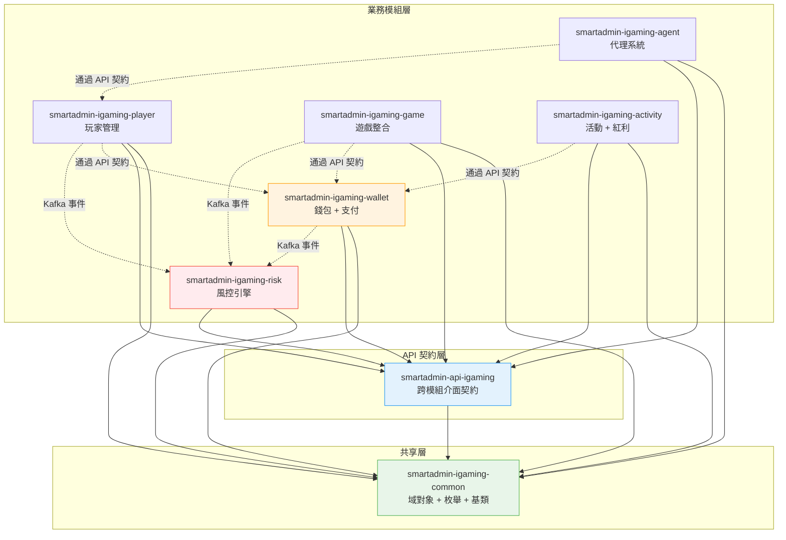
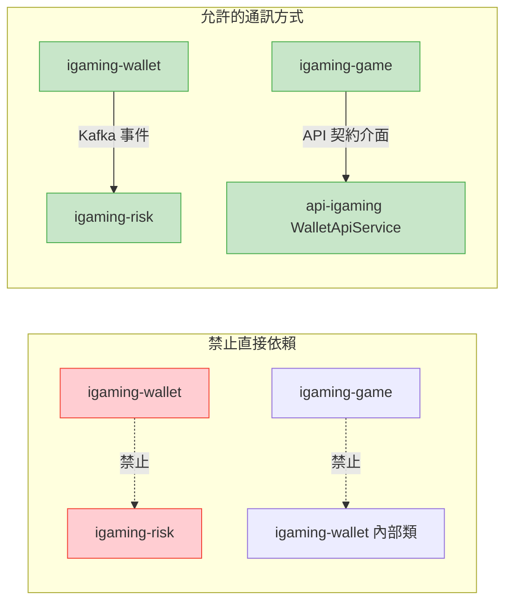
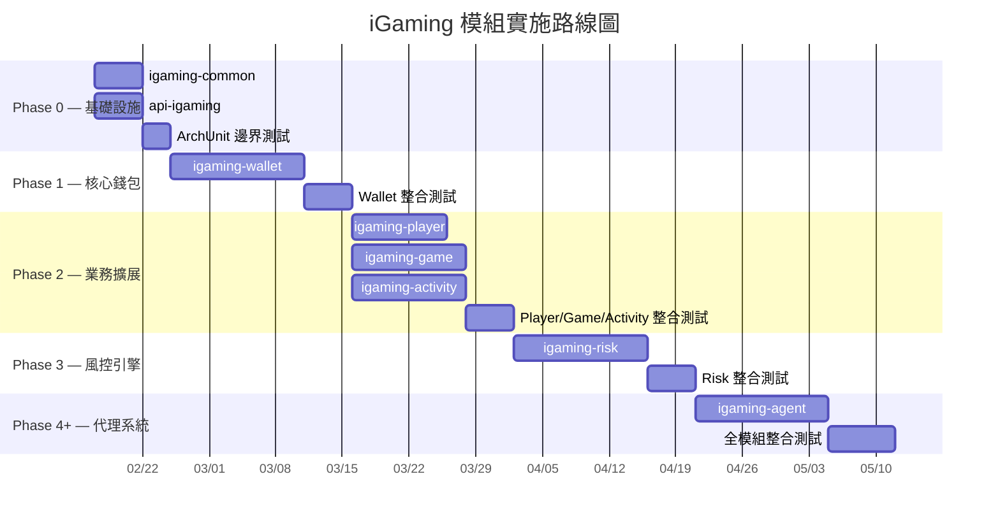
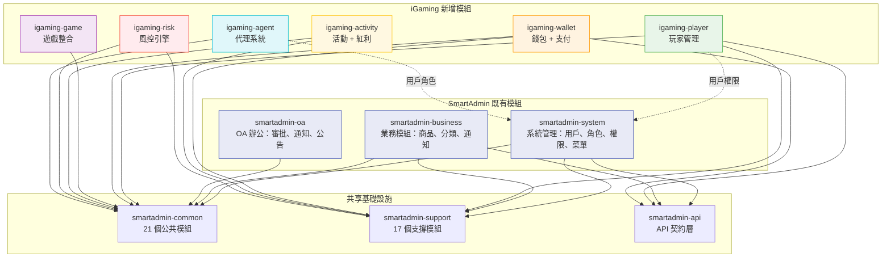

# iGaming 模組結構設計

> **Canonical Source**: Phase 0 基礎架構文檔
> **目標讀者（Audience）**: 架構師、後端開發人員、DevOps
> **最後同步（Last Synced）**: 2026-02-14
> **SmartAdmin 版本**: v4.1.0（47-module 模組化單體架構）
> **文檔狀態**: Draft

---

## 1. 概述（Overview）

本文檔定義 iGaming 基礎設施在 SmartAdmin v4.1.0 模組化單體架構 (Modular Monolith) 中的模組劃分、依賴關係、目錄結構及實施順序。

**設計原則**：
- **模組邊界清晰**：每個 iGaming 模組對應一個獨立的 Gradle 子專案
- **依賴單向流動**：模組間依賴嚴格遵循分層架構，禁止循環依賴
- **契約優先 (Contract First)**：跨模組調用必須通過 `smartadmin-api-igaming` 契約層
- **事件驅動解耦**：高風險模組間（如 Wallet 與 Risk）通過 Kafka 事件溝通
- **漸進式交付**：按 Phase 0-4+ 分階段實施，每階段可獨立驗證

---

## 2. 新增模組一覽（New Module Overview）

iGaming 擴展共新增 **8 個模組**，分為 3 層：共享層、業務模組層、API 契約層。

| # | 模組名稱 | 所屬層級 | 說明 | Phase |
|---|---------|---------|------|-------|
| 1 | `smartadmin-igaming-common` | 共享層 | 共享 iGaming 域對象：enums, constants, base entities, `TenantBaseEntity` | 0 |
| 2 | `smartadmin-api-igaming` | API 契約層 | 跨模組介面契約、共享 DTO、Service Interface | 0 |
| 3 | `smartadmin-igaming-wallet` | 業務模組層 | 錢包 (Seamless Wallet) + 支付閘道 (Payment Gateway) + 有效投注額 (Valid Turnover) 計算 | 1 |
| 4 | `smartadmin-igaming-player` | 業務模組層 | 玩家管理 (Player Management)：生命週期、身份驗證 (KYC)、VIP 等級 | 2 |
| 5 | `smartadmin-igaming-game` | 業務模組層 | 遊戲整合 (Game Integration)：GP Adapter、遊戲大廳 (Game Lobby)、對帳 (Reconciliation) | 2 |
| 6 | `smartadmin-igaming-activity` | 業務模組層 | 活動引擎 (Activity Engine)：紅利 (Bonus)、流水要求 (Wagering)、VIP 獎勵 | 2 |
| 7 | `smartadmin-igaming-risk` | 業務模組層 | 風控引擎 (Risk Engine)：LiteFlow 規則、Kafka Consumer、風險評分 | 3 |
| 8 | `smartadmin-igaming-agent` | 業務模組層 | 代理系統 (Agent System)：信用網路 (Credit Network)、佣金 (Commission)、層級結構 | 4+ |

### 2.1 各模組職責詳述

#### `smartadmin-igaming-common` — 共享 iGaming 域對象

**職責**：
- iGaming 通用枚舉（`PlayerStatus`, `TransactionType`, `GameCategory`, `RiskLevel` 等）
- 通用常量（`IgamingConstants`）
- 基礎實體（`TenantBaseEntity` — 含 `tenantId` 的 Multi-Tenant 基類）
- 通用工具類（金額精度處理、幣別轉換）

**不包含**：Controller, Service, Manager, Dao 層（純域對象模組）

#### `smartadmin-api-igaming` — API 契約層

**職責**：
- 跨模組 Service Interface 定義（如 `WalletApiService`, `PlayerApiService`）
- 共享 DTO / VO / Form 類
- 事件契約定義（Kafka Topic 名稱、事件 Payload 類）

**設計對齊**：與現有 `smartadmin-api-system`, `smartadmin-api-business`, `smartadmin-api-oa` 保持一致模式。

#### `smartadmin-igaming-wallet` — 錢包 + 支付

**職責**：
- 無縫錢包 (Seamless Wallet) API 實作
- 支付閘道 (Payment Gateway) 整合
- 有效投注額計算
- 交易記錄管理
- 對帳 (Reconciliation) 邏輯

#### `smartadmin-igaming-player` — 玩家管理

**職責**：
- 玩家生命週期管理（註冊、停用、自我排除 (Self-Exclusion)）
- 身份驗證流程（KYC, Know Your Customer）
- VIP 等級系統
- 玩家偏好設定

#### `smartadmin-igaming-game` — 遊戲整合

**職責**：
- 遊戲提供商 (Game Provider) Adapter 模式整合
- 遊戲大廳 (Game Lobby) 管理
- 遊戲回合 (Game Session) / 注單 (Bet Record) 處理
- GP 對帳 (Reconciliation) 報表

#### `smartadmin-igaming-activity` — 活動 + 紅利

**職責**：
- 紅利計算引擎 (Bonus Calculation Engine)
- 流水要求追蹤 (Wagering Progress Tracking)
- 活動規則配置（LiteFlow DSL）
- VIP 獎勵發放

#### `smartadmin-igaming-risk` — 風控引擎

**職責**：
- LiteFlow 風控規則執行
- Kafka 事件消費（交易、登入、異常行為）
- 風險評分 (Risk Scoring) 計算
- 反洗錢 (AML, Anti-Money Laundering) 檢測
- 玩家保護 (Player Protection) 機制

#### `smartadmin-igaming-agent` — 代理系統

**職責**：
- 信用網路架構 (Credit Network)
- 佣金計算 (Commission Calculation)
- 代理層級結構 (Agent Hierarchy)
- 下線管理 (Sub-agent Management)

---

## 3. 模組依賴關係圖（Module Dependency Graph）

### 3.1 iGaming 模組間依賴



### 3.2 與現有 SmartAdmin 模組的依賴

```mermaid
graph TD
    subgraph "SmartAdmin Common 層"
        CORE[smartadmin-common-core<br/>ResponseDTO, SmartBeanUtil]
        MYBATIS[smartadmin-common-mybatis<br/>SmartPageUtil, BaseMapper]
        REDIS[smartadmin-common-redis<br/>RedisService]
        LOCK[smartadmin-common-redis-lock<br/>分佈式鎖]
        CACHE[smartadmin-common-cache<br/>Cache 管理]
        MQ[smartadmin-common-mq<br/>Kafka 整合]
        SECURITY[smartadmin-common-security<br/>安全框架]
        MASKING[smartadmin-common-data-masking<br/>數據脫敏]
        ENCRYPT[smartadmin-common-api-encrypt<br/>API 加密]
        VALIDATION[smartadmin-common-validation<br/>參數校驗]
    end

    subgraph "SmartAdmin Support 層"
        LITEFLOW[smartadmin-support-liteflow<br/>LiteFlow 規則引擎]
        OPERATELOG[smartadmin-support-operatelog<br/>操作日誌]
        CONFIG[smartadmin-support-config<br/>系統配置]
        JOB[smartadmin-support-job<br/>排程任務]
    end

    subgraph "iGaming 模組"
        IG_COMMON[igaming-common]
        IG_WALLET[igaming-wallet]
        IG_PLAYER[igaming-player]
        IG_GAME[igaming-game]
        IG_ACTIVITY[igaming-activity]
        IG_RISK[igaming-risk]
        IG_AGENT[igaming-agent]
    end

    %% igaming-common 依賴
    IG_COMMON --> CORE
    IG_COMMON --> MYBATIS

    %% igaming-wallet 依賴
    IG_WALLET --> CORE
    IG_WALLET --> MYBATIS
    IG_WALLET --> REDIS
    IG_WALLET --> LOCK
    IG_WALLET --> MQ
    IG_WALLET --> OPERATELOG

    %% igaming-player 依賴
    IG_PLAYER --> CORE
    IG_PLAYER --> MYBATIS
    IG_PLAYER --> CACHE
    IG_PLAYER --> SECURITY
    IG_PLAYER --> MASKING

    %% igaming-game 依賴
    IG_GAME --> CORE
    IG_GAME --> MYBATIS
    IG_GAME --> REDIS
    IG_GAME --> MQ

    %% igaming-activity 依賴
    IG_ACTIVITY --> CORE
    IG_ACTIVITY --> MYBATIS
    IG_ACTIVITY --> LITEFLOW
    IG_ACTIVITY --> CACHE
    IG_ACTIVITY --> JOB

    %% igaming-risk 依賴
    IG_RISK --> CORE
    IG_RISK --> MYBATIS
    IG_RISK --> LITEFLOW
    IG_RISK --> MQ
    IG_RISK --> REDIS

    %% igaming-agent 依賴
    IG_AGENT --> CORE
    IG_AGENT --> MYBATIS
    IG_AGENT --> CACHE

    style IG_COMMON fill:#E8F5E9,stroke:#4CAF50
    style IG_WALLET fill:#FFF3E0,stroke:#FF9800
    style IG_RISK fill:#FFEBEE,stroke:#F44336
```



---

## 4. 每個模組的目錄結構（Module Directory Structure）

所有 iGaming 業務模組遵循 SmartAdmin 標準分層架構：

```
smartadmin-igaming-{module}/
└── src/
    └── main/
        └── java/
            └── net/lab1024/sa/igaming/{module}/
                ├── controller/          # Controller 層 — API 入口
                │   └── XxxController.java
                ├── service/             # Service 層 — 業務邏輯
                │   └── XxxService.java
                ├── manager/             # Manager 層 — 事務 + 緩存
                │   └── XxxManager.java
                ├── dao/                 # Dao 層 — MyBatis Mapper
                │   └── XxxDao.java
                └── domain/              # 域對象
                    ├── entity/          # Entity — 數據庫映射
                    │   └── XxxEntity.java
                    ├── form/            # Form — 請求表單
                    │   ├── XxxAddForm.java
                    │   ├── XxxUpdateForm.java
                    │   └── XxxQueryForm.java
                    ├── vo/              # VO — 視圖對象
                    │   └── XxxVO.java
                    └── enums/           # Enum — 枚舉定義
                        └── XxxEnum.java
```

### 4.1 各模組包路徑

| 模組 | 基礎包路徑 |
|-----|-----------|
| `smartadmin-igaming-common` | `net.lab1024.sa.igaming.common` |
| `smartadmin-api-igaming` | `net.lab1024.sa.api.igaming` |
| `smartadmin-igaming-wallet` | `net.lab1024.sa.igaming.wallet` |
| `smartadmin-igaming-player` | `net.lab1024.sa.igaming.player` |
| `smartadmin-igaming-game` | `net.lab1024.sa.igaming.game` |
| `smartadmin-igaming-activity` | `net.lab1024.sa.igaming.activity` |
| `smartadmin-igaming-risk` | `net.lab1024.sa.igaming.risk` |
| `smartadmin-igaming-agent` | `net.lab1024.sa.igaming.agent` |

### 4.2 共享模組目錄結構（igaming-common）

```
smartadmin-igaming-common/
└── src/
    └── main/
        └── java/
            └── net/lab1024/sa/igaming/common/
                ├── constant/            # 通用常量
                │   └── IgamingConstants.java
                ├── domain/              # 基礎域對象
                │   ├── entity/
                │   │   └── TenantBaseEntity.java
                │   └── enums/
                │       ├── PlayerStatusEnum.java
                │       ├── TransactionTypeEnum.java
                │       ├── GameCategoryEnum.java
                │       └── RiskLevelEnum.java
                └── util/                # 通用工具
                    ├── MoneyUtil.java
                    └── CurrencyUtil.java
```

### 4.3 API 契約層目錄結構（api-igaming）

```
smartadmin-api-igaming/
└── src/
    └── main/
        └── java/
            └── net/lab1024/sa/api/igaming/
                ├── wallet/              # 錢包 API 契約
                │   ├── WalletApiService.java
                │   ├── dto/
                │   │   ├── BalanceDTO.java
                │   │   └── TransferDTO.java
                │   └── event/
                │       ├── TransactionEvent.java
                │       └── WalletTopicConstants.java
                ├── player/              # 玩家 API 契約
                │   ├── PlayerApiService.java
                │   └── dto/
                │       └── PlayerBaseDTO.java
                ├── game/                # 遊戲 API 契約
                │   ├── GameApiService.java
                │   └── dto/
                │       └── GameSessionDTO.java
                └── risk/                # 風控 API 契約
                    ├── RiskApiService.java
                    └── event/
                        ├── RiskEvent.java
                        └── RiskTopicConstants.java
```

---

## 5. settings.gradle.kts 修改說明

在現有 `smart-admin-api-java21-springboot3/settings.gradle.kts` 的 `include()` 區塊中，新增以下模組聲明：

```kotlin
include(
    // =========================================================================
    // 既有模組（保持不變）
    // =========================================================================

    // === smartadmin-common: Public Foundation (21 modules) ===
    "smartadmin-common:smartadmin-common-bom",
    "smartadmin-common:smartadmin-common-core",
    // ... （省略既有 21 個 common 模組）

    // === smartadmin-support: Business Support (17 modules) ===
    "smartadmin-support:smartadmin-support-config",
    // ... （省略既有 17 個 support 模組）

    // === smartadmin-modules: Business Modules (3 modules) ===
    "smartadmin-modules:smartadmin-system",
    "smartadmin-modules:smartadmin-business",
    "smartadmin-modules:smartadmin-oa",

    // =========================================================================
    // iGaming 新增模組（8 modules）
    // =========================================================================

    // === smartadmin-igaming-common: iGaming Shared Domain Objects ===
    "smartadmin-modules:smartadmin-igaming-common",

    // === smartadmin-igaming: iGaming Business Modules (6 modules) ===
    "smartadmin-modules:smartadmin-igaming-wallet",
    "smartadmin-modules:smartadmin-igaming-player",
    "smartadmin-modules:smartadmin-igaming-game",
    "smartadmin-modules:smartadmin-igaming-activity",
    "smartadmin-modules:smartadmin-igaming-risk",
    "smartadmin-modules:smartadmin-igaming-agent",

    // === smartadmin-api-igaming: iGaming API Contract Layer ===
    "smartadmin-api:smartadmin-api-igaming",

    // =========================================================================
    // 既有模組（保持不變）
    // =========================================================================

    // === smartadmin-api: API Contract Layer (3+1 modules) ===
    "smartadmin-api:smartadmin-api-system",
    "smartadmin-api:smartadmin-api-business",
    "smartadmin-api:smartadmin-api-oa",

    // === smartadmin-starter: Starter Combinations (2 modules) ===
    "smartadmin-starter:smartadmin-starter-web",
    "smartadmin-starter:smartadmin-starter-all",

    // === smartadmin-app: Unified Application Entry (1 module) ===
    "smartadmin-app"
)
```

**說明**：
- iGaming 業務模組放置於 `smartadmin-modules:` 路徑下，與現有 `smartadmin-system`, `smartadmin-business`, `smartadmin-oa` 同層
- API 契約模組放置於 `smartadmin-api:` 路徑下，與現有 `smartadmin-api-system` 等同層
- 模組總數從 **47 個**增至 **55 個**

---

## 6. build.gradle.kts 範本（Build Template）

### 6.1 igaming-common 的 build.gradle.kts

```kotlin
plugins {
    `java-library`
    id("io.spring.dependency-management")
}

description = "SmartAdmin iGaming Common - Shared domain objects, enums, and base entities"

dependencies {
    // SA Common Core（ResponseDTO, SmartBeanUtil）
    api(project(":smartadmin-common:smartadmin-common-core"))

    // SA Common MyBatis（BaseMapper, SmartPageUtil）
    api(project(":smartadmin-common:smartadmin-common-mybatis"))

    // Lombok
    api(libs.lombok)
    annotationProcessor(libs.lombok)

    // SpotBugs annotations
    api(libs.spotbugs.annotations)

    // Test
    testImplementation(libs.spring.boot.starter.test)
}
```

### 6.2 業務模組的 build.gradle.kts 範本（以 igaming-wallet 為例）

```kotlin
plugins {
    `java-library`
    id("io.spring.dependency-management")
}

description = "SmartAdmin iGaming Wallet - Seamless wallet, payment gateway, and turnover calculation"

dependencies {
    // API Contract Layer
    api(project(":smartadmin-api:smartadmin-api-igaming"))

    // iGaming Common（共享域對象）
    api(project(":smartadmin-modules:smartadmin-igaming-common"))

    // Spring Boot
    api(libs.spring.boot.starter.web)
    api(libs.spring.boot.starter.validation)

    // MyBatis Plus
    api(libs.mybatis.plus.spring.boot.starter)

    // SA Common Core
    api(project(":smartadmin-common:smartadmin-common-core"))
    api(project(":smartadmin-common:smartadmin-common-validation"))
    api(project(":smartadmin-common:smartadmin-common-web"))
    api(project(":smartadmin-common:smartadmin-common-mybatis"))
    api(project(":smartadmin-common:smartadmin-common-redis"))
    api(project(":smartadmin-common:smartadmin-common-redis-lock"))
    api(project(":smartadmin-common:smartadmin-common-json"))
    api(project(":smartadmin-common:smartadmin-common-mq"))

    // SA Support
    api(project(":smartadmin-support:smartadmin-support-operatelog"))

    // API Documentation
    compileOnly(libs.knife4j.openapi3.jakarta)

    // ArchUnit for architecture testing
    testImplementation(libs.archunit.junit5)
    testRuntimeOnly("org.junit.platform:junit-platform-launcher")

    // Lombok
    api(libs.lombok)
    annotationProcessor(libs.lombok)

    // SpotBugs annotations
    api(libs.spotbugs.annotations)

    // Test
    testImplementation(libs.spring.boot.starter.test)
}

tasks.named<Test>("test") {
    useJUnitPlatform {
        excludeTags("integration")
    }
}
```

### 6.3 API 契約層的 build.gradle.kts

```kotlin
plugins {
    `java-library`
}

description = "SmartAdmin API iGaming - iGaming module API contract layer"

dependencies {
    // BOM 依賴管理
    api(platform(project(":smartadmin-common:smartadmin-common-bom")))

    // iGaming Common（共享域對象）
    api(project(":smartadmin-modules:smartadmin-igaming-common"))

    // Vavr - Functional programming (MANDATORY for API contracts)
    api("io.vavr:vavr")

    // Jakarta Validation API
    api("jakarta.validation:jakarta.validation-api")
    api("org.hibernate.validator:hibernate-validator")

    // Jackson (for JSON serialization/deserialization)
    api("com.fasterxml.jackson.core:jackson-databind")
    api("com.fasterxml.jackson.core:jackson-annotations")
    api("com.fasterxml.jackson.datatype:jackson-datatype-jsr310")

    // Swagger/OpenAPI Annotations
    compileOnly("io.swagger.core.v3:swagger-annotations-jakarta:2.2.20")

    // SpotBugs Annotations
    compileOnly("com.github.spotbugs:spotbugs-annotations:4.8.6")

    // Lombok
    compileOnly("org.projectlombok:lombok")
    annotationProcessor("org.projectlombok:lombok")

    // Spring Framework (for future Feign compatibility)
    compileOnly("org.springframework:spring-context")

    // Testing
    testImplementation("org.junit.jupiter:junit-jupiter")
    testImplementation("org.assertj:assertj-core")
}
```

### 6.4 各模組特殊依賴對照表

| 模組 | 額外依賴 | 用途 |
|-----|---------|------|
| `igaming-wallet` | `common-redis-lock`, `common-mq` | 分佈式鎖保護餘額操作、交易事件發布 |
| `igaming-player` | `common-cache`, `common-security`, `common-data-masking` | 玩家資料緩存、安全框架、PII 脫敏 |
| `igaming-game` | `common-redis`, `common-mq` | 遊戲回合緩存、GP 回調事件 |
| `igaming-activity` | `support-liteflow`, `common-cache`, `support-job` | 活動規則引擎、獎勵緩存、定時發放 |
| `igaming-risk` | `support-liteflow`, `common-mq`, `common-redis` | 風控規則引擎、事件消費、風險快取 |
| `igaming-agent` | `common-cache` | 代理層級緩存 |

---

## 7. 模組邊界規則（Module Boundary Rules）

以下規則由 ArchUnit 測試強制執行，違反將導致 CI 構建失敗。

### 7.1 核心邊界約束



### 7.2 規則清單

| # | 規則 | 說明 | 執行方式 |
|---|------|------|---------|
| R1 | `igaming-wallet` 不允許直接依賴 `igaming-risk` | 錢包與風控通過 Kafka 事件解耦，避免循環依賴 | ArchUnit |
| R2 | `igaming-game` 只能通過 `api-igaming` 契約調用 `igaming-wallet` | 遊戲整合模組不可直接 import Wallet 內部類 | ArchUnit |
| R3 | 所有跨模組調用必須通過 `smartadmin-api-igaming` 介面 | 禁止 import 其他 iGaming 模組的 `service/`, `manager/`, `dao/` 包 | ArchUnit |
| R4 | `igaming-risk` 不允許被任何模組直接依賴 | 風控引擎作為純消費者，通過 Kafka 接收事件 | ArchUnit |
| R5 | `@Transactional` 僅允許出現在 Manager 層 | SmartAdmin 全域規則，iGaming 模組同樣適用 | ArchUnit |
| R6 | Service 層必須使用 `io.vavr.control.Option` | 禁止使用 `java.util.Optional`，SmartAdmin 全域規則 | ArchUnit |
| R7 | Controller 僅能調用 Service | 禁止 Controller 直接調用 Manager 或 Dao | ArchUnit |

### 7.3 ArchUnit 測試示例

```java
package net.lab1024.sa.app;

import com.tngtech.archunit.core.importer.ImportOption;
import com.tngtech.archunit.junit.AnalyzeClasses;
import com.tngtech.archunit.junit.ArchTest;
import com.tngtech.archunit.lang.ArchRule;

import static com.tngtech.archunit.lang.syntax.ArchRuleDefinition.noClasses;

@AnalyzeClasses(
    packages = "net.lab1024.sa.igaming",
    importOptions = ImportOption.DoNotIncludeTests.class
)
public class IgamingModuleBoundaryTest {

    @ArchTest
    static final ArchRule wallet_should_not_depend_on_risk =
        noClasses()
            .that().resideInAPackage("..igaming.wallet..")
            .should().dependOnClassesThat()
            .resideInAPackage("..igaming.risk..");

    @ArchTest
    static final ArchRule game_should_not_import_wallet_internals =
        noClasses()
            .that().resideInAPackage("..igaming.game..")
            .should().dependOnClassesThat()
            .resideInAnyPackage(
                "..igaming.wallet.service..",
                "..igaming.wallet.manager..",
                "..igaming.wallet.dao.."
            );

    @ArchTest
    static final ArchRule cross_module_must_use_api_contract =
        noClasses()
            .that().resideInAPackage("..igaming.game..")
            .should().dependOnClassesThat()
            .resideInAnyPackage(
                "..igaming.wallet.domain.entity..",
                "..igaming.player.domain.entity..",
                "..igaming.activity.domain.entity.."
            );

    @ArchTest
    static final ArchRule risk_should_not_be_directly_depended_on =
        noClasses()
            .that().resideInAnyPackage(
                "..igaming.wallet..",
                "..igaming.player..",
                "..igaming.game..",
                "..igaming.activity..",
                "..igaming.agent.."
            )
            .should().dependOnClassesThat()
            .resideInAnyPackage(
                "..igaming.risk.service..",
                "..igaming.risk.manager..",
                "..igaming.risk.dao.."
            );
}
```

---

## 8. 實施順序（Implementation Phases）

### 8.1 Phase 路線圖



### 8.2 各 Phase 詳細說明

#### Phase 0 — 基礎設施（Foundation）

**交付物**：
- `smartadmin-igaming-common` 模組 — 所有共享域對象
- `smartadmin-api-igaming` 模組 — 跨模組介面定義
- ArchUnit 邊界測試（`IgamingModuleBoundaryTest`）
- `settings.gradle.kts` 更新

**驗收標準**：
- `./gradlew :smartadmin-app:test --tests IgamingModuleBoundaryTest` 通過
- 所有 iGaming 模組可正常編譯
- 無循環依賴

#### Phase 1 — 核心錢包（Seamless Wallet）

**交付物**：
- `smartadmin-igaming-wallet` 完整實作
- Seamless Wallet API（balance, debit, credit, rollback）
- 支付閘道整合
- Kafka 交易事件發布

**前置依賴**：Phase 0 完成

**驗收標準**：
- Wallet CRUD + 交易流程通過整合測試
- 分佈式鎖保護餘額操作驗證
- Kafka 事件正確發布

#### Phase 2 — 業務擴展（Business Expansion）

**交付物**：
- `smartadmin-igaming-player` — 玩家生命週期 + KYC
- `smartadmin-igaming-game` — GP Adapter + 遊戲大廳
- `smartadmin-igaming-activity` — 紅利引擎 + 流水計算

**前置依賴**：Phase 1 完成（Player/Game/Activity 都需要調用 Wallet API）

**驗收標準**：
- 玩家註冊 → 錢包初始化流程正常
- GP 回調 → Wallet debit/credit 正常
- 紅利發放 → 流水要求追蹤正常

#### Phase 3 — 風控引擎（Risk Engine）

**交付物**：
- `smartadmin-igaming-risk` — LiteFlow 風控規則
- Kafka Consumer 接收交易/登入/異常事件
- 風險評分計算

**前置依賴**：Phase 2 完成（需要真實事件源）

**驗收標準**：
- Kafka 事件消費正常
- LiteFlow 規則觸發正確
- 風險評分輸出符合預期

#### Phase 4+ — 代理系統（Agent System）

**交付物**：
- `smartadmin-igaming-agent` — 信用網路 + 佣金
- 代理層級結構管理

**前置依賴**：Phase 3 完成

**驗收標準**：
- 代理註冊 → 下線綁定流程正常
- 佣金計算邏輯正確
- 全模組端對端整合測試通過

---

## 9. 與現有模組的關係圖（Integration with Existing Modules）

### 9.1 模組總覽



### 9.2 與既有模組的交互點

| iGaming 模組 | 既有模組 | 交互方式 | 說明 |
|-------------|---------|---------|------|
| `igaming-player` | `smartadmin-system` | API 契約 | 玩家帳號關聯系統用戶、權限檢查 |
| `igaming-agent` | `smartadmin-system` | API 契約 | 代理帳號關聯系統角色 |
| `igaming-activity` | `smartadmin-business` | API 契約 | 活動通知推送（複用現有通知模組） |
| `igaming-wallet` | `smartadmin-system` | 操作日誌 | 交易操作記錄至系統操作日誌 |
| 所有 iGaming 模組 | `smartadmin-common` | 直接依賴 | 使用 ResponseDTO, SmartBeanUtil, SmartPageUtil 等 |
| 所有 iGaming 模組 | `smartadmin-support` | 直接依賴 | 使用 LiteFlow, OperateLog, Config 等支撐服務 |

### 9.3 不交互的模組

| 模組組合 | 原因 |
|---------|------|
| `igaming-*` 與 `smartadmin-oa` | OA 辦公模組與 iGaming 業務無交集 |
| `smartadmin-business` 與 `igaming-risk` | 風控引擎是 iGaming 專屬，不影響通用業務模組 |

---

## 10. 附錄（Appendix）

### 10.1 命名規範對照

| 層級 | 命名模式 | 範例 |
|-----|---------|------|
| Controller | `{Module}Controller` | `WalletController`, `PlayerController` |
| Service | `{Module}Service` | `WalletService`, `PlayerService` |
| Manager | `{Module}Manager` | `WalletManager`, `PlayerManager` |
| Dao | `{Module}Dao` | `WalletDao`, `PlayerDao` |
| Entity | `{Module}Entity` | `WalletEntity`, `PlayerEntity` |
| VO | `{Module}VO` | `WalletVO`, `PlayerVO` |
| AddForm | `{Module}AddForm` | `WalletAddForm`, `PlayerAddForm` |
| UpdateForm | `{Module}UpdateForm` | `WalletUpdateForm`, `PlayerUpdateForm` |
| QueryForm | `{Module}QueryForm` | `WalletQueryForm`, `PlayerQueryForm` |

### 10.2 構建驗證命令

```bash
# 編譯所有 iGaming 模組
./gradlew :smartadmin-modules:smartadmin-igaming-common:build
./gradlew :smartadmin-api:smartadmin-api-igaming:build
./gradlew :smartadmin-modules:smartadmin-igaming-wallet:build

# 運行 ArchUnit 邊界測試
./gradlew :smartadmin-app:test --tests IgamingModuleBoundaryTest

# 運行所有 iGaming 相關測試
./gradlew :smartadmin-app:test --tests "*Igaming*"

# 完整構建（含所有模組）
./gradlew :smartadmin-app:test
```

### 10.3 相關文檔

| 文檔 | 路徑 | 說明 |
|-----|------|------|
| 資料模型架構 | [architecture/00_Overview/04_Data_Model.md](../architecture/00_Overview/04_Data_Model.md) | ER 圖、表結構設計 |
| 無縫錢包技術規格 | [architecture/02_Finance_Service/03_Seamless_Wallet_Technical.md](../architecture/02_Finance_Service/03_Seamless_Wallet_Technical.md) | Wallet API 設計 |
| 風控系統架構 | [architecture/05_Risk_Engine/01_Risk_System_Architecture.md](../architecture/05_Risk_Engine/01_Risk_System_Architecture.md) | LiteFlow 規則設計 |
| 多租戶架構 | [architecture/06_Platform_Core/01_Multi_Tenant_Architecture.md](../architecture/06_Platform_Core/01_Multi_Tenant_Architecture.md) | TenantBaseEntity 設計 |
| ADR 索引 | [architecture/adr/INDEX.md](../architecture/adr/INDEX.md) | 架構決策記錄 |

---

**文檔版本**: 1.0.0
**創建日期**: 2026-02-14
**作者**: SmartAdmin Team
**狀態**: Phase 0 基礎架構設計文檔
