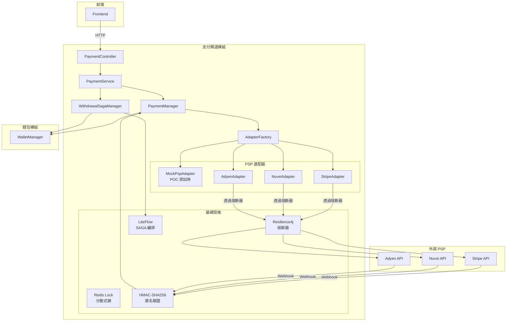
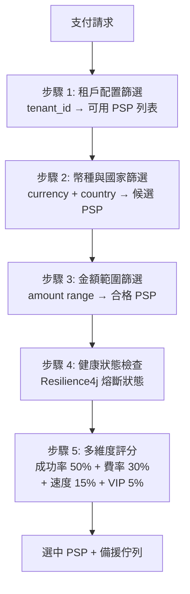
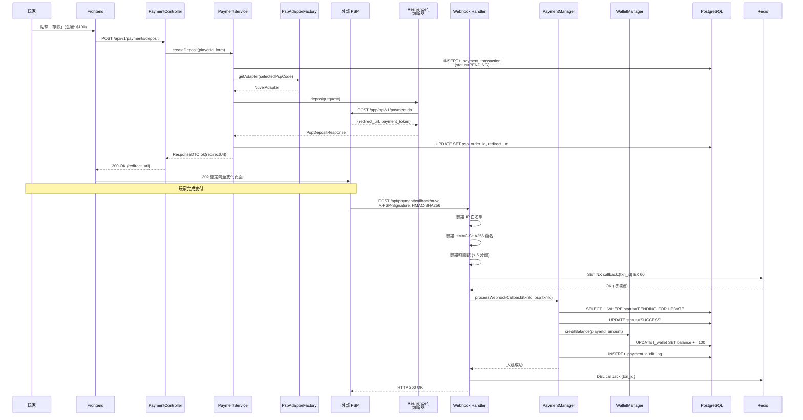
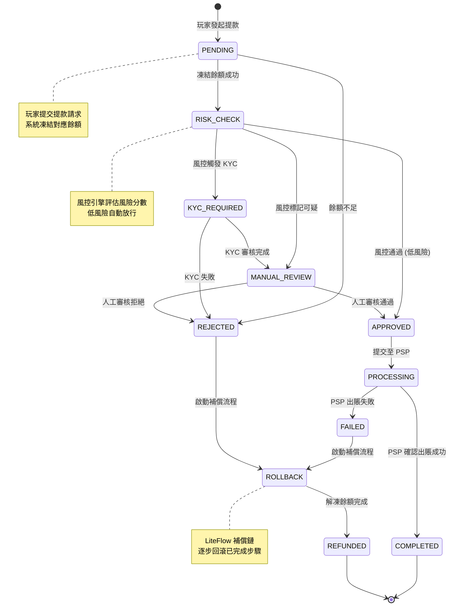
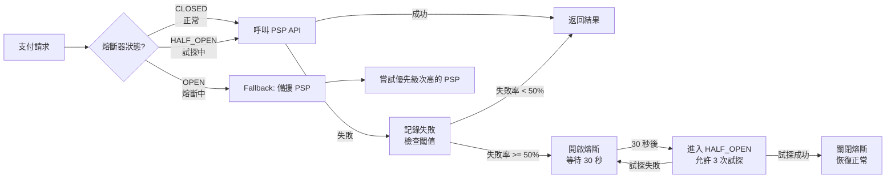
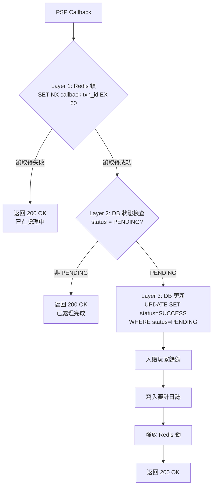

# 支付閘道設計（Payment Gateway Design）

> **模組（Module）**: `smartadmin-igaming-wallet`（錢包與支付緊耦合，確保 ACID 一致性）
> **目標讀者（Audience）**: 架構師、後端開發人員、DevOps 工程師
> **架構文件（Architecture Docs）**:
>   - [05_Payment_Gateway_API.md](../architecture/02_Finance_Service/05_Payment_Gateway_API.md) - 支付閘道 API 規格
>   - [06_Payment_Gateway_Technical.md](../architecture/02_Finance_Service/06_Payment_Gateway_Technical.md) - 支付閘道技術細節
>   - [04_Financial_Implementation.md](../architecture/02_Finance_Service/04_Financial_Implementation.md) - 金融實作架構
> **文件版本（Version）**: 1.0.0
> **最後更新（Last Updated）**: 2026-02-14

---

## 1. 架構概述（Architecture Overview）

### 1.1 設計目標

支付閘道 (Payment Gateway) 作為平台與外部支付服務提供商 (Payment Service Provider, PSP) 之間的抽象層，核心設計目標：

- **PSP 無關性**：透過適配器模式 (Adapter Pattern) 隔離 PSP 差異，新增 PSP 僅需實作介面
- **容錯與熔斷**：Resilience4j 熔斷器確保單一 PSP 故障不影響整體支付能力
- **ACID 保證**：存款入賬與提款扣款皆在 Manager 層 `@Transactional` 中完成
- **冪等處理**：三層冪等防禦（Redis 鎖 → DB 狀態檢查 → 唯一約束）
- **SAGA 編排**：提款流程透過 LiteFlow Chain 實現本地 SAGA 編排（非分散式 SAGA）

### 1.2 SmartAdmin 模組依賴

| 依賴模組 | 用途 | 備註 |
|---------|------|------|
| `smartadmin-support-liteflow` | 提款 SAGA 流程編排 | LiteFlow Chain DSL |
| `smartadmin-common-security` | HMAC-SHA256 簽名驗證 | Callback 安全驗證 |
| `smartadmin-common-redis-lock` | 分散式鎖 | 支付處理冪等保護 |
| **Resilience4j** (新增) | PSP 熔斷器 | 唯一新增外部依賴 |

### 1.3 系統組件圖



### 1.4 存款 vs 提款流程對比

| 維度 | 存款 (Deposit) | 提款 (Withdrawal) |
|------|---------------|-------------------|
| **發起者** | 玩家 | 玩家 |
| **PSP 交互** | 同步取得 redirect URL | 異步提交 payout 請求 |
| **入賬時機** | PSP Webhook 回調後入賬 | 風控審核 + PSP 確認後出賬 |
| **事務複雜度** | 單步（Webhook → Credit） | 多步 SAGA（凍結 → 風控 → 審核 → 出賬） |
| **編排方式** | Manager 層 `@Transactional` | LiteFlow Chain SAGA |
| **補償機制** | 無（失敗不入賬即可） | 逐步回滾（解凍餘額、退回資金） |

---

## 2. PSP 適配器設計（PSP Adapter Design）

### 2.1 適配器介面

使用策略模式 (Strategy Pattern) 抽象 PSP 差異。每個 PSP 實作統一介面，PaymentService 透過 `AdapterFactory` 取得對應適配器。

```java
package net.lab1024.sa.business.payment.psp;

import io.vavr.control.Either;
import io.vavr.control.Option;
import net.lab1024.sa.business.payment.domain.dto.PspDepositRequest;
import net.lab1024.sa.business.payment.domain.dto.PspDepositResponse;
import net.lab1024.sa.business.payment.domain.dto.PspWithdrawRequest;
import net.lab1024.sa.business.payment.domain.dto.PspWithdrawResponse;
import net.lab1024.sa.business.payment.domain.dto.PspQueryResponse;
import net.lab1024.sa.business.payment.domain.dto.PspCallbackPayload;

/**
 * PSP adapter interface — Strategy Pattern
 *
 * Each PSP implementation provides deposit, withdraw, query, and callback verification.
 * All PSP communication goes through Resilience4j circuit breaker.
 */
public interface PaymentProviderAdapter {

    /**
     * PSP identifier code (e.g., "stripe", "nuvei", "adyen", "mock")
     */
    String getPspCode();

    /**
     * Initiate deposit request to PSP, returns redirect URL
     *
     * @param request deposit parameters (amount, currency, callbackUrl, etc.)
     * @return Either.left(errorMsg) or Either.right(response with redirectUrl)
     */
    Either<String, PspDepositResponse> deposit(PspDepositRequest request);

    /**
     * Submit withdrawal (payout) request to PSP
     *
     * @param request withdrawal parameters (amount, currency, bankInfo, etc.)
     * @return Either.left(errorMsg) or Either.right(response with pspTransactionId)
     */
    Either<String, PspWithdrawResponse> withdraw(PspWithdrawRequest request);

    /**
     * Query transaction status at PSP (for reconciliation)
     *
     * @param pspTransactionId PSP-side transaction identifier
     * @return Option.some(status) or Option.none() if not found
     */
    Option<PspQueryResponse> queryStatus(String pspTransactionId);

    /**
     * Verify PSP callback signature (HMAC-SHA256 time-safe comparison)
     *
     * @param payload raw callback request body
     * @param signature value from X-PSP-Signature header
     * @param timestamp callback timestamp for replay attack prevention
     * @return true if signature is valid and timestamp is within tolerance
     */
    boolean verifyCallback(String payload, String signature, long timestamp);
}
```

### 2.2 適配器工廠

```java
package net.lab1024.sa.business.payment.psp;

import io.vavr.control.Option;
import lombok.RequiredArgsConstructor;
import org.springframework.stereotype.Component;

import java.util.List;
import java.util.Map;
import java.util.function.Function;
import java.util.stream.Collectors;

/**
 * PSP Adapter Factory — resolves adapter by pspCode
 *
 * Spring auto-discovers all PaymentProviderAdapter beans.
 * Factory maps pspCode -> adapter instance.
 */
@Component
@RequiredArgsConstructor
public class PspAdapterFactory {

    private final Map<String, PaymentProviderAdapter> adapterMap;

    public PspAdapterFactory(List<PaymentProviderAdapter> adapters) {
        this.adapterMap = adapters.stream()
            .collect(Collectors.toMap(
                PaymentProviderAdapter::getPspCode,
                Function.identity()
            ));
    }

    /**
     * Get adapter by PSP code
     *
     * @param pspCode PSP identifier (e.g., "stripe", "nuvei")
     * @return Option.some(adapter) or Option.none() if not registered
     */
    public Option<PaymentProviderAdapter> getAdapter(String pspCode) {
        return Option.of(adapterMap.get(pspCode));
    }
}
```

### 2.3 PSP 路由策略

PSP 路由依據三個維度選擇最佳 PSP：



**路由服務** 詳見 [05_Payment_Gateway_API.md Section 3](../architecture/02_Finance_Service/05_Payment_Gateway_API.md) 智能路由演算法完整實作。

---

## 3. 存款流程（Deposit Flow）

### 3.1 存款序列圖



### 3.2 Controller 層

```java
package net.lab1024.sa.business.payment.controller;

import lombok.RequiredArgsConstructor;
import net.lab1024.sa.business.payment.domain.form.DepositRequestForm;
import net.lab1024.sa.business.payment.domain.vo.DepositResponseVO;
import net.lab1024.sa.business.payment.service.PaymentService;
import net.lab1024.sa.common.core.domain.response.ResponseDTO;
import org.springframework.web.bind.annotation.*;

import javax.servlet.http.HttpServletRequest;
import javax.validation.Valid;

@RestController
@RequestMapping("/api/v1/payments")
@RequiredArgsConstructor
public class PaymentController {

    private final PaymentService paymentService;

    /**
     * Create deposit order and return PSP redirect URL
     */
    @PostMapping("/deposit")
    public ResponseDTO<DepositResponseVO> createDeposit(
            @RequestBody @Valid DepositRequestForm form) {
        return paymentService.createDeposit(form);
    }

    /**
     * PSP webhook callback handler
     * URL pattern: /api/payment/callback/{pspCode}
     */
    @PostMapping("/callback/{pspCode}")
    public ResponseDTO<Void> handleCallback(
            @PathVariable String pspCode,
            HttpServletRequest request,
            @RequestBody String payload) {
        return paymentService.processCallback(pspCode, request, payload);
    }
}
```

### 3.3 Callback 簽名驗證

Callback 驗證採用 HMAC-SHA256 + 常量時間比較 (Constant-Time Comparison)，防止計時攻擊 (Timing Attack)：

```java
package net.lab1024.sa.business.payment.security;

import lombok.RequiredArgsConstructor;
import lombok.extern.slf4j.Slf4j;
import org.springframework.stereotype.Component;

import javax.crypto.Mac;
import javax.crypto.spec.SecretKeySpec;
import java.nio.charset.StandardCharsets;
import java.security.MessageDigest;

/**
 * HMAC-SHA256 callback signature verifier
 *
 * Uses constant-time comparison to prevent timing attacks.
 * Validates timestamp to prevent replay attacks (5-minute tolerance).
 */
@Slf4j
@Component
@RequiredArgsConstructor
public class CallbackSignatureVerifier {

    private final PspSecretProvider secretProvider;

    private static final long TIMESTAMP_TOLERANCE_MS = 5 * 60 * 1000L; // 5 minutes

    /**
     * Verify callback signature with replay attack prevention
     *
     * @param pspCode      PSP identifier
     * @param payload      raw HTTP body
     * @param signature    X-PSP-Signature header value
     * @param timestampMs  callback timestamp in milliseconds
     * @return true if signature valid and timestamp within tolerance
     */
    public boolean verify(String pspCode, String payload,
                          String signature, long timestampMs) {
        // Step 1: Replay attack prevention — check timestamp freshness
        long now = System.currentTimeMillis();
        if (Math.abs(now - timestampMs) > TIMESTAMP_TOLERANCE_MS) {
            log.warn("[Signature] Timestamp expired for PSP {}: delta={}ms",
                pspCode, Math.abs(now - timestampMs));
            return false;
        }

        // Step 2: Compute expected HMAC-SHA256
        try {
            String secret = secretProvider.getWebhookSecret(pspCode);
            Mac mac = Mac.getInstance("HmacSHA256");
            SecretKeySpec keySpec = new SecretKeySpec(
                secret.getBytes(StandardCharsets.UTF_8), "HmacSHA256");
            mac.init(keySpec);

            byte[] hmacBytes = mac.doFinal(
                payload.getBytes(StandardCharsets.UTF_8));
            String computed = bytesToHex(hmacBytes);

            // Step 3: Constant-time comparison (prevent timing attack)
            boolean valid = MessageDigest.isEqual(
                computed.getBytes(StandardCharsets.UTF_8),
                signature.getBytes(StandardCharsets.UTF_8)
            );

            if (!valid) {
                log.error("[Signature] HMAC mismatch for PSP {}", pspCode);
            }
            return valid;

        } catch (Exception e) {
            log.error("[Signature] Verification error for PSP {}", pspCode, e);
            return false;
        }
    }

    private static String bytesToHex(byte[] bytes) {
        StringBuilder sb = new StringBuilder(bytes.length * 2);
        for (byte b : bytes) {
            sb.append(String.format("%02x", b));
        }
        return sb.toString();
    }
}
```

---

## 4. 提款 SAGA 流程（Withdrawal SAGA Flow）

### 4.1 提款狀態機

提款 (Withdrawal) 涉及 10 種狀態，透過 LiteFlow Chain 編排本地 SAGA 流程。與存款不同，提款需要風控檢查 (Risk Check)、身份驗證 (KYC) 審核及人工複核。

**注意**: 以下使用 stateDiagram-v2，不使用 `<br/>` 標籤（stateDiagram-v2 不支援）。



### 4.2 LiteFlow Chain 定義

提款 SAGA 使用 LiteFlow EL 表達式定義執行鏈與補償鏈：

```xml
<!-- withdrawal-saga-chain.xml -->
<flow>
    <!-- Main withdrawal chain -->
    <chain name="withdrawalChain">
        THEN(
            freezeBalanceCmp,
            riskCheckCmp,
            kycCheckCmp,
            manualReviewCmp,
            pspPayoutCmp,
            completeWithdrawalCmp
        )
    </chain>

    <!-- Compensation chain (reverse order) -->
    <chain name="withdrawalCompensationChain">
        THEN(
            cancelPspPayoutCmp,
            unfreezeBalanceCmp,
            notifyPlayerCmp
        )
    </chain>
</flow>
```

### 4.3 WithdrawalSagaManager

```java
package net.lab1024.sa.business.payment.manager;

import com.yomahub.liteflow.core.FlowExecutor;
import com.yomahub.liteflow.flow.LiteflowResponse;
import io.vavr.control.Either;
import lombok.RequiredArgsConstructor;
import lombok.extern.slf4j.Slf4j;
import net.lab1024.sa.business.payment.dao.PaymentTransactionDao;
import net.lab1024.sa.business.payment.domain.entity.PaymentTransactionEntity;
import net.lab1024.sa.business.payment.domain.dto.WithdrawalContext;
import net.lab1024.sa.business.wallet.manager.WalletManager;
import org.springframework.stereotype.Component;
import org.springframework.transaction.annotation.Transactional;

/**
 * Withdrawal SAGA Manager — LiteFlow Chain orchestration
 *
 * Orchestrates the multi-step withdrawal process:
 * 1. Freeze balance
 * 2. Risk check
 * 3. KYC verification (conditional)
 * 4. Manual review (conditional)
 * 5. PSP payout submission
 * 6. Completion
 *
 * On failure at any step, the compensation chain runs in reverse order.
 * This is a LOCAL SAGA (not distributed) — all steps run within the same JVM.
 */
@Slf4j
@Component
@RequiredArgsConstructor
public class WithdrawalSagaManager {

    private final FlowExecutor flowExecutor;
    private final PaymentTransactionDao paymentTransactionDao;
    private final WalletManager walletManager;

    /**
     * Execute withdrawal SAGA chain
     *
     * @param transaction withdrawal transaction entity (status=PENDING)
     * @return Either.left(errorMsg) or Either.right(completedTransaction)
     */
    @Transactional(rollbackFor = Throwable.class)
    public Either<String, PaymentTransactionEntity> executeWithdrawal(
            PaymentTransactionEntity transaction) {

        log.info("[WithdrawalSAGA] Starting withdrawal SAGA for txn: {}",
            transaction.getTransactionId());

        // Build LiteFlow context with withdrawal data
        WithdrawalContext context = WithdrawalContext.builder()
            .transactionId(transaction.getTransactionId())
            .playerId(transaction.getPlayerId())
            .amount(transaction.getAmount())
            .currency(transaction.getCurrency())
            .pspCode(transaction.getPspCode())
            .build();

        // Execute main withdrawal chain
        LiteflowResponse response = flowExecutor.execute2Resp(
            "withdrawalChain", null, context);

        if (response.isSuccess()) {
            log.info("[WithdrawalSAGA] Withdrawal completed: {}",
                transaction.getTransactionId());

            transaction.setStatus("COMPLETED");
            paymentTransactionDao.updateById(transaction);
            return Either.right(transaction);
        }

        // Main chain failed — execute compensation
        log.warn("[WithdrawalSAGA] Main chain failed for {}, executing compensation",
            transaction.getTransactionId());

        return executeCompensation(transaction, context, response);
    }

    /**
     * Execute compensation chain (reverse rollback)
     */
    private Either<String, PaymentTransactionEntity> executeCompensation(
            PaymentTransactionEntity transaction,
            WithdrawalContext context,
            LiteflowResponse failedResponse) {

        context.setFailedStep(failedResponse.getExecuteStepStr());
        context.setCompensation(true);

        LiteflowResponse compensationResponse = flowExecutor.execute2Resp(
            "withdrawalCompensationChain", null, context);

        if (compensationResponse.isSuccess()) {
            log.info("[WithdrawalSAGA] Compensation completed for {}",
                transaction.getTransactionId());

            transaction.setStatus("REFUNDED");
            paymentTransactionDao.updateById(transaction);

            // Unfreeze player balance
            walletManager.unfreezeBalance(
                transaction.getPlayerId(),
                transaction.getAmount(),
                transaction.getTransactionId()
            );

            return Either.left("Withdrawal failed, balance refunded: "
                + failedResponse.getMessage());
        }

        // Compensation also failed — critical alert
        log.error("[WithdrawalSAGA] CRITICAL: Compensation failed for {}",
            transaction.getTransactionId());

        transaction.setStatus("ROLLBACK");
        paymentTransactionDao.updateById(transaction);

        return Either.left("CRITICAL: Compensation failed, manual intervention required");
    }
}
```

### 4.4 各步驟補償邏輯

| 步驟 | 正向操作 | 補償操作 | 補償說明 |
|------|---------|---------|---------|
| **freezeBalanceCmp** | 凍結玩家餘額 | unfreezeBalanceCmp | 解凍已凍結金額，恢復可下注餘額 (Playable Balance) |
| **riskCheckCmp** | 風控引擎評估 | 無需補償 | 風控結果為只讀判斷 |
| **kycCheckCmp** | KYC 驗證狀態檢查 | 無需補償 | KYC 為外部查詢 |
| **manualReviewCmp** | 人工審核流程 | 無需補償 | 審核記錄保留 |
| **pspPayoutCmp** | 提交 PSP 出賬 | cancelPspPayoutCmp | 呼叫 PSP 取消 API，若不可取消則標記待手動處理 |
| **completeWithdrawalCmp** | 標記完成 | 不適用 | 完成後不回滾 |

---

## 5. Resilience4j 熔斷器配置（Circuit Breaker Configuration）

### 5.1 設計原則

每個 PSP 擁有獨立的熔斷器實例。當某 PSP 失敗率超過閾值時，熔斷器開啟 (Open)，後續請求自動 fallback 至備援 PSP。



### 5.2 YAML 配置

```yaml
# application-payment.yml
resilience4j:
  circuitbreaker:
    configs:
      pspDefault:
        # Failure threshold: open circuit when 50% of calls fail
        failureRateThreshold: 50
        # Wait 30 seconds before attempting half-open
        waitDurationInOpenState: 30s
        # Sliding window: last 10 calls
        slidingWindowType: COUNT_BASED
        slidingWindowSize: 10
        # Minimum calls before evaluating failure rate
        minimumNumberOfCalls: 5
        # Allow 3 calls in half-open state
        permittedNumberOfCallsInHalfOpenState: 3
        # Record timeout as failure
        slowCallDurationThreshold: 5s
        slowCallRateThreshold: 80
        # Automatically transition from OPEN to HALF_OPEN
        automaticTransitionFromOpenToHalfOpenEnabled: true
        # Record these exceptions as failures
        recordExceptions:
          - java.io.IOException
          - java.net.SocketTimeoutException
          - net.lab1024.sa.business.payment.exception.PspApiException
        # Ignore these exceptions (not counted as failures)
        ignoreExceptions:
          - net.lab1024.sa.business.payment.exception.PspBusinessException

    instances:
      stripe:
        baseConfig: pspDefault
      nuvei:
        baseConfig: pspDefault
        # Nuvei has slower API — increase timeout threshold
        slowCallDurationThreshold: 8s
      adyen:
        baseConfig: pspDefault
      mock:
        baseConfig: pspDefault
        # Mock PSP — never trip for testing
        failureRateThreshold: 100
```

### 5.3 Gradle 依賴

在 `smartadmin-igaming-wallet` 模組的 `build.gradle` 中新增 Resilience4j 依賴：

```groovy
// smartadmin-modules/smartadmin-igaming-wallet/build.gradle
dependencies {
    // Resilience4j — PSP circuit breaker (ONLY new external dependency)
    implementation 'io.github.resilience4j:resilience4j-spring-boot3:2.2.0'
    implementation 'io.github.resilience4j:resilience4j-circuitbreaker:2.2.0'

    // Existing SmartAdmin dependencies
    implementation project(':smartadmin-support-liteflow')
    implementation project(':smartadmin-common-security')
    implementation project(':smartadmin-common-redis-lock')
}
```

### 5.4 Fallback 策略

```java
package net.lab1024.sa.business.payment.psp;

import io.github.resilience4j.circuitbreaker.annotation.CircuitBreaker;
import io.vavr.control.Either;
import lombok.RequiredArgsConstructor;
import lombok.extern.slf4j.Slf4j;
import net.lab1024.sa.business.payment.domain.dto.PspDepositRequest;
import net.lab1024.sa.business.payment.domain.dto.PspDepositResponse;
import org.springframework.stereotype.Component;

/**
 * Resilient PSP caller with circuit breaker and fallback
 *
 * When primary PSP circuit opens, automatically tries next PSP in priority list.
 */
@Slf4j
@Component
@RequiredArgsConstructor
public class ResilientPspCaller {

    private final PspAdapterFactory adapterFactory;
    private final PspRoutingService routingService;

    @CircuitBreaker(name = "#{#pspCode}", fallbackMethod = "fallbackDeposit")
    public Either<String, PspDepositResponse> callDeposit(
            String pspCode, PspDepositRequest request) {
        return adapterFactory.getAdapter(pspCode)
            .map(adapter -> adapter.deposit(request))
            .getOrElse(Either.left("PSP not found: " + pspCode));
    }

    /**
     * Fallback: try next PSP in priority list
     */
    public Either<String, PspDepositResponse> fallbackDeposit(
            String pspCode, PspDepositRequest request, Throwable t) {
        log.warn("[CircuitBreaker] PSP {} circuit open, trying fallback. Reason: {}",
            pspCode, t.getMessage());

        // Get next available PSP from routing service
        return routingService.getNextAvailablePsp(pspCode, request)
            .map(nextPsp -> {
                log.info("[CircuitBreaker] Falling back to PSP: {}", nextPsp);
                return adapterFactory.getAdapter(nextPsp)
                    .map(adapter -> adapter.deposit(request))
                    .getOrElse(Either.left("Fallback PSP not found: " + nextPsp));
            })
            .getOrElse(Either.left("All PSPs unavailable"));
    }
}
```

---

## 6. Webhook 處理（Webhook Processing）

### 6.1 回調 URL 規範

| 項目 | 規格 |
|------|------|
| **URL 模式** | `/api/payment/callback/{pspCode}` |
| **HTTP 方法** | POST |
| **Content-Type** | application/json |
| **簽名 Header** | `X-PSP-Signature` (HMAC-SHA256) |
| **時間戳 Header** | `X-PSP-Timestamp` (Unix milliseconds) |
| **回應** | 固定回傳 HTTP 200（避免 PSP 重試風暴） |

### 6.2 冪等回調處理

PSP 可能因超時或網路問題重複發送回調。系統透過三層冪等防禦確保不重複入賬：



### 6.3 重試處理

| PSP 行為 | 系統處理 | 說明 |
|----------|---------|------|
| 首次回調 | 正常處理入賬 | Layer 1-3 全部通過 |
| 重複回調 (< 60 秒) | Redis 鎖攔截 | Layer 1 攔截，返回 200 |
| 重複回調 (> 60 秒) | DB 狀態檢查攔截 | Redis 鎖已過期，Layer 2 攔截 |
| 簽名不符 | 拒絕 + 安全告警 | 在簽名驗證階段攔截 |
| 時間戳過期 | 拒絕 (疑似重放攻擊) | > 5 分鐘視為過期 |

---

## 7. 對帳系統（Reconciliation System）

### 7.1 三層對帳機制

對帳 (Reconciliation) 確保平台交易紀錄與 PSP 端紀錄一致，採用三層漸進式策略：

| 層級 | 機制 | 觸發時機 | 處理延遲 |
|------|------|---------|---------|
| **Layer 1** | 即時回調驗證 | PSP Webhook 到達時 | 0 (即時) |
| **Layer 2** | 5 分鐘輪詢 | 排程任務每 5 分鐘執行 | 5-35 分鐘 |
| **Layer 3** | 每日批次對帳 | 每日 02:00 AM 執行 | T+1 |

### 7.2 Layer 2：輪詢排程任務

使用 `smartadmin-support-job` (Snail-Job) 排程，針對超過 30 分鐘仍為 PENDING 的交易主動查詢 PSP 狀態：

```java
package net.lab1024.sa.business.payment.job;

import lombok.RequiredArgsConstructor;
import lombok.extern.slf4j.Slf4j;
import net.lab1024.sa.business.payment.service.ReconciliationService;
import org.springframework.stereotype.Component;

/**
 * Polling reconciliation job — queries PSP for missing callbacks
 *
 * Runs every 5 minutes via Snail-Job.
 * Targets transactions that have been PENDING for > 30 minutes.
 */
@Slf4j
@Component
@RequiredArgsConstructor
public class PaymentReconciliationJob {

    private final ReconciliationService reconciliationService;

    /**
     * Snail-Job scheduled task: every 5 minutes
     * Cron: 0 */5 * * * ?
     */
    public void execute() {
        log.info("[Reconciliation] Layer 2: Starting polling reconciliation");

        int processed = reconciliationService.reconcilePendingTransactions(30);

        log.info("[Reconciliation] Layer 2: Completed, processed {} transactions",
            processed);
    }
}
```

### 7.3 Layer 3：每日批次對帳

```java
/**
 * Daily batch reconciliation job — runs at 02:00 AM
 * Cron: 0 0 2 * * ?
 *
 * Compares all transactions from previous day with PSP settlement report.
 * Creates reconciliation exception records for mismatches.
 */
public void executeDailyReconciliation() {
    log.info("[Reconciliation] Layer 3: Starting daily batch reconciliation");

    // Step 1: Download PSP settlement report (T-1)
    List<PspSettlementRecord> pspRecords =
        pspClient.downloadSettlementReport(LocalDate.now().minusDays(1));

    // Step 2: Load platform transactions for same period
    List<PaymentTransactionEntity> platformRecords =
        transactionDao.findByDateRange(
            LocalDate.now().minusDays(1).atStartOfDay(),
            LocalDate.now().atStartOfDay()
        );

    // Step 3: Three-way matching
    ReconciliationResult result =
        reconciliationEngine.match(pspRecords, platformRecords);

    // Step 4: Create exception records for mismatches
    result.getMismatches().forEach(mismatch -> {
        ReconciliationExceptionEntity exception =
            new ReconciliationExceptionEntity();
        exception.setTransactionId(mismatch.getTransactionId());
        exception.setExceptionType(mismatch.getType().name());
        exception.setPspAmount(mismatch.getPspAmount());
        exception.setPlatformAmount(mismatch.getPlatformAmount());
        exception.setStatus("PENDING_REVIEW");
        reconciliationExceptionDao.insert(exception);
    });

    log.info("[Reconciliation] Layer 3: Completed. "
        + "Matched: {}, Mismatches: {}, Missing: {}",
        result.getMatchedCount(),
        result.getMismatchCount(),
        result.getMissingCount());
}
```

### 7.4 對帳異常處理

| 異常類型 | 說明 | 處理方式 |
|---------|------|---------|
| **金額不符 (Amount Mismatch)** | 平台金額與 PSP 金額不一致 | 建立異常記錄，通知財務團隊人工核對 |
| **平台遺漏 (Platform Missing)** | PSP 有記錄但平台無對應交易 | 可能是 Webhook 遺失，觸發自動入賬 |
| **PSP 遺漏 (PSP Missing)** | 平台有記錄但 PSP 無對應交易 | 可能是 PSP 端訂單未建立，標記為異常 |
| **狀態不一致 (Status Mismatch)** | 平台為 SUCCESS 但 PSP 為 FAILED | 高優先級異常，可能涉及多入賬風險 |

---

## 8. 安全設計（Security Design）

### 8.1 PSP API Key 存儲

PSP 的 API Key 與 Webhook Secret 使用 AES-256-GCM 加密存儲於資料庫，運行時解密：

```sql
-- t_psp_config 表中的加密欄位
-- api_key_encrypted: AES-256-GCM 加密後的 API Key
-- webhook_secret_encrypted: AES-256-GCM 加密後的 Webhook Secret
-- 密鑰管理: DEK (Data Encryption Key) 存儲於應用配置
--           KEK (Key Encryption Key) 存儲於 Vault / 環境變數
```

### 8.2 Callback IP 白名單

```yaml
# application-payment.yml
payment:
  callback:
    ip-whitelist:
      stripe:
        - "3.18.12.63"
        - "3.130.192.0/24"
        - "13.235.14.0/24"
      nuvei:
        - "195.28.31.0/24"
        - "81.218.102.0/24"
      adyen:
        - "185.78.128.0/22"
```

### 8.3 金額限制

| 限制類型 | 存款 | 提款 | 說明 |
|---------|------|------|------|
| **單筆上限** | $10,000 | $50,000 | 超過需人工審核 |
| **單筆下限** | $10 | $20 | 低於拒絕請求 |
| **日累計** | $50,000 | $100,000 | 超過觸發 AML 審查 |
| **月累計** | $200,000 | $500,000 | 超過通知合規團隊 |

### 8.4 反欺詐速率檢查

在提交 PSP 請求前，系統執行速率檢查 (Velocity Check)：

- **同一玩家 1 小時內存款次數** > 5 次 → 觸發風控審查
- **同一 IP 地址 10 分鐘內存款次數** > 3 次 → 臨時封鎖
- **同一設備指紋 24 小時內存款金額** > $10,000 → 觸發 AML 審查
- **新註冊玩家首次存款** > $1,000 → 強制 KYC 驗證

---

## 9. 測試策略（Testing Strategy）

### 9.1 MockPspAdapter

POC 與整合測試使用 `MockPspAdapter`，模擬各種 PSP 行為：

```java
package net.lab1024.sa.business.payment.psp.mock;

import io.vavr.control.Either;
import io.vavr.control.Option;
import net.lab1024.sa.business.payment.domain.dto.*;
import net.lab1024.sa.business.payment.psp.PaymentProviderAdapter;
import org.springframework.stereotype.Component;

import java.util.UUID;

/**
 * Mock PSP Adapter for integration tests and POC
 *
 * Simulates PSP behavior:
 * - Amounts ending in .01 → simulate failure
 * - Amounts ending in .02 → simulate timeout (delay 10s)
 * - All other amounts → simulate success
 */
@Component
public class MockPspAdapter implements PaymentProviderAdapter {

    @Override
    public String getPspCode() {
        return "mock";
    }

    @Override
    public Either<String, PspDepositResponse> deposit(PspDepositRequest request) {
        // Simulate failure for amounts ending in .01
        if (request.getAmount().toString().endsWith(".01")) {
            return Either.left("MOCK_DECLINED: Insufficient funds");
        }

        // Simulate timeout for amounts ending in .02
        if (request.getAmount().toString().endsWith(".02")) {
            try { Thread.sleep(10_000); } catch (InterruptedException ignored) {}
            return Either.left("MOCK_TIMEOUT: PSP response timeout");
        }

        // Normal success
        return Either.right(PspDepositResponse.builder()
            .pspTransactionId("mock_" + UUID.randomUUID())
            .redirectUrl("https://mock-psp.local/pay/" + request.getOrderId())
            .status("PENDING")
            .build());
    }

    @Override
    public Either<String, PspWithdrawResponse> withdraw(PspWithdrawRequest request) {
        return Either.right(PspWithdrawResponse.builder()
            .pspTransactionId("mock_wd_" + UUID.randomUUID())
            .status("PROCESSING")
            .build());
    }

    @Override
    public Option<PspQueryResponse> queryStatus(String pspTransactionId) {
        return Option.some(PspQueryResponse.builder()
            .pspTransactionId(pspTransactionId)
            .status("SUCCESS")
            .build());
    }

    @Override
    public boolean verifyCallback(String payload, String signature, long timestamp) {
        // Mock adapter accepts any signature for testing
        return "mock-test-signature".equals(signature)
            || signature.startsWith("mock_");
    }
}
```

### 9.2 WireMock 整合測試

使用 WireMock 模擬真實 PSP API 行為，驗證完整存款與回調流程：

```java
@SpringBootTest
@AutoConfigureWireMock(port = 0)
class PaymentIntegrationTest {

    @Autowired
    private PaymentService paymentService;

    @Autowired
    private CallbackSignatureVerifier signatureVerifier;

    @Test
    void deposit_success_flow() {
        // Given: WireMock stubs PSP deposit API
        stubFor(post("/ppp/api/v1/payment.do")
            .willReturn(okJson("""
                {
                    "status": "OK",
                    "redirect_url": "https://psp.test/pay/123",
                    "payment_token": "tok_abc"
                }
                """)));

        // When: Create deposit
        DepositRequestForm form = new DepositRequestForm();
        form.setAmount(new BigDecimal("100.00"));
        form.setCurrency("USD");
        form.setPaymentMethod("credit_card");

        ResponseDTO<DepositResponseVO> result =
            paymentService.createDeposit(form);

        // Then: Verify success
        assertThat(result.getOk()).isTrue();
        assertThat(result.getData().getRedirectUrl())
            .contains("psp.test");
    }

    @Test
    void callback_signature_verification() {
        // Given: Known secret and payload
        String payload = "{\"txn_id\":\"test_001\",\"status\":\"SUCCESS\"}";
        String secret = "test-webhook-secret";

        // When: Compute valid HMAC-SHA256
        Mac mac = Mac.getInstance("HmacSHA256");
        mac.init(new SecretKeySpec(
            secret.getBytes(), "HmacSHA256"));
        String validSignature = Hex.encodeHexString(
            mac.doFinal(payload.getBytes()));

        // Then: Verification succeeds
        boolean result = signatureVerifier.verify(
            "mock", payload, validSignature, System.currentTimeMillis());
        assertThat(result).isTrue();

        // And: Tampered signature fails
        boolean tampered = signatureVerifier.verify(
            "mock", payload, "invalid_signature", System.currentTimeMillis());
        assertThat(tampered).isFalse();
    }

    @Test
    void callback_replay_attack_rejected() {
        String payload = "{\"txn_id\":\"test_002\",\"status\":\"SUCCESS\"}";

        // Timestamp from 10 minutes ago — should be rejected
        long expiredTimestamp = System.currentTimeMillis() - (10 * 60 * 1000);

        boolean result = signatureVerifier.verify(
            "mock", payload, "any_signature", expiredTimestamp);
        assertThat(result).isFalse();
    }
}
```

### 9.3 測試覆蓋矩陣

| 測試場景 | 類型 | 使用工具 | 涵蓋範圍 |
|---------|------|---------|---------|
| PSP 適配器正確路由 | Unit Test | Mockito | PspAdapterFactory |
| 存款成功 + 回調入賬 | Integration Test | WireMock + Testcontainers | 完整存款流程 |
| 回調簽名驗證 | Unit Test | JUnit 5 | CallbackSignatureVerifier |
| 回調重放攻擊防護 | Unit Test | JUnit 5 | 時間戳驗證邏輯 |
| 冪等回調處理 | Integration Test | Testcontainers (Redis + PostgreSQL) | 三層冪等防禦 |
| 提款 SAGA 正向流程 | Integration Test | LiteFlow + Testcontainers | WithdrawalSagaManager |
| 提款 SAGA 補償流程 | Integration Test | LiteFlow + Testcontainers | 補償鏈回滾 |
| 熔斷器 Fallback | Unit Test | Resilience4j Test | ResilientPspCaller |
| 對帳任務 | Integration Test | WireMock + Testcontainers | ReconciliationService |
| MockPspAdapter 行為 | Unit Test | JUnit 5 | 失敗/超時/成功模擬 |

---

## 10. 相關文件（Related Documents）

### 架構文件
- [05_Payment_Gateway_API.md](../architecture/02_Finance_Service/05_Payment_Gateway_API.md) — 支付閘道 API 規格（存款流程、智能路由、對帳流程）
- [06_Payment_Gateway_Technical.md](../architecture/02_Finance_Service/06_Payment_Gateway_Technical.md) — 技術實作細節（Webhook、安全、監控）
- [04_Financial_Implementation.md](../architecture/02_Finance_Service/04_Financial_Implementation.md) — 金融實作架構（錢包系統、SAGA 補償）

### 需求文件
- [03_Payment_Operations.md](../requirements/02_Financial_Operations/03_Payment_Operations.md) — 支付業務規則、PSP 矩陣、審批閾值

### SmartAdmin 模式
- [SmartAdmin Patterns](../../../.claude/shared/knowledge/smartadmin-patterns.md) — Manager 層 `@Transactional`、Vavr Option、ResponseDTO

---

**SmartAdmin 模式檢查點**:
- Service 層使用 Vavr `Either` / `Option`（禁用 `java.util.Optional`）
- `@Transactional(rollbackFor = Throwable.class)` 僅在 Manager 層（WithdrawalSagaManager、PaymentManager）
- 構造器注入：`@RequiredArgsConstructor` + `private final`（禁用 `@Autowired`）
- Controller 不直接存取 Dao（Controller → Service → Manager → Dao）
- `ResponseDTO.ok(data)` 統一 API 回應格式
- Boolean 欄位使用 `deleted` 非 `isDeleted`

---

**文件版本（Document Version）**: 1.0.0
**最後更新（Last Updated）**: 2026-02-14
**維護團隊（Maintenance Team）**: Backend Team
