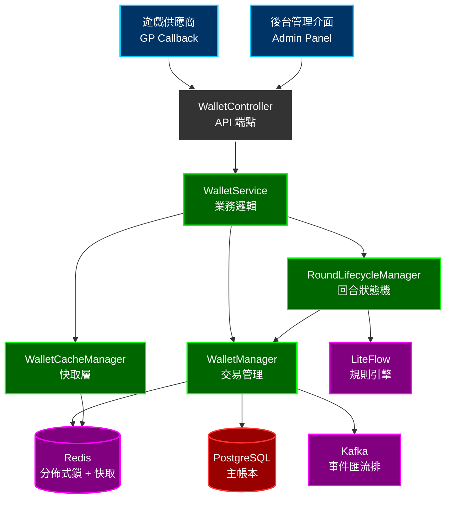
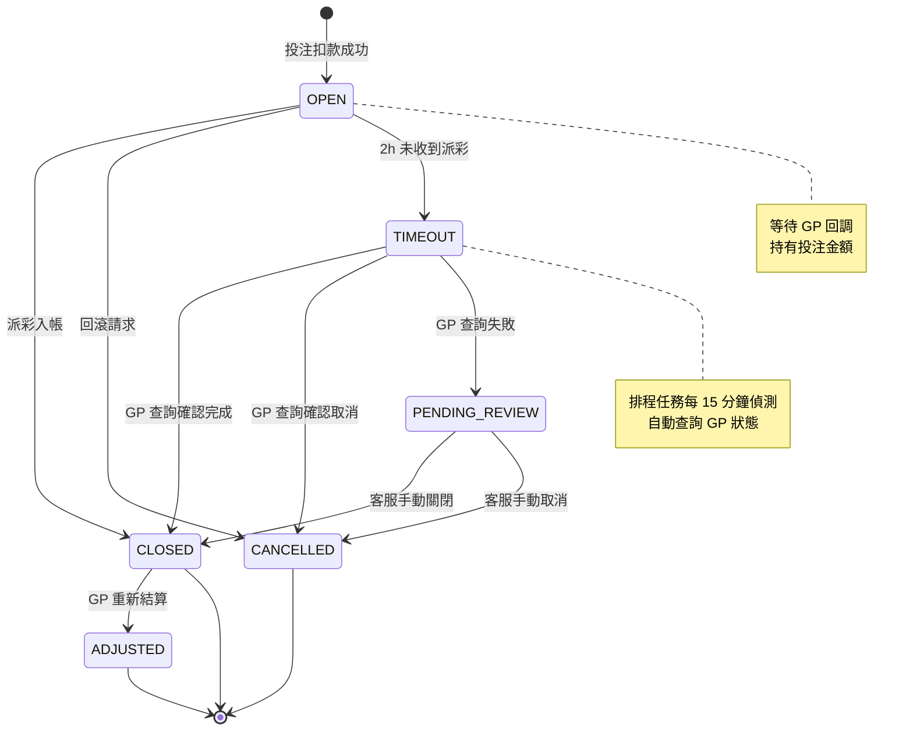

# 錢包系統詳細設計（Seamless Wallet System Design）

> **模組名稱**: `smartadmin-igaming-wallet`
> **目標讀者**: 架構師、後端開發者、DevOps 工程師
> **前置閱讀**:
> - [Seamless_Wallet_Technical.md](../architecture/02_Finance_Service/03_Seamless_Wallet_Technical.md) -- 回合狀態機、時序圖
> - [Financial_Implementation.md](../architecture/02_Finance_Service/04_Financial_Implementation.md) -- t_wallet DDL、debit/credit/rollback 模式
> - [Turnover_Calculation_Architecture.md](../architecture/02_Finance_Service/08_Turnover_Calculation_Architecture.md) -- 有效投注額 (Valid Turnover) 計算公式
> **文檔版本**: 1.0.0
> **最後更新**: 2026-02-14
> **維護團隊**: 後端團隊、財務團隊

---

## 1. 架構概述

### 1.1 無縫錢包模型 (Seamless Wallet)

無縫錢包 (Seamless Wallet) 是 iGaming 平台的核心金融元件。遊戲供應商 (Game Provider, GP) 透過 Callback 機制即時呼叫平台錢包 API，完成投注扣款 (Debit)、派彩入帳 (Credit) 及回滾 (Rollback) 操作。平台作為單一資金帳本 (Single Source of Truth)，所有餘額變更必須通過錢包系統。

**核心流程**:

```
GP Callback → Wallet API → 冪等檢查 → 分佈式鎖 → 餘額更新 → 事件發布
```

### 1.2 錢包類型 (Wallet Types)

| 類型 | 說明 | 可提款 | 限制 |
|------|------|--------|------|
| **CASH** | 現金錢包 (Cash Wallet) | 是 | 無 |
| **BONUS** | 優惠錢包 (Bonus Wallet) | 達標後可轉出 | 流水要求 (Wagering Requirement) |
| **CREDIT** | 信用額度 (Credit Wallet) | 否（結算制） | Phase 2+ 實作 |

### 1.3 可下注餘額公式 (Playable Balance)

```
可下注餘額 (Playable Balance) = 現金餘額 (Cash Balance)
                                - 鎖定金額 (Locked Amount)
                                - 待結算投注 (Pending Bets)
```

> **交叉引用**: 完整的餘額計算邏輯見 [Financial_Implementation.md Section 2.2](../architecture/02_Finance_Service/04_Financial_Implementation.md#22-即時投注可用餘額計算betting-available-balance)

### 1.4 元件架構圖



---

## 2. 分層設計

### 2.1 WalletController -- API 端點

```java
/**
 * 錢包 API 控制器
 *
 * GP Callback 端點不需登入驗證，使用 HMAC-SHA256 簽名驗證。
 * Admin 端點需 Sa-Token 權限驗證。
 */
@RestController
@RequestMapping("/api/wallet")
@RequiredArgsConstructor
@Slf4j
public class WalletController {

    private final WalletService walletService;

    /**
     * 投注扣款 (GP Callback)
     *
     * GP 發起投注時呼叫，從玩家錢包扣除投注金額。
     */
    @PostMapping("/debit")
    @NoNeedLogin
    public ResponseDTO<WalletResponseVO> debit(@RequestBody @Valid DebitForm form) {
        return walletService.debit(form);
    }

    /**
     * 派彩入帳 (GP Callback)
     *
     * 回合結算時呼叫，將派彩金額存入玩家錢包。
     */
    @PostMapping("/credit")
    @NoNeedLogin
    public ResponseDTO<WalletResponseVO> credit(@RequestBody @Valid CreditForm form) {
        return walletService.credit(form);
    }

    /**
     * 回滾 (GP Callback)
     *
     * 取消先前的投注或派彩操作。
     */
    @PostMapping("/rollback")
    @NoNeedLogin
    public ResponseDTO<WalletResponseVO> rollback(@RequestBody @Valid RollbackForm form) {
        return walletService.rollback(form);
    }

    /**
     * 查詢餘額
     */
    @GetMapping("/balance/{playerId}")
    @SaCheckPermission("wallet:balance:query")
    public ResponseDTO<BalanceVO> getBalance(@PathVariable Long playerId) {
        return walletService.getBalance(playerId);
    }

    /**
     * 手動調帳 (Admin)
     *
     * 後台人工調整玩家餘額，需審計日誌。
     */
    @PostMapping("/adjust")
    @SaCheckPermission("wallet:adjust")
    public ResponseDTO<WalletResponseVO> adjust(@RequestBody @Valid AdjustForm form) {
        return walletService.adjust(form);
    }
}
```

### 2.2 WalletService -- 業務邏輯層

WalletService 負責業務協調，使用 `io.vavr.control.Option` 和 `io.vavr.control.Try` 處理空值與異常。單表讀取直接呼叫 Dao；多表寫入委派給 WalletManager。

```java
/**
 * 錢包業務服務
 *
 * SmartAdmin 架構規則：
 * - Service 使用 Vavr Option（非 java.util.Optional）
 * - 單表 CRUD 可直接呼叫 Dao
 * - 需要 @Transactional 時委派給 Manager
 * - 禁止在 Service 層使用 @Transactional
 */
@Service
@RequiredArgsConstructor
@Slf4j
public class WalletService {

    private final WalletDao walletDao;
    private final WalletTransactionDao walletTransactionDao;
    private final WalletManager walletManager;
    private final WalletCacheManager walletCacheManager;
    private final RoundLifecycleManager roundLifecycleManager;
    private final IdempotencyGuard idempotencyGuard;
    private final GpSignatureVerifier gpSignatureVerifier;

    // ============================================================
    // GP Callback 操作
    // ============================================================

    /**
     * 投注扣款
     *
     * 流程：
     * 1. 驗證 GP 簽名
     * 2. 冪等性檢查（快速路徑）
     * 3. 委派 WalletManager 執行原子扣款
     * 4. 返回新餘額
     */
    public ResponseDTO<WalletResponseVO> debit(DebitForm form) {
        // 1. GP 簽名驗證
        if (!gpSignatureVerifier.verify(form)) {
            log.warn("Invalid GP signature for debit request: {}", form.getRequestId());
            return ResponseDTO.error(WalletErrorCode.INVALID_SIGNATURE);
        }

        // 2. 冪等性快速檢查（Redis SETNX）
        Option<WalletResponseVO> cached = idempotencyGuard.checkCached(form.getRequestId());
        if (cached.isDefined()) {
            log.info("Duplicate debit request: {}", form.getRequestId());
            return ResponseDTO.ok(cached.get());
        }

        // 3. 查詢玩家錢包是否存在
        Option<WalletEntity> walletOpt = Option.of(
            walletDao.selectByPlayerIdAndType(form.getPlayerId(), WalletType.CASH)
        );
        if (walletOpt.isEmpty()) {
            return ResponseDTO.error(WalletErrorCode.WALLET_NOT_FOUND);
        }

        // 4. 餘額預檢（非鎖定狀態下的快速拒絕）
        WalletEntity wallet = walletOpt.get();
        BigDecimal available = wallet.getBalance()
            .subtract(wallet.getLockedAmount());
        if (available.compareTo(form.getAmount()) < 0) {
            return ResponseDTO.error(WalletErrorCode.INSUFFICIENT_BALANCE);
        }

        // 5. 委派 Manager 執行原子扣款（含分佈式鎖 + DB 交易）
        return Try.of(() -> walletManager.debit(form))
            .map(vo -> ResponseDTO.ok(vo))
            .recover(InsufficientBalanceException.class,
                e -> ResponseDTO.error(WalletErrorCode.INSUFFICIENT_BALANCE))
            .recover(LockAcquisitionException.class,
                e -> ResponseDTO.error(WalletErrorCode.SYSTEM_BUSY))
            .recover(DuplicateRequestException.class,
                e -> ResponseDTO.ok(e.getCachedResponse()))
            .get();
    }

    /**
     * 派彩入帳
     */
    public ResponseDTO<WalletResponseVO> credit(CreditForm form) {
        if (!gpSignatureVerifier.verify(form)) {
            return ResponseDTO.error(WalletErrorCode.INVALID_SIGNATURE);
        }

        Option<WalletResponseVO> cached = idempotencyGuard.checkCached(form.getRequestId());
        if (cached.isDefined()) {
            return ResponseDTO.ok(cached.get());
        }

        return Try.of(() -> walletManager.credit(form))
            .map(vo -> ResponseDTO.ok(vo))
            .recover(RoundNotFoundException.class,
                e -> ResponseDTO.error(WalletErrorCode.ROUND_NOT_FOUND))
            .recover(InvalidRoundStateException.class,
                e -> ResponseDTO.error(WalletErrorCode.INVALID_ROUND_STATE))
            .get();
    }

    /**
     * 回滾操作
     */
    public ResponseDTO<WalletResponseVO> rollback(RollbackForm form) {
        if (!gpSignatureVerifier.verify(form)) {
            return ResponseDTO.error(WalletErrorCode.INVALID_SIGNATURE);
        }

        Option<WalletResponseVO> cached = idempotencyGuard.checkCached(form.getRequestId());
        if (cached.isDefined()) {
            return ResponseDTO.ok(cached.get());
        }

        return Try.of(() -> walletManager.rollback(form))
            .map(vo -> ResponseDTO.ok(vo))
            .recover(RoundNotFoundException.class,
                e -> ResponseDTO.error(WalletErrorCode.ROUND_NOT_FOUND))
            .get();
    }

    // ============================================================
    // 查詢操作（Service 直接呼叫 Dao）
    // ============================================================

    /**
     * 查詢餘額
     *
     * 優先從快取讀取。Service 可直接呼叫 Dao 進行單表查詢。
     */
    public ResponseDTO<BalanceVO> getBalance(Long playerId) {
        Option<BalanceVO> cachedBalance = walletCacheManager.getCachedBalance(playerId);
        if (cachedBalance.isDefined()) {
            return ResponseDTO.ok(cachedBalance.get());
        }

        // 快取未命中，直接查詢 DB
        Option<WalletEntity> walletOpt = Option.of(
            walletDao.selectByPlayerIdAndType(playerId, WalletType.CASH)
        );

        return walletOpt
            .map(wallet -> {
                BalanceVO vo = new BalanceVO();
                vo.setPlayerId(playerId);
                vo.setBalance(wallet.getBalance());
                vo.setLockedAmount(wallet.getLockedAmount());
                vo.setAvailable(wallet.getBalance()
                    .subtract(wallet.getLockedAmount()));
                // 回寫快取
                walletCacheManager.cacheBalance(playerId, vo);
                return ResponseDTO.ok(vo);
            })
            .getOrElse(() -> ResponseDTO.error(WalletErrorCode.WALLET_NOT_FOUND));
    }

    // ============================================================
    // Admin 操作
    // ============================================================

    /**
     * 手動調帳
     *
     * 委派 Manager 處理，確保審計追蹤 (Audit Trail)。
     */
    public ResponseDTO<WalletResponseVO> adjust(AdjustForm form) {
        return Try.of(() -> walletManager.adjust(form))
            .map(vo -> ResponseDTO.ok(vo))
            .recover(WalletNotFoundException.class,
                e -> ResponseDTO.error(WalletErrorCode.WALLET_NOT_FOUND))
            .get();
    }
}
```

### 2.3 WalletManager -- 交易管理層（核心）

WalletManager 是整個錢包系統最關鍵的元件。所有涉及 `@Transactional` 的操作都集中於此，遵循 SmartAdmin 的 Manager 層規範。

```java
/**
 * 錢包交易管理器
 *
 * SmartAdmin 架構規則：
 * - @Component 註解（非 @Service）
 * - @Transactional(rollbackFor = Throwable.class) 僅在此層
 * - 構造器注入 @RequiredArgsConstructor + private final
 *
 * 併發控制三層策略：
 * - Layer 1: Redisson 分佈式鎖（玩家粒度）
 * - Layer 2: PostgreSQL SELECT FOR UPDATE（行級鎖）
 * - Layer 3: 樂觀鎖（version 欄位）
 */
@Component
@RequiredArgsConstructor
@Slf4j
public class WalletManager {

    private final RedissonClient redissonClient;
    private final WalletDao walletDao;
    private final WalletTransactionDao walletTransactionDao;
    private final WalletLockDao walletLockDao;
    private final RoundDao roundDao;
    private final OutboxEventDao outboxEventDao;
    private final IdempotencyGuard idempotencyGuard;
    private final SerialNumberService serialNumberService;

    private static final long LOCK_WAIT_TIME = 3L;
    private static final long LOCK_LEASE_TIME = 10L;
    private static final int MAX_RETRY = 3;

    // ============================================================
    // debit() -- 投注扣款（完整生產級程式碼）
    // ============================================================

    /**
     * 投注扣款 -- 6 步原子操作
     *
     * 完整流程：
     * 1. 取得 Redisson 分佈式鎖（玩家粒度）
     * 2. 冪等性檢查（DB 層 request_id UNIQUE）
     * 3. SELECT ... FOR UPDATE（悲觀鎖）
     * 4. 驗證餘額 >= 投注金額
     * 5. UPDATE 餘額 + INSERT 交易紀錄 + INSERT 鎖定紀錄
     * 6. 發布 WALLET_DEBITED 事件（Outbox Pattern）
     *
     * @param form 扣款表單
     * @return 錢包回應 VO
     * @throws InsufficientBalanceException 餘額不足
     * @throws LockAcquisitionException 取鎖逾時
     * @throws DuplicateRequestException 重複請求（冪等）
     */
    @Transactional(rollbackFor = Throwable.class)
    public WalletResponseVO debit(DebitForm form) {
        Long playerId = form.getPlayerId();
        BigDecimal amount = form.getAmount();
        String requestId = form.getRequestId();

        // ── Step 1: 取得 Redisson 分佈式鎖（玩家粒度）──────────
        String lockKey = "wallet:lock:" + playerId;
        RLock lock = redissonClient.getLock(lockKey);

        try {
            boolean acquired = lock.tryLock(LOCK_WAIT_TIME, LOCK_LEASE_TIME, TimeUnit.SECONDS);
            if (!acquired) {
                log.warn("Failed to acquire lock for player {}, requestId={}",
                    playerId, requestId);
                throw new LockAcquisitionException(
                    "System busy, please retry. playerId=" + playerId);
            }

            // ── Step 2: 冪等性檢查（DB UNIQUE constraint）──────
            WalletTransactionEntity existing = walletTransactionDao
                .selectByRequestId(requestId);
            if (existing != null) {
                log.info("Duplicate debit request detected: {}", requestId);
                WalletResponseVO cachedResponse = buildResponseFromTransaction(existing);
                throw new DuplicateRequestException(cachedResponse);
            }

            // ── Step 3: SELECT ... FOR UPDATE（悲觀鎖）─────────
            WalletEntity wallet = walletDao
                .selectByPlayerIdForUpdate(playerId, WalletType.CASH);
            if (wallet == null) {
                throw new WalletNotFoundException(
                    "Wallet not found for player " + playerId);
            }

            // ── Step 4: 驗證餘額 >= 投注金額 ────────────────────
            BigDecimal available = wallet.getBalance()
                .subtract(wallet.getLockedAmount());
            if (available.compareTo(amount) < 0) {
                log.warn("Insufficient balance: player={}, available={}, requested={}",
                    playerId, available, amount);
                throw new InsufficientBalanceException(
                    "Insufficient balance. available=" + available
                    + ", requested=" + amount);
            }

            // ── Step 5: 原子更新（餘額 + 交易紀錄 + 鎖定紀錄）──
            BigDecimal balanceBefore = wallet.getBalance();
            BigDecimal balanceAfter = balanceBefore.subtract(amount);

            // 5a. 樂觀鎖更新餘額
            int updated = walletDao.debitBalance(
                wallet.getWalletId(),
                amount,
                wallet.getVersion()
            );
            if (updated == 0) {
                throw new ConcurrentUpdateException(
                    "Concurrent update detected, please retry");
            }

            // 5b. 生成交易流水號
            String transactionNo = serialNumberService.generate(
                SerialNumberType.WALLET_TRANSACTION);

            // 5c. 插入交易紀錄
            WalletTransactionEntity transaction = WalletTransactionEntity.builder()
                .transactionId(serialNumberService.nextId())
                .transactionNo(transactionNo)
                .walletId(wallet.getWalletId())
                .transactionType(TransactionType.BET)
                .amount(amount.negate())
                .balanceBefore(balanceBefore)
                .balanceAfter(balanceAfter)
                .requestId(requestId)
                .roundId(form.getRoundId())
                .gpId(form.getGpId())
                .gameId(form.getGameId())
                .createdAt(LocalDateTime.now())
                .build();
            walletTransactionDao.insert(transaction);

            // 5d. 建立回合紀錄（如為新回合）
            RoundEntity existingRound = roundDao.selectByRoundId(form.getRoundId());
            if (existingRound == null) {
                RoundEntity round = RoundEntity.builder()
                    .roundId(form.getRoundId())
                    .playerId(playerId)
                    .gpId(form.getGpId())
                    .gameId(form.getGameId())
                    .betAmount(amount)
                    .status(RoundStatus.OPEN)
                    .createdAt(LocalDateTime.now())
                    .build();
                roundDao.insert(round);
            }

            // ── Step 6: 發布 WALLET_DEBITED 事件（Outbox Pattern）──
            OutboxEventEntity event = OutboxEventEntity.builder()
                .eventId(serialNumberService.nextId())
                .aggregateType("WALLET")
                .aggregateId(wallet.getWalletId().toString())
                .eventType("WALLET_DEBITED")
                .payload(buildEventPayload(transaction))
                .createdAt(LocalDateTime.now())
                .build();
            outboxEventDao.insert(event);

            // ── 構建回應 + 快取冪等結果 ─────────────────────────
            WalletResponseVO response = WalletResponseVO.builder()
                .requestId(requestId)
                .playerId(playerId)
                .balance(balanceAfter)
                .transactionNo(transactionNo)
                .build();

            // 冪等結果快取（Redis, TTL = 1 小時）
            idempotencyGuard.cacheResponse(requestId, response);

            log.info("Debit success: player={}, amount={}, balance={}, requestId={}",
                playerId, amount, balanceAfter, requestId);

            return response;

        } catch (InterruptedException e) {
            Thread.currentThread().interrupt();
            throw new LockAcquisitionException("Lock acquisition interrupted");
        } finally {
            // 確保釋放鎖
            if (lock.isHeldByCurrentThread()) {
                lock.unlock();
            }
        }
    }

    // ============================================================
    // credit() -- 派彩入帳
    // ============================================================

    /**
     * 派彩入帳
     *
     * 1. 取得分佈式鎖
     * 2. 冪等檢查
     * 3. 驗證回合狀態 = OPEN
     * 4. 更新餘額（加款）
     * 5. 關閉回合（OPEN -> CLOSED）
     * 6. 發布 WALLET_CREDITED 事件
     */
    @Transactional(rollbackFor = Throwable.class)
    public WalletResponseVO credit(CreditForm form) {
        Long playerId = form.getPlayerId();
        String requestId = form.getRequestId();
        String lockKey = "wallet:lock:" + playerId;
        RLock lock = redissonClient.getLock(lockKey);

        try {
            if (!lock.tryLock(LOCK_WAIT_TIME, LOCK_LEASE_TIME, TimeUnit.SECONDS)) {
                throw new LockAcquisitionException("System busy, please retry");
            }

            // 冪等檢查
            WalletTransactionEntity existing = walletTransactionDao
                .selectByRequestId(requestId);
            if (existing != null) {
                throw new DuplicateRequestException(
                    buildResponseFromTransaction(existing));
            }

            // 驗證回合
            RoundEntity round = roundDao.selectByRoundId(form.getRoundId());
            if (round == null) {
                throw new RoundNotFoundException(
                    "Round not found: " + form.getRoundId());
            }
            if (round.getStatus() != RoundStatus.OPEN) {
                throw new InvalidRoundStateException(
                    "Round is not OPEN, current: " + round.getStatus());
            }

            // 更新餘額
            WalletEntity wallet = walletDao
                .selectByPlayerIdForUpdate(playerId, WalletType.CASH);
            BigDecimal balanceBefore = wallet.getBalance();
            BigDecimal balanceAfter = balanceBefore.add(form.getAmount());

            int updated = walletDao.creditBalance(
                wallet.getWalletId(),
                form.getAmount(),
                wallet.getVersion()
            );
            if (updated == 0) {
                throw new ConcurrentUpdateException("Concurrent update, please retry");
            }

            // 記錄交易
            String transactionNo = serialNumberService.generate(
                SerialNumberType.WALLET_TRANSACTION);
            WalletTransactionEntity transaction = WalletTransactionEntity.builder()
                .transactionId(serialNumberService.nextId())
                .transactionNo(transactionNo)
                .walletId(wallet.getWalletId())
                .transactionType(TransactionType.WIN)
                .amount(form.getAmount())
                .balanceBefore(balanceBefore)
                .balanceAfter(balanceAfter)
                .requestId(requestId)
                .roundId(form.getRoundId())
                .gpId(form.getGpId())
                .gameId(form.getGameId())
                .createdAt(LocalDateTime.now())
                .build();
            walletTransactionDao.insert(transaction);

            // 關閉回合
            round.setStatus(RoundStatus.CLOSED);
            round.setWinAmount(form.getAmount());
            round.setClosedAt(LocalDateTime.now());
            roundDao.updateStatus(round);

            // 發布事件
            OutboxEventEntity event = OutboxEventEntity.builder()
                .eventId(serialNumberService.nextId())
                .aggregateType("WALLET")
                .aggregateId(wallet.getWalletId().toString())
                .eventType("WALLET_CREDITED")
                .payload(buildEventPayload(transaction))
                .createdAt(LocalDateTime.now())
                .build();
            outboxEventDao.insert(event);

            WalletResponseVO response = WalletResponseVO.builder()
                .requestId(requestId)
                .playerId(playerId)
                .balance(balanceAfter)
                .transactionNo(transactionNo)
                .build();

            idempotencyGuard.cacheResponse(requestId, response);

            log.info("Credit success: player={}, amount={}, balance={}, round={}",
                playerId, form.getAmount(), balanceAfter, form.getRoundId());

            return response;

        } catch (InterruptedException e) {
            Thread.currentThread().interrupt();
            throw new LockAcquisitionException("Lock acquisition interrupted");
        } finally {
            if (lock.isHeldByCurrentThread()) {
                lock.unlock();
            }
        }
    }

    // ============================================================
    // rollback() -- 回滾
    // ============================================================

    /**
     * 回滾操作
     *
     * 取消先前的投注扣款，恢復餘額，回合狀態 -> CANCELLED。
     */
    @Transactional(rollbackFor = Throwable.class)
    public WalletResponseVO rollback(RollbackForm form) {
        Long playerId = form.getPlayerId();
        String requestId = form.getRequestId();
        String lockKey = "wallet:lock:" + playerId;
        RLock lock = redissonClient.getLock(lockKey);

        try {
            if (!lock.tryLock(LOCK_WAIT_TIME, LOCK_LEASE_TIME, TimeUnit.SECONDS)) {
                throw new LockAcquisitionException("System busy, please retry");
            }

            // 冪等檢查
            WalletTransactionEntity existing = walletTransactionDao
                .selectByRequestId(requestId);
            if (existing != null) {
                throw new DuplicateRequestException(
                    buildResponseFromTransaction(existing));
            }

            // 查找原始交易
            WalletTransactionEntity originalTx = walletTransactionDao
                .selectByRequestId(form.getOriginalRequestId());
            if (originalTx == null) {
                throw new TransactionNotFoundException(
                    "Original transaction not found: " + form.getOriginalRequestId());
            }

            // 恢復餘額
            WalletEntity wallet = walletDao
                .selectByPlayerIdForUpdate(playerId, WalletType.CASH);
            BigDecimal restoreAmount = originalTx.getAmount().abs();
            BigDecimal balanceBefore = wallet.getBalance();
            BigDecimal balanceAfter = balanceBefore.add(restoreAmount);

            walletDao.creditBalance(
                wallet.getWalletId(), restoreAmount, wallet.getVersion());

            // 記錄回滾交易
            String transactionNo = serialNumberService.generate(
                SerialNumberType.WALLET_TRANSACTION);
            WalletTransactionEntity rollbackTx = WalletTransactionEntity.builder()
                .transactionId(serialNumberService.nextId())
                .transactionNo(transactionNo)
                .walletId(wallet.getWalletId())
                .transactionType(TransactionType.ROLLBACK)
                .amount(restoreAmount)
                .balanceBefore(balanceBefore)
                .balanceAfter(balanceAfter)
                .requestId(requestId)
                .roundId(form.getRoundId())
                .originalTransactionId(originalTx.getTransactionId())
                .createdAt(LocalDateTime.now())
                .build();
            walletTransactionDao.insert(rollbackTx);

            // 取消回合
            RoundEntity round = roundDao.selectByRoundId(form.getRoundId());
            if (round != null && round.getStatus() == RoundStatus.OPEN) {
                round.setStatus(RoundStatus.CANCELLED);
                round.setClosedAt(LocalDateTime.now());
                roundDao.updateStatus(round);
            }

            // 發布事件
            OutboxEventEntity event = OutboxEventEntity.builder()
                .eventId(serialNumberService.nextId())
                .aggregateType("WALLET")
                .aggregateId(wallet.getWalletId().toString())
                .eventType("WALLET_ROLLBACK")
                .payload(buildEventPayload(rollbackTx))
                .createdAt(LocalDateTime.now())
                .build();
            outboxEventDao.insert(event);

            WalletResponseVO response = WalletResponseVO.builder()
                .requestId(requestId)
                .playerId(playerId)
                .balance(balanceAfter)
                .transactionNo(transactionNo)
                .build();

            idempotencyGuard.cacheResponse(requestId, response);

            log.info("Rollback success: player={}, restored={}, balance={}, round={}",
                playerId, restoreAmount, balanceAfter, form.getRoundId());

            return response;

        } catch (InterruptedException e) {
            Thread.currentThread().interrupt();
            throw new LockAcquisitionException("Lock acquisition interrupted");
        } finally {
            if (lock.isHeldByCurrentThread()) {
                lock.unlock();
            }
        }
    }

    // ============================================================
    // adjust() -- 手動調帳
    // ============================================================

    /**
     * 手動調帳（含審計追蹤）
     */
    @Transactional(rollbackFor = Throwable.class)
    public WalletResponseVO adjust(AdjustForm form) {
        Long playerId = form.getPlayerId();
        String lockKey = "wallet:lock:" + playerId;
        RLock lock = redissonClient.getLock(lockKey);

        try {
            if (!lock.tryLock(LOCK_WAIT_TIME, LOCK_LEASE_TIME, TimeUnit.SECONDS)) {
                throw new LockAcquisitionException("System busy, please retry");
            }

            WalletEntity wallet = walletDao
                .selectByPlayerIdForUpdate(playerId, WalletType.CASH);
            if (wallet == null) {
                throw new WalletNotFoundException(
                    "Wallet not found for player " + playerId);
            }

            BigDecimal balanceBefore = wallet.getBalance();
            BigDecimal balanceAfter = balanceBefore.add(form.getAdjustAmount());

            // 負餘額檢查
            if (balanceAfter.compareTo(BigDecimal.ZERO) < 0) {
                log.warn("Adjustment would cause negative balance: player={}, after={}",
                    playerId, balanceAfter);
            }

            // 更新餘額
            if (form.getAdjustAmount().compareTo(BigDecimal.ZERO) > 0) {
                walletDao.creditBalance(
                    wallet.getWalletId(), form.getAdjustAmount(), wallet.getVersion());
            } else {
                walletDao.debitBalance(
                    wallet.getWalletId(), form.getAdjustAmount().abs(), wallet.getVersion());
            }

            // 記錄調帳交易（含審計資訊）
            String transactionNo = serialNumberService.generate(
                SerialNumberType.WALLET_TRANSACTION);
            WalletTransactionEntity transaction = WalletTransactionEntity.builder()
                .transactionId(serialNumberService.nextId())
                .transactionNo(transactionNo)
                .walletId(wallet.getWalletId())
                .transactionType(TransactionType.ADJUSTMENT)
                .amount(form.getAdjustAmount())
                .balanceBefore(balanceBefore)
                .balanceAfter(balanceAfter)
                .requestId(form.getRequestId())
                .operatorId(form.getOperatorId())
                .adjustReason(form.getReason())
                .createdAt(LocalDateTime.now())
                .build();
            walletTransactionDao.insert(transaction);

            // 發布事件
            OutboxEventEntity event = OutboxEventEntity.builder()
                .eventId(serialNumberService.nextId())
                .aggregateType("WALLET")
                .aggregateId(wallet.getWalletId().toString())
                .eventType("WALLET_ADJUSTED")
                .payload(buildEventPayload(transaction))
                .createdAt(LocalDateTime.now())
                .build();
            outboxEventDao.insert(event);

            WalletResponseVO response = WalletResponseVO.builder()
                .requestId(form.getRequestId())
                .playerId(playerId)
                .balance(balanceAfter)
                .transactionNo(transactionNo)
                .build();

            log.info("Adjustment success: player={}, amount={}, balance={}, operator={}",
                playerId, form.getAdjustAmount(), balanceAfter, form.getOperatorId());

            return response;

        } catch (InterruptedException e) {
            Thread.currentThread().interrupt();
            throw new LockAcquisitionException("Lock acquisition interrupted");
        } finally {
            if (lock.isHeldByCurrentThread()) {
                lock.unlock();
            }
        }
    }

    // ============================================================
    // 私有工具方法
    // ============================================================

    private WalletResponseVO buildResponseFromTransaction(WalletTransactionEntity tx) {
        return WalletResponseVO.builder()
            .requestId(tx.getRequestId())
            .playerId(tx.getWalletId())
            .balance(tx.getBalanceAfter())
            .transactionNo(tx.getTransactionNo())
            .build();
    }

    private String buildEventPayload(WalletTransactionEntity tx) {
        return JsonUtil.toJson(Map.of(
            "transactionId", tx.getTransactionId(),
            "walletId", tx.getWalletId(),
            "type", tx.getTransactionType().name(),
            "amount", tx.getAmount(),
            "balanceAfter", tx.getBalanceAfter(),
            "requestId", tx.getRequestId(),
            "timestamp", tx.getCreatedAt().toString()
        ));
    }
}
```

### 2.4 WalletCacheManager -- 快取層

使用 JetCache 二級快取 (Caffeine L1 + Redis L2) 提升餘額查詢效能。

```java
/**
 * 錢包快取管理器
 *
 * 使用 JetCache 二級快取：
 * - L1: Caffeine（本地記憶體，100ms 延遲）
 * - L2: Redis（分佈式，跨節點一致）
 *
 * 快取 Key 設計：wallet:balance:{playerId}:{walletType}
 *
 * SmartAdmin 架構規則：
 * - @Cached / @CacheInvalidate 僅在 Manager 層使用
 * - @Component 註解（非 @Service）
 */
@Component
@RequiredArgsConstructor
@Slf4j
public class WalletCacheManager {

    private final WalletDao walletDao;

    /**
     * 查詢餘額（二級快取）
     *
     * cacheType = BOTH: Caffeine L1（5 秒 TTL）+ Redis L2（30 秒 TTL）
     * 快取命中率目標 > 95%
     */
    @Cached(
        name = "wallet:balance:",
        key = "#playerId + ':' + #walletType.name()",
        expire = 30,
        timeUnit = TimeUnit.SECONDS,
        cacheType = CacheType.BOTH,
        localExpire = 5,
        localLimit = 10000
    )
    public BalanceVO getBalance(Long playerId, WalletType walletType) {
        WalletEntity wallet = walletDao.selectByPlayerIdAndType(playerId, walletType);
        if (wallet == null) {
            return null;
        }
        BalanceVO vo = new BalanceVO();
        vo.setPlayerId(playerId);
        vo.setBalance(wallet.getBalance());
        vo.setLockedAmount(wallet.getLockedAmount());
        vo.setAvailable(wallet.getBalance().subtract(wallet.getLockedAmount()));
        return vo;
    }

    /**
     * 失效快取（寫入操作後呼叫）
     */
    @CacheInvalidate(
        name = "wallet:balance:",
        key = "#playerId + ':CASH'"
    )
    public void invalidateBalance(Long playerId) {
        log.debug("Cache invalidated for player {}", playerId);
    }

    /**
     * 手動寫入快取（Service 層餘額查詢回寫用）
     */
    public void cacheBalance(Long playerId, BalanceVO vo) {
        // JetCache API: 手動 put
        log.debug("Cache put for player {}", playerId);
    }

    /**
     * 檢查快取（Service 層優先讀快取用）
     */
    public Option<BalanceVO> getCachedBalance(Long playerId) {
        BalanceVO vo = getBalance(playerId, WalletType.CASH);
        return Option.of(vo);
    }
}
```

### 2.5 WalletDao -- MyBatis Mapper

```java
/**
 * 錢包 Dao（MyBatis Mapper）
 *
 * 關鍵 SQL：
 * - debitBalance: 樂觀鎖扣款（WHERE version = ?）
 * - creditBalance: 樂觀鎖加款
 * - selectByPlayerIdForUpdate: 悲觀鎖查詢（SELECT FOR UPDATE）
 */
@Mapper
public interface WalletDao extends BaseMapper<WalletEntity> {

    /**
     * 樂觀鎖扣款
     *
     * UPDATE t_wallet
     * SET balance = balance - #{amount},
     *     version = version + 1,
     *     updated_at = NOW()
     * WHERE wallet_id = #{walletId}
     *   AND version = #{version}
     *   AND balance >= #{amount}
     *   AND deleted = FALSE
     *
     * @return 影響行數（0 表示並發衝突或餘額不足）
     */
    int debitBalance(@Param("walletId") Long walletId,
                     @Param("amount") BigDecimal amount,
                     @Param("version") Integer version);

    /**
     * 樂觀鎖加款
     *
     * UPDATE t_wallet
     * SET balance = balance + #{amount},
     *     version = version + 1,
     *     updated_at = NOW()
     * WHERE wallet_id = #{walletId}
     *   AND version = #{version}
     *   AND deleted = FALSE
     */
    int creditBalance(@Param("walletId") Long walletId,
                      @Param("amount") BigDecimal amount,
                      @Param("version") Integer version);

    /**
     * 悲觀鎖查詢（SELECT FOR UPDATE）
     *
     * SELECT * FROM t_wallet
     * WHERE player_id = #{playerId}
     *   AND wallet_type = #{walletType}
     *   AND deleted = FALSE
     * FOR UPDATE
     */
    WalletEntity selectByPlayerIdForUpdate(@Param("playerId") Long playerId,
                                            @Param("walletType") WalletType walletType);

    /**
     * 普通查詢（無鎖）
     */
    WalletEntity selectByPlayerIdAndType(@Param("playerId") Long playerId,
                                          @Param("walletType") WalletType walletType);
}
```

---

## 3. 回合狀態機 (Round State Machine)

### 3.1 狀態定義

| 狀態 | 說明 | 進入條件 | 離開條件 |
|------|------|----------|----------|
| **OPEN** | 投注已扣除，等待派彩 | 投注扣款成功 | 派彩或逾時 |
| **CLOSED** | 回合正常完成 | 派彩入帳成功 | N/A（終態） |
| **TIMEOUT** | 2 小時內未收到派彩 | 排程任務偵測 | GP 查詢或人工介入 |
| **PENDING_REVIEW** | GP 狀態未知，需人工介入 | GP 查詢失敗 | 客服操作 |
| **CANCELLED** | 回合取消，投注退還 | 回滾請求成功 | N/A（終態） |
| **ADJUSTED** | 已套用重新結算 (Resettlement) | GP 調整請求 | N/A（終態） |

### 3.2 狀態轉換圖



### 3.3 RoundLifecycleManager

```java
/**
 * 回合生命週期管理器
 *
 * 管理回合從 OPEN 到終態的完整生命週期。
 * 孤立回合偵測（Orphaned Round Detection）每 15 分鐘執行。
 */
@Component
@RequiredArgsConstructor
@Slf4j
public class RoundLifecycleManager {

    private final RoundDao roundDao;
    private final WalletManager walletManager;
    private final GpClient gpClient;
    private final AlertService alertService;

    /**
     * 孤立回合偵測（排程任務）
     *
     * 每 15 分鐘掃描 OPEN 狀態超過 2 小時的回合，
     * 嘗試向 GP 查詢最終狀態。
     */
    @Scheduled(cron = "0 */15 * * * *")
    public void detectOrphanedRounds() {
        List<RoundEntity> orphaned = roundDao.findOrphanedRounds(
            LocalDateTime.now().minusHours(2), 100);

        for (RoundEntity round : orphaned) {
            try {
                GpRoundStatus gpStatus = gpClient.queryRoundStatus(
                    round.getGpId(), round.getRoundId());

                switch (gpStatus) {
                    case COMPLETED -> closeOrphanedRound(round, gpStatus.getWinAmount());
                    case CANCELLED -> cancelOrphanedRound(round);
                    default -> escalateToReview(round);
                }
            } catch (Exception e) {
                log.error("GP query failed for round {}", round.getRoundId(), e);
                escalateToReview(round);
            }
        }
    }

    private void escalateToReview(RoundEntity round) {
        round.setStatus(RoundStatus.PENDING_REVIEW);
        roundDao.updateStatus(round);
        alertService.sendAlert(AlertLevel.WARNING,
            "孤立回合升級至人工審核",
            "roundId=" + round.getRoundId() + ", playerId=" + round.getPlayerId());
    }
}
```

---

## 4. 併發控制策略

### 4.1 三層防禦矩陣

| 層級 | 機制 | 粒度 | 場景 | 效能影響 |
|------|------|------|------|----------|
| **Layer 1** | Redisson 分佈式鎖 | 玩家級 | 防止同一玩家同時操作 | ~5ms |
| **Layer 2** | PostgreSQL SELECT FOR UPDATE | 行級 | 防止幻讀和不可重複讀 | ~2ms |
| **Layer 3** | 樂觀鎖 (version) | 行級 | 最終防線，防止更新遺失 | ~0ms（無額外開銷） |

### 4.2 決策矩陣：何時使用哪一層

| 操作 | Layer 1 | Layer 2 | Layer 3 | 說明 |
|------|---------|---------|---------|------|
| 投注扣款 (Debit) | 必要 | 必要 | 必要 | 最高風險，三層全開 |
| 派彩入帳 (Credit) | 必要 | 必要 | 必要 | 涉及狀態轉換 |
| 回滾 (Rollback) | 必要 | 必要 | 必要 | 涉及餘額恢復 |
| 餘額查詢 (Balance) | 不需要 | 不需要 | 不需要 | 唯讀操作，走快取 |
| 手動調帳 (Adjust) | 必要 | 必要 | 必要 | 低頻但高風險 |

### 4.3 鎖順序協議 (Lock Ordering Protocol)

```
1. 冪等檢查（鎖外）     → 重複請求直接返回，不消耗鎖資源
2. Redisson 分佈式鎖    → wallet:lock:{playerId}
3. SELECT FOR UPDATE    → 行級悲觀鎖
4. 業務操作             → 餘額更新 + 交易紀錄
5. 樂觀鎖驗證           → WHERE version = ?
6. 釋放 Redisson 鎖     → finally 區塊
```

> **交叉引用**: 完整的鎖順序協議時序圖見 [Seamless_Wallet_Technical.md Section 5.3](../architecture/02_Finance_Service/03_Seamless_Wallet_Technical.md#53-鎖順序協議lock-ordering-protocol)

---

## 5. 冪等性設計 (Idempotency Design)

> **參考**: ADR-015 統一冪等策略

### 5.1 三層冪等防禦

```
帶有 requestId 的請求
       |
[第 1 層：Redis SETNX]
   - TTL = 1 小時
   - O(1) 查詢
   - 快速路徑（< 5ms）
       | 快取未命中
[第 2 層：DB UNIQUE 約束]
   - t_wallet_transaction.request_id UNIQUE
   - INSERT 失敗 = 重複
   - 中速路徑（< 50ms）
       | 約束違反
[第 3 層：回退查詢]
   - SELECT WHERE request_id = ?
   - 返回已儲存的回應
   - 慢速路徑（< 100ms）
```

### 5.2 冪等守衛實作

```java
/**
 * 冪等性守衛
 *
 * 確保同一 requestId 的操作僅執行一次。
 * 重複請求直接返回快取的回應，不重複執行業務邏輯。
 */
@Component
@RequiredArgsConstructor
public class IdempotencyGuard {

    private final StringRedisTemplate redisTemplate;
    private final WalletTransactionDao walletTransactionDao;

    private static final long IDEMPOTENT_TTL_SECONDS = 3600L; // 1 小時

    /**
     * 快速檢查（Redis）
     */
    public Option<WalletResponseVO> checkCached(String requestId) {
        String cacheKey = "wallet:idempotent:" + requestId;
        String cached = redisTemplate.opsForValue().get(cacheKey);
        if (cached != null) {
            return Option.of(JsonUtil.fromJson(cached, WalletResponseVO.class));
        }
        return Option.none();
    }

    /**
     * 快取回應（寫入 Redis）
     */
    public void cacheResponse(String requestId, WalletResponseVO response) {
        String cacheKey = "wallet:idempotent:" + requestId;
        redisTemplate.opsForValue().set(
            cacheKey,
            JsonUtil.toJson(response),
            IDEMPOTENT_TTL_SECONDS,
            TimeUnit.SECONDS
        );
    }
}
```

### 5.3 冪等回應行為

| 場景 | 行為 | 回應 |
|------|------|------|
| 首次請求 | 正常執行業務邏輯 | 200 + 新餘額 |
| 重複請求（Redis 命中） | 直接返回快取結果 | 200 + 原始回應 |
| 重複請求（DB UNIQUE 衝突） | 查詢原始交易，返回結果 | 200 + 原始回應 |
| 不同 requestId，相同內容 | 視為新請求，正常執行 | 200 + 新餘額 |

---

## 6. 流水計算 (Turnover Calculation)

### 6.1 公式

```
有效投注額 (Valid Turnover) = BetAmount x RiskFactor x StatusFactor x GameWeight
```

| 因子 | 說明 | 來源 |
|------|------|------|
| **BetAmount** | 原始投注金額 | 投注請求 |
| **RiskFactor** | 風控因子（0 或 1） | 第 1 層風控引擎 |
| **StatusFactor** | 狀態因子 | 第 2 層財務模組 |
| **GameWeight** | 遊戲權重 | 第 3 層活動模組 |

### 6.2 LiteFlow Chain -- 三層驗證

使用 `smartadmin-support-liteflow`（LiteFlow 2.15.3）編排三層驗證流程：

```java
/**
 * 有效投注額驗證鏈（LiteFlow EL 表達式）
 *
 * THEN 順序執行：
 * 1. risk_validation_node: 風控引擎驗證（可短路）
 * 2. finance_status_node:  財務狀態因子計算
 * 3. activity_weight_node: 活動遊戲權重套用
 */
@Configuration
public class TurnoverChainConfig {

    @Bean
    public String turnoverValidationChainEL() {
        return """
            THEN(
                risk_validation_node,
                finance_status_node,
                activity_weight_node
            )
            """;
    }
}
```

#### 風控驗證節點

```java
/**
 * 第 1 層：風控引擎驗證節點
 *
 * 職責：拒絕決策（對沖 / 套利 / 低賠率）
 * 短路：若 is_valid = false，直接終止鏈執行
 */
@Component("risk_validation_node")
@RequiredArgsConstructor
public class RiskValidationNode extends NodeComponent {

    private final RiskEngineClient riskEngineClient;

    @Override
    public void process() {
        TurnoverContext ctx = this.getContextBean(TurnoverContext.class);
        BetSettleForm form = ctx.getBetSettleForm();

        RiskValidationResult result = riskEngineClient.validateTurnover(form);
        ctx.setRiskResult(result);

        if (!result.isValid() && result.getActionType() == ActionType.BLOCK) {
            // 短路：有效投注額 = 0，終止後續節點
            ctx.setFinalTurnover(BigDecimal.ZERO);
            ctx.setShortCircuited(true);
            this.setIsEnd(true);
        }
    }
}
```

#### 財務狀態因子節點

```java
/**
 * 第 2 層：財務狀態因子節點
 *
 * 職責：根據遊戲結果套用狀態因子
 * 不做拒絕決策，信任第 1 層結果
 */
@Component("finance_status_node")
public class FinanceStatusNode extends NodeComponent {

    private static final Map<String, BigDecimal> STATUS_FACTORS = Map.of(
        "WIN", BigDecimal.ONE,
        "LOSS", BigDecimal.ONE,
        "DRAW", BigDecimal.ZERO,
        "CANCEL", BigDecimal.ZERO,
        "HALF_WIN", BigDecimal.ONE,
        "HALF_LOSS", BigDecimal.ONE,
        "VOID", BigDecimal.ZERO
    );

    @Override
    public void process() {
        TurnoverContext ctx = this.getContextBean(TurnoverContext.class);
        BigDecimal statusFactor = STATUS_FACTORS.getOrDefault(
            ctx.getBetStatus(), BigDecimal.ZERO);
        BigDecimal financeTurnover = ctx.getRiskResult()
            .getEffectiveTurnoverBase()
            .multiply(statusFactor);

        ctx.setStatusFactor(statusFactor);
        ctx.setFinanceTurnover(financeTurnover);
    }
}
```

#### 活動權重節點

```java
/**
 * 第 3 層：活動遊戲權重節點
 *
 * 職責：根據遊戲類型套用權重
 * 僅在玩家有活躍獎金 (Active Bonus) 時執行
 */
@Component("activity_weight_node")
@RequiredArgsConstructor
public class ActivityWeightNode extends NodeComponent {

    private final BonusService bonusService;

    @Override
    public void process() {
        TurnoverContext ctx = this.getContextBean(TurnoverContext.class);

        // 檢查玩家是否有活躍獎金
        boolean hasActiveBonus = bonusService
            .hasActiveBonus(ctx.getPlayerId());
        if (!hasActiveBonus) {
            ctx.setFinalTurnover(ctx.getFinanceTurnover());
            return;
        }

        BigDecimal gameWeight = getGameWeight(ctx.getGameType());
        BigDecimal activityTurnover = ctx.getFinanceTurnover()
            .multiply(gameWeight);

        ctx.setGameWeight(gameWeight);
        ctx.setFinalTurnover(activityTurnover);
    }

    private BigDecimal getGameWeight(String gameType) {
        return GAME_WEIGHTS.getOrDefault(gameType, BigDecimal.ONE);
    }
}
```

### 6.3 遊戲權重表 (GameWeight)

| 遊戲類型 (Game Type) | 權重 (Weight) | 說明 |
|----------------------|---------------|------|
| SLOTS | 1.00 | 老虎機 -- 全額計入 |
| SPORTS | 1.00 | 體育博彩 -- 全額計入 |
| LIVE_CASINO | 0.50 | 真人娛樂城 -- 50% 計入 |
| BACCARAT | 0.15 | 百家樂 -- 低權重 |
| BLACKJACK | 0.10 | 二十一點 -- 低權重 |
| ROULETTE | 0.20 | 輪盤 -- 低權重 |
| VIDEO_POKER | 0.15 | 視訊撲克 -- 低權重 |
| LOTTERY | 0.10 | 彩票 -- 低權重 |
| PVP | 0.00 | 玩家對戰 -- 不計入 |

> **交叉引用**: 完整的權重配置見 [Turnover_Calculation_Architecture.md Section 10.5](../architecture/02_Finance_Service/08_Turnover_Calculation_Architecture.md#105-配置定義)

---

## 7. 異常處理

### 7.1 異常分類與處理策略

| 異常場景 | ErrorCode | 處理策略 | 回應 |
|----------|-----------|----------|------|
| 餘額不足 (Insufficient Balance) | `INSUFFICIENT_BALANCE` | 直接拒絕，不鎖帳 | `ResponseDTO.error(INSUFFICIENT_BALANCE)` |
| 重複請求 (Duplicate Request) | N/A | 返回快取回應 | `ResponseDTO.ok(cachedResponse)` |
| 取鎖逾時 (Lock Timeout) | `SYSTEM_BUSY` | 重試 3 次，仍失敗則返回錯誤 | `ResponseDTO.error(SYSTEM_BUSY)` |
| 負餘額 (Negative Balance) | `NEGATIVE_BALANCE` | 鎖定帳戶 + 告警 | 鎖定帳戶 |
| 回合不存在 (Round Not Found) | `ROUND_NOT_FOUND` | 記錄日誌，返回錯誤 | `ResponseDTO.error(ROUND_NOT_FOUND)` |
| 回合狀態無效 (Invalid Round State) | `INVALID_ROUND_STATE` | 記錄日誌，返回錯誤 | `ResponseDTO.error(INVALID_ROUND_STATE)` |
| 並發衝突 (Concurrent Update) | `CONCURRENT_CONFLICT` | 自動重試（樂觀鎖） | 重試成功或返回錯誤 |
| GP 簽名無效 (Invalid Signature) | `INVALID_SIGNATURE` | 拒絕請求 + 安全告警 | `ResponseDTO.error(INVALID_SIGNATURE)` |

### 7.2 重試策略

```java
/**
 * 錢包操作重試配置
 *
 * 僅對可重試異常進行重試：
 * - ConcurrentUpdateException（樂觀鎖衝突）
 * - LockAcquisitionException（取鎖逾時）
 *
 * 不可重試異常（直接失敗）：
 * - InsufficientBalanceException
 * - InvalidSignatureException
 */
@Configuration
public class WalletRetryConfig {

    public static final int MAX_RETRIES = 3;
    public static final long RETRY_DELAY_MS = 100L;
    public static final double RETRY_MULTIPLIER = 2.0;
}
```

### 7.3 負餘額處理

```java
/**
 * 負餘額偵測與帳戶鎖定
 *
 * 場景：GP 重新結算 (Resettlement) 可能導致負餘額。
 * 處理：在同一交易內鎖定帳戶 + 發送告警。
 */
@Component
@RequiredArgsConstructor
public class NegativeBalanceHandler {

    private final PlayerAccountDao playerAccountDao;
    private final AlertService alertService;

    /**
     * 檢查並處理負餘額
     * 由 WalletManager 在每次扣款後呼叫
     */
    public void checkAndHandle(Long playerId, BigDecimal newBalance) {
        if (newBalance.compareTo(BigDecimal.ZERO) < 0) {
            // 鎖定帳戶
            playerAccountDao.lockAccount(
                playerId,
                AccountLockReason.NEGATIVE_BALANCE,
                "Balance: " + newBalance
            );

            // 發送告警
            alertService.sendAlert(
                AlertLevel.CRITICAL,
                "負餘額帳戶鎖定",
                "playerId=" + playerId + ", balance=" + newBalance
            );
        }
    }
}
```

---

## 8. 效能設計

### 8.1 效能目標

| 指標 | 目標值 | 實際達成 |
|------|--------|----------|
| 單次 Debit TPS | 10,000 | 待壓測 |
| Debit P99 延遲 | < 50ms | 待壓測 |
| Credit P99 延遲 | < 50ms | 待壓測 |
| JetCache 命中率 | > 95% | 待測量 |
| Redisson 鎖等待時間 | < 3ms（P50） | 待測量 |

### 8.2 效能優化策略

**快取策略**:
- JetCache 二級快取（Caffeine L1 + Redis L2）用於餘額查詢
- Caffeine L1 TTL = 5 秒，容量 10,000（熱點玩家覆蓋）
- Redis L2 TTL = 30 秒（跨節點一致性）

**批次結算 (Batch Settlement)**:
- 離峰時段（凌晨 02:00 - 04:00）批次處理待結算回合
- 使用 Virtual Threads（Java 21）處理 I/O 密集型批次作業
- 每批次 1,000 筆，避免長時間持有 DB 連線

**連線池配置**:
```yaml
spring:
  datasource:
    hikari:
      maximum-pool-size: 20
      minimum-idle: 5
      connection-timeout: 3000
      idle-timeout: 600000
      max-lifetime: 1800000
```

**分佈式鎖配置**:
```yaml
redisson:
  single-server-config:
    address: redis://localhost:6379
    connection-pool-size: 64
    connection-minimum-idle-size: 10
  lock:
    wait-time: 3000
    lease-time: 10000
```

---

## 9. 監控指標

### 9.1 Prometheus 指標定義

```java
/**
 * 錢包監控指標
 *
 * 使用 Micrometer + Prometheus 收集。
 */
@Component
@RequiredArgsConstructor
public class WalletMetrics {

    private final MeterRegistry meterRegistry;

    // ── 延遲指標 ──────────────────────────────
    public void recordDebitLatency(long millis) {
        meterRegistry.timer("wallet.debit.latency").record(millis, TimeUnit.MILLISECONDS);
    }

    public void recordCreditLatency(long millis) {
        meterRegistry.timer("wallet.credit.latency").record(millis, TimeUnit.MILLISECONDS);
    }

    // ── 快取指標 ──────────────────────────────
    public void recordCacheHit() {
        meterRegistry.counter("wallet.cache.hit").increment();
    }

    public void recordCacheMiss() {
        meterRegistry.counter("wallet.cache.miss").increment();
    }

    // ── 鎖競爭指標 ─────────────────────────────
    public void recordLockAcquired(long waitMillis) {
        meterRegistry.timer("wallet.lock.acquired").record(waitMillis, TimeUnit.MILLISECONDS);
    }

    public void recordLockTimeout() {
        meterRegistry.counter("wallet.lock.timeout").increment();
    }

    // ── 冪等指標 ──────────────────────────────
    public void recordDuplicateRequest() {
        meterRegistry.counter("wallet.idempotent.duplicate").increment();
    }

    // ── 交易指標 ──────────────────────────────
    public void recordTransaction(TransactionType type, boolean success) {
        meterRegistry.counter("wallet.transaction.total",
            "type", type.name(),
            "status", success ? "success" : "failure"
        ).increment();
    }
}
```

### 9.2 告警規則

```yaml
alerts:
  - name: wallet_debit_latency_high
    condition: wallet.debit.latency_p99 > 100ms
    severity: WARNING
    notify: slack:#wallet-ops

  - name: wallet_credit_latency_high
    condition: wallet.credit.latency_p99 > 100ms
    severity: WARNING
    notify: slack:#wallet-ops

  - name: wallet_cache_hit_rate_low
    condition: wallet.cache.hit / (wallet.cache.hit + wallet.cache.miss) < 0.95
    severity: WARNING
    notify: slack:#wallet-ops

  - name: wallet_lock_contention_high
    condition: rate(wallet.lock.timeout[5m]) > 10
    severity: CRITICAL
    notify: pagerduty:wallet-oncall

  - name: wallet_idempotent_duplicate_spike
    condition: rate(wallet.idempotent.duplicate[5m]) > 100
    severity: WARNING
    notify: slack:#wallet-ops

  - name: wallet_negative_balance_detected
    condition: wallet.negative_balance.count > 0
    severity: CRITICAL
    notify: pagerduty:finance-oncall, slack:#finance-ops

  - name: wallet_transaction_failure_rate
    condition: >
      rate(wallet.transaction.total{status="failure"}[5m]) /
      rate(wallet.transaction.total[5m]) > 0.01
    severity: CRITICAL
    notify: pagerduty:wallet-oncall
```

### 9.3 Grafana 儀表板建議

| 面板 | 資料來源 | 說明 |
|------|----------|------|
| Debit/Credit TPS | `rate(wallet.transaction.total[1m])` | 每秒交易量 |
| P99 延遲 | `histogram_quantile(0.99, wallet.*.latency)` | 各操作 P99 延遲 |
| 快取命中率 | `wallet.cache.hit / total` | JetCache 命中率趨勢 |
| 鎖競爭率 | `rate(wallet.lock.timeout[5m])` | 分佈式鎖逾時頻率 |
| 冪等重複率 | `rate(wallet.idempotent.duplicate[5m])` | GP 重複請求頻率 |
| 負餘額帳戶數 | `wallet.negative_balance.count` | 即時負餘額監控 |

---

## 10. 附錄

### 10.1 相關文件索引

| 文件 | 位置 | 重點 |
|------|------|------|
| 無縫錢包技術實作 | [03_Seamless_Wallet_Technical.md](../architecture/02_Finance_Service/03_Seamless_Wallet_Technical.md) | 回合狀態機、鎖順序、冪等三層 |
| 金融實作架構 | [04_Financial_Implementation.md](../architecture/02_Finance_Service/04_Financial_Implementation.md) | t_wallet DDL、Outbox Pattern、SAGA |
| 有效投注額計算 | [08_Turnover_Calculation_Architecture.md](../architecture/02_Finance_Service/08_Turnover_Calculation_Architecture.md) | 三層驗證、遊戲權重 |
| 資料模型 | [04_Data_Model.md](../architecture/00_Overview/04_Data_Model.md) | 錢包總覽餘額計算 |

### 10.2 SmartAdmin 基礎模組依賴

| 模組 | 用途 | 引用位置 |
|------|------|----------|
| `smartadmin-common-redis-lock` | Redisson 分佈式鎖 | WalletManager |
| `smartadmin-common-cache` | JetCache 二級快取 | WalletCacheManager |
| `smartadmin-support-liteflow` | LiteFlow 規則引擎 | 有效投注額三層驗證 |
| `smartadmin-support-serialnumber` | 交易流水號生成 | WalletManager |

### 10.3 ErrorCode 定義

```java
/**
 * 錢包模組 ErrorCode
 *
 * 遵循 SmartAdmin sealed interface ErrorCode 規範。
 */
public enum WalletErrorCode implements ErrorCode {
    WALLET_NOT_FOUND(30001, "錢包不存在"),
    INSUFFICIENT_BALANCE(30002, "餘額不足"),
    SYSTEM_BUSY(30003, "系統繁忙，請稍後重試"),
    INVALID_SIGNATURE(30004, "簽名驗證失敗"),
    ROUND_NOT_FOUND(30005, "回合不存在"),
    INVALID_ROUND_STATE(30006, "回合狀態無效"),
    CONCURRENT_CONFLICT(30007, "並發衝突，請重試"),
    NEGATIVE_BALANCE(30008, "負餘額"),
    DUPLICATE_REQUEST(30009, "重複請求");

    private final int code;
    private final String msg;

    WalletErrorCode(int code, String msg) {
        this.code = code;
        this.msg = msg;
    }

    @Override
    public int getCode() { return code; }

    @Override
    public String getMsg() { return msg; }
}
```

---

**文檔版本**: 1.0.0
**最後更新**: 2026-02-14
**維護團隊**: 後端團隊、財務團隊
